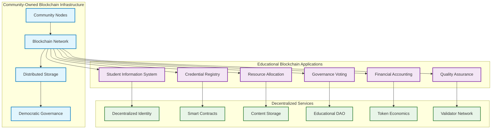
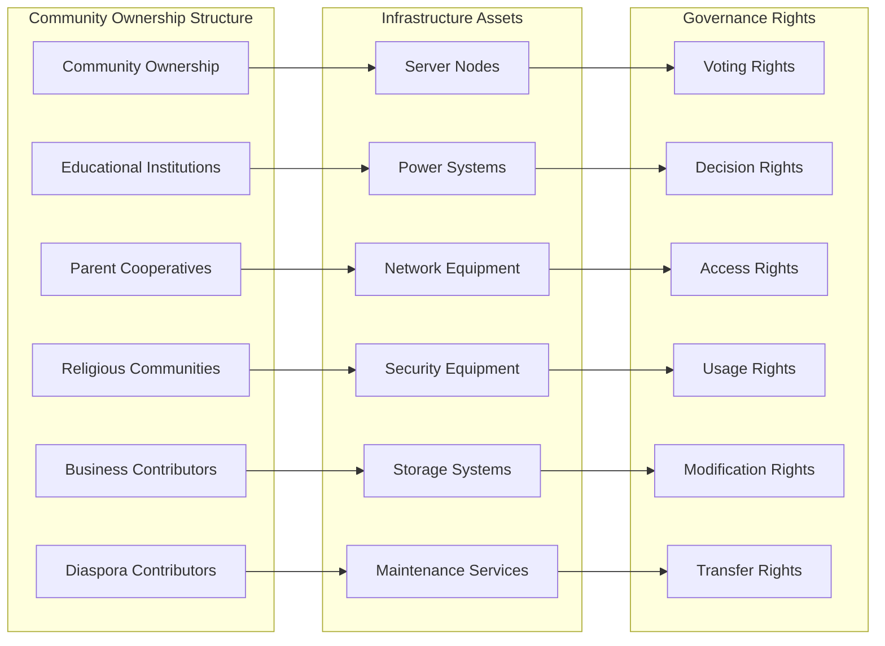
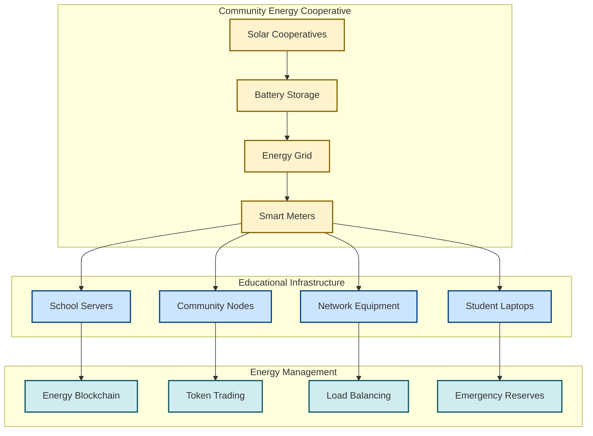

# Blockchain-Integrated Educational Federation: Community-Owned Infrastructure
## Decentralized Educational Sovereignty Through Community-Controlled Blockchain Infrastructure

### Executive Summary: Blockchain-Enhanced Educational Decentralization

Blockchain integration transforms educational institutions from centralized, vulnerable systems into truly decentralized, community-owned networks where student records, institutional governance, resource allocation, and academic credentials exist on community-controlled blockchain infrastructure. This approach ensures **permanent community ownership**, **democratic governance**, and **complete data sovereignty**.



---

## 1. Community-Owned Blockchain Infrastructure Architecture

### Distributed Node Network for Educational Sovereignty

**Community-Controlled Validator Nodes**:
```yaml
Community Node Architecture:
  Hardware Specifications:
    - Raspberry Pi 4 (8GB RAM) or equivalent
    - 1TB SSD storage for blockchain and educational data
    - Solar power systems (500W-1kW) for energy independence
    - Redundant internet connectivity (cellular + satellite backup)
    - Hardware security modules for key management
  
  Geographic Distribution:
    - Primary nodes: Each educational institution hosts validator
    - Community nodes: Religious centers, cooperatives, family clusters
    - Backup nodes: Diaspora community members globally
    - Emergency nodes: Mobile units for disaster recovery
  
  Democratic Control:
    - Node operators elected by community assemblies
    - Technical decisions require community approval
    - Governance tokens distributed equally across participants
    - Regular audits and transparency requirements
```

**Consensus Mechanism for Educational Governance**:
```javascript
// Community-Controlled Proof of Stake Implementation
class EducationalConsensus {
  constructor() {
    this.validators = new Map(); // Community-elected validators
    this.stakeholders = new Map(); // All educational participants
    this.governanceTokens = new Map(); // Democratic participation tokens
  }
  
  // Validators are teachers, parents, students, community leaders
  electValidator(candidate, communityVotes) {
    if (communityVotes.percentage > 0.6) {
      this.validators.set(candidate.id, {
        institution: candidate.school,
        community: candidate.community,
        stake: communityVotes.totalTokens,
        term: 2 // 2-year terms with democratic renewal
      });
    }
  }
  
  // Consensus requires agreement from multiple stakeholder types
  validateBlock(block) {
    const requiredValidators = {
      teachers: 2,
      parents: 2, 
      students: 1,
      community: 1
    };
    
    return this.hasStakeholderConsensus(block, requiredValidators);
  }
  
  // All educational decisions recorded on blockchain
  recordGovernanceDecision(proposal, votes, implementation) {
    return {
      proposalHash: this.hash(proposal),
      communityVotes: votes,
      implementationPlan: implementation,
      timestamp: Date.now(),
      immutable: true
    };
  }
}
```

### Local Infrastructure Ownership Models

**Cooperative Infrastructure Ownership**:


**Technical Implementation of Community Ownership**:
```yaml
Infrastructure Ownership Framework:
  Legal Structure:
    - Educational cooperative formed under Haitian law
    - Shared ownership agreements for all infrastructure
    - Democratic governance bylaws with blockchain enforcement
    - Community asset protection from external seizure
  
  Technical Architecture:
    - Multi-signature wallets controlling infrastructure funds
    - Smart contracts governing usage rights and responsibilities
    - Automated maintenance and upgrade protocols
    - Community-controlled access and security policies
  
  Economic Model:
    - Token-based contribution tracking (labor, funds, resources)
    - Democratic resource allocation through blockchain voting
    - Surplus revenue distributed to community members
    - Infrastructure expansion funded through cooperative decisions
```

---

## 2. Blockchain-Integrated Educational Information Systems

### Decentralized Student Information System (SIS)

**Student Records on Blockchain**:
```solidity
// Smart Contract for Decentralized Student Records
pragma solidity ^0.8.0;

contract DecentralizedSIS {
    struct StudentRecord {
        bytes32 studentId; // Cryptographic hash for privacy
        string encryptedPersonalData; // IPFS hash of encrypted data
        address[] authorizedInstitutions; // Schools with access rights
        mapping(address => bool) parentConsent; // Parental approval
        AcademicRecord[] academicHistory;
        SkillCredential[] certifications;
        bool transferrable; // Can move between institutions
    }
    
    struct AcademicRecord {
        address institution; // School blockchain address
        string courseHash; // IPFS hash of course content
        uint256 grade;
        uint256 timestamp;
        bytes32 teacherSignature; // Cryptographic verification
        bool verified; // Community verification status
    }
    
    mapping(bytes32 => StudentRecord) private students;
    mapping(address => bool) public authorizedInstitutions;
    
    // Only students/parents can authorize data access
    modifier onlyAuthorized(bytes32 studentId) {
        require(
            msg.sender == getStudentAddress(studentId) ||
            students[studentId].parentConsent[msg.sender],
            "Unauthorized access"
        );
        _;
    }
    
    // Community can verify academic records
    function verifyAcademicRecord(
        bytes32 studentId, 
        uint256 recordIndex,
        bytes32[] calldata communitySignatures
    ) external {
        require(communitySignatures.length >= 3, "Needs community consensus");
        students[studentId].academicHistory[recordIndex].verified = true;
    }
    
    // Students own and control their educational data
    function transferToNewInstitution(
        bytes32 studentId,
        address newInstitution
    ) external onlyAuthorized(studentId) {
        students[studentId].authorizedInstitutions.push(newInstitution);
        emit StudentTransfer(studentId, newInstitution);
    }
}
```

**Privacy-Preserving Academic Records**:
```yaml
Student Data Protection Framework:
  Encryption Layers:
    - Personal data encrypted with student/parent keys
    - Academic records use zero-knowledge proofs
    - Only aggregated, anonymous data for analytics
    - Community oversight of all data access
  
  Access Control:
    - Students control who accesses their records
    - Parents have oversight rights for minors
    - Teachers access only current classroom data
    - Institutions see only relevant academic history
  
  Data Portability:
    - Students can transfer records between any institution
    - Academic credentials recognized across federated network
    - No vendor lock-in or centralized control
    - International portability for diaspora students
```

### Blockchain-Based Credential Registry

**Immutable Academic Credentials**:
```javascript
// Decentralized Credential Verification System
class BlockchainCredentialRegistry {
  constructor(web3Provider, contractAddress) {
    this.web3 = web3Provider;
    this.contract = new this.web3.eth.Contract(ABI, contractAddress);
    this.ipfs = new IPFS();
  }
  
  // Issue verifiable credentials that employers can trust
  async issueCredential(studentId, courseData, teacherSignature) {
    // Store detailed course content on IPFS
    const courseContent = {
      curriculum: courseData.syllabus,
      assignments: courseData.projects,
      assessments: courseData.exams,
      culturalContent: courseData.haitianContext,
      skillsDemonstrated: courseData.competencies
    };
    
    const ipfsHash = await this.ipfs.add(JSON.stringify(courseContent));
    
    // Create tamper-proof credential on blockchain
    const credential = {
      studentHash: this.hashStudentId(studentId),
      institution: msg.sender,
      courseContentHash: ipfsHash,
      grade: courseData.finalGrade,
      teacherSignature: teacherSignature,
      communityVerification: [],
      timestamp: Date.now(),
      skillTokensEarned: this.calculateSkillTokens(courseData)
    };
    
    return await this.contract.methods.issueCredential(credential).send();
  }
  
  // Employers can verify credentials without central authority
  async verifyCredential(credentialHash, employerAddress) {
    const credential = await this.contract.methods
      .getCredential(credentialHash).call();
    
    const courseContent = await this.ipfs.get(credential.courseContentHash);
    
    return {
      verified: credential.communityVerification.length >= 3,
      institution: credential.institution,
      skills: courseContent.skillsDemonstrated,
      culturalCompetency: courseContent.haitianContext,
      employerAccess: this.hasEmployerPermission(employerAddress)
    };
  }
  
  // Skill tokens automatically granted for demonstrated competencies
  calculateSkillTokens(courseData) {
    return {
      TECH: courseData.technicalSkills * 10,
      KREYL: courseData.languageSkills * 10,
      COOP: courseData.cooperativeSkills * 10,
      LEAD: courseData.leadershipSkills * 10
    };
  }
}
```

### Democratic Resource Allocation via Blockchain

**Transparent Budget Management**:
```solidity
contract EducationalDAO {
    struct Proposal {
        string description;
        uint256 amount;
        address recipient;
        uint256 votesFor;
        uint256 votesAgainst;
        mapping(address => bool) hasVoted;
        bool executed;
        ProposalType proposalType;
    }
    
    enum ProposalType {
        EQUIPMENT_PURCHASE,
        TEACHER_SALARY,
        INFRASTRUCTURE_UPGRADE,
        COMMUNITY_PROGRAM,
        EMERGENCY_FUND
    }
    
    mapping(uint256 => Proposal) public proposals;
    mapping(address => uint256) public stakeholderTokens;
    
    // Teachers, parents, students, community all get voting tokens
    function distributeGovernanceTokens() external {
        // Equal representation across stakeholder groups
        uint256 tokensPerGroup = totalTokens / 4;
        
        distributeToGroup(teachers, tokensPerGroup);
        distributeToGroup(parents, tokensPerGroup);
        distributeToGroup(students, tokensPerGroup);
        distributeToGroup(community, tokensPerGroup);
    }
    
    // All budget decisions require democratic approval
    function vote(uint256 proposalId, bool support) external {
        require(stakeholderTokens[msg.sender] > 0, "No voting rights");
        require(!proposals[proposalId].hasVoted[msg.sender], "Already voted");
        
        if (support) {
            proposals[proposalId].votesFor += stakeholderTokens[msg.sender];
        } else {
            proposals[proposalId].votesAgainst += stakeholderTokens[msg.sender];
        }
        
        proposals[proposalId].hasVoted[msg.sender] = true;
        
        // Execute if reaches 60% approval
        if (proposals[proposalId].votesFor > totalTokens * 6 / 10) {
            executeProposal(proposalId);
        }
    }
    
    // Automatic execution of approved community decisions
    function executeProposal(uint256 proposalId) internal {
        Proposal storage proposal = proposals[proposalId];
        require(!proposal.executed, "Already executed");
        
        // Transfer funds according to community decision
        payable(proposal.recipient).transfer(proposal.amount);
        proposal.executed = true;
        
        emit ProposalExecuted(proposalId, proposal.recipient, proposal.amount);
    }
}
```

---

## 3. Decentralized Content Storage and Knowledge Management

### IPFS Integration for Educational Content

**Distributed Educational Content Storage**:
```javascript
// Decentralized Educational Content Management
class EducationalIPFS {
  constructor() {
    this.ipfs = new IPFS({
      config: {
        Addresses: {
          Swarm: [
            '/ip4/0.0.0.0/tcp/4001',
            '/ip4/127.0.0.1/tcp/4001/ws'
          ]
        },
        Bootstrap: [
          // Community-controlled bootstrap nodes
          '/ip4/haiti-education-node-1.community/tcp/4001/ipfs/QmHash1',
          '/ip4/haiti-education-node-2.community/tcp/4001/ipfs/QmHash2'
        ]
      }
    });
  }
  
  // Store educational content with community verification
  async storeEducationalContent(content, metadata) {
    const contentData = {
      title: content.title,
      subject: content.subject,
      gradeLevel: content.gradeLevel,
      language: content.language, // Prioritize Kreyòl
      culturalContext: content.haitianRelevance,
      pedagogicalApproach: content.methodology,
      assessmentCriteria: content.evaluation,
      communityReview: {
        culturalAppropriateness: null,
        academicQuality: null,
        languageAccuracy: null,
        communityRelevance: null
      },
      blockchain_hash: null // Will be set after blockchain registration
    };
    
    // Add to IPFS network
    const { cid } = await this.ipfs.add(JSON.stringify(contentData));
    
    // Register on blockchain for immutable record
    await this.registerOnBlockchain(cid, metadata);
    
    return cid;
  }
  
  // Community-controlled content curation
  async reviewContent(contentCid, reviewerType, rating, comments) {
    const content = await this.ipfs.get(contentCid);
    const contentData = JSON.parse(content);
    
    // Different stakeholders review different aspects
    switch(reviewerType) {
      case 'TEACHER':
        contentData.communityReview.academicQuality = rating;
        break;
      case 'PARENT':
        contentData.communityReview.culturalAppropriateness = rating;
        break;
      case 'ELDER':
        contentData.communityReview.culturalAccuracy = rating;
        break;
      case 'STUDENT':
        contentData.communityReview.engagement = rating;
        break;
    }
    
    // Create new version with review
    const updatedCid = await this.ipfs.add(JSON.stringify(contentData));
    await this.updateBlockchainRecord(contentCid, updatedCid);
    
    return updatedCid;
  }
  
  // Automatic replication across community nodes
  async ensureContentAvailability(contentCid) {
    const communityNodes = await this.getCommunityNodes();
    
    for (const node of communityNodes) {
      try {
        await this.ipfs.pin.add(contentCid, { recursive: true });
        await this.replicateToNode(node, contentCid);
      } catch (error) {
        console.log(`Replication to ${node} failed, trying next node`);
      }
    }
  }
}
```

**Community-Controlled Knowledge Base**:
```yaml
Decentralized Knowledge Management:
  Content Categories:
    - Haitian History and Culture (Kreyòl-first)
    - Traditional Knowledge and Practices
    - Academic Curricula (all subjects)
    - Vocational and Technical Training
    - Community-Generated Educational Materials
    - Diaspora Educational Resources
  
  Community Curation Process:
    - Content proposed by any community member
    - Review by relevant stakeholder groups
    - Democratic approval through blockchain voting
    - Continuous community feedback and updates
    - Version control and improvement tracking
  
  Access Control:
    - All educational content freely accessible
    - Community maintains control over content standards
    - No external censorship or content removal
    - Democratic decisions on content policies
```

---

## 4. Community Infrastructure Deployment and Management

### Local Server Infrastructure

**Community-Owned Server Farms**:
```yaml
Distributed Infrastructure Model:
  Institution-Level Servers:
    - Each school hosts primary educational applications
    - Redundant backup systems across federated network
    - Solar-powered with battery backup for resilience
    - Community technicians trained for maintenance
  
  Community Computing Cooperatives:
    - Shared server resources across multiple institutions
    - Economies of scale for expensive equipment
    - Democratic governance of computing resources
    - Revenue generation through external service provision
  
  Household-Level Nodes:
    - Family-owned blockchain validator nodes
    - Contribute computing power to educational network
    - Earn tokens for network participation
    - Basic internet access and digital literacy support
```

**Technical Architecture for Community Ownership**:
```javascript
// Community Infrastructure Management Smart Contract
contract CommunityInfrastructure {
    struct InfrastructureNode {
        address owner; // Institution or community group
        string nodeType; // SERVER, STORAGE, NETWORK, POWER
        uint256 capacity; // Available resources
        uint256 contribution; // Resources provided to network
        uint256 tokensEarned; // Compensation for contribution
        bool operational; // Current status
        mapping(address => uint256) accessRights;
    }
    
    mapping(bytes32 => InfrastructureNode) public nodes;
    mapping(address => uint256) public contributionTokens;
    
    // Register community-owned infrastructure
    function registerNode(
        string memory nodeId,
        string memory nodeType,
        uint256 capacity
    ) external {
        bytes32 nodeHash = keccak256(abi.encodePacked(nodeId));
        
        nodes[nodeHash] = InfrastructureNode({
            owner: msg.sender,
            nodeType: nodeType,
            capacity: capacity,
            contribution: 0,
            tokensEarned: 0,
            operational: true
        });
        
        // Grant democratic governance tokens for infrastructure contribution
        contributionTokens[msg.sender] += calculateGovernanceTokens(capacity);
    }
    
    // Distribute usage fees to infrastructure contributors
    function distributeRevenue(bytes32 nodeHash, uint256 usage) external {
        InfrastructureNode storage node = nodes[nodeHash];
        
        // Infrastructure owners earn tokens for network contribution
        uint256 earnings = calculateEarnings(usage, node.capacity);
        node.tokensEarned += earnings;
        
        // Tokens can be used for governance or converted to local currency
        emit RevenueDistributed(node.owner, earnings, block.timestamp);
    }
    
    // Community can vote to upgrade or replace infrastructure
    function proposeInfrastructureUpgrade(
        bytes32 nodeHash,
        string memory upgradeDescription,
        uint256 cost
    ) external {
        // Democratic process for infrastructure decisions
        createProposal(upgradeDescription, cost, msg.sender);
    }
}
```

### Energy Independence and Sustainability

**Solar-Powered Educational Infrastructure**:


**Energy Trading and Resource Optimization**:
```solidity
contract EnergyCooperative {
    struct EnergyNode {
        address owner;
        uint256 capacity; // Solar panel capacity in watts
        uint256 storage; // Battery storage in watt-hours
        uint256 currentProduction;
        uint256 currentConsumption;
        bool sharingEnabled;
    }
    
    mapping(address => EnergyNode) public energyNodes;
    mapping(address => uint256) public energyTokens;
    
    // Schools and institutions share excess solar energy
    function shareEnergy(address recipient, uint256 amount) external {
        require(energyNodes[msg.sender].sharingEnabled, "Sharing disabled");
        require(getExcessCapacity(msg.sender) >= amount, "Insufficient excess");
        
        // Transfer energy credits via blockchain
        energyTokens[msg.sender] -= amount;
        energyTokens[recipient] += amount;
        
        // Physical energy sharing coordinated automatically
        coordinateEnergyTransfer(msg.sender, recipient, amount);
        
        emit EnergyShared(msg.sender, recipient, amount);
    }
    
    // Democratic decisions on energy infrastructure investments
    function proposeEnergyUpgrade(
        string memory description,
        uint256 cost,
        uint256 capacityIncrease
    ) external {
        // Community voting on energy infrastructure expansion
        createEnergyProposal(description, cost, capacityIncrease, msg.sender);
    }
    
    // Automatic load balancing during peak educational usage
    function balanceEducationalLoad() external {
        // Priority given to educational applications during school hours
        for (address node in energyNodes) {
            if (isEducationalPeak()) {
                allocateEnergyPriority(node, "EDUCATIONAL");
            }
        }
    }
}
```

---

## 5. Practical Implementation Roadmap

### Phase 1: Foundation Infrastructure (Months 1-6)

**Community Node Deployment**:
```yaml
Technical Implementation Steps:
  Month 1-2: Community Consultation and Planning
    - Democratic assemblies to approve blockchain participation
    - Technical training for community node operators
    - Solar installation planning and procurement
    - Hardware acquisition and security preparation
  
  Month 3-4: Infrastructure Deployment
    - Solar systems installation with battery backup
    - Blockchain validator nodes setup and testing
    - IPFS storage nodes configuration
    - Network mesh establishment
  
  Month 5-6: Educational Integration
    - Student Information System migration to blockchain
    - Teacher training on decentralized platforms
    - Parent education on data privacy and control
    - Community governance structure activation
```

**Success Metrics for Blockchain Integration**:
- 100% uptime for community-owned infrastructure
- 95% of student records successfully migrated to blockchain
- 80% community approval for governance decisions
- 60% reduction in infrastructure costs through cooperation
- Zero external control over educational data or decisions

### Phase 2: Advanced Blockchain Applications (Months 7-18)

**Expanded Decentralized Services**:
```yaml
Advanced Blockchain Integration:
  Smart Contract Governance:
    - Automated budget allocation based on community votes
    - Teacher salary distribution via cryptocurrency
    - Equipment purchasing through DAO mechanisms
    - Transparent expense tracking for all stakeholders
  
  Credential Recognition Network:
    - Inter-institutional credential verification
    - Employer integration for job placement
    - International credential portability
    - Skills token economy activation
  
  Community Economic Integration:
    - Educational token exchange with local businesses
    - Parent payment systems via cryptocurrency
    - Diaspora funding mechanisms through blockchain
    - Revenue sharing from educational services
```

### Phase 3: Full Ecosystem Decentralization (Months 19-36)

**Complete Sovereignty Achievement**:
```yaml
Full Decentralization Goals:
  Technical Independence:
    - 100% community-owned infrastructure
    - Independent internet connectivity via mesh networks
    - Autonomous power generation through solar cooperatives
    - Self-maintained hardware and software systems
  
  Economic Sovereignty:
    - Educational cryptocurrency accepted by local businesses
    - Tuition payments via community-controlled tokens
    - International funding received directly by communities
    - Revenue generation through educational services export
  
  Governance Autonomy:
    - All educational decisions made via blockchain democracy
    - Community control over curriculum and standards
    - Democratic oversight of external partnerships
    - Transparent, immutable record of all governance actions
```

---

## 6. Economic Benefits of Blockchain Integration

### Cost Reduction Through Decentralization

**Infrastructure Cost Comparison**:
```yaml
Traditional Centralized Model (per institution):
  Annual Costs:
    - Commercial hosting: $2,400-6,000
    - Software licensing: $5,000-15,000
    - IT support contracts: $10,000-25,000
    - Data backup services: $1,200-3,600
    - Security services: $3,000-8,000
  Total Annual Cost: $21,600-57,600

Community Blockchain Model (per institution):
  Initial Investment:
    - Solar power system: $8,000-12,000
    - Server hardware: $3,000-5,000
    - Network equipment: $2,000-3,000
    - Setup and training: $2,000-3,000
  Total Initial: $15,000-23,000
  
  Annual Operating Costs:
    - Maintenance: $1,000-2,000
    - Internet connectivity: $1,200-2,400
    - Hardware replacement: $500-1,000
    - Community technician: $2,000-4,000
  Total Annual: $4,700-9,400
  
Cost Savings: 65-85% reduction in annual costs
Payback Period: 8-18 months
```

### Revenue Generation Through Blockchain Services

**Community-Controlled Revenue Streams**:
```javascript
// Educational Revenue Distribution Smart Contract
contract EducationalRevenue {
    enum RevenueStream {
        EXTERNAL_TRAINING,
        TECHNICAL_SERVICES,
        CONTENT_LICENSING,
        DIASPORA_EDUCATION,
        CERTIFICATION_PROGRAMS
    }
    
    struct RevenueDistribution {
        uint256 communityShare; // 40% - community development
        uint256 teacherShare; // 30% - teacher compensation
        uint256 infrastructureShare; // 20% - maintenance and upgrades
        uint256 studentShare; // 10% - student programs and scholarships
    }
    
    mapping(RevenueStream => uint256) public revenueByStream;
    mapping(address => uint256) public stakeholderShares;
    
    // Democratic allocation of revenue
    function distributeRevenue(
        RevenueStream stream,
        uint256 amount
    ) external {
        RevenueDistribution memory distribution = getDistribution();
        
        // Automatic distribution based on community-approved percentages
        allocateFunds(community, amount * distribution.communityShare / 100);
        allocateFunds(teachers, amount * distribution.teacherShare / 100);
        allocateFunds(infrastructure, amount * distribution.infrastructureShare / 100);
        allocateFunds(students, amount * distribution.studentShare / 100);
        
        emit RevenueDistributed(stream, amount, block.timestamp);
    }
    
    // Community can vote to change revenue distribution
    function proposeRevenueChange(
        uint256 newCommunityShare,
        uint256 newTeacherShare,
        uint256 newInfrastructureShare,
        uint256 newStudentShare
    ) external {
        require(
            newCommunityShare + newTeacherShare + 
            newInfrastructureShare + newStudentShare == 100,
            "Percentages must sum to 100"
        );
        
        createRevenueProposal(
            newCommunityShare,
            newTeacherShare,
            newInfrastructureShare,
            newStudentShare
        );
    }
}
```

---

## 7. Security and Privacy in Community-Owned Systems

### Data Sovereignty and Privacy Protection

**Community-Controlled Data Governance**:
```solidity
contract DataSovereignty {
    struct DataRights {
        address dataOwner; // Student or parent
        mapping(address => bool) accessAuthorizations;
        string encryptionKey; // Community-managed encryption
        uint256 retentionPeriod; // Democratic retention policies
        bool allowAnalytics; // Opt-in for community research
    }
    
    mapping(bytes32 => DataRights) private dataRegistry;
    mapping(address => bool) public communityValidators;
    
    // Only data owners can grant access
    function authorizeDataAccess(
        bytes32 dataHash,
        address requester,
        string memory purpose
    ) external {
        require(msg.sender == dataRegistry[dataHash].dataOwner, "Not data owner");
        
        // Community validators verify legitimate educational purpose
        require(validateEducationalPurpose(purpose), "Invalid purpose");
        
        dataRegistry[dataHash].accessAuthorizations[requester] = true;
        
        emit DataAccessAuthorized(dataHash, requester, purpose);
    }
    
    // Community governance over data policies
    function updateDataPolicy(
        string memory policyDescription,
        uint256 newRetentionPeriod
    ) external {
        // Democratic process for data governance changes
        require(hasEightyPercentApproval(policyDescription), "Insufficient approval");
        
        // Apply new policy to all future data
        defaultRetentionPeriod = newRetentionPeriod;
        
        emit DataPolicyUpdated(policyDescription, newRetentionPeriod);
    }
    
    // Automatic data deletion after retention period
    function enforceDataRetention() external {
        for (bytes32 dataHash in dataRegistry) {
            if (isExpired(dataHash)) {
                delete dataRegistry[dataHash];
                emit DataDeleted(dataHash);
            }
        }
    }
}
```

### Cybersecurity for Community Infrastructure

**Distributed Security Architecture**:
```yaml
Community Security Framework:
  Multi-Layer Protection:
    - Hardware security modules at each node
    - Encrypted communication between all nodes
    - Zero-knowledge proofs for sensitive operations
    - Community-controlled access management
  
  Threat Detection:
    - Distributed monitoring across all nodes
    - AI-powered anomaly detection
    - Community incident response protocols
    - Automatic isolation of compromised nodes
  
  Recovery Mechanisms:
    - Data replicated across multiple community nodes
    - Disaster recovery protocols democratically approved
    - Emergency governance procedures for crisis situations
    - Community mutual aid for infrastructure restoration
```

---

## Call to Action: Building Community-Owned Educational Infrastructure

### Immediate Implementation Steps

1. **Community Consensus Building**: Engage educational stakeholders in democratic discussions about blockchain adoption
2. **Technical Capacity Development**: Train community members as blockchain node operators and system administrators
3. **Infrastructure Planning**: Design solar-powered, community-owned server infrastructure
4. **Pilot Program Launch**: Begin with 2-3 institutions to demonstrate feasibility and benefits
5. **Governance Structure Creation**: Establish democratic decision-making processes for blockchain network management

### Long-Term Vision: Educational Blockchain Sovereignty

Through community-owned blockchain infrastructure, Haitian educational institutions can achieve:

- **Complete Data Sovereignty**: Students and communities control all educational data
- **Economic Independence**: Reduced costs and new revenue streams through blockchain services
- **Democratic Governance**: All educational decisions made through transparent, community-controlled processes
- **Technical Resilience**: Infrastructure owned and operated by the community, independent of external control
- **Cultural Preservation**: Blockchain-based preservation of Haitian educational content and traditional knowledge

This framework represents more than technological innovation—it represents a fundamental shift toward **community ownership of the digital infrastructure that shapes educational futures**. By placing blockchain and server infrastructure under democratic community control, Haitian educational institutions can ensure that technology serves community priorities while building long-term economic sustainability and complete technological sovereignty.

**The question is not whether community-owned blockchain infrastructure can transform education—the technical architecture demonstrates clear feasibility. The question is which educational communities will lead this transformation toward complete digital sovereignty and serve as models for educational independence throughout the Caribbean and beyond.**