# Critical Blockchain Adoption Barriers: Technical, Cultural & Economic Analysis
## Realistic Assessment of Implementation Challenges in Haitian Educational Context

### Executive Summary: Critical Adoption Barriers

This analysis examines the specific technical complexity, traditional governance conflicts, and economic costs that represent significant barriers to blockchain adoption in Haitian educational institutions. These challenges may outweigh the potential benefits and should be carefully evaluated before implementation.

```mermaid
graph TD
    subgraph "Technical Complexity Barriers"
        KM[Key Management Crisis]
        SC[Smart Contract Vulnerabilities]
        NM[Network Maintenance Burden]
        TC[Transaction Complexity]
    end
    
    subgraph "Traditional Governance Conflicts"
        RA[Religious Authority]
        EC[Elder Councils]
        CB[Coumbite Structures]
        CR[Consensus vs Voting]
    end
    
    subgraph "Economic Cost Burdens"
        IC[Infrastructure Costs]
        OC[Operating Costs]
        TC[Training Costs]
        RC[Risk Costs]
    end
    
    subgraph "Adoption Prevention Outcomes"
        CC[Community Confusion]
        GF[Governance Fragmentation]
        EB[Economic Burden]
        AF[Adoption Failure]
    end
    
    KM --> CC
    SC --> AF
    NM --> EB
    TC --> CC
    
    RA --> GF
    EC --> GF
    CB --> GF
    CR --> GF
    
    IC --> EB
    OC --> EB
    TC --> EB
    RC --> AF
    
    CC --> AF
    GF --> AF
    EB --> AF
    
    classDef technical fill:#ffebee,stroke:#c62828,stroke-width:2px;
    classDef cultural fill:#fce4ec,stroke:#ad1457,stroke-width:2px;
    classDef economic fill:#fff3e0,stroke:#ef6c00,stroke-width:2px;
    classDef outcome fill:#f3e5f5,stroke:#7b1fa2,stroke-width:2px;
    
    class KM,SC,NM,TC technical;
    class RA,EC,CB,CR cultural;
    class IC,OC,TC,RC economic;
    class CC,GF,EB,AF outcome;
```



---

## 1. Technical Complexity Barriers That Prevent Adoption

### Critical Technical Knowledge Requirements

**1. Private Key Management - The Catastrophic Risk**
```yaml
Key Management Complexity:
  Fundamental Problem:
    - Private keys are long cryptographic strings (64 characters)
    - If lost, all funds and data are permanently inaccessible
    - No "password reset" or recovery mechanism exists
    - One mistake can destroy entire institutional treasury
  
  Real-World Scenarios in Educational Context:
    - School principal loses key → entire school budget permanently gone
    - Student loses key → all academic records permanently inaccessible
    - Teacher accidentally shares key → hackers drain educational funds
    - Hardware failure without backup → community loses governance control
  
  Required Knowledge Level:
    - Understanding of cryptographic hash functions
    - Secure backup procedures (seed phrases, hardware wallets)
    - Multi-signature wallet setup and coordination
    - Hardware security module management
    - Air-gapped computer operation for secure key generation
  
  Community Capacity Reality:
    - 61% adult literacy rate in Haiti
    - Limited computer literacy in rural communities
    - No local technical support for cryptographic systems
    - Language barriers (technical terms not in Kreyòl)
```

**Practical Example - School Budget Disaster Scenario**:
```
St. Marie School community raises $50,000 for infrastructure
Funds stored in blockchain wallet controlled by principal
Principal's computer crashes, private key backup corrupted
Result: $50,000 permanently lost, no recovery possible
Community loses trust in both blockchain and school leadership
Educational project collapses, families withdraw children
```

**2. Smart Contract Vulnerabilities and Bugs**
```yaml
Smart Contract Risks:
  Code Complexity:
    - Smart contracts written in Solidity programming language
    - Bugs in code can drain entire community treasuries
    - No way to fix bugs once contract is deployed
    - Community cannot understand or verify contract code
  
  Historical Disasters:
    - DAO hack (2016): $60 million stolen due to code bug
    - Parity wallet bug (2017): $300 million permanently frozen
    - Various DeFi hacks: Billions lost to smart contract vulnerabilities
  
  Educational Context Risks:
    - Student records could become permanently inaccessible
    - Automatic salary payments could malfunction
    - Governance voting could be manipulated through code exploits
    - Resource allocation could be hijacked by hackers
  
  Required Technical Knowledge:
    - Solidity programming language proficiency
    - Smart contract auditing and security analysis
    - Blockchain architecture and consensus mechanisms
    - Cryptographic security principles and attack vectors
```

**3. Network Maintenance and Validator Requirements**
```yaml
Blockchain Infrastructure Burden:
  Technical Requirements:
    - 24/7 server operation and monitoring
    - Software updates and security patches
    - Network synchronization and consensus participation
    - Hardware maintenance and replacement
  
  Validator Responsibilities:
    - Stake management and slashing risk
    - Network governance decisions
    - Software upgrade coordination
    - Dispute resolution and arbitration
  
  Community Capacity Gap:
    - No local blockchain developers in rural Haiti
    - Limited internet connectivity for reliable validation
    - Power grid instability affects network participation
    - Technical support requires expensive external consultants
  
  Failure Consequences:
    - Network partition isolates community from educational records
    - Validator slashing results in financial penalties
    - Software bugs can compromise entire educational database
    - Network attacks can manipulate governance decisions
```

**4. Transaction Complexity and User Experience Barriers**
```yaml
User Interface Complexity:
  Daily Operations Require:
    - Gas fee estimation and optimization
    - Transaction signing and verification
    - Wallet address management and verification
    - Network congestion monitoring and timing
  
  Error-Prone Processes:
    - Wrong address = permanent loss of funds
    - Insufficient gas = failed transaction with lost fees
    - Network congestion = delayed or failed operations
    - Wallet connection issues = inability to access records
  
  Educational Impact:
    - Teachers spend hours on transaction management vs. teaching
    - Parents confused by wallet interfaces abandon participation
    - Students locked out of records due to technical errors
    - Administrative burden overwhelms educational mission
```

---

## 2. Traditional Governance Conflicts with Blockchain Systems

### Haitian Traditional Authority Structures

**1. Religious Authority and Spiritual Leadership**
```yaml
Catholic/Protestant Leadership Structures:
  Traditional Authority:
    - Priests/pastors are ultimate spiritual and moral authorities
    - Religious leaders guide major community decisions
    - Church hierarchy provides structured decision-making
    - Spiritual validation required for major changes
  
  Blockchain Conflicts:
    - Individual voting vs. spiritual authority guidance
    - Automated smart contracts vs. pastoral discretion
    - Mathematical algorithms vs. spiritual discernment
    - Transparent voting vs. confidential confession/counsel
  
  Real Conflict Example:
    - Blockchain votes 70% for sex education curriculum
    - Pastor opposes based on religious doctrine
    - Traditional system: Pastor's authority overrides vote
    - Blockchain system: Code executes majority decision
    - Result: Community fractures along religious/secular lines
```

**2. Elder Councils and Gerontocracy**
```yaml
Traditional Elder Authority:
  Cultural Framework:
    - Age and experience = wisdom and authority
    - Elder councils make decisions for younger generations
    - Respect for traditional knowledge over new information
    - Consensus building through elder discussion and guidance
  
  Blockchain Democratic Conflicts:
    - One-person-one-vote vs. age-based authority
    - Algorithmic decisions vs. elder wisdom
    - Technical knowledge vs. life experience
    - Individual tokens vs. collective elder guidance
  
  Practical Conflict Scenario:
    - Young teacher proposes digital literacy curriculum
    - Blockchain vote: 60% support from parents and students
    - Elder council: Opposes as threat to traditional knowledge
    - Traditional system: Elders veto regardless of vote
    - Blockchain system: Smart contract implements majority decision
    - Result: Elders feel disrespected, withdraw from community governance
```

**3. Coumbite (Cooperative Work Groups) vs. Individual Blockchain Participation**
```yaml
Coumbite Traditional Structure:
  Collective Decision Making:
    - Group consensus through discussion and relationship
    - Decisions emerge from community work sessions
    - Leadership rotates based on project and expertise
    - Economic cooperation tied to social relationships
  
  Blockchain Individual Token Conflicts:
    - Individual wallets and private keys vs. collective ownership
    - Personal voting tokens vs. group consensus
    - Transparent individual votes vs. collective discussion
    - Individual economic rewards vs. shared community benefit
  
  Cultural Dissonance Example:
    - Traditional coumbite decides collectively on school priority
    - Blockchain requires individual token holders to vote separately
    - Community members uncomfortable with individual responsibility
    - Collective wisdom process replaced by mathematical vote counting
    - Social cohesion damaged by individualistic technical system
```

**4. Vodou Religious and Community Governance**
```yaml
Vodou Spiritual Authority:
  Traditional Framework:
    - Houngan/Mambo spiritual leaders guide community decisions
    - Spiritual consultation required for major changes
    - Ancestral wisdom channeled through religious ceremony
    - Community harmony prioritized over individual preferences
  
  Blockchain Conflicts:
    - Spiritual guidance vs. algorithmic governance
    - Ancestral consultation vs. smart contract automation
    - Sacred ceremony vs. digital voting platforms
    - Community harmony vs. transparent individual positions
  
  Deep Cultural Conflict:
    - Vodou tradition requires spiritual consultation before major decisions
    - Blockchain smart contracts execute automatically without spiritual input
    - Community members believe ancestors disapprove of automated governance
    - Traditional religious leaders cannot participate in "foreign" technology
    - Educational blockchain system seen as cultural colonialism
```

### Traditional Consensus vs. Blockchain Voting

**5. Consensus-Building vs. Mathematical Vote Counting**
```yaml
Traditional Haitian Consensus:
  Process Characteristics:
    - Extended discussion until community harmony achieved
    - Dissenting voices heard and concerns addressed
    - Flexible timing allowing for relationship repair
    - Decisions emerge from collective wisdom rather than vote counting
  
  Blockchain Voting Conflicts:
    - Fixed voting periods vs. flexible discussion timing
    - Mathematical majority vs. community consensus
    - Individual secret votes vs. public discussion
    - Permanent blockchain records vs. flexible relationship repair
  
  Community Fracture Scenario:
    - Traditional process: 40% oppose curriculum change initially
    - Through discussion and relationship building, community finds compromise
    - All members eventually support modified version
    - Blockchain process: 60% vote yes, 40% vote no, decision implemented
    - No opportunity for consensus building or relationship repair
    - Community permanently divided along vote lines recorded on blockchain
```

---

## 3. Economic Costs That Create Adoption Barriers

### Initial Infrastructure Investment Costs

**1. Hardware and Infrastructure Requirements**
```yaml
Per-Institution Costs:
  Blockchain Node Hardware:
    - Server hardware: $3,000-5,000
    - Uninterruptible power supply: $800-1,200
    - Network equipment: $500-1,000
    - Security hardware (HSM): $1,000-2,000
    - Environmental protection: $500-800
    - Total per institution: $5,800-10,000
  
  Community Network Infrastructure:
    - Mesh networking equipment: $2,000-3,000 per node
    - Fiber optic installation: $5,000-10,000 per mile
    - Satellite internet backup: $500-1,000/month
    - Solar power systems: $8,000-15,000 per location
    - Battery backup systems: $3,000-5,000 per location
    - Total network cost: $50,000-100,000+ for 10-school network
  
  Comparison to Current Educational Needs:
    - $10,000 blockchain infrastructure = 40 student scholarships for one year
    - $50,000 network cost = salaries for 10 teachers for one year
    - $100,000 total cost = complete school building renovation
```

**2. Ongoing Operating Costs**
```yaml
Annual Operating Expenses:
  Technical Maintenance:
    - Hardware replacement/repairs: $1,000-2,000/year per institution
    - Software updates and security: $500-1,000/year
    - Internet connectivity: $2,400-4,800/year (reliable commercial grade)
    - Electricity costs: $1,200-2,400/year (if grid-connected)
    - Insurance and security: $500-1,000/year
  
  Human Resources:
    - Community blockchain administrator: $6,000-12,000/year
    - Technical support consultant: $3,000-6,000/year
    - Security monitoring service: $2,000-4,000/year
    - Training and education programs: $2,000-4,000/year
  
  Transaction and Network Costs:
    - Blockchain transaction fees: $500-2,000/year depending on usage
    - Validator staking requirements: $10,000-50,000 locked capital
    - Network governance participation: $1,000-3,000/year in fees
  
  Total Annual Operating Cost: $15,000-35,000 per institution
  
  Educational Opportunity Cost:
    - $25,000 annual blockchain cost = 100 students' annual tuition
    - Same funds could hire 5 additional teachers
    - Or provide meals for 500 students for full year
    - Or purchase textbooks for 1,000 students
```

**3. Training and Capacity Building Costs**
```yaml
Community Education Investment:
  Technical Training Requirements:
    - Blockchain literacy for all community members: 40 hours minimum
    - Administrator training: 200+ hours over 6 months
    - Teacher integration training: 80 hours
    - Parent and community leader education: 60 hours
  
  Training Cost Breakdown:
    - Professional blockchain trainer: $200-400/day
    - Training materials and translation: $5,000-10,000
    - Community member time opportunity cost: $50,000-100,000
    - Travel and logistics for training: $3,000-5,000
    - Follow-up support and mentoring: $10,000-20,000/year
  
  Total Training Investment: $75,000-150,000 for community of 500 families
  
  Time Investment Reality:
    - 300 hours training per active participant
    - 100 active participants needed for viable system
    - 30,000 total community hours required
    - Equivalent to 15 full-time jobs for one year
    - Massive opportunity cost for agricultural/economic activities
```

**4. Risk and Security Costs**
```yaml
Financial Risk Management:
  Security Infrastructure:
    - Hardware security modules: $2,000-5,000
    - Multi-signature wallet setup: $1,000-2,000 consulting
    - Security auditing and testing: $5,000-10,000/year
    - Cybersecurity insurance: $2,000-5,000/year
    - Physical security for hardware: $3,000-5,000/year
  
  Risk Mitigation Costs:
    - Professional smart contract auditing: $20,000-50,000 per contract
    - Legal compliance consulting: $5,000-10,000/year
    - Emergency recovery planning: $3,000-5,000
    - Community insurance fund: 10-20% of total blockchain assets
  
  Potential Loss Scenarios:
    - Private key loss: 100% of stored funds (potentially $50,000-200,000)
    - Smart contract bug: 50-100% of affected funds
    - Validator slashing: 5-30% of staked tokens
    - Cyberattack: 10-100% of network assets
  
  Total Risk Management Cost: $40,000-100,000 initial + $20,000-40,000/year
```

### Comparative Economic Analysis

**5. Cost-Benefit Reality Check**
```yaml
Blockchain Implementation Total Cost (3-year projection):
  Initial Investment: $100,000-200,000
  Operating Costs: $45,000-105,000/year × 3 years = $135,000-315,000
  Training and Capacity: $75,000-150,000
  Risk Management: $100,000 + $60,000-120,000 = $160,000-220,000
  Total 3-Year Cost: $470,000-885,000

Alternative Educational Investment for Same Funds:
  Teacher Salaries: 50-90 teacher-years of employment
  Student Scholarships: 1,500-3,000 full scholarships
  School Infrastructure: 5-10 complete school renovations
  Educational Materials: Textbooks and supplies for 10,000+ students
  Community Health: Basic healthcare for 2,000 families for 3 years
  
Economic Reality:
  - Blockchain costs equivalent to operating 3-5 entire schools for 3 years
  - Benefits remain theoretical while costs are immediate and concrete
  - Community may achieve 90% of educational goals without blockchain
  - Risk of catastrophic loss exceeds potential benefits
  - Maintenance burden diverts resources from core educational mission
```

---

## 4. Realistic Adoption Scenario Analysis

### High-Risk Adoption Scenarios

**1. Technical Failure Cascade**
```yaml
Likely Failure Sequence:
  Month 1-3: Initial enthusiasm, basic training completed
  Month 4-6: First technical problems emerge, key management issues
  Month 7-12: Smart contract bugs discovered, funds temporarily locked
  Month 13-18: Community administrator burns out, technical debt accumulates
  Month 19-24: Major security incident or private key loss
  Month 25+: Community abandons blockchain, reverts to traditional systems
  
  Result: $100,000+ invested, no lasting educational improvement
```

**2. Cultural Fragmentation Scenario**
```yaml
Community Division Process:
  Traditional leaders reject blockchain governance as foreign imposition
  Younger, tech-savvy members embrace individual voting rights
  Religious authorities prohibit participation in "ungodly" technology
  Elder councils feel marginalized by algorithmic decision-making
  Community splits between "blockchain" and "traditional" factions
  
  Result: Social cohesion destroyed, educational mission compromised
```

**3. Economic Burden Collapse**
```yaml
Financial Sustainability Crisis:
  Initial funding covers setup but not ongoing costs
  Community cannot afford $25,000+ annual operating expenses
  Technical problems require expensive external consultants
  Cryptocurrency volatility destroys education budget stability
  Maintenance costs exceed projected benefits
  
  Result: Educational institution bankruptcy, community trust destroyed
```

### Low-Risk Alternative Assessment

**4. Traditional System Improvements**
```yaml
Achievable Educational Improvements Without Blockchain:
  Administrative Efficiency:
    - Simple database systems: $2,000-5,000 total cost
    - Shared Google Workspace: $300-600/year
    - Basic website and communication: $1,000-2,000
    - Standard accounting software: $500-1,000/year
  
  Educational Quality:
    - Teacher training programs: $10,000-20,000/year
    - Curriculum development: $5,000-10,000/year
    - Educational materials: $5,000-10,000/year
    - Student support programs: $10,000-20,000/year
  
  Community Engagement:
    - Regular community assemblies: $1,000-2,000/year
    - Parent education programs: $3,000-5,000/year
    - Cultural preservation projects: $2,000-5,000/year
    - Democratic governance training: $2,000-4,000/year
  
  Total Traditional Improvement Cost: $40,000-80,000 over 3 years
  Compared to Blockchain Cost: $470,000-885,000 over 3 years
  
  Educational Impact Comparison:
    - Traditional improvements: 90% of desired educational outcomes
    - Blockchain implementation: 95% of desired outcomes (if successful)
    - Cost difference: 6-10x more expensive for 5% improvement
    - Risk assessment: Traditional 95% success rate vs. Blockchain 20% success rate
```

---

## 5. Critical Decision Framework

### Red Flag Indicators Against Blockchain Adoption

**Community Readiness Assessment**:
```yaml
High-Risk Indicators:
  Technical Capacity:
    - Less than 5 community members with advanced computer skills
    - No local technical support available within 50 miles
    - Internet connectivity unreliable (< 95% uptime)
    - Power grid unstable (< 20 hours/day reliable power)
  
  Cultural Resistance:
    - Traditional leaders express skepticism or opposition
    - Community divided on technology adoption
    - Previous failed technology projects in community
    - Strong preference for consensus over voting systems
  
  Economic Constraints:
    - Community cannot afford $50,000+ annual operating costs
    - No sustainable revenue streams identified
    - Existing educational funding barely meets basic needs
    - No emergency funds for technical crisis response
  
  Governance Maturity:
    - Limited experience with democratic decision-making
    - Conflicts over educational policies in past 2 years
    - Unclear authority structures or ongoing leadership disputes
    - No experience managing complex community resources
```

### Alternative Implementation Recommendation

**6. Hybrid Approach for High-Risk Communities**
```yaml
Gradual Technology Integration:
  Phase 1: Traditional System Improvements (Year 1)
    - Democratic governance structures without blockchain
    - Simple digital tools for communication and record-keeping
    - Community education and consensus building
    - Economic stability and revenue stream development
  
  Phase 2: Limited Blockchain Pilots (Year 2-3)
    - Small-scale blockchain experiments with minimal risk
    - Educational blockchain literacy without full implementation
    - Partnership with established blockchain educational projects
    - Careful assessment of community readiness and cultural fit
  
  Phase 3: Full Implementation Decision (Year 4+)
    - Community vote on blockchain adoption after experience
    - Full cost-benefit analysis with real community data
    - Cultural integration assessment by traditional authorities
    - Economic sustainability proof before major investment
  
  Success Criteria for Advancement:
    - 95% community consensus on technology direction
    - Demonstrated ability to manage complex community resources
    - Stable economic foundation supporting operational costs
    - Cultural integration without traditional authority conflicts
```

---

## Conclusion: Realistic Blockchain Adoption Assessment

### Critical Success Requirements

**Blockchain implementation is viable ONLY if ALL of the following exist:**
1. **Technical Capacity**: 10+ community members with advanced technical skills
2. **Cultural Integration**: Traditional authorities embrace blockchain governance
3. **Economic Foundation**: Sustainable $50,000+ annual operating budget
4. **Community Unity**: 90%+ consensus on blockchain adoption
5. **Risk Tolerance**: Community can absorb 50-100% financial loss without catastrophe
6. **Governance Maturity**: Proven track record of managing complex community decisions

### Realistic Alternative Assessment

**For most Haitian educational communities:**
- **Traditional system improvements achieve 90% of desired outcomes**
- **Cost 6-10x less than blockchain implementation**
- **Success probability 95% vs. 20% for blockchain**
- **Cultural compatibility 95% vs. 30% for blockchain**
- **Maintenance burden manageable vs. overwhelming**

### Final Recommendation Framework

**Blockchain should be pursued IF:**
- Community demonstrates exceptional technical capacity
- Traditional governance structures explicitly endorse blockchain integration
- Sustainable funding exceeds $100,000 annually
- Community has successful experience managing complex technology projects
- Risk tolerance allows for potential complete financial loss

**Traditional improvements should be prioritized IF:**
- Any of the above conditions are not met
- Community prioritizes educational outcomes over technological innovation
- Limited resources need maximum educational impact
- Cultural preservation is important community value
- Governance harmony is fragile

**The honest assessment: For 95% of Haitian educational communities, traditional system improvements will achieve better educational outcomes at lower cost with higher success probability than blockchain implementation.**

The blockchain vision is compelling, but the practical barriers—technical complexity, cultural conflicts, and economic costs—likely outweigh the benefits for most real-world educational communities in Haiti.