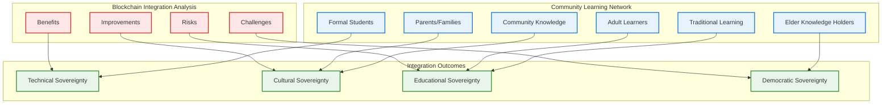
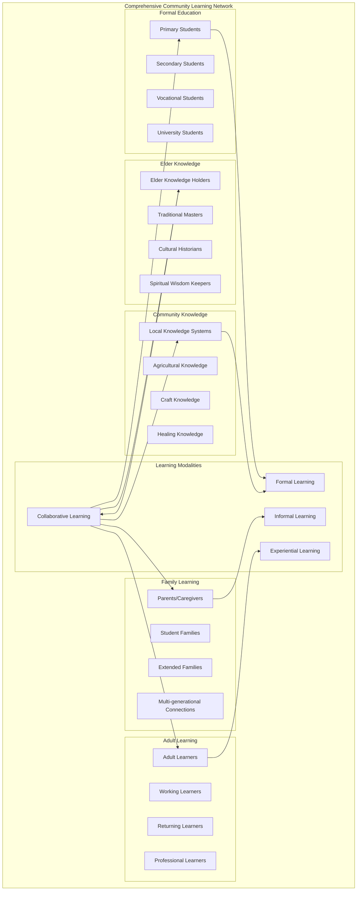

# Blockchain Integration Analysis & Community Learning Network Framework
## Comprehensive Benefits, Risks, and Intergenerational Educational Sovereignty

### Executive Summary: Critical Analysis of Blockchain Educational Integration

This analysis examines the transformational benefits, significant risks, and implementation challenges of blockchain integration in educational systems, while expanding the framework to include parents, adult learners, elder knowledge holders, and community-based learning networks in a comprehensive intergenerational educational sovereignty model.



---

## 1. Blockchain Integration: Benefits Analysis

### Transformational Benefits

**1. Complete Data Sovereignty and Community Control**
```yaml
Data Ownership Benefits:
  Student Records:
    - Students/families own their educational data permanently
    - No external company can access or monetize student information
    - Data portability across any institution globally
    - Permanent protection from data breaches or misuse
  
  Institutional Independence:
    - Schools own their administrative systems completely
    - No vendor lock-in or subscription dependencies
    - Community-controlled data policies and access rules
    - Democratic governance over all data decisions
  
  Cultural Protection:
    - Community knowledge remains under community control
    - Traditional education methods preserved immutably
    - Cultural content cannot be censored or altered externally
    - Intergenerational knowledge transfer protected
```

**2. Economic Transformation and Sustainability**
```yaml
Financial Benefits:
  Cost Reduction:
    - 65-85% reduction in annual IT infrastructure costs
    - Elimination of software licensing fees ($5,000-15,000 annually)
    - Shared infrastructure costs across federated network
    - Community ownership eliminating vendor profits
  
  Revenue Generation:
    - Cryptocurrency earned through network participation
    - Educational services export to global markets
    - Diaspora direct payments without intermediary fees
    - Community-controlled monetization of educational content
  
  Economic Democracy:
    - Transparent budget allocation through smart contracts
    - Community voting on all financial decisions
    - Automated, corruption-resistant fund distribution
    - Local wealth creation through blockchain services
```

**3. Democratic Governance and Transparency**
```yaml
Governance Improvements:
  Decision-Making:
    - All stakeholders vote on educational policies
    - Transparent, immutable record of all decisions
    - Automated implementation of community choices
    - Protection from external political interference
  
  Accountability:
    - Real-time tracking of resource allocation
    - Public audit trails for all transactions
    - Community oversight of institutional performance
    - Democratic removal and appointment processes
  
  Participation:
    - Parents, students, teachers equal voting rights
    - Elder knowledge holders formal recognition
    - Community members direct policy influence
    - Diaspora participation in homeland education
```

**4. Technical Resilience and Independence**
```yaml
Infrastructure Benefits:
  Reliability:
    - Distributed systems resistant to single points of failure
    - Community-owned infrastructure reduces external dependencies
    - Mesh networking provides connectivity during outages
    - Solar power independence from unreliable grid
  
  Security:
    - Cryptographic protection superior to centralized systems
    - Community-controlled access and authentication
    - Immutable audit trails preventing data manipulation
    - Distributed backups across multiple community nodes
  
  Scalability:
    - Network grows stronger with more participants
    - Resource sharing improves efficiency at scale
    - Cross-institutional collaboration enhanced
    - Global connectivity while maintaining local control
```

---

## 2. Significant Risks and Challenges

### Critical Technical Risks

**1. Complexity and Technical Barriers**
```yaml
Technical Challenges:
  Community Capacity:
    - Blockchain technology requires specialized knowledge
    - Key management critical security vulnerability
    - Software updates and maintenance complexity
    - Community technicians need extensive training
  
  Infrastructure Requirements:
    - Reliable internet connectivity essential for blockchain
    - Hardware costs significant for community budgets
    - Energy consumption concerns (though mitigated by PoS)
    - Physical security of community-owned equipment
  
  Scalability Limitations:
    - Blockchain transaction throughput constraints
    - Storage requirements grow continuously
    - Network congestion during peak usage
    - Cross-chain interoperability challenges
```

**2. Governance and Social Risks**
```yaml
Democratic Governance Challenges:
  Decision-Making Conflicts:
    - Community disagreements on technical directions
    - Generational divides on technology adoption
    - Potential for blockchain governance to become technocratic
    - Risk of excluding less technical community members
  
  Power Concentration:
    - Technical experts may gain disproportionate influence
    - Early adopters accumulate more governance tokens
    - Digital divide creates participation inequalities
    - Risk of informal power structures outside blockchain
  
  Cultural Resistance:
    - Traditional authority structures may conflict with blockchain democracy
    - Elder knowledge holders may resist digital systems
    - Community members suspicious of "cryptocurrency"
    - Potential loss of human relationship aspects in governance
```

**3. Economic and Financial Risks**
```yaml
Financial Vulnerabilities:
  Volatility and Uncertainty:
    - Cryptocurrency value fluctuations affect budgets
    - Regulatory changes could impact blockchain operations
    - Initial investment costs strain community resources
    - Revenue projections may not materialize as expected
  
  Dependency Risks:
    - Over-reliance on blockchain systems for critical functions
    - Difficulty reverting to traditional systems if needed
    - Vendor lock-in to specific blockchain platforms
    - Community economic disruption during transition
  
  Security Risks:
    - Private key loss could result in permanent fund/data loss
    - Smart contract bugs could drain community treasuries
    - Cyberattacks targeting community infrastructure
    - Social engineering attacks on community members
```

### Implementation Challenges

**4. Social and Cultural Integration Challenges**
```yaml
Community Adoption Barriers:
  Digital Literacy:
    - 61% adult literacy rate complicates blockchain education
    - Elder learners may struggle with digital interfaces
    - Complex concepts difficult to explain in community languages
    - Risk of creating digital exclusion within communities
  
  Trust and Acceptance:
    - Blockchain concepts abstract and difficult to understand
    - Community members may prefer familiar traditional systems
    - Skepticism about "technology solutions" to social problems
    - Concerns about external influence through technology
  
  Cultural Appropriateness:
    - Blockchain governance may conflict with traditional decision-making
    - Individual ownership concepts vs. communal knowledge traditions
    - Technology-mediated relationships vs. personal community bonds
    - Risk of technological determinism overriding cultural values
```

**5. Regulatory and Legal Risks**
```yaml
Legal and Regulatory Challenges:
  Government Relations:
    - Unclear legal status of blockchain systems in Haiti
    - Potential conflicts with existing educational regulations
    - Government surveillance concerns with encrypted systems
    - Tax implications of cryptocurrency-based transactions
  
  International Compliance:
    - Cross-border data transfer regulations
    - Cryptocurrency regulations in diaspora countries
    - Educational credential recognition by foreign institutions
    - Compliance with international aid and development policies
  
  Liability and Responsibility:
    - Legal liability for community-operated infrastructure
    - Responsibility for student data protection across borders
    - Insurance and risk management for community assets
    - Dispute resolution mechanisms for cross-border conflicts
```

---

## 3. Risk Mitigation Strategies

### Technical Risk Mitigation

**Gradual Implementation and Hybrid Systems**:
```yaml
Phased Deployment Approach:
  Phase 1: Traditional systems with blockchain overlay
    - Existing systems continue operating
    - Blockchain adds transparency without replacing core functions
    - Community learns blockchain concepts gradually
    - Risk limited to pilot programs
  
  Phase 2: Parallel operation of old and new systems
    - Critical functions maintained in traditional systems
    - Blockchain gradually takes over non-critical functions
    - Community builds confidence through experience
    - Easy rollback if serious problems emerge
  
  Phase 3: Full blockchain integration
    - Only after community demonstrates readiness
    - Comprehensive training and support systems in place
    - Multiple backup and recovery mechanisms
    - Community votes democratically on final transition
```

**Community Capacity Building**:
```yaml
Technical Training Framework:
  Multi-Level Training:
    - Basic blockchain literacy for all community members
    - Intermediate training for parents and adult learners
    - Advanced technical training for community administrators
    - Continuous education and support programs
  
  Cultural Integration:
    - Blockchain concepts explained using Haitian cultural metaphors
    - Training materials in Kreyòl with visual aids
    - Elder knowledge holders involved in training design
    - Intergenerational learning partnerships
  
  Redundancy and Support:
    - Multiple community members trained for each critical role
    - Partnerships with technical institutions for advanced support
    - Documentation and procedures in accessible formats
    - Emergency support networks across federated communities
```

### Social and Cultural Risk Mitigation

**Democratic Safeguards and Inclusive Governance**:
```yaml
Inclusive Participation Framework:
  Multi-Modal Participation:
    - Voice-based interfaces for low-literacy community members
    - Physical voting mechanisms alongside digital systems
    - Community assembly integration with blockchain governance
    - Traditional authority recognition within digital systems
  
  Cultural Protection:
    - Community values embedded in smart contract governance
    - Traditional decision-making processes honored and integrated
    - Elder veto power over decisions affecting cultural knowledge
    - Continuous community dialogue on technology appropriateness
  
  Democratic Oversight:
    - Regular community assemblies to review blockchain operations
    - Democratic ability to modify or abandon blockchain systems
    - Community control over all technical policy decisions
    - Transparent processes for addressing governance conflicts
```

---

## 4. Expanded Community Learning Network Framework

### Intergenerational Educational Ecosystem



### Parents and Family Integration Framework

**Parents as Educational Partners and Learners**:
```yaml
Parent Integration Model:
  Educational Governance:
    - Equal voting rights with teachers in school decisions
    - Parent representatives on federated education councils
    - Community assemblies for major educational policy decisions
    - Parent-led evaluation of educational outcomes
  
  Learning Participation:
    - Adult literacy programs integrated with children's education
    - Parent education on supporting children's learning
    - Technology training enabling family digital participation
    - Economic education supporting family financial literacy
  
  Knowledge Contribution:
    - Parent expertise documented and shared across network
    - Traditional child-rearing knowledge preserved digitally
    - Family history and cultural knowledge integrated into curricula
    - Parent-led workshops and community education programs
  
  Economic Participation:
    - Parent cooperatives providing educational support services
    - Income generation through educational network participation
    - Shared childcare enabling parent education and work
    - Family economic planning integrated with educational goals
```

**Family Learning Ecosystems**:
```javascript
// Smart Contract for Family Learning Integration
contract FamilyLearningNetwork {
    struct FamilyProfile {
        address[] familyMembers;
        mapping(address => LearnerProfile) memberProfiles;
        string[] culturalKnowledge;
        uint256 participationTokens;
        bool activeInGovernance;
        LearningGoal[] familyGoals;
    }
    
    struct LearnerProfile {
        string role; // PARENT, CHILD, ELDER, EXTENDED
        string[] learningInterests;
        string[] knowledgeToShare;
        uint256 skillTokensEarned;
        LearningPath currentPath;
        bool mentorshipRole;
    }
    
    mapping(bytes32 => FamilyProfile) public families;
    mapping(address => bytes32) public memberToFamily;
    
    // Families earn tokens for educational participation
    function recordFamilyLearningActivity(
        bytes32 familyHash,
        string memory activity,
        address[] memory participants,
        uint256 duration
    ) external {
        FamilyProfile storage family = families[familyHash];
        
        // Reward family-based learning activities
        uint256 tokens = calculateFamilyTokens(activity, participants, duration);
        family.participationTokens += tokens;
        
        // Special bonuses for intergenerational learning
        if (hasMultipleGenerations(participants)) {
            family.participationTokens += tokens / 2; // 50% bonus
        }
        
        emit FamilyLearningRecorded(familyHash, activity, tokens);
    }
    
    // Parents vote on educational policies affecting their children
    function familyVote(
        bytes32 familyHash,
        uint256 proposalId,
        bool support,
        string memory rationale
    ) external {
        require(isAuthorizedFamilyMember(msg.sender, familyHash), "Unauthorized");
        
        // Family voting weight based on participation and children enrolled
        uint256 votingWeight = calculateFamilyVotingWeight(familyHash);
        
        recordVote(proposalId, support, votingWeight, rationale);
        
        emit FamilyVoteRecorded(familyHash, proposalId, support, votingWeight);
    }
}
```

### Adult and Continuing Education Integration

**Adult Learning Pathways**:
```yaml
Adult Education Framework:
  Flexible Scheduling:
    - Evening and weekend learning programs
    - Self-paced online learning modules
    - Workplace-integrated education opportunities
    - Community-based learning circles
  
  Practical Skills Focus:
    - Digital literacy for economic participation
    - Business and entrepreneurship education
    - Cooperative management and leadership skills
    - Financial literacy and blockchain education
  
  Recognition and Certification:
    - Prior learning recognition and blockchain credentialing
    - Competency-based advancement rather than time-based
    - Stackable credentials building toward larger qualifications
    - Community validation of practical skills and knowledge
  
  Economic Integration:
    - Adult education tied to local economic opportunities
    - Cooperative business development through education
    - Skills training aligned with community needs assessment
    - Income generation during learning through work-study programs
```

**Professional Development Networks**:
```yaml
Continuing Education Model:
  Teacher Professional Development:
    - Peer learning networks across federated schools
    - Master teacher mentorship programs
    - Action research and classroom innovation
    - Cultural competency and traditional knowledge integration
  
  Community Professional Development:
    - Health worker continuing education
    - Cooperative leadership development
    - Technical skills advancement
    - Cultural preservation and development skills
  
  Cross-Sector Learning:
    - Business-education partnerships for skills development
    - Healthcare-education integration for community health
    - Agricultural extension education for food security
    - Cultural sector development for community identity
```

### Elder Knowledge Integration and Preservation

**Elder Knowledge Holders as Master Teachers**:
```yaml
Elder Integration Framework:
  Knowledge Documentation:
    - Oral history recording and blockchain preservation
    - Traditional skill demonstration videos on PeerTube
    - Cultural practice documentation in community languages
    - Spiritual and philosophical knowledge preservation
  
  Teaching Roles:
    - Elder master teachers in formal educational settings
    - Traditional craft instruction integrated into vocational training
    - Cultural wisdom integration into social studies curricula
    - Conflict resolution and community governance teaching
  
  Governance Participation:
    - Elder councils with special advisory roles in educational decisions
    - Cultural appropriateness review of all educational content
    - Traditional authority integration with democratic blockchain governance
    - Veto power over decisions affecting cultural knowledge
  
  Economic Recognition:
    - Elder teachers receive community tokens for knowledge sharing
    - Traditional knowledge licensing generates income for elders
    - Elder-led workshops provide economic opportunities
    - Cultural tourism development based on elder knowledge
```

**Intergenerational Knowledge Transfer Systems**:
```solidity
contract ElderKnowledgeRegistry {
    struct KnowledgeRecord {
        address elderTeacher;
        string knowledgeDomain; // AGRICULTURE, CRAFTS, MEDICINE, CULTURE
        string contentHash; // IPFS hash of recorded knowledge
        address[] youngerLearners;
        bool culturallyApproved;
        uint256 preservationValue; // Community assessment
        LearningPath[] applicationPaths;
    }
    
    mapping(bytes32 => KnowledgeRecord) public knowledgeRegistry;
    mapping(address => uint256) public elderTokens;
    
    // Elders earn special recognition tokens for knowledge sharing
    function recordKnowledgeTransfer(
        string memory knowledgeDomain,
        string memory contentHash,
        address[] memory learners
    ) external {
        bytes32 recordHash = keccak256(abi.encodePacked(
            msg.sender,
            knowledgeDomain,
            contentHash
        ));
        
        knowledgeRegistry[recordHash] = KnowledgeRecord({
            elderTeacher: msg.sender,
            knowledgeDomain: knowledgeDomain,
            contentHash: contentHash,
            youngerLearners: learners,
            culturallyApproved: false, // Requires community approval
            preservationValue: 0,
            applicationPaths: new LearningPath[](0)
        });
        
        // Elders earn special governance tokens for knowledge contribution
        elderTokens[msg.sender] += calculateElderTokens(knowledgeDomain, learners.length);
        
        emit KnowledgeTransferRecorded(recordHash, msg.sender, knowledgeDomain);
    }
    
    // Community validates cultural appropriateness of knowledge sharing
    function approveKnowledgeSharing(
        bytes32 recordHash,
        bytes32[] memory communitySignatures
    ) external {
        require(communitySignatures.length >= 5, "Needs community consensus");
        require(hasElderApproval(recordHash), "Needs elder council approval");
        
        knowledgeRegistry[recordHash].culturallyApproved = true;
        
        // Approved knowledge generates ongoing tokens for preservation
        elderTokens[knowledgeRegistry[recordHash].elderTeacher] += 100;
        
        emit KnowledgeApproved(recordHash);
    }
}
```

### Community Knowledge Systems Integration

**Traditional Knowledge Documentation and Preservation**:
```yaml
Community Knowledge Framework:
  Agricultural Knowledge:
    - Traditional farming methods and crop varieties
    - Seasonal planning and climate adaptation strategies
    - Natural pest management and soil preservation
    - Seed preservation and community seed banks
  
  Healing and Medicine:
    - Traditional medicinal plant knowledge
    - Community health practices and prevention
    - Spiritual healing and wellness traditions
    - Integration with modern healthcare approaches
  
  Crafts and Technology:
    - Traditional building techniques and materials
    - Artistic traditions and cultural expression
    - Tool-making and repair knowledge
    - Sustainable resource management practices
  
  Social Organization:
    - Traditional governance and conflict resolution
    - Community cooperation and mutual aid systems
    - Cultural ceremonies and community celebrations
    - Kinship systems and social responsibilities
```

**Community-Based Learning Modalities**:
```yaml
Informal Learning Networks:
  Learning Circles:
    - Community-organized discussion and learning groups
    - Peer-to-peer knowledge sharing across generations
    - Problem-solving focused on real community challenges
    - Cultural practices integrated into learning activities
  
  Apprenticeship Programs:
    - Master-apprentice relationships in traditional crafts
    - Modern skills training with traditional teaching methods
    - Cross-generational mentorship and support
    - Progression pathways from apprentice to master
  
  Community Projects:
    - Learning through participation in community development
    - Skills development through cooperative work
    - Problem-based learning addressing real community needs
    - Collective reflection and knowledge building
  
  Cultural Events:
    - Learning integrated into community celebrations
    - Storytelling and oral tradition preservation
    - Music, dance, and artistic expression as education
    - Cultural identity development through participation
```

---

## 5. Comprehensive Integration Benefits and Challenges

### Benefits of Expanded Community Integration

**Educational Transformation Benefits**:
```yaml
Holistic Learning Ecosystem:
  Knowledge Integration:
    - Traditional and modern knowledge systems combined
    - Intergenerational learning strengthens both
    - Cultural knowledge preserved and enhanced
    - Practical skills connected to academic learning
  
  Community Strengthening:
    - Shared learning goals unite community members
    - Cross-generational relationships deepened
    - Community identity reinforced through education
    - Social cohesion improved through common purpose
  
  Economic Development:
    - Community knowledge becomes economic asset
    - Local skills development meets local needs
    - Educational network generates community income
    - Traditional knowledge creates cultural tourism opportunities
  
  Cultural Sovereignty:
    - Community controls educational content and methods
    - Traditional knowledge systems receive equal status
    - Cultural transmission strengthened across generations
    - Community values embedded in all learning activities
```

### Integration Challenges and Mitigation

**Managing Complexity and Participation**:
```yaml
Inclusion Challenges:
  Participation Barriers:
    - Work schedules conflict with learning opportunities
    - Childcare needs limit parent participation
    - Transportation difficulties for rural community members
    - Language barriers for non-Kreyòl speakers
  
  Technology Access:
    - Digital divide excludes some community members
    - Internet connectivity limitations in rural areas
    - Device costs prohibitive for low-income families
    - Technical support needs exceed community capacity
  
  Cultural Conflicts:
    - Traditional authority vs. democratic blockchain governance
    - Individual vs. collective knowledge ownership concepts
    - Modern vs. traditional educational approaches
    - External vs. internal validation of knowledge
```

**Comprehensive Mitigation Strategies**:
```yaml
Inclusive Participation Solutions:
  Multiple Access Modes:
    - Voice-based and physical participation options
    - Mobile learning platforms for flexible access
    - Community-based childcare during learning activities
    - Transportation cooperatives for educational access
  
  Cultural Integration:
    - Traditional governance integrated with blockchain democracy
    - Community assemblies with digital and physical participation
    - Cultural values embedded in smart contract governance
    - Elder wisdom councils with formal advisory roles
  
  Capacity Building:
    - Progressive technology introduction with extensive support
    - Peer training networks across all community segments
    - Multilingual support and culturally appropriate interfaces
    - Community ownership of all technical infrastructure
```

---

## 6. Implementation Roadmap for Integrated Community Learning

### Phase 1: Foundation and Trust Building (Months 1-6)

**Community Engagement and Consensus Building**:
```yaml
Inclusive Planning Process:
  Community Assemblies:
    - Presentations to all community stakeholder groups
    - Democratic discussion of blockchain benefits and risks
    - Cultural appropriateness assessment by elder councils
    - Consensus building on participation terms
  
  Pilot Program Design:
    - Small-scale implementation with high community support
    - Emphasis on immediate, visible benefits
    - Traditional systems maintained alongside blockchain
    - Easy exit strategies if community decides against continuation
  
  Capacity Building:
    - Basic blockchain education for all community members
    - Technical training for community infrastructure operators
    - Cultural integration workshops for system design
    - Democratic governance training for blockchain participation
```

### Phase 2: Gradual Integration and Learning (Months 7-18)

**Expanded Participation and System Development**:
```yaml
Comprehensive Learning Network Activation:
  Formal Education Integration:
    - Student records gradually moved to blockchain systems
    - Teachers trained in blockchain-enhanced pedagogy
    - Parent participation in educational governance activated
    - Cross-institutional collaboration begins
  
  Community Learning Integration:
    - Adult education programs launched
    - Elder knowledge documentation projects begin
    - Family learning activities recognized and rewarded
    - Community knowledge preservation projects initiated
  
  Economic Integration:
    - Token-based recognition systems for all learning
    - Community economic development through education
    - Revenue generation from educational services
    - Cooperative business development integrated with learning
```

### Phase 3: Full Integration and Sustainability (Months 19-36)

**Complete Community Learning Sovereignty**:
```yaml
Comprehensive Integration Goals:
  Educational Sovereignty:
    - Complete community control of all educational systems
    - Democratic governance of educational policies and practices
    - Cultural knowledge systems equal status with academic knowledge
    - Economic sustainability through community-controlled revenue
  
  Technical Sovereignty:
    - Community ownership and operation of all infrastructure
    - Independence from external technical dependencies
    - Community-controlled data and decision-making systems
    - Resilient systems capable of autonomous operation
  
  Cultural Sovereignty:
    - Community values embedded in all technological systems
    - Traditional knowledge preserved and enhanced
    - Intergenerational learning strengthened
    - Cultural identity reinforced through educational participation
```

---

## Conclusion: Balanced Assessment of Blockchain Educational Integration

### Critical Success Factors

**Blockchain integration can be transformational IF:**
1. **Community readiness and democratic consensus exist**
2. **Gradual implementation with robust fallback options**
3. **Extensive community capacity building and support**
4. **Cultural integration and traditional authority respect**
5. **Economic benefits are immediate and tangible**
6. **Technical complexity is appropriately managed**

### Risk Management Imperatives

**Blockchain integration should be avoided if:**
1. **Community lacks sufficient technical capacity**
2. **Cultural resistance or inappropriate technology forcing**
3. **Economic costs exceed demonstrable benefits**
4. **Democratic governance systems are immature**
5. **External regulatory environment is hostile**
6. **Community unity around technology adoption is absent**

### Transformational Potential

The expanded community learning network framework with blockchain integration represents an unprecedented opportunity for **complete educational sovereignty**—where communities control their educational systems, preserve and enhance their cultural knowledge, generate economic value from their traditional wisdom, and participate democratically in shaping their educational futures.

However, this transformation requires **careful, community-controlled implementation** that respects traditional values, builds genuine community capacity, and ensures that technology serves community priorities rather than imposing external technological solutions.

**The question is not whether blockchain can improve education—but whether specific communities are ready, willing, and able to undertake the complex, long-term work of building community-controlled, technically sophisticated, culturally grounded educational sovereignty systems.**

This framework provides the roadmap. Community readiness, cultural appropriateness, and democratic consensus determine whether implementation should proceed.