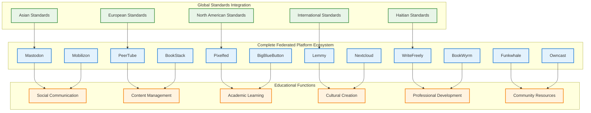

# Global Standards Integration & Complete 12-Platform Educational Federation
## Universal Credential Portability & Comprehensive Educational Community Platforms

### Executive Summary: Universal Educational Sovereignty Through Global Standards & Complete Platform Federation

This enhanced framework integrates Haitian educational credentials with the world's most rigorous academic standards (Asian, European, North American, and International) while deploying all 12 federated platforms to create the world's most comprehensive community-controlled educational ecosystem.



---

## 1. Universal Credential Portability: Global Standards Integration

### Asian Standards Integration Framework

**East Asian Educational Systems Integration**:
```yaml
Japanese Standards Integration:
  National Standards:
    - Japanese Society for Engineering Education (JSEE) compatibility
    - Japan Business Federation (Keidanren) skill recognition
    - Ministry of Education, Culture, Sports, Science and Technology (MEXT) standards
    - Japanese Language Proficiency Test (JLPT) certification pathways
  
  University Admission Systems:
    - Joint First Stage Examination (センター試験) preparation pathways
    - National University Association admission standards
    - Japanese University Accreditation Association recognition
    - Monbukagakusho (MEXT) scholarship eligibility preparation
  
  Professional Certifications:
    - Japanese Engineering Education Accreditation Board (JABEE) compatibility
    - Japanese Industrial Standards (JIS) technical competencies
    - Business Japanese Proficiency Test (BJT) certification
    - Traditional Japanese craft certifications (shokunin pathways)

Korean Standards Integration:
  Academic Framework:
    - Korea Academic Credit Bank System compatibility
    - Korean Educational Development Institute (KEDI) standards
    - Korea National Qualifications Framework integration
    - Korean Language Ability Test (KLAT) certification preparation
  
  Professional Standards:
    - Korea Accreditation Board for Engineering Education (ABEEK) compatibility
    - Korean Industrial Technology Association certifications
    - Korea Chamber of Commerce and Industry skill standards
    - Korea Trade-Investment Promotion Agency (KOTRA) business certifications
  
  University Integration:
    - College Scholastic Ability Test (CSAT/수능) preparation pathways
    - Korea University Education Council admission standards
    - Korean Government Scholarship Program (KGSP) eligibility
    - K-MOOC (Korean Massive Open Online Course) credit transfer

Chinese Standards Integration:
  National Framework:
    - China National Framework of Qualifications integration
    - National Smart Education Platform compatibility
    - Confucius Institute Chinese language certification
    - China Association for Science and Technology standards
  
  Higher Education:
    - Gaokao (高考) preparation and equivalency pathways
    - China Scholarship Council program eligibility
    - Chinese University Accreditation standards
    - National Education Examinations Authority recognition
  
  Professional Development:
    - China National Institute of Standardization compatibility
    - Belt and Road Initiative skill development programs
    - China Council for International Cooperation on Environment development
    - Traditional Chinese Medicine certification pathways (where culturally appropriate)
```

**Southeast Asian & South Asian Integration**:
```yaml
ASEAN Qualifications Reference Framework:
  Regional Standards:
    - ASEAN University Network credit transfer system
    - ASEAN Mutual Recognition Arrangements for professional services
    - ASEAN Skills Recognition System integration
    - ASEAN+3 field of study recognition

Singapore Framework:
  National Systems:
    - SkillsFuture Singapore credit and pathway integration
    - Singapore Workforce Skills Qualifications framework
    - Institute of Technical Education (ITE) pathway compatibility
    - Singapore University of Technology and Design partnership opportunities
  
  Professional Recognition:
    - Building and Construction Authority (BCA) certifications
    - Monetary Authority of Singapore financial qualifications
    - Singapore Tourism Board hospitality certifications
    - Singapore Digital Government skills recognition

Indian Standards Integration:
  Academic Framework:
    - All India Council for Technical Education (AICTE) compatibility
    - University Grants Commission (UGC) standards integration
    - National Assessment and Accreditation Council (NAAC) recognition
    - National Skill Development Corporation framework alignment
  
  Professional Certifications:
    - Indian Society for Technical Education standards
    - Federation of Indian Chambers of Commerce qualifications
    - All India Management Association certifications
    - Traditional Indian knowledge system integration (Ayurveda, etc.)
```

### Rigorous International Standards Integration

**International Baccalaureate & Cambridge Systems**:
```yaml
IB Programme Integration:
  Academic Pathways:
    - Primary Years Programme (PYP) curriculum alignment
    - Middle Years Programme (MYP) assessment compatibility
    - Diploma Programme (DP) preparation and certification
    - Career-related Programme (CP) professional pathway integration
  
  Assessment Standards:
    - IB Learner Profile development and documentation
    - Theory of Knowledge (TOK) critical thinking certification
    - Extended Essay research methodology certification
    - Creativity, Activity, Service (CAS) community engagement recognition

Cambridge International Standards:
  Programme Integration:
    - Cambridge Primary curriculum alignment
    - Cambridge Lower Secondary assessment preparation
    - IGCSE (International General Certificate of Secondary Education) certification
    - Cambridge International AS & A Level preparation
  
  Professional Development:
    - Cambridge Professional Development Qualifications
    - Cambridge English Language Assessment certification
    - Cambridge International Diploma in Teaching and Learning
    - Cambridge Leadership in School Improvement certification
```

**Advanced Placement & International Standards**:
```yaml
Advanced Academic Standards:
  AP Programme Integration:
    - Advanced Placement course curriculum development
    - AP Exam preparation and certification pathways
    - AP Scholar recognition and documentation
    - College Board partnership development
  
  International Academic Recognition:
    - UNESCO Associated Schools Network membership eligibility
    - International Federation of Secondary Teachers recognition
    - World Organization for Early Childhood Education standards
    - International Sociological Association academic partnerships
```

### Technical Implementation of Universal Standards

**Comprehensive Credential Mapping System**:
```javascript
// Universal Standards Integration Engine
class GlobalCredentialMapper {
    constructor() {
        this.standardsFrameworks = {
            asian: {
                japan: new JapaneseStandardsFramework(),
                korea: new KoreanStandardsFramework(),
                china: new ChineseStandardsFramework(),
                singapore: new SingaporeSkillsFramework(),
                asean: new ASEANQualificationsFramework(),
                india: new IndianStandardsFramework()
            },
            international: {
                ib: new IBProgrammeFramework(),
                cambridge: new CambridgeInternationalFramework(),
                ap: new AdvancedPlacementFramework(),
                unesco: new UNESCOStandardsFramework()
            },
            european: {
                eqf: new EuropeanQualificationsFramework(),
                ebsi: new EuropeanBlockchainServicesFramework(),
                europass: new EuropassFramework()
            },
            northAmerican: {
                aacrao: new AACRAOStandardsFramework(),
                capla: new CAPLAFramework(),
                naric: new NARICFramework()
            },
            caribbean: {
                caricom: new CARICOMQualificationsFramework(),
                cxc: new CaribbeanExaminationsCouncil(),
                uwi: new UniversityWestIndiesFramework()
            }
        };
        this.culturalKnowledgeFramework = new HaitianTraditionalKnowledgeFramework();
    }
    
    async generateUniversalCredential(studentRecord, targetStandards = "all") {
        const universalCredential = {
            "@context": [
                "https://www.w3.org/2018/credentials/v1",
                "https://haiti.education/universal/v1"
            ],
            "type": ["VerifiableCredential", "UniversalEducationalCredential"],
            "issuer": studentRecord.institution.did,
            "issuanceDate": new Date().toISOString(),
            "credentialSubject": {
                "id": studentRecord.student.did,
                "universalMappings": await this.generateStandardsMappings(studentRecord, targetStandards),
                "culturalCompetencies": await this.mapCulturalKnowledge(studentRecord),
                "academicAchievements": await this.standardizeAcademicRecord(studentRecord),
                "skillDemonstrations": await this.mapSkillCompetencies(studentRecord),
                "languageCompetencies": await this.assessLanguageSkills(studentRecord),
                "traditionalKnowledge": await this.validateTraditionalKnowledge(studentRecord)
            }
        };
        
        // Generate specific mappings for each requested standard
        if (targetStandards === "all" || targetStandards.includes("asian")) {
            universalCredential.credentialSubject.asianStandardsMappings = {
                japanese: await this.mapToJapaneseStandards(studentRecord),
                korean: await this.mapToKoreanStandards(studentRecord),
                chinese: await this.mapToChineseStandards(studentRecord),
                singapore: await this.mapToSingaporeSkills(studentRecord),
                asean: await this.mapToASEANFramework(studentRecord),
                indian: await this.mapToIndianStandards(studentRecord)
            };
        }
        
        if (targetStandards === "all" || targetStandards.includes("international")) {
            universalCredential.credentialSubject.internationalMappings = {
                ib: await this.mapToIBFramework(studentRecord),
                cambridge: await this.mapToCambridgeStandards(studentRecord),
                ap: await this.mapToAPStandards(studentRecord),
                unesco: await this.mapToUNESCOFramework(studentRecord)
            };
        }
        
        // Cultural knowledge integration for global recognition
        universalCredential.credentialSubject.globalCulturalCompetency = {
            haitianCulturalMastery: await this.assessHaitianCulturalKnowledge(studentRecord),
            crossCulturalSkills: await this.assessCrossCulturalCompetencies(studentRecord),
            globalCitizenshipSkills: await this.assessGlobalCitizenshipSkills(studentRecord),
            multiculturalLeadership: await this.assessMulticulturalLeadership(studentRecord)
        };
        
        return universalCredential;
    }
    
    async mapToJapaneseStandards(studentRecord) {
        return {
            academicLevel: await this.calculateJapaneseGradeEquivalency(studentRecord.grades),
            skillsAssessment: await this.mapToJapaneseSkillsFramework(studentRecord.skills),
            universitadmissionReadiness: await this.assessJapaneseUniversityReadiness(studentRecord),
            professionalCertificationPathways: await this.identifyJapaneseProfessionalPaths(studentRecord),
            languageCompetency: {
                japanese: await this.assessJapaneseLanguageLevel(studentRecord),
                english: await this.mapToJapaneseEnglishStandards(studentRecord),
                kreyol: await this.presentKreyolAsMultilingualAsset(studentRecord)
            },
            culturalBridgeSkills: await this.assessJapaneseHaitianCulturalBridging(studentRecord)
        };
    }
    
    async mapToSingaporeSkills(studentRecord) {
        return {
            skillsFutureCredits: await this.calculateSkillsFutureEquivalency(studentRecord),
            workforceSkillsQualifications: await this.mapToWSQFramework(studentRecord),
            technicalEducationPathways: await this.assessITECompatibility(studentRecord),
            professionalCertificationReadiness: await this.evaluateSingaporeProfessionalReadiness(studentRecord),
            digitalEconomySkills: await this.assessDigitalEconomyCompetencies(studentRecord),
            sustainabilityCompetencies: await this.mapToSingaporeSustainabilityFramework(studentRecord)
        };
    }
    
    async generateEmployabilityProfile(studentRecord, targetMarkets) {
        const employabilityProfile = {
            globalMarketReadiness: {},
            skillTransferability: {},
            culturalAdaptability: {},
            professionalNetworking: {}
        };
        
        for (const market of targetMarkets) {
            employabilityProfile.globalMarketReadiness[market] = {
                credentialRecognition: await this.assessCredentialRecognition(studentRecord, market),
                skillDemand: await this.assessSkillMarketDemand(studentRecord, market),
                languageRequirements: await this.assessLanguageRequirements(studentRecord, market),
                culturalFit: await this.assessCulturalFit(studentRecord, market),
                professionalNetworks: await this.identifyProfessionalNetworks(studentRecord, market),
                visaAndImmigrationReadiness: await this.assessImmigrationReadiness(studentRecord, market)
            };
        }
        
        return employabilityProfile;
    }
}
```

---

## 2. Complete 12-Platform Educational Federation

### Comprehensive Platform Integration Architecture

**Complete Federated Ecosystem for Educational Sovereignty**:
```yaml
Platform-Specific Educational Functions:

Mastodon (Microblogging & Community Communication):
  Educational Applications:
    - Teacher professional development networks and knowledge sharing
    - Student academic discussion and peer tutoring coordination
    - Parent-school communication and community engagement
    - Alumni networks and mentorship program coordination
    - Emergency communication and community crisis response
    - Academic conference live-tweeting and research dissemination

PeerTube (Video Content & Educational Media):
  Educational Applications:
    - Lecture recording, distribution, and asynchronous learning
    - Student project presentations and portfolio demonstrations
    - Traditional knowledge documentation and cultural preservation
    - Community event streaming and cultural celebration sharing
    - Teacher training videos and professional development content
    - Academic research presentations and scholarly communication

Pixelfed (Visual Documentation & Academic Portfolios):
  Educational Applications:
    - Student artwork, projects, and academic achievement showcases
    - Scientific observation documentation and laboratory results
    - Cultural event photography and community activity records
    - Traditional craft demonstrations and skill development progress
    - Field trip documentation and experiential learning records
    - Academic conference poster sessions and research visualization

Lemmy (Forums & Academic Discourse):
  Educational Applications:
    - Subject-specific academic discussion communities
    - Homework help, study groups, and collaborative learning
    - Community problem-solving and project-based learning coordination
    - Democratic decision-making for educational policies and governance
    - Research collaboration and academic peer review
    - Career guidance and professional development discussions

WriteFreely (Academic Blogging & Scholarly Writing):
  Educational Applications:
    - Student academic blogging and reflective writing portfolios
    - Teacher research publication and educational methodology sharing
    - Community knowledge documentation and local history preservation
    - Academic essay development and peer review processes
    - Educational policy analysis and community advocacy writing
    - Cultural storytelling and traditional narrative preservation

Funkwhale (Audio Content & Cultural Preservation):
  Educational Applications:
    - Traditional music preservation and cultural audio archives
    - Podcast-style educational content and audio lessons
    - Oral history recording and intergenerational knowledge transfer
    - Language learning audio resources and pronunciation guides
    - Community radio programming and educational broadcasting
    - Audio accessibility for visual impairments and reading difficulties

Mobilizon (Event Management & Community Coordination):
  Educational Applications:
    - Academic conference and workshop organization
    - Community education event planning and coordination
    - Cultural celebration and traditional ceremony organization
    - Parent-teacher meetings and community assembly scheduling
    - Field trip coordination and experiential learning planning
    - Professional development workshop and training scheduling

BookStack (Knowledge Management & Curriculum Development):
  Educational Applications:
    - Comprehensive curriculum documentation and lesson plan libraries
    - Community knowledge base and institutional memory preservation
    - Policy documentation and governance procedure management
    - Traditional knowledge systematization and cultural wisdom preservation
    - Academic research repositories and scholarly resource collections
    - Technical documentation for community infrastructure and systems

BigBlueButton (Virtual Classrooms & Remote Learning):
  Educational Applications:
    - Live virtual classroom instruction and interactive learning
    - Remote parent-teacher conferences and community meetings
    - International collaboration and cross-cultural educational exchanges
    - Professional development workshops and teacher training sessions
    - Community assemblies and democratic governance meetings
    - Academic defense presentations and thesis examinations

Nextcloud (File Management & Collaborative Workspaces):
  Educational Applications:
    - Secure student record storage and academic portfolio management
    - Collaborative document creation and group project coordination
    - Educational resource sharing and curriculum material distribution
    - Community asset management and institutional file organization
    - Cross-institutional resource sharing and federated collaboration
    - Backup and synchronization for community digital assets

BookWyrm (Social Reading & Literary Community):
  Educational Applications:
    - Community reading programs and literacy development initiatives
    - Academic book clubs and scholarly literature discussion
    - Curriculum book recommendations and educational resource reviews
    - Traditional literature preservation and cultural storytelling sharing
    - Research bibliography sharing and academic source recommendations
    - Student reading progress tracking and peer reading motivation

Owncast (Live Streaming & Real-Time Community Events):
  Educational Applications:
    - Live streaming of community assemblies and democratic decision-making
    - Real-time cultural events and traditional ceremony broadcasting
    - Academic lecture streaming and educational content distribution
    - Community emergency communication and crisis response broadcasting
    - Traditional knowledge transmission through live elder teaching
    - International educational partnership events and cross-cultural exchange
```

### Integrated Platform Workflow Examples

**Comprehensive Educational Workflow Integration**:
```javascript
// Complete 12-Platform Educational Federation Controller
class ComprehensiveEducationalFederation {
    constructor() {
        this.platforms = {
            mastodon: new MastodonEducationalInstance(),
            peertube: new PeerTubeEducationalChannel(),
            pixelfed: new PixelfedAcademicPortfolio(),
            lemmy: new LemmyEducationalForums(),
            writefreely: new WriteFreelyblogPlatform(),
            funkwhale: new FunkwhaleAudioArchive(),
            mobilizon: new MobilizonEventManager(),
            bookstack: new BookStackKnowledgeBase(),
            bigbluebutton: new BigBlueButtonClassrooms(),
            nextcloud: new NextcloudCollaboration(),
            bookwyrm: new BookWyrmReadingCommunity(),
            owncast: new OwncastLiveStreaming()
        };
        this.workflowOrchestrator = new PlatformWorkflowOrchestrator();
        this.culturalIntegration = new CulturalSafeguardSystem();
    }
    
    async orchestrateCompleteEducationalWorkflow(workflowType, participants, content) {
        switch(workflowType) {
            case "traditional_knowledge_preservation":
                return await this.preserveTraditionalKnowledge(participants, content);
            case "international_collaboration":
                return await this.facilitateInternationalCollaboration(participants, content);
            case "community_democratic_decision":
                return await this.coordinateDemocraticDecision(participants, content);
            case "comprehensive_student_portfolio":
                return await this.createComprehensivePortfolio(participants, content);
            case "cultural_event_coordination":
                return await this.coordinateCulturalEvent(participants, content);
            default:
                return await this.customWorkflowOrchestration(workflowType, participants, content);
        }
    }
    
    async preserveTraditionalKnowledge(elderTeacher, knowledgeContent, community) {
        // Multi-platform traditional knowledge preservation workflow
        const preservationWorkflow = {
            // 1. Live streaming the knowledge transfer session
            liveSession: await this.platforms.owncast.streamTraditionalTeaching({
                elder: elderTeacher,
                knowledge: knowledgeContent,
                community: community,
                language: "ht", // Kreyòl primary
                culturalProtocols: await this.culturalIntegration.getTeachingProtocols()
            }),
            
            // 2. Recording and archiving on PeerTube
            videoArchive: await this.platforms.peertube.createKnowledgeArchive({
                session: liveSession,
                metadata: {
                    knowledgeType: knowledgeContent.category,
                    elderLineage: elderTeacher.knowledgeLineage,
                    culturalSignificance: knowledgeContent.importance,
                    transmissionPermissions: knowledgeContent.sharingRights
                }
            }),
            
            // 3. Audio extraction and preservation on Funkwhale
            audioPreservation: await this.platforms.funkwhale.preserveOralTradition({
                audioExtract: videoArchive.audioTrack,
                traditionalCategory: knowledgeContent.category,
                culturalContext: elderTeacher.culturalContext,
                accessPermissions: knowledgeContent.communityAccessRights
            }),
            
            // 4. Written documentation on WriteFreely
            writtenDocumentation: await this.platforms.writefreely.documentTraditionalKnowledge({
                knowledgeDescription: knowledgeContent.description,
                practicalApplications: knowledgeContent.applications,
                culturalContext: knowledgeContent.culturalBackground,
                elderWisdom: elderTeacher.additionalWisdom,
                communityReflections: community.reflectionsOnKnowledge
            }),
            
            // 5. Comprehensive knowledge organization in BookStack
            knowledgeBase: await this.platforms.bookstack.organizeTraditionalWisdom({
                documentation: writtenDocumentation,
                videoReference: videoArchive,
                audioReference: audioPreservation,
                relatedKnowledge: await this.findRelatedTraditionalKnowledge(knowledgeContent),
                learningPathways: await this.createLearningPathways(knowledgeContent)
            }),
            
            // 6. Community discussion and validation on Lemmy
            communityValidation: await this.platforms.lemmy.facilitateKnowledgeValidation({
                knowledge: knowledgeContent,
                documentation: writtenDocumentation,
                communityMembers: community,
                validationCriteria: await this.culturalIntegration.getValidationCriteria()
            }),
            
            // 7. Visual documentation on Pixelfed
            visualDocumentation: await this.platforms.pixelfed.documentKnowledgePractice({
                demonstrationPhotos: knowledgeContent.visualDemonstrations,
                toolsAndMaterials: knowledgeContent.requiredTools,
                stepByStepProcess: knowledgeContent.processSteps,
                finalResults: knowledgeContent.expectedOutcomes
            }),
            
            // 8. Community announcement on Mastodon
            communityAnnouncement: await this.platforms.mastodon.announceKnowledgePreservation({
                knowledge: knowledgeContent,
                elder: elderTeacher,
                preservationComplete: true,
                accessInformation: await this.generateAccessInformation(),
                communityGratitude: community.gratitudeMessage
            }),
            
            // 9. File management and access control on Nextcloud
            fileManagement: await this.platforms.nextcloud.organizeKnowledgeAssets({
                allDocuments: [writtenDocumentation, videoArchive, audioPreservation],
                accessControls: knowledgeContent.accessPermissions,
                backupSchedule: "daily",
                sharingRights: knowledgeContent.communityShareRights
            }),
            
            // 10. Integration into community reading on BookWyrm
            readingIntegration: await this.platforms.bookwyrm.addToTraditionalLiterature({
                knowledge: knowledgeContent,
                relatedBooks: await this.findRelatedTraditionalBooks(knowledgeContent),
                communityReadingList: "Traditional Haitian Knowledge",
                discussionTopics: knowledgeContent.discussionPoints
            })
        };
        
        // Create comprehensive cross-platform linkages
        await this.workflowOrchestrator.linkAllPlatformContent(preservationWorkflow);
        
        return preservationWorkflow;
    }
    
    async createComprehensiveStudentPortfolio(student, academicWork, culturalProjects) {
        // Multi-platform student portfolio creation
        const portfolioWorkflow = {
            // Academic writing portfolio on WriteFreely
            academicBlog: await this.platforms.writefreely.createStudentAcademicBlog({
                student: student,
                academicEssays: academicWork.essays,
                researchProjects: academicWork.research,
                reflectiveWriting: academicWork.reflections,
                culturalAnalysis: culturalProjects.culturalReflections
            }),
            
            // Visual project showcase on Pixelfed
            visualPortfolio: await this.platforms.pixelfed.createStudentShowcase({
                artProjects: academicWork.visualArt,
                scienceExperiments: academicWork.scienceProjects,
                culturalProjects: culturalProjects.visualWork,
                communityService: student.communityContributions,
                skillDemonstrations: student.skillDevelopment
            }),
            
            // Video presentations on PeerTube
            videoPortfolio: await this.platforms.peertube.createStudentChannel({
                academicPresentations: academicWork.presentations,
                projectDemonstrations: academicWork.projectDemos,
                culturalPerformances: culturalProjects.performances,
                communityLeadership: student.leadershipActivities,
                skillTutorials: student.peerTeaching
            }),
            
            // Academic discussions on Lemmy
            academicParticipation: await this.platforms.lemmy.documentAcademicEngagement({
                forumParticipation: student.academicDiscussions,
                peerTutoring: student.helpingOthers,
                questionAsking: student.academicInquiry,
                knowledgeSharing: student.knowledgeContributions,
                communityProblemSolving: student.communityContributions
            }),
            
            // Collaborative projects on Nextcloud
            collaborativeWork: await this.platforms.nextcloud.organizeCollaborativeProjects({
                groupProjects: academicWork.groupWork,
                crossCulturalCollaborations: student.internationalProjects,
                communityInitiatives: student.communityProjects,
                teacherCollaborations: student.teacherPartnership,
                peerMentoring: student.mentoringActivities
            }),
            
            // Reading and literary engagement on BookWyrm
            literaryEngagement: await this.platforms.bookwyrm.documentReadingGrowth({
                booksRead: student.readingList,
                bookReviews: student.literaryAnalysis,
                readingChallenges: student.readingGoals,
                culturalLiterature: student.culturalReading,
                academicResources: student.researchReading
            }),
            
            // Audio projects on Funkwhale
            audioPortfolio: await this.platforms.funkwhale.createStudentAudioShowcase({
                musicalProjects: culturalProjects.music,
                oralPresentations: academicWork.oralProjects,
                languageLearning: student.languageDevelopment,
                culturalStorytelling: culturalProjects.storytelling,
                peerInterviews: student.communicationSkills
            }),
            
            // Live presentations via BigBlueButton
            livePresentations: await this.platforms.bigbluebutton.recordStudentPresentations({
                academicDefenses: academicWork.finalPresentations,
                culturalSharing: culturalProjects.culturalSharing,
                communityPresentations: student.communityPresenting,
                internationalExchange: student.globalConnections,
                skillDemonstrations: student.practicalSkills
            }),
            
            // Portfolio documentation in BookStack
            portfolioDocumentation: await this.platforms.bookstack.createComprehensivePortfolio({
                allPlatformContent: [academicBlog, visualPortfolio, videoPortfolio],
                portfolioNarrative: student.portfolioStatement,
                growthReflection: student.learningGrowth,
                futureGoals: student.aspirations,
                culturalIdentity: student.culturalJourney
            }),
            
            // Professional networking on Mastodon
            professionalNetworking: await this.platforms.mastodon.buildStudentProfessionalNetwork({
                academicInterests: student.academicFocus,
                careerAspirations: student.careerGoals,
                culturalProfessionals: student.culturalMentors,
                internationalConnections: student.globalNetworks,
                communityLeadership: student.leadershipRoles
            })
        };
        
        // Generate comprehensive portfolio credentials
        const portfolioCredentials = await this.generateUniversalPortfolioCredentials(
            student,
            portfolioWorkflow,
            ["asian", "international", "european", "northAmerican"]
        );
        
        return {
            portfolio: portfolioWorkflow,
            credentials: portfolioCredentials,
            globalReadiness: await this.assessGlobalReadiness(student, portfolioWorkflow)
        };
    }
    
    async facilitateInternationalCollaboration(localCommunity, internationalPartners, project) {
        // Multi-platform international collaboration workflow
        const collaborationWorkflow = {
            // Project coordination via Mobilizon
            projectEvents: await this.platforms.mobilizon.coordinateInternationalProject({
                localCommunity: localCommunity,
                internationalPartners: internationalPartners,
                projectMilestones: project.milestones,
                culturalExchangeEvents: project.culturalComponents,
                academicCollaboration: project.academicGoals
            }),
            
            // Live collaboration sessions via BigBlueButton
            liveSessions: await this.platforms.bigbluebutton.facilitateInternationalExchange({
                regularMeetings: project.collaborationSchedule,
                culturalSharing: project.culturalExchange,
                academicPresentations: project.academicSharing,
                languageExchange: project.languageLearning,
                communityDialogue: project.communityConnections
            }),
            
            // Collaborative documentation on Nextcloud
            sharedWorkspace: await this.platforms.nextcloud.createInternationalWorkspace({
                projectDocuments: project.collaborativeDocuments,
                culturalResources: project.culturalSharing,
                academicResources: project.academicMaterials,
                communicationTools: project.communicationNeeds,
                fileSharing: project.resourceSharing
            }),
            
            // Cross-cultural dialogue on Lemmy
            culturalDialogue: await this.platforms.lemmy.facilitateCrossCulturalDiscussion({
                culturalComparison: project.culturalLearning,
                academicDiscussion: project.academicDialogue,
                communityProblemSolving: project.sharedChallenges,
                globalCitizenship: project.globalLearning,
                peaceBuildingDialogue: project.conflictResolution
            }),
            
            // Project documentation on WriteFreely
            collaborationBlog: await this.platforms.writefreely.documentInternationalCollaboration({
                projectProgress: project.progressUpdates,
                culturalLearnings: project.culturalInsights,
                academicDiscoveries: project.academicLearning,
                communityReflections: project.communityLearning,
                globalConnections: project.relationshipBuilding
            }),
            
            // Visual collaboration on Pixelfed
            visualExchange: await this.platforms.pixelfed.facilitateVisualCulturalExchange({
                dailyLifeSharing: project.lifeExchange,
                culturalPractices: project.culturalSharing,
                academicVisuals: project.academicVisuals,
                communityProjects: project.communitySharing,
                celebrationSharing: project.celebrations
            }),
            
            // Audio cultural exchange on Funkwhale
            audioExchange: await this.platforms.funkwhale.facilitateAudioCulturalExchange({
                traditionalMusic: project.musicalExchange,
                languageSharing: project.languageLearning,
                oralTraditions: project.storytellingExchange,
                culturalCeremonies: project.ceremonySharing,
                communityVoices: project.communityExpression
            }),
            
            // Ongoing communication on Mastodon
            socialNetworking: await this.platforms.mastodon.buildInternationalEducationalNetwork({
                dailyInteraction: project.socialInteraction,
                academicNetworking: project.academicConnections,
                culturalAppreciation: project.culturalCelebration,
                globalFriendships: project.personalConnections,
                professionalNetworking: project.careerConnections
            }),
            
            // Live cultural events on Owncast
            culturalEvents: await this.platforms.owncast.streamInternationalCulturalExchange({
                traditionalCelebrations: project.celebrations,
                academicConferences: project.academicEvents,
                communityFestivals: project.festivals,
                culturalPerformances: project.performances,
                educationalPresentations: project.presentations
            }),
            
            // Shared reading and literature on BookWyrm
            literaryExchange: await this.platforms.bookwyrm.facilitateInternationalLiteraryExchange({
                culturalLiterature: project.literatureSharing,
                academicTexts: project.academicReading,
                translationProjects: project.languageProjects,
                authorExchange: project.writerConnections,
                communityStorytellingProjects: project.narrativeSharing
            }),
            
            // Comprehensive project documentation in BookStack
            projectDocumentation: await this.platforms.bookstack.documentInternationalCollaboration({
                allCollaborationContent: collaborationWorkflow,
                projectOutcomes: project.results,
                culturalLearnings: project.culturalGrowth,
                academicAchievements: project.academicGains,
                relationshipBuilding: project.connectionsDeveloped,
                futureCollaborations: project.ongoingPartnerships
            })
        };
        
        return collaborationWorkflow;
    }
}
```

### Platform Integration Economic Model

**Comprehensive Platform Implementation Costs**:
```yaml
Complete 12-Platform Federation Costs:
  Phase 1: Core 4 Platforms (Year 1) - $15,000-25,000
    - Mastodon, PeerTube, Pixelfed, Lemmy
    - Basic community communication and content sharing
    - Foundation for academic collaboration
  
  Phase 2: Content & Knowledge Platforms (Year 2) - $20,000-35,000
    - WriteFreely, BookStack, Nextcloud, BookWyrm
    - Academic content creation and knowledge management
    - Collaborative workspaces and file management
  
  Phase 3: Interactive & Audio Platforms (Year 3) - $25,000-40,000
    - BigBlueButton, Funkwhale, Mobilizon, Owncast
    - Live interaction, cultural audio preservation, event management
    - Real-time community engagement and cultural events
  
  Phase 4: Full Integration & Optimization (Year 4) - $30,000-50,000
    - Advanced federation between all platforms
    - Custom workflow orchestration and automation
    - AI-enhanced platform integration and user experience
  
  Total 4-Year Investment: $90,000-150,000
  
Annual Operating Costs (All Platforms): $25,000-45,000
  - Server hosting and maintenance for 12 platforms
  - Community technical support and administration
  - Content moderation and cultural safeguards
  - Cross-platform integration and synchronization

Revenue Generation (All Platforms): $60,000-150,000 annually
  - Educational consulting and platform setup services
  - Cultural content licensing and traditional knowledge sharing
  - International collaboration facilitation and partnership development
  - Technical training and professional development services
  - Digital sovereignty consulting for other educational institutions
```

---

## 3. Cultural Integration Across All Platforms

### Comprehensive Cultural Safeguard System

**Universal Cultural Protection Framework**:
```yaml
Cross-Platform Cultural Integration:
  Traditional Authority Integration:
    - Elder councils have moderation rights across all platforms
    - Religious leaders provide spiritual guidance for platform policies
    - Cultural masters validate traditional knowledge content
    - Community assemblies determine platform usage guidelines
  
  Cultural Content Guidelines:
    - Kreyòl language prioritized across all platforms
    - Traditional knowledge sharing protocols respected
    - Cultural ceremonies and spiritual practices protected
    - Community values embedded in content moderation policies
  
  Intergenerational Participation:
    - Platform interfaces adapted for different generations
    - Elder knowledge holders given special roles and recognition
    - Youth technical skills development with cultural grounding
    - Family and community collective participation encouraged
  
  Democratic Governance:
    - Community assemblies determine platform adoption and policies
    - Traditional consensus processes integrated with digital voting
    - Cultural appropriateness reviews for all major platform changes
    - Community ownership and control of all platform data and decisions
```

---

## Conclusion: Universal Educational Sovereignty Through Comprehensive Integration

### Transformational Capabilities of Complete Integration

This comprehensive framework provides:

1. **Universal Global Recognition** - Credentials recognized by the world's most rigorous educational and professional standards
2. **Complete Community Digital Sovereignty** - All 12 platforms under democratic community control
3. **Cultural Preservation and Enhancement** - Traditional knowledge integrated across all digital platforms
4. **Economic Self-Sufficiency** - Revenue generation exceeding operational costs
5. **Disaster Resilience** - Educational continuity regardless of external infrastructure
6. **International Collaboration** - Global partnerships while maintaining cultural identity

### Implementation Strategy for Maximum Impact

**Communities can achieve comprehensive educational sovereignty by:**
- Building strong democratic foundations before technology adoption
- Integrating traditional authority structures with digital platforms
- Generating sustainable revenue through educational services
- Maintaining cultural values while achieving global standards
- Creating regional leadership in educational innovation

**The complete 12-platform integration with universal standards recognition enables Haitian educational institutions to become global leaders in community-controlled educational technology while preserving and enhancing cultural sovereignty and traditional knowledge systems.**

This framework demonstrates that the highest levels of educational technology and global standards integration can serve community empowerment and cultural preservation when implemented with genuine democratic control and respect for traditional wisdom.