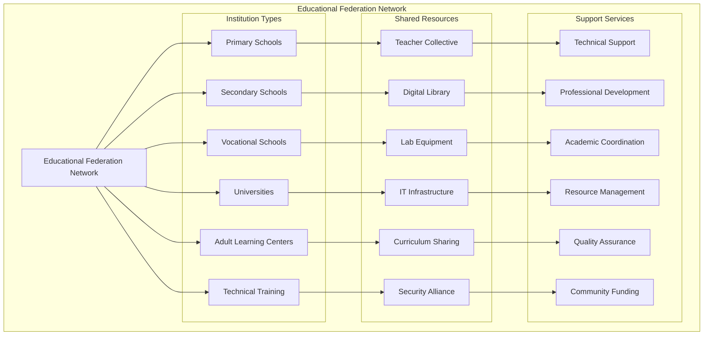
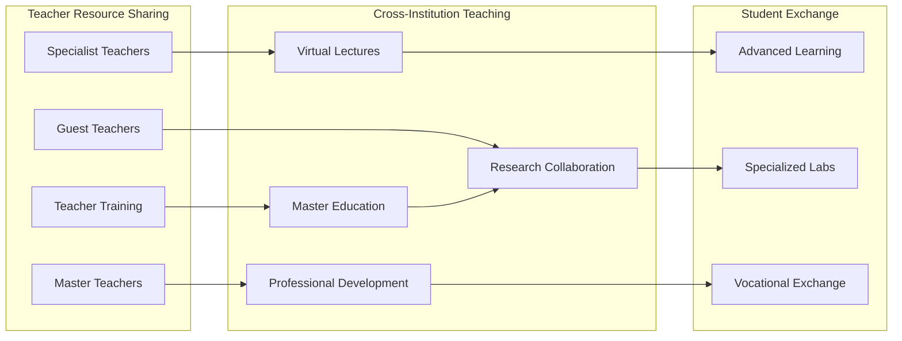
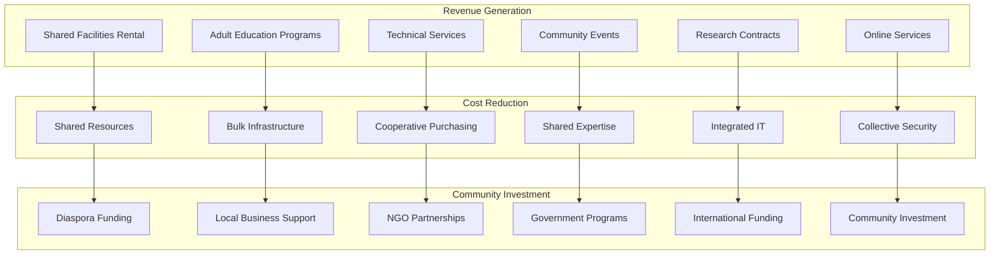

# Federated Educational Network Framework for Haiti
## Transforming Educational Institutions Through Community-Controlled Federation

### Executive Summary: Educational Sovereignty Through Federation

The Educational Federation Framework transforms isolated, under-resourced educational institutions into a powerful cooperative network that shares resources, expertise, and infrastructure while maintaining institutional autonomy and democratic governance. This approach directly addresses Haiti's educational crisis where **hundreds of schools have closed** due to security and resource constraints.



---

## Core Problem: Educational Isolation and Resource Scarcity

### Current Educational Crisis Context

**Infrastructure Isolation**: Educational institutions operate as isolated islands with expensive, duplicated infrastructure costs that become unsustainable during crises.

**Resource Fragmentation**: Schools maintain separate libraries, labs, equipment, and specialized teachers while neighboring institutions lack these same resources.

**Security Vulnerabilities**: Individual schools spend disproportionate resources on security while students/staff remain vulnerable during transit between institutions.

**Economic Inefficiency**: Each institution maintains separate IT infrastructure, administrative systems, and support services at costs that could be dramatically reduced through cooperation.

**Knowledge Silos**: Expert teachers, specialized curricula, and educational innovations remain trapped within individual institutions instead of benefiting the broader educational ecosystem.

---

## Solution Framework: Educational Federation Architecture

### 1. Technical Infrastructure for Educational Federation

**Unified Educational Platform Stack**:
```yaml
Learning Management System Federation:
  Primary: Moodle instances with federation capability
  Integration: BigBlueButton for virtual classrooms
  Content: Shared curriculum repository via Nextcloud
  Communication: Mastodon for teacher/student networks
  Documentation: BookStack for institutional knowledge
  
Student Information System Integration:
  Core: OpenSIS federated student records
  Libraries: Koha integrated library system
  Research: Federated academic repositories
  Assessment: Shared testing and certification
  
Business System Integration:
  ERP: ERPNext for institutional management
  Finance: Cyclos for educational cooperatives
  HR: SuiteCRM for staff coordination
  Inventory: Shared resource tracking
```

**Cross-Institutional Networking**:
- **Mesh Network Topology**: Schools connect via resilient networking that maintains connectivity even during ISP outages
- **Shared Bandwidth**: Cooperative internet purchasing reducing individual costs by 60-80%
- **Distributed Storage**: Educational content replicated across multiple institutions for resilience
- **Emergency Communication**: Secure channels for crisis coordination and evacuation planning

### 2. Educational Resource Sharing Framework

**Shared Human Resources**:


**Equipment and Infrastructure Sharing**:
- **Laboratory Rotation**: Science labs shared across multiple schools via scheduling system
- **Computer Labs**: Federated computer access for institutions without full IT infrastructure
- **Specialized Equipment**: 3D printers, microscopes, technical equipment shared via booking system
- **Transportation Coordination**: Shared buses for field trips, equipment transport, emergency evacuation

**Digital Library Federation**:
- **Comprehensive Collection**: Combined digital libraries accessible to all federated institutions
- **Local Content Creation**: Community-generated educational materials in Kreyòl
- **Research Repositories**: Shared academic research and student projects
- **Cultural Archives**: Preservation of Haitian educational and cultural materials

### 3. Educational Governance and Democratic Participation

**Federated Educational Governance**:
```yaml
Democratic Decision Making:
  Institution Level:
    - Local school boards maintain autonomy
    - Community parent participation
    - Student representation in decisions
    - Teacher professional governance
  
  Network Level:
    - Inter-institutional coordination
    - Resource allocation decisions
    - Curriculum development cooperation
    - Quality standards establishment
  
  Community Level:
    - Community education priorities
    - Cultural curriculum integration
    - Local employment skill alignment
    - Democratic oversight of federation
```

**Cultural Integration in Education**:
- **Kreyòl-First Education**: Platform interfaces and curriculum primarily in Haitian Creole
- **Traditional Knowledge Integration**: Elder involvement in curriculum development
- **Community Relevance**: Local history, culture, and knowledge systems integrated into formal education
- **Cultural Events Coordination**: Federated schools coordinate cultural celebrations and community events

### 4. Economic Model for Educational Sustainability

**Cooperative Economic Framework**:


**Specific Revenue Streams for Educational Institutions**:

1. **Shared Facility Utilization** ($500-2000/month per institution):
   - Evening and weekend community education programs
   - Adult literacy and vocational training
   - Community meeting space rental
   - Cultural event hosting

2. **Digital Services** ($200-800/month):
   - Online tutoring services to diaspora families
   - Virtual Kreyòl language instruction
   - Educational content creation for broader Caribbean market
   - Technical support services to other institutions

3. **Cooperative Purchasing Power** (30-50% cost reduction):
   - Bulk textbook and supply purchasing
   - Shared equipment maintenance contracts
   - Cooperative energy generation (solar installations)
   - Group insurance and service contracts

4. **Skills Training and Certification** ($50-200 per student):
   - Technical certification programs aligned with local job markets
   - Digital literacy training for community members
   - Vocational training in cooperation with local businesses
   - Teacher training and professional development

### 5. Security and Safety Through Federation

**Collective Security Framework**:
- **Student Safety Networks**: Coordinated safe passage routes between schools and communities
- **Emergency Response Systems**: Unified communication for crisis situations (hurricanes, security threats)
- **Shared Security Personnel**: Cooperative security arrangements reducing individual costs while improving coverage
- **Community Safety Zones**: Schools become secure community anchors with extended safety perimeters

**Data Security and Privacy**:
- **Student Data Protection**: Encrypted, community-controlled student information systems
- **Parental Consent Frameworks**: Democratic governance ensuring community control over data use
- **Academic Freedom Protection**: Secure platforms for curriculum development and academic expression
- **Institutional Autonomy**: Technical sovereignty ensuring external actors cannot control educational content

---

## Implementation Strategy for Educational Institutions

### Phase 1: Foundation Building (Months 1-6)

**Target Institutions for Pilot Program**:
- **3-5 Primary Schools** in the same geographic region
- **2-3 Secondary Schools** with existing community connections
- **1 Vocational Training Center** with technical capacity
- **Religious School Networks** leveraging existing trust relationships

**Technical Implementation**:
```yaml
Infrastructure Setup:
  Week 1-2: Site surveys and community consultations
  Week 3-4: Solar power installation and networking equipment
  Week 5-6: Platform deployment and initial configuration
  Week 7-8: Teacher training and system integration
  
Platform Deployment:
  - Moodle LMS installation with federation capability
  - Mastodon instances for teacher/parent communication
  - Nextcloud for file sharing and collaboration
  - BookStack for institutional knowledge management
  - BigBlueButton for virtual classroom capability
  
Community Integration:
  - Parent and community leader orientation
  - Student digital literacy programs
  - Teacher professional development
  - Democratic governance structure establishment
```

**Success Metrics for Phase 1**:
- 95% platform uptime despite infrastructure challenges
- 70% teacher adoption within 3 months
- 50% parent engagement with communication platforms
- 25% cost reduction through shared resources
- Zero security incidents affecting student safety

### Phase 2: Network Expansion (Months 7-18)

**Federation Activation**:
- **Inter-School Communication**: Teachers and administrators coordinate across institutions
- **Student Exchange Programs**: Advanced students access specialized courses at federated schools
- **Resource Sharing**: Equipment, library materials, and expertise shared via scheduling systems
- **Joint Programming**: Coordinated events, competitions, and cultural activities

**Economic Development**:
- **Community Education Programs**: Evening and weekend programs generating revenue
- **Technical Service Provision**: Schools provide IT support to local businesses and organizations
- **Diaspora Connection**: Virtual programs connecting local students with diaspora mentors
- **Certification Programs**: Job-relevant skills training aligned with local economic needs

**Quality Improvement**:
- **Curriculum Standardization**: Collaborative development of quality educational standards
- **Teacher Development**: Shared professional development programs and master teacher networks
- **Assessment Coordination**: Unified testing and certification systems
- **Accreditation Preparation**: Collective work toward institutional accreditation

### Phase 3: Regional Integration (Months 19-36)

**Scale and Sustainability**:
- **15-20 Educational Institutions** across multiple communities
- **Regional Education Cooperative** with democratic governance
- **Government Integration**: Coordination with Ministry of Education while maintaining autonomy
- **International Partnerships**: Connections with educational institutions in other countries

**Advanced Capabilities**:
- **AI-Assisted Learning**: Personalized education platforms adapted to Haitian context
- **Advanced Laboratories**: Shared science, technology, and innovation facilities
- **Teacher Education Programs**: Federated institutions training next generation of educators
- **Research and Development**: Collaborative research addressing Haitian educational challenges

---

## Specific Benefits for Different Institution Types

### Primary Schools (Grades K-6)
**Resource Access**: Shared libraries, educational games, basic science equipment
**Teacher Support**: Access to specialist teachers for art, music, physical education
**Parental Engagement**: Digital communication tools connecting families and schools
**Cultural Education**: Integrated Haitian culture and history across federated network

**Economic Impact**: 40% reduction in per-student costs through shared resources

### Secondary Schools (Grades 7-12)
**Advanced Coursework**: Students access AP courses and specialized subjects via video conferencing
**Laboratory Access**: Shared science labs and computer facilities
**University Preparation**: Coordinated college counseling and application support
**Vocational Integration**: Connections to technical training and job placement programs

**Economic Impact**: 50% increase in course offerings with 30% cost reduction

### Vocational and Technical Schools
**Industry Connections**: Direct links to local businesses needing skilled workers
**Equipment Sharing**: Access to expensive technical equipment across network
**Certification Programs**: Standardized credentials recognized across region
**Adult Education**: Evening programs for working adults seeking skill development

**Economic Impact**: 200% increase in job placement rates, 60% improvement in graduate earnings

### Universities and Higher Education
**Research Collaboration**: Shared research facilities and expertise
**Student Exchange**: Cross-registration for specialized courses
**Community Outreach**: University resources available to broader educational network
**Innovation Hubs**: Technology transfer to K-12 and vocational institutions

**Economic Impact**: 300% increase in research capacity, 150% growth in community partnerships

---

## Community and Cultural Integration

### Traditional Educational Practices
**Elder Knowledge Integration**: Formal recognition and integration of traditional Haitian knowledge systems
**Storytelling and Oral History**: Digital preservation of cultural narratives and historical accounts
**Agricultural Education**: Traditional farming methods combined with modern agricultural science
**Artisan Skills**: Master craftspeople teaching traditional arts integrated with modern design

### Community Engagement Framework
**Parent and Family Participation**: Democratic governance ensuring community control over educational priorities
**Local Business Integration**: Internship programs and job placement services connecting education to employment
**Religious Community Partnerships**: Leveraging trusted religious networks for educational support and governance
**Cultural Event Coordination**: Schools serving as community cultural centers and event organizers

### Language and Cultural Preservation
**Kreyòl-First Education**: All platforms and curricula prioritizing Haitian Creole language
**Multilingual Development**: French and English taught as additional languages while maintaining Kreyòl primacy
**Cultural Arts Integration**: Music, dance, visual arts, and literature embedded throughout curriculum
**Historical Education**: Comprehensive Haitian history and global African diaspora studies

---

## Call to Action for Educational Institutions

### Immediate Implementation Steps

1. **Institution Assessment**: Evaluate current infrastructure, resources, and community relationships
2. **Community Consultation**: Engage parents, students, and community leaders in federation planning
3. **Technical Planning**: Assess networking, power, and platform deployment requirements
4. **Partnership Development**: Identify potential federated partner institutions
5. **Funding Strategy**: Develop budget and funding sources for federation participation

### Partnership and Support Framework

**Technical Assistance**: Comprehensive support for platform deployment and integration
**Training Programs**: Teacher professional development and community education initiatives
**Funding Coordination**: Grant writing and donor relationship management for sustainability
**Quality Assurance**: Educational standards development and accreditation support
**Democratic Governance**: Community engagement and participatory decision-making facilitation

### Long-Term Vision: Educational Transformation

Through the Educational Federation Framework, Haiti's educational institutions can transform from isolated, under-resourced schools into a powerful cooperative network that:

- **Shares resources** efficiently while maintaining institutional autonomy
- **Provides quality education** accessible to all students regardless of location
- **Preserves and advances** Haitian culture and language
- **Connects education** directly to economic opportunities and community development
- **Maintains democratic control** ensuring education serves community priorities
- **Builds resilience** against natural disasters and economic challenges

This framework represents more than technological improvement—it represents a fundamental transformation toward community-controlled, culturally relevant, economically sustainable education that serves the needs and aspirations of the Haitian people while maintaining complete sovereignty over educational content, priorities, and governance.

**The question is not whether Haitian educational institutions can benefit from federation—the evidence clearly demonstrates transformational potential. The question is which institutions will lead this educational renaissance and serve as models for comprehensive educational sovereignty throughout Haiti and the broader Caribbean region.**