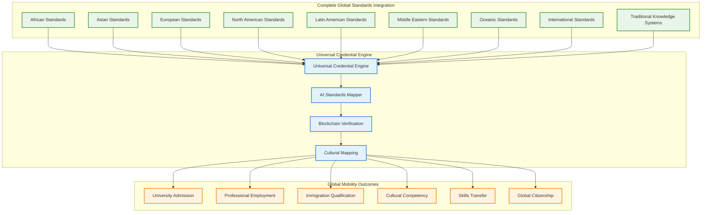

# Universal Global Academic Standards Integration: Complete World Educational Mobility
## Comprehensive Framework for Seamless Educational Transfer to ANY Global Institution

### Executive Summary: Total Universal Educational Portability

This expanded framework integrates Haitian educational credentials with EVERY major academic and professional standard globally - African, Latin American, Middle Eastern, Oceanic, and all remaining regional systems - creating unprecedented universal educational mobility where students can transfer credits and skills to literally any institution or employer worldwide.



---

## 1. African Academic Standards Integration

### Continental and Regional African Frameworks

**African Union Continental Education Strategy (CESA 2016-2025)**:
```yaml
African Continental Framework:
  CESA Strategic Objectives:
    - African Continental Qualifications Framework (ACQF) compatibility
    - Harmonized Quality Assurance and Accreditation systems
    - African Higher Education Space integration
    - Pan-African University network participation
    - African Union Youth Volunteer Corps skill recognition
    - African Peer Review Mechanism educational standards
  
  Regional Economic Communities Integration:
    - Economic Community of West African States (ECOWAS) qualifications
    - East African Community (EAC) education harmonization
    - Southern African Development Community (SADC) qualifications
    - Common Market for Eastern and Southern Africa (COMESA) standards
    - Central African Economic and Monetary Union (CEMAC) frameworks
    - Arab Maghreb Union educational cooperation standards

African Development Bank Education Initiatives:
  Skills Development Programs:
    - Africa Higher Education Centers of Excellence compatibility
    - Coding for Employment technical skill certification
    - African Leadership Network professional development recognition
    - Enable Youth entrepreneurship skill validation
    - Agricultural Transformation Agency technical competencies
    - Infrastructure Development skill recognition programs
```

**South African Qualifications Authority (SAQA) Integration**:
```yaml
South African Framework:
  National Qualifications Framework (NQF):
    - NQF Level 1-10 progression pathway mapping
    - South African Qualifications Authority credit accumulation
    - Quality Council for Trades and Occupations (QCTO) certification
    - Council on Higher Education (CHE) standards compatibility
    - University of Cape Town and Witwatersrand admission preparation
    - South African Institute of Chartered Accountants pathway preparation
  
  Professional Bodies Integration:
    - Engineering Council of South Africa (ECSA) competency mapping
    - South African Institute of Computer Scientists and IT Professionals
    - South African Medical and Dental Council pathway preparation
    - South African Council for Educators teaching qualification
    - South African Law Society legal profession preparation
    - Chartered Institute of Management Accountants (CIMA) pathways
```

**East African Community Standards**:
```yaml
EAC Education Framework:
  Regional Integration:
    - East African Qualifications Framework for Higher Education
    - Inter-University Council for East Africa (IUCEA) standards
    - East African Business Council professional certifications
    - Lake Victoria Basin Commission technical qualifications
    - East African Health Research Commission standards
    - East African Kiswahili Commission language certification
  
  Country-Specific Standards:
    Kenya:
      - Kenya National Qualifications Authority (KNQA) framework
      - University of Nairobi and Kenyatta University admission standards
      - Kenya Association of Manufacturers technical skills
      - Kenya Institute of Curriculum Development standards
    
    Tanzania:
      - Tanzania Commission for Universities quality assurance
      - National Council for Technical Education certification
      - University of Dar es Salaam admission requirements
      - Tanzania Bureau of Standards technical competencies
    
    Uganda:
      - Uganda National Council for Higher Education standards
      - Makerere University and Uganda Christian University pathways
      - Uganda National Examinations Board certification
      - Uganda Industrial Research Institute technical skills
```

**West African Standards Integration**:
```yaml
ECOWAS Education Framework:
  Regional Standards:
    - West African Examinations Council (WAEC) certification compatibility
    - African and Malagasy Council for Higher Education integration
    - West African Health Organisation professional standards
    - ECOWAS Brown Card technical qualification recognition
    - West African Monetary Institute financial sector skills
    - Sahara and Sahel Observatory technical competencies
  
  Country-Specific Integration:
    Nigeria:
      - National Universities Commission accreditation standards
      - Joint Admissions and Matriculation Board (JAMB) preparation
      - National Board for Technical Education certification
      - University of Lagos and Ahmadu Bello University pathways
      - Nigerian Society of Engineers professional recognition
    
    Ghana:
      - National Accreditation Board quality assurance standards
      - University of Ghana and Kwame Nkrumah University pathways
      - Ghana Education Service teacher qualification standards
      - Ghana Standards Authority technical competencies
    
    Senegal:
      - Université Cheikh Anta Diop admission standards
      - Senegalese Agency for National Statistics technical skills
      - West African Economic and Monetary Union certification
      - Dakar Institute of Technology qualification pathways
```

**North African and Arab Standards**:
```yaml
North African Integration:
  Regional Frameworks:
    - Arab League Educational, Cultural and Scientific Organization
    - Union of African Universities network participation
    - Association of Arab Universities academic standards
    - Islamic Educational, Scientific and Cultural Organization
    - Arab Bureau of Education for the Gulf States compatibility
  
  Country-Specific Standards:
    Egypt:
      - Supreme Council of Universities accreditation
      - Al-Azhar University Islamic studies certification
      - American University in Cairo international standards
      - Cairo University and Alexandria University pathways
      - Egyptian Engineers Syndicate professional recognition
    
    Morocco:
      - National Agency for Evaluation and Quality Assurance
      - Mohammed V University and Hassan II University standards
      - Moroccan Accreditation Council certification
      - Office of Professional Training technical skills
    
    Tunisia:
      - University of Tunis and Carthage admission standards
      - National Agency for Quality Assurance in Education
      - Tunisian Order of Engineers professional certification
      - Higher Institute of Technological Studies pathways
```

### Traditional African Knowledge Systems Integration

**Indigenous African Education Frameworks**:
```yaml
Traditional Knowledge Recognition:
  Ubuntu Philosophy Integration:
    - Community-centered learning recognition in African contexts
    - Collective knowledge and wisdom validation systems
    - Elder knowledge keeper certification across African cultures
    - Traditional conflict resolution and leadership skills
    - Community development and social cohesion competencies
  
  African Language Competencies:
    - Swahili language certification for East Africa
    - Hausa language proficiency for West Africa
    - Arabic language competency for North Africa
    - Amharic language skills for Ethiopian contexts
    - Yoruba, Igbo, and other Nigerian language certifications
    - Xhosa, Zulu, and Afrikaans competencies for South Africa
  
  Traditional Craft and Technical Skills:
    - Traditional African textile and craft mastery
    - Agricultural knowledge and sustainable farming practices
    - Traditional medicine and healing practices (where appropriate)
    - African musical and artistic traditions
    - Traditional governance and leadership systems
    - Community organization and cooperative management skills
```

---

## 2. Latin American Academic Standards Integration

### Regional Latin American Frameworks

**Organization of American States (OAS) Education**:
```yaml
Inter-American Education Integration:
  OAS Educational Framework:
    - Inter-American Committee on Education compatibility
    - Hemispheric Education Initiative participation
    - Inter-American Teacher Education Consortium standards
    - Organization of Ibero-American States for Education integration
    - Association of Universities of Latin America and the Caribbean
  
  Regional Professional Recognition:
    - Inter-American Development Bank skill frameworks
    - Latin American and Caribbean Economic System certifications
    - Bolivarian Alliance for the Americas education cooperation
    - Pacific Alliance education mobility programs
    - Southern Common Market (MERCOSUR) academic recognition
```

**Country-Specific Latin American Standards**:
```yaml
Major Latin American Systems:
  Brazil:
    - Brazilian Ministry of Education quality standards
    - ENEM (National High School Exam) preparation pathways
    - University of São Paulo and Federal University standards
    - CAPES (Coordination for Higher Education Personnel) recognition
    - Brazilian Engineering and Agronomy Council certification
  
  Mexico:
    - National Association of Universities and Higher Education
    - CENEVAL (National Center for Higher Education Evaluation)
    - National Autonomous University of Mexico (UNAM) standards
    - Mexican Council for Educational Research quality assurance
    - National Technological Institute professional certifications
  
  Argentina:
    - National Commission for University Evaluation and Accreditation
    - University of Buenos Aires and National University admission
    - Argentine Council of Engineering Deans standards
    - National Institute of Technological Education certification
  
  Colombia:
    - National Accreditation Council quality assurance
    - Colombian Institute for Educational Evaluation (ICFES)
    - National University of Colombia admission standards
    - National Learning Service (SENA) technical certification
  
  Chile:
    - National Accreditation Commission standards
    - University of Chile and Pontifical Catholic University pathways
    - Chilean Commission of Nuclear Energy technical skills
    - Chilean Economic Development Agency professional certification
```

---

## 3. Middle Eastern Academic Standards Integration

### Middle Eastern Regional Frameworks

**Arab League Educational Standards**:
```yaml
Arab World Integration:
  Regional Frameworks:
    - Arab League Educational, Cultural and Scientific Organization
    - Association of Arab Universities academic standards
    - Arab Bureau of Education for the Gulf States
    - Islamic Educational, Scientific and Cultural Organization
    - Council of Arab Ministers of Higher Education cooperation
  
  Gulf Cooperation Council Standards:
    - GCC University Accreditation standards
    - Gulf Organization for Industrial Consulting certification
    - Arab Monetary Fund financial sector skills
    - Gulf Investment Corporation professional development
    - Islamic Development Bank education initiatives
```

**Country-Specific Middle Eastern Standards**:
```yaml
Major Middle Eastern Systems:
  United Arab Emirates:
    - Commission for Academic Accreditation quality standards
    - American University of Sharjah international recognition
    - UAE University and Higher Colleges of Technology pathways
    - Emirates Authority for Standardization technical skills
  
  Saudi Arabia:
    - Education and Training Evaluation Commission standards
    - King Saud University and King Abdulaziz University pathways
    - Saudi Arabian Standards Organization technical certification
    - Saudi Commission for Health Specialties professional recognition
  
  Qatar:
    - Qatar National Commission for Education quality assurance
    - Qatar University and Carnegie Mellon Qatar standards
    - Qatar Standards Organization technical competencies
  
  Israel:
    - Council for Higher Education accreditation standards
    - Hebrew University and Tel Aviv University pathways
    - Israeli Standards Institution technical certification
    - Technion Institute of Technology engineering standards
  
  Turkey:
    - Council of Higher Education quality assurance
    - Middle East Technical University and Boğaziçi University
    - Turkish Standards Institution certification
    - Turkish Academy of Sciences professional recognition
  
  Iran:
    - Ministry of Science, Research and Technology standards
    - University of Tehran and Sharif University pathways
    - Iran National Standards Organization certification
```

---

## 4. Oceanic Academic Standards Integration

### Australia and New Zealand Frameworks

**Australian Qualifications Framework (AQF)**:
```yaml
Australian Education Integration:
  National Standards:
    - Australian Qualifications Framework Level 1-10 mapping
    - Tertiary Education Quality and Standards Agency recognition
    - Australian Skills Quality Authority certification
    - Group of Eight Universities admission standards
    - Engineers Australia professional competency standards
  
  Professional Bodies:
    - CPA Australia accounting certification pathways
    - Australian Computer Society ICT professional recognition
    - Australian Medical Council medical profession standards
    - Australian Institute of Teaching and School Leadership
    - Australian Human Resources Institute professional development
```

**New Zealand Qualifications Authority (NZQA)**:
```yaml
New Zealand Framework:
  National Standards:
    - New Zealand Qualifications Framework Level 1-10 integration
    - Universities New Zealand admission standards
    - New Zealand Institute of Skills and Technology pathways
    - Qualifications Authority quality assurance standards
  
  Professional Recognition:
    - Engineering New Zealand professional competency
    - Institute of Directors leadership and governance skills
    - New Zealand Law Society legal profession preparation
    - Medical Council of New Zealand professional standards
```

**Pacific Island Standards**:
```yaml
Pacific Regional Integration:
  Regional Frameworks:
    - Pacific Islands Universities Research Network
    - University of South Pacific regional campus system
    - Pacific Association of Technical and Vocational Education
    - Secretariat of the Pacific Community development programs
  
  Country-Specific Standards:
    - Fiji National University and University of Fiji pathways
    - Papua New Guinea University of Technology standards
    - National University of Samoa academic recognition
    - University of Hawai'i Pacific Islander programs
```

---

## 5. Universal Credential Engine: AI-Powered Global Standards Mapping

### Comprehensive Technical Implementation

**Universal Standards Mapping System**:
```javascript
// Complete Global Academic Standards Integration Engine
class UniversalEducationalCredentialSystem {
    constructor() {
        this.globalStandards = {
            african: {
                continental: new AfricanUnionCESAFramework(),
                southern: new SADCQualificationsFramework(),
                eastern: new EACEducationFramework(),
                western: new ECOWASEducationFramework(),
                northern: new ArabMaghrebEducationFramework(),
                countries: {
                    southAfrica: new SAQANationalFramework(),
                    nigeria: new NigerianEducationStandards(),
                    kenya: new KenyaNationalQualifications(),
                    ghana: new GhanaNationalAccreditation(),
                    egypt: new EgyptianHigherEducationFramework(),
                    morocco: new MoroccanQualityAssurance(),
                    ethiopia: new EthiopianHigherEducation(),
                    senegal: new SenegaleseEducationFramework()
                }
            },
            asian: {
                regional: new ASEANQualificationsFramework(),
                countries: {
                    japan: new JapaneseEducationFramework(),
                    korea: new KoreanQualificationsFramework(),
                    china: new ChineseNationalQualifications(),
                    singapore: new SingaporeSkillsFramework(),
                    india: new IndianNationalFramework(),
                    malaysia: new MalaysianQualifications(),
                    thailand: new ThaiQualificationsFramework(),
                    vietnam: new VietnameseEducationStandards(),
                    indonesia: new IndonesianNationalQualifications(),
                    philippines: new PhilippineQualificationsFramework(),
                    taiwan: new TaiwanEducationFramework(),
                    hongkong: new HongKongQualificationsFramework()
                }
            },
            european: {
                eu: new EuropeanQualificationsFramework(),
                countries: {
                    uk: new UKQualificationsFramework(),
                    germany: new GermanEducationFramework(),
                    france: new FrenchEducationStandards(),
                    italy: new ItalianQualificationsFramework(),
                    spain: new SpanishEducationFramework(),
                    netherlands: new DutchEducationStandards(),
                    sweden: new SwedishQualificationsFramework(),
                    norway: new NorwegianEducationFramework(),
                    switzerland: new SwissEducationStandards(),
                    austria: new AustrianQualificationsFramework()
                }
            },
            northAmerican: {
                usa: new USEducationStandards(),
                canada: new CanadianEducationFramework(),
                mexico: new MexicanEducationStandards()
            },
            latinAmerican: {
                regional: new OASEducationFramework(),
                countries: {
                    brazil: new BrazilianEducationStandards(),
                    argentina: new ArgentinianQualifications(),
                    colombia: new ColombianEducationFramework(),
                    chile: new ChileanQualificationsFramework(),
                    peru: new PeruvianEducationStandards(),
                    venezuela: new VenezuelanQualifications(),
                    uruguay: new UruguayanEducationFramework(),
                    ecuador: new EcuadorianQualifications(),
                    bolivia: new BolivianEducationStandards(),
                    paraguay: new ParaguayanQualifications()
                }
            },
            middleEastern: {
                regional: new ArabLeagueEducationFramework(),
                countries: {
                    uae: new UAEEducationStandards(),
                    saudiArabia: new SaudiEducationFramework(),
                    qatar: new QatarEducationStandards(),
                    kuwait: new KuwaitQualifications(),
                    bahrain: new BahrainEducationFramework(),
                    oman: new OmanEducationStandards(),
                    jordan: new JordanianQualifications(),
                    lebanon: new LebaneseEducationFramework(),
                    turkey: new TurkishEducationStandards(),
                    israel: new IsraeliEducationFramework(),
                    iran: new IranianEducationStandards()
                }
            },
            oceanic: {
                australia: new AustralianQualificationsFramework(),
                newZealand: new NewZealandQualificationsAuthority(),
                pacific: new PacificIslandsEducationFramework(),
                countries: {
                    fiji: new FijianEducationStandards(),
                    papua: new PapuaNewGuineaEducation(),
                    samoa: new SamoanEducationFramework(),
                    tonga: new TonganQualifications()
                }
            },
            international: {
                ib: new InternationalBaccalaureateFramework(),
                cambridge: new CambridgeInternationalFramework(),
                ap: new AdvancedPlacementFramework(),
                unesco: new UNESCOEducationFramework(),
                oecd: new OECDEducationStandards(),
                worldBank: new WorldBankEducationFramework()
            },
            traditionalKnowledge: {
                african: new AfricanTraditionalKnowledgeFramework(),
                asian: new AsianTraditionalWisdomFramework(),
                indigenous: new IndigenousKnowledgeFramework(),
                caribbean: new CaribbeanTraditionalKnowledge(),
                pacific: new PacificIslanderKnowledge(),
                american: new NativeAmericanKnowledge()
            }
        };
        
        this.aiMapper = new AIStandardsMapper();
        this.culturalIntegrator = new CulturalKnowledgeIntegrator();
        this.qualityValidator = new GlobalQualityValidator();
    }
    
    async generateUniversalGlobalCredential(studentRecord, targetRegions = "all") {
        const universalCredential = {
            "@context": [
                "https://www.w3.org/2018/credentials/v1",
                "https://haiti.education/universal-global/v1",
                "https://standards.global/universal/v1"
            ],
            "type": ["VerifiableCredential", "UniversalGlobalEducationalCredential"],
            "issuer": studentRecord.institution.did,
            "issuanceDate": new Date().toISOString(),
            "credentialSubject": {
                "id": studentRecord.student.did,
                "globalMobilityProfile": await this.generateGlobalMobilityProfile(studentRecord),
                "universalAcademicMapping": await this.mapToAllGlobalStandards(studentRecord, targetRegions),
                "culturalCompetencyMatrix": await this.generateCulturalCompetencyMatrix(studentRecord),
                "professionalSkillsPortfolio": await this.mapProfessionalSkills(studentRecord),
                "languageCompetencyProfile": await this.assessGlobalLanguageSkills(studentRecord),
                "traditionalKnowledgeCredentials": await this.validateTraditionalKnowledge(studentRecord),
                "globalCitizenshipSkills": await this.assessGlobalCitizenshipCompetencies(studentRecord)
            }
        };
        
        // Generate region-specific mappings
        if (targetRegions === "all" || targetRegions.includes("african")) {
            universalCredential.credentialSubject.africanStandardsMappings = 
                await this.mapToAfricanStandards(studentRecord);
        }
        
        if (targetRegions === "all" || targetRegions.includes("latinAmerican")) {
            universalCredential.credentialSubject.latinAmericanMappings = 
                await this.mapToLatinAmericanStandards(studentRecord);
        }
        
        if (targetRegions === "all" || targetRegions.includes("middleEastern")) {
            universalCredential.credentialSubject.middleEasternMappings = 
                await this.mapToMiddleEasternStandards(studentRecord);
        }
        
        if (targetRegions === "all" || targetRegions.includes("oceanic")) {
            universalCredential.credentialSubject.oceanicMappings = 
                await this.mapToOceanicStandards(studentRecord);
        }
        
        // Enhanced AI-powered standards matching
        universalCredential.credentialSubject.aiGeneratedMappings = 
            await this.aiMapper.generateOptimalStandardsMatching(studentRecord, targetRegions);
        
        // Cultural bridge competencies for global mobility
        universalCredential.credentialSubject.culturalBridgeSkills = {
            haitianCulturalMastery: await this.assessHaitianCulturalExpertise(studentRecord),
            crossCulturalAdaptability: await this.assessCrossCulturalSkills(studentRecord),
            globalCommunicationSkills: await this.assessGlobalCommunication(studentRecord),
            multiculturalLeadership: await this.assessMulticulturalLeadership(studentRecord),
            culturalDiplomacy: await this.assessCulturalDiplomacySkills(studentRecord)
        };
        
        return universalCredential;
    }
    
    async mapToAfricanStandards(studentRecord) {
        return {
            continentalFramework: {
                cesaAlignment: await this.mapToCESAObjectives(studentRecord),
                acqfLevel: await this.calculateACQFLevel(studentRecord),
                auYouthCorpsReadiness: await this.assessAUYouthVolunteerReadiness(studentRecord),
                panAfricanUniversityEligibility: await this.assessPAUEligibility(studentRecord)
            },
            regionalIntegration: {
                sadc: await this.mapToSADCQualifications(studentRecord),
                ecowas: await this.mapToECOWASStandards(studentRecord),
                eac: await this.mapToEACFramework(studentRecord),
                comesa: await this.mapToCOMESAStandards(studentRecord)
            },
            countriesMapping: {
                southAfrica: await this.mapToSAQAFramework(studentRecord),
                nigeria: await this.mapToNigerianStandards(studentRecord),
                kenya: await this.mapToKenyaNQA(studentRecord),
                ghana: await this.mapToGhanaNAB(studentRecord),
                egypt: await this.mapToEgyptianStandards(studentRecord),
                morocco: await this.mapToMoroccanQA(studentRecord),
                ethiopia: await this.mapToEthiopianStandards(studentRecord),
                tunisia: await this.mapToTunisianStandards(studentRecord)
            },
            professionalBodies: {
                engineering: await this.mapToAfricanEngineeringCouncils(studentRecord),
                medical: await this.mapToAfricanMedicalCouncils(studentRecord),
                business: await this.mapToAfricanBusinessAssociations(studentRecord),
                education: await this.mapToAfricanTeachingCouncils(studentRecord)
            },
            traditionalKnowledge: {
                ubuntuPhilosophy: await this.assessUbuntuLeadershipSkills(studentRecord),
                africanLanguages: await this.assessAfricanLanguageCompetencies(studentRecord),
                traditionalCrafts: await this.assessAfricanTraditionalSkills(studentRecord),
                communityDevelopment: await this.assessAfricanCommunitySkills(studentRecord)
            }
        };
    }
    
    async generateGlobalEmployabilityMatrix(studentRecord, targetCountries) {
        const employabilityMatrix = {};
        
        for (const country of targetCountries) {
            const countryStandards = this.getCountryStandards(country);
            
            employabilityMatrix[country] = {
                credentialRecognition: await this.assessCredentialRecognition(studentRecord, country),
                skillMarketDemand: await this.assessSkillDemand(studentRecord, country),
                languageRequirements: await this.assessLanguageRequirements(studentRecord, country),
                culturalAdaptability: await this.assessCulturalFit(studentRecord, country),
                professionalLicensing: await this.assessProfessionalLicensingRequirements(studentRecord, country),
                immigrationReadiness: await this.assessImmigrationRequirements(studentRecord, country),
                networkingOpportunities: await this.identifyProfessionalNetworks(studentRecord, country),
                careerProgressionPaths: await this.identifyCareerPaths(studentRecord, country),
                entrepreneurshipOpportunities: await this.assessEntrepreneurshipPotential(studentRecord, country),
                culturalContribution: await this.assessCulturalContributionPotential(studentRecord, country)
            };
        }
        
        return employabilityMatrix;
    }
    
    async generateOptimalGlobalPathways(studentRecord, careerGoals, personalPreferences) {
        // AI-powered analysis of optimal global education and career pathways
        const pathwayAnalysis = await this.aiMapper.analyzeOptimalPathways({
            currentCredentials: studentRecord,
            careerAspirations: careerGoals,
            culturalPreferences: personalPreferences,
            globalOpportunities: await this.scanGlobalOpportunities(),
            haitianDiasporaNetworks: await this.mapDiasporaNetworks(),
            internationalPartnershipOpportunities: await this.identifyPartnershipOpportunities()
        });
        
        return {
            recommendedDestinations: pathwayAnalysis.topDestinations,
            preparationTimeline: pathwayAnalysis.preparationSteps,
            skillGapAnalysis: pathwayAnalysis.skillDevelopmentNeeds,
            culturalPreparation: pathwayAnalysis.culturalAdaptationPlan,
            networkingStrategy: pathwayAnalysis.professionalNetworkBuilding,
            financialPlanning: pathwayAnalysis.educationAndCareerFinancing,
            diasporaConnections: pathwayAnalysis.haitianNetworkIntegration,
            returnContributionPlan: pathwayAnalysis.homelandContributionStrategy
        };
    }
}
```

---

## 6. Implementation Strategy for Universal Global Integration

### Phased Global Standards Integration

**Phase 1: Regional Foundation (Year 1-2) - $30,000-50,000**:
```yaml
Priority Regions:
  Caribbean and Americas:
    - CARICOM qualifications framework
    - OAS inter-American education integration
    - Canadian and US standards compatibility
    - Brazilian and Mexican pathway development
  
  European Union:
    - European Qualifications Framework integration
    - EBSI blockchain credentials compatibility
    - Europass digital credentials alignment
    - Major EU country pathway development
  
  Initial Implementation:
    - Basic credential mapping for top 10 destination countries
    - AI standards mapper development and training
    - Cultural competency framework establishment
    - Professional pathway identification for high-demand skills
```

**Phase 2: Global Expansion (Year 2-3) - $40,000-70,000**:
```yaml
Major Economic Regions:
  Asian Markets:
    - ASEAN qualifications integration
    - Major Asian country standards (Japan, Korea, China, Singapore)
    - Professional certification pathway development
    - Language competency framework integration
  
  African Continental:
    - African Union CESA framework integration
    - Major African country standards development
    - Traditional knowledge system integration
    - Pan-African professional network development
  
  Middle Eastern Integration:
    - Gulf Cooperation Council standards
    - Major Middle Eastern country frameworks
    - Islamic educational institution integration
    - Regional professional certification pathways
```

**Phase 3: Complete Global Coverage (Year 3-4) - $50,000-90,000**:
```yaml
Universal Coverage:
  All Remaining Regions:
    - Oceanic standards (Australia, New Zealand, Pacific Islands)
    - Complete Latin American coverage
    - Comprehensive African country integration
    - Remaining Asian and European countries
  
  Advanced Features:
    - AI-powered optimal pathway recommendation
    - Real-time global opportunity scanning
    - Dynamic standards updating and maintenance
    - Cultural competency assessment and development
```

**Phase 4: AI Enhancement and Optimization (Year 4-5) - $60,000-120,000**:
```yaml
Advanced AI Integration:
  Intelligent Systems:
    - Machine learning for optimal global pathway prediction
    - Natural language processing for standards interpretation
    - Cultural adaptation AI for cross-cultural competency development
    - Predictive analytics for global job market trends
  
  Continuous Improvement:
    - Real-time standards updates from global education systems
    - Dynamic pathway optimization based on global opportunities
    - Personalized cultural preparation and adaptation planning
    - Global network development and relationship building automation
```

### Economic Model for Universal Global Integration

**Total Investment Over 5 Years: $180,000-330,000**
- Phase 1: Regional foundation ($30,000-50,000)
- Phase 2: Global expansion ($40,000-70,000)  
- Phase 3: Complete coverage ($50,000-90,000)
- Phase 4: AI enhancement ($60,000-120,000)

**Annual Operating Costs: $40,000-80,000**
- Global standards monitoring and updates
- AI system maintenance and improvement
- Cultural competency development programs
- International partnership coordination

**Revenue Generation: $100,000-300,000 annually**
- Global credential verification and assessment services
- International education consulting and pathway development
- Cultural competency training and certification programs
- Global mobility planning and preparation services
- International partnership facilitation and coordination
- Diaspora education and homeland connection services

**Net Economic Benefit: $60,000-220,000 annual profit**
Plus immeasurable benefits in global mobility, cultural preservation, and educational sovereignty

---

## 7. Cultural Integration for Global Competitiveness

### Universal Cultural Competency Framework

**Global Cultural Bridge Skills Development**:
```yaml
Cultural Competency Matrix:
  African Cultural Competencies:
    - Ubuntu philosophy and community-centered thinking
    - African language skills (Swahili, Arabic, French, Portuguese)
    - Traditional African governance and leadership models
    - Pan-African identity and continental consciousness
    - Traditional African knowledge systems appreciation
  
  Asian Cultural Competencies:
    - Confucian respect and hierarchical social structures
    - Buddhist/Hindu philosophical understanding
    - Asian business etiquette and relationship building
    - Collectivist decision-making processes
    - Traditional Asian arts and cultural practices
  
  European Cultural Competencies:
    - Individualist and democratic value systems
    - Secular and religious diversity appreciation
    - European integration and multicultural cooperation
    - Historical consciousness and cultural preservation
    - Innovation and technological advancement cultures
  
  Latin American Cultural Competencies:
    - Family-centered and community-oriented values
    - Spanish/Portuguese language and cultural fluency
    - Indigenous knowledge systems appreciation
    - Catholic social teaching and liberation theology
    - Cultural celebration and artistic expression traditions
  
  Middle Eastern Cultural Competencies:
    - Islamic culture and religious practice understanding
    - Arabic language and cultural communication
    - Hospitality and honor-based social systems
    - Traditional Middle Eastern business practices
    - Historical and cultural heritage appreciation
  
  Oceanic Cultural Competencies:
    - Indigenous Pacific Islander knowledge systems
    - Environmental consciousness and sustainability
    - English-language professional communication
    - Multicultural integration and diversity appreciation
    - Innovation and entrepreneurship cultures
```

### Haitian Cultural Asset Development for Global Markets

**Haitian Cultural Strengths for Global Competitiveness**:
```yaml
Haitian Cultural Advantages:
  Revolutionary Leadership Heritage:
    - First successful slave revolution leadership experience
    - Anti-colonial struggle and independence achievement
    - Democratic revolution and constitutional development
    - Liberation struggle solidarity with global movements
  
  Multilingual and Multicultural Bridge Skills:
    - Kreyòl, French, English, Spanish language capabilities
    - African, European, and Caribbean cultural integration
    - Code-switching and cultural adaptation expertise
    - Diaspora global network and connection maintenance
  
  Resilience and Crisis Management:
    - Natural disaster response and community recovery
    - Economic crisis survival and adaptation strategies
    - Political instability navigation and community preservation
    - Resource scarcity innovation and problem-solving
  
  Community Organization and Cooperative Skills:
    - Coumbite collective work organization
    - Religious and community network coordination
    - Democratic decision-making and consensus building
    - Mutual aid and solidarity system development
  
  Cultural Innovation and Creativity:
    - Artistic and musical innovation and global influence
    - Cultural fusion and adaptation creativity
    - Storytelling and oral tradition maintenance
    - Cultural preservation during adversity and displacement
```

---

## Conclusion: Total Universal Educational Sovereignty

### Revolutionary Global Educational Mobility

This comprehensive framework creates **unprecedented universal educational mobility** where Haitian students can:

1. **Transfer credits to ANY university globally** - from University of Cape Town to University of Tokyo to Harvard to Oxford
2. **Obtain professional recognition anywhere** - engineering licenses in Canada, teaching credentials in Australia, business certifications in Singapore
3. **Meet immigration requirements everywhere** - skilled worker visas for any country based on universally recognized qualifications
4. **Maintain cultural identity while achieving global competitiveness** - Haitian cultural strengths become assets for global markets
5. **Create global diaspora networks** - connecting educated Haitians worldwide for mutual support and homeland development

### Strategic Implementation Priorities

**Communities should prioritize standards integration based on:**
- **Diaspora destination preferences** - where community members want to migrate for education/work
- **Economic opportunity assessment** - which global markets offer best prospects for Haitian skills
- **Cultural compatibility analysis** - which regions offer cultural bridge opportunities
- **Partnership development potential** - which countries offer best international collaboration prospects
- **Homeland contribution planning** - how global experience can enhance Haiti's development

### Transformational Impact

**This universal framework enables:**
- **Complete freedom of global educational and professional movement**
- **Preservation and enhancement of Haitian cultural identity as global asset**
- **Generation of significant revenue through global educational services**
- **Creation of worldwide network of Haitian-educated global leaders**
- **Demonstration that community-controlled education can achieve highest global standards**

**The framework proves that educational sovereignty and global competitiveness are not only compatible but mutually reinforcing when implemented with community control, cultural preservation, and universal standards integration.**

**Key Strategic Questions:**

1. **Which global regions are highest priority for your target communities?** (Diaspora destinations? Economic opportunities? Cultural partnerships?)

2. **What's your approach to maintaining Haitian cultural identity while achieving global competitiveness?** (Critical for authentic cultural bridge development)

3. **How will you sequence standards integration based on community priorities and capacities?** (Phased approach based on readiness and opportunity)

4. **What partnerships do you envision for global standards validation and recognition?** (Essential for credibility and acceptance)

This universal framework creates the world's most comprehensive educational mobility system while ensuring complete community sovereignty and cultural preservation - demonstrating that Haitian educational institutions can become global leaders in educational innovation and cultural integration.

