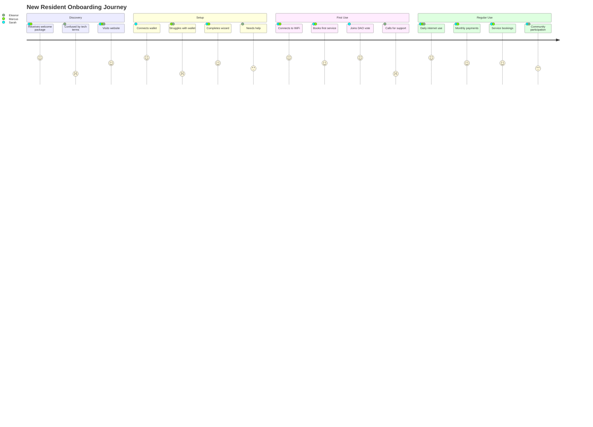

# D Central User Experience Development Guide

## Overview
This guide covers the complete user experience development for D Central, from research to implementation, focusing on creating an intuitive system that residents will actually use and love.

## User Personas & Journey Maps

### Primary Personas

#### 1. Tech-Savvy Owner (Sarah, 32)
- **Background**: Software developer, owns unit, early crypto adopter
- **Goals**: Maximize internet speed, participate in governance, automate everything
- **Pain Points**: Hates calling for maintenance, wants transparency in building finances
- **Devices**: iPhone 14, MacBook Pro, smart home devices

#### 2. Busy Professional Renter (Marcus, 45)
- **Background**: Lawyer, rents unit, minimal tech interest
- **Goals**: Reliable internet for video calls, easy service booking, simple payments
- **Pain Points**: No time for building meetings, needs things to "just work"
- **Devices**: Android phone, Windows laptop

#### 3. Senior Resident Owner (Eleanor, 68)
- **Background**: Retired teacher, owns unit 20+ years, learning technology
- **Goals**: Stay informed about building, get help when needed, maintain community
- **Pain Points**: Complex interfaces, small text, too many options
- **Devices**: iPad, basic smartphone

#### 4. Property Manager (David, 55)
- **Background**: Manages building for 10 years, handles complaints daily
- **Goals**: Reduce repetitive tasks, track everything, keep residents happy
- **Pain Points**: Paper forms, chasing payments, emergency coordination
- **Devices**: Desktop PC, Android tablet

### User Journey Maps



## Core UX Principles

### 1. Progressive Disclosure
Start simple, reveal complexity gradually
```typescript
// Bad: Overwhelming first screen
<Dashboard>
  <MeshTopology />
  <DAOProposals />
  <ServiceMarketplace />
  <PaymentHistory />
  <IoTSensors />
</Dashboard>

// Good: Focused welcome with clear actions
<Welcome>
  <QuickActions>
    <ConnectToInternet />
    <BookService />
    <PayBill />
  </QuickActions>
  <LearnMore href="/advanced" />
</Welcome>
```

### 2. Accessible by Default
Every interface works for everyone
```typescript
// Accessibility-first component
export function ActionButton({ 
  children, 
  onClick, 
  importance = 'primary' 
}: ActionButtonProps) {
  return (
    <button
      onClick={onClick}
      className={cn(
        // Base styles with large touch targets
        "min-h-[48px] min-w-[48px] px-6 py-3",
        "text-lg font-medium rounded-lg",
        "transition-all duration-200",
        "focus:outline-none focus:ring-4",
        // Importance variants
        importance === 'primary' && [
          "bg-blue-600 text-white",
          "hover:bg-blue-700 active:bg-blue-800",
          "focus:ring-blue-500/50"
        ],
        importance === 'secondary' && [
          "bg-gray-200 text-gray-900",
          "hover:bg-gray-300 active:bg-gray-400",
          "focus:ring-gray-500/50"
        ]
      )}
      // Accessibility attributes
      role="button"
      tabIndex={0}
      aria-label={typeof children === 'string' ? children : undefined}
    >
      {children}
    </button>
  )
}
```

### 3. Fail Gracefully
Always provide fallbacks and clear error states
```typescript
export function ServiceBooking() {
  const { data, error, isLoading } = useServices()
  
  // Loading state
  if (isLoading) {
    return (
      <div className="space-y-4 animate-pulse">
        {[1,2,3].map(i => (
          <div key={i} className="h-32 bg-gray-200 rounded-lg" />
        ))}
      </div>
    )
  }
  
  // Error state with recovery
  if (error) {
    return (
      <ErrorCard
        title="Services temporarily unavailable"
        description="We're having trouble loading services right now."
        actions={[
          { label: "Try Again", onClick: refetch },
          { label: "Call Front Desk", href: "tel:+1234567890" }
        ]}
      />
    )
  }
  
  // Empty state
  if (!data?.length) {
    return (
      <EmptyState
        icon={<ServicesIcon />}
        title="No services available"
        description="Check back later or suggest a service you'd like to see."
        action={{ label: "Suggest Service", onClick: openSuggestionForm }}
      />
    )
  }
  
  // Success state
  return <ServiceGrid services={data} />
}
```

## Implementation Guide

### Phase 1: Foundation (Days 1-7)

#### 1. Design System Setup

```typescript
// packages/frontend/design-system/tokens.ts
export const tokens = {
  // Semantic color system
  colors: {
    // Brand colors
    primary: {
      50: '#eff6ff',
      500: '#3b82f6',
      600: '#2563eb',
      700: '#1d4ed8',
      900: '#1e3a8a'
    },
    // Semantic colors
    success: {
      light: '#d1fae5',
      DEFAULT: '#10b981',
      dark: '#065f46'
    },
    warning: {
      light: '#fef3c7',
      DEFAULT: '#f59e0b',
      dark: '#92400e'
    },
    error: {
      light: '#fee2e2',
      DEFAULT: '#ef4444',
      dark: '#991b1b'
    }
  },
  
  // Typography scale
  typography: {
    fonts: {
      sans: 'Inter, system-ui, -apple-system, sans-serif',
      mono: 'JetBrains Mono, monospace'
    },
    sizes: {
      xs: '0.75rem',    // 12px
      sm: '0.875rem',   // 14px
      base: '1rem',     // 16px
      lg: '1.125rem',   // 18px
      xl: '1.25rem',    // 20px
      '2xl': '1.5rem',  // 24px
      '3xl': '1.875rem', // 30px
      '4xl': '2.25rem'  // 36px
    }
  },
  
  // Spacing system (8px base)
  spacing: {
    0: '0',
    1: '0.25rem',  // 4px
    2: '0.5rem',   // 8px
    3: '0.75rem',  // 12px
    4: '1rem',     // 16px
    6: '1.5rem',   // 24px
    8: '2rem',     // 32px
    12: '3rem',    // 48px
    16: '4rem',    // 64px
    24: '6rem'     // 96px
  },
  
  // Animation
  animation: {
    duration: {
      fast: '150ms',
      normal: '300ms',
      slow: '500ms'
    },
    easing: {
      default: 'cubic-bezier(0.4, 0, 0.2, 1)',
      in: 'cubic-bezier(0.4, 0, 1, 1)',
      out: 'cubic-bezier(0, 0, 0.2, 1)',
      bounce: 'cubic-bezier(0.68, -0.55, 0.265, 1.55)'
    }
  }
}
```

#### 2. Component Library

```typescript
// packages/frontend/components/ui/Card.tsx
import { forwardRef } from 'react'
import { cn } from '@/lib/utils'

interface CardProps extends React.HTMLAttributes<HTMLDivElement> {
  variant?: 'default' | 'interactive' | 'warning' | 'success'
  padding?: 'none' | 'sm' | 'md' | 'lg'
}

export const Card = forwardRef<HTMLDivElement, CardProps>(({
  className,
  variant = 'default',
  padding = 'md',
  ...props
}, ref) => {
  return (
    <div
      ref={ref}
      className={cn(
        // Base styles
        "rounded-xl border transition-all duration-200",
        // Variant styles
        variant === 'default' && "bg-white border-gray-200",
        variant === 'interactive' && [
          "bg-white border-gray-200",
          "hover:border-gray-300 hover:shadow-md",
          "cursor-pointer"
        ],
        variant === 'warning' && "bg-yellow-50 border-yellow-200",
        variant === 'success' && "bg-green-50 border-green-200",
        // Padding
        padding === 'sm' && "p-4",
        padding === 'md' && "p-6",
        padding === 'lg' && "p-8",
        className
      )}
      {...props}
    />
  )
})

// Usage
<Card variant="interactive" onClick={handleClick}>
  <h3>Book a Service</h3>
  <p>Find trusted providers in your building</p>
</Card>
```

### Phase 2: Core Experiences (Days 8-14)

#### 1. Onboarding Flow

```typescript
// packages/frontend/components/onboarding/OnboardingFlow.tsx
import { useState } from 'react'
import { motion, AnimatePresence } from 'framer-motion'
import confetti from 'canvas-confetti'

const steps = [
  { id: 'welcome', component: WelcomeStep },
  { id: 'wallet', component: WalletStep },
  { id: 'profile', component: ProfileStep },
  { id: 'wifi', component: WiFiStep },
  { id: 'complete', component: CompleteStep }
]

export function OnboardingFlow() {
  const [currentStep, setCurrentStep] = useState(0)
  const [userData, setUserData] = useState<UserData>({})
  
  const CurrentStepComponent = steps[currentStep].component
  
  const handleNext = (data?: Partial<UserData>) => {
    if (data) {
      setUserData(prev => ({ ...prev, ...data }))
    }
    
    if (currentStep < steps.length - 1) {
      setCurrentStep(prev => prev + 1)
    } else {
      // Celebration!
      confetti({
        particleCount: 100,
        spread: 70,
        origin: { y: 0.6 }
      })
      completeOnboarding(userData)
    }
  }
  
  const handleBack = () => {
    setCurrentStep(prev => Math.max(0, prev - 1))
  }
  
  return (
    <div className="min-h-screen flex items-center justify-center p-4">
      <div className="w-full max-w-lg">
        {/* Progress indicator */}
        <div className="mb-8">
          <div className="flex items-center justify-between mb-2">
            {steps.map((step, index) => (
              <div
                key={step.id}
                className={cn(
                  "flex-1 h-2 rounded-full mx-1 transition-all duration-300",
                  index <= currentStep ? "bg-blue-600" : "bg-gray-200"
                )}
              />
            ))}
          </div>
          <p className="text-sm text-gray-600 text-center">
            Step {currentStep + 1} of {steps.length}
          </p>
        </div>
        
        {/* Step content */}
        <AnimatePresence mode="wait">
          <motion.div
            key={currentStep}
            initial={{ opacity: 0, x: 20 }}
            animate={{ opacity: 1, x: 0 }}
            exit={{ opacity: 0, x: -20 }}
            transition={{ duration: 0.3 }}
          >
            <CurrentStepComponent
              userData={userData}
              onNext={handleNext}
              onBack={handleBack}
              isFirstStep={currentStep === 0}
              isLastStep={currentStep === steps.length - 1}
            />
          </motion.div>
        </AnimatePresence>
      </div>
    </div>
  )
}

// Individual step components
function WelcomeStep({ onNext }: StepProps) {
  return (
    <Card className="text-center space-y-6">
      <div className="w-24 h-24 bg-blue-100 rounded-full flex items-center justify-center mx-auto">
        <HomeIcon className="w-12 h-12 text-blue-600" />
      </div>
      
      <div>
        <h1 className="text-3xl font-bold mb-2">
          Welcome to D Central
        </h1>
        <p className="text-gray-600">
          Your building's new management system
        </p>
      </div>
      
      <div className="space-y-4 text-left">
        <Feature
          icon={<WifiIcon />}
          title="High-Speed Internet"
          description="Mesh network throughout the building"
        />
        <Feature
          icon={<UsersIcon />}
          title="Community Governance"
          description="Vote on building decisions"
        />
        <Feature
          icon={<ToolIcon />}
          title="Easy Service Booking"
          description="Trusted providers at your fingertips"
        />
      </div>
      
      <Button onClick={() => onNext()} className="w-full">
        Get Started
      </Button>
    </Card>
  )
}
```

#### 2. Dashboard Experience

```typescript
// packages/frontend/app/dashboard/page.tsx
'use client'

import { useResident } from '@/hooks/useResident'
import { DashboardLayout } from '@/components/layouts/DashboardLayout'
import { QuickActions } from '@/components/dashboard/QuickActions'
import { ActivityFeed } from '@/components/dashboard/ActivityFeed'
import { MeshStatus } from '@/components/dashboard/MeshStatus'

export default function Dashboard() {
  const { resident, isLoading } = useResident()
  
  if (isLoading) {
    return <DashboardSkeleton />
  }
  
  return (
    <DashboardLayout>
      {/* Personalized greeting */}
      <div className="mb-8">
        <h1 className="text-3xl font-bold">
          Good {getTimeOfDay()}, {resident?.firstName || 'Resident'}
        </h1>
        <p className="text-gray-600 mt-2">
          {getPersonalizedMessage(resident)}
        </p>
      </div>
      
      {/* Priority notifications */}
      <NotificationBanner />
      
      {/* Main grid */}
      <div className="grid grid-cols-1 lg:grid-cols-3 gap-6">
        {/* Quick actions - most important */}
        <div className="lg:col-span-2 space-y-6">
          <QuickActions />
          <YourBookings />
          <ActiveProposals />
        </div>
        
        {/* Supporting information */}
        <div className="space-y-6">
          <MeshStatus />
          <MonthlyStatement />
          <ActivityFeed />
        </div>
      </div>
    </DashboardLayout>
  )
}

function QuickActions() {
  const actions = [
    {
      icon: <CalendarIcon />,
      label: 'Book a Service',
      description: 'Cleaning, maintenance, deliveries',
      href: '/services',
      color: 'blue'
    },
    {
      icon: <CreditCardIcon />,
      label: 'Pay Monthly Fees',
      description: 'Due in 5 days',
      href: '/payments',
      color: 'green',
      badge: '$450'
    },
    {
      icon: <VoteIcon />,
      label: 'Vote on Proposals',
      description: '2 active proposals',
      href: '/governance',
      color: 'purple',
      badge: '2'
    },
    {
      icon: <MessageIcon />,
      label: 'Building Notices',
      description: 'Elevator maintenance tomorrow',
      href: '/notices',
      color: 'yellow',
      badge: '1'
    }
  ]
  
  return (
    <Card>
      <h2 className="text-xl font-semibold mb-4">Quick Actions</h2>
      <div className="grid grid-cols-1 sm:grid-cols-2 gap-4">
        {actions.map(action => (
          <QuickActionCard key={action.label} {...action} />
        ))}
      </div>
    </Card>
  )
}
```

#### 3. Service Booking Flow

```typescript
// packages/frontend/components/services/BookingFlow.tsx
export function BookingFlow({ service }: { service: Service }) {
  const [step, setStep] = useState<'details' | 'datetime' | 'confirm'>('details')
  const [booking, setBooking] = useState<BookingData>({
    serviceId: service.id,
    date: '',
    time: '',
    notes: ''
  })
  
  return (
    <Modal size="lg" onClose={onClose}>
      {/* Visual progress */}
      <div className="flex items-center justify-between mb-6 px-6 pt-6">
        <StepIndicator
          steps={['Details', 'Schedule', 'Confirm']}
          currentStep={step === 'details' ? 0 : step === 'datetime' ? 1 : 2}
        />
      </div>
      
      <AnimatePresence mode="wait">
        {step === 'details' && (
          <motion.div
            key="details"
            initial={{ opacity: 0, x: 20 }}
            animate={{ opacity: 1, x: 0 }}
            exit={{ opacity: 0, x: -20 }}
          >
            <ServiceDetails
              service={service}
              onNext={() => setStep('datetime')}
            />
          </motion.div>
        )}
        
        {step === 'datetime' && (
          <motion.div
            key="datetime"
            initial={{ opacity: 0, x: 20 }}
            animate={{ opacity: 1, x: 0 }}
            exit={{ opacity: 0, x: -20 }}
          >
            <DateTimeSelector
              service={service}
              value={{ date: booking.date, time: booking.time }}
              onChange={(dt) => setBooking({ ...booking, ...dt })}
              onNext={() => setStep('confirm')}
              onBack={() => setStep('details')}
            />
          </motion.div>
        )}
        
        {step === 'confirm' && (
          <motion.div
            key="confirm"
            initial={{ opacity: 0, x: 20 }}
            animate={{ opacity: 1, x: 0 }}
            exit={{ opacity: 0, x: -20 }}
          >
            <BookingConfirmation
              service={service}
              booking={booking}
              onConfirm={handleConfirm}
              onBack={() => setStep('datetime')}
            />
          </motion.div>
        )}
      </AnimatePresence>
    </Modal>
  )
}

// Smart date/time selection
function DateTimeSelector({ service, value, onChange, onNext, onBack }) {
  const { data: availability } = useServiceAvailability(service.id)
  
  return (
    <div className="px-6 pb-6 space-y-6">
      <div>
        <h3 className="text-lg font-semibold mb-4">
          When do you need {service.title}?
        </h3>
        
        {/* Calendar with availability */}
        <Calendar
          mode="single"
          selected={value.date}
          onSelect={(date) => onChange({ date })}
          disabled={(date) => !isDateAvailable(date, availability)}
          className="rounded-lg border"
        />
      </div>
      
      {value.date && (
        <motion.div
          initial={{ opacity: 0, y: 20 }}
          animate={{ opacity: 1, y: 0 }}
        >
          <h4 className="font-medium mb-3">Available times</h4>
          <div className="grid grid-cols-3 gap-2">
            {getAvailableTimesForDate(value.date, availability).map(time => (
              <Button
                key={time}
                variant={value.time === time ? 'primary' : 'outline'}
                onClick={() => onChange({ time })}
                className="py-2"
              >
                {formatTime(time)}
              </Button>
            ))}
          </div>
        </motion.div>
      )}
      
      <div className="flex gap-3">
        <Button variant="outline" onClick={onBack} className="flex-1">
          Back
        </Button>
        <Button 
          onClick={onNext} 
          disabled={!value.date || !value.time}
          className="flex-1"
        >
          Continue
        </Button>
      </div>
    </div>
  )
}
```

### Phase 3: Advanced Features (Days 15-21)

#### 1. Real-time Mesh Visualization

```typescript
// packages/frontend/components/mesh/MeshVisualization.tsx
import { useEffect, useRef } from 'react'
import * as d3 from 'd3'
import { useMeshTopology } from '@/hooks/useMeshTopology'

export function MeshVisualization() {
  const svgRef = useRef<SVGSVGElement>(null)
  const { nodes, links, metrics } = useMeshTopology()
  
  useEffect(() => {
    if (!nodes.length || !svgRef.current) return
    
    const width = svgRef.current.clientWidth
    const height = 400
    
    // Clear previous
    d3.select(svgRef.current).selectAll('*').remove()
    
    const svg = d3.select(svgRef.current)
      .attr('viewBox', `0 0 ${width} ${height}`)
    
    // Create force simulation
    const simulation = d3.forceSimulation(nodes)
      .force('link', d3.forceLink(links).id(d => d.id).distance(100))
      .force('charge', d3.forceManyBody().strength(-300))
      .force('center', d3.forceCenter(width / 2, height / 2))
    
    // Add links
    const link = svg.append('g')
      .selectAll('line')
      .data(links)
      .join('line')
      .attr('stroke', d => getConnectionColor(d.strength))
      .attr('stroke-width', d => Math.sqrt(d.strength) * 2)
      .attr('opacity', 0.6)
    
    // Add nodes
    const node = svg.append('g')
      .selectAll('g')
      .data(nodes)
      .join('g')
      .call(drag(simulation))
    
    // Node circles
    node.append('circle')
      .attr('r', d => d.type === 'gateway' ? 20 : 15)
      .attr('fill', d => getNodeColor(d))
      .attr('stroke', '#fff')
      .attr('stroke-width', 2)
    
    // Node labels
    node.append('text')
      .text(d => d.label)
      .attr('x', 0)
      .attr('y', 30)
      .attr('text-anchor', 'middle')
      .attr('font-size', '12px')
      .attr('fill', '#666')
    
    // Add tooltips
    const tooltip = d3.select('body').append('div')
      .attr('class', 'mesh-tooltip')
      .style('opacity', 0)
    
    node.on('mouseover', (event, d) => {
      tooltip.transition().duration(200).style('opacity', 0.9)
      tooltip.html(getNodeTooltip(d))
        .style('left', (event.pageX + 10) + 'px')
        .style('top', (event.pageY - 28) + 'px')
    })
    .on('mouseout', () => {
      tooltip.transition().duration(500).style('opacity', 0)
    })
    
    // Update positions on tick
    simulation.on('tick', () => {
      link
        .attr('x1', d => d.source.x)
        .attr('y1', d => d.source.y)
        .attr('x2', d => d.target.x)
        .attr('y2', d => d.target.y)
      
      node.attr('transform', d => `translate(${d.x},${d.y})`)
    })
    
    return () => {
      simulation.stop()
      tooltip.remove()
    }
  }, [nodes, links])
  
  return (
    <Card>
      <div className="flex items-center justify-between mb-4">
        <h3 className="text-lg font-semibold">Mesh Network Status</h3>
        <div className="flex items-center gap-4 text-sm">
          <div className="flex items-center gap-2">
            <div className="w-3 h-3 rounded-full bg-green-500" />
            <span>Online ({nodes.filter(n => n.status === 'online').length})</span>
          </div>
          <div className="flex items-center gap-2">
            <div className="w-3 h-3 rounded-full bg-yellow-500" />
            <span>Weak ({nodes.filter(n => n.strength < 50).length})</span>
          </div>
        </div>
      </div>
      
      <svg ref={svgRef} className="w-full h-[400px]" />
      
      <div className="mt-4 grid grid-cols-3 gap-4 text-sm">
        <MetricCard
          label="Avg Latency"
          value={`${metrics.avgLatency}ms`}
          trend={metrics.latencyTrend}
        />
        <MetricCard
          label="Throughput"
          value={`${metrics.throughput}Mbps`}
          trend={metrics.throughputTrend}
        />
        <MetricCard
          label="Packet Loss"
          value={`${metrics.packetLoss}%`}
          trend={metrics.packetLossTrend}
        />
      </div>
    </Card>
  )
}
```

#### 2. Voice Interface

```typescript
// packages/frontend/hooks/useVoiceCommands.ts
export function useVoiceCommands() {
  const [isListening, setIsListening] = useState(false)
  const recognition = useRef<SpeechRecognition>()
  
  useEffect(() => {
    if (!('webkitSpeechRecognition' in window)) return
    
    recognition.current = new webkitSpeechRecognition()
    recognition.current.continuous = false
    recognition.current.interimResults = false
    recognition.current.lang = 'en-US'
    
    recognition.current.onresult = (event) => {
      const command = event.results[0][0].transcript.toLowerCase()
      handleVoiceCommand(command)
    }
    
    recognition.current.onerror = (event) => {
      console.error('Speech recognition error', event.error)
      setIsListening(false)
    }
    
    recognition.current.onend = () => {
      setIsListening(false)
    }
  }, [])
  
  const startListening = () => {
    recognition.current?.start()
    setIsListening(true)
    
    // Audio feedback
    playSound('listening-start')
  }
  
  const handleVoiceCommand = (command: string) => {
    // Natural language processing
    if (command.includes('book') && command.includes('cleaning')) {
      navigate('/services?category=cleaning')
      speak('Opening cleaning services')
    } else if (command.includes('pay') && command.includes('bill')) {
      navigate('/payments')
      speak('Opening payment page')
    } else if (command.includes('internet') && command.includes('slow')) {
      navigate('/support/internet')
      speak('I\'ll help you troubleshoot your internet connection')
    } else {
      speak('Sorry, I didn\'t understand that command')
    }
  }
  
  return { isListening, startListening }
}

// Voice assistant button
export function VoiceAssistant() {
  const { isListening, startListening } = useVoiceCommands()
  
  return (
    <Button
      onClick={startListening}
      className={cn(
        "fixed bottom-6 right-6 w-16 h-16 rounded-full shadow-lg",
        "flex items-center justify-center",
        isListening && "animate-pulse bg-red-500"
      )}
      aria-label="Voice commands"
    >
      <MicrophoneIcon className="w-6 h-6" />
    </Button>
  )
}
```

### Phase 4: Polish & Delight (Days 22-28)

#### 1. Micro-interactions

```typescript
// packages/frontend/components/animations/MicroInteractions.tsx
import { motion, useAnimation } from 'framer-motion'
import { useSound } from 'use-sound'

export function ServiceCard({ service, onBook }) {
  const controls = useAnimation()
  const [playHover] = useSound('/sounds/hover.mp3', { volume: 0.25 })
  const [playClick] = useSound('/sounds/click.mp3', { volume: 0.5 })
  
  return (
    <motion.div
      className="relative overflow-hidden rounded-xl"
      whileHover={{ scale: 1.02 }}
      whileTap={{ scale: 0.98 }}
      onHoverStart={() => {
        playHover()
        controls.start({ opacity: 1 })
      }}
      onHoverEnd={() => {
        controls.start({ opacity: 0 })
      }}
    >
      <Card variant="interactive">
        {/* Hover effect overlay */}
        <motion.div
          className="absolute inset-0 bg-gradient-to-r from-blue-500/10 to-purple-500/10"
          initial={{ opacity: 0 }}
          animate={controls}
          transition={{ duration: 0.3 }}
        />
        
        {/* Content */}
        <div className="relative z-10">
          <h3>{service.title}</h3>
          <p>{service.description}</p>
          
          <motion.button
            className="mt-4 px-4 py-2 bg-blue-600 text-white rounded-lg"
            whileHover={{ scale: 1.05 }}
            whileTap={{ scale: 0.95 }}
            onClick={() => {
              playClick()
              onBook(service)
            }}
          >
            Book Now
          </motion.button>
        </div>
      </Card>
    </motion.div>
  )
}
```

#### 2. Loading States

```typescript
// packages/frontend/components/loading/ContentLoader.tsx
export function ServiceCardSkeleton() {
  return (
    <div className="animate-pulse">
      <div className="bg-gray-200 h-48 rounded-t-xl" />
      <div className="p-4 space-y-3">
        <div className="h-6 bg-gray-200 rounded w-3/4" />
        <div className="h-4 bg-gray-200 rounded w-full" />
        <div className="h-4 bg-gray-200 rounded w-5/6" />
        <div className="flex justify-between items-center mt-4">
          <div className="h-4 bg-gray-200 rounded w-20" />
          <div className="h-8 bg-gray-200 rounded w-24" />
        </div>
      </div>
    </div>
  )
}

// Stagger animation for lists
export function ServiceGrid({ services, isLoading }) {
  if (isLoading) {
    return (
      <div className="grid grid-cols-1 md:grid-cols-2 lg:grid-cols-3 gap-6">
        {[...Array(6)].map((_, i) => (
          <motion.div
            key={i}
            initial={{ opacity: 0, y: 20 }}
            animate={{ opacity: 1, y: 0 }}
            transition={{ delay: i * 0.1 }}
          >
            <ServiceCardSkeleton />
          </motion.div>
        ))}
      </div>
    )
  }
  
  return (
    <div className="grid grid-cols-1 md:grid-cols-2 lg:grid-cols-3 gap-6">
      {services.map((service, i) => (
        <motion.div
          key={service.id}
          initial={{ opacity: 0, y: 20 }}
          animate={{ opacity: 1, y: 0 }}
          transition={{ delay: i * 0.05 }}
        >
          <ServiceCard service={service} />
        </motion.div>
      ))}
    </div>
  )
}
```

#### 3. Empty States

```typescript
// packages/frontend/components/EmptyStates.tsx
export function EmptyState({ 
  icon, 
  title, 
  description, 
  action,
  illustration 
}: EmptyStateProps) {
  return (
    <motion.div
      className="flex flex-col items-center justify-center py-12 px-4 text-center"
      initial={{ opacity: 0, scale: 0.9 }}
      animate={{ opacity: 1, scale: 1 }}
      transition={{ duration: 0.3 }}
    >
      {illustration ? (
        
      ) : (
        <div className="w-20 h-20 bg-gray-100 rounded-full flex items-center justify-center mb-6">
          {icon}
        </div>
      )}
      
      <h3 className="text-xl font-semibold mb-2">{title}</h3>
      <p className="text-gray-600 max-w-sm mb-6">{description}</p>
      
      {action && (
        <Button onClick={action.onClick}>
          {action.label}
        </Button>
      )}
    </motion.div>
  )
}

// Context-specific empty states
export const emptyStates = {
  services: {
    icon: <ServicesIcon className="w-10 h-10 text-gray-400" />,
    title: "No services available",
    description: "Check back later or suggest a service you'd like to see in your building.",
    action: {
      label: "Suggest a Service",
      onClick: () => openSuggestionForm()
    }
  },
  
  bookings: {
    illustration: "/illustrations/calendar-empty.svg",
    title: "No upcoming bookings",
    description: "Book a service to keep your home in perfect condition.",
    action: {
      label: "Browse Services",
      onClick: () => navigate('/services')
    }
  },
  
  proposals: {
    icon: <VoteIcon className="w-10 h-10 text-gray-400" />,
    title: "No active proposals",
    description: "When your building has decisions to make, you'll see them here.",
    action: {
      label: "Learn About Governance",
      onClick: () => navigate('/governance/guide')
    }
  }
}
```

## Testing & Validation

### Usability Testing Protocol

```typescript
// test/usability/test-scenarios.ts
export const usabilityScenarios = [
  {
    persona: 'Senior Resident',
    scenario: 'Book a cleaning service',
    tasks: [
      'Find the services section',
      'Browse cleaning services',
      'Select a provider',
      'Choose a date and time',
      'Complete booking'
    ],
    successCriteria: {
      maxTime: 300, // 5 minutes
      maxErrors: 2,
      satisfactionMin: 4 // out of 5
    }
  },
  {
    persona: 'Busy Professional',
    scenario: 'Pay monthly fees quickly',
    tasks: [
      'Access payment section',
      'Review statement',
      'Complete payment'
    ],
    successCriteria: {
      maxTime: 120, // 2 minutes
      maxErrors: 0,
      satisfactionMin: 5
    }
  }
]

// Automated accessibility testing
describe('Accessibility', () => {
  it('meets WCAG 2.1 AA standards', async () => {
    const results = await axe(page)
    expect(results.violations).toHaveLength(0)
  })
  
  it('is fully keyboard navigable', async () => {
    await page.keyboard.press('Tab')
    const focusedElement = await page.evaluate(() => 
      document.activeElement?.tagName
    )
    expect(focusedElement).toBe('BUTTON')
  })
  
  it('works with screen readers', async () => {
    const ariaLabels = await page.$$eval('[aria-label]', 
      elements => elements.map(el => el.getAttribute('aria-label'))
    )
    expect(ariaLabels.every(label => label?.length > 0)).toBe(true)
  })
})
```

### Performance Monitoring

```typescript
// packages/frontend/utils/performance.ts
export function measurePerformance() {
  // Core Web Vitals
  if ('web-vitals' in window) {
    import('web-vitals').then(({ getCLS, getFID, getLCP }) => {
      getCLS(console.log)  // Cumulative Layout Shift
      getFID(console.log)  // First Input Delay
      getLCP(console.log)  // Largest Contentful Paint
    })
  }
  
  // Custom metrics
  performance.mark('app-interactive')
  
  // Track specific user flows
  const flowTimer = {
    start(flowName: string) {
      performance.mark(`${flowName}-start`)
    },
    end(flowName: string) {
      performance.mark(`${flowName}-end`)
      performance.measure(
        flowName,
        `${flowName}-start`,
        `${flowName}-end`
      )
      
      const measure = performance.getEntriesByName(flowName)[0]
      analytics.track('flow_completed', {
        flow: flowName,
        duration: measure.duration
      })
    }
  }
  
  return flowTimer
}
```

## Launch Readiness Checklist

### UX Launch Criteria

- [ ] **Accessibility**
  - [ ] WCAG 2.1 AA compliant
  - [ ] Screen reader tested
  - [ ] Keyboard navigation complete
  - [ ] Color contrast passes

- [ ] **Performance**
  - [ ] LCP < 2.5s
  - [ ] FID < 100ms
  - [ ] CLS < 0.1
  - [ ] Offline mode works

- [ ] **Cross-platform**
  - [ ] Desktop: Chrome, Safari, Firefox, Edge
  - [ ] Mobile: iOS Safari, Chrome Android
  - [ ] Tablet: iPad, Android tablets
  - [ ] PWA installable

- [ ] **User Testing**
  - [ ] 10+ residents tested
  - [ ] All personas represented
  - [ ] 90%+ task completion
  - [ ] 4.5+ satisfaction rating

- [ ] **Documentation**
  - [ ] Video tutorials created
  - [ ] Help center populated
  - [ ] FAQ comprehensive
  - [ ] Support contact clear

## Continuous Improvement

### Analytics Implementation

```typescript
// packages/frontend/utils/analytics.ts
export const analytics = {
  // User behavior
  trackEvent(event: string, properties?: any) {
    if (typeof window !== 'undefined' && window.gtag) {
      window.gtag('event', event, properties)
    }
  },
  
  // Feature adoption
  trackFeatureUse(feature: string) {
    this.trackEvent('feature_used', { feature })
  },
  
  // Error tracking
  trackError(error: Error, context?: any) {
    console.error(error)
    this.trackEvent('error', {
      message: error.message,
      stack: error.stack,
      ...context
    })
  },
  
  // User satisfaction
  trackSatisfaction(rating: number, feature: string) {
    this.trackEvent('satisfaction_rating', {
      rating,
      feature
    })
  }
}
```

### A/B Testing Framework

```typescript
// packages/frontend/hooks/useExperiment.ts
export function useExperiment(experimentName: string) {
  const [variant, setVariant] = useState<'control' | 'test'>('control')
  
  useEffect(() => {
    // Get or assign variant
    const storedVariant = localStorage.getItem(`exp_${experimentName}`)
    if (storedVariant) {
      setVariant(storedVariant as any)
    } else {
      const assigned = Math.random() > 0.5 ? 'test' : 'control'
      localStorage.setItem(`exp_${experimentName}`, assigned)
      setVariant(assigned)
      
      analytics.trackEvent('experiment_assigned', {
        experiment: experimentName,
        variant: assigned
      })
    }
  }, [experimentName])
  
  return variant
}

// Usage
function ServiceCard() {
  const cardStyle = useExperiment('service-card-style')
  
  if (cardStyle === 'test') {
    return <ModernServiceCard />
  }
  
  return <ClassicServiceCard />
}
```

---

## Summary

Building a great user experience for D Central requires:

1. **Understanding users deeply** - From tech-savvy owners to senior residents
2. **Progressive disclosure** - Start simple, reveal complexity gradually  
3. **Accessibility first** - Every feature works for everyone
4. **Performance obsession** - Fast, smooth, reliable
5. **Continuous iteration** - Measure, learn, improve

The key is to focus on the core user journey first (onboarding → daily use → engagement) and polish every interaction until it feels effortless. Remember: residents didn't choose this system - it was chosen for them. Our job is to make them glad it was.
