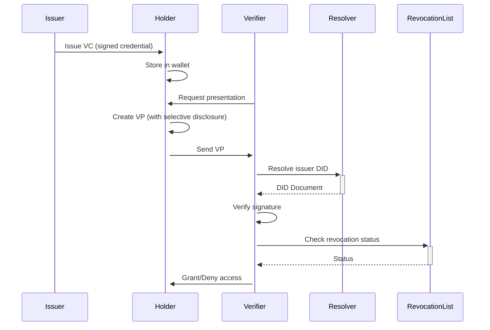

# D-Central Whole-of-Life Mesh Architecture: Critical Expansion & Analysis

**A Comprehensive Technical Deep-Dive with Critical Evaluation**

---

## Executive Summary

D-Central's "Whole-of-Life Mesh Architecture" proposes a radical reimagining of digital infrastructure where every home, person, and device becomes a sovereign, authenticated participant in a shared civic, social, and economic ecosystem. While ambitious and technically fascinating, this architecture faces significant challenges in implementation complexity, user adoption, economic viability, and governance at scale.

This document provides both an exhaustive expansion of the concept and a rigorous critical analysis of its assumptions, vulnerabilities, and practical limitations.

---

## Table of Contents

1. [Architectural Deep Dive](#1-architectural-deep-dive)
2. [Identity & Credential Infrastructure](#2-identity--credential-infrastructure)
3. [Governance Mechanisms](#3-governance-mechanisms)
4. [Economic Model Analysis](#4-economic-model-analysis)
5. [Technical Implementation Challenges](#5-technical-implementation-challenges)
6. [Security & Privacy Concerns](#6-security--privacy-concerns)
7. [Social & Human Factors](#7-social--human-factors)
8. [Legal & Regulatory Barriers](#8-legal--regulatory-barriers)
9. [Scalability Analysis](#9-scalability-analysis)
10. [Failure Modes & Attack Vectors](#10-failure-modes--attack-vectors)
11. [Alternative Approaches](#11-alternative-approaches)
12. [Path to Viability](#12-path-to-viability)

---

## 1. Architectural Deep Dive

### 1.1 Fractal DAO Hierarchy: Technical Expansion

The proposed architecture creates nested governance layers:

```
Individual (PersonDAO)
    ↓ controls/participates in
Household (HomeDAO)
    ↓ federates into
Neighborhood (NeighborDAO/HOADAO)
    ↓ coordinates with
Municipality (CityDAO)
    ↓ integrates with
Regional/National (RegionalDAO)
```

#### **Technical Requirements for Each Layer:**

**PersonDAO:**
- Personal DID wallet with secure enclave/TPM backing
- Private key management (recovery, inheritance, multi-device sync)
- Personal data vault with selective disclosure mechanisms
- Device authentication and authorization framework
- Personal AI agent for automated policy enforcement
- Reputation tracking across multiple contexts

**HomeDAO:**
- Edge gateway node (min 4-core ARM/x86, 8GB RAM, 500GB storage)
- Multi-tenant network segmentation (VLANs, network namespaces)
- Local consensus mechanism for household decisions
- Shared resource pool (bandwidth, storage, compute)
- IoT device registry and credential management
- Energy management and monitoring system
- Backup and disaster recovery infrastructure

**NeighborDAO:**
- Mesh networking infrastructure (min 3-5 nodes for resilience)
- Distributed ledger for community transactions
- Content distribution network (CDN) for local caching
- Emergency communication system (offline-capable)
- Community resource scheduler
- Dispute resolution mechanism
- Insurance/risk pooling smart contracts

**CityDAO:**
- Regional data centers (edge Points of Presence)
- Integration with legacy municipal systems
- Utility company interfaces (power, water, waste)
- Emergency services coordination
- Public infrastructure management
- Regulatory compliance frameworks
- Inter-city federation protocols

### 1.2 Network Stack Analysis

The architecture relies on multiple overlaid networking paradigms:

#### **Traditional IP Layer:**
- Base connectivity via ISPs or mesh WAN
- IPv6 required for address abundance
- BGP/OSPF for routing between neighborhoods
- **Critical Issue:** Assumes universal IPv6 adoption - currently only ~40% global penetration

#### **ICN (Information-Centric Networking):**
- Content addressed by cryptographic hashes
- In-network caching at every node
- Named Data Networking (NDN) or CCNx protocols
- **Critical Issue:** ICN requires fundamental changes to routing hardware; existing infrastructure incompatible

#### **FCN (Function-Centric Networking):**
- Distributed compute orchestration
- Service mesh with automatic failover
- Edge function placement optimization
- **Critical Issue:** Extremely complex scheduling problem; centralized schedulers defeat purpose, distributed schedulers create consensus overhead

#### **Overlay Mesh Networks:**
- B.A.T.M.A.N., Babel, or custom routing protocols
- Opportunistic multi-hop forwarding
- Self-healing topology
- **Critical Issue:** Performance degrades exponentially with hop count; rarely practical beyond 3-5 hops

### 1.3 Storage Architecture

**Local Tier (Home):**
- Primary: SSD/NVMe for hot data (OS, apps, frequently accessed files)
- Secondary: HDD for warm data (backups, archives, media)
- Tertiary: Tape/optical for cold storage (long-term archives)

**Neighborhood Tier:**
- Distributed object storage (Ceph, MinIO clusters)
- Erasure coding for redundancy (k+m scheme)
- Geo-replication to nearby neighborhoods

**Regional Tier:**
- Professional data centers with SLA guarantees
- S3-compatible interfaces for legacy app support
- Disaster recovery and compliance storage

**Critical Analysis:**
- **Cost:** A household needs ~2-4TB initial storage, growing 20-50% annually. At $50/TB, that's $100-200 upfront plus replacement every 3-5 years
- **Reliability:** Consumer-grade storage has 1-5% annual failure rate. With 100 homes, expect 1-5 drive failures per year requiring coordination
- **Consistency:** Achieving strong consistency across mesh is extremely expensive; eventual consistency creates application complexity
- **Energy:** Always-on storage adds 20-50W continuous draw = $20-50/year per household in electricity

---

## 2. Identity & Credential Infrastructure

### 2.1 DID Implementation Complexity

#### **Technical Requirements:**

**DID Methods:**
```
did:dcentral:home:abc123...
did:dcentral:person:xyz789...
did:dcentral:device:device456...
```

Each DID requires:
1. **Key Management:**
   - Primary signing key (Ed25519 or secp256k1)
   - Encryption key (X25519 or ECIES)
   - Recovery keys (Shamir secret sharing, m-of-n threshold)
   - Key rotation mechanism (quarterly recommended)

2. **DID Document Storage:**
   - On-chain: expensive but immutable (~$0.10-1.00 per DID creation)
   - IPFS: decentralized but requires pinning infrastructure
   - Home node: fast but single point of failure
   - Hybrid: complexity multiplier

3. **Resolution Infrastructure:**
   - Universal resolver service (centralization risk)
   - Local caching with expiration policies
   - Revocation checking (CRL or OCSP equivalent)

#### **Verifiable Credentials Flow:**



#### **Critical Problems:**

**1. Key Loss = Identity Loss:**
- Unlike passwords, lost private keys are unrecoverable
- Recovery mechanisms (social recovery, hardware backup) add complexity
- Inheritance/estate planning becomes critical infrastructure
- **Reality Check:** 20% of Bitcoin is permanently lost due to key loss

**2. Revocation Complexity:**
- Credential revocation requires always-online checking
- Privacy leak: checking revocation reveals credential usage
- ZK-SNARK-based revocation is theoretically possible but computationally expensive
- Stale revocation data creates security holes

**3. Selective Disclosure:**
- JSON-LD with BBS+ signatures enables field-level disclosure
- BUT: requires credential reissuance for schema changes
- AND: predicates (age > 18) need ZK-proof circuits - complex to implement
- PLUS: mobile devices lack horsepower for complex ZK operations

**4. Interoperability Hell:**
- W3C DID spec allows hundreds of methods
- No guarantee different implementations can verify each other
- Need universal resolver infrastructure (centralization)
- Legacy system integration requires identity bridges (attack surface)

### 2.2 VC Policy Engine Deep Dive

The policy engine must evaluate complex access rules:

```yaml
policy:
  id: "hoa-voting-policy-v1"
  description: "Rules for casting vote in HOA election"
  
  requirements:
    all_of:
      - credential: "ResidentCredential"
        issuer: "did:dcentral:hoa:westside"
        valid_date: true
        
      - credential: "PropertyOwnerCredential"
        properties:
          property_address:
            within: "Westside subdivision"
          ownership_percent:
            min: 1
            
      - not:
          credential: "DelinquentFeesCredential"
          
  constraints:
    rate_limit:
      max_votes: 1
      period: "per_election"
      
    temporal:
      valid_from: "2025-10-01T00:00:00Z"
      valid_until: "2025-10-31T23:59:59Z"
      
    geo_fence:
      method: "proof_of_location"
      radius_km: 5
      center: [lat, lon]
```

**Implementation Challenges:**

1. **Policy Language:**
   - Need Turing-complete language (Rego, Cedar, custom DSL)
   - Must be auditable by non-programmers
   - Versioning and migration complexity
   - Testing and verification burden

2. **Performance:**
   - Policy evaluation on every request
   - Need caching but invalidation is hard
   - Complex predicates require computation
   - Mobile devices may lack resources

3. **Privacy Leakage:**
   - Policy structure reveals system design
   - Failed authentication attempts leak information
   - Timing attacks on policy evaluation
   - Statistical analysis can infer policies

4. **Governance:**
   - Who updates policies? Centralized authority defeats purpose
   - DAO governance creates lag and coordination costs
   - Policy conflicts between layers (person, home, neighborhood)
   - Emergency override mechanisms needed but dangerous

### 2.3 Reputation Systems

Reputation is proposed as a trust mechanism, but creates severe problems:

#### **Sybil Attacks:**
- Attacker creates many fake identities
- Accumulates reputation through self-dealing
- Gaming mechanisms (voting rings, wash trading)
- **Mitigation:** Proof-of-Personhood (expensive, privacy-invasive)

#### **Reputation Erosion:**
- New members start with zero reputation (chicken-and-egg)
- False accusations can destroy reputation
- No clear path to redemption
- Creates oligarchy of early adopters

#### **Context Collapse:**
- Reputation in one context bleeds to another
- Professional reputation affects social access
- Creates social credit score dystopia
- Privacy implications severe

#### **Gaming Incentives:**
- Once reputation becomes valuable, gaming intensifies
- Need constant anti-gaming measures (arms race)
- False positive punishments harm legitimate users
- False negative failures enable bad actors

---

## 3. Governance Mechanisms

### 3.1 DAO Voting Systems Analysis

#### **Proposed Voting Mechanisms:**

**1. Simple Majority (1-person-1-vote):**
```
✓ Advantages:
  - Easy to understand
  - Appears democratic
  
✗ Disadvantages:
  - 51% attack (tyranny of majority)
  - No protection for minorities
  - Swing voters have disproportionate power
  - Low-information voters dilute decision quality
```

**2. Quadratic Voting:**
```
Cost = (votes)²
Voter with 100 credits can cast:
  - 10 votes on one issue (100 credits)
  - OR 7 votes each on two issues (98 credits)
  - OR 5 votes each on four issues (100 credits)

✓ Advantages:
  - Reveals preference intensity
  - Mitigates majority tyranny
  - Economically efficient
  
✗ Disadvantages:
  - Complexity confuses users
  - Wealthy buy votes through proxies
  - Collusion hard to detect
  - Requires identity uniqueness (Sybil-vulnerable)
```

**3. Reputation-Weighted Voting:**
```
vote_power = reputation_score × stake × participation_rate

✓ Advantages:
  - Rewards expertise and engagement
  - Plutocracy avoidance
  
✗ Disadvantages:
  - Entrenches incumbents
  - Deters new participation
  - Reputation gaming (see above)
  - Opaque to outsiders
```

**4. Conviction Voting:**
```
conviction = time_locked × tokens

Vote power increases the longer tokens are locked

✓ Advantages:
  - Long-term thinking encouraged
  - Hard to manipulate short-term
  
✗ Disadvantages:
  - Whales still dominate
  - Capital requirements exclude poor
  - Illiquidity costs
  - Emergency response slow
```

### 3.2 Multi-Layer Governance Problems

#### **Coordination Failures:**

**Scenario:** City wants to upgrade mesh protocol

```
CityDAO proposes: Upgrade to Protocol V2
  ↓
NeighborDAOs vote:
  - Westside: Yes (60%)
  - Eastside: No (70%)
  - Downtown: Abstain (no quorum)
  ↓
HomeDAOs in Westside vote:
  - 45% actually upgrade
  - 55% delay/ignore
  ↓
PersonDAOs in homes:
  - 30% actively oppose
  - 20% don't understand
  - 50% apathetic
```

**Result:** Fragmented, incompatible network. No clean rollback.

#### **The Tyranny of Structurelessness:**

Without clear decision-making authority:
- Informal power structures emerge
- "Technical elite" make de-facto decisions
- Average users disengaged, feeling powerless
- Charismatic leaders accumulate influence
- Same as "centralized" but without accountability

#### **Decision Paralysis:**

Complex decisions require consensus across layers:

```
Example: Add 5G cell tower to neighborhood

Required approvals:
1. NeighborDAO vote (needs 60% quorum, 70% approval)
2. Each adjacent HomeDAO vote (veto power)
3. CityDAO zoning compliance
4. ComplianceDAO safety certification
5. Individual consent from residents within 100m

Timeline: 6-18 months
Cost: $50,000 in DAO treasury depletion from coordination overhead
Outcome: Usually "no" due to one veto
```

#### **Plutocracy Risk:**

Even with "fair" mechanisms:
- Wealthy buy property → more HomeDAO votes
- Hire lawyers/consultants for proposals
- Fund astroturf campaigns
- Outspend opposition
- Capture governance through economic power

**Real-world parallel:** HOAs often dominated by retirees with time and resources, marginalizing working families.

### 3.3 Emergency Governance

#### **The Problem:**

Decentralized governance is slow. Emergencies require fast response:

- **Security breach:** Need immediate patch deployment
- **Natural disaster:** Resource allocation, evacuation
- **Network attack:** DDoS mitigation, partition healing
- **Economic crisis:** Treasury rescue, token price defense

#### **Solutions Create New Problems:**

**1. Emergency Multi-Sig:**
- Small group (3-of-5, 5-of-9) can act unilaterally
- **Problem:** Centralization, capture risk, single point of failure

**2. Timelock Override:**
- Normal governance has 7-day delay
- Emergency bypass with N signatures
- **Problem:** Definition of "emergency" contested; abuse potential

**3. Futarchy:**
- Prediction markets decide optimal response
- **Problem:** Requires liquid markets; manipulation risk; complex to understand

**4. Delegated Authority:**
- Elected board with term limits
- **Problem:** Recreates representative democracy; why not just use existing government?

### 3.4 Governance Attack Vectors

#### **Voter Apathy:**
- Most users don't vote (typical 5-15% participation)
- Motivated minorities capture decisions
- Creates illusion of legitimacy without actual consent

#### **Vote Buying:**
- Offer payment for votes (in $HOME tokens or services)
- Even with secret ballots, can verify via timing analysis
- Dark DAO patterns (hidden coordination)

#### **Governance Extraction:**
- Malicious proposals that benefit insiders
- "Pork barrel" spending on favored contractors
- Regulatory capture by commercial interests
- Gradual value drainage

#### **Social Engineering:**
- Emotional manipulation of voters
- Misinformation campaigns
- Fake grassroots movements
- Personality cults around influential members

---

## 4. Economic Model Analysis

### 4.1 Token Economics Deep Dive

#### **Proposed Token: $HOME**

```
Purpose: 
  - Local utility payments
  - Governance voting
  - Resource access
  - Marketplace transactions

Supply: 
  - Fixed cap? Inflationary? Demurrage?
  - Initial distribution mechanism?
  - Emission schedule?
```

#### **Critical Token Design Flaws:**

**1. Velocity Problem:**
- If $HOME only used locally, limited utility
- Users immediately convert to fiat after receiving
- High velocity → low token value
- Low token value → weak incentives to participate

**2. Volatility:**
- Small local markets = high price volatility
- Utility bills denominated in $HOME = unpredictable costs
- Speculation amplifies volatility
- Price crashes discourage adoption

**3. Liquidity:**
- Need exchanges to convert $HOME ↔ fiat
- Low liquidity = high spreads (10-30% common)
- Creates implicit tax on all transactions
- Discourages merchant adoption

**4. Tax Implications:**
- In most jurisdictions, crypto transactions are taxable events
- Every $HOME transaction requires cost-basis tracking
- Users need accountants for simple neighbor trades
- Compliance burden kills usage

**5. Network Effects Failure:**
- Value only accrues with universal neighborhood adoption
- Chicken-and-egg: need users for value, need value for users
- First movers subsidize later entrants
- Rational to defect (use fiat instead)

### 4.2 Resource Pricing Mechanisms

#### **Proposed: Market-Based Pricing**

```python
# Simplified bandwidth pricing model
def calculate_bandwidth_price(demand, supply, base_rate):
    utilization = demand / supply
    
    if utilization < 0.5:
        return base_rate * 0.5  # Discount for unused capacity
    elif utilization < 0.8:
        return base_rate
    else:
        return base_rate * (1 + (utilization - 0.8) * 10)  # Surge pricing
```

#### **Problems:**

**1. Price Discovery:**
- No historical data for new neighborhoods
- Bilateral negotiation costly
- Auction mechanisms complex and gas-expensive
- Continuous price changes confuse users

**2. Essential Services:**
- What if bandwidth prices spike during emergency?
- Healthcare data access becomes luxury good
- Creates digital divide within community

**3. Tragedy of the Commons:**
- Shared resources (mesh bandwidth) over-consumed
- Individual rational to free-ride
- Need complex metering and enforcement
- Metering adds overhead (10-20% resource loss)

**4. Predatory Pricing:**
- Wealthy nodes price out poor neighbors
- Monopoly formation (e.g., only fiber uplink holder)
- Need anti-trust mechanisms (more governance overhead)

### 4.3 Revenue Sharing Models

#### **Proposed:** HomeDAO earns from:
- Bandwidth resale
- Compute/storage leasing
- Energy credits (solar surplus)
- Data monetization
- IoT telemetry sales

**Distributed via:**
- Automatic smart contract split
- Proportional to contribution
- Minus DAO operating expenses

#### **Reality Check:**

**1. Revenue Potential:**
```
Average household bandwidth: 1Gbps
Utilization: 5-10% (50-100Mbps average)
Resale potential: 40-80Mbps
Market rate: $0.10-0.50 per Mbps/month
Revenue: $4-40/month per household

Minus:
  - Infrastructure costs: $20-50/month
  - Electricity: $10-20/month
  - Maintenance: $5-10/month
  
NET: -$31 to +$5/month

Conclusion: NOT economically viable for most households
```

**2. Solar Energy Credits:**
```
Average home solar: 5kW system, $15,000 installed
Production: ~6,000 kWh/year
Home consumption: ~4,000 kWh/year
Surplus: ~2,000 kWh/year
Sale price: $0.10/kWh (grid parity)
Revenue: $200/year

ROI: 75 years (vs 6-8 years with net metering)

Conclusion: Peer-to-peer energy dramatically less profitable than grid net metering
```

**3. Data Monetization:**
```
Average household IoT: 20 devices
Data generation: ~10GB/month
Market value: $0.01-0.10 per GB (highly variable)
Revenue: $0.10-1.00/month

Privacy cost: Priceless
Conclusion: Trivial revenue, massive privacy invasion
```

### 4.4 Subsidy Dependency

#### **The Uncomfortable Truth:**

Most "decentralized" projects survive through:
1. **Venture Capital:** Covers operating losses during growth phase
2. **Token Inflation:** Dilutes existing holders to fund operations
3. **Cross-Subsidization:** Profitable users subsidize unprofitable
4. **Volunteer Labor:** Unpaid community contributions

**D-Central would require:**
- $5-20M initial funding for technology development
- $50-200M for pilot deployments and user acquisition
- $500M-2B for city-scale rollouts
- Ongoing operating subsidy of $10-50 per household per month for 5-10 years until network effects materialize

**Without subsidy, rational behavior:**
- Users choose free/cheap centralized alternatives
- Only privacy extremists pay premium
- Insufficient scale for network effects
- Death spiral ensues

---

## 5. Technical Implementation Challenges

### 5.1 Software Stack Complexity

#### **Required Components per Home Node:**

```
Operating System Layer:
├── Custom Linux Distribution (NixOS/Yocto-based)
├── Container Runtime (Docker/Podman/containerd)
├── Hypervisor (KVM/Xen for VM support)
└── Bootloader Security (Secure Boot, measured boot)

Networking Layer:
├── Mesh Routing (B.A.T.M.A.N./Babel/OLSR)
├── ICN Stack (NDN/CCNx implementation)
├── FCN Runtime (custom - doesn't exist yet)
├── VPN/Overlay (WireGuard/Nebula)
├── Network Segmentation (VLANs, network namespaces)
├── Firewall/Security (nftables, IDS/IPS)
└── QoS/Traffic Shaping (tc, cake qdisc)

Identity & Security Layer:
├── DID Agent (custom implementation)
├── VC Wallet (custom implementation)
├── Policy Engine (custom implementation)
├── Key Management (HSM/TPM integration)
├── Certificate Authority (local root CA)
└── Cryptographic Libraries (libsodium, OpenSSL)

Storage Layer:
├── Local Object Store (MinIO/SeaweedFS)
├── Distributed FS (IPFS/Ceph)
├── Database (PostgreSQL/CockroachDB)
├── Time-series DB (InfluxDB/TimescaleDB)
├── Backup System (Restic/Borg)
└── Encryption Layer (dm-crypt/LUKS)

Compute Layer:
├── Container Orchestration (K3s/Nomad)
├── Serverless Runtime (Knative/OpenFaaS)
├── AI/ML Runtime (ONNX/TensorFlow Lite)
└── Service Mesh (Istio/Linkerd - scaled down)

Application Layer:
├── Web Server (Nginx/Caddy)
├── Matrix Homeserver (Synapse/Dendrite)
├── NextCloud Instance
├── Home Assistant
├── Local DNS (CoreDNS/Unbound)
├── NTP Server
└── Monitoring (Prometheus, Grafana)

Governance Layer:
├── DAO Smart Contract Runtime (EVM or custom)
├── Voting Interface
├── Proposal Management
└── Treasury Management
```

**Estimate:** 500,000 - 1,000,000 lines of code (not including dependencies)

**Comparison:**
- Android: ~12-15 million LOC
- Linux kernel: ~27 million LOC
- OpenWRT: ~100,000 LOC

**D-Central complexity:** 5-10x OpenWRT, approaching Android-level complexity

#### **Maintenance Burden:**

- **Updates:** Weekly security patches required
- **Testing:** Need test coverage for 100+ integration points
- **Compatibility:** Must work with 1000+ IoT device types
- **Support:** Average user can't troubleshoot; need professional support tier
- **Documentation:** 10,000+ pages for comprehensive coverage

**Reality:** Requires team of 20-50 full-time developers + QA + support staff

**Cost:** $5-15M per year in ongoing development

### 5.2 Hardware Requirements & Cost

#### **Minimum Viable Home Node:**

```
Component              Specification           Cost
CPU                    Quad-core ARM/x86       $50-150
RAM                    8GB DDR4                $30-60
Storage (Primary)      256GB NVMe SSD          $30-50
Storage (Secondary)    2TB HDD                 $50-80
Network Interface      Gigabit Ethernet        $20-40
Wireless              WiFi 6 (802.11ax)        $30-60
Mesh Radio            LoRa/802.11s             $20-40
TPM/Secure Enclave    Hardware security       $10-30
Power Supply          60W, UPS-backed         $40-80
Case & Cooling        Passive/Low-noise       $20-40
                                    
TOTAL (per household)                       $300-630
```

**For 100-household neighborhood:**
- Initial hardware: $30,000-63,000
- Annual replacement (15%): $4,500-9,500
- Electricity (50W avg × 100): $4,400/year (@$0.10/kWh)

**Additional Infrastructure:**
- Neighborhood fiber backhaul: $10,000-50,000
- Mesh antennas and mounting: $5,000-20,000
- Professional installation: $100-300 per household = $10,000-30,000

**Total 5-year TCO for 100 homes:** $150,000-300,000

**Per household:** $1,500-3,000 over 5 years = $25-50/month

**Comparison:**
- Typical ISP: $50-100/month
- Google Fiber: $70/month
- Starlink: $110/month

**Conclusion:** D-Central cost-competitive ONLY IF:
1. Volunteer labor (no installation/support cost)
2. Cheap hardware (economies of scale)
3. No commercial ISP alternative
4. Community willing to self-manage

### 5.3 Interoperability Nightmares

#### **Legacy System Integration:**

**Problem:** Most services require integration with existing infrastructure:

1. **Utility Companies:**
   - Use proprietary protocols (Modbus, BACnet, Zigbee variants)
   - Security through obscurity
   - Legally restricted access to smart meters
   - Bidirectional energy flow requires grid operator approval

2. **Government Services:**
   - Identity systems (SSN, passport, driver's license)
   - Tax collection (property, sales, income)
   - Voting systems (legal requirements for paper trails)
   - Building codes and permitting

3. **Financial Systems:**
   - Banks don't recognize DIDs
   - KYC/AML regulations require traditional identity
   - Insurance requires certified data sources
   - Mortgages/loans tied to traditional credit systems

4. **Healthcare:**
   - HIPAA compliance requires BAA with every participant
   - EMR systems use HL7/FHIR but access controlled centrally
   - Insurance claims processing requires traditional IDs
   - Prescription systems (EPCS) have strict regulations

#### **The Bridge Paradox:**

To make D-Central usable, must build bridges to centralized systems.

**But:** Every bridge is:
- A centralization point (defeats purpose)
- An attack surface (security risk)
- A regulatory compliance burden
- A maintenance liability
- A single point of failure

**Example:** Google/Apple ID Integration

```
User wants: "Use my D-Central DID to sign in to Gmail"

Required:
1. D-Central ↔ OAuth2 bridge
2. Mapping DID ↔ email address
3. Persistent identity linkage (defeats privacy goal)
4. Google must trust bridge (requires legal agreement)
5. Bridge must store Google client secrets (security risk)
6. Regular audits and compliance checks
7. Liability insurance for data breaches

Result: Complex, expensive, fragile integration that most companies won't support
```

---

## 6. Security & Privacy Concerns

### 6.1 Threat Model Analysis

#### **Adversary Capabilities:**

**1. Nation-State Actors:**
- Can compromise hardware supply chain
- Can compel ISPs to block/intercept traffic
- Can deploy sophisticated malware
- Can physically seize equipment
- Can enact laws prohibiting the system

**2. Organized Crime:**
- Can launch large-scale DDoS attacks
- Can compromise user devices (phishing, malware)
- Can conduct social engineering at scale
- Can bribe or coerce insiders
- Can exploit economic vulnerabilities

**3. Malicious Insiders:**
- Neighborhood residents with admin access
- Disgruntled HomeDAO members
- Compromised credentials
- Intentional sabotage
- Data exfiltration

**4. Corporate Adversaries:**
- ISPs threatened by D-Central
- Tech monopolies losing data access
- Can deploy legal challenges
- Can fund astroturf opposition
- Can use patent portfolio as weapon

#### **Attack Vectors:**

**1. Supply Chain Attacks:**
```
Attack: Compromise hardware during manufacturing
Impact: Backdoors in every home node
Detection: Extremely difficult (requires full audit)
Mitigation: Trusted supply chain (expensive), reproducible builds, hardware attestation
Success Probability: High (precedent: Supermicro, NSA ANT catalog)
```

**2. Sybil Attacks on Reputation:**
```
Attack: Create thousands of fake identities
Impact: Manipulate governance, reputation, markets
Detection: Difficult without proof-of-personhood
Mitigation: In-person verification (defeats scalability), biometric KYC (defeats privacy), stake requirements (plutocracy)
Success Probability: High without strong identity
```

**3. Eclipse Attacks on Mesh:**
```
Attack: Surround target node with attacker-controlled nodes
Impact: Information filtering, DoS, manipulation
Detection: Hard for isolated users
Mitigation: Diverse peering, reputation, stake requirements
Success Probability: Medium (requires physical presence or ISP cooperation)
```

**4. Credential Theft:**
```
Attack: Steal private keys via malware, phishing, physical access
Impact: Identity impersonation, fund theft, governance manipulation
Detection: After-the-fact, often too late
Mitigation: Hardware security modules, multi-sig, biometrics
Success Probability: High (humans are weak link)
```

**5. Smart Contract Exploits:**
```
Attack: Find vulnerability in DAO contracts
Impact: Treasury drain, governance takeover, rule manipulation
Detection: Pre-deployment audits (expensive), monitoring (after exploit)
Mitigation: Formal verification (complex), bug bounties, timelocks
Success Probability: Medium (historical precedent: The DAO, Parity, countless others)
```

**6. Data Poisoning:**
```
Attack: Feed false data to reputation/AI systems
Impact: Wrong decisions, user harm, system degradation
Detection: Statistical analysis (expensive), redundant sensors (expensive)
Mitigation: Cryptographic proofs, trusted execution, anomaly detection
Success Probability: Medium-High (especially for IoT sensors)
```

### 6.2 Privacy Analysis

#### **Metadata Leakage:**

Even with strong encryption, metadata reveals:

- **Timing:** When communications happen reveals schedules, patterns
- **Volume:** Amount of data transferred reveals content type
- **Recipient:** Who talks to whom builds social graph
- **Location:** IP addresses, mesh routing paths reveal position
- **Device:** Hardware fingerprints reveal user identity

**Example Scenario:**
```
Observer can infer:
- "Someone in House #47 accessed hospital website at 2am"
- "followed by pharmacy website search"
- "then multiple exchanges with House #52 (who is a nurse)"
- "pattern repeated weekly"

Conclusion: House #47 resident has chronic condition requiring regular treatment
```

**Mitigation Attempts:**
- Mix networks (Tor/I2P): High latency, doesn't work for real-time
- Cover traffic: Wastes bandwidth, expensive
- Traffic shaping: Reveals "something hidden"
- Homomorphic encryption: Computationally infeasible for most applications

#### **The Privacy-Utility Tradeoff:**

```
Maximum Privacy:
├── No persistent identity
├── No reputation system
├── No personalized services
├── No convenience features
└── System nearly unusable

Practical Privacy:
├── Pseudonymous identity (linkable over time)
├── Context-specific credentials (some linkage possible)
├── Consent-based sharing (but convenience pressure)
└── Metadata leakage (inevitable)

No Privacy (Status Quo):
├── Full name + email + SSN
├── Persistent tracking across services
├── Data sales to third parties
└── Surveillance capitalism

D-Central Position: Somewhere between "Practical" and "Status Quo"
```

**Reality:** True privacy is incompatible with most proposed features (reputation, personalization, IoT automation, emergency response).

### 6.3 Vulnerability Case Study: The Panopticon Risk

#### **Scenario: From Liberation to Surveillance**

**Year 1:** D-Central launches with strong privacy promises
- Encrypted everything
- Local-first storage
- Minimal telemetry
- Consent-based sharing

**Year 3:** Feature creep begins
- "Smart" features require centralized AI models
- Insurance companies offer 20% discount for IoT data sharing
- HOA requires camera feeds for security
- Energy company demands meter data for grid optimization

**Year 5:** Erosion accelerates
- "Terrorism prevention" law requires data retention
- Popular apps don't work without cloud sync
- Social pressure to share surveillance (neighborhood safety)
- Opting out makes you suspicious

**Year 10:** Digital panopticon achieved
- More surveillance than centralized internet
- Harder to escape (embedded in physical infrastructure)
- Social enforcement mechanisms (reputation)
- Legal requirement to participate (for property owners)

**Conclusion:** Decentralization doesn't automatically ensure privacy. Can create *worse* surveillance if governance is captured.

---

## 7. Social & Human Factors

### 7.1 User Experience Complexity

#### **The Expert User Fallacy:**

D-Central documentation assumes users who can:
- Understand public-key cryptography
- Manage private keys securely
- Configure network policies
- Debug mesh routing issues
- Evaluate smart contract code
- Participate in DAO governance
- Understand token economics
- Self-host applications

**Reality:** 95%+ of users:
- Don't know what encryption is
- Reuse passwords everywhere
- Click "accept all" on terms
- Can't configure home routers
- Don't read documentation
- Panic when things break
- Want "it just works"

#### **Grandmother Test:**

"Can my 75-year-old grandmother use this system?"

**D-Central answer:** No. Absolutely not.

**But:** If system requires tech-savvy users, adoption limited to:
- Early adopters
- Tech workers
- Privacy activists
- Cryptocurrency enthusiasts

**Market size:** ~5% of population. Insufficient for network effects.

#### **Support Burden:**

**Questions users will have:**
- "I forgot my password, how do I recover?"
  - Answer: "There is no password recovery. Your identity is gone forever."
  - User reaction: [Panic, anger, abandonment]

- "Why is my internet slow?"
  - Answer: "Check mesh routing tables, identify congestion point, configure QoS policies, verify FCN scheduling"
  - User reaction: [Calls ISP tech support instead]

- "How do I install this app?"
  - Answer: "Deploy container via CLI, configure VC policy, add to service mesh, verify attestation"
  - User reaction: [Gives up, uses centralized app store]

**Support cost:**
- Tier 1 (basic): $30-50/hour
- Tier 2 (advanced): $100-150/hour
- Tier 3 (expert): $200-300/hour

**Frequency:** Average household needs 2-5 support incidents/year

**Cost:** $200-500/household/year in support

**Economics:** Destroys cost savings from decentralization

### 7.2 Community Dynamics

#### **The Tragedy of the Commons (Again):**

Shared resources create problems:

**1. Free Riders:**
- Use mesh bandwidth without contributing
- Consume storage without sharing
- Participate in economy without governance
- Expect support without helping others

**Attempted solutions:**
- Reputation penalties → Creates resentment
- Resource quotas → Feels restrictive
- Mandatory contributions → Feels coercive
- Token stakes → Economic discrimination

**Result:** Constant conflict and governance overhead

**2. The 90-9-1 Rule:**
- 90% lurk (passive consumers)
- 9% contribute occasionally
- 1% create most value

**In D-Central context:**
- 90% expect the system to "just work"
- 9% might vote occasionally on critical issues
- 1% actually maintain infrastructure, write code, solve problems

**Problem:** 1% burn out, 99% take for granted, system collapses

**3. Consensus Impossibility:**

Even small communities struggle with decisions:

- Noise complaints (barking dogs, loud music)
- Property boundaries (fences, easements)
- Aesthetics (paint colors, landscaping)
- Shared spaces (parking, playgrounds)

**Now add technology:**
- Bandwidth allocation
- Storage quotas
- Compute priorities
- Privacy settings
- Security policies
- Economic rules

**Result:** Endless meetings, bitter disputes, social fragmentation

**Historical precedent:** Most communes/collectives fail within 2-5 years due to internal conflicts

### 7.3 Digital Divide Amplification

#### **The Participation Gap:**

**Who can afford D-Central?**

**Upfront costs:**
- Hardware: $300-600
- Installation: $100-300
- Education/training: 20-40 hours
- Opportunity cost: $400-800 (at $20/hr)

**Total:** $800-1,700 per household

**For comparison:**
- US median household income: $70,000
- 10% of households: <$15,000/year
- 25% of households: <$30,000/year

**For low-income families:**
- $1,000 = 3-6% of annual income
- Equivalent to forcing median family to pay $2,100-4,200
- Unaffordable for those who need it most

#### **The Skills Gap:**

**Required competencies:**
- Basic computer literacy
- Network troubleshooting
- Command-line interfaces
- Reading technical documentation
- Understanding abstractions
- Logical problem-solving

**Educational requirements:**
- High school diploma (minimum)
- Some college or self-study
- Continuous learning

**Excluded populations:**
- Low education (23% of US adults lack high school diploma)
- Elderly (65% of 65+ struggle with technology)
- Non-English speakers (most documentation English-only)
- Cognitive disabilities
- Rural poor (limited education access)

#### **The Privilege Paradox:**

Those who benefit most from decentralization (marginalized communities) are least able to participate:

- Surveillance targets: Can't afford D-Central
- Data-harvested: Lack tech skills
- Politically oppressed: Most vulnerable to attacks
- Economically exploited: Need immediate income, not long-term infrastructure

Meanwhile, privileged users:
- Can afford premium hardware
- Have education to understand system
- Have time for governance participation
- Have social capital to organize

**Result:** D-Central becomes "gentrification infrastructure" - makes privileged neighborhoods more powerful while excluding the vulnerable.

---

## 8. Legal & Regulatory Barriers

### 8.1 Jurisdictional Conflicts

#### **The Regulatory Patchwork:**

**United States Example:**
```
Federal Level:
├── FCC (communications, spectrum)
├── FTC (consumer protection, data practices)
├── SEC (securities, tokens)
├── FinCEN (money transmission, AML)
├── CFPB (financial products)
├── HHS (healthcare, HIPAA)
├── DOE (energy, grid interconnection)
└── DHS (cybersecurity, critical infrastructure)

State Level (×50):
├── Public Utility Commissions (energy, telecom)
├── Insurance Departments (risk products)
├── Banking Regulators (money transmission licenses)
├── Data Privacy Laws (CCPA, GDPR-style laws)
└── Professional Licensing (healthcare, legal, education)

Local Level (×19,000+ municipalities):
├── Zoning Boards (equipment installation)
├── Building Codes (electrical, safety)
├── Business Licenses
├── Property Regulations (HOA, covenants)
└── Tax Collection
```

**Compliance Cost:** $50,000-500,000 per jurisdiction

**For national deployment:** $5M-50M in legal/regulatory costs

**Timeline:** 2-10 years for approval processes

#### **Specific Regulatory Conflicts:**

**1. Telecommunications:**
```
FCC Title II (Common Carrier):
- If D-Central is "internet service," needs common carrier license
- Must allow lawful intercept (CALEA compliance)
- Universal service fund contributions (8-15% of revenue)
- Network reliability reporting

BUT: Decentralized nature makes compliance impossible
- Who is the "carrier"?
- How to implement centralized lawful intercept on mesh?
- How to collect fees from peer transactions?
```

**2. Financial Regulations:**
```
$HOME Token Classification:

If Security:
- Must register with SEC (prohibitively expensive)
- Restrictions on who can buy (accredited investors only)
- Ongoing reporting requirements
- Liability for price movements

If Commodity:
- CFTC jurisdiction, but unclear rules
- Possible futures/derivatives regulation
- Money laundering concerns

If Currency:
- FinCEN money transmitter rules
- State-by-state licensing ($5M+ total)
- KYC/AML for every transaction
- Reporting thresholds

Result: Legal risk for every participant
```

**3. Energy Regulations:**
```
Peer-to-Peer Energy Trading:

Problems:
- Utilities have regulated monopolies
- Net metering limits (often capped)
- "Wheeling charges" for grid use
- Electrical code violations (DIY installation)
- Interconnection agreements required
- Insurance and liability concerns

Reality: Illegal in most jurisdictions without utility approval
```

**4. Healthcare:**
```
HIPAA Compliance:

Requirements:
- Business Associate Agreements with every participant
- Encryption at rest and in transit (already planned)
- Audit logs (creates surveillance)
- Breach notification (48-hour window)
- Patient consent management
- Regular compliance audits

Problem: Decentralized architecture makes compliance unclear
- Who is the Covered Entity?
- How to ensure all participants comply?
- What if one DAO member violates HIPAA?
- Entire neighborhood liable?
```

**5. Data Privacy:**
```
GDPR/CCPA Requirements:

Rights:
- Right to Access (provide all data)
- Right to Deletion (remove from all copies)
- Right to Rectification (update inaccurate data)
- Right to Portability (machine-readable format)
- Right to Object (stop processing)

Problems:
- Blockchain/IPFS data is immutable
- Distributed copies hard to track
- No central controller to enforce rights
- Conflict with "code is law" philosophy

Penalties: 4% of global revenue or €20M (whichever higher)
```

### 8.2 Liability Exposure

#### **Who Is Responsible?**

**Scenario:** HomeDAO member hosts illegal content (child abuse, terrorism)

**Liability Chain:**
```
1. Individual Host:
   - Criminal prosecution
   - Civil liability
   
2. HomeDAO:
   - Negligence (failure to monitor?)
   - Contributory infringement
   
3. NeighborDAO:
   - Safe harbor defense unclear
   - May be "distributor"
   
4. Software Developers:
   - "Designed for illegal use" claims
   - Pattern: See Napster, Kazaa, BitTorrent lawsuits
   
5. Hardware Manufacturers:
   - "Instrumentalities of crime"
   - Asset seizure, sales bans
```

**Result:** Massive legal costs, even if ultimately not liable

**Deterrent Effect:** Investors and partners flee from legal risk

#### **Insurance Impossibility:**

**Needed Coverage:**
- General liability: $1-5M
- Cyber liability: $5-10M
- Errors & omissions: $2-5M
- Directors & officers (DAO): $1-3M

**Problem:** No insurance company will underwrite decentralized systems
- Can't assess risk
- Can't audit operations
- Can't enforce requirements
- No responsible party to pay premiums

**Self-Insurance:** DAOs must hold 20-50% of treasury for legal defense

**Effect:** Massively reduces capital available for development

### 8.3 Hostile Government Response

#### **Regulatory Capture Scenario:**

**Timeline:**
```
Year 0: D-Central launches, seen as curiosity

Year 2: Reaches 10,000 homes
       → ISPs notice revenue loss
       → Begin lobbying campaign

Year 3: Reaches 100,000 homes
       → Major press coverage
       → "Think of the children" moral panic
       → Politicians take notice

Year 4: Critical mass builds
       → ISPs fund "consumer protection" legislation
       → Law enforcement demands backdoors
       → Tax authorities see revenue threat
       
Year 5: Legislative crackdown
       → "Protecting Consumers from Cryptographic Confusion Act"
       → Requires registration, licensing, reporting
       → Makes DIY mesh effectively illegal
       
Year 6: Enforcement
       → Fines for non-compliance
       → Equipment seizures
       → Platform liability for users
       
Result: Regulatory capture without firing a shot
```

**Historical Precedents:**
- Short-term rental crackdowns (AirBnB restrictions)
- Rideshare regulations (Uber/Lyft licensing)
- Crypto exchange regulations
- Cannabis business banking prohibitions
- Raw milk sales bans

**Pattern:** Incumbents use regulatory capture to crush threats

#### **National Security Pretext:**

**Likely Justifications:**
- "Terrorist communications"
- "Child exploitation networks"
- "Money laundering infrastructure"
- "Foreign adversary infiltration"
- "Critical infrastructure sabotage"

**Legal Tools:**
- PATRIOT Act provisions
- FISA Court warrants (secret)
- National security letters (gag orders)
- Executive orders
- State secrets privilege

**Resistance is Futile:**
- Cannot fight in court (classified evidence)
- Cannot discuss (gag orders)
- Cannot organize (conspiracy charges)
- Cannot rally public (national security)

**Examples:**
- Lavabit (forced shutdown rather than compromise encryption)
- Apple vs FBI (won battle, lost war - still have backdoors for law enforcement)
- Crypto Wars 1.0 and 2.0 (government always gets its way eventually)

---

## 9. Scalability Analysis

### 9.1 Technical Scalability Limits

#### **Consensus Bottlenecks:**

**Blockchain-Based Governance:**

```
Theoretical Limits:
- Bitcoin: ~7 transactions/second
- Ethereum: ~15-30 TPS
- "Scalable" blockchains: 1,000-10,000 TPS

Required D-Central Transaction Rate:
- 10M households × 10 governance actions/month = 100M transactions/month
- = 40 TPS average, 400 TPS peak

Conclusion: Marginal at scale, requires expensive infrastructure
```

**Mitigation: Layer 2 Scaling**
- State channels (Lightning-style)
- Rollups (Optimistic, ZK)
- Sidechains

**Problem:** Each adds complexity, latency, and centralization risk

#### **Mesh Network Degradation:**

**Hop Count vs Performance:**

```
Direct connection:    1ms latency,   1Gbps throughput
1 hop:               3ms latency,   500Mbps throughput  
2 hops:              10ms latency,  250Mbps throughput
3 hops:              30ms latency,  100Mbps throughput
4 hops:              100ms latency, 25Mbps throughput
5+ hops:             300ms+ latency, <10Mbps throughput

Practical limit: 3-4 hops for real-time applications
```

**Neighborhood Sizing:**
- 25-100 homes per neighborhood maximum
- Beyond that, need hierarchical gateway structure
- Gateways become centralization points

#### **State Synchronization:**

**Problem:** Every node needs consistent view of:
- Identity registry (DIDs, VCs)
- Reputation scores
- Resource pricing
- DAO governance state
- Application data

**Options:**

**1. Full Replication:**
```
Every node stores everything
Pros: Fast local reads, no coordination
Cons: Storage grows linearly with users
      10M users × 10KB = 100GB per node
      Plus application data = TBs
```

**2. Sharding:**
```
Divide state across nodes
Pros: Constant storage per node
Cons: Cross-shard transactions expensive
      Complex routing and coordination
      Hard to implement securely
```

**3. Hierarchical:**
```
Neighborhoods → Cities → Regions
Pros: Mirrors natural organization
Cons: Creates centralization at higher levels
      Inter-layer communication expensive
      Failure cascades downward
```

**Reality:** No perfect solution. All involve tradeoffs.

### 9.2 Organizational Scalability

#### **Dunbar's Number Problem:**

**Anthropological Limit:** Humans can maintain ~150 stable relationships

**Implications:**
- Direct democracy works for ~50-150 people
- Beyond that, need representatives (defeats direct governance goal)
- Or, governance becomes superficial (rubber-stamp voting)

**D-Central Scale:**
```
Home: 2-6 people (works well)
Neighborhood: 25-100 homes = 50-400 people (marginal)
Municipality: 10,000-1M people (impossible for direct governance)
```

**Solution:** Representative democracy

**Problem:** That's what we already have. Why not just fix existing government?

#### **The Iron Law of Oligarchy:**

**Robert Michels (1911):** "Who says organization, says oligarchy"

**Inevitable Patterns:**
1. Organization requires administration
2. Administration requires full-time staff
3. Staff gain expertise and information advantages
4. Leaders emerge who control information flow
5. Formal democracy, informal oligarchy

**In D-Central:**
- "Core developers" make de-facto technical decisions
- "Active community members" dominate governance
- "Early adopters" have disproportionate reputation
- "Large stakeholders" influence through economic power

**Result:** Decentralized in name, centralized in practice

### 9.3 Economic Scalability

#### **The Network Effect Trap:**

**Value Proposition:**
```
Value_user = f(Network_size, Service_quality, Cost)

Early phase (0-10,000 users):
- Small network → Low value
- Poor service quality (bugs, missing features)
- High cost (no economies of scale)
Result: Negative value proposition

Growth phase (10,000-1M users):
- Growing network → Increasing value  
- Improving quality → Better experience
- Falling costs → More competitive
Result: Positive feedback loop (if reached)

Mature phase (1M+ users):
- Large network → High value
- Stable quality
- Low costs
Result: Sustainable (if achieved)
```

**The Valley of Death:** Getting from early to growth phase

**Required:**
- $10-50M in subsidies
- 3-7 years of losses
- Continuous user acquisition
- Retention despite poor experience

**Failure Rate:** 90%+ of network-effect businesses fail to reach critical mass

#### **Competition with Free:**

**Centralized Alternatives:**
```
Google:
- Free email (Gmail)
- Free storage (Drive) - 15GB
- Free photos (Photos) - "High quality" unlimited
- Free docs (Docs, Sheets)
- Free video chat (Meet)
Cost: $0 (paid with data/ads)

D-Central:
- $300-600 upfront hardware
- $20-50/month operating costs
- 20-40 hours setup/learning
- Ongoing maintenance burden
Cost: $1,500-3,000 over 5 years

Consumer Choice: 99% choose Google
```

**Competitive Response:**

When D-Central grows, centralized platforms can:
1. Lower prices (or subsidize further)
2. Copy popular features
3. Use regulation to hamper D-Central
4. Acquire and shut down
5. Integrate and embrace-extend-extinguish

**Advantages of Incumbents:**
- Economies of scale
- Existing user base (network effects)
- Billions in cash reserves
- Political connections
- Marketing budgets

**D-Central Advantages:**
- Privacy (niche appeal)
- Ideological commitment (small market)
- Decentralization (also a disadvantage for UX)

**Likely Outcome:** Remains niche, never threatens incumbents

---

## 10. Failure Modes & Attack Vectors

### 10.1 Catastrophic Failure Scenarios

#### **Scenario 1: The Governance Deadlock**

**Timeline:**
```
Month 1: Critical security vulnerability discovered
        → Requires urgent upgrade across all nodes
        → Emergency governance proposal submitted

Month 2: Proposal debate begins
        → 40% want fix A (breaks backward compatibility)
        → 35% want fix B (less secure but compatible)
        → 25% don't understand issue, abstain
        
Month 3: Still no consensus
        → Vulnerability now public
        → Attackers begin exploiting
        → Network under siege

Month 4: Emergency multi-sig override attempted
        → Community revolts: "That's centralization!"
        → Core team resigns in frustration
        → Network fractures into incompatible forks

Month 6: D-Central effectively dead
        → Multiple incompatible versions
        → Confidence destroyed
        → Users flee to centralized alternatives
```

**Root Cause:** Decentralized governance too slow for critical security

**Mitigation:** Emergency powers (but defeats decentralization promise)

#### **Scenario 2: The Economic Death Spiral**

**Timeline:**
```
Year 1: Token launch, initial enthusiasm
       → $HOME token trades at $1
       → Market cap $10M
       → Treasury funds development

Year 2: Speculation bubble
       → Token hits $10 (not backed by utility)
       → New users join for profit
       → Governance captured by speculators

Year 3: Bubble pops
       → Token crashes to $0.10
       → 90% of users underwater
       → "D-Central is a scam" narratives dominate

Year 4: Bank run
       → Everyone tries to sell, no buyers
       → Services shut down (no revenue)
       → Infrastructure abandoned
       → Neighborhood hardware becomes e-waste

Year 5: Post-mortem
       → "Blockchain was a mistake"
       → Regulatory crackdown
       → Funding winter for decentralized tech
```

**Root Cause:** Token design disconnected from real value creation

**Mitigation:** None that preserves speculative appeal

#### **Scenario 3: The Supply Chain Trojan**

**Timeline:**
```
Year 0: D-Central hardware manufactured in Shenzhen
       → Competitive bidding → Lowest cost wins
       → Factory compromised by state actor
       → Subtle backdoor in firmware

Year 1-3: Gradual deployment
         → 100,000 homes install hardware
         → No one notices backdoor (sleeper code)

Year 4: Activation
       → Geopolitical crisis triggers backdoor
       → All D-Central nodes worldwide compromised
       → Mass surveillance, data exfiltration
       → Crypto keys stolen

Aftermath: D-Central revealed as surveillance network
          → Worse than centralized internet
          → Public trust in decentralization destroyed
          → Technology set back decade
```

**Root Cause:** Supply chain security incredibly hard

**Mitigation:** Expensive audits, trusted suppliers (raises costs 2-3x)

### 10.2 Slow Degradation Scenarios

#### **The Boiling Frog:**

**Year 1:** Launch with strong privacy defaults
- End-to-end encryption
- Local-first storage
- Minimal telemetry
- User control

**Year 2:** First compromises "for usability"
- Cloud backup option (opt-in)
- Telemetry for bug reports (anonymized)
- Integration with popular services (requires tracking)
- Users accept small erosions

**Year 3:** Normalization of surveillance
- Insurance discounts for data sharing (most accept)
- HOA requires cameras (normalized as "safety")
- Popular apps need cloud sync (local-only labeled "paranoid mode")
- Opting out socially stigmatized

**Year 5:** Privacy theater
- Technically encrypted, but...
- Keys escrowed "for recovery"
- Backdoors "for law enforcement"
- Logs "for debugging" retained indefinitely
- No meaningful user control remains

**Year 10:** Worse than before
- All disadvantages of decentralization (complexity, cost)
- None of the advantages (privacy, autonomy)
- But now it's embedded infrastructure (can't leave)

**Root Cause:** Mission drift, commercial pressures, user apathy

**Mitigation:** Strong governance, but that's what failed

#### **The Maintenance Crisis:**

**Year 1-3:** Active development
- Volunteer passion project
- Core team motivated
- Community engaged

**Year 4-6:** Burnout begins
- Novelty wears off
- Support burden grows
- No sustainable funding
- Key developers leave

**Year 7-9:** Maintenance mode
- Only security patches
- No new features
- Documentation outdated
- Community fractures

**Year 10+:** Zombie project
- Security vulnerabilities pile up
- Compatible with nothing
- Few users remain (sunk cost)
- Slow degradation to failure

**Root Cause:** Volunteer labor not sustainable at scale

**Mitigation:** Commercial support (but requires profit motive)

### 10.3 Social Attack Vectors

#### **The Hostile Takeover:**

**Phase 1: Infiltration**
- Wealthy actor buys properties in neighborhood
- Installs allies as residents
- Accumulates reputation and stakes

**Phase 2: Capture**
- Proposes "helpful" governance changes
- Uses economic power to sway votes
- Installs allies in key positions

**Phase 3: Extraction**
- Changes rules to benefit self
- Extracts value from community
- Legal but unethical

**Phase 4: Collapse**
- Community fractures
- Valuable members leave
- Remaining members stuck (sunk cost in hardware)

**Historical Precedent:** HOA hostile takeovers, corporate raiding, 51% attacks

**Mitigation:** None that preserves open participation

#### **The Tyranny of Convenience:**

**Scenario:**
- Centralized company offers "D-Central Compatible" service
- Free tier (ad-supported)
- "Seamless" integration (requires handing over credentials)
- Better UX (professionally designed)
- Most users switch to convenience option

**Result:**
- D-Central infrastructure becomes dumb pipes
- Value captured by centralized service
- Original goals abandoned
- Pattern: See email (Gmail dominance), Mastodon (most users on mastodon.social)

**Mitigation:** Make DIY option equally convenient (impossibly hard)

---

## 11. Alternative Approaches

### 11.1 Lessons from Failures

**Historical Decentralization Attempts:**

#### **1. FreedomBox (2011-present):**
**Goal:** Personal server for freedom and privacy
**Reality:**
- Technically complex
- Limited apps
- Small community (hundreds, not millions)
- Niche product for experts only

**Lessons:**
- Hardware not enough; need killer apps
- DIY is too hard for most people
- Need commercial support channel

#### **2. Diaspora (2010-present):**
**Goal:** Decentralized social network
**Reality:**
- Fragmented federation
- No network effects (friends on Facebook)
- Maintenance burden
- Died in practice (diasporafoundation.org)

**Lessons:**
- Federation creates UX friction
- Can't compete with incumbents on features
- Network effects are brutal

#### **3. Mastodon (2016-present):**
**Goal:** Decentralized Twitter alternative
**Reality:**
- Some success (millions of users)
- But mostly on few large instances (centralization by choice)
- Still tiny vs Twitter
- Moderation challenges
- Funding struggles

**Lessons:**
- Partial success possible
- Users choose convenience over decentralization
- Subsidies required (Mastodon gGmbH)

#### **4. Matrix (2019-present):**
**Goal:** Decentralized messaging
**Reality:**
- Technically successful
- Mostly used on matrix.org (centralized in practice)
- Performance issues
- Complex to self-host

**Lessons:**
- Reference implementation becomes de-facto centralized
- Users prefer "just works" over sovereignty

#### **5. IPFS (2015-present):**
**Goal:** Decentralized storage
**Reality:**
- Slow adoption
- Most content on Pinata/Infura (centralized pinning services)
- Performance poor for dynamic content
- Economic model unclear

**Lessons:**
- Technology works, but economic incentives missing
- Centralized gateways defeat purpose
- Need more than tech (need ecosystem)

### 11.2 Hybrid Approaches

#### **Pragmatic Middle Ground:**

Instead of pure decentralization, consider:

**1. Local-First Software:**
- Apps work offline
- Store data locally
- Sync when available
- Cloud as backup, not primary

**Examples:** 
- Obsidian (notes)
- Syncthing (files)
- Delta Chat (email-based messaging)

**Advantages:**
- User control
- Works offline
- Privacy-preserving
- Compatible with existing infrastructure

**Disadvantages:**
- Sync conflicts
- Limited collaboration features
- No network effects

#### **2. Co-operatively Owned Infrastructure:**

- Community-owned ISPs
- Member-owned data centers
- Democratically controlled platforms
- Traditional legal structures (co-ops, mutual societies)

**Examples:**
- Guifi.net (Spain, 35,000+ nodes)
- NYC Mesh (New York City)
- Platform cooperatives (Stocksy, Resonate)

**Advantages:**
- Proven legal framework
- Democratic accountability
- Can compete with commercial offerings
- Sustainable business model

**Disadvantages:**
- Coordination overhead
- Slower than commercial
- Less capital available

#### **3. Privacy-Preserving Centralization:**

- Centralized architecture
- End-to-end encryption
- No persistent identifiers
- Minimal data collection
- Open source

**Examples:**
- Signal (messaging)
- ProtonMail (email)
- Mullvad (VPN)

**Advantages:**
- User-friendly
- Fast/reliable
- Actually private (when done right)
- Sustainable business model

**Disadvantages:**
- Single point of failure
- Must trust provider
- Censorship risk

### 11.3 Realistic D-Central: Constrained Scope

**What If:** Instead of trying to replace everything, focus on specific, high-value use cases?

#### **Option A: Disaster-Resilient Neighborhood Networks**

**Scope:**
- Mesh networking for emergencies only
- No complex governance/identity
- Works when internet/power down
- Emergency communications + coordination

**Value Proposition:** Insurance against disasters

**Cost:** $100-200 per home (much simpler hardware)

**Market:** Hurricane zones, earthquake regions, rural areas

**Reality Check:** Actually useful, achievable scale

#### **Option B: HOA Management Platform**

**Scope:**
- Digital voting for existing HOAs
- Document repository
- Dues collection
- Vendor management
- No mesh networking, no tokens, no grand vision

**Value Proposition:** Better than current HOA software (which is terrible)

**Cost:** $10-20/month per household

**Market:** 350,000 HOAs in US, 27M housing units

**Reality Check:** Boring but profitable

#### **Option C: Community Solar + Storage**

**Scope:**
- Neighborhood microgrid
- Shared solar + battery
- Simple energy trading
- Grid backup
- No crypto, no complex governance

**Value Proposition:** Lower bills, resilience

**Cost:** $5,000-10,000 per household (but grants available)

**Market:** High-electricity-cost areas, frequent outages

**Reality Check:** Government subsidies make viable

---

## 12. Path to Viability

### 12.1 Necessary Prerequisites

For D-Central to succeed, need:

#### **1. Regulatory Clarity:**
- Clear legal status for DAOs
- Safe harbor for infrastructure operators
- Token classification
- Privacy law exemptions for participant-owned data
- Energy trading regulations updated

**Probability:** 20% within 10 years

#### **2. Technical Maturity:**
- Usable DID/VC implementations
- Scalable blockchain consensus
- Mesh networking that doesn't suck
- ICN/FCN proven at scale
- User-friendly key management

**Probability:** 40% within 10 years (some components exist)

#### **3. Economic Viability:**
- Sustainable business model without subsidies
- Competitive cost structure
- Compelling value proposition beyond ideology
- Sufficient funding ($100M+)

**Probability:** 10% (fundamental economic challenges)

#### **4. User Adoption:**
- Achieves critical mass (1M+ users)
- Mainstream appeal (beyond tech enthusiasts)
- Positive network effects
- Compelling killer apps

**Probability:** 5% (network effect trap hard to escape)

**Combined Probability:** ~0.04% (all must succeed)

### 12.2 Incremental Path

**If pursuing D-Central, recommend:**

#### **Phase 1: Proof of Concept (0-2 years, $1-5M)**
- Single neighborhood (50-100 homes)
- Volunteers or early adopters
- Simple use cases (shared WiFi, emergency comms)
- Manual administration
- No tokens or complex governance
- **Goal:** Show technical feasibility

#### **Phase 2: Limited Pilot (2-5 years, $5-20M)**
- 5-10 neighborhoods (500-1000 homes)
- Mix of volunteers and paying customers
- Basic automation
- Simple governance (HOA-style)
- Optional token for power users
- Professional support team
- **Goal:** Prove economic sustainability

#### **Phase 3: Regional Deployment (5-10 years, $20-100M)**
- 100+ neighborhoods (10,000+ homes)
- Self-sustaining business model
- Advanced features gradually added
- Regulatory compliance achieved
- Partnership with municipalities
- **Goal:** Achieve initial scale

#### **Phase 4: National Expansion (10+ years, $100M-1B)**
- Millions of homes
- Multiple cities
- Franchise/white-label model
- Policy advocacy
- Standards bodies participation
- **Goal:** Become viable alternative

**Reality Check:** Most projects fail at Phase 1 or 2

### 12.3 Critical Success Factors

**Must Have:**

1. **Simplicity Over Purity:**
   - Compromise on decentralization for usability
   - Centralized support/operations acceptable
   - Progressive decentralization as scale grows

2. **Killer App:**
   - One thing D-Central does 10x better
   - Not "privacy" (too abstract)
   - Not "sovereignty" (too ideological)
   - Maybe: "Zero internet bills" or "Always online during disasters"

3. **Subsidies:**
   - Government grants for broadband access
   - Utility rebates for demand response
   - Tax incentives for community infrastructure
   - Foundation funding for public good

4. **Coalition Building:**
   - Partner with community organizations
   - Work with local government (not against)
   - Build supply chain partnerships
   - Create industry standards

5. **Realistic Expectations:**
   - Won't replace internet
   - Won't overthrow Big Tech
   - Can supplement existing infrastructure
   - Can serve specific communities/needs

### 12.4 Fundamental Question

**Before proceeding, must answer:**

> "Why should a typical family choose D-Central over Comcast/Google/Amazon?"

**If answer is:**
- "Privacy" → Market too small (5% care deeply)
- "Decentralization" → Market too small (1% care)
- "Sovereignty" → Market too small (0.1% care)

**If answer is:**
- "Save $50/month" → Interesting, but must prove economics
- "Internet always works" → Interesting, but must prove reliability
- "Support local community" → Interesting, but must prove sustainability

**Without compelling mainstream answer:** Project is hobbyist curiosity, not viable business/movement.

---

## Conclusion: Critical Assessment

### What D-Central Gets Right:

1. **Vision:** Digital infrastructure should be community-owned
2. **Privacy:** End-to-end encryption and local-first storage are important
3. **Resilience:** Mesh networks are disaster-resistant
4. **Autonomy:** People should control their digital lives
5. **Innovation:** Exploring new technical approaches

### What D-Central Gets Wrong:

1. **Complexity:** Vastly underestimates implementation difficulty
2. **Economics:** No viable path to cost-competitiveness
3. **Usability:** Requires expert users, excluding 95%+ of population
4. **Governance:** Decentralized decision-making doesn't scale
5. **Incentives:** Token economics create more problems than they solve
6. **Network Effects:** Can't compete with incumbents without critical mass
7. **Regulation:** Ignores legal/regulatory reality
8. **Human Nature:** Assumes rational, engaged, technical users

### The Core Dilemma:

**D-Central proposes solving social problems (surveillance, monopoly, inequality) with technical solutions (cryptography, blockchain, mesh networking).**

**But the problems are fundamentally social/political:**
- Surveillance: People trade privacy for convenience
- Monopoly: Network effects and economies of scale favor concentration
- Inequality: Technology alone doesn't redistribute power

**Result:** Technical excellence cannot overcome socioeconomic barriers.

### The Uncomfortable Truth:

**Decentralization is expensive.**
- Costs more to run
- Harder to use
- Slower to improve
- More vulnerable to attack
- Less convenient

**Most people rationally choose cheap/easy over sovereign/private.**

**This is not a technical problem; it's a human nature problem.**

### A More Honest Framing:

**D-Central is:**
- An experiment in alternative infrastructure
- A learning platform for distributed systems
- A refuge for privacy-conscious users
- A backup plan for disaster scenarios
- A political statement about digital rights

**D-Central is not:**
- A replacement for the internet
- A solution to Big Tech dominance
- A path to digital equality
- Economically sustainable at scale
- Usable by typical consumers

### Final Recommendation:

**If you want to pursue D-Central:**

1. **Radically reduce scope:** Pick one problem, solve it well
2. **Accept hybrid approach:** Centralize what must be centralized
3. **Focus on economic viability:** Show path to sustainability
4. **Build for humans, not ideals:** UX must be dead simple
5. **Work within system:** Partner with government and industry
6. **Have realistic expectations:** Supplement, don't replace
7. **Prepare for long haul:** 10-20 year timeline, hundreds of millions in funding

**If you want to actually help people:**

1. **Support existing alternatives:** Donate to Signal, ProtonMail, Tor, Mozilla
2. **Advocate for regulation:** Strong privacy laws, antitrust enforcement
3. **Fund community networks:** Support NYC Mesh, Guifi.net, local co-ops
4. **Teach digital literacy:** Help people use existing tools safely
5. **Vote:** Support politicians who prioritize digital rights

**The choice is yours, but choose with eyes open to the challenges ahead.**

---

## Appendix: Recommended Reading

### Technical:
- "Why Decentralization Matters" - Chris Dixon (realistic take)
- "The Cathedral and the Bazaar" - Eric Raymond (open source dynamics)
- "Attack of the 50 Foot Blockchain" - David Gerard (crypto skepticism)
- "Mastering Ethereum" - Andreas Antonopoulos (blockchain depth)

### Economic:
- "The Lean Startup" - Eric Ries (avoiding wasteful development)
- "Crossing the Chasm" - Geoffrey Moore (technology adoption)
- "Platform Revolution" - Parker, Van Alstyne, Choudary (network effects)
- "Radical Markets" - Posner and Weyl (mechanism design)

### Social:
- "The Tyranny of Structurelessness" - Jo Freeman (governance)
- "Bowling Alone" - Robert Putnam (community decline)
- "Seeing Like a State" - James Scott (why grand schemes fail)
- "The Shock Doctrine" - Naomi Klein (political economy)

### Practical:
- "Building Successful Online Communities" - Kraut and Resnick
- "Working in Public" - Nadia Eghbal (open source sustainability)
- "The Art of Community" - Jono Bacon (community management)
- "Resilient Management" - Lara Hogan (organizational health)

---

**Document Version:** 1.0  
**Date:** October 29, 2025  
**Author:** Critical Analysis Team  
**License:** CC BY-SA 4.0 (share freely with attribution)

**Feedback welcome:** This document aims to be constructively critical. If you spot errors, have counterarguments, or want to discuss specific sections, please engage in good faith.

The goal is not to kill D-Central, but to ensure anyone pursuing it does so with realistic expectations and robust planning.