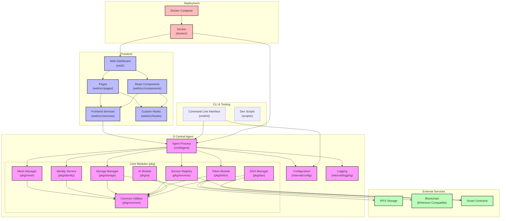

# D Central Architecture Diagram

## Component Descriptions

### D Central Agent
- **Agent Process**: The main entry point for the D Central node
- **Configuration**: Handles loading and managing application settings
- **Logging**: Provides structured logging capabilities

### Core Modules
- **Mesh Manager**: Handles peer-to-peer networking using libp2p
- **Identity Service**: Manages W3C DIDs for self-sovereign identity
- **Storage Manager**: Integrates with IPFS for decentralized storage
- **Service Registry**: Enables service discovery and provisioning
- **Token Module**: Manages blockchain interactions and token economics
- **AI Module**: Provides federated learning capabilities
- **DAO Manager**: Supports decentralized governance functionality
- **Common Utilities**: Shared utilities used across modules

### Frontend
- **Web Dashboard**: React-based user interface for interacting with the network
- **React Components**: Reusable UI components
- **Pages**: Application views and routes
- **Frontend Services**: API clients and data services
- **Custom Hooks**: React hooks for shared functionality

### External Services
- **IPFS Storage**: Decentralized content-addressed storage
- **Blockchain**: Ethereum-compatible chain for smart contracts
- **Smart Contracts**: Solidity contracts for governance and tokenomics

### CLI & Tooling
- **Command Line Interface**: Tools for interacting with the network
- **Dev Scripts**: Development and deployment utilities

### Deployment
- **Docker**: Containerization for the application components
- **Docker Compose**: Multi-container application orchestration