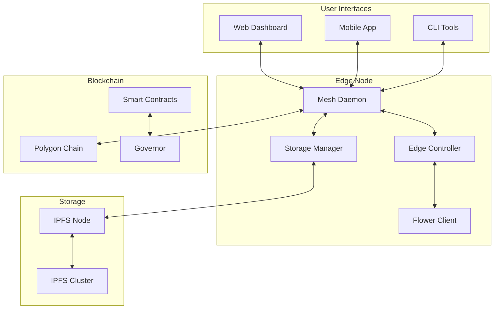

# D Central Platform – Comprehensive Developer Guide v2.0

*Last updated May 30, 2025 – "stack-freeze-may25" branch*

---

## Table of Contents

1. [Introduction & Vision](#1-introduction--vision)
2. [System Requirements & Prerequisites](#2-system-requirements--prerequisites)
3. [Development Environment Setup](#3-development-environment-setup)
4. [Repository Structure & Architecture](#4-repository-structure--architecture)
5. [Local Development Network](#5-local-development-network)
6. [Core Services Development](#6-core-services-development)
7. [Smart Contracts & Blockchain](#7-smart-contracts--blockchain)
8. [Frontend Development](#8-frontend-development)
9. [Edge Computing & Orchestration](#9-edge-computing--orchestration)
10. [Federated Learning Integration](#10-federated-learning-integration)
11. [Testing & Quality Assurance](#11-testing--quality-assurance)
12. [Observability & Monitoring](#12-observability--monitoring)
13. [CI/CD & Deployment](#13-cicd--deployment)
14. [Security Best Practices](#14-security-best-practices)
15. [Performance Optimization](#15-performance-optimization)
16. [Production Readiness](#16-production-readiness)
17. [Troubleshooting & Debugging](#17-troubleshooting--debugging)
18. [Contributing Guidelines](#18-contributing-guidelines)
19. [Advanced Topics](#19-advanced-topics)
20. [Resources & Support](#20-resources--support)

---

## 1. Introduction & Vision

### 1.1 Purpose

This comprehensive guide provides everything needed to develop, test, and deploy the D Central Platform—a decentralized infrastructure solution combining mesh networking, blockchain governance, and edge computing for underserved communities.

### 1.2 What You'll Build

By following this guide, you'll set up:
- **Mesh Network**: Self-organizing wireless network using BATMAN-adv
- **Distributed Storage**: IPFS cluster for content distribution
- **Edge Computing**: Kubernetes-based workload orchestration
- **Blockchain Governance**: DAO on Polygon for democratic decision-making
- **Federated Learning**: Privacy-preserving ML across edge nodes
- **Monitoring Stack**: Complete observability solution

### 1.3 Prerequisites Knowledge

- **Essential**: CLI proficiency, Git, Docker basics
- **Helpful**: Go/Node.js experience, Kubernetes concepts, blockchain fundamentals
- **Nice-to-have**: Mesh networking, federated learning, Solidity

> 💡 **New to these technologies?** Check our [Learning Resources](#20-resources--support) section for curated tutorials.

---

## 2. System Requirements & Prerequisites

### 2.1 Hardware Requirements

| Component | Development | Testing | Production |
|-----------|-------------|---------|------------|
| **CPU** | 4 cores @ 2.4GHz | 8 cores @ 2.8GHz | 16 cores @ 3.0GHz |
| **RAM** | 16 GB | 32 GB | 64 GB |
| **Storage** | 50 GB SSD | 100 GB SSD | 500 GB NVMe |
| **Network** | 100 Mbps | 1 Gbps | 10 Gbps |
| **GPU** | Optional | Recommended | Required for ML |

### 2.2 Operating System Support

| OS | Version | Support Level | Notes |
|----|---------|---------------|-------|
| **Ubuntu** | 22.04 LTS | Primary | Recommended for all environments |
| **Debian** | 12+ | Full | Good for production nodes |
| **macOS** | 13+ | Development | Not for production deployment |
| **Windows** | WSL2 | Limited | Development only, networking limitations |
| **Fedora** | 38+ | Community | Requires manual configuration |

### 2.3 Network Requirements

- **Ports**: 8000-8100 (services), 5001 (IPFS), 8080 (Flower), 3000 (frontend)
- **Protocols**: TCP/UDP for mesh, WebRTC for P2P
- **Bandwidth**: Minimum 10 Mbps symmetric for development
- **Latency**: <100ms to nearest node for optimal mesh performance

---

## 3. Development Environment Setup

### 3.1 Core Dependencies Installation

#### Ubuntu/Debian Setup

```bash
#!/bin/bash
# Update system
sudo apt update && sudo apt upgrade -y

# Core build tools
sudo apt install -y \
  build-essential git curl wget \
  software-properties-common \
  apt-transport-https ca-certificates \
  gnupg lsb-release make gcc g++ \
  net-tools dnsutils jq unzip

# Docker & Docker Compose
curl -fsSL https://download.docker.com/linux/ubuntu/gpg | sudo gpg --dearmor -o /usr/share/keyrings/docker-archive-keyring.gpg
echo "deb [arch=$(dpkg --print-architecture) signed-by=/usr/share/keyrings/docker-archive-keyring.gpg] https://download.docker.com/linux/ubuntu $(lsb_release -cs) stable" | sudo tee /etc/apt/sources.list.d/docker.list > /dev/null
sudo apt update
sudo apt install -y docker-ce docker-ce-cli containerd.io docker-compose-plugin
sudo usermod -aG docker $USER

# Go 1.22
wget https://go.dev/dl/go1.22.4.linux-amd64.tar.gz
sudo rm -rf /usr/local/go && sudo tar -C /usr/local -xzf go1.22.4.linux-amd64.tar.gz
echo 'export PATH=$PATH:/usr/local/go/bin' >> ~/.bashrc
echo 'export GOPATH=$HOME/go' >> ~/.bashrc
echo 'export PATH=$PATH:$GOPATH/bin' >> ~/.bashrc

# Node.js 20 & Yarn
curl -fsSL https://deb.nodesource.com/setup_20.x | sudo -E bash -
sudo apt install -y nodejs
sudo npm install -g yarn

# Rust toolchain
curl --proto '=https' --tlsv1.2 -sSf https://sh.rustup.rs | sh -s -- -y
source "$HOME/.cargo/env"

# Python 3.11 with ML dependencies
sudo apt install -y python3.11 python3.11-venv python3-pip
python3.11 -m pip install --upgrade pip

# Kubernetes tools
curl -LO "https://dl.k8s.io/release/$(curl -L -s https://dl.k8s.io/release/stable.txt)/bin/linux/amd64/kubectl"
chmod +x kubectl && sudo mv kubectl /usr/local/bin/
curl -s https://raw.githubusercontent.com/k3d-io/k3d/main/install.sh | bash

# Development tools
sudo apt install -y \
  tmux htop iotop \
  wireshark tcpdump \
  postgresql-client redis-tools \
  protobuf-compiler grpc-tools-cpp \
  libssl-dev pkg-config

# Reload shell
source ~/.bashrc
```

#### macOS Setup

```bash
# Install Homebrew if not present
/bin/bash -c "$(curl -fsSL https://raw.githubusercontent.com/Homebrew/install/HEAD/install.sh)"

# Core tools
brew install \
  git curl wget jq make \
  coreutils gnu-sed gnu-tar \
  watch tree htop

# Development languages
brew install go@1.22 node@20 rust python@3.11

# Container tools
brew install --cask docker
brew install kubectl k3d helm

# Additional tools
brew install \
  protobuf grpc \
  redis postgresql \
  ipfs yarn
```

### 3.2 IDE Configuration

#### VS Code Extensions

```json
{
  "recommendations": [
    "golang.go",
    "hashicorp.terraform",
    "ms-kubernetes-tools.vscode-kubernetes-tools",
    "ms-azuretools.vscode-docker",
    "dbaeumer.vscode-eslint",
    "esbenp.prettier-vscode",
    "juanblanco.solidity",
    "ipfs.vscode-ipfs",
    "rust-lang.rust-analyzer"
  ]
}
```

#### JetBrains IDEs

- GoLand for Go development
- WebStorm for frontend
- DataGrip for database work

### 3.3 Shell Configuration

Add to `~/.bashrc` or `~/.zshrc`:

```bash
# D Central aliases
alias dc='cd ~/code/dcentral'
alias dcm='cd ~/code/dcentral && make'
alias dclogs='docker compose logs -f'
alias dcps='docker compose ps'
alias dcdown='docker compose down -v'
alias dcup='docker compose up -d'

# Kubernetes aliases
alias k='kubectl'
alias kgp='kubectl get pods'
alias kgs='kubectl get svc'
alias kaf='kubectl apply -f'

# Git aliases for D Central workflow
alias gco='git checkout'
alias gcb='git checkout -b'
alias gcp='git cherry-pick'
alias grbi='git rebase -i'
alias grhh='git reset HEAD --hard'

# Development functions
dctest() {
  cd ~/code/dcentral
  make test-$1
}

dcbuild() {
  cd ~/code/dcentral
  make build-$1
}
```

---

## 4. Repository Structure & Architecture

### 4.1 Monorepo Organization

```
dcentral/
├── cmd/                    # Service entry points
│   ├── mesh-daemon/        # Core mesh networking service
│   ├── mesh-ct/            # Certificate transparency
│   ├── storage-mgr/        # IPFS management service
│   ├── edge-controller/    # K8s workload orchestrator
│   └── flower-coordinator/ # FL job scheduler
│
├── pkg/                    # Shared Go packages
│   ├── mesh/              # Mesh networking libraries
│   ├── crypto/            # Cryptographic utilities
│   ├── consensus/         # Consensus algorithms
│   ├── storage/           # Storage interfaces
│   └── telemetry/         # Metrics & tracing
│
├── contracts/             # Smart contracts
│   ├── governance/        # DAO contracts
│   ├── token/            # DCT token
│   ├── registry/         # Node registry
│   └── incentives/       # Reward distribution
│
├── frontend/              # Web interfaces
│   ├── apps/
│   │   ├── dashboard/    # Main dashboard
│   │   ├── governance/   # DAO interface
│   │   └── mobile/       # React Native app
│   └── packages/         # Shared components
│
├── ml/                    # Machine learning
│   ├── models/           # Pre-trained models
│   ├── datasets/         # Training data
│   ├── flower/           # FL strategies
│   └── edge-inference/   # ONNX runtime
│
├── infra/                # Infrastructure as Code
│   ├── terraform/        # Cloud resources
│   ├── ansible/          # Node configuration
│   ├── k8s/              # Kubernetes manifests
│   └── helm/             # Helm charts
│
├── scripts/              # Automation scripts
├── docs/                 # Documentation
├── test/                 # Integration tests
└── tools/                # Development tools
```

### 4.2 Service Architecture



### 4.3 Clone & Initial Setup

```bash
# Create workspace
mkdir -p ~/code && cd ~/code

# Clone with submodules
git clone --recursive https://github.com/dcentral-org/dcentral.git
cd dcentral

# Checkout stable branch
git checkout stack-freeze-may25

# Install git hooks
make install-hooks

# Bootstrap environment
make bootstrap

# Verify installation
make verify-env
```

---

## 5. Local Development Network

### 5.1 Environment Configuration

Create `.env` file:

```dotenv
# Network Configuration
NETWORK_ID=dcentral-local
MESH_SUBNET=10.8.0.0/16
NODE_COUNT=3

# Blockchain Settings
CHAIN_ID=1337
POLYGON_RPC_URL=http://localhost:8545
PRIVATE_KEY=0xac0974bec39a17e36ba4a6b4d238ff944bacb478cbed5efcae784d7bf4f2ff80
SAFE_OWNER_ADDR=0xf39Fd6e51aad88F6F4ce6aB8827279cffFb92266

# IPFS Configuration
IPFS_API=http://127.0.0.1:5001
IPFS_GATEWAY=http://127.0.0.1:8080
IPFS_CLUSTER_SECRET=d0e1d2c3b4a5968778695a4b3c2d1e0f

# Federated Learning
FLOWER_SERVER_ADDR=0.0.0.0:8080
FLOWER_CLIENT_COUNT=3
FL_ROUNDS=10

# Monitoring
PROMETHEUS_PORT=9090
GRAFANA_PORT=3001
LOKI_PORT=3100

# Security
JWT_SECRET=your-256-bit-secret-here
TLS_ENABLED=false
CORS_ORIGINS=http://localhost:3000,http://localhost:3001

# Resource Limits
CPU_LIMIT=2
MEMORY_LIMIT=4Gi
STORAGE_LIMIT=10Gi
```

### 5.2 Docker Compose Configuration

Enhanced `docker-compose.yml`:

```yaml
version: '3.9'

networks:
  dcentral:
    driver: bridge
    ipam:
      config:
        - subnet: 172.20.0.0/16

volumes:
  hardhat_data:
  ipfs_data:
  prometheus_data:
  grafana_data:
  postgres_data:

services:
  # Blockchain Node
  hardhat:
    image: dcentral/hardhat:latest
    container_name: dc-hardhat
    ports:
      - "8545:8545"
    volumes:
      - hardhat_data:/data
      - ./contracts:/app/contracts
    environment:
      - MNEMONIC=${MNEMONIC:-"test test test test test test test test test test test junk"}
    command: ["node", "--hostname", "0.0.0.0", "--gas-limit", "30000000"]
    networks:
      dcentral:
        ipv4_address: 172.20.0.10
    healthcheck:
      test: ["CMD", "curl", "-f", "http://localhost:8545"]
      interval: 10s
      timeout: 5s
      retries: 5

  # IPFS Node
  ipfs:
    image: ipfs/kubo:v0.29.0
    container_name: dc-ipfs
    ports:
      - "5001:5001"
      - "8080:8080"
    volumes:
      - ipfs_data:/data/ipfs
    environment:
      - IPFS_PROFILE=server
      - IPFS_PATH=/data/ipfs
    networks:
      dcentral:
        ipv4_address: 172.20.0.20
    command: ["daemon", "--migrate=true", "--enable-pubsub-experiment"]

  # Mesh Node 1
  mesh-node-1:
    build:
      context: .
      dockerfile: cmd/mesh-daemon/Dockerfile
    container_name: dc-mesh-1
    ports:
      - "8000:8000"
    volumes:
      - ./configs/node1.yaml:/app/config.yaml
      - /var/run/docker.sock:/var/run/docker.sock
    environment:
      - NODE_ID=node-1
      - MESH_INTERFACE=eth0
      - BATMAN_INTERFACE=bat0
    cap_add:
      - NET_ADMIN
      - SYS_MODULE
    networks:
      dcentral:
        ipv4_address: 172.20.0.100
    depends_on:
      - hardhat
      - ipfs

  # Mesh Node 2
  mesh-node-2:
    build:
      context: .
      dockerfile: cmd/mesh-daemon/Dockerfile
    container_name: dc-mesh-2
    ports:
      - "8001:8000"
    volumes:
      - ./configs/node2.yaml:/app/config.yaml
    environment:
      - NODE_ID=node-2
      - MESH_INTERFACE=eth0
      - BATMAN_INTERFACE=bat0
    cap_add:
      - NET_ADMIN
      - SYS_MODULE
    networks:
      dcentral:
        ipv4_address: 172.20.0.101
    depends_on:
      - hardhat
      - ipfs

  # Flower Server
  flower-server:
    build:
      context: ./ml/flower
      dockerfile: Dockerfile.server
    container_name: dc-flower-server
    ports:
      - "8082:8080"
      - "8083:8081"
    volumes:
      - ./ml/models:/app/models
      - ./ml/datasets:/app/datasets
    environment:
      - FL_ROUNDS=${FL_ROUNDS:-10}
      - MIN_CLIENTS=${FLOWER_CLIENT_COUNT:-3}
    networks:
      dcentral:
        ipv4_address: 172.20.0.200

  # Flower Client 1
  flower-client-1:
    build:
      context: ./ml/flower
      dockerfile: Dockerfile.client
    container_name: dc-flower-client-1
    environment:
      - CLIENT_ID=client-1
      - SERVER_ADDR=flower-server:8080
    volumes:
      - ./ml/datasets/client1:/app/data
    networks:
      dcentral:
        ipv4_address: 172.20.0.201
    depends_on:
      - flower-server

  # PostgreSQL Database
  postgres:
    image: postgres:15-alpine
    container_name: dc-postgres
    ports:
      - "5432:5432"
    environment:
      - POSTGRES_USER=dcentral
      - POSTGRES_PASSWORD=dcentral123
      - POSTGRES_DB=dcentral_dev
    volumes:
      - postgres_data:/var/lib/postgresql/data
    networks:
      dcentral:
        ipv4_address: 172.20.0.30

  # Redis Cache
  redis:
    image: redis:7-alpine
    container_name: dc-redis
    ports:
      - "6379:6379"
    command: ["redis-server", "--appendonly", "yes"]
    networks:
      dcentral:
        ipv4_address: 172.20.0.31

  # Prometheus
  prometheus:
    image: prom/prometheus:latest
    container_name: dc-prometheus
    ports:
      - "9090:9090"
    volumes:
      - ./infra/monitoring/prometheus.yml:/etc/prometheus/prometheus.yml
      - prometheus_data:/prometheus
    command:
      - '--config.file=/etc/prometheus/prometheus.yml'
      - '--storage.tsdb.path=/prometheus'
      - '--web.console.libraries=/usr/share/prometheus/console_libraries'
      - '--web.console.templates=/usr/share/prometheus/consoles'
    networks:
      dcentral:
        ipv4_address: 172.20.0.40

  # Grafana
  grafana:
    image: grafana/grafana:latest
    container_name: dc-grafana
    ports:
      - "3001:3000"
    volumes:
      - grafana_data:/var/lib/grafana
      - ./infra/monitoring/grafana/dashboards:/etc/grafana/provisioning/dashboards
      - ./infra/monitoring/grafana/datasources:/etc/grafana/provisioning/datasources
    environment:
      - GF_SECURITY_ADMIN_USER=admin
      - GF_SECURITY_ADMIN_PASSWORD=admin
      - GF_INSTALL_PLUGINS=grafana-clock-panel,grafana-piechart-panel
    networks:
      dcentral:
        ipv4_address: 172.20.0.41
    depends_on:
      - prometheus

  # Loki for logs
  loki:
    image: grafana/loki:latest
    container_name: dc-loki
    ports:
      - "3100:3100"
    volumes:
      - ./infra/monitoring/loki-config.yaml:/etc/loki/local-config.yaml
    command: -config.file=/etc/loki/local-config.yaml
    networks:
      dcentral:
        ipv4_address: 172.20.0.42

  # Promtail for log collection
  promtail:
    image: grafana/promtail:latest
    container_name: dc-promtail
    volumes:
      - /var/log:/var/log
      - ./infra/monitoring/promtail-config.yaml:/etc/promtail/config.yml
    command: -config.file=/etc/promtail/config.yml
    networks:
      dcentral:
        ipv4_address: 172.20.0.43
    depends_on:
      - loki
```

### 5.3 Starting the Development Network

```bash
# Start all services
make devnet

# Or start individually
docker compose up -d hardhat ipfs
docker compose up -d mesh-node-1 mesh-node-2
docker compose up -d flower-server flower-client-1
docker compose up -d prometheus grafana

# Check status
docker compose ps
make devnet-status

# View logs
docker compose logs -f mesh-node-1

# Stop everything
make devnet-down
```

### 5.4 Verifying the Setup

```bash
# Check blockchain
curl -X POST http://localhost:8545 \
  -H "Content-Type: application/json" \
  -d '{"jsonrpc":"2.0","method":"eth_blockNumber","params":[],"id":1}'

# Check IPFS
ipfs --api=/ip4/127.0.0.1/tcp/5001 swarm peers

# Check mesh nodes
curl http://localhost:8000/api/v1/health
curl http://localhost:8001/api/v1/peers

# Check Flower server
curl http://localhost:8082/api/v1/status

# Access UIs
# - Grafana: http://localhost:3001 (admin/admin)
# - IPFS WebUI: http://localhost:5001/webui
# - Prometheus: http://localhost:9090
```

---

## 6. Core Services Development

### 6.1 Mesh Daemon Development

#### Building from Source

```bash
cd cmd/mesh-daemon
go build -o mesh-daemon .

# With optimizations
go build -ldflags="-s -w" -o mesh-daemon .

# Cross-compile for ARM64 (Raspberry Pi)
GOOS=linux GOARCH=arm64 go build -o mesh-daemon-arm64 .
```

#### Configuration File

Create `configs/dev.yaml`:

```yaml
# Node Configuration
node:
  id: "dev-node-1"
  name: "Development Node 1"
  location:
    lat: 45.4215
    lon: -75.6972
  
# Network Configuration  
network:
  mesh_interface: "wlan0"
  batman_interface: "bat0"
  channel: 11
  tx_power: 20
  
# Service Endpoints
endpoints:
  api: "0.0.0.0:8000"
  metrics: "0.0.0.0:9100"
  p2p: "0.0.0.0:7000"
  
# Storage Configuration
storage:
  ipfs_api: "http://localhost:5001"
  ipfs_gateway: "http://localhost:8080"
  pin_threshold: 1000000 # 1MB
  gc_interval: "1h"
  
# Blockchain Configuration
blockchain:
  rpc_url: "${POLYGON_RPC_URL}"
  private_key: "${PRIVATE_KEY}"
  contracts:
    registry: "0x5FbDB2315678afecb367f032d93F642f64180aa3"
    token: "0xe7f1725E7734CE288F8367e1Bb143E90bb3F0512"
    governor: "0x9fE46736679d2D9a65F0992F2272dE9f3c7fa6e0"
    
# Security
security:
  tls_enabled: false
  cert_file: ""
  key_file: ""
  jwt_secret: "${JWT_SECRET}"
  
# Logging
logging:
  level: "debug"
  format: "json"
  output: "stdout"
```

#### Running with Hot Reload

```bash
# Install air for hot reload
go install github.com/cosmtrek/air@latest

# Create .air.toml
cat > .air.toml << EOF
root = "."
tmp_dir = "tmp"

[build]
  bin = "./tmp/mesh-daemon"
  cmd = "go build -o ./tmp/mesh-daemon ./cmd/mesh-daemon"
  delay = 1000
  exclude_dir = ["assets", "tmp", "vendor"]
  exclude_file = []
  exclude_regex = ["_test.go"]
  exclude_unchanged = false
  follow_symlink = false
  full_bin = ""
  include_dir = []
  include_ext = ["go", "tpl", "tmpl", "html"]
  kill_delay = "0s"
  log = "build-errors.log"
  send_interrupt = false
  stop_on_error = true

[color]
  app = ""
  build = "yellow"
  main = "magenta"
  runner = "green"
  watcher = "cyan"

[log]
  time = false

[misc]
  clean_on_exit = false
EOF

# Run with hot reload
air
```

### 6.2 Storage Manager Development

#### IPFS Integration

```go
// pkg/storage/ipfs/client.go
package ipfs

import (
    "context"
    "fmt"
    shell "github.com/ipfs/go-ipfs-api"
)

type Client struct {
    sh *shell.Shell
    ctx context.Context
}

func NewClient(apiURL string) (*Client, error) {
    sh := shell.NewShell(apiURL)
    if !sh.IsUp() {
        return nil, fmt.Errorf("ipfs daemon not reachable at %s", apiURL)
    }
    
    return &Client{
        sh: sh,
        ctx: context.Background(),
    }, nil
}

func (c *Client) Pin(cid string) error {
    return c.sh.Pin(cid)
}

func (c *Client) GetFileSize(cid string) (uint64, error) {
    stat, err := c.sh.ObjectStat(cid)
    if err != nil {
        return 0, err
    }
    return stat.CumulativeSize, nil
}
```

#### Storage Manager Service

```go
// cmd/storage-mgr/main.go
package main

import (
    "log"
    "net/http"
    
    "github.com/dcentral/pkg/storage/ipfs"
    "github.com/gorilla/mux"
    "github.com/prometheus/client_golang/prometheus/promhttp"
)

func main() {
    // Initialize IPFS client
    ipfsClient, err := ipfs.NewClient("http://localhost:5001")
    if err != nil {
        log.Fatal("Failed to connect to IPFS:", err)
    }
    
    // Setup routes
    r := mux.NewRouter()
    r.HandleFunc("/health", healthHandler)
    r.HandleFunc("/pin", pinHandler(ipfsClient)).Methods("POST")
    r.Handle("/metrics", promhttp.Handler())
    
    log.Println("Storage Manager starting on :8002")
    log.Fatal(http.ListenAndServe(":8002", r))
}
```

### 6.3 Edge Controller Development

#### Kubernetes Client Setup

```go
// pkg/edge/k8s/client.go
package k8s

import (
    "context"
    "path/filepath"
    
    "k8s.io/client-go/kubernetes"
    "k8s.io/client-go/tools/clientcmd"
    "k8s.io/client-go/util/homedir"
)

func NewClient() (*kubernetes.Clientset, error) {
    var kubeconfig string
    if home := homedir.HomeDir(); home != "" {
        kubeconfig = filepath.Join(home, ".kube", "config")
    }
    
    config, err := clientcmd.BuildConfigFromFlags("", kubeconfig)
    if err != nil {
        return nil, err
    }
    
    return kubernetes.NewForConfig(config)
}
```

---

## 7. Smart Contracts & Blockchain

### 7.1 Contract Development Setup

```bash
cd contracts
yarn install

# Create .env for contract deployment
cat > .env << EOF
POLYGON_RPC_URL=http://localhost:8545
PRIVATE_KEY=0xac0974bec39a17e36ba4a6b4d238ff944bacb478cbed5efcae784d7bf4f2ff80
ETHERSCAN_API_KEY=your-api-key
EOF
```

### 7.2 Core Contracts

#### DCT Token Contract

```solidity
// contracts/token/DCT.sol
pragma solidity ^0.8.19;

import "@openzeppelin/contracts-upgradeable/token/ERC20/ERC20Upgradeable.sol";
import "@openzeppelin/contracts-upgradeable/token/ERC20/extensions/ERC20VotesUpgradeable.sol";
import "@openzeppelin/contracts-upgradeable/access/OwnableUpgradeable.sol";
import "@openzeppelin/contracts-upgradeable/proxy/utils/Initializable.sol";

contract DCT is Initializable, ERC20Upgradeable, ERC20VotesUpgradeable, OwnableUpgradeable {
    uint256 public constant MAX_SUPPLY = 1_000_000_000 * 10**18; // 1 billion tokens
    
    function initialize() initializer public {
        __ERC20_init("D Central Token", "DCT");
        __ERC20Votes_init();
        __Ownable_init();
        
        _mint(msg.sender, 100_000_000 * 10**18); // Initial mint of 100M tokens
    }
    
    function mint(address to, uint256 amount) public onlyOwner {
        require(totalSupply() + amount <= MAX_SUPPLY, "Max supply exceeded");
        _mint(to, amount);
    }
    
    // Required overrides
    function _afterTokenTransfer(address from, address to, uint256 amount)
        internal
        override(ERC20Upgradeable, ERC20VotesUpgradeable)
    {
        super._afterTokenTransfer(from, to, amount);
    }
    
    function _mint(address to, uint256 amount)
        internal
        override(ERC20Upgradeable, ERC20VotesUpgradeable)
    {
        super._mint(to, amount);
    }
    
    function _burn(address account, uint256 amount)
        internal
        override(ERC20Upgradeable, ERC20VotesUpgradeable)
    {
        super._burn(account, amount);
    }
}
```

#### Node Registry Contract

```solidity
// contracts/registry/NodeRegistry.sol
pragma solidity ^0.8.19;

import "@openzeppelin/contracts-upgradeable/access/AccessControlUpgradeable.sol";
import "@openzeppelin/contracts-upgradeable/proxy/utils/Initializable.sol";

contract NodeRegistry is Initializable, AccessControlUpgradeable {
    bytes32 public constant OPERATOR_ROLE = keccak256("OPERATOR_ROLE");
    
    struct Node {
        string nodeId;
        address operator;
        string ipfsHash; // Node metadata stored in IPFS
        uint256 stakedAmount;
        bool isActive;
        uint256 registeredAt;
        uint256 lastSeen;
    }
    
    mapping(string => Node) public nodes;
    mapping(address => string[]) public operatorNodes;
    string[] public allNodeIds;
    
    event NodeRegistered(string indexed nodeId, address indexed operator);
    event NodeUpdated(string indexed nodeId, string ipfsHash);
    event NodeDeactivated(string indexed nodeId);
    
    function initialize() initializer public {
        __AccessControl_init();
        _grantRole(DEFAULT_ADMIN_ROLE, msg.sender);
        _grantRole(OPERATOR_ROLE, msg.sender);
    }
    
    function registerNode(
        string memory nodeId,
        string memory ipfsHash,
        uint256 stakeAmount
    ) external {
        require(bytes(nodes[nodeId].nodeId).length == 0, "Node already exists");
        require(stakeAmount >= 1000 * 10**18, "Minimum stake required");
        
        // Transfer stake (assumes DCT approval)
        // IERC20(dctToken).transferFrom(msg.sender, address(this), stakeAmount);
        
        nodes[nodeId] = Node({
            nodeId: nodeId,
            operator: msg.sender,
            ipfsHash: ipfsHash,
            stakedAmount: stakeAmount,
            isActive: true,
            registeredAt: block.timestamp,
            lastSeen: block.timestamp
        });
        
        operatorNodes[msg.sender].push(nodeId);
        allNodeIds.push(nodeId);
        
        emit NodeRegistered(nodeId, msg.sender);
    }
    
    function updateNodeMetadata(string memory nodeId, string memory ipfsHash) 
        external 
    {
        require(nodes[nodeId].operator == msg.sender, "Not node operator");
        nodes[nodeId].ipfsHash = ipfsHash;
        nodes[nodeId].lastSeen = block.timestamp;
        
        emit NodeUpdated(nodeId, ipfsHash);
    }
    
    function heartbeat(string memory nodeId) external {
        require(nodes[nodeId].operator == msg.sender, "Not node operator");
        nodes[nodeId].lastSeen = block.timestamp;
    }
}
```

### 7.3 Testing Contracts

```javascript
// test/NodeRegistry.test.js
const { expect } = require("chai");
const { ethers, upgrades } = require("hardhat");

describe("NodeRegistry", function () {
  let nodeRegistry;
  let owner, operator1, operator2;
  
  beforeEach(async function () {
    [owner, operator1, operator2] = await ethers.getSigners();
    
    const NodeRegistry = await ethers.getContractFactory("NodeRegistry");
    nodeRegistry = await upgrades.deployProxy(NodeRegistry, [], {
      initializer: "initialize",
    });
    await nodeRegistry.deployed();
  });
  
  describe("Node Registration", function () {
    it("Should register a new node", async function () {
      const nodeId = "node-001";
      const ipfsHash = "QmXoypizjW3WknFiJnKLwHCnL72vedxjQkDDP1mXWo6uco";
      const stakeAmount = ethers.utils.parseEther("1000");
      
      await expect(
        nodeRegistry.connect(operator1).registerNode(nodeId, ipfsHash, stakeAmount)
      ).to.emit(nodeRegistry, "NodeRegistered")
        .withArgs(nodeId, operator1.address);
      
      const node = await nodeRegistry.nodes(nodeId);
      expect(node.operator).to.equal(operator1.address);
      expect(node.isActive).to.be.true;
    });
    
    it("Should prevent duplicate node registration", async function () {
      const nodeId = "node-001";
      const ipfsHash = "QmXoypizjW3WknFiJnKLwHCnL72vedxjQkDDP1mXWo6uco";
      const stakeAmount = ethers.utils.parseEther("1000");
      
      await nodeRegistry.connect(operator1).registerNode(nodeId, ipfsHash, stakeAmount);
      
      await expect(
        nodeRegistry.connect(operator2).registerNode(nodeId, ipfsHash, stakeAmount)
      ).to.be.revertedWith("Node already exists");
    });
  });
});
```

### 7.4 Deployment Scripts

```javascript
// scripts/deploy.js
const { ethers, upgrades } = require("hardhat");

async function main() {
  const [deployer] = await ethers.getSigners();
  console.log("Deploying contracts with account:", deployer.address);
  
  // Deploy DCT Token
  const DCT = await ethers.getContractFactory("DCT");
  const dct = await upgrades.deployProxy(DCT, [], {
    initializer: "initialize",
  });
  await dct.deployed();
  console.log("DCT deployed to:", dct.address);
  
  // Deploy Node Registry
  const NodeRegistry = await ethers.getContractFactory("NodeRegistry");
  const nodeRegistry = await upgrades.deployProxy(NodeRegistry, [], {
    initializer: "initialize",
  });
  await nodeRegistry.deployed();
  console.log("NodeRegistry deployed to:", nodeRegistry.address);
  
  // Deploy Governor
  const Governor = await ethers.getContractFactory("DCentralGovernor");
  const governor = await upgrades.deployProxy(
    Governor,
    [dct.address, 6575, 46027, ethers.utils.parseEther("100000")],
    { initializer: "initialize" }
  );
  await governor.deployed();
  console.log("Governor deployed to:", governor.address);
  
  // Save deployment addresses
  const fs = require("fs");
  const deployments = {
    DCT: dct.address,
    NodeRegistry: nodeRegistry.address,
    Governor: governor.address,
  };
  
  fs.writeFileSync(
    "./deployments/local.json",
    JSON.stringify(deployments, null, 2)
  );
}

main()
  .then(() => process.exit(0))
  .catch((error) => {
    console.error(error);
    process.exit(1);
  });
```

### 7.5 Contract Verification

```bash
# Compile contracts
yarn hardhat compile

# Run tests
yarn hardhat test

# Deploy to local network
yarn hardhat run scripts/deploy.js --network localhost

# Deploy to Mumbai testnet
yarn hardhat run scripts/deploy.js --network mumbai

# Verify on Polygonscan
yarn hardhat verify --network mumbai <CONTRACT_ADDRESS> <CONSTRUCTOR_ARGS>
```

---

## 8. Frontend Development

### 8.1 Next.js Dashboard Setup

```bash
cd frontend/apps/dashboard
yarn install

# Environment configuration
cat > .env.local << EOF
NEXT_PUBLIC_API_URL=http://localhost:8000
NEXT_PUBLIC_IPFS_GATEWAY=http://localhost:8080
NEXT_PUBLIC_CHAIN_ID=1337
NEXT_PUBLIC_RPC_URL=http://localhost:8545
EOF
```

### 8.2 Core Components

#### Web3 Provider

```typescript
// frontend/packages/web3/src/Web3Provider.tsx
import { createContext, useContext, ReactNode } from 'react';
import { ethers } from 'ethers';
import { Web3Provider } from '@ethersproject/providers';

interface Web3Context {
  provider: Web3Provider | null;
  signer: ethers.Signer | null;
  account: string | null;
  chainId: number | null;
  connect: () => Promise<void>;
  disconnect: () => void;
}

const Web3Context = createContext<Web3Context>({} as Web3Context);

export function Web3Provider({ children }: { children: ReactNode }) {
  const [provider, setProvider] = useState<Web3Provider | null>(null);
  const [signer, setSigner] = useState<ethers.Signer | null>(null);
  const [account, setAccount] = useState<string | null>(null);
  const [chainId, setChainId] = useState<number | null>(null);
  
  const connect = async () => {
    if (!window.ethereum) {
      throw new Error("No Web3 provider found");
    }
    
    await window.ethereum.request({ method: 'eth_requestAccounts' });
    const provider = new Web3Provider(window.ethereum);
    const signer = provider.getSigner();
    const account = await signer.getAddress();
    const { chainId } = await provider.getNetwork();
    
    setProvider(provider);
    setSigner(signer);
    setAccount(account);
    setChainId(chainId);
  };
  
  const disconnect = () => {
    setProvider(null);
    setSigner(null);
    setAccount(null);
    setChainId(null);
  };
  
  return (
    <Web3Context.Provider value={{
      provider,
      signer,
      account,
      chainId,
      connect,
      disconnect,
    }}>
      {children}
    </Web3Context.Provider>
  );
}

export const useWeb3 = () => useContext(Web3Context);
```

#### Node Dashboard Component

```typescript
// frontend/apps/dashboard/src/components/NodeDashboard.tsx
import { useEffect, useState } from 'react';
import { Card, Grid, Statistic, Table } from 'antd';
import { useWeb3 } from '@dcentral/web3';

interface NodeData {
  id: string;
  status: 'online' | 'offline';
  peers: number;
  bandwidth: number;
  storage: number;
  earnings: number;
}

export function NodeDashboard() {
  const { account } = useWeb3();
  const [nodes, setNodes] = useState<NodeData[]>([]);
  const [stats, setStats] = useState({
    totalNodes: 0,
    onlineNodes: 0,
    totalBandwidth: 0,
    totalStorage: 0,
  });
  
  useEffect(() => {
    fetchNodeData();
    const interval = setInterval(fetchNodeData, 5000);
    return () => clearInterval(interval);
  }, [account]);
  
  const fetchNodeData = async () => {
    try {
      const response = await fetch(`/api/nodes?operator=${account}`);
      const data = await response.json();
      setNodes(data.nodes);
      setStats(data.stats);
    } catch (error) {
      console.error('Failed to fetch node data:', error);
    }
  };
  
  const columns = [
    {
      title: 'Node ID',
      dataIndex: 'id',
      key: 'id',
    },
    {
      title: 'Status',
      dataIndex: 'status',
      key: 'status',
      render: (status: string) => (
        <span className={`status-${status}`}>
          {status.toUpperCase()}
        </span>
      ),
    },
    {
      title: 'Peers',
      dataIndex: 'peers',
      key: 'peers',
    },
    {
      title: 'Bandwidth (MB/s)',
      dataIndex: 'bandwidth',
      key: 'bandwidth',
    },
    {
      title: 'Storage (GB)',
      dataIndex: 'storage',
      key: 'storage',
    },
    {
      title: 'Earnings (DCT)',
      dataIndex: 'earnings',
      key: 'earnings',
    },
  ];
  
  return (
    <div className="node-dashboard">
      <Grid container spacing={3}>
        <Grid item xs={3}>
          <Card>
            <Statistic
              title="Total Nodes"
              value={stats.totalNodes}
            />
          </Card>
        </Grid>
        <Grid item xs={3}>
          <Card>
            <Statistic
              title="Online Nodes"
              value={stats.onlineNodes}
              valueStyle={{ color: '#3f8600' }}
            />
          </Card>
        </Grid>
        <Grid item xs={3}>
          <Card>
            <Statistic
              title="Total Bandwidth"
              value={stats.totalBandwidth}
              suffix="MB/s"
            />
          </Card>
        </Grid>
        <Grid item xs={3}>
          <Card>
            <Statistic
              title="Total Storage"
              value={stats.totalStorage}
              suffix="GB"
            />
          </Card>
        </Grid>
      </Grid>
      
      <Table
        columns={columns}
        dataSource={nodes}
        rowKey="id"
        pagination={{ pageSize: 10 }}
      />
    </div>
  );
}
```

### 8.3 Mobile App Development

```bash
cd frontend/apps/mobile
yarn install

# iOS setup
cd ios && pod install

# Android setup
cd android && ./gradlew clean
```

#### React Native Configuration

```javascript
// frontend/apps/mobile/src/config/api.js
import { Platform } from 'react-native';

const API_BASE = Platform.select({
  ios: 'http://localhost:8000',
  android: 'http://10.0.2.2:8000',
});

export const api = {
  nodes: `${API_BASE}/api/v1/nodes`,
  governance: `${API_BASE}/api/v1/governance`,
  storage: `${API_BASE}/api/v1/storage`,
};
```

### 8.4 Running Frontend Services

```bash
# Development server
yarn dev

# Build for production
yarn build

# Run production build
yarn start

# Storybook for component development
yarn storybook

# Run tests
yarn test

# E2E tests with Cypress
yarn e2e
```

---

## 9. Edge Computing & Orchestration

### 9.1 K3s Cluster Setup

```bash
# Create local k3s cluster
k3d cluster create dcentral \
  --servers 1 \
  --agents 3 \
  --port 8081:80@loadbalancer \
  --port 8443:443@loadbalancer \
  --volume "$(pwd)/data:/data" \
  --k3s-arg "--disable=traefik@server:0"

# Get kubeconfig
export KUBECONFIG=$(k3d kubeconfig get dcentral)

# Verify cluster
kubectl get nodes
kubectl get pods -A
```

### 9.2 Helm Charts

#### Chart Structure

```yaml
# infra/helm/dcentral/Chart.yaml
apiVersion: v2
name: dcentral
description: D Central Platform Helm chart
type: application
version: 0.1.0
appVersion: "1.0.0"

dependencies:
  - name: prometheus
    version: 15.0.0
    repository: https://prometheus-community.github.io/helm-charts
  - name: grafana
    version: 6.50.0
    repository: https://grafana.github.io/helm-charts
  - name: sealed-secrets
    version: 2.7.0
    repository: https://bitnami-labs.github.io/sealed-secrets
```

#### Values Configuration

```yaml
# infra/helm/dcentral/values.yaml
global:
  environment: development
  domain: dcentral.local

mesh:
  enabled: true
  replicas: 3
  image:
    repository: dcentral/mesh-daemon
    tag: latest
    pullPolicy: IfNotPresent
  resources:
    requests:
      cpu: 100m
      memory: 128Mi
    limits:
      cpu: 500m
      memory: 512Mi
  service:
    type: ClusterIP
    port: 8000
  ingress:
    enabled: true
    className: nginx
    annotations:
      cert-manager.io/cluster-issuer: letsencrypt-prod
    hosts:
      - host: api.dcentral.local
        paths:
          - path: /
            pathType: Prefix

storage:
  enabled: true
  ipfs:
    storageClass: local-path
    size: 10Gi
  cluster:
    replicas: 3
    secret: "generated-secret-here"

flower:
  enabled: true
  server:
    replicas: 1
    resources:
      requests:
        cpu: 500m
        memory: 1Gi
  clients:
    replicas: 3
    resources:
      requests:
        cpu: 200m
        memory: 512Mi

monitoring:
  prometheus:
    retention: 30d
    storageSize: 50Gi
  grafana:
    adminPassword: "changeme"
    dashboards:
      enabled: true
      label: grafana_dashboard
```

### 9.3 FluxCD GitOps Setup

```bash
# Install Flux
curl -s https://fluxcd.io/install.sh | sudo bash

# Check prerequisites
flux check --pre

# Bootstrap Flux
flux bootstrap github \
  --owner=dcentral-org \
  --repository=dcentral \
  --branch=main \
  --path=./infra/k8s/clusters/dev \
  --personal

# Create source
flux create source git dcentral \
  --url=https://github.com/dcentral-org/dcentral \
  --branch=stack-freeze-may25 \
  --interval=1m

# Create kustomization
flux create kustomization core \
  --source=dcentral \
  --path="./infra/k8s/core" \
  --prune=true \
  --interval=10m
```

#### Kustomization Structure

```yaml
# infra/k8s/core/kustomization.yaml
apiVersion: kustomize.config.k8s.io/v1beta1
kind: Kustomization

namespace: dcentral

resources:
  - namespace.yaml
  - rbac.yaml
  - network-policies.yaml
  - services/mesh
  - services/storage
  - services/flower
  - monitoring

patchesStrategicMerge:
  - patches/resource-limits.yaml

configMapGenerator:
  - name: mesh-config
    files:
      - configs/mesh.yaml

secretGenerator:
  - name: mesh-secrets
    envs:
      - secrets/.env.mesh

images:
  - name: dcentral/mesh-daemon
    newTag: v1.0.0
```

### 9.4 Service Mesh with Linkerd

```bash
# Install Linkerd CLI
curl -sL https://run.linkerd.io/install | sh
export PATH=$PATH:$HOME/.linkerd2/bin

# Check prerequisites
linkerd check --pre

# Install control plane
linkerd install | kubectl apply -f -

# Check installation
linkerd check

# Install viz extension
linkerd viz install | kubectl apply -f -

# Inject sidecar into deployments
kubectl get deploy -n dcentral -o yaml | \
  linkerd inject - | \
  kubectl apply -f -

# View metrics
linkerd viz dashboard
```

---

## 10. Federated Learning Integration

### 10.1 Flower Server Configuration

```python
# ml/flower/server/strategy.py
import flwr as fl
from typing import List, Tuple, Optional, Dict
import numpy as np

class DCentralFedAvg(fl.server.strategy.FedAvg):
    """Custom federated averaging strategy for D Central"""
    
    def __init__(
        self,
        fraction_fit: float = 0.1,
        fraction_evaluate: float = 0.1,
        min_fit_clients: int = 3,
        min_evaluate_clients: int = 3,
        min_available_clients: int = 3,
        reputation_threshold: float = 0.8,
        **kwargs
    ):
        super().__init__(
            fraction_fit=fraction_fit,
            fraction_evaluate=fraction_evaluate,
            min_fit_clients=min_fit_clients,
            min_evaluate_clients=min_evaluate_clients,
            min_available_clients=min_available_clients,
            **kwargs
        )
        self.reputation_threshold = reputation_threshold
        self.client_reputations = {}
    
    def configure_fit(
        self,
        server_round: int,
        parameters: fl.common.Parameters,
        client_manager: fl.server.ClientManager,
    ) -> List[Tuple[fl.server.client_proxy.ClientProxy, fl.common.FitIns]]:
        """Configure training with reputation-based client selection"""
        
        # Get available clients
        sample_size, min_num_clients = self.num_fit_clients(
            client_manager.num_available()
        )
        clients = client_manager.sample(
            num_clients=sample_size,
            min_num_clients=min_num_clients,
            criterion=lambda client: self._check_reputation(client.cid),
        )
        
        # Create fit instructions
        fit_ins = fl.common.FitIns(parameters, {"round": server_round})
        
        # Return client/config pairs
        return [(client, fit_ins) for client in clients]
    
    def _check_reputation(self, client_id: str) -> bool:
        """Check if client meets reputation threshold"""
        reputation = self.client_reputations.get(client_id, 1.0)
        return reputation >= self.reputation_threshold
    
    def aggregate_fit(
        self,
        server_round: int,
        results: List[Tuple[fl.server.client_proxy.ClientProxy, fl.common.FitRes]],
        failures: List[BaseException],
    ) -> Optional[fl.common.Parameters]:
        """Aggregate training results with reputation updates"""
        
        # Update reputations based on participation
        for client, fit_res in results:
            self._update_reputation(client.cid, success=True)
        
        for failure in failures:
            # Extract client_id from failure and update reputation
            pass
        
        # Perform weighted aggregation
        return super().aggregate_fit(server_round, results, failures)
    
    def _update_reputation(self, client_id: str, success: bool):
        """Update client reputation based on participation"""
        current = self.client_reputations.get(client_id, 1.0)
        if success:
            # Increase reputation
            new_reputation = min(1.0, current + 0.1)
        else:
            # Decrease reputation
            new_reputation = max(0.0, current - 0.2)
        self.client_reputations[client_id] = new_reputation
```

### 10.2 Client Implementation

```python
# ml/flower/client/edge_client.py
import flwr as fl
import tensorflow as tf
from typing import Dict, List, Tuple
import numpy as np

class EdgeClient(fl.client.NumPyClient):
    """Federated learning client for edge nodes"""
    
    def __init__(
        self,
        model: tf.keras.Model,
        x_train: np.ndarray,
        y_train: np.ndarray,
        x_test: np.ndarray,
        y_test: np.ndarray,
        node_id: str,
    ):
        self.model = model
        self.x_train = x_train
        self.y_train = y_train
        self.x_test = x_test
        self.y_test = y_test
        self.node_id = node_id
    
    def get_parameters(self, config: Dict[str, fl.common.Scalar]) -> fl.common.NDArrays:
        """Get model parameters"""
        return self.model.get_weights()
    
    def fit(
        self,
        parameters: fl.common.NDArrays,
        config: Dict[str, fl.common.Scalar],
    ) -> Tuple[fl.common.NDArrays, int, Dict[str, fl.common.Scalar]]:
        """Train model on local data"""
        self.model.set_weights(parameters)
        
        # Training configuration from server
        epochs = int(config.get("epochs", 1))
        batch_size = int(config.get("batch_size", 32))
        
        # Train model
        history = self.model.fit(
            self.x_train,
            self.y_train,
            epochs=epochs,
            batch_size=batch_size,
            validation_split=0.1,
            verbose=0,
        )
        
        # Return updated parameters and metrics
        parameters_prime = self.model.get_weights()
        num_examples_train = len(self.x_train)
        results = {
            "loss": history.history["loss"][-1],
            "accuracy": history.history.get("accuracy", [0])[-1],
            "node_id": self.node_id,
        }
        
        return parameters_prime, num_examples_train, results
    
    def evaluate(
        self,
        parameters: fl.common.NDArrays,
        config: Dict[str, fl.common.Scalar],
    ) -> Tuple[float, int, Dict[str, fl.common.Scalar]]:
        """Evaluate model on local test data"""
        self.model.set_weights(parameters)
        loss, accuracy = self.model.evaluate(
            self.x_test,
            self.y_test,
            verbose=0,
        )
        num_examples_test = len(self.x_test)
        return loss, num_examples_test, {"accuracy": accuracy}
```

### 10.3 Model Deployment

```python
# ml/flower/models/deploy.py
import tensorflow as tf
import tf2onnx
import onnx
from pathlib import Path

def export_model_for_edge(
    model: tf.keras.Model,
    output_path: Path,
    quantize: bool = True,
):
    """Export TensorFlow model for edge deployment"""
    
    # Convert to ONNX
    spec = (tf.TensorSpec(model.inputs[0].shape, tf.float32),)
    model_proto, _ = tf2onnx.convert.from_keras(
        model,
        input_signature=spec,
        opset=13,
    )
    
    # Save ONNX model
    onnx_path = output_path / "model.onnx"
    onnx.save(model_proto, str(onnx_path))
    
    if quantize:
        # Quantize for edge deployment
        from onnxruntime.quantization import quantize_dynamic
        
        quantized_path = output_path / "model_quantized.onnx"
        quantize_dynamic(
            str(onnx_path),
            str(quantized_path),
            weight_type=onnx.TensorProto.UINT8,
        )
    
    # Generate TensorFlow Lite model
    converter = tf.lite.TFLiteConverter.from_keras_model(model)
    converter.optimizations = [tf.lite.Optimize.DEFAULT]
    tflite_model = converter.convert()
    
    tflite_path = output_path / "model.tflite"
    with open(tflite_path, 'wb') as f:
        f.write(tflite_model)
    
    return {
        "onnx": onnx_path,
        "onnx_quantized": quantized_path if quantize else None,
        "tflite": tflite_path,
    }
```

---

## 11. Testing & Quality Assurance

### 11.1 Unit Testing

#### Go Unit Tests

```go
// pkg/mesh/routing_test.go
package mesh

import (
    "testing"
    "github.com/stretchr/testify/assert"
    "github.com/stretchr/testify/mock"
)

type MockBatman struct {
    mock.Mock
}

func (m *MockBatman) GetNeighbors() ([]Neighbor, error) {
    args := m.Called()
    return args.Get(0).([]Neighbor), args.Error(1)
}

func TestRoutingTable(t *testing.T) {
    t.Run("should add new route", func(t *testing.T) {
        rt := NewRoutingTable()
        route := Route{
            Destination: "10.8.0.2",
            NextHop:     "10.8.0.1",
            Metric:      10,
        }
        
        err := rt.AddRoute(route)
        assert.NoError(t, err)
        assert.Len(t, rt.Routes(), 1)
    })
    
    t.Run("should update existing route", func(t *testing.T) {
        rt := NewRoutingTable()
        route1 := Route{
            Destination: "10.8.0.2",
            NextHop:     "10.8.0.1",
            Metric:      10,
        }
        route2 := Route{
            Destination: "10.8.0.2",
            NextHop:     "10.8.0.3",
            Metric:      5,
        }
        
        rt.AddRoute(route1)
        rt.AddRoute(route2)
        
        routes := rt.Routes()
        assert.Len(t, routes, 1)
        assert.Equal(t, "10.8.0.3", routes[0].NextHop)
    })
}

func TestBatmanIntegration(t *testing.T) {
    if testing.Short() {
        t.Skip("skipping integration test")
    }
    
    batman := NewBatmanAdv("bat0")
    neighbors, err := batman.GetNeighbors()
    
    assert.NoError(t, err)
    assert.NotNil(t, neighbors)
}
```

#### JavaScript Unit Tests

```javascript
// frontend/packages/web3/src/__tests__/contracts.test.ts
import { ethers } from 'ethers';
import { renderHook, act } from '@testing-library/react-hooks';
import { useContract } from '../hooks/useContract';
import { DCT_ABI } from '../abis';

jest.mock('ethers');

describe('useContract', () => {
  let mockProvider: jest.Mocked<ethers.providers.Web3Provider>;
  let mockSigner: jest.Mocked<ethers.Signer>;
  let mockContract: jest.Mocked<ethers.Contract>;
  
  beforeEach(() => {
    mockProvider = new ethers.providers.Web3Provider() as any;
    mockSigner = new ethers.Signer() as any;
    mockContract = new ethers.Contract() as any;
    
    mockProvider.getSigner.mockReturnValue(mockSigner);
    (ethers.Contract as jest.Mock).mockImplementation(() => mockContract);
  });
  
  it('should create contract instance', () => {
    const { result } = renderHook(() =>
      useContract('0x123', DCT_ABI, mockSigner)
    );
    
    expect(result.current).toBeDefined();
    expect(ethers.Contract).toHaveBeenCalledWith(
      '0x123',
      DCT_ABI,
      mockSigner
    );
  });
  
  it('should handle contract calls', async () => {
    mockContract.balanceOf.mockResolvedValue(
      ethers.BigNumber.from('1000000000000000000')
    );
    
    const { result } = renderHook(() =>
      useContract('0x123', DCT_ABI, mockSigner)
    );
    
    let balance;
    await act(async () => {
      balance = await result.current.balanceOf('0x456');
    });
    
    expect(balance).toEqual(ethers.BigNumber.from('1000000000000000000'));
  });
});
```

### 11.2 Integration Testing

```bash
# test/integration/setup.sh
#!/bin/bash

# Start test environment
docker compose -f docker-compose.test.yml up -d

# Wait for services
./scripts/wait-for-it.sh localhost:8545 -- echo "Blockchain ready"
./scripts/wait-for-it.sh localhost:5001 -- echo "IPFS ready"
./scripts/wait-for-it.sh localhost:8000 -- echo "Mesh daemon ready"

# Run integration tests
go test -tags=integration ./test/integration/...

# Run contract integration tests
cd contracts && yarn test:integration

# Run E2E tests
cd frontend && yarn cypress:run

# Cleanup
docker compose -f docker-compose.test.yml down -v
```

### 11.3 End-to-End Testing

```javascript
// frontend/cypress/e2e/governance.cy.ts
describe('Governance Flow', () => {
  beforeEach(() => {
    cy.task('resetDb');
    cy.task('deployContracts');
    cy.connectWallet();
  });
  
  it('should create and vote on proposal', () => {
    // Navigate to governance
    cy.visit('/governance');
    cy.contains('Create Proposal').click();
    
    // Fill proposal form
    cy.get('[data-testid=proposal-title]').type('Increase node rewards');
    cy.get('[data-testid=proposal-description]').type(
      'Proposal to increase node operator rewards by 20%'
    );
    cy.get('[data-testid=proposal-target]').select('NodeRegistry');
    cy.get('[data-testid=proposal-function]').select('updateRewardRate');
    cy.get('[data-testid=proposal-value]').type('120');
    
    // Submit proposal
    cy.get('[data-testid=submit-proposal]').click();
    cy.contains('Proposal created successfully');
    
    // Vote on proposal
    cy.get('[data-testid=proposal-1]').click();
    cy.contains('Vote For').click();
    cy.confirmTransaction();
    
    // Verify vote recorded
    cy.contains('Your vote has been recorded');
    cy.get('[data-testid=vote-count-for]').should('contain', '1');
  });
  
  it('should execute passed proposal', () => {
    // Create proposal with majority votes
    cy.task('createProposal', {
      title: 'Emergency pause',
      target: 'NodeRegistry',
      function: 'pause',
    });
    cy.task('voteOnProposal', { proposalId: 1, support: true, voters: 5 });
    
    // Fast forward time
    cy.task('increaseTime', 7 * 24 * 60 * 60); // 7 days
    
    // Execute proposal
    cy.visit('/governance/proposals/1');
    cy.contains('Execute').click();
    cy.confirmTransaction();
    
    // Verify execution
    cy.contains('Proposal executed successfully');
    cy.get('[data-testid=proposal-status]').should('contain', 'Executed');
  });
});
```

### 11.4 Load Testing

```javascript
// test/load/k6-load-test.js
import http from 'k6/http';
import { check, sleep } from 'k6';
import { Rate } from 'k6/metrics';

const errorRate = new Rate('errors');

export const options = {
  stages: [
    { duration: '2m', target: 100 }, // Ramp up
    { duration: '5m', target: 100 }, // Stay at 100 users
    { duration: '2m', target: 200 }, // Ramp up to 200
    { duration: '5m', target: 200 }, // Stay at 200 users
    { duration: '2m', target: 0 },   // Ramp down
  ],
  thresholds: {
    http_req_duration: ['p(95)<500'], // 95% of requests under 500ms
    errors: ['rate<0.1'],             // Error rate under 10%
  },
};

const BASE_URL = 'http://localhost:8000';

export default function () {
  // Test mesh node API
  const meshRes = http.get(`${BASE_URL}/api/v1/status`);
  check(meshRes, {
    'mesh status is 200': (r) => r.status === 200,
    'mesh response time < 200ms': (r) => r.timings.duration < 200,
  });
  errorRate.add(meshRes.status !== 200);
  
  // Test IPFS pin
  const pinRes = http.post(`${BASE_URL}/api/v1/pin`, {
    cid: 'QmXoypizjW3WknFiJnKLwHCnL72vedxjQkDDP1mXWo6uco',
  });
  check(pinRes, {
    'pin status is 200': (r) => r.status === 200,
  });
  
  // Test node metrics
  const metricsRes = http.get(`${BASE_URL}/metrics`);
  check(metricsRes, {
    'metrics available': (r) => r.status === 200,
  });
  
  sleep(1);
}
```

### 11.5 Security Testing

```bash
# Security scanning script
#!/bin/bash

echo "Running security scans..."

# Go security scan
echo "Scanning Go code..."
gosec -fmt json -out gosec-report.json ./...

# JavaScript security scan
echo "Scanning JavaScript..."
cd frontend && npm audit --json > npm-audit.json

# Container scanning
echo "Scanning containers..."
trivy image dcentral/mesh-daemon:latest --format json > trivy-report.json

# Smart contract security
echo "Scanning smart contracts..."
cd contracts
slither . --json slither-report.json
mythril analyze contracts/**/*.sol

# SAST with Semgrep
echo "Running SAST..."
semgrep --config=auto --json -o semgrep-report.json

# Combine reports
jq -s '.[0] * .[1] * .[2]' \
  gosec-report.json \
  npm-audit.json \
  trivy-report.json \
  > security-report.json

echo "Security scan complete. Check security-report.json"
```

---

## 12. Observability & Monitoring

### 12.1 Metrics Collection

#### Prometheus Configuration

```yaml
# infra/monitoring/prometheus.yml
global:
  scrape_interval: 15s
  evaluation_interval: 15s
  external_labels:
    cluster: 'dcentral-dev'
    environment: 'development'

rule_files:
  - '/etc/prometheus/rules/*.yml'

scrape_configs:
  - job_name: 'mesh-nodes'
    kubernetes_sd_configs:
      - role: pod
        namespaces:
          names:
            - dcentral
    relabel_configs:
      - source_labels: [__meta_kubernetes_pod_annotation_prometheus_io_scrape]
        action: keep
        regex: true
      - source_labels: [__meta_kubernetes_pod_annotation_prometheus_io_path]
        action: replace
        target_label: __metrics_path__
        regex: (.+)
      - source_labels: [__address__, __meta_kubernetes_pod_annotation_prometheus_io_port]
        action: replace
        regex: ([^:]+)(?::\d+)?;(\d+)
        replacement: $1:$2
        target_label: __address__
      - action: labelmap
        regex: __meta_kubernetes_pod_label_(.+)
      - source_labels: [__meta_kubernetes_namespace]
        action: replace
        target_label: kubernetes_namespace
      - source_labels: [__meta_kubernetes_pod_name]
        action: replace
        target_label: kubernetes_pod_name

  - job_name: 'ipfs'
    static_configs:
      - targets: ['ipfs:5001']
    metrics_path: '/api/v0/stats/repo'
    params:
      size-only: ['true']

  - job_name: 'flower-server'
    static_configs:
      - targets: ['flower-server:8081']

  - job_name: 'node-exporter'
    kubernetes_sd_configs:
      - role: node
    relabel_configs:
      - source_labels: [__address__]
        regex: '(.*):10250'
        replacement: '${1}:9100'
        target_label: __address__

alerting:
  alertmanagers:
    - static_configs:
        - targets: ['alertmanager:9093']
```

#### Alert Rules

```yaml
# infra/monitoring/alerts/mesh.yml
groups:
  - name: mesh_alerts
    interval: 30s
    rules:
      - alert: MeshNodeDown
        expr: up{job="mesh-nodes"} == 0
        for: 5m
        labels:
          severity: critical
          component: mesh
        annotations:
          summary: "Mesh node {{ $labels.instance }} is down"
          description: "Mesh node {{ $labels.instance }} has been down for more than 5 minutes."

      - alert: LowPeerCount
        expr: mesh_peer_count < 2
        for: 10m
        labels:
          severity: warning
          component: mesh
        annotations:
          summary: "Low peer count on {{ $labels.instance }}"
          description: "Node {{ $labels.instance }} has fewer than 2 peers for 10 minutes."

      - alert: HighPacketLoss
        expr: mesh_packet_loss_rate > 0.05
        for: 5m
        labels:
          severity: warning
          component: mesh
        annotations:
          summary: "High packet loss on {{ $labels.instance }}"
          description: "Packet loss rate exceeds 5% on {{ $labels.instance }}."

      - alert: StorageNearCapacity
        expr: (ipfs_repo_size_bytes / ipfs_repo_max_size_bytes) > 0.9
        for: 15m
        labels:
          severity: warning
          component: storage
        annotations:
          summary: "IPFS storage near capacity"
          description: "IPFS storage is over 90% full on {{ $labels.instance }}."
```

### 12.2 Logging Architecture

#### Loki Configuration

```yaml
# infra/monitoring/loki-config.yaml
auth_enabled: false

server:
  http_listen_port: 3100
  grpc_listen_port: 9096

common:
  path_prefix: /tmp/loki
  storage:
    filesystem:
      chunks_directory: /tmp/loki/chunks
      rules_directory: /tmp/loki/rules
  replication_factor: 1
  ring:
    instance_addr: 127.0.0.1
    kvstore:
      store: inmemory

schema_config:
  configs:
    - from: 2020-10-24
      store: boltdb-shipper
      object_store: filesystem
      schema: v11
      index:
        prefix: index_
        period: 24h

ruler:
  alertmanager_url: http://alertmanager:9093

analytics:
  reporting_enabled: false
```

#### Structured Logging

```go
// pkg/telemetry/logger.go
package telemetry

import (
    "go.uber.org/zap"
    "go.uber.org/zap/zapcore"
)

type Logger struct {
    *zap.SugaredLogger
}

func NewLogger(service string, level string) (*Logger, error) {
    config := zap.NewProductionConfig()
    config.OutputPaths = []string{"stdout"}
    config.ErrorOutputPaths = []string{"stderr"}
    
    // Set log level
    var zapLevel zapcore.Level
    if err := zapLevel.UnmarshalText([]byte(level)); err != nil {
        return nil, err
    }
    config.Level = zap.NewAtomicLevelAt(zapLevel)
    
    // Add service info
    config.InitialFields = map[string]interface{}{
        "service": service,
    }
    
    logger, err := config.Build()
    if err != nil {
        return nil, err
    }
    
    return &Logger{logger.Sugar()}, nil
}

func (l *Logger) WithFields(fields map[string]interface{}) *Logger {
    newLogger := l.SugaredLogger.With(fields)
    return &Logger{newLogger}
}
```

### 12.3 Distributed Tracing

#### OpenTelemetry Setup

```go
// pkg/telemetry/tracing.go
package telemetry

import (
    "context"
    "go.opentelemetry.io/otel"
    "go.opentelemetry.io/otel/exporters/jaeger"
    "go.opentelemetry.io/otel/sdk/resource"
    sdktrace "go.opentelemetry.io/otel/sdk/trace"
    semconv "go.opentelemetry.io/otel/semconv/v1.4.0"
)

func InitTracing(serviceName string, jaegerEndpoint string) (*sdktrace.TracerProvider, error) {
    exporter, err := jaeger.New(
        jaeger.WithCollectorEndpoint(
            jaeger.WithEndpoint(jaegerEndpoint),
        ),
    )
    if err != nil {
        return nil, err
    }
    
    tp := sdktrace.NewTracerProvider(
        sdktrace.WithBatcher(exporter),
        sdktrace.WithResource(resource.NewWithAttributes(
            semconv.SchemaURL,
            semconv.ServiceNameKey.String(serviceName),
            semconv.ServiceVersionKey.String("1.0.0"),
        )),
    )
    
    otel.SetTracerProvider(tp)
    return tp, nil
}
```

### 12.4 Custom Dashboards

#### Grafana Dashboard JSON

```json
{
  "dashboard": {
    "title": "D Central Mesh Network",
    "panels": [
      {
        "title": "Active Nodes",
        "type": "stat",
        "targets": [
          {
            "expr": "count(up{job=\"mesh-nodes\"} == 1)",
            "refId": "A"
          }
        ],
        "gridPos": {
          "h": 8,
          "w": 6,
          "x": 0,
          "y": 0
        }
      },
      {
        "title": "Network Throughput",
        "type": "graph",
        "targets": [
          {
            "expr": "sum(rate(mesh_bytes_transmitted_total[5m]))",
            "legendFormat": "TX",
            "refId": "A"
          },
          {
            "expr": "sum(rate(mesh_bytes_received_total[5m]))",
            "legendFormat": "RX",
            "refId": "B"
          }
        ],
        "gridPos": {
          "h": 8,
          "w": 12,
          "x": 6,
          "y": 0
        }
      },
      {
        "title": "Peer Connections",
        "type": "graph",
        "targets": [
          {
            "expr": "mesh_peer_count",
            "legendFormat": "{{ instance }}",
            "refId": "A"
          }
        ],
        "gridPos": {
          "h": 8,
          "w": 12,
          "x": 0,
          "y": 8
        }
      },
      {
        "title": "IPFS Storage Usage",
        "type": "gauge",
        "targets": [
          {
            "expr": "(ipfs_repo_size_bytes / ipfs_repo_max_size_bytes) * 100",
            "refId": "A"
          }
        ],
        "gridPos": {
          "h": 8,
          "w": 6,
          "x": 18,
          "y": 0
        }
      }
    ]
  }
}
```

---

## 13. CI/CD & Deployment

### 13.1 GitHub Actions Workflows

#### Main CI Pipeline

```yaml
# .github/workflows/ci.yml
name: CI

on:
  push:
    branches: [ main, develop ]
  pull_request:
    branches: [ main, develop ]

env:
  GO_VERSION: '1.22'
  NODE_VERSION: '20'
  DOCKER_BUILDKIT: 1

jobs:
  lint:
    name: Lint
    runs-on: ubuntu-latest
    steps:
      - uses: actions/checkout@v4
      
      - name: Setup Go
        uses: actions/setup-go@v4
        with:
          go-version: ${{ env.GO_VERSION }}
      
      - name: Setup Node
        uses: actions/setup-node@v4
        with:
          node-version: ${{ env.NODE_VERSION }}
          cache: 'yarn'
      
      - name: Install dependencies
        run: |
          go mod download
          cd frontend && yarn install --frozen-lockfile
      
      - name: Run Go linters
        uses: golangci/golangci-lint-action@v3
        with:
          version: latest
          args: --timeout=10m
      
      - name: Run JS linters
        run: |
          cd frontend
          yarn lint
          yarn typecheck

  test:
    name: Test
    runs-on: ubuntu-latest
    needs: lint
    strategy:
      matrix:
        test-type: [unit, integration]
    
    services:
      postgres:
        image: postgres:15
        env:
          POSTGRES_PASSWORD: test
        options: >-
          --health-cmd pg_isready
          --health-interval 10s
          --health-timeout 5s
          --health-retries 5
        ports:
          - 5432:5432
      
      redis:
        image: redis:7-alpine
        options: >-
          --health-cmd "redis-cli ping"
          --health-interval 10s
          --health-timeout 5s
          --health-retries 5
        ports:
          - 6379:6379
    
    steps:
      - uses: actions/checkout@v4
      
      - name: Setup Go
        uses: actions/setup-go@v4
        with:
          go-version: ${{ env.GO_VERSION }}
      
      - name: Setup Node
        uses: actions/setup-node@v4
        with:
          node-version: ${{ env.NODE_VERSION }}
      
      - name: Run tests
        run: |
          if [ "${{ matrix.test-type }}" == "unit" ]; then
            make test-unit
          else
            make test-integration
          fi
      
      - name: Upload coverage
        uses: codecov/codecov-action@v3
        with:
          file: ./coverage.out
          flags: ${{ matrix.test-type }}

  build:
    name: Build
    runs-on: ubuntu-latest
    needs: test
    strategy:
      matrix:
        service: [mesh-daemon, storage-mgr, edge-controller]
    
    steps:
      - uses: actions/checkout@v4
      
      - name: Set up Docker Buildx
        uses: docker/setup-buildx-action@v3
      
      - name: Login to Docker Hub
        uses: docker/login-action@v3
        with:
          username: ${{ secrets.DOCKER_USERNAME }}
          password: ${{ secrets.DOCKER_PASSWORD }}
      
      - name: Build and push
        uses: docker/build-push-action@v5
        with:
          context: .
          file: ./cmd/${{ matrix.service }}/Dockerfile
          platforms: linux/amd64,linux/arm64
          push: ${{ github.event_name == 'push' }}
          tags: |
            dcentral/${{ matrix.service }}:latest
            dcentral/${{ matrix.service }}:${{ github.sha }}
          cache-from: type=gha
          cache-to: type=gha,mode=max

  security-scan:
    name: Security Scan
    runs-on: ubuntu-latest
    needs: build
    steps:
      - uses: actions/checkout@v4
      
      - name: Run Trivy vulnerability scanner
        uses: aquasecurity/trivy-action@master
        with:
          scan-type: 'fs'
          scan-ref: '.'
          format: 'sarif'
          output: 'trivy-results.sarif'
      
      - name: Upload Trivy scan results
        uses: github/codeql-action/upload-sarif@v2
        with:
          sarif_file: 'trivy-results.sarif'
      
      - name: Run Semgrep
        uses: returntocorp/semgrep-action@v1
        with:
          config: >-
            p/security-audit
            p/golang
            p/javascript
            p/dockerfile

  deploy-preview:
    name: Deploy Preview
    runs-on: ubuntu-latest
    needs: [build, security-scan]
    if: github.event_name == 'pull_request'
    steps:
      - uses: actions/checkout@v4
      
      - name: Deploy to preview environment
        uses: ./.github/actions/deploy
        with:
          environment: preview
          namespace: pr-${{ github.event.pull_request.number }}
          version: ${{ github.sha }}
        env:
          KUBECONFIG_DATA: ${{ secrets.PREVIEW_KUBECONFIG }}
      
      - name: Comment PR with preview URL
        uses: actions/github-script@v7
        with:
          script: |
            github.rest.issues.createComment({
              issue_number: context.issue.number,
              owner: context.repo.owner,
              repo: context.repo.repo,
              body: `🚀 Preview environment deployed!\n\nAccess at: https://pr-${context.issue.number}.preview.dcentral.dev`
            })
```

#### Release Workflow

```yaml
# .github/workflows/release.yml
name: Release

on:
  push:
    tags:
      - 'v*'

jobs:
  release:
    name: Create Release
    runs-on: ubuntu-latest
    outputs:
      upload_url: ${{ steps.create_release.outputs.upload_url }}
      version: ${{ steps.get_version.outputs.version }}
    
    steps:
      - uses: actions/checkout@v4
      
      - name: Get version
        id: get_version
        run: echo "version=${GITHUB_REF#refs/tags/}" >> $GITHUB_OUTPUT
      
      - name: Create Release
        id: create_release
        uses: actions/create-release@v1
        env:
          GITHUB_TOKEN: ${{ secrets.GITHUB_TOKEN }}
        with:
          tag_name: ${{ github.ref }}
          release_name: Release ${{ steps.get_version.outputs.version }}
          draft: false
          prerelease: false

  build-binaries:
    name: Build Binaries
    needs: release
    runs-on: ${{ matrix.os }}
    strategy:
      matrix:
        os: [ubuntu-latest, macos-latest]
        arch: [amd64, arm64]
        exclude:
          - os: macos-latest
            arch: arm64
    
    steps:
      - uses: actions/checkout@v4
      
      - name: Setup Go
        uses: actions/setup-go@v4
        with:
          go-version: '1.22'
      
      - name: Build
        run: |
          GOOS=${{ matrix.os == 'ubuntu-latest' && 'linux' || 'darwin' }} \
          GOARCH=${{ matrix.arch }} \
          go build -ldflags="-s -w -X main.version=${{ needs.release.outputs.version }}" \
          -o dcentral-${{ matrix.os }}-${{ matrix.arch }} \
          ./cmd/mesh-daemon
      
      - name: Upload Release Asset
        uses: actions/upload-release-asset@v1
        env:
          GITHUB_TOKEN: ${{ secrets.GITHUB_TOKEN }}
        with:
          upload_url: ${{ needs.release.outputs.upload_url }}
          asset_path: ./dcentral-${{ matrix.os }}-${{ matrix.arch }}
          asset_name: dcentral-${{ matrix.os }}-${{ matrix.arch }}
          asset_content_type: application/octet-stream

  publish-charts:
    name: Publish Helm Charts
    needs: release
    runs-on: ubuntu-latest
    steps:
      - uses: actions/checkout@v4
      
      - name: Configure Git
        run: |
          git config user.name "$GITHUB_ACTOR"
          git config user.email "$GITHUB_ACTOR@users.noreply.github.com"
      
      - name: Install Helm
        uses: azure/setup-helm@v3
      
      - name: Package charts
        run: |
          helm package infra/helm/dcentral
          helm repo index . --url https://charts.dcentral.dev
      
      - name: Upload charts
        uses: peaceiris/actions-gh-pages@v3
        with:
          github_token: ${{ secrets.GITHUB_TOKEN }}
          publish_dir: .
          destination_dir: charts
```

### 13.2 GitOps Deployment

#### ArgoCD Application

```yaml
# infra/argocd/applications/dcentral.yaml
apiVersion: argoproj.io/v1alpha1
kind: Application
metadata:
  name: dcentral
  namespace: argocd
  finalizers:
    - resources-finalizer.argocd.argoproj.io
spec:
  project: default
  source:
    repoURL: https://github.com/dcentral-org/dcentral
    targetRevision: HEAD
    path: infra/k8s/overlays/production
  destination:
    server: https://kubernetes.default.svc
    namespace: dcentral
  syncPolicy:
    automated:
      prune: true
      selfHeal: true
      allowEmpty: false
    syncOptions:
      - Validate=true
      - CreateNamespace=true
      - PrunePropagationPolicy=foreground
      - PruneLast=true
    retry:
      limit: 5
      backoff:
        duration: 5s
        factor: 2
        maxDuration: 3m
  revisionHistoryLimit: 10
```

### 13.3 Multi-Environment Configuration

#### Kustomization for Environments

```yaml
# infra/k8s/overlays/production/kustomization.yaml
apiVersion: kustomize.config.k8s.io/v1beta1
kind: Kustomization

namespace: dcentral

bases:
  - ../../base

patchesStrategicMerge:
  - deployments/mesh-daemon.yaml
  - services/mesh-daemon.yaml

configMapGenerator:
  - name: env-config
    literals:
      - ENVIRONMENT=production
      - LOG_LEVEL=info
      - METRICS_ENABLED=true

secretGenerator:
  - name: blockchain-secrets
    envs:
      - secrets/blockchain.env

replicas:
  - name: mesh-daemon
    count: 10
  - name: storage-mgr
    count: 5
  - name: flower-server
    count: 3

images:
  - name: dcentral/mesh-daemon
    newTag: v1.0.0
  - name: dcentral/storage-mgr
    newTag: v1.0.0
  - name: dcentral/edge-controller
    newTag: v1.0.0

resources:
  - ingress.yaml
  - network-policies.yaml
  - pod-disruption-budgets.yaml
```

---

## 14. Security Best Practices

### 14.1 Secure Coding Guidelines

#### Input Validation

```go
// pkg/api/validation.go
package api

import (
    "fmt"
    "net"
    "regexp"
    "github.com/go-playground/validator/v10"
)

var (
    nodeIDRegex = regexp.MustCompile(`^node-[a-zA-Z0-9]{8,}$`)
    cidRegex    = regexp.MustCompile(`^Qm[a-zA-Z0-9]{44}$`)
)

type Validator struct {
    validate *validator.Validate
}

func NewValidator() *Validator {
    v := validator.New()
    
    // Register custom validators
    v.RegisterValidation("nodeid", validateNodeID)
    v.RegisterValidation("ipfs_cid", validateIPFSCID)
    v.RegisterValidation("ip_or_cidr", validateIPOrCIDR)
    
    return &Validator{validate: v}
}

func validateNodeID(fl validator.FieldLevel) bool {
    return nodeIDRegex.MatchString(fl.Field().String())
}

func validateIPFSCID(fl validator.FieldLevel) bool {
    return cidRegex.MatchString(fl.Field().String())
}

func validateIPOrCIDR(fl validator.FieldLevel) bool {
    value := fl.Field().String()
    if net.ParseIP(value) != nil {
        return true
    }
    _, _, err := net.ParseCIDR(value)
    return err == nil
}

// Request structs with validation tags
type RegisterNodeRequest struct {
    NodeID      string `json:"node_id" validate:"required,nodeid"`
    IPFSHash    string `json:"ipfs_hash" validate:"required,ipfs_cid"`
    NetworkAddr string `json:"network_addr" validate:"required,ip_or_cidr"`
}
```

#### Authentication & Authorization

```go
// pkg/auth/jwt.go
package auth

import (
    "context"
    "errors"
    "time"
    
    "github.com/golang-jwt/jwt/v4"
)

type Claims struct {
    UserID  string   `json:"user_id"`
    NodeID  string   `json:"node_id"`
    Roles   []string `json:"roles"`
    jwt.RegisteredClaims
}

type JWTManager struct {
    secretKey     []byte
    tokenDuration time.Duration
}

func NewJWTManager(secretKey string, tokenDuration time.Duration) *JWTManager {
    return &JWTManager{
        secretKey:     []byte(secretKey),
        tokenDuration: tokenDuration,
    }
}

func (m *JWTManager) Generate(userID, nodeID string, roles []string) (string, error) {
    claims := &Claims{
        UserID: userID,
        NodeID: nodeID,
        Roles:  roles,
        RegisteredClaims: jwt.RegisteredClaims{
            ExpiresAt: jwt.NewNumericDate(time.Now().Add(m.tokenDuration)),
            IssuedAt:  jwt.NewNumericDate(time.Now()),
            NotBefore: jwt.NewNumericDate(time.Now()),
        },
    }
    
    token := jwt.NewWithClaims(jwt.SigningMethodHS256, claims)
    return token.SignedString(m.secretKey)
}

func (m *JWTManager) Verify(tokenString string) (*Claims, error) {
    token, err := jwt.ParseWithClaims(
        tokenString,
        &Claims{},
        func(token *jwt.Token) (interface{}, error) {
            if _, ok := token.Method.(*jwt.SigningMethodHMAC); !ok {
                return nil, errors.New("unexpected signing method")
            }
            return m.secretKey, nil
        },
    )
    
    if err != nil {
        return nil, err
    }
    
    claims, ok := token.Claims.(*Claims)
    if !ok || !token.Valid {
        return nil, errors.New("invalid token")
    }
    
    return claims, nil
}

// Middleware
func (m *JWTManager) AuthMiddleware(next http.Handler) http.Handler {
    return http.HandlerFunc(func(w http.ResponseWriter, r *http.Request) {
        authHeader := r.Header.Get("Authorization")
        if authHeader == "" {
            http.Error(w, "missing authorization header", http.StatusUnauthorized)
            return
        }
        
        tokenString := strings.TrimPrefix(authHeader, "Bearer ")
        claims, err := m.Verify(tokenString)
        if err != nil {
            http.Error(w, "invalid token", http.StatusUnauthorized)
            return
        }
        
        ctx := context.WithValue(r.Context(), "claims", claims)
        next.ServeHTTP(w, r.WithContext(ctx))
    })
}
```

### 14.2 Network Security

#### TLS Configuration

```go
// pkg/server/tls.go
package server

import (
    "crypto/tls"
    "fmt"
)

func GetTLSConfig(certFile, keyFile string) (*tls.Config, error) {
    cert, err := tls.LoadX509KeyPair(certFile, keyFile)
    if err != nil {
        return nil, fmt.Errorf("failed to load certificates: %w", err)
    }
    
    return &tls.Config{
        Certificates: []tls.Certificate{cert},
        MinVersion:   tls.VersionTLS13,
        CipherSuites: []uint16{
            tls.TLS_AES_256_GCM_SHA384,
            tls.TLS_CHACHA20_POLY1305_SHA256,
            tls.TLS_AES_128_GCM_SHA256,
        },
        PreferServerCipherSuites: true,
        CurvePreferences: []tls.CurveID{
            tls.X25519,
            tls.CurveP256,
        },
    }, nil
}
```

#### Network Policies

```yaml
# infra/k8s/base/network-policies.yaml
apiVersion: networking.k8s.io/v1
kind: NetworkPolicy
metadata:
  name: mesh-daemon-netpol
spec:
  podSelector:
    matchLabels:
      app: mesh-daemon
  policyTypes:
    - Ingress
    - Egress
  ingress:
    - from:
        - namespaceSelector:
            matchLabels:
              name: dcentral
        - podSelector:
            matchLabels:
              app: frontend
      ports:
        - protocol: TCP
          port: 8000
    - from:
        - namespaceSelector:
            matchLabels:
              name: monitoring
        - podSelector:
            matchLabels:
              app: prometheus
      ports:
        - protocol: TCP
          port: 9100
  egress:
    - to:
        - namespaceSelector:
            matchLabels:
              name: dcentral
      ports:
        - protocol: TCP
          port: 5001  # IPFS
        - protocol: TCP
          port: 5432  # PostgreSQL
        - protocol: TCP
          port: 6379  # Redis
    - to:
        - namespaceSelector: {}
      ports:
        - protocol: UDP
          port: 53    # DNS
```

### 14.3 Container Security

#### Dockerfile Best Practices

```dockerfile
# cmd/mesh-daemon/Dockerfile
# Build stage
FROM golang:1.22-alpine AS builder

# Install security updates
RUN apk update && apk upgrade && apk add --no-cache ca-certificates git

# Create non-root user
RUN adduser -D -g '' appuser

WORKDIR /build

# Copy go mod files
COPY go.mod go.sum ./
RUN go mod download

# Copy source
COPY . .

# Build with security flags
RUN CGO_ENABLED=0 GOOS=linux GOARCH=amd64 go build \
    -ldflags='-w -s -extldflags "-static"' \
    -a -installsuffix cgo \
    -o mesh-daemon ./cmd/mesh-daemon

# Final stage
FROM scratch

# Import from builder
COPY --from=builder /etc/ssl/certs/ca-certificates.crt /etc/ssl/certs/
COPY --from=builder /etc/passwd /etc/passwd

# Copy binary
COPY --from=builder /build/mesh-daemon /mesh-daemon

# Use non-root user
USER appuser

# Health check
HEALTHCHECK --interval=30s --timeout=3s --start-period=5s --retries=3 \
    CMD ["/mesh-daemon", "health"]

EXPOSE 8000

ENTRYPOINT ["/mesh-daemon"]
```

#### Security Scanning

```yaml
# .github/workflows/security.yml
name: Security Scan

on:
  schedule:
    - cron: '0 0 * * *'  # Daily
  workflow_dispatch:

jobs:
  scan-dependencies:
    name: Scan Dependencies
    runs-on: ubuntu-latest
    steps:
      - uses: actions/checkout@v4
      
      - name: Run Snyk to check for vulnerabilities
        uses: snyk/actions/golang@master
        env:
          SNYK_TOKEN: ${{ secrets.SNYK_TOKEN }}
        with:
          args: --severity-threshold=high
      
      - name: Run Nancy for Go vulnerabilities
        run: |
          go list -json -m all | nancy sleuth

  scan-containers:
    name: Scan Container Images
    runs-on: ubuntu-latest
    strategy:
      matrix:
        image: [mesh-daemon, storage-mgr, edge-controller]
    steps:
      - uses: actions/checkout@v4
      
      - name: Run Trivy scanner
        uses: aquasecurity/trivy-action@master
        with:
          image-ref: 'dcentral/${{ matrix.image }}:latest'
          format: 'sarif'
          output: 'trivy-${{ matrix.image }}.sarif'
          severity: 'CRITICAL,HIGH'
      
      - name: Upload results
        uses: github/codeql-action/upload-sarif@v2
        with:
          sarif_file: 'trivy-${{ matrix.image }}.sarif'

  scan-iac:
    name: Scan Infrastructure as Code
    runs-on: ubuntu-latest
    steps:
      - uses: actions/checkout@v4
      
      - name: Checkov scan
        uses: bridgecrewio/checkov-action@master
        with:
          directory: infra/
          framework: kubernetes,helm,dockerfile
          output_format: sarif
          output_file_path: checkov.sarif
      
      - name: Upload results
        uses: github/codeql-action/upload-sarif@v2
        with:
          sarif_file: checkov.sarif
```

### 14.4 Secrets Management

#### Kubernetes Secrets with Sealed Secrets

```bash
# Install sealed-secrets controller
kubectl apply -f https://github.com/bitnami-labs/sealed-secrets/releases/download/v0.18.0/controller.yaml

# Install kubeseal CLI
wget https://github.com/bitnami-labs/sealed-secrets/releases/download/v0.18.0/kubeseal-0.18.0-linux-amd64.tar.gz
tar -xvzf kubeseal-0.18.0-linux-amd64.tar.gz
sudo install -m 755 kubeseal /usr/local/bin/kubeseal

# Create and seal a secret
kubectl create secret generic blockchain-secret \
  --from-literal=private-key=$PRIVATE_KEY \
  --dry-run=client -o yaml | \
  kubeseal -o yaml > sealed-blockchain-secret.yaml

# Apply sealed secret
kubectl apply -f sealed-blockchain-secret.yaml
```

---

## 15. Performance Optimization

### 15.1 Go Performance Profiling

```go
// pkg/profiling/server.go
package profiling

import (
    "net/http"
    _ "net/http/pprof"
    "runtime"
)

func StartProfilingServer(addr string) {
    runtime.SetBlockProfileRate(1)
    runtime.SetMutexProfileFraction(1)
    
    go func() {
        http.ListenAndServe(addr, nil)
    }()
}
```

#### Using pprof

```bash
# CPU profiling
go tool pprof http://localhost:6060/debug/pprof/profile?seconds=30

# Memory profiling
go tool pprof http://localhost:6060/debug/pprof/heap

# Goroutine profiling
go tool pprof http://localhost:6060/debug/pprof/goroutine

# Generate flame graph
go tool pprof -http=:8080 profile.pb.gz
```

### 15.2 Database Optimization

#### Connection Pooling

```go
// pkg/database/pool.go
package database

import (
    "database/sql"
    "time"
    _ "github.com/lib/pq"
)

func NewDBPool(dsn string) (*sql.DB, error) {
    db, err := sql.Open("postgres", dsn)
    if err != nil {
        return nil, err
    }
    
    // Configure connection pool
    db.SetMaxOpenConns(25)
    db.SetMaxIdleConns(5)
    db.SetConnMaxLifetime(5 * time.Minute)
    db.SetConnMaxIdleTime(1 * time.Minute)
    
    // Test connection
    if err := db.Ping(); err != nil {
        return nil, err
    }
    
    return db, nil
}
```

#### Query Optimization

```sql
-- Add indexes for common queries
CREATE INDEX idx_nodes_operator ON nodes(operator);
CREATE INDEX idx_nodes_last_seen ON nodes(last_seen);
CREATE INDEX idx_nodes_is_active ON nodes(is_active);

-- Composite index for complex queries
CREATE INDEX idx_nodes_active_operator ON nodes(is_active, operator) WHERE is_active = true;

-- Analyze query performance
EXPLAIN ANALYZE
SELECT n.*, COUNT(p.id) as peer_count
FROM nodes n
LEFT JOIN peers p ON n.id = p.node_id
WHERE n.is_active = true
  AND n.last_seen > NOW() - INTERVAL '5 minutes'
GROUP BY n.id
ORDER BY peer_count DESC
LIMIT 10;
```

### 15.3 Caching Strategy

#### Redis Caching Layer

```go
// pkg/cache/redis.go
package cache

import (
    "context"
    "encoding/json"
    "time"
    
    "github.com/go-redis/redis/v8"
)

type Cache struct {
    client *redis.Client
}

func NewCache(addr string) *Cache {
    client := redis.NewClient(&redis.Options{
        Addr:         addr,
        PoolSize:     10,
        MinIdleConns: 3,
        MaxRetries:   3,
    })
    
    return &Cache{client: client}
}

func (c *Cache) Get(ctx context.Context, key string, dest interface{}) error {
    val, err := c.client.Get(ctx, key).Result()
    if err != nil {
        return err
    }
    
    return json.Unmarshal([]byte(val), dest)
}

func (c *Cache) Set(ctx context.Context, key string, value interface{}, ttl time.Duration) error {
    data, err := json.Marshal(value)
    if err != nil {
        return err
    }
    
    return c.client.Set(ctx, key, data, ttl).Err()
}

func (c *Cache) Delete(ctx context.Context, keys ...string) error {
    return c.client.Del(ctx, keys...).Err()
}

// Cache-aside pattern implementation
func (c *Cache) GetOrSet(
    ctx context.Context,
    key string,
    dest interface{},
    ttl time.Duration,
    fn func() (interface{}, error),
) error {
    // Try to get from cache
    err := c.Get(ctx, key, dest)
    if err == nil {
        return nil
    }
    
    // If not in cache, execute function
    result, err := fn()
    if err != nil {
        return err
    }
    
    // Store in cache
    if err := c.Set(ctx, key, result, ttl); err != nil {
        // Log error but don't fail the request
        log.Printf("failed to cache result: %v", err)
    }
    
    // Copy result to destination
    data, _ := json.Marshal(result)
    return json.Unmarshal(data, dest)
}
```

### 15.4 Frontend Performance

#### Code Splitting

```javascript
// frontend/apps/dashboard/src/routes.tsx
import { lazy, Suspense } from 'react';
import { Routes, Route } from 'react-router-dom';
import { Spinner } from '@/components/ui/Spinner';

// Lazy load route components
const Dashboard = lazy(() => import('./pages/Dashboard'));
const Governance = lazy(() => import('./pages/Governance'));
const Nodes = lazy(() => import('./pages/Nodes'));
const Storage = lazy(() => import('./pages/Storage'));
const Settings = lazy(() => import('./pages/Settings'));

export function AppRoutes() {
  return (
    <Suspense fallback={<Spinner />}>
      <Routes>
        <Route path="/" element={<Dashboard />} />
        <Route path="/governance/*" element={<Governance />} />
        <Route path="/nodes/*" element={<Nodes />} />
        <Route path="/storage/*" element={<Storage />} />
        <Route path="/settings/*" element={<Settings />} />
      </Routes>
    </Suspense>
  );
}
```

#### API Response Caching

```typescript
// frontend/packages/api/src/client.ts
import { QueryClient } from 'react-query';

export const queryClient = new QueryClient({
  defaultOptions: {
    queries: {
      staleTime: 5 * 60 * 1000, // 5 minutes
      cacheTime: 10 * 60 * 1000, // 10 minutes
      refetchOnWindowFocus: false,
      retry: (failureCount, error) => {
        if (error.status === 404) return false;
        return failureCount < 3;
      },
    },
  },
});

// Optimistic updates
export async function updateNode(nodeId: string, data: NodeUpdate) {
  // Optimistically update cache
  queryClient.setQueryData(['node', nodeId], (old) => ({
    ...old,
    ...data,
  }));
  
  try {
    const response = await api.patch(`/nodes/${nodeId}`, data);
    return response.data;
  } catch (error) {
    // Revert on error
    queryClient.invalidateQueries(['node', nodeId]);
    throw error;
  }
}
```

---

## 16. Production Readiness

### 16.1 Production Checklist

#### Infrastructure
- [ ] High availability setup (3+ replicas for critical services)
- [ ] Auto-scaling configured based on metrics
- [ ] Disaster recovery plan documented and tested
- [ ] Backup strategy implemented and verified
- [ ] Load balancing configured with health checks
- [ ] CDN configured for static assets
- [ ] SSL/TLS certificates with auto-renewal

#### Security
- [ ] All secrets rotated from defaults
- [ ] Network policies enforced
- [ ] RBAC configured with least privilege
- [ ] Security scanning integrated in CI/CD
- [ ] Penetration testing completed
- [ ] Incident response plan documented
- [ ] Audit logging enabled

#### Monitoring
- [ ] Metrics collection for all services
- [ ] Log aggregation configured
- [ ] Distributed tracing enabled
- [ ] Alerts configured for critical paths
- [ ] SLOs defined and monitored
- [ ] Runbooks created for common issues
- [ ] On-call rotation established

#### Performance
- [ ] Load testing completed
- [ ] Database indexes optimized
- [ ] Caching strategy implemented
- [ ] CDN configured for static assets
- [ ] Resource limits set appropriately
- [ ] Horizontal pod autoscaling configured

### 16.2 Deployment Strategy

#### Blue-Green Deployment

```yaml
# infra/k8s/base/deployments/mesh-daemon-blue.yaml
apiVersion: apps/v1
kind: Deployment
metadata:
  name: mesh-daemon-blue
  labels:
    app: mesh-daemon
    version: blue
spec:
  replicas: 10
  selector:
    matchLabels:
      app: mesh-daemon
      version: blue
  template:
    metadata:
      labels:
        app: mesh-daemon
        version: blue
    spec:
      containers:
        - name: mesh-daemon
          image: dcentral/mesh-daemon:v1.0.0
          # ... rest of spec

---
# Service pointing to active deployment
apiVersion: v1
kind: Service
metadata:
  name: mesh-daemon
spec:
  selector:
    app: mesh-daemon
    version: blue  # Switch between blue/green
  ports:
    - port: 8000
      targetPort: 8000
```

#### Canary Deployment with Flagger

```yaml
# infra/k8s/base/canary/mesh-daemon-canary.yaml
apiVersion: flagger.app/v1beta1
kind: Canary
metadata:
  name: mesh-daemon
spec:
  targetRef:
    apiVersion: apps/v1
    kind: Deployment
    name: mesh-daemon
  service:
    port: 8000
    targetPort: 8000
  analysis:
    interval: 1m
    threshold: 10
    maxWeight: 50
    stepWeight: 5
    metrics:
      - name: request-success-rate
        thresholdRange:
          min: 99
        interval: 30s
      - name: request-duration
        thresholdRange:
          max: 500
        interval: 30s
    webhooks:
      - name: load-test
        url: http://flagger-loadtester.test/
        timeout: 5s
        metadata:
          cmd: "hey -z 1m -q 10 -c 2 http://mesh-daemon.dcentral:8000/"
```

### 16.3 Backup and Recovery

#### Automated Backup Script

```bash
#!/bin/bash
# scripts/backup.sh

set -euo pipefail

BACKUP_DIR="/backups/$(date +%Y%m%d-%H%M%S)"
mkdir -p "$BACKUP_DIR"

# Backup PostgreSQL
echo "Backing up PostgreSQL..."
kubectl exec -n dcentral postgres-0 -- \
  pg_dumpall -U postgres | \
  gzip > "$BACKUP_DIR/postgres.sql.gz"

# Backup IPFS pins
echo "Backing up IPFS pins..."
kubectl exec -n dcentral ipfs-0 -- \
  ipfs pin ls --type=recursive | \
  gzip > "$BACKUP_DIR/ipfs-pins.txt.gz"

# Backup Kubernetes resources
echo "Backing up Kubernetes resources..."
kubectl get all,cm,secret,pvc -n dcentral -o yaml | \
  gzip > "$BACKUP_DIR/k8s-resources.yaml.gz"

# Backup to S3
echo "Uploading to S3..."
aws s3 sync "$BACKUP_DIR" "s3://dcentral-backups/$BACKUP_DIR"

# Cleanup old backups (keep 30 days)
find /backups -type d -mtime +30 -exec rm -rf {} +

echo "Backup completed: $BACKUP_DIR"
```

#### Disaster Recovery Procedure

```markdown
# Disaster Recovery Runbook

## Prerequisites
- Access to backup S3 bucket
- Fresh Kubernetes cluster
- kubectl configured

## Recovery Steps

1. **Restore Kubernetes Resources**
   ```bash
   aws s3 cp s3://dcentral-backups/latest/k8s-resources.yaml.gz .
   gunzip k8s-resources.yaml.gz
   kubectl apply -f k8s-resources.yaml
   ```

2. **Restore PostgreSQL**
   ```bash
   # Wait for postgres pod
   kubectl wait --for=condition=ready pod/postgres-0 -n dcentral
   
   # Restore database
   aws s3 cp s3://dcentral-backups/latest/postgres.sql.gz .
   gunzip -c postgres.sql.gz | \
     kubectl exec -i -n dcentral postgres-0 -- psql -U postgres
   ```

3. **Restore IPFS Content**
   ```bash
   aws s3 cp s3://dcentral-backups/latest/ipfs-pins.txt.gz .
   gunzip ipfs-pins.txt.gz
   
   # Re-pin content
   while read -r cid; do
     kubectl exec -n dcentral ipfs-0 -- ipfs pin add "$cid"
   done < ipfs-pins.txt
   ```

4. **Verify Services**
   ```bash
   kubectl get pods -n dcentral
   kubectl run -it --rm debug --image=curlimages/curl --restart=Never -- \
     curl http://mesh-daemon.dcentral:8000/health
   ```

5. **Update DNS**
   - Point production DNS to new cluster load balancer
   - Verify SSL certificates are valid

## Rollback Procedure
If recovery fails, revert DNS to previous cluster and investigate.
```

### 16.4 SLI/SLO Definition

```yaml
# infra/monitoring/slo.yaml
apiVersion: sloth.slok.dev/v1
kind: PrometheusServiceLevel
metadata:
  name: mesh-daemon-slo
spec:
  service: "mesh-daemon"
  labels:
    team: "platform"
  slos:
    - name: "requests-availability"
      objective: 99.9
      description: "99.9% of requests should be successful"
      sli:
        events:
          error_query: |
            sum(rate(http_requests_total{job="mesh-daemon",status=~"5.."}[5m]))
          total_query: |
            sum(rate(http_requests_total{job="mesh-daemon"}[5m]))
      alerting:
        name: MeshDaemonHighErrorRate
        page_alert:
          labels:
            severity: critical
            
    - name: "request-latency"
      objective: 99
      description: "99% of requests should complete within 500ms"
      sli:
        events:
          error_query: |
            sum(rate(http_request_duration_seconds_bucket{job="mesh-daemon",le="0.5"}[5m]))
          total_query: |
            sum(rate(http_request_duration_seconds_count{job="mesh-daemon"}[5m]))
      alerting:
        name: MeshDaemonHighLatency
        page_alert:
          labels:
            severity: warning
```

---

## 17. Troubleshooting & Debugging

### 17.1 Common Issues and Solutions

| Issue | Symptoms | Solution |
|-------|----------|----------|
| **Mesh node can't connect** | No peers, connection timeouts | Check firewall rules, verify BATMAN interface is up, check mesh channel configuration |
| **IPFS storage full** | Pin operations failing, high latency | Run garbage collection: `ipfs repo gc`, increase storage limit, implement automatic GC |
| **High memory usage** | OOM kills, pod restarts | Profile memory usage, check for leaks, adjust resource limits, enable pprof |
| **Blockchain sync issues** | Transactions failing, outdated state | Check RPC endpoint, verify chain ID, resync from snapshot |
| **Flower client disconnects** | Training rounds incomplete | Check network stability, increase timeout values, implement retry logic |
| **Database connection pool exhausted** | Timeouts, connection errors | Increase pool size, check for connection leaks, add monitoring |
| **Kubernetes pods in CrashLoopBackOff** | Repeated restarts | Check logs: `kubectl logs -p`, verify environment variables, check resource limits |

### 17.2 Debugging Tools

#### Network Debugging

```bash
# Check mesh connectivity
kubectl exec -it mesh-node-1 -- batctl originators
kubectl exec -it mesh-node-1 -- batctl throughputmeter <neighbor>

# Packet capture
kubectl exec -it mesh-node-1 -- tcpdump -i bat0 -w capture.pcap
kubectl cp mesh-node-1:capture.pcap ./capture.pcap

# DNS debugging
kubectl exec -it mesh-node-1 -- nslookup mesh-daemon.dcentral.svc.cluster.local
kubectl exec -it mesh-node-1 -- dig +trace google.com
```

#### Application Debugging

```bash
# Enable debug logging
kubectl set env deployment/mesh-daemon LOG_LEVEL=debug

# Port forward for debugging
kubectl port-forward svc/mesh-daemon 8000:8000
curl http://localhost:8000/debug/pprof/profile > cpu.pprof

# Exec into container
kubectl exec -it mesh-daemon-xxxxx -- /bin/sh

# Copy files from container
kubectl cp mesh-daemon-xxxxx:/var/log/app.log ./app.log

# View resource usage
kubectl top pods -n dcentral
kubectl describe pod mesh-daemon-xxxxx
```

#### Distributed Tracing

```go
// pkg/tracing/middleware.go
package tracing

import (
    "net/http"
    "go.opentelemetry.io/otel"
    "go.opentelemetry.io/otel/trace"
)

func TracingMiddleware(next http.Handler) http.Handler {
    return http.HandlerFunc(func(w http.ResponseWriter, r *http.Request) {
        tracer := otel.Tracer("mesh-daemon")
        ctx, span := tracer.Start(r.Context(), r.URL.Path)
        defer span.End()
        
        // Add custom attributes
        span.SetAttributes(
            attribute.String("http.method", r.Method),
            attribute.String("http.url", r.URL.String()),
            attribute.String("http.user_agent", r.UserAgent()),
        )
        
        // Wrap response writer to capture status code
        wrapped := &responseWriter{ResponseWriter: w}
        next.ServeHTTP(wrapped, r.WithContext(ctx))
        
        span.SetAttributes(
            attribute.Int("http.status_code", wrapped.statusCode),
        )
    })
}
```

### 17.3 Log Analysis

#### Structured Log Queries

```promql
# Find all errors in mesh-daemon
{app="mesh-daemon"} |= "error"

# Find slow requests
{app="mesh-daemon"} 
  | json 
  | duration > 1s

# Track specific node issues
{app="mesh-daemon", node_id="node-001"} 
  | json 
  | line_format "{{.timestamp}} {{.level}} {{.message}}"

# Aggregate errors by type
sum by (error_type) (
  rate({app="mesh-daemon"} |= "error" | json | __error__="" [5m])
)
```

#### Log Aggregation Patterns

```go
// pkg/telemetry/logging_patterns.go
package telemetry

// Correlation ID for request tracking
func WithCorrelationID(ctx context.Context) context.Context {
    correlationID := uuid.New().String()
    return context.WithValue(ctx, "correlation_id", correlationID)
}

// Log important events with context
func LogNodeEvent(logger *Logger, event string, nodeID string, details map[string]interface{}) {
    fields := map[string]interface{}{
        "event":   event,
        "node_id": nodeID,
        "timestamp": time.Now().Unix(),
    }
    
    for k, v := range details {
        fields[k] = v
    }
    
    logger.WithFields(fields).Info("Node event occurred")
}
```

### 17.4 Performance Debugging

#### CPU Profiling

```bash
# Generate CPU profile
curl http://localhost:6060/debug/pprof/profile?seconds=30 > cpu.pprof

# Analyze with pprof
go tool pprof cpu.pprof
(pprof) top10
(pprof) list FunctionName
(pprof) web

# Generate flame graph
go tool pprof -http=:8080 cpu.pprof
```

#### Memory Analysis

```bash
# Heap profile
curl http://localhost:6060/debug/pprof/heap > heap.pprof
go tool pprof heap.pprof

# Find memory leaks
(pprof) top -cum
(pprof) list SuspiciousFunction

# Compare heap profiles
go tool pprof -base=heap1.pprof heap2.pprof
```

---

## 18. Contributing Guidelines

### 18.1 Code Contribution Process

1. **Fork and Clone**
   ```bash
   gh repo fork dcentral-org/dcentral --clone=true
   cd dcentral
   git remote add upstream https://github.com/dcentral-org/dcentral.git
   ```

2. **Create Feature Branch**
   ```bash
   git checkout -b feature/your-feature-name
   ```

3. **Make Changes**
   - Follow coding standards
   - Add tests for new functionality
   - Update documentation
   - Ensure all tests pass

4. **Commit with Conventional Commits**
   ```bash
   git add .
   git commit -m "feat(mesh): add peer discovery optimization"
   ```

5. **Push and Create PR**
   ```bash
   git push origin feature/your-feature-name
   gh pr create --title "feat(mesh): add peer discovery optimization" \
                --body "Description of changes"
   ```

### 18.2 Code Review Standards

#### Review Checklist

- [ ] **Functionality**: Does the code do what it's supposed to?
- [ ] **Tests**: Are there adequate tests? Do they cover edge cases?
- [ ] **Documentation**: Is the code well-documented? Are APIs documented?
- [ ] **Performance**: Are there any performance concerns?
- [ ] **Security**: Are there any security vulnerabilities?
- [ ] **Style**: Does the code follow project conventions?
- [ ] **Breaking Changes**: Are there any breaking changes?

#### Review Comments

```markdown
# Constructive feedback example

## Suggestion
Consider using a buffered channel here to prevent blocking:
```go
events := make(chan Event, 100)
```

## Question
Is there a reason we're not using the standard library's `context.WithTimeout` here?

## Praise
Great error handling! This makes debugging much easier. 👍
```

### 18.3 Testing Requirements

#### Test Coverage Goals

- Unit tests: 80% minimum coverage
- Integration tests: Critical paths covered
- E2E tests: User journeys covered

#### Writing Good Tests

```go
// Example of a well-structured test
func TestNodeRegistry_RegisterNode(t *testing.T) {
    tests := []struct {
        name    string
        node    Node
        setup   func(*testing.T, *NodeRegistry)
        wantErr bool
        check   func(*testing.T, *NodeRegistry)
    }{
        {
            name: "successful registration",
            node: Node{
                ID:       "node-001",
                Operator: "0x123",
                IPFSHash: "Qm123",
            },
            setup: func(t *testing.T, nr *NodeRegistry) {
                // Setup code if needed
            },
            wantErr: false,
            check: func(t *testing.T, nr *NodeRegistry) {
                node, err := nr.GetNode("node-001")
                require.NoError(t, err)
                assert.Equal(t, "0x123", node.Operator)
            },
        },
        {
            name: "duplicate node ID",
            node: Node{
                ID: "node-001",
            },
            setup: func(t *testing.T, nr *NodeRegistry) {
                err := nr.RegisterNode(Node{ID: "node-001"})
                require.NoError(t, err)
            },
            wantErr: true,
            check: func(t *testing.T, nr *NodeRegistry) {
                count := nr.NodeCount()
                assert.Equal(t, 1, count)
            },
        },
    }
    
    for _, tt := range tests {
        t.Run(tt.name, func(t *testing.T) {
            nr := NewNodeRegistry()
            
            if tt.setup != nil {
                tt.setup(t, nr)
            }
            
            err := nr.RegisterNode(tt.node)
            if tt.wantErr {
                assert.Error(t, err)
            } else {
                assert.NoError(t, err)
            }
            
            if tt.check != nil {
                tt.check(t, nr)
            }
        })
    }
}
```

### 18.4 Documentation Standards

#### Code Documentation

```go
// Package mesh provides the core mesh networking functionality for D Central.
// It implements a BATMAN-adv based routing protocol with extensions for
// certificate transparency and peer reputation.
package mesh

// NodeManager handles the lifecycle of mesh nodes including registration,
// health monitoring, and peer management.
type NodeManager struct {
    // ...
}

// RegisterNode adds a new node to the mesh network.
// It performs the following steps:
//   1. Validates the node configuration
//   2. Generates node certificates
//   3. Broadcasts node announcement
//   4. Updates local routing table
//
// Returns an error if validation fails or the node already exists.
func (nm *NodeManager) RegisterNode(config NodeConfig) error {
    // ...
}
```

#### API Documentation

```yaml
# docs/api/mesh-daemon.yaml
openapi: 3.0.0
info:
  title: D Central Mesh Daemon API
  version: 1.0.0
  description: API for interacting with mesh network nodes

paths:
  /api/v1/nodes:
    get:
      summary: List all nodes
      description: Returns a paginated list of all registered nodes
      parameters:
        - name: page
          in: query
          schema:
            type: integer
            default: 1
        - name: limit
          in: query
          schema:
            type: integer
            default: 20
            maximum: 100
      responses:
        '200':
          description: Successful response
          content:
            application/json:
              schema:
                type: object
                properties:
                  nodes:
                    type: array
                    items:
                      $ref: '#/components/schemas/Node'
                  pagination:
                    $ref: '#/components/schemas/Pagination'
```

---

## 19. Advanced Topics

### 19.1 Custom Mesh Protocol Extensions

#### Implementing Custom BATMAN-adv Messages

```c
// kernel/batman-adv/dcentral_ext.c
#include "main.h"
#include "send.h"
#include "routing.h"

#define BATADV_DCENTRAL_VERSION 1
#define BATADV_DCENTRAL_MSG_TYPE 0x44

struct batadv_dcentral_packet {
    __u8 packet_type;
    __u8 version;
    __u8 ttl;
    __u8 msg_type;
    __be32 seqno;
    __u8 orig[ETH_ALEN];
    __u8 dest[ETH_ALEN];
    __be16 total_size;
} __packed;

static int batadv_dcentral_send(struct batadv_priv *bat_priv,
                               struct batadv_orig_node *orig_node,
                               const void *data, size_t data_len)
{
    struct batadv_dcentral_packet *packet;
    struct sk_buff *skb;
    
    skb = netdev_alloc_skb_ip_align(NULL, sizeof(*packet) + data_len);
    if (!skb)
        return -ENOMEM;
    
    packet = (struct batadv_dcentral_packet *)skb_put(skb, sizeof(*packet));
    packet->packet_type = BATADV_DCENTRAL_MSG_TYPE;
    packet->version = BATADV_DCENTRAL_VERSION;
    packet->ttl = BATADV_TTL;
    
    memcpy(skb_put(skb, data_len), data, data_len);
    
    return batadv_send_unicast_skb(skb, orig_node);
}
```

### 19.2 Zero-Knowledge Proofs for Privacy

#### Implementing ZK-SNARK for Private Transactions

```solidity
// contracts/privacy/ZKTransfer.sol
pragma solidity ^0.8.19;

import "./verifier.sol";

contract ZKTransfer {
    Verifier public immutable verifier;
    
    mapping(bytes32 => bool) public nullifiers;
    mapping(bytes32 => bytes32) public commitments;
    
    event Deposit(bytes32 indexed commitment, uint256 amount);
    event Withdrawal(bytes32 indexed nullifier, address indexed recipient);
    
    constructor(address _verifier) {
        verifier = Verifier(_verifier);
    }
    
    function deposit(bytes32 _commitment) external payable {
        require(msg.value > 0, "Must deposit value");
        require(commitments[_commitment] == bytes32(0), "Duplicate commitment");
        
        commitments[_commitment] = keccak256(abi.encodePacked(msg.value));
        emit Deposit(_commitment, msg.value);
    }
    
    function withdraw(
        uint[2] memory _pA,
        uint[2][2] memory _pB,
        uint[2] memory _pC,
        uint[2] memory _publicSignals
    ) external {
        bytes32 nullifier = bytes32(_publicSignals[0]);
        require(!nullifiers[nullifier], "Nullifier already used");
        
        require(
            verifier.verifyProof(_pA, _pB, _pC, _publicSignals),
            "Invalid proof"
        );
        
        nullifiers[nullifier] = true;
        
        uint256 amount = uint256(_publicSignals[1]);
        payable(msg.sender).transfer(amount);
        
        emit Withdrawal(nullifier, msg.sender);
    }
}
```

### 19.3 Advanced Federated Learning

#### Differential Privacy Implementation

```python
# ml/flower/privacy/differential_privacy.py
import numpy as np
from typing import List, Tuple
import tensorflow as tf
import tensorflow_privacy as tfp

class DPFederatedAveraging:
    """Differentially private federated averaging"""
    
    def __init__(
        self,
        noise_multiplier: float = 1.0,
        l2_norm_clip: float = 1.0,
        num_microbatches: int = 256,
    ):
        self.noise_multiplier = noise_multiplier
        self.l2_norm_clip = l2_norm_clip
        self.num_microbatches = num_microbatches
    
    def make_optimizer(self) -> tf.keras.optimizers.Optimizer:
        """Create DP-SGD optimizer"""
        return tfp.DPKerasSGDOptimizer(
            l2_norm_clip=self.l2_norm_clip,
            noise_multiplier=self.noise_multiplier,
            num_microbatches=self.num_microbatches,
            learning_rate=0.01,
        )
    
    def compute_epsilon(
        self,
        steps: int,
        batch_size: int,
        dataset_size: int,
        delta: float = 1e-5,
    ) -> float:
        """Compute privacy budget (epsilon)"""
        q = batch_size / dataset_size  # Sampling ratio
        
        orders = [1 + x / 10. for x in range(1, 100)] + list(range(12, 64))
        rdp = tfp.compute_rdp(
            q=q,
            noise_multiplier=self.noise_multiplier,
            steps=steps,
            orders=orders,
        )
        
        epsilon = tfp.get_privacy_spent(
            orders=orders,
            rdp=rdp,
            delta=delta,
        )[0]
        
        return epsilon
    
    def add_noise_to_gradients(
        self,
        gradients: List[np.ndarray],
        sensitivity: float,
    ) -> List[np.ndarray]:
        """Add Gaussian noise to gradients"""
        noisy_gradients = []
        
        for grad in gradients:
            noise_stddev = sensitivity * self.noise_multiplier
            noise = np.random.normal(
                loc=0,
                scale=noise_stddev,
                size=grad.shape,
            )
            noisy_grad = grad + noise
            noisy_gradients.append(noisy_grad)
        
        return noisy_gradients
```

### 19.4 Mesh Network Simulation

#### Network Topology Simulator

```python
# test/simulation/mesh_simulator.py
import networkx as nx
import matplotlib.pyplot as plt
import numpy as np
from typing import Dict, List, Tuple
import simpy

class MeshNode:
    def __init__(self, env: simpy.Environment, node_id: str, position: Tuple[float, float]):
        self.env = env
        self.node_id = node_id
        self.position = position
        self.neighbors: List[str] = []
        self.routing_table: Dict[str, str] = {}
        self.packet_buffer: List[Packet] = []
        self.stats = {
            'packets_sent': 0,
            'packets_received': 0,
            'packets_dropped': 0,
        }
    
    def discover_neighbors(self, all_nodes: Dict[str, 'MeshNode'], range_m: float = 100):
        """Discover neighbors within communication range"""
        self.neighbors = []
        for other_id, other_node in all_nodes.items():
            if other_id != self.node_id:
                distance = np.linalg.norm(
                    np.array(self.position) - np.array(other_node.position)
                )
                if distance <= range_m:
                    self.neighbors.append(other_id)
    
    def run_routing_protocol(self):
        """Simplified BATMAN-adv routing"""
        while True:
            # Send originator messages
            for neighbor in self.neighbors:
                ogm = OriginatorMessage(
                    source=self.node_id,
                    sequence=self.env.now,
                    ttl=50,
                )
                yield self.env.process(self.send_packet(ogm, neighbor))
            
            yield self.env.timeout(10)  # Send OGM every 10 time units

class MeshSimulator:
    def __init__(self, num_nodes: int, area_size: Tuple[int, int], seed: int = 42):
        self.env = simpy.Environment()
        self.num_nodes = num_nodes
        self.area_size = area_size
        self.nodes: Dict[str, MeshNode] = {}
        self.graph = nx.Graph()
        np.random.seed(seed)
        
        self._setup_network()
    
    def _setup_network(self):
        """Create random network topology"""
        for i in range(self.num_nodes):
            node_id = f"node-{i:03d}"
            position = (
                np.random.uniform(0, self.area_size[0]),
                np.random.uniform(0, self.area_size[1]),
            )
            
            node = MeshNode(self.env, node_id, position)
            self.nodes[node_id] = node
            self.graph.add_node(node_id, pos=position)
    
    def run_simulation(self, duration: int):
        """Run the mesh network simulation"""
        # Discover neighbors
        for node in self.nodes.values():
            node.discover_neighbors(self.nodes)
        
        # Add edges to graph
        for node_id, node in self.nodes.items():
            for neighbor in node.neighbors:
                self.graph.add_edge(node_id, neighbor)
        
        # Start routing protocols
        for node in self.nodes.values():
            self.env.process(node.run_routing_protocol())
        
        # Run simulation
        self.env.run(until=duration)
    
    def visualize_network(self):
        """Visualize the mesh network topology"""
        plt.figure(figsize=(12, 10))
        pos = nx.get_node_attributes(self.graph, 'pos')
        
        # Draw nodes
        nx.draw_networkx_nodes(
            self.graph, pos,
            node_color='lightblue',
            node_size=500,
        )
        
        # Draw edges
        nx.draw_networkx_edges(
            self.graph, pos,
            edge_color='gray',
            alpha=0.5,
        )
        
        # Draw labels
        nx.draw_networkx_labels(
            self.graph, pos,
            font_size=8,
        )
        
        plt.title("Mesh Network Topology")
        plt.axis('off')
        plt.tight_layout()
        plt.savefig("mesh_topology.png", dpi=300)
        plt.show()
    
    def analyze_network(self):
        """Analyze network properties"""
        metrics = {
            'avg_degree': np.mean(list(dict(self.graph.degree()).values())),
            'clustering_coefficient': nx.average_clustering(self.graph),
            'connected': nx.is_connected(self.graph),
            'diameter': nx.diameter(self.graph) if nx.is_connected(self.graph) else -1,
            'avg_shortest_path': nx.average_shortest_path_length(self.graph) 
                                if nx.is_connected(self.graph) else -1,
        }
        
        return metrics

# Run simulation
if __name__ == "__main__":
    sim = MeshSimulator(num_nodes=50, area_size=(1000, 1000))
    sim.run_simulation(duration=1000)
    sim.visualize_network()
    
    metrics = sim.analyze_network()
    print("Network Metrics:")
    for key, value in metrics.items():
        print(f"  {key}: {value}")
```

---

## 20. Resources & Support

### 20.1 Learning Resources

#### Online Courses & Tutorials

| Topic | Resource | Level | Duration |
|-------|----------|-------|----------|
| **Go Programming** | [Go by Example](https://gobyexample.com/) | Beginner | 4 hours |
| **Kubernetes** | [Kubernetes the Hard Way](https://github.com/kelseyhightower/kubernetes-the-hard-way) | Advanced | 8 hours |
| **Blockchain Development** | [CryptoZombies](https://cryptozombies.io/) | Beginner | 10 hours |
| **Mesh Networking** | [Wireless Mesh Networks Course](https://www.coursera.org/learn/wireless-mesh-networks) | Intermediate | 20 hours |
| **Federated Learning** | [Google's FL Tutorial](https://federated.withgoogle.com/) | Intermediate | 6 hours |
| **Docker & Containers** | [Docker Deep Dive](https://www.pluralsight.com/courses/docker-deep-dive) | Intermediate | 5 hours |

#### Books & Documentation

1. **"Designing Distributed Systems"** by Brendan Burns
2. **"Site Reliability Engineering"** by Google
3. **"Kubernetes Patterns"** by Bilgin Ibryam & Roland Huß
4. **"Building Microservices"** by Sam Newman
5. **"Mastering Ethereum"** by Andreas M. Antonopoulos

### 20.2 Community Support

#### Communication Channels

- **Discord**: [discord.gg/dcentral](https://discord.gg/dcentral)
  - `#general-dev` - General development discussion
  - `#help` - Get help with issues
  - `#showcase` - Share your projects
  - `#governance` - DAO discussions

- **GitHub Discussions**: [github.com/dcentral-org/dcentral/discussions](https://github.com/dcentral-org/dcentral/discussions)
  - Technical RFCs
  - Feature proposals
  - Architecture decisions

- **Community Forum**: [forum.dcentral.org](https://forum.dcentral.org)
  - Long-form discussions
  - Tutorials and guides
  - Community governance

#### Getting Help

1. **Search existing issues**: Check if your problem has been solved
2. **Ask in Discord**: Quick questions and real-time help
3. **Create an issue**: For bugs or feature requests
4. **Stack Overflow**: Tag with `dcentral`

### 20.3 Development Tools

#### Recommended VS Code Extensions

```json
{
  "recommendations": [
    // Go development
    "golang.go",
    "766b.go-outliner",
    "premparihar.gotestexplorer",
    
    // Kubernetes
    "ms-kubernetes-tools.vscode-kubernetes-tools",
    "redhat.vscode-yaml",
    "lunuan.kubernetes-templates",
    
    // Docker
    "ms-azuretools.vscode-docker",
    "ms-vscode-remote.remote-containers",
    
    // Blockchain
    "juanblanco.solidity",
    "tintinweb.solidity-visual-auditor",
    
    // General
    "eamodio.gitlens",
    "streetsidesoftware.code-spell-checker",
    "yzhang.markdown-all-in-one",
    "gruntfuggly.todo-tree",
    "wayou.vscode-todo-highlight"
  ]
}
```

#### CLI Tools

```bash
# Install development CLI tools
go install github.com/dcentral-org/dctl@latest

# Commands
dctl node create      # Create new node
dctl mesh status     # Check mesh status
dctl deploy app      # Deploy application
dctl logs -f         # Stream logs
```

### 20.4 Roadmap & Future Development

#### Q3 2025
- [ ] WebAssembly runtime integration
- [ ] Enhanced privacy features (ZK-proofs)
- [ ] Mobile app beta release
- [ ] 100-node testnet deployment

#### Q4 2025
- [ ] Mainnet launch preparation
- [ ] Security audit completion
- [ ] Performance optimizations
- [ ] Community governance activation

#### Q1 2026
- [ ] Mainnet launch
- [ ] Cross-chain bridges
- [ ] Advanced ML models
- [ ] Global node network expansion

### 20.5 Contribution Incentives

#### Bounty Program

| Category | Reward (DCT) | Examples |
|----------|--------------|----------|
| **Critical Bug** | 1000-5000 | Security vulnerabilities, data loss bugs |
| **Major Feature** | 500-2000 | New protocols, significant improvements |
| **Minor Feature** | 100-500 | Small features, optimizations |
| **Documentation** | 50-200 | Guides, tutorials, translations |
| **Bug Fix** | 25-100 | Non-critical bug fixes |

#### Recognition

- **Contributor Badge**: NFT for first contribution
- **Core Contributor**: After 10 merged PRs
- **Maintainer**: Ongoing commitment and expertise
- **Advisory Board**: Strategic contributions

---

## Conclusion

Congratulations on completing the D Central Developer Guide! You now have the knowledge and tools to:

- Build and deploy mesh networking applications
- Integrate with blockchain governance systems
- Implement federated learning at the edge
- Contribute to a decentralized infrastructure platform

### Next Steps

1. **Join the Community**: Introduce yourself in Discord
2. **Pick a First Issue**: Look for "good first issue" labels
3. **Build Something**: Create your first D Central application
4. **Share Knowledge**: Write about your experience

### Important Links

- **GitHub**: [github.com/dcentral-org/dcentral](https://github.com/dcentral-org/dcentral)
- **Documentation**: [docs.dcentral.org](https://docs.dcentral.org)
- **API Reference**: [api.dcentral.org](https://api.dcentral.org)
- **Status Page**: [status.dcentral.org](https://status.dcentral.org)

Remember: The best way to learn is by doing. Start small, ask questions, and gradually take on more complex challenges. The D Central community is here to support you on your journey.

**Happy Building! 🚀**

---

*This guide is a living document. For the latest version, visit [docs.dcentral.org/developer-guide](https://docs.dcentral.org/developer-guide)*