# FediFlow Enterprise: Complete Ecosystem Architecture & Strategy

## 1. Executive Summary & Vision

FediFlow Enterprise represents the foundational infrastructure for the decentralized social web, providing institutions with complete data sovereignty, community control, and revenue generation capabilities. Our ecosystem spans from core federated platform management to industry-specific value creation, creating sustainable competitive advantages for organizations while building the next generation of digital community infrastructure.

### Vision Statement
To become the primary infrastructure layer enabling institutions to own, control, and monetize their digital communities while contributing to a healthier, more democratic internet.

### Mission-Critical Objectives
- **Platform Independence**: Eliminate institutional dependence on volatile centralized platforms
- **Revenue Generation**: Create multiple monetization streams for institutional communities
- **Community Excellence**: Enable authentic, mission-aligned community building
- **Data Sovereignty**: Provide complete control over institutional data and analytics
- **Ecosystem Leadership**: Lead the transition to federated social infrastructure

---

## 2. Comprehensive Ecosystem Architecture

### 2.1 Multi-Layer Architecture Overview

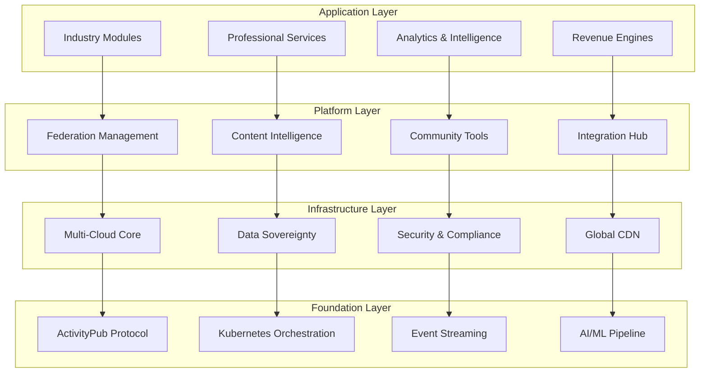

### 2.2 Core Platform Architecture

#### Federated Platform Management Core
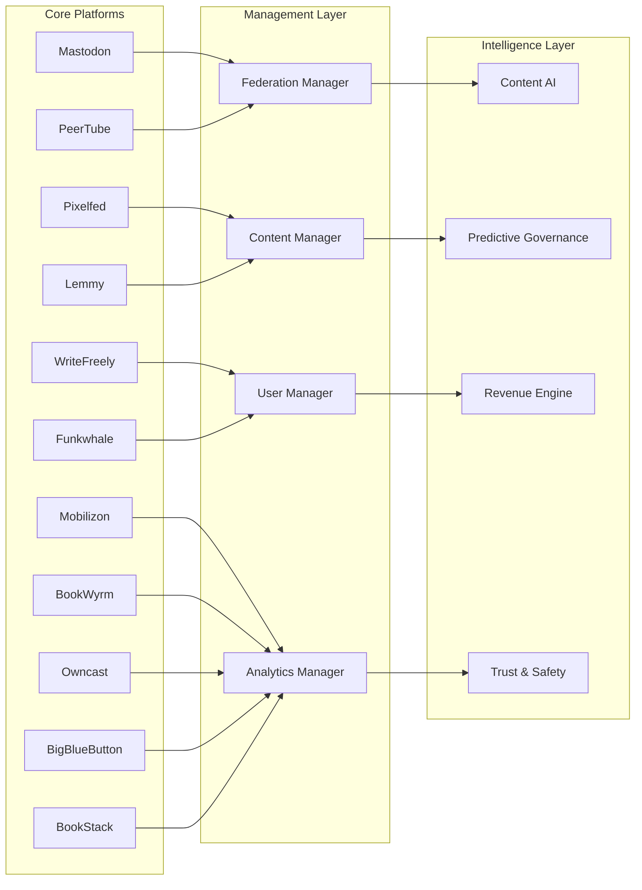

---

## 3. Industry-Specific Ecosystem Modules

### 3.1 Academic Excellence Ecosystem

#### Complete Academic Infrastructure
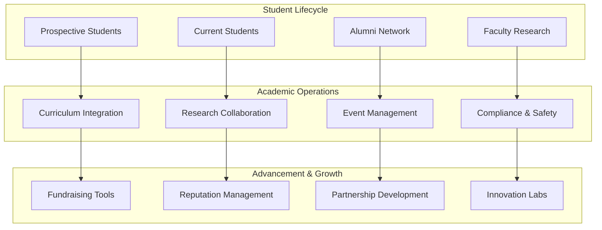

**Academic Revenue Streams:**
- **Student Services Premium**: $50-200/month per student for enhanced career services and networking
- **Alumni Network Access**: $500-2,000/year for premium alumni community features
- **Research Collaboration Platform**: $25,000-250,000/year for cross-institutional research networks
- **Corporate Partnership Portal**: $10,000-100,000/year for industry-university connections
- **Continuing Education Platform**: $200-1,000/course for professional development content
- **Academic Conference Management**: 10-20% commission on conference revenue

### 3.2 Healthcare Excellence Ecosystem

#### Comprehensive Healthcare Community Platform
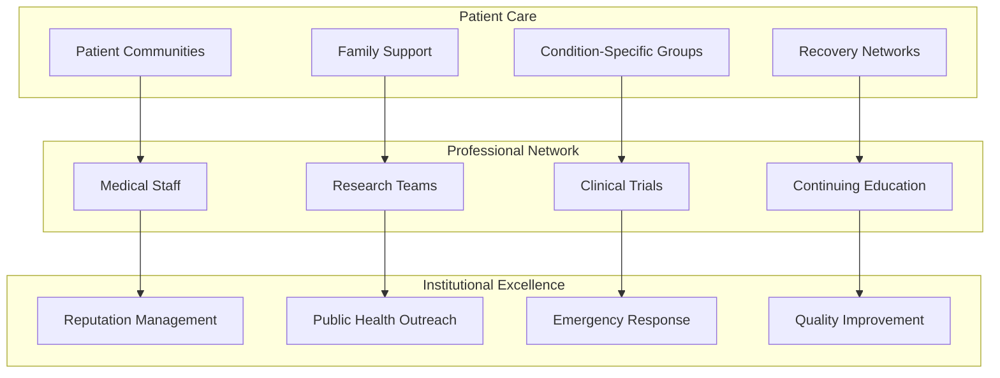

**Healthcare Revenue Streams:**
- **Patient Engagement Platform**: $20-100/month per patient for premium health community access
- **Professional Medical Network**: $500-5,000/year for medical professionals
- **Clinical Trial Recruitment**: $5,000-50,000 per successful trial participant recruited
- **Medical Education Platform**: $1,000-10,000/course for accredited medical education
- **Healthcare Analytics**: $50,000-500,000/year for population health insights
- **Telemedicine Integration**: $50-200/consultation for integrated social-telemedicine

### 3.3 Government & Public Sector Ecosystem

#### Citizen Engagement & Democratic Participation
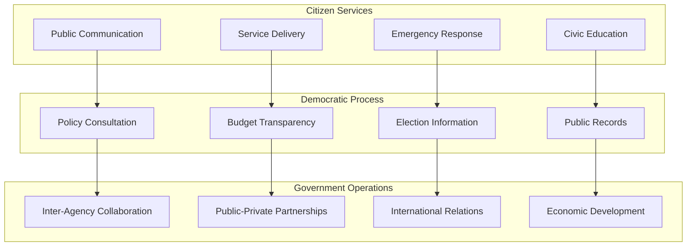

**Government Revenue Streams:**
- **Citizen Engagement Platform**: $10-50/month per citizen for premium government services
- **Business License Portal**: $500-5,000/year for expedited business services
- **Economic Development Network**: $10,000-100,000/year for business attraction and retention
- **Tourism Promotion Platform**: Revenue sharing with local tourism businesses
- **Public Records Access**: $5-50/request for expedited public records processing
- **E-Government Services**: $25-250/transaction for enhanced digital government services

### 3.4 Media & Journalism Ecosystem

#### Next-Generation News & Information Platform
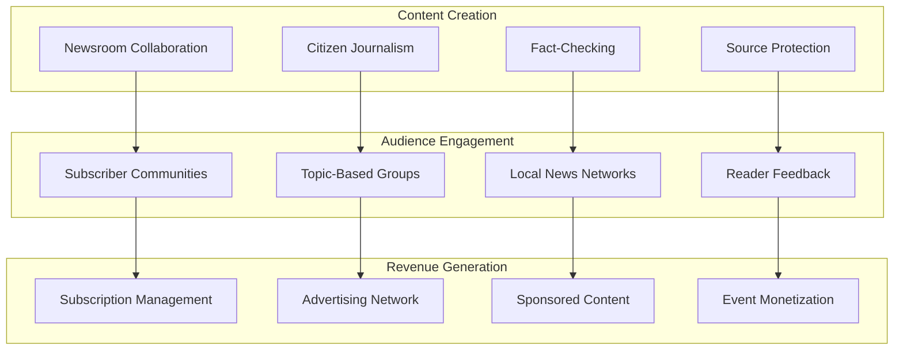

**Media Revenue Streams:**
- **Premium News Subscriptions**: $10-100/month for exclusive community access
- **Journalist Verification Network**: $100-1,000/year for verified journalist status
- **Local Business Directory**: $100-1,000/month for local business promotion
- **Event Ticketing**: 5-15% commission on community event ticket sales
- **Sponsored Content Platform**: $1,000-25,000/post for native advertising
- **Media Literacy Education**: $50-500/course for digital literacy training

### 3.5 Nonprofit & NGO Ecosystem

#### Impact-Driven Community Platform
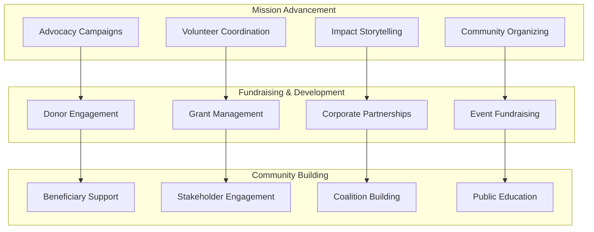

**Nonprofit Revenue Streams:**
- **Donor Management Platform**: $500-5,000/year for comprehensive donor engagement
- **Volunteer Coordination System**: $100-1,000/month for volunteer management
- **Grant Application Support**: $5,000-50,000/grant for successful grant writing support
- **Event Management Platform**: 10-20% commission on fundraising event revenue
- **Impact Measurement Tools**: $2,000-20,000/year for impact tracking and reporting
- **Coalition Building Platform**: $1,000-10,000/year for cross-organization collaboration

### 3.6 Corporate & Enterprise Ecosystem

#### Employee Engagement & External Community Platform
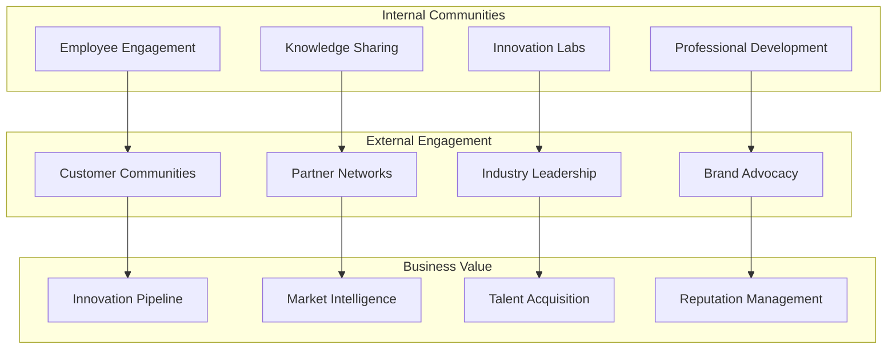

**Corporate Revenue Streams:**
- **Employee Engagement Platform**: $25-100/month per employee for premium features
- **Customer Community Management**: $10,000-100,000/year for customer engagement
- **Innovation Collaboration Platform**: $50,000-500,000/year for open innovation
- **Industry Network Access**: $25,000-250,000/year for industry leadership positioning
- **Talent Pipeline Management**: $5,000-50,000/hire for talent acquisition
- **Brand Advocacy Network**: $10,000-100,000/year for brand advocacy management

---

## 4. Advanced Technology Architecture

### 4.1 AI & Intelligence Layer

#### Content Intelligence Engine
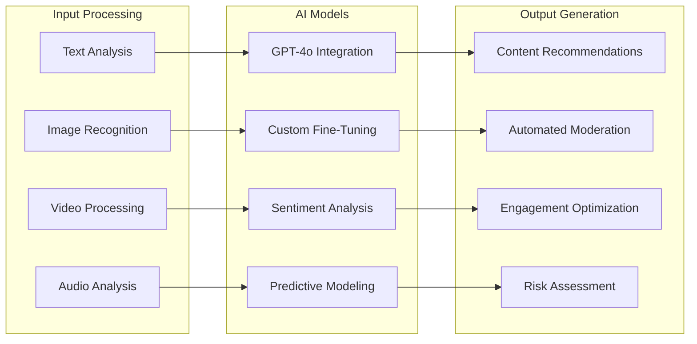

**AI Services Revenue Model:**
- **Content Intelligence API**: $0.10-1.00 per content analysis depending on complexity
- **Predictive Analytics**: $5,000-50,000/month for advanced predictive modeling
- **Custom AI Training**: $25,000-250,000 for organization-specific AI model development
- **Real-Time Sentiment Analysis**: $1,000-10,000/month for continuous sentiment monitoring
- **Automated Content Generation**: $0.50-5.00 per generated content piece
- **Risk Assessment Services**: $2,000-20,000/month for comprehensive risk monitoring

### 4.2 Revenue Engine Architecture

#### Multi-Stream Revenue Platform
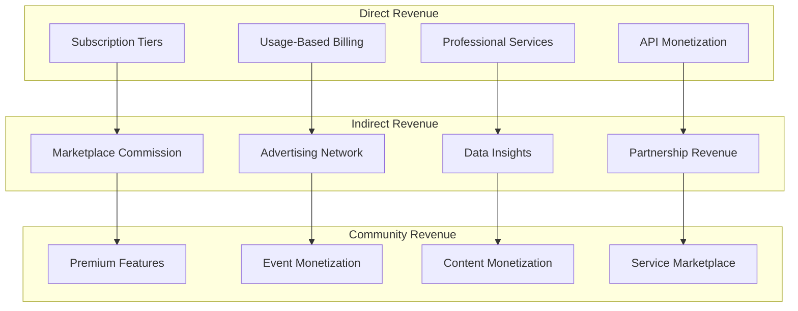

### 4.3 Data Sovereignty & Analytics Architecture

#### Comprehensive Data Platform
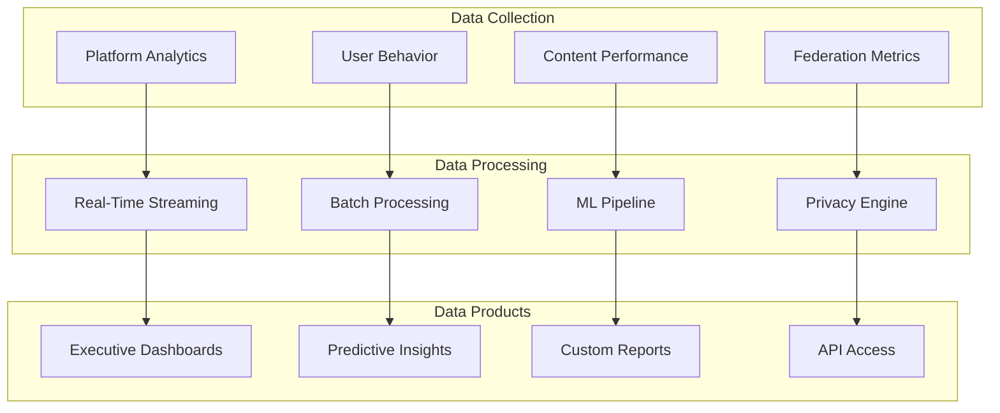

---

## 5. Comprehensive Pricing & Monetization Strategy

### 5.1 Tiered Platform Pricing

#### Enterprise Subscription Model
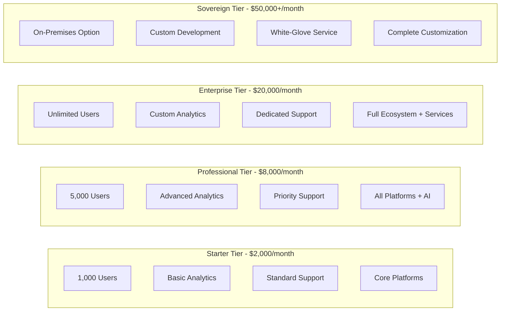

### 5.2 Usage-Based Revenue Streams

#### Granular Service Pricing
- **Content Processing**: $0.02-0.25 per content item (automated → expert human review)
- **API Calls**: $0.001-0.01 per call (basic → premium endpoints)
- **Storage**: $0.05-0.15/GB/month (standard → premium with instant access)
- **Bandwidth**: $0.02-0.08/GB (standard → priority CDN)
- **AI Services**: $0.10-5.00 per analysis (sentiment → deep content intelligence)
- **Moderation**: $0.10-2.00 per item (automated → crisis response)

### 5.3 Professional Services Revenue

#### Value-Added Service Pricing
- **Implementation Services**: $50,000-500,000 per project (complexity-based)
- **Training Programs**: $10,000-100,000 per program (scope and audience size)
- **Ongoing Consulting**: $300-800/hour (expertise level and specialization)
- **Custom Development**: $200,000-2,000,000 per project
- **Migration Services**: $25,000-250,000 per platform migrated
- **Crisis Response**: $5,000-50,000 per incident (24/7 emergency response)

### 5.4 Industry-Specific Revenue Models

#### Academic Institution Pricing
- **Base Platform**: $5,000-50,000/month (institution size-based)
- **Student Premium Services**: $25-100/student/year
- **Alumni Network Access**: $500-2,000/alumni/year
- **Research Collaboration**: $25,000-250,000/year
- **Fundraising Tools**: 2-5% of funds raised through platform

#### Healthcare Institution Pricing
- **Base Platform**: $10,000-100,000/month (patient volume-based)
- **Patient Community Access**: $10-50/patient/month
- **Professional Network**: $200-2,000/provider/year
- **Clinical Trial Support**: $10,000-100,000/trial
- **Telemedicine Integration**: $25-100/consultation

#### Government Agency Pricing
- **Base Platform**: $15,000-150,000/month (population served)
- **Citizen Premium Services**: $5-25/citizen/year
- **Business Services**: $100-1,000/business/year
- **Emergency Response**: $50,000-500,000/year (population-based)
- **Economic Development**: Revenue sharing with business attraction

---

## 6. Integration & API Ecosystem

### 6.1 Platform Integration Architecture

#### Third-Party Integration Hub
```mermaid
graph TB
    subgraph "CRM Systems"
        CRM1[Salesforce]
        CRM2[HubSpot]
        CRM3[Microsoft Dynamics]
    end
    
    subgraph "Educational Systems"
        EDU1[Canvas LMS]
        EDU2[Blackboard]
        EDU3[Moodle]
        EDU4[Student Information Systems]
    end
    
    subgraph "Business Systems"
        BUS1[Slack/Teams]
        BUS2[Office 365]
        BUS3[Google Workspace]
        BUS4[Zoom/WebEx]
    end
    
    subgraph "Analytics Platforms"
        ANA1[Google Analytics]
        ANA2[Tableau]
        ANA3[Power BI]
        ANA4[Mixpanel]
    end
    
    CRM1 --> FediFlow
    CRM2 --> FediFlow
    CRM3 --> FediFlow
    EDU1 --> FediFlow
    EDU2 --> FediFlow
    EDU3 --> FediFlow
    EDU4 --> FediFlow
    BUS1 --> FediFlow
    BUS2 --> FediFlow
    BUS3 --> FediFlow
    BUS4 --> FediFlow
    ANA1 --> FediFlow
    ANA2 --> FediFlow
    ANA3 --> FediFlow
    ANA4 --> FediFlow
```

### 6.2 API Monetization Strategy

#### API Revenue Streams
- **Basic API Access**: Included in subscription tiers
- **Premium API Endpoints**: $0.005-0.05 per call for advanced features
- **Real-Time API**: $0.01-0.10 per WebSocket connection hour
- **Bulk API Operations**: $0.0005-0.005 per call (minimum 10,000 calls)
- **Custom API Development**: $50,000-500,000 for organization-specific endpoints
- **API Partner Program**: 20-30% revenue share for certified integrations

### 6.3 Marketplace & Partner Ecosystem

#### Revenue Sharing Model
- **Application Marketplace**: 30% commission on third-party app sales
- **Service Provider Network**: 15-25% commission on service bookings
- **Content Creator Platform**: 10-20% commission on premium content sales
- **Training & Certification**: 40-60% revenue share with training partners
- **Integration Partners**: 20-30% revenue share for certified integrations

---

## 7. ROI & Value Creation Framework

### 7.1 Customer ROI Models by Industry

#### Academic Institution ROI
**Year 1 ROI: 250-350%**
- Student recruitment cost reduction: $200,000-800,000
- Alumni engagement improvement: $500,000-2,000,000
- Operational efficiency gains: $300,000-1,200,000
- Risk mitigation value: $500,000-5,000,000

**Years 2-5 ROI: 500-1000%+**
- Research funding increases: $2,000,000-20,000,000
- Endowment growth: $5,000,000-50,000,000
- Competitive positioning: $10,000,000-100,000,000
- Brand value enhancement: Immeasurable long-term value

#### Healthcare Institution ROI
**Year 1 ROI: 200-300%**
- Patient engagement improvement: $1,000,000-5,000,000
- Staff efficiency gains: $500,000-2,000,000
- Reputation enhancement: $2,000,000-10,000,000
- Quality improvement: $1,000,000-5,000,000

#### Government Agency ROI
**Year 1 ROI: 300-500%**
- Citizen service efficiency: $500,000-5,000,000
- Emergency response improvement: $1,000,000-10,000,000
- Economic development: $2,000,000-20,000,000
- Transparency & trust value: Immeasurable civic benefit

### 7.2 Platform ROI for FediFlow

#### Revenue Projection Model
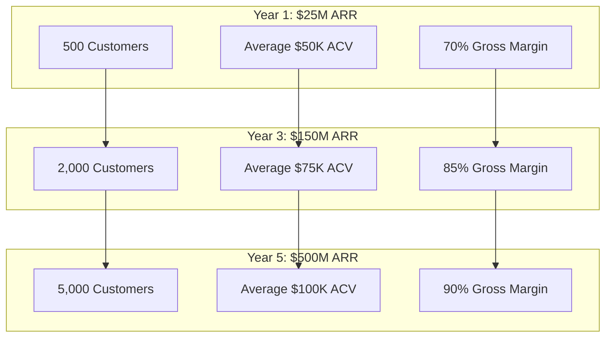

---

## 8. Implementation & Scaling Strategy

### 8.1 Phased Rollout Timeline

#### Phase 1: Foundation (Months 1-12)
- **Core Platform**: Multi-tenant federated platform with enterprise security
- **Academic Module**: Complete academic ecosystem for universities
- **Basic Analytics**: Essential institutional engagement metrics
- **Professional Services**: Implementation and training capabilities

#### Phase 2: Expansion (Months 13-24)
- **Healthcare Module**: Complete healthcare community platform
- **Government Module**: Citizen engagement and democratic participation tools
- **AI Platform**: Advanced content intelligence and predictive analytics
- **Global Infrastructure**: International deployment with data residency

#### Phase 3: Scale (Months 25-36)
- **Media Module**: Next-generation journalism and news platforms
- **Corporate Module**: Employee and customer engagement ecosystems
- **Advanced AI**: Custom AI training and specialized intelligence services
- **Market Leadership**: Industry leadership and ecosystem partnerships

#### Phase 4: Innovation (Months 37-48)
- **Nonprofit Module**: Impact-driven community and fundraising platforms
- **Creator Economy**: Individual creator and influencer platforms
- **Emerging Technology**: VR/AR, blockchain, and IoT integration
- **Global Expansion**: Worldwide market leadership and localization

### 8.2 Technical Scaling Architecture

#### Infrastructure Scaling Plan
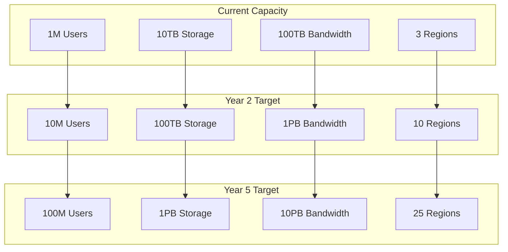

---

## 9. Risk Management & Mitigation

### 9.1 Technical Risk Mitigation

#### Platform Resilience Strategy
- **Multi-Cloud Architecture**: Eliminate single cloud provider dependency
- **Service Mesh**: Comprehensive traffic management and circuit breaking
- **Chaos Engineering**: Quarterly resilience testing and failure simulation
- **Disaster Recovery**: Sub-5-minute RTO with zero data loss guarantees
- **Security Operations**: 24/7 SOC with AI-powered threat detection

### 9.2 Business Risk Mitigation

#### Market Risk Management
- **Diversified Revenue**: Multiple revenue streams across industries
- **Technology Independence**: Open-source foundation with proprietary enhancements
- **Regulatory Compliance**: Proactive compliance with global regulations
- **Customer Success**: Dedicated success teams ensuring customer ROI
- **Innovation Pipeline**: Continuous R&D investment for market leadership

---

## 10. Success Metrics & KPIs

### 10.1 Platform Success Metrics

#### Growth & Adoption KPIs
- **Customer Acquisition**: 25% month-over-month growth target
- **Revenue Growth**: $500M ARR by Year 5
- **Platform Adoption**: 90% customer satisfaction and NPS >70
- **Technical Performance**: 99.99% uptime with <100ms response times
- **Market Position**: #1 federated platform provider globally

### 10.2 Customer Success Metrics

#### Value Delivery KPIs
- **Customer ROI**: >300% average ROI within 18 months
- **Platform Utilization**: >80% feature adoption across customer base
- **Community Growth**: 15% monthly active user growth per customer
- **Revenue Impact**: Measurable revenue increases for 90% of customers
- **Retention Rate**: >95% customer retention with <2% churn

---

## 11. Conclusion: The Future of Institutional Digital Infrastructure

FediFlow Enterprise represents the foundational infrastructure for the next generation of digital institutional engagement. By providing complete data sovereignty, industry-specific value creation, and comprehensive revenue generation capabilities, we enable organizations to build authentic communities while maintaining complete control over their digital presence.

### Strategic Competitive Advantages

1. **First-Mover Advantage**: Leading position in enterprise federated social infrastructure
2. **Technical Excellence**: Comprehensive platform spanning all major federated protocols
3. **Industry Expertise**: Deep understanding of institutional needs and compliance requirements
4. **Revenue Innovation**: Multiple monetization streams creating sustainable competitive advantages
5. **Ecosystem Leadership**: Building the foundational infrastructure for the decentralized web

### Long-Term Vision

As centralized platforms become increasingly volatile and institutions demand data sovereignty, FediFlow will become the primary infrastructure layer enabling organizations to own, control, and monetize their digital communities. Our comprehensive ecosystem approach creates sustainable competitive advantages while contributing to a healthier, more democratic internet.

The future belongs to institutions that control their digital destinies. FediFlow provides the infrastructure to make that future possible today.