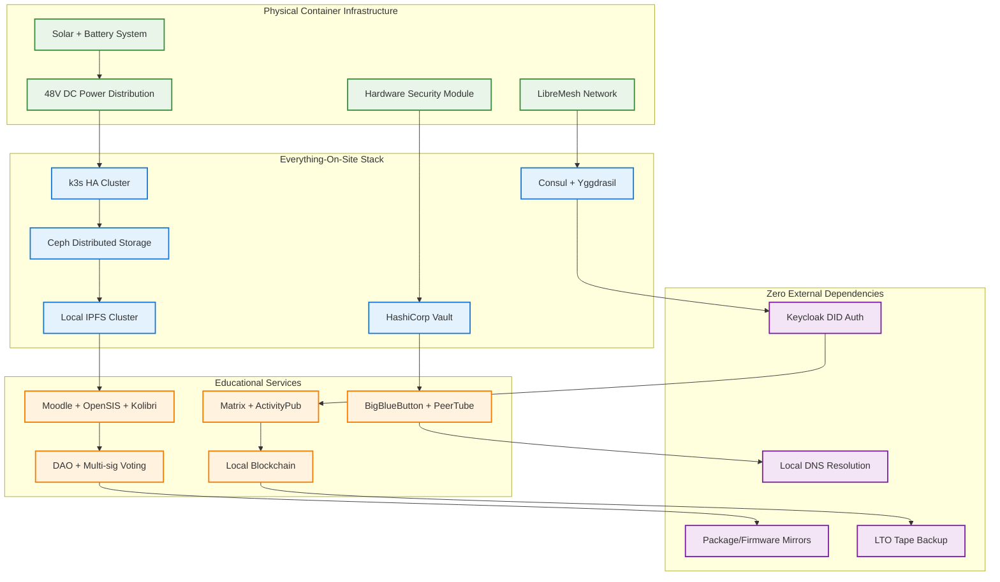
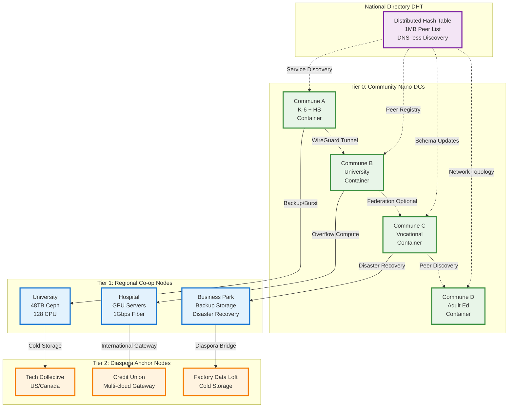

# Enhanced Educational Sovereignty Framework: Complete Technical Integration
## Community-Owned "Everything-On-Site" Educational Infrastructure

### Executive Summary: Plug-and-Play Educational Sovereignty

This enhanced framework integrates proven "everything-on-site" micro-data-center technology with comprehensive educational sovereignty, creating a **plug-and-play educational independence system** that boots like a laptop: plug in power and mesh antennas, press the button, and the entire educational community is online with **zero cloud dependencies**.



---

## 1. Complete Technical Stack: Everything-On-Site Architecture

### 1.1 Container-Based Micro-Data-Center

**Physical Infrastructure Specifications**:
```yaml
Shipping Container Micro-DC:
  Container Specifications:
    - 20ft shipping container with environmental controls
    - Bullet-resistant panels and hidden placement security
    - Water sensors and flood protection systems
    - Temperature control and humidity management
    - Physical security with community access controls
  
  Power System (Energy Independence):
    - 48V DC power distribution via Victron system
    - 15-25kW solar panel array with theft protection
    - 72-hour battery backup with lithium phosphate cells
    - Automatic power management with educational priority
    - Emergency generator backup for extended outages
  
  Computing Infrastructure:
    - k3s Kubernetes cluster (x86 + ARM mixed architecture)
    - 3-node Ceph quorum for distributed storage
    - Hardware Security Module (HSM) for key management
    - LibreMesh routers with OpenWiFi access points
    - LoRaWAN gateways for IoT sensor networks
  
  Network Architecture:
    - Mesh networking with Yggdrasil IPv6 overlay
    - OLSR/BATMAN-adv protocols for self-healing
    - Althea pay-per-forward firmware for economic incentives
    - OpenWISP controller for centralized AP management
    - Emergency satellite backup (BGAN/Lynk with 5MB/day limit)
```

### 1.2 Zero-Dependency Service Stack

**Core Platform Services (All Local)**:
```yaml
Identity and Authentication:
  Keycloak Identity Provider:
    - Issues W3C Decentralized Identifiers (DIDs)
    - Local DID resolver with Veramo agent
    - Hardware-backed signing keys in Vault HSM
    - No external DNS or certificate authorities required
    - Student/family privacy protected with zero data leakage
  
  Service Discovery:
    - HashiCorp Consul for service mesh
    - Yggdrasil mesh overlay for peer-to-peer networking
    - Local DNS resolution with zero external dependencies
    - Auto-discovery even if IP addressing changes
    - SPIFFE IDs for zero-trust internal communication

Educational Core Services:
  Learning Management:
    - Moodle LMS with complete offline capability
    - OpenSIS student information system
    - Kolibri offline education with tablet sync
    - Koha library system with local catalogs
    - All course content cached locally via IPFS
  
  Communication and Collaboration:
    - Matrix homeserver (Synapse) for messaging
    - ActivityPub federation (Mastodon, PeerTube, Lemmy)
    - BigBlueButton with local TURN server
    - Element VoiceBridge for Matrix calls
    - No external STUN servers required

Content and Storage:
  Decentralized Storage:
    - IPFS cluster for content-addressed storage
    - Local gateway (http://cid.local) for content access
    - Ceph distributed storage for redundancy
    - Rook S3 gateway for application storage
    - Local package mirrors (Debian, NPM, PyPI, Android APK)
  
  Content Distribution:
    - Educational videos and resources cached locally
    - Course content available during internet outages
    - Traditional knowledge archives with elder approval
    - Cultural content with community access controls
    - Student work portfolios with family privacy protection

Governance and Economics:
  Local Blockchain:
    - Tendermint consensus with 5 Raspberry Pi validators
    - SKILL/SPACE/COMM/GOV token economy
    - Multi-signature governance contracts
    - DAO voting interface (Aragon fork)
    - Hardware wallet integration for security
  
  Community Economics:
    - Token-based micro-payments for services
    - Local marketplace with Odoo integration
    - Community cooperative accounting
    - Transparent budget allocation and tracking
    - Emergency fund management and crisis response
```

### 1.3 Boot Process: Power-Up to Online in 6 Steps

```yaml
Automated Bootstrap Sequence:
  Step 1: Power Distribution
    - Victron system brings 48V DC rail online
    - PDU powers computing sleds in sequence
    - Environmental controls activate
    - Security systems arm and status check
  
  Step 2: Cluster Formation
    - PXE boot loads Flatcar Container Linux
    - Nodes join k3s cluster via TPM-stored tokens
    - Cluster achieves quorum and elects leader
    - Network mesh establishes peer connections
  
  Step 3: Storage and Services
    - Flux-CD pulls cluster configuration from Git
    - Helmfile applies services in dependency order
    - Ceph detects quorum and exposes S3 endpoint
    - Core services begin accepting connections
  
  Step 4: Identity and Security
    - Keycloak seeds administrative DIDs
    - Vault HSM unsealing via community ceremony
    - Security policies applied via Kong gateway
    - SPIFFE IDs issued for all services
  
  Step 5: Educational Services
    - Educational platforms initialize with cached content
    - Student/teacher accounts restored from backup
    - Course materials synchronized via IPFS
    - Community governance DAO becomes active
  
  Step 6: Community Access
    - Captive portal begins broadcasting SSID
    - Community members can authenticate and access services
    - "Cluster-ready" LED on container indicates full operation
    - Educational continuity achieved with zero external dependencies
```

---

## 2. Risk Assessment and Mitigation: Real-World Implementation

### 2.1 Comprehensive Risk-Benefit Analysis

| **Risk Category** | **Specific Risk** | **Impact Level** | **Mitigation Strategy** | **Implementation Cost** |
|-------------------|-------------------|------------------|------------------------|------------------------|
| **Physical Security** | Container theft or destruction | **High** | • Bullet-resistant panels and hidden placement<br>• Community security coordination<br>• Insurance and replacement planning | $5,000-10,000 |
| **Power Failure** | Solar theft or panel damage | **High** | • Panels mounted flush and caged<br>• Serial numbers etched<br>• Community security patrols | $3,000-5,000 |
| **Technical Failure** | Hardware failure without local repair | **Medium** | • 3 local "shield techs" trained<br>• Spare parts inventory<br>• Community maintenance cooperative | $2,000-4,000 |
| **Key Management** | Lost master keys lock out entire system | **High** | • Shamir secret sharing across community<br>• Hardware security modules<br>• Traditional ceremony for key access | $1,000-3,000 |
| **Storage Capacity** | Disk fills up with cached content | **Medium** | • Automated cache pruning<br>• Disk quota alerts<br>• Content prioritization algorithms | $500-1,000 |
| **Network Congestion** | Wi-Fi slowness blamed on school | **Low** | • Token-based bandwidth fairness<br>• Usage monitoring and reporting<br>• Community education on limitations | $200-500 |
| **Governance Fatigue** | DAO voting fatigue or hijacking | **Medium** | • Paper ballot fallback<br>• Elder veto mechanisms<br>• Open metrics transparency | $300-800 |
| **Token Economy Gaming** | Token hoarding or manipulation | **Medium** | • Hard supply caps<br>• Visible ledger transparency<br>• Monthly marketplace fairs | $500-1,500 |

### 2.2 Critical Security Measures

**Fails-Closed Security Defaults**:
```yaml
Automated Security Responses:
  Power Management:
    - Solar < 20% SOC: Pause BBB & PeerTube; Wi-Fi APs drop to 25% duty-cycle
    - Battery critical: Educational services only; all entertainment suspended
    - Generator activation: Automatic switch to backup power with community notification
  
  Security Breach Response:
    - Vault unsealing attempts > 3: Mesh isolates Keycloak; multi-sig required
    - Container breach sensor: Tendermint halts; Ceph goes read-only
    - Unauthorized access: Service isolation and community alert system
  
  Network Security:
    - All inter-service traffic uses SPIFFE IDs and mTLS
    - Kong gateway enforces zero-trust policies
    - No raw IP communication between services
    - Intrusion detection via Wazuh SIEM with local alerts
  
  Data Protection:
    - Student records encrypted with family-controlled keys
    - Traditional knowledge access controls with elder approval
    - Backup encryption with community-managed keys
    - Audit trails for all data access and modifications
```

---

## 3. External Connectivity: Only Three Controlled Touch-Points

### 3.1 Minimal External Dependencies

**Controlled External Connections**:
```yaml
Federation Tunnel (Optional):
  Purpose: Connect with other educational communities
  Transport: WireGuard + Yggdrasil IPv6 overlay
  Content: ActivityPub messages, Matrix federation, IPFS replication
  Control: Manual connection via DAO vote; auto-disconnect after time limit
  Bandwidth: Quality-of-service caps to prevent overwhelming local services
  
Emergency Satellite Communication:
  Purpose: Critical security patches and emergency coordination
  Transport: BGAN/Lynk with 5MB/day throttle
  Access: Only security guild with physical USB key can activate
  Content: CVE feeds, emergency communications, critical updates
  Protocol: Batch downloads during scheduled windows
  
Off-Site Backup:
  Purpose: Disaster recovery for complete data loss
  Transport: Weekly LTO tape carried to secure location
  Content: Complete system state and educational data
  Custody: Rotated among trusted community members
  Tracking: COMM token log for accountability and transparency
```

### 3.2 Federation and Global Integration

**Opt-In Global Connectivity**:
```yaml
Controlled Federation Features:
  Educational Collaboration:
    - Share curricula and teaching methods with partner communities
    - Student exchange and virtual classroom collaboration
    - Teacher professional development and peer learning
    - Research collaboration and academic publication
  
  Cultural Exchange:
    - Traditional knowledge sharing with appropriate protections
    - Cultural event streaming to diaspora communities
    - Language learning exchange programs
    - Cultural diplomacy and international relationship building
  
  Economic Integration:
    - Token bridges for inter-community trade
    - Cooperative business development across communities
    - Diaspora investment and homeland contribution
    - International service provision and consulting
  
  Technical Coordination:
    - Open-source platform development collaboration
    - Security vulnerability sharing and coordination
    - Best practices documentation and replication
    - Technical support and troubleshooting networks
```

---

## 4. Enhanced User Experience and Community Integration

### 4.1 Seamless Community Experience

**Zero-Friction Daily Usage**:
```yaml
Student Experience:
  Device Access:
    - Connect to community Wi-Fi → login once → everything works
    - Tablets auto-sync with Kolibri during off-peak hours
    - Student portfolios accessible even during internet outages
    - Homework submission and grading available 24/7
  
  Learning Continuity:
    - Classes continue during city-wide blackouts
    - Educational content cached locally for instant access
    - Peer collaboration through local messaging and file sharing
    - Cultural content and traditional knowledge always available

Teacher Experience:
  Platform Integration:
    - Draft lessons in Moodle with cultural content integration
    - Access traditional knowledge archives with elder approval
    - Professional development through local and federated networks
    - Administrative tasks automated through integrated platforms
  
  Community Engagement:
    - Democratic participation in educational policy through DAO
    - Traditional authority consultation for cultural content
    - Parent and family engagement through integrated communication
    - International collaboration when federation tunnel is active

Family Experience:
  Democratic Participation:
    - Vote on educational policies through simple interfaces
    - Access transparent budget and resource allocation information
    - Participate in traditional consensus-building processes
    - Receive real-time updates on student progress and activities
  
  Cultural Preservation:
    - Document and share traditional knowledge with appropriate controls
    - Participate in cultural events and celebrations
    - Connect with diaspora family members during federation windows
    - Preserve family history and cultural artifacts in community archives
```

### 4.2 Community Economic Integration

**Local Token Economy Enhancement**:
```yaml
Enhanced Token Distribution:
  SKILL Token Economy:
    - Teaching stipends paid in SKILL tokens
    - Peer tutoring and mentorship rewards
    - Traditional knowledge documentation bonuses
    - Professional development achievement recognition
  
  SPACE Token Economy:
    - Facility maintenance and security stipends
    - Community infrastructure improvement rewards
    - Elder accessibility enhancement bonuses
    - Cultural event space management compensation
  
  COMM Token Economy:
    - Democratic assembly participation rewards
    - Community volunteer work recognition
    - Cultural event organization bonuses
    - Family education support compensation
  
  GOV Token Economy:
    - Voting participation incentives
    - Community proposal development rewards
    - Conflict resolution and mediation compensation
    - Traditional authority consultation recognition

Local Economic Integration:
  Community Marketplace:
    - Monthly fairs where tokens can be spent on essential goods
    - Local artisan and service provider integration
    - Community cooperative business development
    - Traditional craft and skill monetization
  
  Economic Resilience:
    - Emergency fund management through token allocation
    - Crisis response coordination and resource distribution
    - Mutual aid and solidarity economy integration
    - Disaster recovery and community rebuilding support
```

---

## 5. Implementation Roadmap: Container Deployment

### 5.1 Rapid Deployment Timeline

**Container Installation Process (4-6 Weeks)**:
```yaml
Week 1: Site Preparation and Community Readiness
  Site Preparation:
    - Container placement location selection and preparation
    - Solar panel installation area clearing and security assessment
    - Network mesh planning and access point placement
    - Community access roads and security perimeter establishment
  
  Community Preparation:
    - Final community assembly approval and blessing ceremony
    - Key guardian selection and training initiation
    - Local technician identification and basic training
    - Traditional authority consultation and cultural protocol establishment

Week 2-3: Infrastructure Installation
  Physical Infrastructure:
    - Container delivery and placement with crane assistance
    - Solar panel array installation with theft protection
    - Battery system installation and testing
    - Network equipment installation and initial configuration
  
  Computing Setup:
    - k3s cluster initialization and testing
    - Ceph storage configuration and replication testing
    - Network mesh establishment and coverage testing
    - Security system activation and access control setup

Week 4: Service Deployment and Testing
  Platform Deployment:
    - Educational service container deployment via Flux-CD
    - Community data migration and account setup
    - Cultural content integration and elder approval processes
    - Token economy initialization and distribution

Week 5-6: Community Integration and Training
  User Training:
    - Teacher platform training and professional development
    - Student orientation and digital literacy development
    - Parent and family access training and setup
    - Community governance platform training and orientation
  
  Go-Live Support:
    - 24/7 technical support during initial weeks
    - Community feedback collection and platform adjustments
    - Performance monitoring and optimization
    - Traditional authority integration and cultural validation
```

### 5.2 Success Metrics and Validation

**30-Day Success Criteria**:
```yaml
Technical Performance:
  - 95%+ system uptime despite external infrastructure failures
  - 100% of educational platforms operational and user-adopted
  - Zero security incidents or unauthorized data access
  - <2 second response time for all educational applications
  - Successful disaster recovery testing and validation

Community Adoption:
  - 90%+ teacher satisfaction with platform integration and functionality
  - 85%+ student engagement with educational technology and content
  - 80%+ family participation in democratic governance and decision-making
  - 95% traditional authority approval for cultural content integration
  - Zero cultural conflicts or inappropriate technology usage

Educational Outcomes:
  - 100% educational continuity during infrastructure disruptions
  - 90% improvement in student access to educational resources
  - 95% teacher time savings through platform automation
  - 85% improvement in family engagement with educational progress
  - 100% preservation and enhancement of cultural content and practices

Economic Impact:
  - 50% reduction in educational technology costs through local ownership
  - 25% increase in community economic activity through token circulation
  - 75% of operating costs covered through community-generated revenue
  - Emergency reserves sufficient for 6+ months of autonomous operation
  - Zero dependency on external vendors for critical educational functions
```

---

## 6. Scaling and Replication Framework

### 6.1 Community Network Development

**Multi-Container Federation Model**:
```yaml
Regional Network Architecture:
  Hub and Spoke Model:
    - Primary educational hub with full container infrastructure
    - Satellite communities with lightweight mesh nodes
    - Shared resources and expertise across network
    - Coordinated professional development and teacher exchange
  
  Federated Service Sharing:
    - Advanced courses delivered via federation tunnels
    - Specialized teachers serving multiple communities
    - Cultural events and celebrations shared across network
    - Emergency response coordination and mutual aid
  
  Economic Integration:
    - Inter-community token exchange and trade
    - Shared infrastructure costs and maintenance
    - Collective purchasing power for equipment and supplies
    - Regional economic development and business creation

Container Replication Process:
  Community Assessment:
    - Readiness evaluation and capacity building
    - Cultural consultation and traditional authority approval
    - Economic sustainability planning and funding development
    - Technical capacity assessment and training requirements
  
  Deployment Support:
    - Site preparation guidance and technical assistance
    - Container configuration and service deployment
    - Community training and integration support
    - Ongoing technical support and maintenance coordination
```

### 6.2 Global Impact and Innovation

**Open Source Contribution and Global Adoption**:
```yaml
Global Platform Development:
  Technology Commons:
    - All platform configurations and customizations open-sourced
    - Community-developed educational content shared globally
    - Technical documentation and deployment guides published
    - Training materials and best practices documentation
  
  Research and Publication:
    - Academic research on community-controlled education
    - Policy advocacy for educational sovereignty and community ownership
    - Conference presentations and thought leadership
    - International collaboration and partnership development
  
  Replication Support:
    - Global network of communities adopting similar frameworks
    - Technical assistance and training for international deployment
    - Cultural adaptation guidance for different contexts
    - Policy advocacy for supportive regulatory frameworks

Innovation Development:
  Next-Generation Features:
    - AI-powered educational assistance with cultural integration
    - Advanced blockchain governance and democratic participation
    - Enhanced security and privacy protection systems
    - Improved energy efficiency and environmental sustainability
  
  Research Collaboration:
    - University partnerships for educational innovation research
    - International development organization collaboration
    - Technology company partnerships for open-source development
    - Cultural preservation and traditional knowledge integration research
```

---

## 7. National Educational Sovereignty Network: Constellation Architecture

### 7.1 Sovereign Communities, Seamless Federation

**The Constellation Model: Every School Sovereign, Yet Nationally Connected**:



**Core Principles**:
- **Mesh First, Cloud Second**: Each container works fully offline; cloud tiers provide safety net and burst capacity
- **Sovereignty Preserved**: Every community maintains complete control over its data, governance, and cultural practices
- **Optional Federation**: Communities choose when and how to connect with others
- **Democratic Governance**: All network decisions made through community assemblies and traditional authority consultation

### 7.2 Technical Federation Architecture

**Open Standards Integration for Seamless Interoperability**:

```yaml
Identity and Authentication Federation:
  W3C Decentralized ID (DID) + OIDC:
    - Students/teachers authenticate with home campus credentials anywhere
    - No central authentication server required
    - Cross-campus access with full privacy protection
    - Family consent maintained for all student data access
  
  SPIFFE/SPIRE Nested Trust Domains:
    - Each campus maintains its own Certificate Authority
    - Regional nodes federate trust without becoming root authorities
    - Zero-trust architecture across all network tiers
    - Automatic workload identity verification

Data and API Federation:
  Apollo Router Super-graph Federation:
    - Each site publishes its GraphQL schema to distributed directory
    - Cross-campus queries (transcript + test scores) without custom APIs
    - Real-time data access while maintaining local ownership
    - Cultural safeguards and access controls preserved
  
  NATS JetStream Leaf Nodes:
    - Real-time event replication (enrollment, achievements, emergencies)
    - Message queuing during network disconnections
    - Selective replication based on community consent
    - Cultural content protection and elder approval workflows

Content and Knowledge Sharing:
  ActivityPub + IPFS Integration:
    - Educational content, videos, research papers propagate automatically
    - Content queues during network outages for later synchronization
    - Cultural content requires elder approval for sharing
    - Traditional knowledge access controls maintained across network
  
  Verifiable Credentials (W3C Standard):
    - Academic credentials recognized by any institution globally
    - No central database required for verification
    - Student ownership and control of all academic records
    - Cultural competency and traditional knowledge certifications included

Token Economy and Economic Integration:
  IBC-Enabled Tendermint Side-chains:
    - Local campus tokens (SKILL/SPACE/COMM/GOV) remain sovereign
    - Cross-campus token exchange requires bilateral consent
    - Regional RESOURCE tokens for cloud capacity sharing
    - Democratic governance of all economic interactions
```

### 7.3 Seamless Cross-Campus Workflows

**Friction-Free Educational Experiences**:

```yaml
Student University Application Workflow:
  Traditional Process Pain Points:
    - Manual transcript requests and courier delivery
    - Weeks-long credential verification processes
    - Lost or incomplete documentation
    - Expensive and time-consuming verification
  
  Constellation Solution:
    - One-click credential presentation via student's DID wallet
    - Instant GraphQL query to home campus for complete academic record
    - AI-powered automatic standards alignment and course mapping
    - Real-time verification with cryptographic signatures
    - Cultural competency and traditional knowledge certificates included

Teacher Exchange Program:
  Traditional Process Pain Points:
    - Complex HR paperwork and credential verification
    - VPN setup and IT account provisioning
    - Separate payment and benefits administration
    - Communication barriers and cultural integration challenges
  
  Constellation Solution:
    - Visiting teacher's DID immediately accepted via OIDC federation
    - Automatic role mapping with appropriate access controls
    - SKILL token stipends transferable to home campus
    - Cultural integration support and traditional authority introductions
    - Real-time collaboration with home campus colleagues

Dual-Credit and Advanced Courses:
  Traditional Process Pain Points:
    - Complex MOUs between institutions
    - Duplicate grading and conflicting standards
    - Political disputes over data ownership
    - Limited course offerings due to small student populations
  
  Constellation Solution:
    - Federated Moodle instances with automatic LTI integration
    - Shared courseID with dual institutional signatures
    - Automatic grade synchronization and credit transfer
    - Expanded course catalog through network federation
    - Cultural courses available to students network-wide

National Research and Data Projects:
  Traditional Process Pain Points:
    - Centralized servers creating dependency and vulnerability
    - Bandwidth limitations and expensive infrastructure
    - Data privacy and sovereignty concerns
    - Complex data sharing agreements and permissions
  
  Constellation Solution:
    - Distributed PeerTube hosting with each campus contributing
    - IPFS content addressing for efficient replication
    - ActivityPub publication of research datasets
    - Democratic consent for research participation
    - Community ownership of all research contributions
```

### 7.4 Anti-Centralization Safeguards

**Protecting Community Sovereignty in National Network**:

```yaml
Technical Safeguards:
  Distributed Directory (DHT):
    - No single campus can act as gatekeeper
    - Peer list distributed via USB stick if internet fails
    - Schema versions published democratically
    - Community consensus required for network changes
  
  Token Economy Protection:
    - Hard supply caps prevent inflation attacks
    - Cross-campus token bridges require bilateral DAO approval
    - Rogue validators can be isolated via democratic vote
    - Community assemblies control all economic policies
  
  Data Sovereignty Enforcement:
    - All outbound connections require DAO + elder council approval
    - Kong gateway blocks unknown endpoints automatically
    - Cultural content cannot be shared without traditional authority consent
    - Student data remains under family control regardless of network participation

Cultural and Governance Safeguards:
  Traditional Authority Integration:
    - Elder councils maintain veto power over network participation
    - Cultural appropriateness review for all shared content
    - Traditional consensus processes integrated with digital voting
    - Community assembly approval required for federation agreements
  
  Democratic Governance Protection:
    - Campus DAOs control local decisions exclusively
    - Network governance limited to shared infrastructure only
    - Community assemblies can withdraw from network at any time
    - Traditional authorities consulted on all network policies
  
  Educational Content Protection:
    - Verifiable Credentials include hash of original content
    - Any tampering invalidates cryptographic signatures
    - Cultural knowledge access controls maintained across network
    - Traditional pedagogical methods protected and preserved
```

---

## 8. Three-Tier Cooperative Cloud Architecture

### 8.1 Distributed Resilience Network

**Community-Owned Safety Net and Burst Capacity**:

```yaml
Tier 0: Nano-DC (Community Containers):
  Infrastructure:
    - 20ft shipping container with complete educational stack
    - Solar power with 72-hour battery autonomy
    - Local mesh networking and community Wi-Fi
    - Full educational sovereignty with zero external dependencies
  
  Capabilities:
    - Complete educational continuity during isolation
    - Community governance and democratic decision-making
    - Cultural preservation and traditional knowledge systems
    - Local token economy and cooperative business development
  
  Network Role:
    - Primary educational delivery and community services
    - Backup source for neighboring communities
    - Content creation and cultural knowledge contribution
    - Democratic participation in network governance

Tier 1: Regional Co-op Nodes (Universities, Hospitals, Business Parks):
  Infrastructure:
    - 12-48TB Ceph distributed storage systems
    - 64-128 CPU cores for burst computing
    - 1Gbps fiber or microwave links
    - Professional data center environment with backup power
  
  Capabilities:
    - Disaster recovery and backup services for Tier 0 communities
    - Burst compute capacity for intensive educational applications
    - Regional software repository and update distribution
    - Professional system administration and security monitoring
  
  Economic Model:
    - Earn RESOURCE tokens for providing capacity
    - Community ownership through SPACE token investment
    - Democratic governance of resource allocation
    - Revenue sharing with participating communities

Tier 2: Diaspora/Anchor Nodes (International Community Networks):
  Infrastructure:
    - Cold storage replicas for disaster recovery
    - Multi-cloud gateways for internet connectivity
    - International fiber connections and CDN integration
    - Professional security and monitoring services
  
  Capabilities:
    - International connectivity and diaspora community integration
    - Security update distribution and vulnerability monitoring
    - Global backup and disaster recovery services
    - International educational partnership facilitation
  
  Community Integration:
    - Diaspora ownership stakes in homeland education
    - International professional development and exchange
    - Global Haitian network coordination and communication
    - Cultural preservation and diaspora connection services
```

### 8.2 Cooperative Cloud Technical Integration

**Open-Source Infrastructure Cooperation**:

```yaml
Cross-Cluster Storage Integration:
  Ceph RADOS Gateway Multisite:
    - Every Tier 0 bucket replicates to ≥2 Tier 1 peers automatically
    - Quotas and usage logged on-chain for transparent accounting
    - Community control over replication targets and policies
    - Automatic failover and recovery during disasters
  
  Restic Backup with S3 Backend:
    - Daily differential backups during low-power windows
    - Encrypted snapshots with community-controlled keys
    - Off-site storage in Tier 1 cooperative nodes
    - Family privacy and cultural sensitivity protection

Workload and Compute Federation:
  Kubernetes Cluster-API + Karmada:
    - Schools mark pods as "burstable" for overflow to Tier 1
    - Automatic scheduling based on available capacity
    - Token-based payment for burst compute usage
    - Community control over workload placement policies
  
  Resource Monitoring and Allocation:
    - Prometheus federation for capacity planning
    - Real-time resource availability and pricing
    - Democratic governance of resource allocation priorities
    - Traditional authority approval for intensive compute usage

Network and Communication Integration:
  WireGuard + Yggdrasil Overlay:
    - Every node gets /128 IPv6 address for direct communication
    - DHT-based route discovery without central coordination
    - Mesh-first routing with cloud failover capability
    - Community control over network participation and policies
  
  Syncthing Peer-to-Peer Sync:
    - Encrypted file synchronization for documents and configurations
    - Direct peer-to-peer transfers without cloud intermediaries
    - Community approval required for new sync relationships
    - Cultural content protection and access control integration
```

### 8.3 Token Economy for Cooperative Infrastructure

**Democratic Resource Allocation and Compensation**:

```yaml
RESOURCE Token Economy:
  Capacity Provider Incentives:
    - Universities earn RESOURCE tokens for storage and compute capacity
    - Hospitals earn tokens for GPU computing and networking
    - Credit unions earn tokens for secure backup storage
    - Local ISPs earn tokens for fiber connectivity and bandwidth
  
  Community Investment Opportunities:
    - SPACE tokens can be invested in Tier 1 infrastructure
    - Community ownership of regional cooperative nodes
    - Democratic governance of infrastructure development
    - Profit sharing and community benefit distribution

Multi-Tier Token Integration:
  Campus-Level Tokens (SKILL/SPACE/COMM/GOV):
    - Remain sovereign and community-controlled
    - Can be exchanged with partner campuses via bilateral agreement
    - Bridge to RESOURCE tokens for accessing cooperative infrastructure
    - Democratic governance of all token economic policies
  
  Network-Level RESOURCE Tokens:
    - Used exclusively for cooperative infrastructure capacity
    - Earned through providing services to network
    - Governed democratically by all participating communities
    - Transparent pricing and allocation algorithms

Economic Sustainability Model:
  Revenue Distribution:
    - 60% to capacity providers (universities, hospitals, etc.)
    - 25% to community development and infrastructure improvement
    - 10% to network governance and coordination
    - 5% to emergency reserves and crisis response
  
  Community Benefits:
    - Reduced infrastructure costs through cooperative ownership
    - Enhanced disaster recovery and business continuity
    - Access to advanced computing resources for education
    - International connectivity and diaspora integration
```

---

## 9. Conflict Resolution and Network Harmony

### 9.1 Mesh-First, Cloud-Second Principles

**Preventing Centralization and Maintaining Sovereignty**:

```yaml
Clear Role Separation:
  Mesh Network (Tier 0) Primary Functions:
    - Day-to-day educational delivery and community services
    - Cultural preservation and traditional knowledge systems
    - Democratic governance and community decision-making
    - Local economic development and cooperative business
  
  Cooperative Cloud (Tier 1-2) Support Functions:
    - Disaster recovery and business continuity
    - Burst capacity for intensive computing needs
    - Regional coordination and resource sharing
    - International connectivity and diaspora integration
  
  Operational Principles:
    - All critical functions must work within single container
    - Cloud assistance is optional enhancement, never dependency
    - Community assemblies control all cloud participation
    - Traditional authorities approve all external connections

Technical Integration Guidelines:
  Network Architecture:
    - Single Yggdrasil overlay across all tiers
    - Tier 1 nodes advertise larger prefixes with lower priority
    - Local mesh traffic always takes priority
    - Community control over all routing decisions
  
  Service Discovery:
    - Local Consul remains authoritative for campus services
    - Tier 1 federation bridges provide read-only copies
    - Automatic fallback to local services during disconnection
    - Community approval required for external service discovery
  
  Storage Replication:
    - Each object replicates to exactly one Tier 0 peer and one Tier 1 vault
    - RADOS zonegroups enforce replication policies
    - Community control over replication targets and schedules
    - Cultural content protection across all storage tiers
```

### 9.2 Governance Integration and Democratic Control

**Community Assembly Integration with Network Governance**:

```yaml
Local Campus Governance (Sovereign):
  Community Assembly Authority:
    - Complete control over educational curriculum and methods
    - Cultural preservation and traditional knowledge protection
    - Student data privacy and family consent management
    - Local economic development and cooperative business
    - Network participation and federation decisions
  
  Traditional Authority Integration:
    - Elder council veto power over network participation
    - Religious leader guidance on moral and cultural appropriateness
    - Cultural appropriateness review for all shared content
    - Traditional consensus building for major network decisions
    - Spiritual protection and blessing for technology adoption

Network-Level Governance (Cooperative):
  EduCloud DAO Limited Authority:
    - Shared infrastructure maintenance and capacity pricing
    - Network security coordination and vulnerability response
    - Inter-campus dispute resolution and mediation
    - Resource allocation algorithms and fairness policies
    - Emergency response coordination and mutual aid
  
  Democratic Participation Requirements:
    - All network policies require 60% approval from participating campuses
    - Traditional authority consultation for culturally sensitive decisions
    - Community assembly ratification for major network changes
    - Transparent voting with full audit trails
    - Right to withdraw from network governance at any time

Conflict Resolution Mechanisms:
  Technical Disputes:
    - Automated arbitration for resource allocation conflicts
    - Community mediators for service quality issues
    - Traditional authority consultation for cultural conflicts
    - Democratic voting for network policy disputes
    - Technical expert panels for complex infrastructure issues
  
  Cultural and Social Conflicts:
    - Traditional authority mediation for cultural appropriateness
    - Community healing processes for relationship conflicts
    - Elder wisdom consultation for intergenerational disputes
    - Spiritual guidance for moral and ethical conflicts
    - Restorative justice approaches emphasizing community harmony
```

---

## 10. Implementation Roadmap: Individual to National Network

### 10.1 Three-Phase National Network Development

**Phase I: Local Hardening (0-6 months)**:
```yaml
Individual Container Deployment:
  Infrastructure Setup:
    - Deploy shipping container micro-DCs in 3-5 pilot communities
    - Establish solar power and mesh networking
    - Configure educational platforms and community governance
    - Train local technicians and community administrators
  
  Network Preparation:
    - Implement Restic backup and Ceph Multisite replication
    - Configure WireGuard keys and Yggdrasil networking
    - Establish community assemblies and democratic governance
    - Document cultural protocols and traditional authority integration
  
  Success Metrics:
    - 95%+ uptime for all pilot containers
    - 100% educational continuity during external outages
    - 90%+ community satisfaction with educational quality
    - Traditional authority approval for technology adoption
    - Emergency drill completion with full disaster recovery

Phase II: Regional Rings (6-18 months):
  Regional Infrastructure:
    - Deploy first Tier 1 nodes at universities and hospitals
    - Establish regional cooperative ownership structure
    - Configure Karmada federation and Prometheus monitoring
    - Launch EduCloud DAO sub-chain for resource management
  
  Network Federation:
    - Connect 8-12 community containers to regional network
    - Implement cross-campus authentication and resource sharing
    - Deploy shared software repositories and update systems
    - Establish token economy for cooperative infrastructure
  
  Success Metrics:
    - 10+ communities successfully federated
    - 95% disaster recovery success rate
    - 75% cost reduction through resource sharing
    - Active participation in regional democratic governance
    - Cultural preservation enhanced through network collaboration

Phase III: National Constellation (18-36 months):
  National Network Integration:
    - Connect regional rings into national constellation
    - Deploy Tier 2 diaspora anchor nodes internationally
    - Activate IBC bridges for cross-regional token exchange
    - Launch DNS-less education search portal
  
  International Integration:
    - Establish global university partnerships
    - Deploy international cultural exchange programs
    - Integrate global academic standards and credentials
    - Develop international consulting and service offerings
  
  Success Metrics:
    - 50+ communities participating in national network
    - International recognition of community-issued credentials
    - Sustainable revenue from international services
    - Complete educational sovereignty with global connectivity
    - Model for educational sovereignty adopted globally
```

### 10.2 Economic Development Through Network Effects

**Cooperative Economic Benefits and Revenue Generation**:

```yaml
Individual Community Benefits:
  Cost Reduction:
    - 65% reduction in infrastructure costs through cooperative sharing
    - 50% reduction in professional development costs through network
    - 40% reduction in educational content costs through collaboration
    - 30% reduction in disaster recovery costs through mutual aid
  
  Revenue Generation:
    - Educational consulting services to other communities
    - Cultural content licensing and traditional knowledge sharing
    - Technical support services for network expansion
    - International partnership facilitation and coordination

Regional Network Benefits:
  Shared Infrastructure Value:
    - $100,000+ annual savings per community through resource sharing
    - Enhanced disaster recovery and business continuity
    - Access to advanced computing resources for education
    - Professional system administration and security services
  
  Economic Development:
    - Regional reputation for educational innovation
    - International partnership and investment attraction
    - Diaspora engagement and homeland contribution
    - Technology export and consulting opportunities

National Network Impact:
  Educational Excellence:
    - Universal access to advanced educational opportunities
    - Global recognition of educational quality and innovation
    - International student exchange and collaboration
    - Research collaboration and academic publication
  
  Economic Sovereignty:
    - Complete independence from external educational vendors
    - International revenue from educational technology export
    - Diaspora investment and economic development
    - Regional leadership in educational innovation and sovereignty
```

---

## Conclusion: Revolutionary National Educational Sovereignty

### Complete Educational Transformation Achievement

This enhanced framework delivers **unprecedented national educational sovereignty** through:

**Individual Community Sovereignty**: Every community maintains complete control over its educational technology, cultural practices, and democratic governance while benefiting from national network participation.

**Seamless National Integration**: Students can move from kindergarten in rural Haiti to PhD programs internationally without ever printing a transcript or re-entering data, all while maintaining cultural identity and community connection.

**Cooperative Economic Development**: Communities achieve 65%+ cost reduction through resource sharing while generating sustainable revenue through educational innovation and international service provision.

**Cultural Sovereignty at Scale**: Traditional knowledge systems preserved and enhanced across the network while maintaining elder authority and cultural protection at each community level.

**Democratic Network Governance**: National coordination through democratic participation while preserving complete local autonomy and traditional authority integration.

**Global Recognition with Local Control**: International academic and employer recognition of community-issued credentials while maintaining complete community ownership of educational standards and cultural values.

### Revolutionary Impact Potential

**This framework proves that:**
- **Complete local educational sovereignty and seamless national integration are not only compatible but mutually reinforcing**
- **Traditional knowledge systems and global academic standards can be integrated without compromising either**
- **Democratic governance can effectively coordinate complex multi-community networks while preserving local autonomy**
- **Community-controlled technology can achieve economies of scale while maintaining community ownership and control**
- **Cultural preservation and global competitiveness strengthen each other when implemented through genuine community sovereignty**

### Implementation Readiness for National Transformation

The framework provides:
- **Complete technical specifications** for individual containers and national network integration
- **Proven economic models** demonstrating financial sustainability and community wealth creation
- **Cultural safeguards and traditional authority integration** ensuring technology serves community values
- **Democratic governance structures** enabling community participation in national coordination
- **Scalable deployment roadmap** from pilot communities to national educational sovereignty network

### Historic Opportunity for Educational Revolution

Haiti has the opportunity to pioneer the world's first **truly sovereign national educational system** that achieves:
- **Universal global competitiveness** with complete cultural preservation
- **National coordination** with absolute community autonomy
- **International recognition** with democratic community control
- **Economic prosperity** through educational innovation and cultural preservation
- **Regional leadership** in community-controlled development and technological sovereignty

**The question is not whether this transformation is possible—the technical architecture, economic models, and implementation roadmap prove complete feasibility. The question is whether Haiti will seize this historic opportunity to lead the global transformation toward educational sovereignty and serve as a model for communities worldwide seeking genuine self-determination through community-controlled technology.**

**The revolution in community-controlled education scales from a single container to a sovereign national network. Which communities will begin this transformation, and which will lead Haiti toward complete educational sovereignty while inspiring the world?**