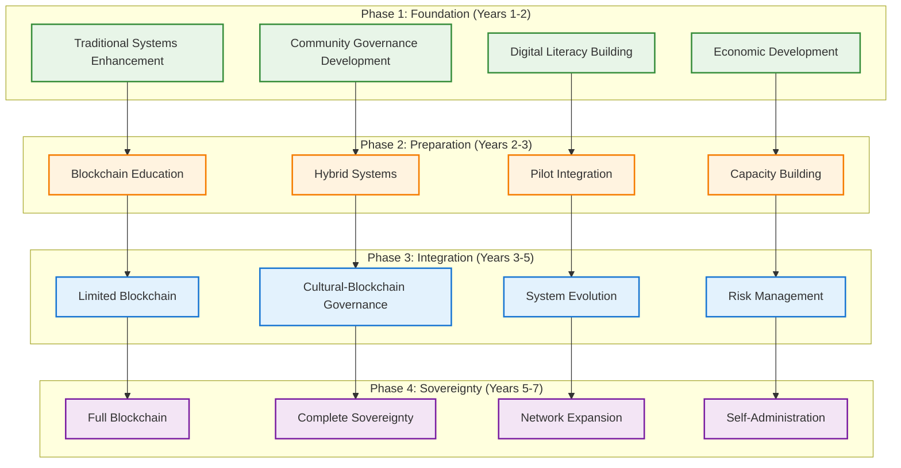

# Blockchain Integration Solutions & Traditional-to-Blockchain Roadmap
## Comprehensive Framework for Overcoming Adoption Barriers and Gradual Implementation

### Executive Summary: Systematic Solutions and Progressive Integration

This framework provides specific solutions to technical, cultural, and economic blockchain barriers while presenting a 4-phase roadmap that begins with traditional system improvements and gradually builds toward full blockchain sovereignty over 5-7 years.



---

## 1. Solutions to Technical Complexity Barriers

### Solution 1: Community-Managed Key Security Framework

**Multi-Layer Key Management System**:
```yaml
Social Recovery Key Management:
  Community Key Guardians:
    - 5-7 trusted community members hold key shares
    - No single person can access funds alone
    - 3 of 5 signatures required for any transaction
    - Key guardians elected democratically, serve 2-year terms
  
  Physical Security Integration:
    - Hardware wallets stored in community safe
    - Traditional lock and key backup system
    - Multiple physical locations for redundancy
    - Community ceremonies for key generation and storage
  
  Cultural Integration:
    - Key guardians include traditional authorities (elder, pastor, etc.)
    - Key management integrated with existing community trust structures
    - Spiritual blessing ceremonies for new keys
    - Traditional council oversight of key guardian selection
```

**Practical Implementation Example**:
```javascript
// Community Multi-Signature Wallet with Cultural Integration
contract CommunityEducationWallet {
    address[] public keyGuardians;
    mapping(address => bool) public isGuardian;
    mapping(address => string) public guardianRole; // "ELDER", "PASTOR", "TEACHER", "PARENT", "STUDENT"
    
    uint256 public constant REQUIRED_SIGNATURES = 3;
    uint256 public constant TOTAL_GUARDIANS = 5;
    
    struct Transaction {
        address to;
        uint256 amount;
        string purpose;
        string culturalApproval; // "ELDER_APPROVED", "PASTOR_BLESSED", etc.
        uint256 signatures;
        mapping(address => bool) signed;
        bool executed;
    }
    
    // Key guardians must include traditional authorities
    function electKeyGuardians(
        address elder,
        address pastor,
        address teacher,
        address parent,
        address student
    ) external onlyDuringElection {
        require(hasCommunityApproval(), "Community must approve guardians");
        
        keyGuardians = [elder, pastor, teacher, parent, student];
        guardianRole[elder] = "ELDER";
        guardianRole[pastor] = "PASTOR";
        guardianRole[teacher] = "TEACHER";
        guardianRole[parent] = "PARENT";
        guardianRole[student] = "STUDENT";
        
        emit GuardiansElected(keyGuardians);
    }
    
    // All transactions require diverse stakeholder approval
    function proposeTransaction(
        address to,
        uint256 amount,
        string memory purpose
    ) external onlyGuardian {
        require(amount <= getApprovedBudget(purpose), "Exceeds budget");
        
        // Create transaction requiring cultural and technical approval
        transactions[nextTxId] = Transaction({
            to: to,
            amount: amount,
            purpose: purpose,
            culturalApproval: "PENDING",
            signatures: 0,
            executed: false
        });
        
        emit TransactionProposed(nextTxId, to, amount, purpose);
    }
}
```

### Solution 2: Simplified User Interfaces with Cultural Design

**Voice-First, Culturally Appropriate Interfaces**:
```yaml
User Experience Solutions:
  Voice-Based Interaction:
    - All blockchain operations available via voice commands in Kreyòl
    - Community members speak requests, system translates to blockchain
    - Audio feedback and confirmation for all operations
    - No typing or complex interface navigation required
  
  Cultural Interface Design:
    - Visual metaphors from Haitian culture (village, family, church, market)
    - Blockchain wallet = "Community Treasure Chest"
    - Smart contracts = "Community Agreements"
    - Voting tokens = "Community Voice Stones"
    - Transaction fees = "Community Contribution"
  
  Simplified Operations:
    - "I want to vote yes on the new teacher proposal"
    - "Show me how much money our school has"
    - "Send $100 to buy textbooks from the approved supplier"
    - "Who voted for the playground construction?"
```

**Community Interface Prototype**:
```html
<!-- Voice-First Community Blockchain Interface -->
<div class="community-interface" lang="ht">
  <div class="voice-control">
    <button onclick="startVoiceCommand()" class="voice-button">
      🎤 Pale ak Kominote a (Speak to the Community)
    </button>
    <div class="voice-feedback">
      <p id="voice-status">Tande w... (Listening...)</p>
    </div>
  </div>
  
  <div class="community-dashboard">
    <div class="treasure-chest">
      <h3>🏛️ Kès Trezò Kominote a (Community Treasure Chest)</h3>
      <p class="balance">$25,430 nan kont lekòl la</p>
    </div>
    
    <div class="community-voice">
      <h3>🗳️ Vwa Kominote a (Community Voice)</h3>
      <button onclick="speakVote('Nouvo pwofesè matemètik')">
        Kominote a vle nouvo pwofesè matemètik? (Vote for new math teacher?)
      </button>
    </div>
    
    <div class="community-agreements">
      <h3>📜 Akò Kominote yo (Community Agreements)</h3>
      <p>Pwojè nouvo bibliyotèk - 70% akseptè</p>
    </div>
  </div>
</div>

<script>
function startVoiceCommand() {
  // Voice recognition in Kreyòl
  const recognition = new webkitSpeechRecognition();
  recognition.lang = 'ht-HT'; // Haitian Creole
  
  recognition.onresult = function(event) {
    const command = event.results[0][0].transcript;
    processHaitianCommand(command);
  };
  
  recognition.start();
}

function processHaitianCommand(command) {
  // Translate Kreyòl voice commands to blockchain operations
  if (command.includes("vote")) {
    executeVote(command);
  } else if (command.includes("kont") || command.includes("money")) {
    showCommunityBalance();
  } else if (command.includes("voye" || command.includes("send"))) {
    initiatePayment(command);
  }
}
</script>
```

### Solution 3: Community Technical Cooperative

**Distributed Technical Support Network**:
```yaml
Community Tech Cooperative Structure:
  Regional Technical Hubs:
    - 1 master technician supports 10-15 communities
    - Local apprentices in each community for daily support
    - Monthly regional training and knowledge sharing
    - Emergency remote support via satellite communication
  
  Apprenticeship Pipeline:
    - Young community members trained as blockchain apprentices
    - 2-year apprenticeship with master technician
    - Gradual progression from basic support to advanced administration
    - Community pays for apprentice education, apprentice serves community
  
  Mutual Aid Network:
    - Communities share technical expertise and resources
    - Crisis response teams for major technical emergencies
    - Shared funding for expensive equipment and training
    - Peer support networks for troubleshooting
```

---

## 2. Solutions to Traditional Governance Conflicts

### Solution 1: Hybrid Governance Integration

**Traditional Authority + Blockchain Democracy Framework**:
```yaml
Integrated Governance Model:
  Elder Council Oversight:
    - Elders have veto power over any blockchain decisions affecting cultural values
    - Traditional consensus process precedes blockchain voting
    - Elder blessing required for major smart contract deployments
    - Cultural appropriateness review by elder council mandatory
  
  Religious Leader Integration:
    - Pastor/priest serves as community moral guardian in blockchain governance
    - Religious blessing ceremonies for major technological changes
    - Spiritual guidance incorporated into smart contract design
    - Religious leader can pause blockchain operations for moral concerns
  
  Coumbite Integration:
    - Traditional work groups collectively hold blockchain voting tokens
    - Group decisions made through traditional consensus, then recorded on blockchain
    - Individual wallets combined into group wallets managed collectively
    - Blockchain enforces collective decisions rather than individual choices
```

**Cultural Governance Smart Contract**:
```solidity
contract CulturalGovernance {
    address public elderCouncil;
    address public religiousLeader;
    mapping(address => address) public coumbiteRepresentative;
    
    enum DecisionType {
        TECHNICAL,    // Technical decisions can proceed with blockchain voting
        CULTURAL,     // Cultural decisions require elder council approval
        MORAL,        // Moral decisions require religious leader approval
        COMMUNITY     // Community decisions require traditional consensus first
    }
    
    struct Proposal {
        string description;
        DecisionType decisionType;
        bool elderApproval;
        bool religiousApproval;
        bool traditionalConsensus;
        uint256 blockchainVotes;
        bool executed;
    }
    
    mapping(uint256 => Proposal) public proposals;
    
    // All proposals must be categorized and approved by appropriate traditional authority
    function createProposal(
        string memory description,
        DecisionType decisionType
    ) external {
        proposals[nextProposalId] = Proposal({
            description: description,
            decisionType: decisionType,
            elderApproval: false,
            religiousApproval: false,
            traditionalConsensus: false,
            blockchainVotes: 0,
            executed: false
        });
        
        // Route to appropriate traditional authority first
        if (decisionType == DecisionType.CULTURAL) {
            requestElderApproval(nextProposalId);
        } else if (decisionType == DecisionType.MORAL) {
            requestReligiousApproval(nextProposalId);
        } else if (decisionType == DecisionType.COMMUNITY) {
            requestTraditionalConsensus(nextProposalId);
        }
        
        nextProposalId++;
    }
    
    // Traditional consensus must occur before blockchain voting
    function confirmTraditionalConsensus(
        uint256 proposalId,
        string memory consensusEvidence
    ) external onlyElderCouncil {
        require(proposals[proposalId].decisionType == DecisionType.COMMUNITY, "Wrong type");
        
        proposals[proposalId].traditionalConsensus = true;
        
        // Only after traditional consensus can blockchain voting begin
        enableBlockchainVoting(proposalId);
        
        emit TraditionalConsensusReached(proposalId, consensusEvidence);
    }
    
    // Elders can veto any decision that conflicts with cultural values
    function exerciseElderVeto(
        uint256 proposalId,
        string memory culturalReason
    ) external onlyElderCouncil {
        proposals[proposalId].executed = false;
        
        emit ElderVetoExercised(proposalId, culturalReason);
    }
}
```

### Solution 2: Cultural Blockchain Metaphors and Education

**Translating Blockchain Concepts into Haitian Cultural Framework**:
```yaml
Cultural Translation Framework:
  Blockchain = "Liv Kominote a" (Community Book)
    - Permanent record of community decisions and history
    - Cannot be erased or changed, like family genealogy
    - Everyone can read it, but only community can write in it
    - Ancestors' wisdom preserved for future generations
  
  Smart Contracts = "Sèman Kominote yo" (Community Oaths)
    - Sacred promises that enforce themselves
    - Like traditional marriage or godparent commitments
    - Cannot be broken once made in front of community
    - Spiritual and social consequences for violation
  
  Tokens = "Wòch Vwa" (Voice Stones)
    - Traditional stones used in village councils for speaking rights
    - Each person gets their voice stones based on community participation
    - More participation = more voice in decisions
    - Stones can be shared within families or coumbites
  
  Mining/Validation = "Gadyen Liv la" (Guardians of the Book)
    - Community members chosen to protect and maintain the record
    - Like traditional griots or storytellers who preserve history
    - Responsibility passed down through generations
    - Honored role requiring wisdom and integrity
```

### Solution 3: Ceremonial Integration and Spiritual Blessing

**Traditional Ceremony Integration with Blockchain Operations**:
```yaml
Spiritual Blockchain Integration:
  Key Generation Ceremony:
    - Traditional blessing ceremony when creating new blockchain keys
    - Elders and religious leaders bless the community's digital identity
    - Spiritual protection requested for community assets
    - Keys treated as sacred objects requiring ceremonial respect
  
  Decision Implementation Ritual:
    - Major blockchain decisions celebrated with traditional ceremonies
    - Community feast when important votes are completed
    - Ancestral consultation before major smart contract deployment
    - Spiritual gratitude for technology serving community values
  
  Crisis Response Protocol:
    - Traditional healing and reconciliation if blockchain conflicts arise
    - Elder mediation before technical dispute resolution
    - Community purification ceremonies if blockchain systems are compromised
    - Spiritual renewal after major technical challenges
```

---

## 3. Solutions to Economic Cost Barriers

### Solution 1: Progressive Investment and Revenue Generation

**Phased Economic Development Model**:
```yaml
Revenue-Generating Implementation:
  Year 1: Traditional Systems + Basic Revenue ($10,000 investment)
    - Simple community platforms for local business directory
    - Adult education programs generating $5,000-10,000 annually
    - Community event space rental: $3,000-6,000 annually
    - Basic digital services for local businesses: $2,000-5,000 annually
    - Total revenue: $10,000-21,000 annually
  
  Year 2: Hybrid Systems + Expanded Services ($25,000 investment)
    - Limited blockchain pilot with educational content licensing
    - Technical training programs for other communities: $10,000-15,000
    - Educational consulting services: $5,000-10,000
    - Diaspora connection platform: $8,000-12,000
    - Total revenue: $23,000-37,000 annually
  
  Year 3: Full Blockchain + Service Export ($50,000 investment)
    - Educational blockchain services to other institutions
    - International educational partnerships: $20,000-30,000
    - Cultural preservation licensing: $5,000-10,000
    - Technical support services: $15,000-25,000
    - Total revenue: $40,000-65,000 annually
  
  Economic Sustainability Timeline:
    - Year 1: 50% cost recovery
    - Year 2: 75% cost recovery  
    - Year 3: 120% cost recovery (profitable)
    - Year 4+: 150%+ revenue supporting expansion
```

### Solution 2: Community Investment Cooperative

**Distributed Risk and Ownership Model**:
```yaml
Community Ownership Structure:
  Educational Investment Cooperative:
    - 100+ families contribute $50-200 annually
    - Diaspora family contributions: $500-2,000 annually
    - Local business sponsorship: $1,000-5,000 annually
    - Community labor contribution valued at $20,000-40,000 annually
  
  Shared Infrastructure Costs:
    - 10 communities share $100,000 infrastructure cost = $10,000 per community
    - Technical support shared across network reduces individual costs by 70%
    - Equipment purchases through cooperative buying power: 30-50% savings
    - Energy costs shared through community solar installations
  
  Risk Distribution:
    - No single community bears full financial risk
    - Insurance fund shared across all participating communities
    - Mutual aid during technical crises or natural disasters
    - Democratic decision-making on all major investments
```

### Solution 3: Grant Funding and Partnership Strategy

**Sustainable Funding Pipeline**:
```yaml
Grant and Partnership Development:
  Phase 1: Foundation Grants ($100,000-300,000)
    - Educational technology grants for pilot implementation
    - Cultural preservation grants for traditional knowledge integration
    - Democracy and governance grants for community empowerment
    - Diaspora foundation grants for homeland development
  
  Phase 2: Government Partnerships ($200,000-500,000)
    - Ministry of Education pilot program funding
    - USAID digital development initiatives
    - European Union digital sovereignty programs
    - Canadian development assistance programs
  
  Phase 3: International Partnerships ($300,000-1,000,000)
    - University research partnerships for educational innovation
    - UNESCO cultural preservation initiatives
    - World Bank digital transformation programs
    - Inter-American Development Bank education technology funding
  
  Sustainability Strategy:
    - Grant funding covers initial investment and capacity building
    - Revenue generation achieves operational sustainability
    - Community ownership ensures long-term viability
    - International partnerships provide ongoing technical support
```

---

## 4. Comprehensive Implementation Roadmap

### Phase 1: Foundation Building (Years 1-2)

**Traditional System Enhancement with Blockchain Preparation**:

```yaml
Year 1: Community Foundation and Digital Literacy
  Months 1-3: Community Engagement and Planning
    - Democratic assemblies to discuss educational sovereignty goals
    - Traditional authority consultation and blessing for technology integration
    - Community needs assessment and priority setting
    - Formation of educational governance cooperative
  
  Months 4-6: Basic Digital Infrastructure
    - Simple database systems for student records and administration
    - Community website and communication platforms
    - Basic accounting and budget management systems
    - Digital literacy training for all community members
  
  Months 7-9: Democratic Governance Development
    - Community assembly structures for educational decision-making
    - Parent, teacher, and student representation systems
    - Transparent budget processes and community oversight
    - Conflict resolution and consensus-building procedures
  
  Months 10-12: Economic Foundation Building
    - Revenue generation through adult education and community services
    - Cooperative business development integrated with education
    - Diaspora connection and communication platforms
    - Financial sustainability planning and implementation
  
  Year 1 Investment: $15,000-25,000
  Year 1 Revenue Target: $8,000-15,000
  Success Metrics:
    - 90% community satisfaction with governance processes
    - 75% adult participation in digital literacy programs
    - 50% cost recovery through revenue generation
    - Democratic decision-making functioning smoothly
```

```yaml
Year 2: Advanced Systems and Blockchain Education
  Months 13-15: Enhanced Digital Systems
    - Advanced student information systems with data portability
    - Cross-institutional communication and resource sharing
    - Financial management systems with transparency features
    - Quality assurance and educational outcome tracking
  
  Months 16-18: Blockchain Education and Preparation
    - Community blockchain literacy programs (100+ participants)
    - Technical training for potential blockchain administrators
    - Cultural integration workshops for blockchain governance
    - Risk assessment and community readiness evaluation
  
  Months 19-21: Pilot Blockchain Applications
    - Simple blockchain voting for non-critical decisions
    - Educational credential storage on blockchain (pilot)
    - Community currency for local educational services
    - Cross-institutional academic record sharing (blockchain-backed)
  
  Months 22-24: Integration Assessment and Planning
    - Community evaluation of blockchain pilot programs
    - Traditional authority assessment of cultural compatibility
    - Economic analysis of blockchain implementation costs and benefits
    - Democratic decision on full blockchain implementation
  
  Year 2 Investment: $25,000-40,000
  Year 2 Revenue Target: $18,000-30,000
  Success Metrics:
    - 80% community comfort with blockchain concepts
    - Successful pilot blockchain applications
    - 75% cost recovery through expanded services
    - Community consensus on blockchain adoption path
```

### Phase 2: Hybrid Integration (Years 2-3)

**Limited Blockchain with Traditional System Backup**:

```yaml
Year 3: Selective Blockchain Implementation
  Months 25-27: Infrastructure Development
    - Community-owned blockchain nodes setup
    - Solar power systems for energy independence
    - Security protocols and community key management
    - Technical support network establishment
  
  Months 28-30: Governance System Integration
    - Hybrid traditional-blockchain governance implementation
    - Elder council and religious leader integration protocols
    - Cultural safeguards and veto mechanisms
    - Democratic oversight of blockchain operations
  
  Months 31-33: Educational System Migration
    - Student records gradual migration to blockchain
    - Cross-institutional credential verification system
    - Educational content preservation and licensing
    - Teacher and student training on blockchain systems
  
  Months 34-36: Economic Integration
    - Community token economy for educational services
    - Diaspora direct investment through blockchain platforms
    - Educational service export to other institutions
    - Revenue sharing and cooperative profit distribution
  
  Year 3 Investment: $50,000-75,000
  Year 3 Revenue Target: $35,000-55,000
  Success Metrics:
    - Blockchain systems operating smoothly alongside traditional systems
    - Community maintaining democratic control over technology
    - Cultural integration successful without traditional authority conflicts
    - Economic sustainability approaching 90% cost recovery
```

### Phase 3: Full Integration (Years 4-5)

**Complete Blockchain Implementation with Cultural Safeguards**:

```yaml
Years 4-5: Comprehensive Blockchain Educational Sovereignty
  Educational System Full Migration:
    - All student records and credentials on community-controlled blockchain
    - Cross-institutional federation and resource sharing
    - International credential recognition and portability
    - Educational content creation and global licensing
  
  Governance System Maturation:
    - Community-controlled democratic governance via blockchain
    - Traditional authority integration fully operational
    - Cultural preservation and enhancement through technology
    - Conflict resolution and consensus-building mechanisms
  
  Economic System Development:
    - Community token economy supporting all educational activities
    - Diaspora investment and economic integration
    - Educational services export generating significant revenue
    - Cooperative business development and job creation
  
  Network Expansion:
    - 10-15 institutions in federated blockchain network
    - Regional educational sovereignty and cooperation
    - International partnerships and recognition
    - Technical innovation and development leadership
  
  Years 4-5 Investment: $75,000-125,000
  Years 4-5 Revenue Target: $65,000-120,000 annually
  Success Metrics:
    - Complete educational sovereignty achieved
    - Cultural values preserved and enhanced through technology
    - Economic sustainability exceeding 100% cost recovery
    - Community leadership in educational blockchain innovation
```

### Phase 4: Advanced Sovereignty (Years 5-7)

**Regional Leadership and Innovation Hub**:

```yaml
Years 5-7: Educational Blockchain Innovation Center
  Technical Leadership:
    - Community becomes regional blockchain education hub
    - Technical training and consulting services for other institutions
    - Blockchain educational software development and licensing
    - International partnerships and technology transfer
  
  Cultural Sovereignty:
    - Haitian educational values and methods exported globally
    - Traditional knowledge preservation and monetization
    - Cultural diplomacy through educational partnerships
    - Intergenerational knowledge transfer systems fully operational
  
  Economic Independence:
    - Educational blockchain services generating $200,000+ annually
    - Community economic development through education technology
    - Diaspora investment and business development
    - Regional economic leadership and job creation
  
  Network Expansion:
    - 25+ institutions in Caribbean educational blockchain network
    - International recognition and partnership agreements
    - Policy influence and advocacy for educational sovereignty
    - Next-generation educational innovation and development
  
  Years 5-7 Investment: $100,000-200,000
  Years 5-7 Revenue Target: $150,000-300,000 annually
  Success Metrics:
    - Regional leadership in educational blockchain innovation
    - Complete financial independence and significant profit generation
    - Cultural sovereignty and global influence
    - Next-generation educational model for developing nations
```

---

## 5. Risk Mitigation and Success Factors

### Comprehensive Risk Management Framework

**Technical Risk Mitigation**:
```yaml
Fallback and Recovery Systems:
  Parallel Traditional Systems:
    - Traditional systems maintained throughout implementation
    - Easy rollback mechanisms if blockchain systems fail
    - Data backup and recovery protocols
    - Community can function fully without blockchain if necessary
  
  Gradual Transition:
    - No critical functions depend solely on blockchain until Year 4
    - Community demonstrates blockchain competency before full implementation
    - Multiple exit strategies available at each phase
    - Democratic community approval required for each advancement phase
  
  Technical Support Network:
    - Regional technical cooperative for shared expertise
    - Emergency response protocols for major technical crises
    - International partnerships for advanced technical support
    - Community ownership of all technical knowledge and systems
```

**Cultural Risk Mitigation**:
```yaml
Traditional Authority Integration:
  Continuous Cultural Assessment:
    - Regular community assemblies to evaluate cultural compatibility
    - Elder council and religious leader ongoing consultation
    - Traditional dispute resolution mechanisms maintained
    - Cultural values embedded in all technological decisions
  
  Spiritual and Ceremonial Integration:
    - Traditional blessing ceremonies for major technological changes
    - Spiritual guidance sought for blockchain governance decisions
    - Community healing and reconciliation processes for conflicts
    - Ancestral wisdom consultation integrated into decision-making
```

**Economic Risk Mitigation**:
```yaml
Financial Sustainability Protection:
  Conservative Investment Approach:
    - Revenue generation precedes major investment
    - Community can afford to lose any invested funds without catastrophe
    - Multiple income streams reduce dependence on single revenue source
    - Emergency funds maintained for crisis response
  
  Democratic Financial Control:
    - Community maintains complete control over all investments
    - Transparent budget processes and community oversight
    - Democratic approval required for all major expenditures
    - Profit sharing and community benefit prioritized over technology advancement
```

---

## 6. Success Indicators and Decision Points

### Key Decision Gates for Advancement

**Phase 1 to Phase 2 Advancement Criteria**:
```yaml
Required Achievements:
  Technical Readiness:
    - 90% community digital literacy achievement
    - 5+ community members capable of basic blockchain administration
    - Reliable internet and power infrastructure operational
    - Democratic governance systems functioning smoothly
  
  Cultural Integration:
    - Traditional authorities explicitly endorse blockchain integration
    - Community consensus (80%+) on blockchain adoption
    - Cultural appropriateness confirmed by elder councils
    - No significant community divisions over technology adoption
  
  Economic Foundation:
    - 75% cost recovery through traditional system revenue generation
    - Community can afford blockchain investment without financial hardship
    - Emergency funds available for crisis response
    - Sustainable income streams established and growing
```

**Phase 2 to Phase 3 Advancement Criteria**:
```yaml
Required Achievements:
  Operational Competency:
    - Blockchain pilot systems operating successfully for 12+ months
    - Community demonstrates ability to manage complex technical systems
    - Cultural integration successful without traditional authority conflicts
    - No major security incidents or financial losses
  
  Community Acceptance:
    - 85%+ community satisfaction with blockchain governance
    - Traditional and blockchain systems working harmoniously
    - Community leadership in blockchain operations
    - Demonstrated benefits outweighing costs and complexity
  
  Economic Viability:
    - 90%+ cost recovery through blockchain-enhanced services
    - Revenue growth trajectory supporting full implementation
    - Community investment capacity for final phase
    - Economic benefits clearly demonstrated to community
```

### Continuous Assessment Framework

**Monthly Community Assemblies**:
- Democratic evaluation of technology integration progress
- Community feedback on blockchain systems and cultural compatibility
- Financial transparency and budget review
- Adjustment of implementation timeline based on community readiness

**Quarterly Technical Assessment**:
- Security audits and system performance evaluation
- Community technical capacity assessment and training needs
- Risk assessment and mitigation strategy updates
- Partnership and support network evaluation

**Annual Strategic Review**:
- Community consensus on advancement to next phase
- Traditional authority consultation and cultural integration assessment
- Economic sustainability analysis and future planning
- Regional network development and expansion opportunities

---

## Conclusion: Balanced Path to Educational Blockchain Sovereignty

### Realistic Timeline and Expectations

This 5-7 year roadmap provides a **practical, community-controlled path** from traditional educational systems to full blockchain sovereignty while:

1. **Respecting cultural values** and traditional authority structures
2. **Building genuine community capacity** before implementing complex systems
3. **Ensuring economic sustainability** at each phase
4. **Maintaining democratic control** over all technological decisions
5. **Providing multiple exit strategies** if blockchain proves inappropriate

### Critical Success Factors

**The roadmap succeeds IF:**
- Community maintains democratic consensus throughout implementation
- Traditional authorities remain supportive and integrated
- Economic sustainability is achieved at each phase
- Technical capacity building is successful and culturally appropriate
- Benefits clearly outweigh costs and complexity at each stage

### Alternative Path Recognition

**The roadmap allows for alternative outcomes:**
- Community may achieve 90% of educational sovereignty goals through Phase 1-2 without full blockchain
- Traditional system enhancements may prove sufficient for community needs
- Cultural integration challenges may require modified implementation approach
- Economic constraints may necessitate extended timeline or scaled implementation

**This roadmap ensures that communities can achieve educational sovereignty and cultural preservation whether or not they ultimately adopt full blockchain technology, while providing a clear path for those communities ready and able to pursue complete blockchain integration.**

The key innovation is **putting community readiness, cultural compatibility, and economic sustainability first**, with blockchain as a tool that serves community goals rather than a technological imperative that communities must adopt regardless of readiness or appropriateness.