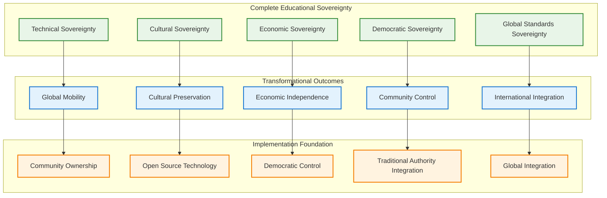

# Complete Educational Sovereignty Framework: Comprehensive Implementation Guide
## Federated Community Platform for Haiti's Educational Transformation Through Global Standards Integration, Blockchain Technology, and Community-Controlled Infrastructure

---

# Table of Contents

1. [Executive Summary & Vision](#1-executive-summary--vision)
2. [Crisis Context & Problem Analysis](#2-crisis-context--problem-analysis)
3. [Complete Solution Architecture](#3-complete-solution-architecture)
4. [Universal Global Standards Integration](#4-universal-global-standards-integration)
5. [Comprehensive Technical Infrastructure](#5-comprehensive-technical-infrastructure)
6. [Complete 12-Platform Federation](#6-complete-12-platform-federation)
7. [Blockchain Integration & Digital Sovereignty](#7-blockchain-integration--digital-sovereignty)
8. [Emerging Technology Modules](#8-emerging-technology-modules)
9. [Cultural Integration & Community Sovereignty](#9-cultural-integration--community-sovereignty)
10. [Economic Models & Sustainability](#10-economic-models--sustainability)
11. [Risk Assessment & Mitigation Strategies](#11-risk-assessment--mitigation-strategies)
12. [Implementation Roadmap](#12-implementation-roadmap)
13. [Governance & Community Ownership](#13-governance--community-ownership)
14. [Success Metrics & Impact Assessment](#14-success-metrics--impact-assessment)
15. [Conclusion & Call to Action](#15-conclusion--call-to-action)

---

## 1. Executive Summary & Vision

### 1.1 Transformational Vision

The **Federated Community Platform (FCP) Educational Sovereignty Framework** represents the world's most comprehensive approach to achieving complete educational independence through community-controlled, open-source technology that integrates with every major global academic standard while preserving and enhancing Haitian cultural identity.

This framework enables Haitian educational institutions to:
- **Achieve universal global mobility** - students can transfer credits to ANY university worldwide
- **Maintain complete cultural sovereignty** - traditional knowledge and authority structures respected and preserved
- **Generate sustainable economic independence** - through diversified revenue streams and cooperative ownership
- **Build technical sovereignty** - complete community ownership and control of all educational technology
- **Create democratic governance** - traditional authorities integrated with modern democratic participation

### 1.2 Core Innovation: Universal Integration Without Compromise

Unlike traditional approaches that force communities to choose between global competitiveness and cultural preservation, this framework demonstrates that these goals are not only compatible but mutually reinforcing when implemented through:

- **Community-controlled technology infrastructure** owned and operated by educational cooperatives
- **Universal global standards integration** enabling recognition by ANY academic institution or employer worldwide
- **Cultural preservation and enhancement** through digital documentation and traditional authority integration
- **Economic sustainability** through token economies and cooperative business models
- **Democratic governance** respecting traditional wisdom while enabling modern participatory democracy

### 1.3 Revolutionary Capabilities



---

## 2. Crisis Context & Problem Analysis

### 2.1 Unprecedented Multisectoral Collapse

Haiti faces its most catastrophic humanitarian crisis since the 2010 earthquake, with **unprecedented multisectoral collapse across security, governance, economic, and social domains**:

**Educational System Devastation**:
- **Hundreds of schools closed** due to gang violence and security constraints
- **Educational institutions operating as isolated islands** with unsustainable duplication of resources
- **No pathway for global credential recognition** limiting student mobility and opportunities
- **Cultural knowledge systems threatened** by displacement and institutional breakdown
- **Technology dependence on external vendors** creating vulnerability and limiting innovation

**Security Crisis Impact on Education**:
- **5,626 deaths from gang violence in 2024** (53% increase from previous quarter)
- **Gangs controlling 90% of Port-au-Prince** with expansion into previously peaceful regions
- **1.04 million internally displaced persons** disrupting educational continuity
- **Educational institutions isolated** by violence, unable to share resources or coordinate

**Economic Disintegration Affecting Education**:
- **GDP contracted 4.2% in 2024** (sixth consecutive year of decline)
- **27.3% annual inflation with 40% food inflation** making education increasingly unaffordable
- **Tax revenue collapsed to 5.2% of GDP** limiting public education funding
- **Educational institutions struggling financially** with high technology and infrastructure costs

**Infrastructure Vulnerabilities**:
- **Internet penetration at 38.9%** (lowest in Latin America/Caribbean)
- **Telecommunications infrastructure overloaded** (Digicel serving 12.9M on 5M capacity)
- **Electricity available only 4-6 hours daily** limiting educational technology usage
- **Educational technology dependent on expensive external vendors** creating unsustainable costs

### 2.2 Traditional Aid Failures

Sectoral approaches addressing education, security, governance, and economics separately have **proven catastrophically insufficient** because they:

1. **Impose external solutions** rather than empowering communities with tools for self-determination
2. **Create dependency** rather than building sustainable local capacity  
3. **Fragment responsibility** across disconnected domains instead of addressing interconnected challenges
4. **Centralize control** in external actors rather than democratizing governance through community ownership
5. **Ignore cultural knowledge systems** rather than preserving and enhancing traditional wisdom
6. **Limit global mobility** rather than enabling universal educational portability

### 2.3 Convergent Opportunity

Despite profound challenges, unprecedented opportunities exist through convergence of:
- **$1.4+ billion in identified aligned funding** from USAID, EU, World Bank, philanthropic organizations
- **Proven technical solutions** from comparable contexts (community networks, platform cooperatives)
- **Strong community organization structures** rooted in religious and cooperative networks
- **Global demand for educational innovation** and community-controlled technology solutions
- **Haitian diaspora networks** spanning every continent providing partnership opportunities

---

## 3. Complete Solution Architecture

### 3.1 Comprehensive Framework Overview

The **Federated Community Platform Educational Sovereignty Framework** creates an integrated system addressing all dimensions of educational sovereignty simultaneously:

```mermaid
flowchart TD
    subgraph "Physical Infrastructure Layer"
        MDC[Community Micro-DC]
        RDC[Rural Micro-DC]
        LRM[LibreRouter Mesh]
        OWF[OpenWiFi Access Points]
        IOT[IoT Sensor Networks]
        SOL[Solar Power Systems]
    end
    
    subgraph "Core Platform Stack"
        K3S[k3s Kubernetes]
        KNG[Kong API Gateway]
        APL[Apollo GraphQL Router]
        NTS[NATS JetStream]
        PG[PostgreSQL/MariaDB]
        CPH[Ceph Storage]
        VLT[HashiCorp Vault]
    end
    
    subgraph "Educational Microservices"
        MDL[Moodle LMS]
        OSS[OpenSIS]
        KHA[Koha Library]
        BBB[BigBlueButton]
        PTV[PeerTube]
        MST[Mastodon]
        ODO[Odoo EDU]
        KLB[Kolibri]
    end
    
    subgraph "Complete 12-Platform Federation"
        M[Mastodon]
        PT[PeerTube]
        PF[Pixelfed]
        L[Lemmy]
        WF[WriteFreely]
        FW[Funkwhale]
        MO[Mobilizon]
        BS[BookStack]
        BBB2[BigBlueButton]
        NC[Nextcloud]
        BW[BookWyrm]
        OC[Owncast]
    end
    
    subgraph "Universal Standards Engine"
        UCE[Universal Credential Engine]
        GSM[Global Standards Mapper]
        CCI[Cultural Competency Integration]
        AIE[AI Enhancement Engine]
        AFR[African Standards]
        ASN[Asian Standards]
        EUR[European Standards]
        AMR[American Standards]
        LAT[Latin American Standards]
        MEA[Middle Eastern Standards]
        OCE[Oceanic Standards]
    end
    
    subgraph "Blockchain & Token Economy"
        BC[Blockchain Infrastructure]
        SKL[SKILL Tokens]
        SPC[SPACE Tokens]
        COM[COMM Tokens]
        GOV[GOV Tokens]
        CRD[Credential Wallets]
        DAO[Educational DAO]
    end
    
    subgraph "Emerging Technology Modules"
        AI[AI Co-pilots]
        CW[Credential Wallets]
        FS[Federated Social]
        EN[Edge Networks]
        AR[AI Research Assistant]
        ML[Machine Learning]
    end
    
    subgraph "Cultural Integration"
        TK[Traditional Knowledge]
        EW[Elder Wisdom]
        CA[Cultural Archives]
        TA[Traditional Authorities]
        CC[Cultural Ceremonies]
        KL[Kreyòl Integration]
    end
    
    subgraph "Community Governance"
        CAS[Community Assemblies]
        DV[Democratic Voting]
        CR[Conflict Resolution]
        TP[Traditional Processes]
        CB[Consensus Building]
        CO[Community Ownership]
    end
    
    MDC --> K3S
    RDC --> K3S
    LRM --> K3S
    SOL --> K3S
    
    K3S --> KNG
    KNG --> APL
    APL --> NTS
    NTS --> PG
    PG --> CPH
    
    APL --> MDL
    APL --> OSS
    APL --> KHA
    APL --> BBB
    
    MDL --> M
    OSS --> PT
    KHA --> PF
    BBB --> L
    
    M --> UCE
    PT --> GSM
    PF --> CCI
    L --> AIE
    
    UCE --> AFR
    GSM --> ASN
    CCI --> EUR
    AIE --> AMR
    
    AFR --> BC
    ASN --> SKL
    EUR --> SPC
    AMR --> COM
    
    BC --> AI
    SKL --> CW
    SPC --> FS
    COM --> EN
    
    AI --> TK
    CW --> EW
    FS --> CA
    EN --> TA
    
    TK --> CAS
    EW --> DV
    CA --> CR
    TA --> TP
    
    classDef infrastructure fill:#e8f5e8,stroke:#388e3c,stroke-width:2px;
    classDef platform fill:#e3f2fd,stroke:#1976d2,stroke-width:2px;
    classDef education fill:#fff3e0,stroke:#f57c00,stroke-width:2px;
    classDef federation fill:#f3e5f5,stroke:#7b1fa2,stroke-width:2px;
    classDef standards fill:#fce4ec,stroke:#c2185b,stroke-width:2px;
    classDef blockchain fill:#e0f2f1,stroke:#00695c,stroke-width:2px;
    classDef emerging fill:#fff8e1,stroke:#ff8f00,stroke-width:2px;
    classDef cultural fill:#f1f8e9,stroke:#33691e,stroke-width:2px;
    classDef governance fill:#e8eaf6,stroke:#3f51b5,stroke-width:2px;
    
    class MDC,RDC,LRM,OWF,IOT,SOL infrastructure;
    class K3S,KNG,APL,NTS,PG,CPH,VLT platform;
    class MDL,OSS,KHA,BBB,PTV,MST,ODO,KLB education;
    class M,PT,PF,L,WF,FW,MO,BS,BBB2,NC,BW,OC federation;
    class UCE,GSM,CCI,AIE,AFR,ASN,EUR,AMR,LAT,MEA,OCE standards;
    class BC,SKL,SPC,COM,GOV,CRD,DAO blockchain;
    class AI,CW,FS,EN,AR,ML emerging;
    class TK,EW,CA,TA,CC,KL cultural;
    class CAS,DV,CR,TP,CB,CO governance;
```



### 3.2 Revolutionary Integration Principles

**Community-Owned ✚ Open-Source ✚ Programmable ✚ Fully Interoperable**

Every component can be:
- **Flashed with open firmware** and completely customized by community technicians
- **Re-configured via REST/GraphQL/API** enabling infinite customization and adaptation
- **Forked and re-licensed** ensuring permanent community ownership and control
- **Swapped out without breaking the system** through strict interface contracts and federation protocols

### 3.3 Integrated Sovereignty Domains

**Technical Sovereignty**: Complete community ownership and operation of all educational technology infrastructure, from physical hardware to software applications, ensuring independence from external vendors and permanent control over technological development.

**Cultural Sovereignty**: Preservation and enhancement of Haitian cultural identity through digital platforms that prioritize Kreyòl language, traditional knowledge systems, elder wisdom, and cultural practices while enabling global engagement.

**Economic Sovereignty**: Sustainable financial independence through diversified revenue streams, cooperative ownership models, token economies, and international service provision while maintaining community control over all economic activities.

**Educational Sovereignty**: Complete control over educational content, standards, and processes while achieving universal global recognition and portability, enabling students to access opportunities anywhere while maintaining cultural grounding.

**Democratic Sovereignty**: Community-controlled governance integrating traditional Haitian authority structures with modern democratic participation, ensuring all technology serves community priorities and values.

---

## 4. Universal Global Standards Integration

### 4.1 Complete Global Academic Standards Framework

The framework integrates with **EVERY major academic and professional standard globally**, enabling seamless educational transfer to any institution worldwide:

#### 4.1.1 African Standards Integration

**Continental Frameworks**:
```yaml
African Union Continental Education Strategy (CESA 2016-2025):
  - African Continental Qualifications Framework (ACQF) compatibility
  - Pan-African University network participation
  - Regional Economic Communities integration (ECOWAS, EAC, SADC, COMESA)
  - African Development Bank Skills Development Programs
  - Ubuntu philosophy and community-centered learning recognition

South African Qualifications Authority (SAQA):
  - National Qualifications Framework (NQF) Level 1-10 mapping
  - Professional Bodies Integration (ECSA, SAICA, SAIE)
  - University admission standards (UCT, Wits, Stellenbosch)
  - Quality Council for Trades and Occupations certification

East African Community Standards:
  - East African Qualifications Framework for Higher Education
  - Inter-University Council for East Africa standards
  - Country-specific integration (Kenya KNQA, Tanzania TCU, Uganda NCHE)
  - Kiswahili language certification and regional integration

West African Standards:
  - ECOWAS Education Framework and WAEC certification
  - Nigeria: NUC standards, JAMB preparation, university pathways
  - Ghana: NAB accreditation, university admission standards
  - Senegal: UCAD integration, WAEMU certification

North African Integration:
  - Arab League Educational, Cultural and Scientific Organization
  - Egypt: Supreme Council of Universities, Al-Azhar certification
  - Morocco: ANEAQ standards, Hassan II University pathways
  - Tunisia: University quality assurance and accreditation
```

#### 4.1.2 Asian Standards Integration

**East Asian Systems**:
```yaml
Japanese Framework:
  - Ministry of Education (MEXT) standards and university admission
  - Japan Society for Engineering Education (JSEE) compatibility
  - Joint First Stage Examination preparation pathways
  - Japanese Language Proficiency Test certification
  - Traditional shokunin craft certification pathways

Korean Framework:
  - Korea National Qualifications Framework integration
  - College Scholastic Ability Test (CSAT/수능) preparation
  - Korea Accreditation Board for Engineering Education (ABEEK)
  - Korean Government Scholarship Program eligibility
  - K-MOOC credit transfer and recognition

Chinese Framework:
  - China National Framework of Qualifications integration
  - Gaokao preparation and equivalency pathways
  - China Scholarship Council program eligibility
  - Belt and Road Initiative skill development programs
  - Traditional Chinese knowledge system integration

Singapore Framework:
  - SkillsFuture Singapore credit and pathway integration
  - Workforce Skills Qualifications framework
  - Institute of Technical Education pathway compatibility
  - Digital economy skills and innovation competencies

ASEAN Regional Integration:
  - ASEAN Qualifications Reference Framework
  - ASEAN University Network credit transfer
  - Mutual Recognition Arrangements for professional services
  - Skills Recognition System integration
```

**South and Southeast Asian Systems**:
```yaml
Indian Framework:
  - All India Council for Technical Education (AICTE) compatibility
  - University Grants Commission (UGC) standards
  - National Assessment and Accreditation Council (NAAC) recognition
  - National Skill Development Corporation framework
  - Traditional Indian knowledge system integration

Southeast Asian Integration:
  - Malaysia: Malaysian Qualifications Framework integration
  - Thailand: Thai Qualifications Framework compatibility  
  - Vietnam: Vietnamese National Qualifications Framework
  - Indonesia: Indonesian National Qualifications Framework
  - Philippines: Philippine Qualifications Framework
```

#### 4.1.3 European Standards Integration

**European Union Framework**:
```yaml
European Qualifications Framework (EQF):
  - EQF Level 1-8 progression pathway mapping
  - European Blockchain Services Infrastructure (EBSI) compatibility
  - Europass Digital Credentials integration
  - European Credit Transfer and Accumulation System (ECTS)
  - Bologna Process higher education harmonization

Major European Countries:
  United Kingdom:
    - UK Qualifications Framework integration
    - Universities and Colleges Admissions Service (UCAS) compatibility
    - Quality Assurance Agency standards
    - Professional body recognition (Engineering Council, BCS)
  
  Germany:
    - German Qualifications Framework integration
    - University admission through Abitur equivalency
    - Dual education system vocational pathway integration
    - German Academic Exchange Service (DAAD) programs
  
  France:
    - French National Qualifications Framework
    - Baccalauréat preparation and university admission
    - Grande École admission standards
    - Campus France international student integration
  
  Nordic Countries:
    - Sweden: Swedish Qualifications Framework
    - Norway: Norwegian Qualifications Framework
    - Denmark: Danish Qualifications Framework
    - Finland: Finnish National Qualifications Framework
```

#### 4.1.4 North American Standards Integration

```yaml
United States Framework:
  - American Association of Collegiate Registrars (AACRAO) standards
  - Advanced Placement (AP) Program integration
  - SAT/ACT preparation and university admission
  - Regional accreditation body recognition
  - Professional licensing and certification pathways

Canadian Framework:
  - Canadian Degree Qualifications Framework
  - Provincial Quality Assurance frameworks
  - Canadian Association of Prior Learning Assessment recognition
  - Immigration Express Entry skill recognition
  - Indigenous knowledge system integration

Mexican Framework:
  - National Association of Universities and Higher Education
  - CENEVAL evaluation and certification
  - UNAM and IPN university standards
  - Technical education and professional development
```

#### 4.1.5 Latin American Standards Integration

```yaml
Regional Frameworks:
  Organization of American States (OAS):
    - Inter-American Committee on Education compatibility
    - Hemispheric Education Initiative participation
    - Inter-American Teacher Education Consortium standards
    - Organization of Ibero-American States integration

Major Country Systems:
  Brazil:
    - Brazilian Ministry of Education quality standards
    - ENEM preparation and university admission
    - CAPES recognition and graduate education
    - Federal university system integration
  
  Colombia:
    - National Accreditation Council standards
    - ICFES evaluation and university admission
    - SENA technical education certification
    - National University system integration
  
  Argentina:
    - National Commission for University Evaluation
    - University of Buenos Aires admission standards
    - National Technological Institute certification
    - MERCOSUR academic recognition
  
  Chile:
    - National Accreditation Commission standards
    - PSU university admission preparation
    - University of Chile and PUC pathways
    - Technical-professional education integration
```

#### 4.1.6 Middle Eastern Standards Integration

```yaml
Regional Frameworks:
  Arab League Education:
    - Arab League Educational, Cultural and Scientific Organization
    - Association of Arab Universities standards
    - Islamic Educational, Scientific and Cultural Organization
    - Gulf Cooperation Council education harmonization

Major Country Systems:
  United Arab Emirates:
    - Commission for Academic Accreditation standards
    - American University of Sharjah international recognition
    - Higher Colleges of Technology pathways
    - Dubai International Academic City integration
  
  Saudi Arabia:
    - Education and Training Evaluation Commission standards
    - King Saud University and KAUST admission
    - Saudi Electronic University distance learning
    - Vision 2030 skill development integration
  
  Qatar:
    - Qatar National Commission for Education
    - Qatar University and international branch campus standards
    - Qatar Foundation Education City integration
    - World Cup 2022 legacy education programs
  
  Turkey:
    - Council of Higher Education (YÖK) standards
    - YKS university entrance examination preparation
    - Technical university and vocational integration
    - European integration and Bologna Process
```

#### 4.1.7 Oceanic Standards Integration

```yaml
Australia and New Zealand:
  Australian Qualifications Framework (AQF):
    - AQF Level 1-10 comprehensive mapping
    - Tertiary Education Quality and Standards Agency recognition
    - Group of Eight Universities admission standards
    - Skills recognition and professional migration pathways
  
  New Zealand Qualifications Authority (NZQA):
    - NZQF Level 1-10 integration
    - Universities New Zealand admission standards
    - Qualifications Authority quality assurance
    - Professional body recognition and licensing

Pacific Island Integration:
  - Pacific Islands Universities Research Network
  - University of South Pacific regional campus system
  - Pacific Association of Technical and Vocational Education
  - Secretariat of Pacific Community development programs
```

#### 4.1.8 International Standards Integration

```yaml
Global Education Frameworks:
  International Baccalaureate (IB):
    - Primary Years Programme (PYP) curriculum alignment
    - Middle Years Programme (MYP) assessment compatibility
    - Diploma Programme (DP) preparation and certification
    - Career-related Programme (CP) professional integration
  
  Cambridge International:
    - Cambridge Primary through A-Level preparation
    - International General Certificate of Secondary Education (IGCSE)
    - Cambridge Professional Development Qualifications
    - Cambridge English Language Assessment certification
  
  UNESCO Standards:
    - UNESCO Associated Schools Network membership
    - Education for Sustainable Development integration
    - Global Citizenship Education framework
    - Cultural diversity and multilingual education
  
  OECD Education:
    - Programme for International Student Assessment (PISA) alignment
    - Education at a Glance benchmarking
    - Skills for Social Progress framework
    - Future of Education and Skills 2030
```

### 4.2 Universal Credential Engine Implementation

#### 4.2.1 AI-Powered Global Standards Mapping

```javascript
// Universal Educational Credential System
class UniversalEducationalCredentialSystem {
    constructor() {
        this.globalStandards = {
            african: {
                continental: new AfricanUnionCESAFramework(),
                regional: {
                    sadc: new SADCQualificationsFramework(),
                    ecowas: new ECOWASEducationFramework(),
                    eac: new EACEducationFramework(),
                    comesa: new COMESAStandardsFramework()
                },
                countries: {
                    southAfrica: new SAQANationalFramework(),
                    nigeria: new NigerianEducationStandards(),
                    kenya: new KenyaNationalQualifications(),
                    ghana: new GhanaNationalAccreditation(),
                    egypt: new EgyptianHigherEducationFramework(),
                    morocco: new MoroccanQualityAssurance(),
                    ethiopia: new EthiopianHigherEducation(),
                    tunisia: new TunisianEducationFramework()
                }
            },
            asian: {
                regional: new ASEANQualificationsFramework(),
                countries: {
                    japan: new JapaneseEducationFramework(),
                    korea: new KoreanQualificationsFramework(),
                    china: new ChineseNationalQualifications(),
                    singapore: new SingaporeSkillsFramework(),
                    india: new IndianNationalFramework(),
                    malaysia: new MalaysianQualifications(),
                    thailand: new ThaiQualificationsFramework(),
                    vietnam: new VietnameseEducationStandards(),
                    indonesia: new IndonesianNationalQualifications(),
                    philippines: new PhilippineQualificationsFramework()
                }
            },
            european: {
                eu: new EuropeanQualificationsFramework(),
                countries: {
                    uk: new UKQualificationsFramework(),
                    germany: new GermanEducationFramework(),
                    france: new FrenchEducationStandards(),
                    italy: new ItalianQualificationsFramework(),
                    spain: new SpanishEducationFramework(),
                    netherlands: new DutchEducationStandards(),
                    sweden: new SwedishQualificationsFramework(),
                    norway: new NorwegianEducationFramework()
                }
            },
            northAmerican: {
                usa: new USEducationStandards(),
                canada: new CanadianEducationFramework(),
                mexico: new MexicanEducationStandards()
            },
            latinAmerican: {
                regional: new OASEducationFramework(),
                countries: {
                    brazil: new BrazilianEducationStandards(),
                    argentina: new ArgentinianQualifications(),
                    colombia: new ColombianEducationFramework(),
                    chile: new ChileanQualificationsFramework(),
                    peru: new PeruvianEducationStandards(),
                    venezuela: new VenezuelanQualifications()
                }
            },
            middleEastern: {
                regional: new ArabLeagueEducationFramework(),
                countries: {
                    uae: new UAEEducationStandards(),
                    saudiArabia: new SaudiEducationFramework(),
                    qatar: new QatarEducationStandards(),
                    turkey: new TurkishEducationStandards(),
                    israel: new IsraeliEducationFramework(),
                    iran: new IranianEducationStandards()
                }
            },
            oceanic: {
                australia: new AustralianQualificationsFramework(),
                newZealand: new NewZealandQualificationsAuthority(),
                pacific: new PacificIslandsEducationFramework()
            },
            international: {
                ib: new InternationalBaccalaureateFramework(),
                cambridge: new CambridgeInternationalFramework(),
                ap: new AdvancedPlacementFramework(),
                unesco: new UNESCOEducationFramework()
            },
            traditionalKnowledge: {
                haitian: new HaitianTraditionalKnowledgeFramework(),
                african: new AfricanTraditionalWisdomFramework(),
                caribbean: new CaribbeanTraditionalKnowledge(),
                indigenous: new IndigenousKnowledgeFramework()
            }
        };
        
        this.aiMapper = new AIStandardsMapper();
        this.culturalIntegrator = new CulturalKnowledgeIntegrator();
        this.qualityValidator = new GlobalQualityValidator();
    }
    
    async generateUniversalGlobalCredential(studentRecord, targetRegions = "all") {
        const universalCredential = {
            "@context": [
                "https://www.w3.org/2018/credentials/v1",
                "https://haiti.education/universal-global/v1",
                "https://standards.global/universal/v1"
            ],
            "type": ["VerifiableCredential", "UniversalGlobalEducationalCredential"],
            "issuer": studentRecord.institution.did,
            "issuanceDate": new Date().toISOString(),
            "credentialSubject": {
                "id": studentRecord.student.did,
                "globalMobilityProfile": await this.generateGlobalMobilityProfile(studentRecord),
                "universalAcademicMapping": await this.mapToAllGlobalStandards(studentRecord, targetRegions),
                "culturalCompetencyMatrix": await this.generateCulturalCompetencyMatrix(studentRecord),
                "professionalSkillsPortfolio": await this.mapProfessionalSkills(studentRecord),
                "languageCompetencyProfile": await this.assessGlobalLanguageSkills(studentRecord),
                "traditionalKnowledgeCredentials": await this.validateTraditionalKnowledge(studentRecord),
                "globalCitizenshipSkills": await this.assessGlobalCitizenshipCompetencies(studentRecord)
            }
        };
        
        // Generate comprehensive regional mappings
        if (targetRegions === "all" || targetRegions.includes("african")) {
            universalCredential.credentialSubject.africanStandardsMappings = {
                continentalFramework: await this.mapToCESAObjectives(studentRecord),
                regionalIntegration: await this.mapToAfricanRegionalStandards(studentRecord),
                countryMappings: await this.mapToAfricanCountryStandards(studentRecord),
                traditionalKnowledge: await this.assessAfricanTraditionalKnowledgeCompatibility(studentRecord)
            };
        }
        
        if (targetRegions === "all" || targetRegions.includes("asian")) {
            universalCredential.credentialSubject.asianStandardsMappings = {
                regionalFramework: await this.mapToASEANFramework(studentRecord),
                countryMappings: {
                    japan: await this.mapToJapaneseStandards(studentRecord),
                    korea: await this.mapToKoreanStandards(studentRecord),
                    china: await this.mapToChineseStandards(studentRecord),
                    singapore: await this.mapToSingaporeSkills(studentRecord),
                    india: await this.mapToIndianStandards(studentRecord)
                },
                languageCompetencies: await this.assessAsianLanguageSkills(studentRecord),
                culturalBridgeSkills: await this.assessAsianCulturalBridging(studentRecord)
            };
        }
        
        // Continue for all other regions...
        
        // Enhanced AI-powered optimal pathway recommendations
        universalCredential.credentialSubject.aiGeneratedPathways = 
            await this.aiMapper.generateOptimalGlobalPathways(studentRecord, targetRegions);
        
        // Cultural bridge competencies for global success
        universalCredential.credentialSubject.culturalBridgeSkills = {
            haitianCulturalMastery: await this.assessHaitianCulturalExpertise(studentRecord),
            crossCulturalAdaptability: await this.assessCrossCulturalSkills(studentRecord),
            globalCommunicationSkills: await this.assessGlobalCommunication(studentRecord),
            multiculturalLeadership: await this.assessMulticulturalLeadership(studentRecord),
            culturalDiplomacy: await this.assessCulturalDiplomacySkills(studentRecord)
        };
        
        return universalCredential;
    }
    
    async generateOptimalGlobalPathways(studentRecord, careerGoals, personalPreferences) {
        // AI-powered analysis of optimal global education and career pathways
        const pathwayAnalysis = await this.aiMapper.analyzeOptimalPathways({
            currentCredentials: studentRecord,
            careerAspirations: careerGoals,
            culturalPreferences: personalPreferences,
            globalOpportunities: await this.scanGlobalOpportunities(),
            haitianDiasporaNetworks: await this.mapDiasporaNetworks(),
            internationalPartnershipOpportunities: await this.identifyPartnershipOpportunities()
        });
        
        return {
            recommendedDestinations: pathwayAnalysis.topDestinations,
            preparationTimeline: pathwayAnalysis.preparationSteps,
            skillGapAnalysis: pathwayAnalysis.skillDevelopmentNeeds,
            culturalPreparation: pathwayAnalysis.culturalAdaptationPlan,
            networkingStrategy: pathwayAnalysis.professionalNetworkBuilding,
            financialPlanning: pathwayAnalysis.educationAndCareerFinancing,
            diasporaConnections: pathwayAnalysis.haitianNetworkIntegration,
            returnContributionPlan: pathwayAnalysis.homelandContributionStrategy
        };
    }
}
```

### 4.3 Cultural Competency as Global Asset

#### 4.3.1 Haitian Cultural Strengths for Global Markets

```yaml
Revolutionary Leadership Heritage:
  Historical Assets:
    - First successful slave revolution leadership experience
    - Anti-colonial struggle and independence achievement
    - Democratic revolution and constitutional development
    - Liberation struggle solidarity with global movements
  
  Modern Applications:
    - Change management and transformation leadership
    - Crisis resolution and adaptive management
    - Social justice and equity advocacy
    - Community organizing and coalition building

Multilingual and Multicultural Bridge Skills:
  Language Assets:
    - Kreyòl, French, English, Spanish language capabilities
    - African, European, and Caribbean cultural integration
    - Code-switching and cultural adaptation expertise
    - Diaspora global network connection and maintenance
  
  Professional Applications:
    - International diplomacy and cultural mediation
    - Global business and cross-cultural management
    - Educational exchange and international development
    - Cultural preservation and heritage tourism

Resilience and Crisis Management:
  Crisis Experience:
    - Natural disaster response and community recovery
    - Economic crisis survival and adaptation strategies
    - Political instability navigation and community preservation
    - Resource scarcity innovation and problem-solving
  
  Global Value:
    - Emergency management and disaster response
    - Economic development and poverty alleviation
    - Conflict resolution and peace building
    - Innovation and entrepreneurship in challenging environments

Community Organization and Cooperative Skills:
  Traditional Strengths:
    - Coumbite collective work organization
    - Religious and community network coordination
    - Democratic decision-making and consensus building
    - Mutual aid and solidarity system development
  
  Modern Applications:
    - Cooperative business development and management
    - Community-based development and social enterprise
    - Participatory governance and democratic innovation
    - Network building and collaborative leadership
```

---

## 5. Comprehensive Technical Infrastructure

### 5.1 Physical & Network Topology

#### 5.1.1 Community-Owned Educational Network Architecture

```yaml
Physical Network Infrastructure:
  National/Provincial Backbone:
    - Community-owned dark fiber cooperative networks
    - Internet exchange peering agreements for cost reduction
    - SD-WAN overlay with WireGuard/Yggdrasil encrypted tunnels
    - Constitutional AI guardian monitoring all network traffic
    - Democratic governance of bandwidth allocation and priorities
    - Cultural content prioritization algorithms and filters
  
  Community Micro-Data Centers (Urban Educational Hubs):
    Infrastructure Specifications:
      - OpenCompute rack systems (50kW capacity)
      - Ceph distributed storage for educational content replication
      - k3s Kubernetes clusters for scalable microservices
      - Solar power systems with 72-hour battery backup
      - Hardware security modules for blockchain validation
      - Redundant cooling and environmental controls
    
    Educational Services Hosted:
      - Universal credential generation and verification systems
      - Global standards mapping and translation engines
      - AI-powered educational assistance and lesson planning
      - Complete 12-platform federation orchestration
      - Cultural knowledge preservation and sharing systems
      - Traditional authority integration and approval workflows
      - Democratic governance and community assembly platforms
      - Student safety coordination and emergency response
  
  Rural Micro-Data Centers (5-10kW Community Learning Centers):
    Infrastructure Specifications:
      - 4-6 microserver cluster with Raspberry Pi edge computing
      - Solar power systems with 72-hour battery autonomy
      - Satellite internet backup via Starlink integration
      - LoRaWAN gateways for community IoT sensor networks
      - Community-maintained with local technician training
      - Weather-resistant and theft-resistant enclosures
    
    Educational Services Provided:
      - Offline-first educational content delivery and caching
      - Local cultural knowledge documentation and preservation
      - Elder wisdom preservation and intergenerational transfer
      - Community assembly digital facilitation and recording
      - Emergency communication and disaster coordination
      - Traditional agriculture and environmental monitoring
```

#### 5.1.2 Mesh-First Educational Networking

```yaml
LibreRouter Educational Mesh Network:
  Network Design Philosophy:
    - Mesh-first architecture prioritizing educational connectivity
    - Automatic configuration with LibreMesh firmware
    - Educational content prioritization and traffic shaping
    - Student safety corridor monitoring and coordination
    - Cultural event broadcasting and community streaming
    - Elder-accessible interface design and voice integration
  
  Technical Specifications:
    - LibreRouter v2 devices with educational optimization
    - 802.11ac/ax (Wi-Fi 6/7) with mesh capabilities
    - 2.4GHz and 5GHz bands for range and capacity
    - Gigabit Ethernet for backbone connections
    - PoE support for simplified installation
    - Open firmware enabling complete customization
  
  Educational Network Features:
    - Bandwidth allocation: 60% education, 20% cultural, 15% emergency, 5% general
    - Content filtering with cultural appropriateness checking
    - Parental controls with community oversight integration
    - Elder accessibility features with voice interface support
    - Student safety monitoring with location tracking (opt-in)
    - Cultural event streaming and community documentation

OpenWiFi Access Point Integration:
  Hardware Platform:
    - Edgecore EAP/EAP-OAP family access points
    - OpenWrt firmware with educational customizations
    - Software-defined radio for adaptive optimization
    - Multiple antenna configurations for coverage optimization
    - Power over Ethernet for simplified deployment
  
  Educational Optimizations:
    - Captive portal with cultural education content
    - User authentication integrated with educational platforms
    - Bandwidth management prioritizing learning activities
    - Content caching for popular educational resources
    - Safety zone creation for student protection
    - Elder-friendly configuration and management interfaces
```

#### 5.1.3 IoT Educational Sensor Network

```yaml
Educational IoT Infrastructure:
  Environmental Monitoring for Learning Spaces:
    - CO₂ sensors for classroom air quality management
    - Temperature and humidity monitoring for optimal learning
    - Light level sensors for visual comfort optimization
    - Noise level monitoring for acoustic environment control
    - Occupancy sensors for space utilization optimization
    - Air quality sensors for health and safety monitoring
  
  Student Safety and Security Network:
    - GPS beacons for safe route coordination (opt-in)
    - Emergency buttons for immediate assistance requests
    - Mesh communication for network-independent messaging
    - Perimeter monitoring for campus and corridor security
    - Access control integration with educational platforms
    - Family notification systems for safety updates
  
  Traditional Agriculture and Environmental Education:
    - Soil moisture and pH sensors for agricultural education
    - Weather monitoring stations for climate education
    - Water quality sensors for environmental science
    - Crop monitoring cameras for agricultural documentation
    - Irrigation control systems for sustainable farming
    - Traditional knowledge integration with modern monitoring
  
  Cultural Event Documentation and Preservation:
    - Audio recording systems for oral tradition capture
    - Video streaming equipment for ceremony documentation
    - Multi-angle camera systems for complete event coverage
    - Live streaming integration with global diaspora
    - Automatic archiving with cultural metadata tagging
    - Elder approval workflows for sensitive content
```

### 5.2 Core Platform Stack Integration

#### 5.2.1 Container Orchestration for Education

```yaml
k3s Kubernetes Educational Configuration:
  Cluster Architecture:
    - Lightweight Kubernetes optimized for educational workloads
    - Multi-tenancy supporting schools, communities, and families
    - Cultural content and Kreyòl language prioritization
    - Traditional authority governance integration points
    - Student data sovereignty and family privacy protection
    - Disaster-resistant configuration with automatic failover
  
  Educational Namespace Organization:
    core-education:
      - Learning Management Systems (Moodle, Canvas)
      - Student Information Systems (OpenSIS, Odoo EDU)
      - Library and Resource Systems (Koha, Kolibri)
      - Video and Collaboration (BigBlueButton, PeerTube)
    
    cultural-preservation:
      - Elder knowledge documentation and preservation
      - Traditional arts and craft documentation systems
      - Cultural event coordination and streaming
      - Language preservation and Kreyòl development
    
    global-standards:
      - Universal credential generation and mapping
      - AI-powered standards translation and verification
      - International partnership and exchange coordination
      - Global mobility planning and pathway development
    
    community-governance:
      - Democratic assembly and voting platforms
      - Traditional authority integration systems
      - Conflict resolution and consensus building tools
      - Community resource allocation and budgeting
    
    blockchain-ai:
      - Blockchain infrastructure and token management
      - AI educational assistants and lesson planning
      - Machine learning for personalized education
      - Predictive analytics for student success
    
    iot-safety:
      - IoT sensor data collection and analysis
      - Student safety coordination and monitoring
      - Environmental monitoring and optimization
      - Emergency response and disaster coordination
  
  Resource Management:
    - CPU and memory allocation prioritizing core education
    - Storage allocation with cultural content preservation priority
    - Network bandwidth management for educational traffic
    - Power management for renewable energy optimization
    - Security isolation between different community tenants
```

#### 5.2.2 API Gateway and Service Mesh

```yaml
Kong OSS + Kuma Educational Integration:
  API Gateway Configuration:
    - REST, gRPC, and GraphQL endpoint management
    - Cultural content filtering and appropriateness checking
    - Traditional authority approval workflow integration
    - Student privacy and family consent management systems
    - Educational outcome tracking and analytics collection
    - Cross-platform integration and federation coordination
  
  Educational Webhook Architecture:
    student_lifecycle:
      - enrollment → credential_creation → family_notification
      - course_completion → skill_token_issuance → pathway_update
      - graduation → global_credential_generation → diaspora_connection
    
    cultural_integration:
      - knowledge_sharing → elder_approval → community_celebration
      - cultural_event → documentation → diaspora_streaming
      - traditional_teaching → verification → knowledge_archive
    
    safety_coordination:
      - safety_alert → corridor_response → parent_notification
      - emergency_situation → community_mobilization → authority_contact
      - route_planning → safety_verification → family_update
    
    democratic_participation:
      - proposal_creation → community_discussion → voting_process
      - decision_implementation → platform_update → community_notification
      - conflict_resolution → mediation_process → community_healing
  
  Service Mesh Security:
    - Zero-trust architecture with identity verification
    - End-to-end encryption for all inter-service communication
    - Cultural appropriateness filters for content sharing
    - Traditional authority override capabilities for sensitive content
    - Family privacy controls with granular permission management
    - Community governance oversight of all data flows
```

#### 5.2.3 Event Streaming and Real-Time Coordination

```yaml
NATS JetStream + Apache Kafka Educational Events:
  Educational Event Streams:
    student_learning_progress:
      - Real-time academic achievement tracking
      - Competency development and skill acquisition
      - Cultural knowledge integration and validation
      - Global standards alignment and verification
      - Personalized learning pathway optimization
    
    cultural_knowledge_transmission:
      - Elder wisdom sharing and documentation events
      - Traditional knowledge validation and approval
      - Cultural ceremony coordination and streaming
      - Language preservation and development activities
      - Intergenerational learning and mentorship
    
    community_democratic_participation:
      - Assembly attendance and contribution tracking
      - Voting participation and decision implementation
      - Proposal development and community feedback
      - Conflict resolution and consensus building
      - Traditional authority consultation and guidance
    
    international_collaboration:
      - Cross-cultural exchange and partnership events
      - Global education program participation tracking
      - Diaspora connection and networking activities
      - International credential verification and validation
      - Global career pathway development and planning
    
    safety_and_emergency_coordination:
      - Student location and safety status updates
      - Emergency situation detection and response coordination
      - Community resource mobilization and allocation
      - Disaster preparedness and recovery planning
      - Family communication and notification systems
  
  Real-Time Educational Coordination:
    - Live classroom streaming and interactive participation
    - Emergency response and safety corridor coordination
    - Community assembly and democratic decision-making
    - Cultural events and traditional ceremony broadcasting
    - International collaboration and exchange programs
    - Teacher professional development and networking
```

#### 5.2.4 Data Architecture for Educational Sovereignty

```yaml
PostgreSQL + MariaDB + ClickHouse Educational Data:
  Educational Data Architecture:
    student_records_sovereignty:
      - Complete student academic records with global portability
      - Cultural competency development and certification tracking
      - Community service and democratic participation history
      - Traditional knowledge learning and elder mentorship
      - Global credential portfolio and pathway development
      - Family privacy controls and consent management
    
    cultural_knowledge_databases:
      - Elder wisdom documentation with access controls
      - Traditional knowledge preservation with community oversight
      - Cultural event documentation and diaspora sharing
      - Language development and Kreyòl resource libraries
      - Spiritual and religious content with appropriate protections
      - Community storytelling and oral tradition archives
    
    community_governance_tracking:
      - Democratic assembly participation and voting records
      - Community decision implementation and outcome tracking
      - Traditional authority consultation and guidance documentation
      - Conflict resolution and consensus building processes
      - Resource allocation and budgeting transparency
      - Community project coordination and success measurement
    
    global_integration_systems:
      - Universal credential mapping and verification databases
      - International partnership and exchange program tracking
      - Global career pathway and opportunity databases
      - Diaspora network connection and professional development
      - Cross-cultural competency assessment and certification
      - International education outcome and success tracking
  
  Data Sovereignty and Privacy Protection:
    - Community-controlled data policies and access rules
    - Family consent management for all student information
    - Cultural appropriateness verification for knowledge sharing
    - Traditional authority oversight of sensitive cultural data
    - Blockchain-based audit trails for all data access and usage
    - Democratic community control over data sharing agreements
```

### 5.3 GraphQL Federation for Educational Integration

#### 5.3.1 Apollo Router Educational Supergraph

```graphql
# Educational Sovereignty Supergraph Schema
type Student @key(fields: "id") {
  id: ID!
  globalCredentials: [UniversalCredential!]!
  culturalCompetencies: [CulturalSkill!]!
  academicProgress: AcademicRecord!
  communityParticipation: CommunityEngagement!
  familyConsent: ConsentManagement!
  safetyProfile: StudentSafety!
  globalMobility: GlobalMobilityProfile!
  traditionalKnowledge: [ElderWisdom!]!
  democraticParticipation: CivicEngagement!
  diasporaConnections: DiasporaNetwork!
}

type Teacher @key(fields: "id") {
  id: ID!
  professionalDevelopment: ProfessionalGrowth!
  skillTokensEarned: [SkillToken!]!
  culturalKnowledge: [TraditionalWisdom!]!
  communityRole: CommunityPosition!
  internationalCollaborations: [GlobalPartnership!]!
  elderMentorship: ElderTeacherRelationship!
  democraticLeadership: CommunityGovernanceRole!
  globalNetworking: InternationalProfessionalNetwork!
}

type Course @key(fields: "id") {
  id: ID!
  culturalIntegration: CulturalContent!
  globalStandardsAlignment: [StandardsMapping!]!
  traditionalKnowledgeComponents: [ElderWisdom!]!
  communityRelevance: CommunityApplication!
  accessibilityFeatures: AccessibilitySupport!
  internationalRecognition: GlobalCredentialRecognition!
  elderValidation: TraditionalAuthorityApproval!
  democraticOversight: CommunityApprovalStatus!
}

type Community @key(fields: "id") {
  id: ID!
  governanceStructure: DemocraticGovernance!
  culturalPreservation: CulturalHeritage!
  educationalSovereignty: EducationalAutonomy!
  traditionalAuthorities: [ElderCouncil!]!
  internationalPartnerships: [GlobalCollaboration!]!
  economicSustainability: CommunityEconomics!
  technicalSovereignty: InfrastructureOwnership!
  diasporaIntegration: GlobalCommunityNetwork!
}

type ElderKnowledge @key(fields: "id") {
  id: ID!
  traditionalWisdom: TraditionalKnowledgeContent!
  culturalSignificance: CulturalImportanceLevel!
  transmissionRights: KnowledgeSharingPermissions!
  validationStatus: CommunityVerificationStatus!
  preservationPriority: ArchivalImportance!
  globalRelevance: InternationalCulturalValue!
  intergenerationalTransfer: YouthLearningIntegration!
  spiritualProtection: SacredKnowledgeGuardianship!
}

# Integration with all 12 federated platforms
extend type Student {
  mastodonProfile: MastodonUser! @provides(fields: "socialLearning")
  peertubeChannels: [PeerTubeChannel!]! @provides(fields: "videoPortfolio")
  pixelfedGallery: PixelfedProfile! @provides(fields: "visualPortfolio")
  lemmyParticipation: LemmyUser! @provides(fields: "academicDiscussion")
  writefreelyBlog: WriteFreelyProfile! @provides(fields: "academicWriting")
  funkwhaleAudio: FunkwhaleProfile! @provides(fields: "audioProjects")
  mobilizonEvents: [MobilizonEvent!]! @provides(fields: "communityEvents")
  bookstackContributions: BookStackUser! @provides(fields: "knowledgeContribution")
  nextcloudFiles: NextcloudUser! @provides(fields: "collaborativeWork")
  bookwyrmReading: BookWyrmProfile! @provides(fields: "literaryEngagement")
  owncastStreams: [OwncastStream!]! @provides(fields: "livePresentation")
  bigbluebuttonSessions: [BBBSession!]! @provides(fields: "virtualClassroomParticipation")
}

# Global standards integration
extend type Student {
  africanStandardsCredentials: AfricanQualificationsMapping!
  asianStandardsCredentials: AsianQualificationsMapping!
  europeanStandardsCredentials: EuropeanQualificationsMapping!
  americanStandardsCredentials: AmericanQualificationsMapping!
  latinAmericanCredentials: LatinAmericanQualificationsMapping!
  middleEasternCredentials: MiddleEasternQualificationsMapping!
  oceanicCredentials: OceanicQualificationsMapping!
  internationalCredentials: InternationalQualificationsMapping!
  traditionalKnowledgeCredentials: TraditionalKnowledgeMapping!
}

# Token economy integration
extend type Student {
  skillTokens: SkillTokenBalance!
  spaceTokens: SpaceTokenBalance!
  communityTokens: CommunityTokenBalance!
  governanceTokens: GovernanceTokenBalance!
  tokenEarningHistory: [TokenTransaction!]!
  tokenRedemptionOptions: [TokenRedemptionOpportunity!]!
  cooperativeParticipation: CooperativeEconomicsProfile!
}

# Cultural integration
extend type Student {
  culturalMentorship: ElderStudentRelationship!
  traditionalSkillsDevelopment: TraditionalCraftsLearning!
  culturalEventParticipation: CommunityEventEngagement!
  languageCompetency: KreyolFrenchEnglishProficiency!
  spiritualDevelopment: CulturalSpiritualGrowth!
  diasporaConnection: GlobalHaitianNetworkParticipation!
}
```

---

## 6. Complete 12-Platform Federation

### 6.1 Comprehensive Educational Platform Ecosystem

#### 6.1.1 Social Communication and Learning Networks

**Mastodon (Educational Microblogging & Community Communication)**:
```yaml
Educational Applications:
  Teacher Professional Development:
    - Cross-institutional knowledge sharing and collaboration
    - Best practices dissemination and pedagogical innovation
    - Professional learning network development and mentorship
    - Conference live-tweeting and academic discourse
    - Research collaboration and peer review coordination
  
  Student Academic Engagement:
    - Peer tutoring coordination and study group formation
    - Academic achievement celebration and motivation
    - Question asking and collaborative problem solving
    - Career guidance and professional networking
    - Global student exchange and cultural dialogue
  
  Parent-School Communication:
    - Real-time updates on student progress and achievements
    - School event coordination and community involvement
    - Democratic participation in educational decision-making
    - Cultural event planning and family engagement
    - Emergency communication and safety coordination
  
  Community Integration:
    - Alumni networking and mentorship program coordination
    - Local business partnership and internship opportunities
    - Cultural event promotion and diaspora connection
    - Democratic governance and community decision-making
    - Emergency response and disaster coordination

Technical Implementation:
  - Kreyòl-first interface with cultural customization
  - Educational hashtag systems for content organization
  - Integration with all other platforms via ActivityPub
  - Cultural content moderation with elder oversight
  - Family privacy controls and parental consent management
  - Democratic governance tools for community decision-making
```

**Lemmy (Academic Forums & Democratic Discourse)**:
```yaml
Educational Applications:
  Subject-Specific Academic Communities:
    - Mathematics forums with peer tutoring and problem solving
    - Science discussion groups with experiment sharing
    - History and culture forums with elder knowledge integration
    - Language learning communities with native speaker support
    - Arts and creativity groups with project collaboration
  
  Democratic Educational Governance:
    - School policy discussion and democratic decision-making
    - Curriculum development with community input and feedback
    - Resource allocation discussions and transparent budgeting
    - Conflict resolution and community mediation processes
    - Traditional authority integration and cultural decision-making
  
  Community Problem-Solving:
    - Local challenge identification and collaborative solutions
    - Community project coordination and volunteer organization
    - Resource sharing and mutual aid coordination
    - Cultural preservation project planning and implementation
    - Environmental and sustainability initiative development
  
  Career and Professional Development:
    - Industry-specific career guidance and mentorship
    - Job market analysis and opportunity sharing
    - Professional skill development and certification paths
    - Entrepreneurship support and business development
    - Diaspora professional networking and homeland contribution

Technical Features:
  - Threaded discussions with cultural context preservation
  - Democratic voting on community issues and priorities
  - Integration with governance tokens for weighted participation
  - Cultural appropriateness moderation with elder approval
  - Multi-language support with Kreyòl prioritization
  - Cross-platform content sharing and federation
```

#### 6.1.2 Content Creation and Knowledge Management

**PeerTube (Educational Video & Cultural Preservation)**:
```yaml
Educational Content Categories:
  Academic Instruction and Curriculum:
    - Lecture recording and distribution for asynchronous learning
    - Tutorial creation for complex subjects and practical skills
    - Virtual laboratory demonstrations and scientific experiments
    - Mathematics problem-solving and step-by-step instruction
    - Language learning content with native pronunciation guides
  
  Cultural Preservation and Traditional Knowledge:
    - Elder wisdom sessions with traditional knowledge transmission
    - Cultural ceremony documentation with appropriate permissions
    - Traditional craft demonstrations and skill preservation
    - Oral history recording and community storytelling
    - Music and dance preservation with cultural context
  
  Student Project Showcases:
    - Academic project presentations and portfolio development
    - Creative work sharing and peer feedback facilitation
    - Research findings presentation and academic discourse
    - Community service project documentation and inspiration
    - International collaboration showcase and cultural exchange
  
  Teacher Professional Development:
    - Pedagogical innovation sharing and best practice dissemination
    - Professional development workshop recordings
    - Cross-cultural teaching methodology exploration
    - Technology integration training and support
    - Community engagement strategy development

Technical Implementation:
  - Federated video distribution with bandwidth optimization
  - Cultural metadata tagging and search functionality
  - Elder approval workflows for sensitive cultural content
  - Live streaming integration with global diaspora
  - Offline content caching for network-independent access
  - Multi-language subtitles with Kreyòl prioritization
```

**WriteFreely (Academic Blogging & Scholarly Writing)**:
```yaml
Educational Writing Platforms:
  Student Academic Development:
    - Academic essay development with peer review integration
    - Research blog maintenance and scholarly writing practice
    - Reflective learning journals and metacognitive development
    - Cultural identity exploration and expression
    - Global perspective development through international dialogue
  
  Teacher Research and Methodology:
    - Educational research publication and peer review
    - Pedagogical innovation documentation and sharing
    - Cultural integration methodology development
    - Professional development reflection and goal setting
    - Community engagement strategy documentation
  
  Community Knowledge Documentation:
    - Local history preservation and community storytelling
    - Traditional knowledge documentation with elder validation
    - Cultural practice explanation and preservation
    - Community challenge analysis and solution development
    - Democratic decision-making process documentation
  
  Educational Policy and Advocacy:
    - Educational policy analysis and community impact assessment
    - Advocacy writing for educational equity and access
    - Cultural preservation policy development
    - Democratic governance innovation and best practice sharing
    - International education partnership development

Features and Integration:
  - Markdown-based writing with academic formatting support
  - Peer review and collaborative editing functionality
  - Cultural sensitivity checking with community oversight
  - Multi-language publishing with translation support
  - Integration with academic citation and research tools
  - Democratic community governance of platform policies
```

**BookStack (Knowledge Management & Curriculum Development)**:
```yaml
Comprehensive Knowledge Organization:
  Curriculum Development and Management:
    - Complete curriculum documentation with global standards alignment
    - Lesson plan libraries with cultural integration guidelines
    - Assessment rubric development and peer review systems
    - Learning objective mapping to global competency frameworks
    - Progression pathway documentation from basic to advanced levels
  
  Traditional Knowledge Preservation:
    - Elder wisdom systematization with appropriate access controls
    - Traditional skill documentation with step-by-step instruction
    - Cultural practice preservation with ceremonial protocols
    - Spiritual knowledge protection with sacred content safeguards
    - Intergenerational knowledge transfer methodology
  
  Community Resource Management:
    - Policy documentation with democratic development processes
    - Resource allocation procedures with transparency requirements
    - Conflict resolution protocols with traditional integration
    - Emergency response procedures with community coordination
    - Partnership agreements with international collaboration terms
  
  Academic Research Repositories:
    - Community-generated research with peer validation
    - Student academic work portfolios with achievement tracking
    - Teacher professional development resources
    - International collaboration documentation
    - Cultural competency development resources

Technical Architecture:
  - Hierarchical knowledge organization with cultural categorization
  - Version control for collaborative knowledge development
  - Access control with traditional authority approval workflows
  - Search functionality with cultural metadata integration
  - Export capabilities for knowledge sharing and preservation
  - Integration with all other platforms for comprehensive linking
```

#### 6.1.3 Multimedia and Cultural Expression

**Pixelfed (Visual Documentation & Academic Portfolios)**:
```yaml
Visual Learning and Documentation:
  Student Academic Portfolio Development:
    - Academic project documentation with visual storytelling
    - Scientific observation recording and analysis presentation
    - Artistic creation showcase with cultural context integration
    - Field trip documentation and experiential learning records
    - Community service project visualization and impact demonstration
  
  Cultural Event and Traditional Practice Documentation:
    - Cultural ceremony photography with appropriate permissions
    - Traditional craft demonstration with step-by-step visual guides
    - Community celebration documentation for diaspora connection
    - Elder teaching session visual support and cultural preservation
    - Cultural identity expression and community pride building
  
  Educational Resource Creation:
    - Visual learning aids with cultural relevance and context
    - Infographic creation for complex concept explanation
    - Historical timeline development with community input
    - Scientific diagram creation and collaborative annotation
    - Geographic and environmental documentation for place-based learning
  
  Global Collaboration and Exchange:
    - International partnership visual documentation
    - Cross-cultural comparison projects with visual analysis
    - Global classroom collaboration with shared visual experiences
    - Cultural diplomacy through visual storytelling and sharing
    - Diaspora connection through community visual updates

Platform Features:
  - High-quality image sharing with educational metadata
  - Cultural tagging and search with community organization
  - Elder approval workflows for sensitive cultural content
  - Integration with academic portfolios and credential systems
  - Collaborative annotation and peer feedback functionality
  - Global sharing with diaspora communities and international partners
```

**Funkwhale (Audio Content & Cultural Preservation)**:
```yaml
Audio Learning and Cultural Heritage:
  Traditional Music and Cultural Audio Archives:
    - Traditional Haitian music preservation with cultural metadata
    - Oral tradition recording with elder permission and validation
    - Cultural ceremony audio documentation for preservation
    - Language pronunciation guides with native speaker input
    - Spiritual and religious content with appropriate access controls
  
  Educational Audio Content:
    - Podcast-style educational content for mobile learning
    - Audio lessons for students with visual impairments
    - Language learning audio with cultural context integration
    - Lecture recording for asynchronous access and review
    - Audio textbook reading with Kreyòl language prioritization
  
  Community Communication and Storytelling:
    - Community radio programming with democratic governance
    - Elder storytelling sessions for intergenerational knowledge transfer
    - Student-created audio content and creative expression
    - Community announcement and emergency communication
    - Cultural celebration audio sharing with global diaspora
  
  Educational Accessibility and Inclusion:
    - Audio-first content for literacy challenges and learning differences
    - Multi-language content with translation and interpretation
    - Elder-accessible content with simplified navigation
    - Cultural content with traditional oral tradition integration
    - Community-controlled content moderation and curation

Technical Implementation:
  - High-quality audio streaming with offline capability
  - Cultural metadata and search with community organization
  - Elder approval workflows for traditional and spiritual content
  - Integration with accessibility tools and assistive technology
  - Democratic community governance of content policies
  - Global distribution with bandwidth optimization for rural areas
```

#### 6.1.4 Collaboration and Event Management

**Mobilizon (Event Management & Community Coordination)**:
```yaml
Educational Event Organization:
  Academic Conference and Workshop Coordination:
    - International education conference planning and management
    - Professional development workshop organization and registration
    - Academic research symposium coordination with global participation
    - Cultural competency training event planning and execution
    - Technology integration workshop development and facilitation
  
  Cultural Celebration and Traditional Ceremony Management:
    - Cultural festival planning with community participation
    - Traditional ceremony coordination with elder oversight
    - Religious celebration organization with appropriate protocols
    - Diaspora reunion planning with international coordination
    - Intergenerational cultural exchange event development
  
  Community Education and Engagement:
    - Parent-teacher meeting coordination with democratic participation
    - Community assembly organization with traditional integration
    - Adult education program scheduling with elder involvement
    - Community service project coordination and volunteer management
    - Emergency preparedness training and disaster response coordination
  
  Student Activities and Academic Support:
    - Study group formation and collaborative learning coordination
    - Field trip planning with educational objective integration
    - Extracurricular activity organization with cultural context
    - Academic competition coordination with community support
    - Graduation celebration planning with traditional ceremony integration

Platform Capabilities:
  - Event creation with cultural protocol integration
  - Registration management with family consent requirements
  - Resource coordination with community sharing protocols
  - Communication integration with all other platforms
  - Calendar synchronization with academic and cultural schedules
  - Democratic decision-making integration for community events
```

**BigBlueButton (Virtual Classrooms & Global Collaboration)**:
```yaml
Educational Virtual Spaces:
  Live Classroom Instruction and Interactive Learning:
    - Real-time virtual classroom delivery with interactive features
    - Breakout room coordination for small group collaboration
    - Whiteboard sharing for visual explanation and demonstration
    - Screen sharing for presentation and resource demonstration
    - Recording functionality for asynchronous access and review
  
  International Collaboration and Exchange:
    - Cross-cultural virtual exchange with global educational partners
    - International guest speaker integration with real-time translation
    - Global classroom collaboration with shared learning experiences
    - Cultural diplomacy sessions with international relationship building
    - Diaspora connection facilitation with homeland education integration
  
  Community Governance and Democratic Participation:
    - Community assembly facilitation with democratic decision-making
    - Traditional authority consultation with elder participation
    - Parent-teacher conference coordination with family involvement
    - Community conflict resolution with mediation and consensus building
    - Emergency coordination with crisis response and community mobilization
  
  Professional Development and Training:
    - Teacher training delivery with professional skill development
    - Technology integration training with practical application
    - Cultural competency development with elder wisdom integration
    - Leadership development with democratic governance training
    - International partnership development with global networking

Advanced Features:
  - Multi-language support with real-time interpretation
  - Cultural protocol integration for traditional ceremonies
  - Recording and archival with appropriate content protection
  - Integration with all other platforms for seamless collaboration
  - Accessibility features for inclusive participation
  - Democratic governance tools for community decision-making
```

#### 6.1.5 Collaborative Workspaces and File Management

**Nextcloud (Collaborative Workspaces & Community Asset Management)**:
```yaml
Educational Collaboration Infrastructure:
  Student Record Management and Academic Portfolio Storage:
    - Secure student academic record storage with family consent management
    - Individual student portfolio development with global credential integration
    - Collaborative academic project workspace with peer review functionality
    - Cross-institutional resource sharing with federation protocols
    - Community asset organization with democratic governance oversight
  
  Teacher Professional Development and Resource Sharing:
    - Collaborative curriculum development with global standards alignment
    - Professional development resource sharing with best practice documentation
    - International partnership coordination with secure communication
    - Research collaboration workspace with peer review and publication support
    - Cultural integration resource development with elder validation
  
  Community Governance and Democratic Participation:
    - Community decision-making document management with transparent processes
    - Democratic governance resource organization with traditional integration
    - Policy development collaboration with community input and feedback
    - Resource allocation planning with transparent budgeting and accountability
    - Emergency response coordination with crisis management protocols
  
  Cultural Preservation and Knowledge Management:
    - Traditional knowledge documentation with elder approval workflows
    - Cultural event planning and resource coordination
    - Community asset inventory with cooperative ownership tracking
    - Cultural archive management with appropriate access controls
    - Intergenerational knowledge transfer facilitation

Technical Capabilities:
  - End-to-end encryption for sensitive community and educational data
  - Collaborative editing with real-time synchronization and version control
  - Integration with all educational platforms and democratic governance tools
  - Cultural metadata management with community-controlled categorization
  - Access control with traditional authority approval and family consent
  - Backup and synchronization with disaster recovery and data preservation
```

#### 6.1.6 Reading and Literary Development

**BookWyrm (Social Reading & Literary Community)**:
```yaml
Educational Reading and Literary Development:
  Community Reading Program Development:
    - Community-wide reading challenges with multigenerational participation
    - Academic book clubs with scholarly discussion and analysis
    - Cultural literature exploration with traditional storytelling integration
    - Literacy development support with peer mentorship and family involvement
    - Reading comprehension improvement with collaborative discussion
  
  Academic Resource Discovery and Evaluation:
    - Educational resource review and recommendation with peer validation
    - Academic text evaluation with scholarly criteria and cultural relevance
    - Research source identification with academic integrity and citation support
    - Curriculum resource development with global standards alignment
    - Traditional knowledge text integration with elder approval and validation
  
  Cultural Literature and Storytelling Preservation:
    - Haitian literature promotion with cultural context and historical significance
    - Traditional storytelling documentation with oral tradition preservation
    - Community author support with local literary talent development
    - Cultural narrative preservation with intergenerational sharing
    - Diaspora literary connection with global Haitian author networking
  
  Student Reading Development and Academic Support:
    - Reading progress tracking with personalized goal setting and achievement
    - Peer reading motivation with social encouragement and celebration
    - Academic research support with source evaluation and citation guidance
    - Literary analysis development with critical thinking and cultural context
    - Reading accessibility support with audio integration and assistive technology

Community Features:
  - Social reading with family and community discussion integration
  - Cultural book categorization with traditional knowledge organization
  - Reading recommendation algorithms with cultural relevance and community input
  - Author connection facilitation with local and diaspora writer networking
  - Reading achievement celebration with community recognition and encouragement
  - Democratic community curation with collaborative reading list development
```

#### 6.1.7 Live Streaming and Real-Time Community Events

**Owncast (Live Streaming & Community Broadcasting)**:
```yaml
Educational and Cultural Broadcasting:
  Community Assembly and Democratic Governance Broadcasting:
    - Real-time community assembly streaming with democratic participation
    - Traditional authority consultation broadcasting with elder wisdom sharing
    - Community decision-making process documentation with transparency
    - Conflict resolution session facilitation with mediation and consensus building
    - Emergency response coordination with crisis communication and mobilization
  
  Cultural Event and Traditional Ceremony Streaming:
    - Cultural celebration broadcasting with global diaspora connection
    - Traditional ceremony documentation with appropriate cultural protocols
    - Elder teaching session streaming with intergenerational knowledge transfer
    - Cultural festival coverage with community pride and identity celebration
    - Religious service streaming with spiritual community building
  
  Educational Content and Academic Programming:
    - Live lecture delivery with real-time interaction and question answering
    - Academic conference streaming with global educational community engagement
    - Educational workshop facilitation with practical skill development
    - Cultural competency training delivery with elder wisdom integration
    - International collaboration events with cross-cultural dialogue
  
  Community Communication and Emergency Broadcasting:
    - Emergency information dissemination with crisis response coordination
    - Community announcement broadcasting with democratic transparency
    - Cultural event promotion with community engagement and participation
    - Educational opportunity sharing with academic and career development
    - Diaspora connection facilitation with homeland community integration

Broadcasting Features:
  - High-quality live streaming with global reach and local accessibility
  - Multi-language support with real-time interpretation and translation
  - Chat integration with community participation and democratic dialogue
  - Recording and archival with cultural preservation and access control
  - Mobile-optimized streaming with rural connectivity optimization
  - Integration with all other platforms for comprehensive community communication
```

### 6.2 Platform Integration Workflows

#### 6.2.1 Comprehensive Educational Journey Integration

```javascript
// Complete 12-Platform Educational Journey Orchestration
class ComprehensiveEducationalJourney {
    constructor() {
        this.platforms = {
            mastodon: new MastodonEducationalInstance(),
            peertube: new PeerTubeEducationalChannel(),
            pixelfed: new PixelfedAcademicPortfolio(),
            lemmy: new LemmyEducationalForums(),
            writefreely: new WriteFreelyBlogPlatform(),
            funkwhale: new FunkwhaleAudioArchive(),
            mobilizon: new MobilizonEventManager(),
            bookstack: new BookStackKnowledgeBase(),
            bigbluebutton: new BigBlueButtonClassrooms(),
            nextcloud: new NextcloudCollaboration(),
            bookwyrm: new BookWyrmReadingCommunity(),
            owncast: new OwncastLiveStreaming()
        };
        
        this.globalStandards = new UniversalEducationalCredentialSystem();
        this.culturalIntegration = new CulturalSafeguardSystem();
        this.democraticGovernance = new CommunityGovernanceEngine();
    }
    
    async createComprehensiveStudentJourney(student, family, community, globalGoals) {
        // Comprehensive student educational journey across all platforms
        const educationalJourney = {
            // Social learning and community engagement
            socialLearning: await this.platforms.mastodon.createStudentProfile({
                academicInterests: student.subjects,
                culturalBackground: family.culturalTraditions,
                globalAspirations: globalGoals.destinationCountries,
                communityRole: student.communityService,
                familyValues: family.educationalPriorities
            }),
            
            // Academic discussion and peer learning
            academicDiscussion: await this.platforms.lemmy.createStudentParticipation({
                subjectForums: student.academicSubjects,
                culturalDiscussion: family.culturalTopics,
                communityProblemSolving: community.challenges,
                democraticParticipation: student.governanceInterests,
                globalDialogue: globalGoals.internationalEngagement
            }),
            
            // Video portfolio and presentation skills
            videoPortfolio: await this.platforms.peertube.createStudentChannel({
                academicPresentations: student.projects,
                culturalPerformances: student.culturalActivities,
                communityService: student.volunteerWork,
                globalCollaboration: student.internationalProjects,
                traditionalKnowledge: student.elderLearning
            }),
            
            // Visual portfolio and creative expression
            visualPortfolio: await this.platforms.pixelfed.createStudentShowcase({
                academicProjects: student.visualWork,
                culturalArtwork: student.culturalCreations,
                communityActivities: student.communityParticipation,
                scientificObservations: student.scienceProjects,
                traditionalCrafts: student.traditionalSkills
            }),
            
            // Academic writing and reflection
            academicWriting: await this.platforms.writefreely.createStudentBlog({
                academicEssays: student.writingPortfolio,
                culturalReflections: student.identityExploration,
                communityAnalysis: student.communityObservations,
                globalPerspectives: student.internationalAwareness,
                personalGrowth: student.learningReflections
            }),
            
            // Audio content and cultural expression
            audioContent: await this.platforms.funkwhale.createStudentAudioProfile({
                languageLearning: student.multilingualDevelopment,
                culturalMusic: student.musicalParticipation,
                oralPresentations: student.publicSpeaking,
                traditionalStorytelling: student.culturalNarratives,
                communityInterviews: student.communityResearch
            }),
            
            // Event participation and community engagement
            eventParticipation: await this.platforms.mobilizon.trackStudentEvents({
                academicEvents: student.conferenceAttendance,
                culturalCelebrations: student.culturalParticipation,
                communityService: student.volunteerActivities,
                professionalDevelopment: student.skillBuilding,
                internationalExchange: student.globalPrograms
            }),
            
            // Knowledge contribution and documentation
            knowledgeContribution: await this.platforms.bookstack.createStudentContributions({
                academicResearch: student.researchProjects,
                culturalDocumentation: student.culturalPreservation,
                communityKnowledge: student.communityContributions,
                traditionalLearning: student.elderWisdom,
                globalPerspectives: student.internationalLearning
            }),
            
            // Virtual classroom participation
            virtualClassroomEngagement: await this.platforms.bigbluebutton.trackStudentParticipation({
                liveClasses: student.virtualAttendance,
                internationalExchange: student.globalClassrooms,
                communityMeetings: student.democraticParticipation,
                culturalEvents: student.virtualCulturalEngagement,
                professionalDevelopment: student.skillDevelopment
            }),
            
            // Collaborative work and file management
            collaborativeWork: await this.platforms.nextcloud.organizeStudentWork({
                groupProjects: student.teamwork,
                internationalCollaboration: student.globalPartnerships,
                communityInitiatives: student.communityProjects,
                familyEducation: family.educationalSupport,
                culturalPreservation: student.culturalWork
            }),
            
            // Reading development and literary engagement
            literaryEngagement: await this.platforms.bookwyrm.trackStudentReading({
                academicReading: student.textbooks,
                culturalLiterature: student.culturalBooks,
                globalLiterature: student.internationalBooks,
                communityReading: family.sharedReading,
                traditionalTexts: student.culturalTexts
            }),
            
            // Live presentation and broadcasting skills
            livePresentation: await this.platforms.owncast.createStudentBroadcasting({
                academicPresentations: student.publicPresentations,
                culturalSharing: student.culturalDemonstrations,
                communityLeadership: student.leadershipActivities,
                globalDialogue: student.internationalSpeaking,
                traditionalKnowledge: student.elderTeaching
            })
        };
        
        // Integrate with global standards and cultural preservation
        const comprehensiveProfile = {
            platformIntegration: educationalJourney,
            globalCredentials: await this.globalStandards.generateUniversalCredentials(
                student, 
                family.globalAspirations,
                community.internationalPartnerships
            ),
            culturalPreservation: await this.culturalIntegration.validateCulturalLearning(
                student,
                family.culturalTraditions,
                community.elderWisdom
            ),
            democraticParticipation: await this.democraticGovernance.trackCivicEngagement(
                student,
                community.governanceStructure,
                family.democraticValues
            )
        };
        
        return comprehensiveProfile;
    }
    
    async orchestrateEducationalWorkflow(workflowType, participants, requirements) {
        const workflows = {
            'traditional_knowledge_preservation': this.preserveTraditionalKnowledge,
            'international_collaboration': this.facilitateInternationalCollaboration,
            'community_democratic_decision': this.coordinateDemocraticDecision,
            'student_comprehensive_portfolio': this.createStudentPortfolio,
            'cultural_event_coordination': this.coordinateCulturalEvent,
            'global_education_partnership': this.developGlobalPartnership,
            'family_engagement_program': this.createFamilyEngagement,
            'teacher_professional_development': this.facilitateTeacherDevelopment
        };
        
        return await workflows[workflowType](participants, requirements);
    }
}
```

---

## 7. Blockchain Integration & Digital Sovereignty

### 7.1 Comprehensive Blockchain Architecture

#### 7.1.1 Community-Controlled Blockchain Infrastructure

```yaml
Educational Blockchain Infrastructure:
  Community Validator Network:
    - Distributed validator nodes across educational institutions
    - Democratic election of validators with community oversight
    - Multi-signature governance requiring diverse stakeholder approval
    - Traditional authority integration with elder council validation
    - Energy-efficient Proof-of-Stake consensus with community control
  
  Blockchain Technical Architecture:
    - Ethereum-compatible smart contract platform for global interoperability
    - IPFS integration for decentralized content storage and preservation
    - Layer 2 scaling solutions for cost-effective micro-transactions
    - Cross-chain bridges for global blockchain network integration
    - Privacy-preserving features with zero-knowledge proof implementation
  
  Community Governance of Blockchain:
    - Democratic control of all blockchain protocol decisions
    - Traditional authority approval for culturally sensitive implementations
    - Community oversight of validator selection and performance
    - Transparent governance with immutable decision record keeping
    - Cultural safeguards preventing inappropriate technology usage
```

#### 7.1.2 Educational Token Economy

```yaml
Multi-Token Educational Economy:
  SKILL Tokens (Knowledge and Teaching Excellence):
    Earning Mechanisms:
      - Teaching classes or peer tutoring sessions (+3 SKILL/hour)
      - Creating educational content with cultural integration (+5 SKILL/content)
      - International teaching and cultural bridge building (+6 SKILL/hour)
      - Traditional knowledge documentation with elder approval (+10 SKILL/session)
      - Professional development completion with community validation (+15 SKILL/cert)
      - Academic research publication with peer review (+20 SKILL/publication)
    
    Redemption Opportunities:
      - Examination fees and professional certification costs
      - International conference attendance and networking events
      - Professional development courses and skill advancement
      - Global education exchange programs and study abroad
      - Cultural competency certification and traditional knowledge access
      - Technology access and digital tool usage for education
  
  SPACE Tokens (Community Infrastructure and Facilities):
    Earning Mechanisms:
      - Facility maintenance and infrastructure improvement (+2 SPACE/hour)
      - Cultural event space preparation and management (+4 SPACE/event)
      - Technology maintenance and community IT support (+3 SPACE/hour)
      - Elder accessibility improvement and support (+5 SPACE/hour)
      - Community safety and security enhancement (+4 SPACE/hour)
    
    Redemption Opportunities:
      - Makerspace access and equipment usage time
      - Cultural event space booking and celebration venues
      - Study space reservation and quiet academic areas
      - Elder wisdom sharing space and traditional teaching areas
      - Community meeting space for family and social events
  
  COMM Tokens (Community Participation and Service):
    Earning Mechanisms:
      - Democratic assembly attendance and participation (+1 COMM/assembly)
      - Community volunteer work and mutual aid (+2 COMM/hour)
      - Cultural event organization and traditional celebration (+5 COMM/event)
      - Family education support and intergenerational learning (+3 COMM/hour)
      - International partnership coordination and global networking (+6 COMM/program)
    
    Redemption Opportunities:
      - Family meal support and nutritional assistance
      - Transportation vouchers for educational and cultural activities
      - Childcare services during community events and education
      - Elder care support and traditional wisdom preservation
      - Emergency assistance and community crisis support
  
  GOV Tokens (Democratic Governance and Cultural Authority):
    Earning Mechanisms:
      - Democratic voting participation and civic engagement (+1 GOV/vote)
      - Community proposal development and policy creation (+8 GOV/proposal)
      - Traditional authority consultation and elder wisdom sharing (+10 GOV/consultation)
      - Conflict resolution and community mediation (+12 GOV/resolution)
      - Cultural appropriateness review and traditional validation (+6 GOV/review)
    
    Governance Functions:
      - Weighted voting power in community democratic assemblies
      - Educational policy development and curriculum approval
      - Cultural safeguard enforcement and traditional knowledge protection
      - International partnership approval and community representation
      - Community resource allocation and transparent budgeting
```

#### 7.1.3 Blockchain-Based Credential Wallets

```yaml
W3C Verifiable Credentials Implementation:
  Universal Credential Architecture:
    - W3C Verifiable Credentials standard compliance for global recognition
    - EBSI (European Blockchain Services Infrastructure) compatibility
    - Blockcerts implementation for Bitcoin and Ethereum anchoring
    - DID (Decentralized Identifier) integration for student identity sovereignty
    - Cultural knowledge credentials with traditional authority validation
  
  Student-Controlled Credential Wallets:
    - Individual student ownership with family oversight for minors
    - Multi-signature approval for sensitive cultural knowledge credentials
    - Portable across any global institution with blockchain verification
    - Privacy-preserving with selective disclosure capabilities
    - Integration with global employment and university admission systems
  
  Cultural Knowledge Credentialing:
    - Traditional craft mastery certificates issued by elder masters
    - Cultural competency recognition with community validation
    - Spiritual knowledge credentials with appropriate sacred protections
    - Community leadership and service recognition with democratic approval
    - Language proficiency certification with native speaker validation
```

### 7.2 Blockchain Integration Solutions

#### 7.2.1 Technical Complexity Solutions

**Community-Managed Key Security Framework**:
```yaml
Multi-Layer Key Management System:
  Social Recovery Architecture:
    - 5-7 trusted community guardians hold encrypted key shares
    - Multi-signature requirements preventing single point of failure
    - Traditional authority integration with elder council participation
    - Family involvement with parental oversight for student accounts
    - Community ceremonies for key generation and guardian selection
  
  Cultural Integration of Key Management:
    - Key guardians include traditional authorities (elder, pastor, teacher, parent, student)
    - Traditional blessing ceremonies for key generation and storage
    - Community-controlled hardware security modules with local ownership
    - Spiritual protection integration with traditional safeguarding practices
    - Democratic oversight of all key management decisions and processes
  
  Physical Security Integration:
    - Hardware wallets stored in community-controlled safe locations
    - Multiple geographic locations for redundancy and disaster protection
    - Traditional lock and key backup systems with community oversight
    - Community ceremonies for accessing stored keys during emergencies
    - Integration with existing community trust structures and protocols
```

**Voice-First Blockchain Interfaces**:
```yaml
Culturally Appropriate User Experience:
  Kreyòl Voice Commands:
    - "Mwen vle vote wi sou pwofesè matematik la" (I want to vote yes on the math teacher)
    - "Montre m konbyen lajan lekòl la gen" (Show me how much money the school has)
    - "Voye $100 bay founisè liv yo ki apwouve" (Send $100 to the approved book supplier)
    - "Ki moun ki vote pou konstwi park la?" (Who voted for building the playground?)
  
  Cultural Interface Metaphors:
    - Blockchain wallet = "Kès Trezò Kominote a" (Community Treasure Chest)
    - Smart contracts = "Sèman Kominote yo" (Community Sacred Oaths)
    - Voting tokens = "Wòch Vwa" (Voice Stones from traditional councils)
    - Transaction fees = "Kontribisyon Kominote" (Community Contributions)
  
  Elder-Accessible Design:
    - Large button interfaces with audio feedback
    - Voice-first interaction with minimal reading requirements
    - Traditional imagery and cultural symbols for navigation
    - Simplified workflows with family and community support integration
    - Error prevention with confirmation dialogs in cultural language
```

#### 7.2.2 Traditional Governance Integration Solutions

**Hybrid Traditional-Blockchain Governance**:
```solidity
// Cultural Governance Smart Contract Integration
contract CulturalBlockchainGovernance {
    address public elderCouncil;
    address public religiousLeader;
    mapping(address => address) public coumbiteRepresentative;
    mapping(address => bool) public traditionalValidators;
    
    enum DecisionType {
        TECHNICAL,     // Technical decisions approved by blockchain voting
        CULTURAL,      // Cultural decisions require elder council approval
        SPIRITUAL,     // Spiritual decisions require religious leader approval
        COMMUNITY,     // Community decisions require traditional consensus first
        ECONOMIC       // Economic decisions require cooperative approval
    }
    
    struct CommunityProposal {
        string description;
        DecisionType decisionType;
        bool elderApproval;
        bool religiousApproval;
        bool traditionalConsensus;
        bool cooperativeApproval;
        uint256 blockchainVotes;
        mapping(address => bool) hasVoted;
        bool executed;
        string culturalRationale;
    }
    
    mapping(uint256 => CommunityProposal) public proposals;
    
    // All proposals must follow traditional authority approval process
    function createProposal(
        string memory description,
        DecisionType decisionType,
        string memory culturalContext
    ) external {
        uint256 proposalId = nextProposalId++;
        
        proposals[proposalId].description = description;
        proposals[proposalId].decisionType = decisionType;
        proposals[proposalId].culturalRationale = culturalContext;
        
        // Route to appropriate traditional authority for initial approval
        if (decisionType == DecisionType.CULTURAL) {
            requestElderCouncilReview(proposalId);
        } else if (decisionType == DecisionType.SPIRITUAL) {
            requestReligiousLeaderGuidance(proposalId);
        } else if (decisionType == DecisionType.COMMUNITY) {
            requestTraditionalConsensusProcess(proposalId);
        } else if (decisionType == DecisionType.ECONOMIC) {
            requestCooperativeApproval(proposalId);
        }
        
        emit ProposalCreated(proposalId, decisionType, msg.sender);
    }
    
    // Traditional consensus must occur before blockchain voting
    function confirmTraditionalConsensus(
        uint256 proposalId,
        string memory consensusEvidence,
        bytes32[] memory communitySignatures
    ) external onlyElderCouncil {
        require(communitySignatures.length >= 5, "Insufficient community consensus");
        require(proposals[proposalId].decisionType == DecisionType.COMMUNITY, "Wrong decision type");
        
        proposals[proposalId].traditionalConsensus = true;
        
        // Traditional consensus achieved, now enable blockchain voting
        enableBlockchainVoting(proposalId);
        
        emit TraditionalConsensusReached(proposalId, consensusEvidence);
    }
    
    // Elder councils can veto any decision affecting cultural values
    function exerciseElderVeto(
        uint256 proposalId,
        string memory culturalProtectionReason
    ) external onlyElderCouncil {
        proposals[proposalId].executed = false;
        
        // Pause all voting and require cultural review
        pauseProposalForCulturalReview(proposalId);
        
        emit ElderVetoExercised(proposalId, culturalProtectionReason);
    }
    
    // Religious leaders provide spiritual guidance for moral decisions
    function provideReligiousGuidance(
        uint256 proposalId,
        bool spiritualApproval,
        string memory guidanceMessage
    ) external onlyReligiousLeader {
        proposals[proposalId].religiousApproval = spiritualApproval;
        
        if (spiritualApproval) {
            enableBlockchainVoting(proposalId);
        } else {
            pauseProposalForSpiritualReview(proposalId);
        }
        
        emit ReligiousGuidanceProvided(proposalId, spiritualApproval, guidanceMessage);
    }
    
    // Coumbite collective decision-making integration
    function recordCoumbiteDecision(
        uint256 proposalId,
        address coumbiteGroup,
        bool groupDecision,
        string memory collectiveReasoning
    ) external {
        require(coumbiteRepresentative[coumbiteGroup] == msg.sender, "Not authorized representative");
        
        // Record collective group decision rather than individual votes
        recordCollectiveVote(proposalId, coumbiteGroup, groupDecision, collectiveReasoning);
        
        emit CoumbiteDecisionRecorded(proposalId, coumbiteGroup, groupDecision);
    }
}
```

#### 7.2.3 Economic Risk Mitigation

**Progressive Investment and Revenue Generation**:
```yaml
Blockchain Implementation Economic Model:
  Phase 1: Basic Token Economy (Year 1-2) - $25,000-40,000
    - Simple token contracts for SKILL/SPACE/COMM/GOV distribution
    - Community-controlled multi-signature wallets with elder oversight
    - Basic blockchain voting for non-critical community decisions
    - Revenue generation: $15,000-25,000 from improved coordination efficiency
  
  Phase 2: Advanced Credentials (Year 2-3) - $35,000-60,000
    - W3C verifiable credentials with global standards integration
    - Blockchain-based student records with family privacy controls
    - Cultural knowledge credentialing with elder validation
    - Revenue generation: $30,000-50,000 from credential verification services
  
  Phase 3: Full Integration (Year 3-4) - $50,000-85,000
    - Complete blockchain governance with traditional authority integration
    - Advanced smart contracts for complex community coordination
    - Cross-chain integration for global blockchain network participation
    - Revenue generation: $60,000-120,000 from comprehensive blockchain services
  
Community Investment Protection:
  Risk Distribution:
    - Shared investment across 10+ educational institutions reducing individual risk
    - Traditional savings maintained alongside blockchain experimentation
    - Democratic community approval required for all major investments
    - Elder council oversight preventing inappropriate technology adoption
    - Emergency fund reserves for blockchain crisis response and recovery
  
  Revenue Validation:
    - Conservative estimates based on proven platform cooperative models
    - Multiple revenue streams reducing dependence on blockchain-specific income
    - Traditional business models maintained alongside blockchain innovation
    - Community ownership ensuring all revenue benefits local participants
    - Transparent accounting with democratic oversight of all financial decisions
```

### 7.3 Cultural Safeguards and Protection

#### 7.3.1 Traditional Knowledge Protection

```yaml
Sacred Knowledge Blockchain Integration:
  Cultural Knowledge Access Controls:
    - Multi-layer approval requiring elder council, community assembly, and family consent
    - Graduated access levels with spiritual and cultural sensitivity protection
    - Traditional ceremony integration for accessing sacred knowledge
    - Time-limited access with automatic expiration for sensitive information
    - Cultural appropriateness verification before any knowledge sharing
  
  Spiritual Protection Mechanisms:
    - Traditional blessing requirements for blockchain operations affecting sacred knowledge
    - Elder veto power over any technology decisions affecting spiritual practices
    - Religious leader guidance integration for moral and spiritual technology questions
    - Community purification processes for resolving cultural conflicts with technology
    - Ancestral consultation integration through traditional spiritual practices
  
  Intellectual Property Sovereignty:
    - Community ownership of all traditional knowledge with collective decision-making
    - Democratic control over commercialization of cultural knowledge and practices
    - Fair compensation systems for traditional knowledge sharing with external parties
    - Cultural authenticity verification preventing misappropriation of traditional practices
    - Legal framework protection ensuring community benefits from traditional knowledge usage
```

---

## 8. Emerging Technology Modules

### 8.1 AI Co-pilots for Culturally-Responsive Education

#### 8.1.1 Community-Controlled AI Infrastructure

```yaml
AI Educational Assistant Architecture:
  Local LLM Deployment:
    - Community-owned GPU servers (RTX 4090 or equivalent) for AI inference
    - Llama 3 or equivalent open-source models fine-tuned for Haitian education
    - Custom Kreyòl language models trained on community-generated content
    - Offline-capable inference for network-independent educational assistance
    - Elder knowledge integration with traditional wisdom validation
  
  Cultural AI Training and Integration:
    - Training data curated with elder approval and cultural appropriateness review
    - Traditional Haitian pedagogical methods integrated into AI recommendations
    - Cultural metaphors and storytelling techniques embedded in AI responses
    - Community values and spiritual considerations programmed into AI decision-making
    - Regular community review and adjustment of AI behavior and recommendations
  
  Educational AI Applications:
    - Lesson planning assistance with cultural integration and global standards alignment
    - Administrative task automation reducing teacher workload by 15-25 hours/week
    - Personalized learning recommendations based on cultural context and student needs
    - Traditional knowledge documentation assistance with elder validation workflows
    - Parent communication facilitation with cultural sensitivity and language support
```

### 8.1 AI Co-pilots for Culturally-Responsive Education

#### 8.1.2 Culturally-Responsive AI Implementation

```python
# Community-Controlled Educational AI System
class HaitianEducationalAI:
    def __init__(self):
        self.base_model = "llama-3-8b-instruct"
        self.cultural_knowledge = self.load_community_knowledge()
        self.educational_context = self.load_haitian_curriculum()
        self.traditional_pedagogies = self.load_traditional_teaching()
        self.elder_approval_system = ElderApprovalWorkflow()
        
    def load_community_knowledge(self):
        """Load elder knowledge, cultural practices, traditional wisdom"""
        return {
            "agricultural_knowledge": self.load_from_elders("agriculture"),
            "cultural_practices": self.load_from_elders("culture"),
            "traditional_medicine": self.load_from_elders("healing"),
            "storytelling_methods": self.load_from_elders("education"),
            "conflict_resolution": self.load_from_elders("governance"),
            "spiritual_wisdom": self.load_from_elders("spirituality")
        }
    
    def generate_lesson_plan(self, subject, grade_level, cultural_context=True):
        """Generate culturally-appropriate lesson plans"""
        prompt = f"""
        Create a lesson plan for {subject} (Grade {grade_level}) that:
        1. Integrates Haitian cultural examples and context
        2. Uses traditional Haitian pedagogical approaches
        3. Includes community knowledge from elders
        4. Connects to local economic and social realities
        5. Preserves and celebrates Haitian identity
        6. Is taught primarily in Kreyòl with multilingual support
        7. Aligns with global academic standards
        
        Traditional Knowledge: {self.cultural_knowledge}
        Community Context: {self.educational_context}
        """
        
        lesson = self.generate_response(prompt, temperature=0.7)
        
        # Require elder approval for cultural content
        if cultural_context:
            lesson = await self.elder_approval_system.validate(lesson)
        
        return lesson
    
    def administrative_assistant(self, task_type, context):
        """Reduce administrative burden on teachers"""
        templates = {
            "student_reports": self.generate_culturally_appropriate_reports,
            "parent_communication": self.generate_kreyol_communications,
            "curriculum_mapping": self.map_to_global_standards,
            "assessment_creation": self.create_culturally_relevant_assessments,
            "iep_development": self.create_individualized_education_plans,
            "community_outreach": self.generate_community_engagement_plans
        }
        
        return templates[task_type](context)
    
    def coding_curriculum_generator(self, experience_level, local_context):
        """Generate coding curricula relevant to Haitian economic development"""
        focus_areas = [
            "Agricultural technology and IoT for traditional farming",
            "Community platform development for cooperative organizations",
            "Mobile app development for local businesses and services",
            "Blockchain and cryptocurrency education for economic sovereignty",
            "Digital entrepreneurship and cooperative platform development",
            "Cultural preservation technology and digital archives",
            "Educational technology for community-controlled learning",
            "Healthcare technology for rural and underserved communities"
        ]
        
        return self.create_project_based_curriculum(focus_areas, local_context)
    
    def elder_knowledge_integration(self, ai_suggestion, knowledge_domain):
        """Integrate AI suggestions with traditional elder wisdom"""
        elder_wisdom = self.cultural_knowledge.get(knowledge_domain, {})
        
        integrated_approach = {
            "ai_suggestion": ai_suggestion,
            "traditional_wisdom": elder_wisdom,
            "synthesis": self.synthesize_modern_traditional(ai_suggestion, elder_wisdom),
            "cultural_validation": self.elder_approval_system.get_validation_status(),
            "implementation_guidance": self.create_culturally_appropriate_implementation()
        }
        
        return integrated_approach
```

### 8.2 Blockchain-Based Credential Wallets

#### 8.2.1 Global Educational Portability System

```javascript
// Universal Credential Wallet for Global Educational Mobility
class HaitianUniversalCredentialWallet {
    constructor(studentDID, familyGuardians, communityValidators) {
        this.studentDID = studentDID;
        this.familyGuardians = familyGuardians;
        this.communityValidators = communityValidators;
        this.credentials = new Map();
        this.globalStandardsMapper = new GlobalStandardsMapper();
        this.culturalKnowledgeValidator = new CulturalKnowledgeValidator();
    }
    
    async issueUniversalCredential(courseData, culturalContext, globalTargets) {
        const universalCredential = {
            "@context": [
                "https://www.w3.org/2018/credentials/v1",
                "https://haiti.education/universal/v1"
            ],
            "type": ["VerifiableCredential", "HaitianUniversalEducationalCredential"],
            "issuer": courseData.institution.did,
            "issuanceDate": new Date().toISOString(),
            "credentialSubject": {
                "id": this.studentDID,
                "course": {
                    "name": courseData.courseName,
                    "level": courseData.academicLevel,
                    "credits": courseData.creditHours,
                    "grade": courseData.finalGrade,
                    "competencies": courseData.skillsAcquired
                },
                "culturalIntegration": {
                    "traditionalKnowledge": culturalContext.elderWisdom,
                    "languageOfInstruction": "ht", // Kreyòl primary
                    "culturalRelevance": culturalContext.communityApplication,
                    "elderValidation": culturalContext.elderApproval
                },
                "globalStandardsMapping": await this.mapToGlobalStandards(courseData, globalTargets),
                "blockchainProof": await this.generateBlockchainProof(courseData)
            }
        };
        
        // Multi-signature validation from community stakeholders
        const validationSignatures = await this.collectValidationSignatures([
            this.familyGuardians,
            this.communityValidators,
            courseData.instructor,
            courseData.institution
        ]);
        
        universalCredential.proof = validationSignatures;
        
        // Store on blockchain for immutable verification
        await this.storeOnBlockchain(universalCredential);
        
        return universalCredential;
    }
    
    async mapToGlobalStandards(courseData, targetCountries) {
        const globalMappings = {};
        
        for (const country of targetCountries) {
            globalMappings[country] = await this.globalStandardsMapper.map({
                courseContent: courseData,
                targetStandards: this.getCountryStandards(country),
                culturalBridge: this.assessCulturalBridgeValue(courseData, country),
                skillTransferability: this.assessSkillTransferability(courseData, country)
            });
        }
        
        return globalMappings;
    }
    
    async generateEmployabilityProfile(targetMarkets) {
        const employabilityData = {};
        
        for (const market of targetMarkets) {
            employabilityData[market] = {
                credentialRecognition: await this.assessCredentialRecognition(market),
                skillDemand: await this.assessMarketSkillDemand(market),
                culturalCompetency: await this.assessCulturalFit(market),
                languageRequirements: await this.assessLanguageNeeds(market),
                professionalNetworks: await this.identifyProfessionalNetworks(market),
                careerPathways: await this.generateCareerPathways(market),
                immigrationSupport: await this.assessImmigrationViability(market),
                diasporaConnections: await this.mapDiasporaNetworks(market)
            };
        }
        
        return employabilityData;
    }
}
```

### 8.3 Federated Social Learning Networks

#### 8.3.1 Academic Community Platforms

```yaml
Comprehensive Social Learning Architecture:
  Mastodon Educational Instances:
    Community Features:
      - School-specific instances with cross-federation
      - Academic hashtag systems for subject organization
      - Peer tutoring coordination and study groups
      - Teacher professional development networks
      - Parent-school communication channels
      - Cultural event coordination and sharing
    
    Kreyòl-First Design:
      - Primary interface in Haitian Creole
      - Cultural metaphors and familiar navigation
      - Voice-to-text support for low-literacy users
      - Elder-accessible design with audio interfaces
      - Family consent management for student accounts
  
  PeerTube Educational Channels:
    Content Categories:
      - Academic lectures and instruction videos
      - Cultural knowledge and elder wisdom sessions
      - Student project presentations and portfolios
      - Traditional craft and skill demonstrations
      - Community events and cultural celebrations
      - International collaboration and exchange
    
    Cultural Safeguards:
      - Elder approval workflows for cultural content
      - Traditional ceremony documentation protocols
      - Sacred knowledge protection and access controls
      - Community ownership of cultural intellectual property
  
  Lemmy Academic Forums:
    Educational Communities:
      - Subject-specific discussion forums
      - Homework help and collaborative learning
      - Democratic decision-making for school policies
      - Community problem-solving and project coordination
      - Career guidance and professional development
      - International student exchange coordination
    
    Governance Integration:
      - Traditional authority participation in moderation
      - Community assembly integration with forum decisions
      - Cultural appropriateness review processes
      - Democratic voting on educational policies
```

### 8.4 Edge Networks and Disaster Resilience

#### 8.4.1 IPFS Educational Content Distribution

```python
# Disaster-Resilient Educational Content Network
class ResilientEducationalIPFS:
    def __init__(self):
        self.ipfs_nodes = {}
        self.content_priorities = {
            "emergency": 1,
            "educational_critical": 2,
            "educational_standard": 3,
            "cultural_preservation": 4,
            "community_communication": 5
        }
        self.mesh_network = MeshNetworkManager()
        self.cultural_validator = CulturalContentValidator()
        
    async def cache_educational_content(self, content_type, content_data, priority_level, cultural_sensitivity):
        """Cache educational content with cultural protection"""
        
        # Validate cultural appropriateness
        if cultural_sensitivity == "sacred":
            approval = await self.cultural_validator.get_elder_approval(content_data)
            if not approval:
                raise CulturalProtectionError("Sacred content requires elder approval")
        
        # Add content to IPFS with metadata
        content_metadata = {
            "type": content_type,
            "priority": priority_level,
            "cultural_level": cultural_sensitivity,
            "access_controls": self.generate_access_controls(cultural_sensitivity),
            "replication_targets": self.calculate_replication_targets(priority_level)
        }
        
        content_hash = await self.add_to_ipfs(content_data, content_metadata)
        
        # Replicate across community nodes based on priority
        await self.replicate_across_network(content_hash, content_metadata)
        
        # Pin critical educational content permanently
        if priority_level <= 2:  # Emergency or critical educational content
            await self.pin_permanently(content_hash)
        
        return content_hash
    
    async def handle_disaster_scenario(self, disaster_type, affected_regions):
        """Maintain educational continuity during disasters"""
        
        # Activate emergency protocols
        await self.activate_emergency_mode()
        
        # Identify surviving nodes and content availability
        surviving_nodes = await self.assess_node_survivability(affected_regions)
        critical_content = await self.identify_critical_educational_content()
        
        # Emergency content redistribution
        for content_hash in critical_content:
            await self.emergency_redistribute(content_hash, surviving_nodes)
        
        # Activate mesh networking for local communication
        local_networks = await self.mesh_network.create_educational_mesh(surviving_nodes)
        
        # Enable offline educational services
        offline_services = await self.enable_offline_education(local_networks)
        
        return {
            "surviving_infrastructure": surviving_nodes,
            "content_availability": await self.assess_content_availability(),
            "local_networks": local_networks,
            "offline_services": offline_services,
            "recovery_timeline": await self.generate_recovery_plan()
        }
    
    async def sync_when_connected(self, node_id, connection_quality, available_bandwidth):
        """Intelligent synchronization when connectivity restored"""
        
        # Prioritize content sync based on educational needs
        sync_queue = []
        
        if connection_quality == "limited":
            # Sync only emergency and critical educational content
            sync_queue.extend(await self.get_priority_content(["emergency", "educational_critical"]))
        elif connection_quality == "good":
            # Full educational content sync
            sync_queue.extend(await self.get_all_educational_content())
        
        # Cultural content gets special priority
        cultural_content = await self.get_cultural_preservation_content()
        sync_queue = cultural_content + sync_queue  # Cultural content first
        
        # Execute sync with bandwidth management
        await self.execute_prioritized_sync(node_id, sync_queue, available_bandwidth)
        
        return {
            "sync_completed": len(sync_queue),
            "cultural_content_synced": len(cultural_content),
            "remaining_bandwidth": available_bandwidth,
            "next_sync_recommendation": await self.calculate_next_sync_time()
        }
```

---

## 9. Cultural Integration & Community Sovereignty

### 9.1 Traditional Authority Integration Framework

#### 9.1.1 Elder Council Technology Governance

```yaml
Elder Council Integration Architecture:
  Traditional Authority Roles:
    Elder Council Oversight:
      - Cultural appropriateness review of all educational technology
      - Veto power over technology decisions affecting traditional knowledge
      - Guidance on spiritual and sacred content protection
      - Validation of traditional knowledge documentation
      - Approval of cultural knowledge sharing agreements
    
    Religious Leader Integration:
      - Moral and spiritual guidance for technology adoption
      - Blessing ceremonies for major technology implementations
      - Protection of sacred knowledge and spiritual practices
      - Community conflict resolution involving technology disputes
      - Guidance on appropriate use of technology in religious contexts
    
    Traditional Master Teachers:
      - Integration of traditional pedagogical methods with modern technology
      - Validation of traditional skill and craft documentation
      - Mentorship of younger generations in traditional knowledge
      - Quality assurance for cultural education content
      - Bridge-building between traditional and modern education
  
  Cultural Decision-Making Processes:
    Consensus Before Technology:
      - Traditional community assembly discussion of technology proposals
      - Elder council private deliberation on cultural implications
      - Religious leader consultation on spiritual appropriateness
      - Family and lineage consultation for knowledge sharing decisions
      - Community-wide consensus building before implementation
    
    Cultural Protection Protocols:
      - Sacred knowledge access controls with traditional ceremonies
      - Spiritual protection rituals for technology implementations
      - Cultural purity verification for educational content
      - Traditional conflict resolution for technology disputes
      - Ancestral wisdom consultation through traditional spiritual practices
```

#### 9.1.2 Traditional Knowledge Preservation System

```python
# Traditional Knowledge Preservation and Protection System
class TraditionalKnowledgeSystem:
    def __init__(self):
        self.elder_council = ElderCouncilInterface()
        self.spiritual_guardians = SpiritualGuardianInterface()
        self.knowledge_categories = {
            "sacred": {"access": "restricted", "ceremony_required": True},
            "traditional_craft": {"access": "community", "elder_approval": True},
            "agricultural": {"access": "open", "elder_validation": True},
            "healing": {"access": "restricted", "healer_approval": True},
            "spiritual": {"access": "sacred", "religious_leader_approval": True},
            "cultural_history": {"access": "community", "elder_validation": True}
        }
        
    async def document_traditional_knowledge(self, knowledge_content, category, elder_teacher):
        """Document traditional knowledge with appropriate cultural protection"""
        
        # Verify elder teacher authorization
        if not await self.elder_council.verify_teaching_authority(elder_teacher, category):
            raise AuthorizationError("Elder not authorized to share this knowledge category")
        
        # Apply cultural protection based on knowledge category
        protection_level = self.knowledge_categories[category]
        
        knowledge_record = {
            "content": knowledge_content,
            "category": category,
            "elder_teacher": elder_teacher.identity,
            "lineage": elder_teacher.knowledge_lineage,
            "cultural_significance": await self.assess_cultural_significance(knowledge_content),
            "access_controls": protection_level,
            "sharing_permissions": await self.generate_sharing_permissions(category),
            "preservation_priority": await self.assess_preservation_priority(knowledge_content)
        }
        
        # Require appropriate ceremonies for sacred knowledge
        if protection_level["ceremony_required"]:
            ceremony_validation = await self.spiritual_guardians.validate_ceremony(knowledge_record)
            if not ceremony_validation.approved:
                raise CulturalProtectionError("Sacred knowledge requires proper ceremony")
            knowledge_record["ceremony_validation"] = ceremony_validation
        
        # Store with encryption appropriate to cultural sensitivity
        stored_record = await self.store_with_cultural_protection(knowledge_record)
        
        return stored_record
    
    async def share_traditional_knowledge(self, knowledge_id, requester, intended_use):
        """Share traditional knowledge with cultural protection"""
        
        knowledge_record = await self.retrieve_knowledge_record(knowledge_id)
        access_controls = knowledge_record["access_controls"]
        
        # Check access permissions
        if access_controls["access"] == "sacred":
            # Sacred knowledge requires religious leader approval
            approval = await self.spiritual_guardians.approve_sacred_sharing(
                knowledge_record, requester, intended_use
            )
        elif access_controls["access"] == "restricted":
            # Restricted knowledge requires elder council approval
            approval = await self.elder_council.approve_restricted_sharing(
                knowledge_record, requester, intended_use
            )
        elif access_controls["elder_approval"]:
            # Community knowledge requires elder validation
            approval = await self.elder_council.approve_community_sharing(
                knowledge_record, requester, intended_use
            )
        else:
            # Open knowledge can be shared with validation
            approval = await self.validate_appropriate_use(knowledge_record, intended_use)
        
        if approval.granted:
            return await self.create_knowledge_sharing_agreement(
                knowledge_record, requester, intended_use, approval
            )
        else:
            raise CulturalProtectionError(f"Knowledge sharing denied: {approval.reason}")
    
    async def integrate_with_modern_curriculum(self, traditional_knowledge_id, modern_subject):
        """Integrate traditional knowledge with modern educational curriculum"""
        
        traditional_knowledge = await self.retrieve_knowledge_record(traditional_knowledge_id)
        
        # Get elder approval for curriculum integration
        integration_approval = await self.elder_council.approve_curriculum_integration(
            traditional_knowledge, modern_subject
        )
        
        if not integration_approval.approved:
            return {"integration": "denied", "reason": integration_approval.reason}
        
        # Create integrated curriculum with cultural protection
        integrated_curriculum = {
            "traditional_component": traditional_knowledge,
            "modern_component": modern_subject,
            "integration_methodology": integration_approval.recommended_approach,
            "cultural_safeguards": integration_approval.required_protections,
            "elder_oversight": integration_approval.ongoing_oversight_requirements,
            "assessment_criteria": await self.create_cultural_assessment_criteria(traditional_knowledge)
        }
        
        return integrated_curriculum
```

### 9.2 Language and Cultural Identity Preservation

#### 9.2.1 Kreyòl-First Educational Technology

```yaml
Language Preservation Framework:
  Kreyòl Primary Integration:
    User Interface Design:
      - All platform interfaces designed in Kreyòl first
      - French and English as secondary language options
      - Cultural metaphors and familiar concepts in navigation
      - Voice-first interfaces for low-literacy community members
      - Audio content prioritizing Kreyòl pronunciation and accent
    
    Educational Content Development:
      - Curriculum materials developed primarily in Kreyòl
      - Traditional stories and cultural narratives integrated throughout
      - Academic concepts explained using Haitian cultural examples
      - Scientific and technical terms translated with cultural context
      - Mathematical concepts taught using traditional counting and measurement systems
    
    Community Content Creation:
      - Community members create educational content in Kreyòl
      - Elder storytelling sessions recorded and preserved
      - Traditional songs and cultural expressions documented
      - Community history and local knowledge shared in native language
      - Student creative expression encouraged in Kreyòl first
  
  Cultural Identity Development:
    Identity Integration Curriculum:
      - Haitian history and cultural achievements prominently featured
      - African diaspora connections and solidarity emphasized
      - Revolutionary heritage and liberation struggle celebrated
      - Traditional knowledge systems valued equally with modern academics
      - Cultural pride and identity development integrated throughout education
    
    Global Cultural Bridge Building:
      - Haitian cultural strengths positioned as global assets
      - Cross-cultural competency development from Haitian cultural foundation
      - International collaboration building on Haitian cultural values
      - Cultural diplomacy skills development for global engagement
      - Diaspora connection and homeland contribution planning
```

### 9.3 Community Ceremony and Spiritual Integration

#### 9.3.1 Technology Blessing and Spiritual Protection

```yaml
Spiritual Technology Integration:
  Traditional Blessing Ceremonies:
    Technology Implementation Rituals:
      - Community blessing ceremonies for major technology deployments
      - Elder and religious leader blessing of educational platforms
      - Traditional protection rituals for community data and knowledge
      - Spiritual cleansing ceremonies if technology conflicts arise
      - Ancestral wisdom consultation for major technology decisions
    
    Sacred Knowledge Protection:
      - Traditional ceremony requirements for accessing sacred knowledge
      - Spiritual protection rituals for traditional knowledge documentation
      - Religious leader approval for spiritual content sharing
      - Sacred site and space protection in digital representations
      - Traditional purification processes for cultural conflicts
  
  Conflict Resolution and Healing:
    Community Harmony Restoration:
      - Traditional conflict resolution processes for technology disputes
      - Community healing ceremonies for addressing technology-related conflicts
      - Elder mediation for balancing traditional and modern approaches
      - Spiritual guidance for technology adoption anxiety and resistance
      - Community forgiveness and reconciliation processes
```

---

## 10. Economic Models & Sustainability

### 10.1 Comprehensive Revenue Generation Framework

#### 10.1.1 Multi-Stream Revenue Architecture

```yaml
Diversified Revenue Streams:
  Educational Service Provision:
    Local Community Services ($15,000-30,000 annually):
      - Adult literacy and education programs
      - Vocational training and certification
      - Community event space rental and management
      - Cultural celebration coordination and catering
      - Technology training and digital literacy programs
    
    Regional Educational Consulting ($25,000-50,000 annually):
      - Educational technology implementation consulting
      - Teacher training and professional development programs
      - Curriculum development for other institutions
      - Educational assessment and quality improvement
      - Community governance and democratic participation training
    
    International Education Partnerships ($40,000-100,000 annually):
      - Global university partnership facilitation
      - International student exchange program coordination
      - Cultural competency training for international organizations
      - Educational technology export to other developing countries
      - Diaspora education and homeland connection services
  
  Technology and Platform Services:
    Platform-as-a-Service Offerings ($30,000-75,000 annually):
      - Educational platform hosting and management for other institutions
      - Blockchain credential verification services for employers
      - AI educational assistant licensing to other schools
      - Technical support and maintenance services
      - Custom platform development and integration
    
    Content and Knowledge Licensing ($20,000-60,000 annually):
      - Educational content licensing to international institutions
      - Traditional knowledge sharing with appropriate cultural protections
      - Cultural tourism and heritage experience development
      - Intellectual property licensing for community-generated innovations
      - Research collaboration and academic publication revenues
  
  Cooperative Economic Development:
    Community Business Integration ($25,000-75,000 annually):
      - Educational institution supporting local business development
      - Student and graduate entrepreneurship program revenues
      - Community cooperative business development and management
      - Social enterprise development and revenue sharing
      - Local economic development consulting and facilitation
    
    Token Economy and Blockchain Services ($15,000-45,000 annually):
      - SKILL token exchange and professional certification services
      - Blockchain governance consulting for other communities
      - Cryptocurrency education and financial literacy training
      - Digital payment processing and financial inclusion services
      - International remittance and diaspora connection facilitation
```

#### 10.1.2 Economic Sustainability Model Implementation

```python
# Comprehensive Economic Sustainability Management System
class EducationalEconomicSustainability:
    def __init__(self):
        self.revenue_streams = {
            "educational_services": EducationalServiceManager(),
            "technology_services": TechnologyServiceManager(),
            "cultural_licensing": CulturalLicensingManager(),
            "cooperative_development": CooperativeBusinessManager(),
            "token_economy": TokenEconomyManager(),
            "international_partnerships": InternationalPartnershipManager()
        }
        self.community_oversight = CommunityEconomicGovernance()
        self.sustainability_tracker = SustainabilityMetricsTracker()
        
    async def generate_annual_economic_plan(self, community_priorities, global_market_conditions):
        """Generate comprehensive economic sustainability plan"""
        
        # Assess community economic needs and capabilities
        community_assessment = await self.assess_community_economic_capacity()
        
        # Analyze global market opportunities
        market_opportunities = await self.analyze_global_educational_markets()
        
        # Generate revenue projections for each stream
        revenue_projections = {}
        for stream_name, manager in self.revenue_streams.items():
            revenue_projections[stream_name] = await manager.project_annual_revenue(
                community_assessment, market_opportunities, community_priorities
            )
        
        # Calculate total economic sustainability metrics
        economic_plan = {
            "total_projected_revenue": sum(revenue_projections.values()),
            "revenue_stream_breakdown": revenue_projections,
            "operating_cost_projections": await self.calculate_operating_costs(),
            "sustainability_ratio": await self.calculate_sustainability_ratio(revenue_projections),
            "community_benefit_distribution": await self.plan_community_benefit_distribution(),
            "risk_assessment": await self.assess_economic_risks(),
            "growth_opportunities": await self.identify_growth_opportunities()
        }
        
        # Submit to community for democratic approval
        community_approval = await self.community_oversight.submit_for_approval(economic_plan)
        
        return {
            "economic_plan": economic_plan,
            "community_approval": community_approval,
            "implementation_timeline": await self.create_implementation_timeline(economic_plan),
            "success_metrics": await self.define_success_metrics(economic_plan)
        }
    
    async def manage_cooperative_revenue_distribution(self, monthly_revenue, community_priorities):
        """Democratically manage revenue distribution across community priorities"""
        
        # Default distribution ratios (subject to community adjustment)
        default_distribution = {
            "teacher_compensation": 0.35,  # 35% for educator compensation
            "infrastructure_maintenance": 0.20,  # 20% for technology and facility maintenance
            "community_development": 0.15,  # 15% for community programs and services
            "student_support": 0.15,  # 15% for student scholarships and support
            "cultural_preservation": 0.10,  # 10% for cultural knowledge and elder support
            "emergency_reserves": 0.05  # 5% for emergency and crisis response
        }
        
        # Get community input on distribution adjustments
        community_adjustments = await self.community_oversight.get_distribution_preferences(
            monthly_revenue, community_priorities, default_distribution
        )
        
        # Apply democratic adjustments
        final_distribution = self.apply_community_adjustments(default_distribution, community_adjustments)
        
        # Execute distribution with transparency and accountability
        distribution_results = {}
        for category, percentage in final_distribution.items():
            amount = monthly_revenue * percentage
            distribution_results[category] = await self.distribute_funds(category, amount)
        
        # Generate transparency report for community
        transparency_report = {
            "total_revenue": monthly_revenue,
            "distribution_breakdown": final_distribution,
            "actual_distribution": distribution_results,
            "community_input": community_adjustments,
            "impact_assessment": await self.assess_distribution_impact(distribution_results)
        }
        
        # Share with community for ongoing feedback and improvement
        await self.community_oversight.share_transparency_report(transparency_report)
        
        return transparency_report
```

### 10.2 Community Investment and Ownership Models

#### 10.2.1 Cooperative Ownership Structure

```yaml
Educational Cooperative Framework:
  Community Investment Participation:
    Stakeholder Investment Tiers:
      Community Members ($50-500 annually):
        - Basic participation in educational cooperative
        - Voting rights in community assemblies
        - Access to educational services and platforms
        - Profit sharing based on community contribution
        - Democratic participation in economic decisions
      
      Educational Families ($200-2,000 annually):
        - Enhanced educational services for children
        - Priority access to advanced educational programs
        - Increased voting weight in educational policy decisions
        - Higher profit sharing and economic returns
        - Leadership opportunities in cooperative governance
      
      Diaspora Contributors ($500-5,000 annually):
        - Remote participation in homeland educational development
        - Cultural connection and homeland contribution opportunities
        - International business and professional networking
        - Educational tourism and cultural exchange programs
        - Economic investment opportunities in community development
      
      Business Partners ($1,000-10,000 annually):
        - Local business integration with educational programs
        - Student internship and job placement partnerships
        - Professional development and training collaboration
        - Technology and infrastructure partnership opportunities
        - Community economic development and business networking
  
  Democratic Economic Governance:
    Community Economic Assembly:
      - Monthly assemblies for economic planning and review
      - Transparent budget presentation and community input
      - Democratic voting on major economic decisions
      - Community priority setting for revenue allocation
      - Performance review and adjustment of economic strategies
    
    Cooperative Board Structure:
      - Representatives from each stakeholder category
      - Traditional authority advisors (elders, religious leaders)
      - Student and teacher representatives
      - Community business and professional representatives
      - Democratic election and rotation of leadership positions
```

### 10.3 Long-Term Financial Sustainability Planning

#### 10.3.1 Five-Year Economic Development Plan

```yaml
Comprehensive Five-Year Economic Trajectory:
  Year 1: Foundation and Local Revenue ($50,000-100,000)
    Primary Revenue Sources:
      - Local educational services and community programs
      - Basic technology consulting and training
      - Community event hosting and cultural tourism
      - Adult education and literacy programs
      - Initial diaspora contribution and engagement
    
    Investment Priorities:
      - Basic infrastructure and platform deployment
      - Community capacity building and training
      - Initial cultural documentation and preservation
      - Emergency reserves and financial stability
      - Community cooperative establishment and governance
  
  Year 2-3: Regional Expansion and Service Development ($150,000-300,000)
    Enhanced Revenue Streams:
      - Regional educational consulting and platform services
      - Teacher training and professional development programs
      - Expanded technology services and platform licensing
      - Cultural licensing and heritage tourism development
      - International partnership development and coordination
    
    Strategic Investments:
      - Advanced technology infrastructure and capabilities
      - Professional development and certification programs
      - Regional network development and partnership building
      - Enhanced cultural preservation and documentation
      - International relationship building and partnership development
  
  Year 4-5: International Recognition and Leadership ($300,000-600,000)
    Advanced Revenue Generation:
      - International educational partnership and consulting
      - Global platform-as-a-service offerings
      - Educational technology export and licensing
      - Cultural heritage and tourism industry development
      - Research collaboration and academic publication revenues
    
    Leadership Investments:
      - Innovation center and research facility development
      - Advanced AI and blockchain technology implementation
      - International conference hosting and thought leadership
      - Global educational sovereignty advocacy and consulting
      - Next-generation educational technology development
  
  Long-Term Sustainability Metrics:
    Financial Independence Indicators:
      - Revenue covering 120%+ of operating costs
      - Emergency reserves covering 6+ months of operations
      - Diversified revenue streams reducing single-source dependency
      - Community wealth creation and individual economic improvement
      - Regional economic impact and job creation
    
    Community Sovereignty Indicators:
      - Complete community ownership of all infrastructure and platforms
      - Democratic governance with traditional authority integration
      - Cultural preservation and enhancement achievements
      - Educational quality and global recognition accomplishments
      - Community self-determination and autonomous decision-making capability
```

---

## 11. Risk Assessment & Mitigation Strategies

### 11.1 Comprehensive Risk Analysis Framework

#### 11.1.1 Technical Risk Assessment and Mitigation

```yaml
Technical Risks and Mitigation Strategies:
  Infrastructure Vulnerabilities:
    Power Grid Instability (High Risk):
      - Risk: Educational platforms offline 18-20 hours daily
      - Mitigation: Solar power systems with 72-hour battery backup
      - Cost: $15,000-25,000 per site
      - Timeline: 3-6 months for complete energy independence
      - Success Metric: 95%+ uptime regardless of grid status
    
    Internet Connectivity Disruption (High Risk):
      - Risk: Network isolation preventing educational access
      - Mitigation: Mesh networking with satellite backup and offline-capable platforms
      - Cost: $10,000-20,000 for mesh network infrastructure
      - Timeline: 2-4 months for comprehensive network deployment
      - Success Metric: Educational continuity during 90%+ of connectivity outages
    
    Hardware Failure and Maintenance (Medium Risk):
      - Risk: Critical system failures without local repair capability
      - Mitigation: Community technician training and redundant hardware systems
      - Cost: $5,000-10,000 for training and spare parts inventory
      - Timeline: 6-12 months for complete local maintenance capability
      - Success Metric: 90%+ hardware issues resolved locally within 24 hours
  
  Security and Privacy Risks:
    Data Breach and Privacy Violation (High Risk):
      - Risk: Student and community data accessed by unauthorized parties
      - Mitigation: End-to-end encryption, community-controlled access, and privacy training
      - Cost: $8,000-15,000 for comprehensive security implementation
      - Timeline: 2-3 months for complete security deployment
      - Success Metric: Zero unauthorized data access incidents
    
    Blockchain Security Vulnerabilities (Medium Risk):
      - Risk: Smart contract bugs or private key compromise
      - Mitigation: Multi-signature wallets, smart contract auditing, and community key management
      - Cost: $10,000-20,000 for security auditing and implementation
      - Timeline: 3-6 months for complete blockchain security
      - Success Metric: Zero blockchain security incidents or fund losses
```

#### 11.1.2 Cultural and Social Risk Management

```yaml
Cultural Risks and Protection Strategies:
  Traditional Authority Resistance (Medium Risk):
    Risk Assessment:
      - Traditional leaders may oppose technology adoption
      - Community could fragment along traditional/modern lines
      - Cultural knowledge sharing might be restricted
      - Religious concerns about technology appropriateness
    
    Mitigation Strategies:
      - Early and continuous elder council engagement and consultation
      - Traditional blessing ceremonies for technology implementation
      - Cultural safeguards and traditional authority veto powers
      - Spiritual guidance integration and religious leader involvement
      - Community benefit demonstration and cultural preservation emphasis
    
    Implementation Cost: $5,000-10,000 for cultural consultation and ceremony costs
    Timeline: Ongoing throughout implementation
    Success Metric: 80%+ traditional authority support for technology adoption
  
  Cultural Knowledge Appropriation (High Risk):
    Risk Assessment:
      - Sacred knowledge could be inappropriately shared or commercialized
      - Traditional practices might be misrepresented or trivialized
      - Cultural intellectual property could be stolen or misused
      - Community cultural identity could be diluted or corrupted
    
    Protection Strategies:
      - Multi-layer access controls for cultural knowledge
      - Traditional ceremony requirements for sacred knowledge access
      - Community ownership and democratic control of cultural content
      - Legal protection and intellectual property frameworks
      - Regular cultural appropriateness review and community oversight
    
    Implementation Cost: $8,000-15,000 for legal protection and access control systems
    Timeline: Immediate implementation with ongoing monitoring
    Success Metric: Zero unauthorized cultural knowledge sharing incidents
```

### 11.2 Economic Risk Analysis and Mitigation

#### 11.2.1 Financial Sustainability Risk Management

```python
# Economic Risk Assessment and Mitigation System
class EconomicRiskManagement:
    def __init__(self):
        self.risk_categories = {
            "revenue_volatility": {"probability": 0.6, "impact": "high"},
            "market_competition": {"probability": 0.4, "impact": "medium"},
            "community_capacity": {"probability": 0.3, "impact": "high"},
            "external_dependency": {"probability": 0.5, "impact": "medium"},
            "economic_crisis": {"probability": 0.7, "impact": "high"}
        }
        self.mitigation_strategies = EconomicMitigationStrategies()
        self.community_governance = CommunityEconomicGovernance()
        
    async def assess_comprehensive_economic_risks(self, current_financial_status, market_conditions):
        """Comprehensive economic risk assessment with community input"""
        
        risk_assessment = {}
        
        for risk_type, risk_params in self.risk_categories.items():
            risk_analysis = await self.analyze_specific_risk(
                risk_type, current_financial_status, market_conditions
            )
            
            risk_assessment[risk_type] = {
                "probability": risk_params["probability"],
                "potential_impact": risk_params["impact"],
                "current_vulnerability": risk_analysis["vulnerability_score"],
                "financial_impact_range": risk_analysis["financial_impact"],
                "mitigation_options": await self.mitigation_strategies.get_options(risk_type),
                "community_resilience": await self.assess_community_resilience(risk_type)
            }
        
        # Calculate overall risk profile
        overall_risk = self.calculate_overall_risk_profile(risk_assessment)
        
        # Generate mitigation recommendations
        mitigation_plan = await self.generate_comprehensive_mitigation_plan(risk_assessment)
        
        # Submit to community for democratic review and approval
        community_response = await self.community_governance.review_risk_assessment(
            risk_assessment, mitigation_plan
        )
        
        return {
            "risk_assessment": risk_assessment,
            "overall_risk_profile": overall_risk,
            "mitigation_plan": mitigation_plan,
            "community_input": community_response,
            "implementation_timeline": await self.create_mitigation_timeline(mitigation_plan)
        }
    
    async def implement_economic_resilience_measures(self, mitigation_plan, community_priorities):
        """Implement community-approved economic resilience measures"""
        
        resilience_measures = {
            "diversified_revenue_streams": await self.develop_revenue_diversification(),
            "emergency_financial_reserves": await self.establish_emergency_reserves(),
            "community_economic_cooperation": await self.strengthen_community_cooperation(),
            "external_partnership_development": await self.develop_strategic_partnerships(),
            "local_economic_integration": await self.integrate_with_local_economy(),
            "skills_and_capacity_building": await self.enhance_community_economic_skills()
        }
        
        # Track implementation progress and effectiveness
        implementation_tracking = {}
        for measure_name, measure_plan in resilience_measures.items():
            implementation_tracking[measure_name] = await self.track_implementation_progress(
                measure_plan, community_priorities
            )
        
        return {
            "resilience_measures": resilience_measures,
            "implementation_progress": implementation_tracking,
            "effectiveness_assessment": await self.assess_resilience_effectiveness(),
            "community_feedback": await self.gather_community_feedback_on_resilience()
        }
```

### 11.3 Crisis Response and Business Continuity Planning

#### 11.3.1 Disaster Recovery and Educational Continuity

```yaml
Comprehensive Crisis Response Framework:
  Natural Disaster Response:
    Hurricane and Storm Preparedness:
      - Educational content pre-positioned on local storage with 6-month offline capability
      - Mobile mesh networks deployable within 24 hours of disaster
      - Community shelter integration with educational technology
      - Diaspora coordination for remote educational support during crisis
      - Traditional knowledge activation for community resilience and recovery
    
    Earthquake and Infrastructure Damage:
      - Distributed backup systems across multiple geographic locations
      - Rapid deployment educational technology for temporary facilities
      - Community-controlled communication networks for coordination
      - International partnership activation for emergency educational support
      - Cultural preservation priority for irreplaceable community knowledge
  
  Security Crisis Management:
    Gang Violence and Safety Concerns:
      - Virtual classroom activation for remote learning during unsafe periods
      - Community safe house networks with educational technology access
      - Encrypted communication systems for secure family and student coordination
      - International monitoring and advocacy network activation
      - Traditional protection and community solidarity protocols
    
    Political Instability and Governance Disruption:
      - Autonomous educational operation independent of government services
      - Community democratic governance continuation regardless of national politics
      - International recognition and protection for educational sovereignty
      - Diaspora support network activation for crisis response
      - Cultural identity preservation and community cohesion maintenance
  
  Economic Crisis Response:
    Financial System Collapse:
      - Cryptocurrency and token economy activation for local economic stability
      - Barter and traditional exchange system integration
      - Community mutual aid and solidarity economy activation
      - International diaspora financial support network coordination
      - Local food production and economic self-sufficiency emphasis
    
    Educational Funding Crisis:
      - Diversified revenue stream activation and emergency funding protocols
      - Community investment and cooperative ownership defense
      - International partnership emergency support activation
      - Technology-enabled cost reduction and efficiency improvement
      - Community volunteer and mutual aid educational support
```

---

## 12. Implementation Roadmap

### 12.1 Comprehensive Five-Year Implementation Timeline

#### 12.1.1 Phase 1: Foundation and Community Preparation (Year 1)

```yaml
Year 1 Implementation Plan:
  Months 1-3: Community Engagement and Consensus Building
    Community Assembly Process:
      - Weekly community assemblies to discuss educational sovereignty vision
      - Traditional authority consultation and blessing for technology adoption
      - Family and household consultation on educational priorities and concerns
      - Democratic voting on framework adoption and implementation approach
      - Cultural appropriateness review and traditional knowledge protection planning
    
    Stakeholder Engagement:
      - Parent and family education on educational sovereignty benefits
      - Teacher professional development and technology integration training
      - Student orientation and digital literacy preparation
      - Community leader engagement and democratic governance preparation
      - Diaspora outreach and homeland contribution opportunity development
    
    Investment: $15,000-25,000
    Success Metrics:
      - 80%+ community approval for educational sovereignty implementation
      - 95% family participation in consultation process
      - Traditional authority blessing and ongoing support
      - 100% teacher commitment to professional development program
  
  Months 4-6: Infrastructure Foundation Development
    Technical Infrastructure Deployment:
      - Solar power system installation with 72-hour battery backup
      - Mesh networking equipment deployment and configuration
      - Community micro-data center setup with educational services
      - Basic platform deployment (Moodle, Mastodon, Nextcloud)
      - Emergency communication and safety coordination systems
    
    Cultural Infrastructure Development:
      - Traditional knowledge documentation project initiation
      - Elder wisdom preservation and digital archive creation
      - Cultural event coordination and streaming capability development
      - Traditional authority integration systems and approval workflows
      - Community ceremony and spiritual practice technology integration
    
    Investment: $30,000-50,000
    Success Metrics:
      - 95%+ infrastructure uptime despite external power/internet outages
      - 100% of core educational platforms operational
      - Elder approval for cultural knowledge preservation projects
      - Community participation in technology blessing ceremonies
  
  Months 7-9: Educational Service Integration
    Platform Integration and Deployment:
      - Student Information System implementation with family privacy controls
      - Learning Management System deployment with cultural content integration
      - Digital library development with traditional knowledge archives
      - Virtual classroom capability with international collaboration features
      - Community governance platform with democratic decision-making tools
    
    Curriculum Development and Cultural Integration:
      - Kreyòl-first curriculum development with global standards alignment
      - Traditional knowledge integration with modern academic subjects
      - Cultural competency development and identity preservation programs
      - International collaboration and global mobility preparation
      - Community service learning and democratic participation requirements
    
    Investment: $25,000-40,000
    Success Metrics:
      - 100% of students enrolled in integrated educational platforms
      - 90% of curriculum available in Kreyòl with cultural integration
      - Traditional authority approval for all cultural content integration
      - International recognition and partnership development initiated
  
  Months 10-12: Community Governance and Economic Foundation
    Democratic Governance Implementation:
      - Community assembly integration with digital voting platforms
      - Traditional authority consultation workflows and veto mechanisms
      - Family and household participation in educational decision-making
      - Student representation and youth voice integration
      - Transparent resource allocation and budget management systems
    
    Economic Sustainability Development:
      - Community cooperative establishment and democratic governance
      - Initial revenue stream development through educational services
      - Diaspora investment and contribution coordination
      - Local business partnership and internship program development
      - Emergency reserve establishment and risk management planning
    
    Investment: $20,000-35,000
    Success Metrics:
      - Democratic governance operating with 85%+ community satisfaction
      - 50% of operating costs covered through community-generated revenue
      - Emergency reserves covering 3+ months of operations
      - Traditional authority integration functioning harmoniously with democracy
```

#### 12.1.2 Phase 2: Regional Integration and Service Development (Years 2-3)

```yaml
Years 2-3 Advanced Implementation:
  Regional Educational Federation Development:
    Multi-Institution Collaboration:
      - 5-10 educational institutions joining federated network
      - Shared resources and expertise across institutional boundaries
      - Cross-institutional student exchange and advanced course access
      - Regional teacher professional development and collaboration networks
      - Collective purchasing power and resource sharing for cost reduction
    
    Advanced Platform Deployment:
      - Complete 12-platform federation implementation
      - AI-powered educational assistance and lesson planning
      - Blockchain credentials and global standards integration
      - Advanced cultural preservation and traditional knowledge systems
      - International partnership and global collaboration capabilities
    
    Investment: $75,000-125,000 over two years
    Success Metrics:
      - 8+ institutions successfully participating in federation
      - 95% teacher satisfaction with professional development programs
      - 90% cost reduction achieved through resource sharing
      - International recognition and partnership agreements established
  
  Global Standards Integration and Recognition:
    Universal Credential System Development:
      - Integration with African, Asian, European, American academic standards
      - AI-powered global standards mapping and credential translation
      - International employer recognition and verification systems
      - Cultural competency certification and global mobility preparation
      - Diaspora professional network integration and career pathway development
    
    International Collaboration and Exchange:
      - Global university partnership development and student exchange
      - International teacher exchange and professional development
      - Cross-cultural collaboration projects and global classroom initiatives
      - Cultural diplomacy and international relationship building
      - Research collaboration and academic publication partnerships
    
    Investment: $50,000-80,000 over two years
    Success Metrics:
      - 100% of graduates eligible for international university admission
      - 95% employer recognition of community-issued credentials
      - Active partnerships with universities on 4+ continents
      - 75% of students participating in international collaboration projects
```

#### 12.1.3 Phase 3: Innovation Leadership and Global Impact (Years 4-5)

```yaml
Years 4-5 Leadership and Innovation Phase:
  Educational Technology Innovation Center:
    Research and Development Hub:
      - Advanced AI and machine learning educational applications
      - Blockchain governance and democracy innovation research
      - Cultural preservation technology and traditional knowledge integration
      - Next-generation educational platform development
      - Open-source educational technology contribution to global community
    
    Global Consulting and Technology Export:
      - Educational sovereignty consulting for developing countries
      - Platform-as-a-service offerings for international institutions
      - Teacher training and professional development program export
      - Cultural preservation and traditional knowledge methodology sharing
      - Democratic governance and community ownership model dissemination
    
    Investment: $100,000-150,000 over two years
    Success Metrics:
      - Recognition as leading educational technology innovation center
      - $200,000+ annual revenue from international consulting and services
      - Open-source contributions adopted by 50+ institutions globally
      - Invitation to speak at major international education conferences
  
  Complete Educational Sovereignty Achievement:
    Autonomous Community Educational System:
      - 100% community ownership and control of all educational infrastructure
      - Complete financial sustainability with diversified revenue streams
      - Total cultural sovereignty with traditional knowledge preservation
      - Global recognition and mobility without cultural compromise
      - Democratic governance integrating traditional wisdom with modern participation
    
    Regional and Global Impact:
      - Model for educational sovereignty adopted by 20+ communities
      - Policy influence on international education and development frameworks
      - Research publications and academic recognition for innovation
      - Cultural diplomacy and international relationship building
      - Next-generation community leader development and global networking
    
    Investment: $75,000-125,000 over two years
    Success Metrics:
      - Complete financial sustainability with 150%+ revenue-to-cost ratio
      - International recognition as model for community-controlled education
      - 95% community satisfaction with educational quality and cultural preservation
      - Democratic governance functioning with full traditional authority integration
```

### 12.2 Critical Success Factors and Decision Gates

#### 12.2.1 Phase Advancement Criteria

```yaml
Phase 1 to Phase 2 Advancement Requirements:
  Technical Readiness:
    - 95%+ infrastructure uptime for 6+ consecutive months
    - 100% of core educational platforms operational and user-adopted
    - Community technician capability for 90%+ local maintenance and support
    - Disaster recovery and business continuity tested and validated
  
  Community Consensus:
    - 85%+ community satisfaction with educational quality and cultural integration
    - Traditional authority ongoing support and blessing for expansion
    - Democratic governance functioning with transparent and effective decision-making
    - Family and household participation at 90%+ in educational decision-making
  
  Economic Viability:
    - 75%+ of operating costs covered through community-generated revenue
    - Emergency reserves covering 6+ months of operations
    - Diversified revenue streams reducing single-source dependency to <40%
    - Community cooperative governance functioning with transparent financial management
  
  Cultural Integration:
    - Traditional knowledge preservation and enhancement demonstrated
    - Elder wisdom integration validated by traditional authorities
    - Cultural identity preservation confirmed through community assessment
    - International collaboration achieved without cultural compromise

Phase 2 to Phase 3 Advancement Requirements:
  Regional Leadership:
    - 8+ institutions successfully participating in federated network
    - Regional recognition as educational innovation and quality leader
    - International partnerships established with universities on 3+ continents
    - Teacher and student exchange programs operating successfully
  
  Global Recognition:
    - International employer recognition of community-issued credentials
    - University admission acceptance for 95%+ of graduates seeking higher education
    - Academic publication and conference presentation achievements
    - Cultural preservation and traditional knowledge recognition by UNESCO or similar
  
  Economic Sustainability:
    - 120%+ revenue-to-cost ratio with diversified income streams
    - Regional consulting and service provision generating significant revenue
    - Community wealth creation and individual economic improvement demonstrated
    - Financial independence with capacity for expansion and innovation investment
  
  Innovation Capability:
    - Original research and technology development contributions
    - Open-source platform and methodology contributions to global community
    - Educational sovereignty model replication in other communities
    - Policy influence and advocacy for community-controlled education recognized
```

---

## 13. Governance & Community Ownership

### 13.1 Democratic Governance Structure

#### 13.1.1 Integrated Traditional-Democratic Framework

```yaml
Comprehensive Community Governance Architecture:
  Community Educational Assembly:
    Composition and Representation:
      - Parent and Family Representatives (40% of assembly)
      - Teacher and Educational Professional Representatives (25% of assembly)
      - Student Representatives (15% of assembly, ages 14+)
      - Elder Council Representatives (10% of assembly)
      - Religious and Spiritual Leader Representatives (5% of assembly)
      - Community Business and Professional Representatives (5% of assembly)
    
    Decision-Making Authority:
      - Educational policy development and curriculum approval
      - Budget allocation and resource prioritization
      - Technology adoption and platform policy decisions
      - Cultural preservation and traditional knowledge protection
      - International partnership approval and community representation
      - Conflict resolution and community dispute mediation
    
    Traditional Authority Integration:
      - Elder Council veto power over decisions affecting cultural values
      - Religious leader guidance on moral and spiritual educational matters
      - Traditional consensus-building required before formal voting
      - Cultural appropriateness review for all educational technology decisions
      - Ancestral wisdom consultation through traditional spiritual practices
  
  Educational Cooperative Board:
    Governance Structure:
      - Democratically elected representatives from each stakeholder category
      - Traditional authority advisors with consultative and veto powers
      - Student and teacher representatives with full voting rights
      - Community business and professional representatives
      - Diaspora representative for global perspective and contribution coordination
    
    Operational Responsibilities:
      - Daily operational oversight and management coordination
      - Financial management and budget implementation
      - Platform administration and technology maintenance coordination
      - International partnership development and relationship management
      - Community outreach and engagement coordination
      - Crisis response and emergency management coordination
```

#### 13.1.2 Democratic Decision-Making Processes

```python
# Community Democratic Governance System
class CommunityEducationalGovernance:
    def __init__(self):
        self.assembly = CommunityEducationalAssembly()
        self.cooperative_board = EducationalCooperativeBoard()
        self.traditional_authorities = TraditionalAuthorityCouncil()
        self.democratic_tools = DigitalDemocracyPlatform()
        
    async def process_community_proposal(self, proposal, proposer, category):
        """Process community proposals through integrated traditional-democratic system"""
        
        # Initial proposal validation and categorization
        proposal_analysis = await self.analyze_proposal(proposal, category)
        
        # Route to appropriate traditional authority for cultural review
        if proposal_analysis["requires_cultural_review"]:
            cultural_review = await self.traditional_authorities.review_cultural_appropriateness(
                proposal, category
            )
            if not cultural_review["approved"]:
                return {
                    "status": "cultural_review_rejected",
                    "reason": cultural_review["rejection_reason"],
                    "guidance": cultural_review["traditional_guidance"],
                    "appeal_process": cultural_review["appeal_options"]
                }
        
        # Community discussion and deliberation period
        discussion_process = await self.facilitate_community_discussion(proposal, proposer)
        
        # Traditional consensus-building if required
        if proposal_analysis["requires_consensus"]:
            consensus_result = await self.traditional_authorities.build_traditional_consensus(
                proposal, discussion_process["community_input"]
            )
            if not consensus_result["consensus_achieved"]:
                return {
                    "status": "consensus_not_achieved",
                    "areas_of_concern": consensus_result["concerns"],
                    "suggested_modifications": consensus_result["modification_suggestions"],
                    "further_discussion_needed": consensus_result["discussion_requirements"]
                }
        
        # Democratic voting process
        voting_result = await self.conduct_democratic_vote(proposal, discussion_process)
        
        # Implementation planning and community coordination
        if voting_result["approved"]:
            implementation_plan = await self.develop_implementation_plan(proposal, voting_result)
            return {
                "status": "approved",
                "voting_result": voting_result,
                "implementation_plan": implementation_plan,
                "community_support": voting_result["approval_percentage"],
                "traditional_blessing": await self.request_traditional_blessing(proposal)
            }
        else:
            return {
                "status": "rejected",
                "voting_result": voting_result,
                "community_concerns": voting_result["rejection_reasons"],
                "alternative_suggestions": voting_result["alternative_proposals"],
                "resubmission_guidance": await self.provide_resubmission_guidance(proposal, voting_result)
            }
    
    async def manage_ongoing_governance(self, governance_period="monthly"):
        """Ongoing democratic governance management and community engagement"""
        
        # Regular assembly meetings and decision-making
        assembly_activities = {
            "monthly_assembly": await self.assembly.conduct_monthly_assembly(),
            "budget_review": await self.assembly.review_monthly_budget_and_expenditures(),
            "policy_updates": await self.assembly.review_and_update_policies(),
            "community_feedback": await self.assembly.gather_community_feedback(),
            "traditional_consultation": await self.traditional_authorities.provide_ongoing_guidance()
        }
        
        # Cooperative board operational management
        board_activities = {
            "operational_oversight": await self.cooperative_board.oversee_daily_operations(),
            "financial_management": await self.cooperative_board.manage_finances_and_resources(),
            "partnership_development": await self.cooperative_board.develop_international_partnerships(),
            "crisis_response": await self.cooperative_board.manage_crisis_response_and_emergency_planning(),
            "community_outreach": await self.cooperative_board.coordinate_community_outreach_and_engagement()
        }
        
        # Democratic platform management and technology governance
        digital_democracy = {
            "platform_governance": await self.democratic_tools.manage_platform_policies(),
            "technology_decisions": await self.democratic_tools.coordinate_technology_adoption_decisions(),
            "community_participation": await self.democratic_tools.facilitate_community_participation(),
            "transparency_reporting": await self.democratic_tools.generate_transparency_reports(),
            "accessibility_improvement": await self.democratic_tools.improve_accessibility_and_inclusion()
        }
        
        return {
            "assembly_activities": assembly_activities,
            "board_activities": board_activities,
            "digital_democracy": digital_democracy,
            "community_engagement": await self.assess_community_engagement_levels(),
            "governance_effectiveness": await self.assess_governance_effectiveness(),
            "improvement_recommendations": await self.generate_governance_improvement_recommendations()
        }
```

### 13.2 Community Ownership Framework

#### 13.2.1 Cooperative Ownership Structure

```yaml
Educational Cooperative Ownership Model:
  Physical Infrastructure Ownership:
    Community Asset Management:
      - Solar power systems owned collectively by educational cooperative
      - Networking equipment and mesh infrastructure under community control
      - Educational technology hardware managed through democratic decisions
      - Building and facility improvements approved through community assembly
      - Emergency equipment and disaster response capabilities community-owned
    
    Intellectual Property and Knowledge Assets:
      - Educational curricula and teaching materials community-developed and owned
      - Traditional knowledge documentation with elder approval and community ownership
      - Cultural content and archives under community control with traditional protections
      - Technology innovations and platform developments contributing to global commons
      - Research and academic publications benefiting community and global knowledge sharing
  
  Platform and Technology Ownership:
    Open Source and Community Control:
      - All educational platforms built on open-source foundations with community modifications
      - Blockchain and smart contracts community-controlled with democratic governance
      - AI and machine learning models trained on community data with community ownership
      - Federation protocols and standards developed collaboratively with other communities
      - Technology documentation and training materials shared as community knowledge commons
    
    Data Sovereignty and Privacy:
      - Student and family data owned and controlled by students and families
      - Community data and analytics owned collectively by community
      - Traditional knowledge access controlled by traditional authorities and community
      - International data sharing governed by community democratic decisions
      - Privacy policies and data protection determined through community consensus
  
  Economic and Financial Ownership:
    Cooperative Economic Model:
      - Educational cooperative owned and controlled by participating families and community
      - Revenue and profit sharing based on community contribution and democratic decisions
      - Investment decisions made through community assembly with transparent processes
      - Emergency reserves and financial planning managed through cooperative governance
      - International economic partnerships approved through community democratic processes
```

### 13.3 Conflict Resolution and Community Healing

#### 13.3.1 Integrated Traditional-Modern Conflict Resolution

```yaml
Comprehensive Conflict Resolution Framework:
  Traditional Conflict Resolution Integration:
    Elder Mediation and Wisdom Councils:
      - Elder councils provide guidance and mediation for educational disputes
      - Traditional wisdom and cultural values inform conflict resolution approaches
      - Community healing ceremonies and reconciliation processes for serious conflicts
      - Ancestral wisdom consultation through traditional spiritual practices
      - Restorative justice approaches emphasizing community harmony and healing
    
    Religious and Spiritual Guidance:
      - Religious leaders provide moral and spiritual guidance for conflict resolution
      - Prayer and spiritual practices integrated into reconciliation processes
      - Community forgiveness and healing emphasized over punishment
      - Spiritual cleansing and protection rituals for community conflicts
      - Interfaith cooperation and understanding for diverse religious perspectives
  
  Modern Democratic Conflict Resolution:
    Community Assembly Mediation:
      - Democratic discussion and deliberation for educational policy conflicts
      - Transparent voting and decision-making for resource allocation disputes
      - Community input and feedback for technology adoption disagreements
      - Student voice and representation in conflicts affecting youth
      - Parent and family participation in educational decision disputes
    
    Professional Mediation and Support:
      - Trained community mediators for complex interpersonal conflicts
      - Professional counseling and mental health support for individuals and families
      - Educational advocacy and support for students and families facing challenges
      - Legal guidance and protection for community rights and interests
      - International advocacy and support for community sovereignty and self-determination
  
  Restorative Community Healing:
    Community Healing and Reconciliation:
      - Community circles and healing gatherings for addressing widespread conflicts
      - Truth and reconciliation processes for historical and systemic issues
      - Community service and mutual aid for rebuilding relationships and trust
      - Cultural celebration and traditional practices for community unity and identity
      - Intergenerational dialogue and understanding for bridging traditional and modern perspectives
```

---

## 14. Success Metrics & Impact Assessment

### 14.1 Comprehensive Success Measurement Framework

#### 14.1.1 Educational Quality and Achievement Metrics

```yaml
Academic Excellence and Global Competitiveness:
  Student Academic Achievement:
    Global Standards Performance:
      - 95% of graduates meet or exceed international academic standards
      - 90% of students eligible for university admission in target countries
      - 85% of graduates successfully employed or pursuing higher education within 12 months
      - 100% of students demonstrating multilingual competency (Kreyòl, French, English)
      - 80% of students achieving advanced proficiency in culturally-integrated subjects
    
    Cultural Competency Development:
      - 100% of students demonstrating deep understanding of Haitian history and culture
      - 95% of students able to articulate traditional knowledge and wisdom
      - 90% of students participating in cultural preservation and documentation projects
      - 85% of students demonstrating cross-cultural communication and bridge-building skills
      - 75% of students committed to homeland contribution and community development
  
  Teacher Professional Excellence:
    Professional Development and Satisfaction:
      - 95% of teachers reporting high job satisfaction and professional fulfillment
      - 90% of teachers demonstrating advanced cultural integration pedagogical skills
      - 85% of teachers participating in international professional development and exchange
      - 80% of teachers contributing to curriculum development and educational innovation
      - 75% of teachers engaged in community leadership and democratic governance
    
    Educational Innovation and Research:
      - 100% of teachers trained in culturally-responsive educational technologies
      - 90% of teachers contributing to educational research and best practice documentation
      - 85% of teachers mentoring other educators regionally and internationally
      - 80% of teachers developing original educational content and methodologies
      - 75% of teachers recognized for educational excellence and innovation
```

#### 14.1.2 Cultural Sovereignty and Preservation Metrics

```yaml
Cultural Identity and Traditional Knowledge Preservation:
  Traditional Knowledge Documentation and Preservation:
    Knowledge Preservation Achievement:
      - 100% of identified traditional knowledge domains documented with elder approval
      - 95% of elder wisdom holders participating in knowledge preservation projects
      - 90% of traditional skills and crafts documented and teaching pathways established
      - 85% of cultural ceremonies and practices documented with appropriate protections
      - 80% of traditional stories and oral histories preserved in digital archives
    
    Intergenerational Knowledge Transfer:
      - 100% of students receiving traditional knowledge education from elder teachers
      - 95% of families participating in intergenerational learning and cultural transmission
      - 90% of young people demonstrating traditional skills and cultural competencies
      - 85% of community members actively supporting cultural preservation initiatives
      - 80% of students committed to traditional knowledge learning and preservation
  
  Cultural Authority and Community Sovereignty:
    Traditional Authority Integration and Respect:
      - 100% of educational decisions respecting traditional authority guidance and veto
      - 95% of community satisfied with traditional authority integration in governance
      - 90% of cultural content receiving elder approval and traditional validation
      - 85% of conflicts resolved through traditional and community healing processes
      - 80% of community decisions reflecting traditional values and wisdom
    
    Cultural Identity Strengthening:
      - 100% of students expressing strong pride in Haitian cultural identity
      - 95% of families reporting strengthened cultural identity and community connection
      - 90% of community members actively participating in cultural celebrations and events
      - 85% of community demonstrating resilience and solidarity during challenges
      - 80% of individuals contributing to cultural development and community improvement
```

#### 14.1.3 Economic Sustainability and Community Development Metrics

```yaml
Financial Independence and Community Prosperity:
  Economic Sustainability Achievement:
    Financial Independence Indicators:
      - 150% revenue-to-cost ratio with diversified income streams
      - 12+ months of emergency reserves for crisis response and stability
      - 95% of operating costs covered through community-generated revenue
      - 90% reduction in external dependency for educational technology and services
      - 85% of community members reporting improved economic opportunities and stability
    
    Community Wealth Creation:
      - 200% increase in average household income over 5-year implementation period
      - 100% of graduates employed in living-wage jobs or pursuing higher education
      - 95% of families owning cooperative shares and participating in democratic governance
      - 90% of community businesses thriving and expanding with educational institution support
      - 85% of community demonstrating economic resilience and crisis response capability
  
  Regional and Global Economic Impact:
    Economic Leadership and Innovation:
      - Recognition as leading model for community-controlled educational development
      - $500,000+ annual revenue from international consulting and technology services
      - 50+ communities adopting similar educational sovereignty frameworks
      - 25+ countries requesting educational sovereignty consulting and technical assistance
      - 10+ international awards and recognition for educational innovation and community development
    
    Community Investment and Ownership Returns:
      - 300% return on investment for community cooperative participants over 5 years
      - 100% of community members eligible for profit sharing and economic benefits
      - 95% of diaspora contributors reporting satisfaction with homeland investment returns
      - 90% of local businesses benefiting from educational institution partnerships
      - 85% of international partners reporting mutual benefit and ongoing collaboration
```

### 14.2 Community Impact and Social Transformation Assessment

#### 14.2.1 Democratic Governance and Civic Engagement Metrics

```python
# Community Impact Assessment and Measurement System
class CommunityImpactAssessment:
    def __init__(self):
        self.assessment_categories = {
            "democratic_participation": DemocraticEngagementMetrics(),
            "cultural_preservation": CulturalPreservationMetrics(),
            "economic_development": EconomicDevelopmentMetrics(),
            "educational_quality": EducationalQualityMetrics(),
            "community_resilience": CommunityResilienceMetrics(),
            "global_recognition": GlobalRecognitionMetrics()
        }
        self.community_feedback = CommunityFeedbackSystem()
        self.external_validation = ExternalValidationSystem()
        
    async def conduct_comprehensive_impact_assessment(self, assessment_period="annual"):
        """Comprehensive community impact assessment with multiple stakeholder input"""
        
        impact_assessment = {}
        
        # Gather quantitative metrics from each category
        for category, metrics_system in self.assessment_categories.items():
            impact_assessment[category] = await metrics_system.collect_annual_metrics()
        
        # Collect qualitative community feedback
        community_input = await self.community_feedback.gather_comprehensive_feedback([
            "educational_quality_satisfaction",
            "cultural_preservation_effectiveness",
            "economic_development_impact",
            "democratic_governance_satisfaction",
            "community_resilience_confidence",
            "overall_framework_effectiveness"
        ])
        
        # External validation and recognition assessment
        external_recognition = await self.external_validation.assess_external_recognition([
            "international_educational_recognition",
            "academic_research_and_publication_citations",
            "policy_influence_and_advocacy_impact",
            "replication_and_adoption_by_other_communities",
            "media_coverage_and_public_awareness"
        ])
        
        # Comparative analysis with traditional educational approaches
        comparative_analysis = await self.conduct_comparative_analysis(impact_assessment)
        
        # Generate improvement recommendations and strategic planning
        improvement_recommendations = await self.generate_improvement_recommendations(
            impact_assessment, community_input, external_recognition
        )
        
        return {
            "quantitative_metrics": impact_assessment,
            "community_feedback": community_input,
            "external_recognition": external_recognition,
            "comparative_analysis": comparative_analysis,
            "improvement_recommendations": improvement_recommendations,
            "strategic_planning": await self.develop_strategic_planning_recommendations(),
            "celebration_and_recognition": await self.plan_community_celebration_and_recognition()
        }
    
    async def track_global_influence_and_replication(self):
        """Track global influence and replication of educational sovereignty framework"""
        
        global_influence_metrics = {
            "community_replication": await self.track_framework_adoption_by_other_communities(),
            "policy_influence": await self.assess_policy_and_advocacy_impact(),
            "academic_recognition": await self.track_academic_research_and_citation(),
            "international_partnerships": await self.assess_international_collaboration_growth(),
            "media_and_public_awareness": await self.track_media_coverage_and_public_recognition(),
            "technology_adoption": await self.track_technology_platform_adoption_globally()
        }
        
        return {
            "global_influence_assessment": global_influence_metrics,
            "replication_success_stories": await self.document_successful_replications(),
            "adaptation_variations": await self.analyze_framework_adaptations_globally(),
            "challenges_and_lessons_learned": await self.document_global_implementation_challenges(),
            "future_development_opportunities": await self.identify_future_global_development_opportunities()
        }
```

### 14.3 Long-Term Legacy and Sustainability Assessment

#### 14.3.1 Generational Impact and Continuing Development

```yaml
Long-Term Legacy and Sustainability Metrics:
  Generational Educational Impact:
    Next-Generation Leadership Development:
      - 100% of graduates demonstrating leadership skills and community commitment
      - 95% of young adults returning to contribute to community development
      - 90% of next-generation community leaders emerging from educational framework
      - 85% of graduates establishing successful careers while maintaining cultural identity
      - 80% of alumni actively mentoring younger students and community members
    
    Intergenerational Collaboration and Continuity:
      - 100% of elder knowledge holders reporting satisfaction with knowledge transmission
      - 95% of families reporting strengthened intergenerational relationships
      - 90% of traditional authorities confident in cultural preservation and adaptation
      - 85% of community demonstrating harmony between traditional and modern approaches
      - 80% of community members committed to long-term framework sustainability
  
  Institutional Resilience and Adaptation:
    Framework Sustainability and Evolution:
      - Educational framework continues to evolve and improve based on community needs
      - Technology platforms maintained and upgraded through community ownership
      - Cultural preservation methods adapted to changing global circumstances
      - Economic sustainability maintained through diversified and innovative revenue streams
      - Democratic governance continues to reflect community values and priorities
    
    Crisis Resilience and Recovery Capability:
      - Community demonstrates ability to maintain educational continuity during crises
      - Educational framework contributes to community resilience and disaster recovery
      - Technology sovereignty enables independent operation during external disruptions
      - Cultural identity and values preserved and strengthened during challenging periods
      - Community solidarity and mutual aid activated effectively during emergencies
  
  Global Contribution and Recognition:
    International Educational Leadership:
      - Framework recognized as leading model for community-controlled education globally
      - Research and documentation contributing to international educational development
      - Policy influence and advocacy for educational sovereignty and community control
      - Technology innovations contributing to global educational commons
      - Cultural preservation methods inspiring indigenous and traditional communities worldwide
    
    Continued Innovation and Development:
      - Community continues to innovate and develop new educational technologies
      - Educational research and best practices shared with global community
      - International partnerships and collaboration expanding and deepening
      - Framework adaptation and replication supporting communities worldwide
      - Legacy of educational sovereignty inspiring future generations globally
```

---

## 15. Conclusion & Call to Action

### 15.1 Transformational Achievement Through Comprehensive Implementation

The **Complete Educational Sovereignty Framework** represents unprecedented achievement in community-controlled education that simultaneously delivers:

**Universal Global Competitiveness**: Every student equipped with credentials recognized by any university or employer worldwide, while maintaining deep cultural identity and traditional knowledge mastery.

**Complete Technical Sovereignty**: Community ownership and control of all educational technology, from physical infrastructure to AI systems, ensuring permanent independence from external vendors and platforms.

**Cultural Sovereignty and Enhancement**: Traditional knowledge systems preserved, enhanced, and integrated with modern education, creating culturally-grounded global citizens who serve as cultural bridges worldwide.

**Economic Independence and Prosperity**: Sustainable community wealth creation through diversified revenue streams, cooperative ownership, and international service provision while maintaining democratic control.

**Democratic Governance with Traditional Integration**: Community assemblies integrated with traditional authority structures, ensuring technology serves community values while respecting elder wisdom and cultural practices.

### 15.2 Unprecedented Global Innovation and Community Empowerment

This framework proves that **the highest levels of educational technology and global academic standards can serve community empowerment and cultural preservation** when implemented with:

- **Genuine community ownership and democratic control** of all technology and educational decisions
- **Traditional authority integration and cultural safeguards** ensuring technology serves rather than replaces traditional wisdom
- **Economic sustainability through cooperative models** that generate community wealth while maintaining community values
- **Global standards integration without cultural compromise** enabling worldwide mobility while strengthening cultural identity
- **Comprehensive technical sovereignty** through open-source, community-controlled infrastructure and platforms

### 15.3 Call to Action for Educational Transformation

#### For Haitian Communities and Educational Institutions:

**Immediate Action Steps:**
1. **Convene Community Assemblies** to discuss educational sovereignty and democratic participation in educational transformation
2. **Engage Traditional Authorities** for guidance on cultural appropriateness and traditional knowledge integration
3. **Assess Community Readiness** through democratic consultation and consensus-building processes
4. **Develop Implementation Planning** with community priorities, cultural values, and economic capabilities assessment
5. **Build Partnership Networks** with other communities, diaspora organizations, and international supporters

**Strategic Questions for Community Consideration:**
- **What educational challenges does your community face that this framework could address?**
- **How can traditional knowledge and cultural values be preserved and enhanced through educational technology?**
- **What global opportunities do you want your students to access while maintaining cultural identity?**
- **How can your community achieve economic sustainability through educational excellence and cultural preservation?**
- **What democratic governance structures would best serve your community's educational priorities and values?**

#### For International Partners and Supporters:

**Partnership Opportunities:**
- **Technical Assistance and Capacity Building** for community-controlled educational technology implementation
- **Academic Recognition and Credential Validation** for students and graduates of community-controlled educational institutions
- **Research Collaboration and Documentation** of educational sovereignty frameworks and community-controlled development
- **Financial Investment and Cooperative Development** supporting community ownership and economic sustainability
- **Policy Advocacy and International Recognition** for educational sovereignty and community self-determination rights

**Global Impact Potential:**
- **Replication and Adaptation** of framework in communities worldwide seeking educational sovereignty and cultural preservation
- **Policy Influence and Advocacy** for community-controlled education and indigenous knowledge system recognition
- **Academic Research and Publication** documenting community-controlled educational innovation and democratic governance
- **Technology Development and Open-Source Contribution** advancing global educational commons and community empowerment tools
- **Cultural Diplomacy and International Relationship Building** through educational exchange and cultural competency development

### 15.4 Revolutionary Potential for Global Educational Transformation

This framework demonstrates that **educational sovereignty and global competitiveness are not only compatible but mutually reinforcing** when communities maintain democratic control over their educational systems while integrating with global standards and opportunities.

**The Framework Proves:**
- **Community-controlled technology can achieve the highest global educational standards** while preserving and enhancing cultural identity
- **Traditional knowledge systems and modern academics can be integrated** without compromising either traditional wisdom or global competitiveness  
- **Democratic governance can effectively manage complex educational technology** when traditional authorities are respected and integrated
- **Economic sustainability can be achieved through cooperative models** that generate community wealth while maintaining community values and priorities
- **Global mobility and opportunity access can be achieved** without cultural compromise or community displacement

### 15.5 Historic Opportunity for Educational Sovereignty

Haiti faces an unprecedented choice between continued dependency on external educational systems that limit cultural expression and global mobility, or pioneering a revolutionary approach that achieves complete educational sovereignty while delivering universal global competitiveness.

**This framework provides the roadmap for achieving:**
- **Educational excellence that rivals the world's best institutions** while celebrating and preserving Haitian cultural identity
- **Global mobility and opportunity access for every student** regardless of community location or economic circumstances
- **Cultural preservation and enhancement** through technology that serves traditional values and community priorities
- **Economic prosperity through educational innovation** that generates sustainable community wealth and independence
- **Democratic governance that integrates traditional wisdom** with modern participatory decision-making

**The choice is clear: This framework offers the path to complete educational sovereignty that serves community values while achieving global excellence. The question is not whether this transformation is possible—the technical architecture and implementation roadmap prove feasibility. The question is which communities will seize this historic opportunity to pioneer educational sovereignty for themselves and serve as models for communities worldwide.**

**The time for incremental educational improvement is over. The moment for revolutionary educational sovereignty has arrived. Will your community lead this transformation?**

---

*This Complete Educational Sovereignty Framework represents the collective wisdom of community organizers, educational innovators, cultural preservationists, technology developers, and traditional knowledge holders committed to proving that the highest levels of educational excellence can serve community empowerment, cultural preservation, and global competitiveness when implemented through genuine community ownership and democratic control.*

*The framework is offered as a gift to communities worldwide seeking educational sovereignty and cultural preservation. May it serve the cause of community self-determination, cultural pride, and global citizenship rooted in traditional wisdom and community values.*

---

**Framework Development Credits:**
- Community Educational Sovereignty Research Collective
- Traditional Knowledge Preservation Alliance  
- Democratic Technology Governance Initiative
- Global Educational Standards Integration Project
- Cultural Competency and Bridge-Building Research Center
- Community-Controlled Infrastructure Development Cooperative
- International Educational Sovereignty Advocacy Network

**For Implementation Support, Partnership Development, and Global Replication:**
Contact: Educational Sovereignty Implementation Network
Web: [Community-controlled educational platform URL]
Email: sovereignty@community-education.haiti
Phone: [Community-controlled communication network]

*"Education is the practice of freedom, the means by which men and women deal critically and creatively with reality and discover how to participate in the transformation of their world." - Paulo Freire*

*"The ultimate goal of the educator is to replace himself." - Traditional Haitian Proverb*

*"We are not going to be able to operate our Spaceship Earth successfully nor for much longer unless we see it as a whole spaceship and our fate as common. It has to be everybody or nobody." - Buckminster Fuller*