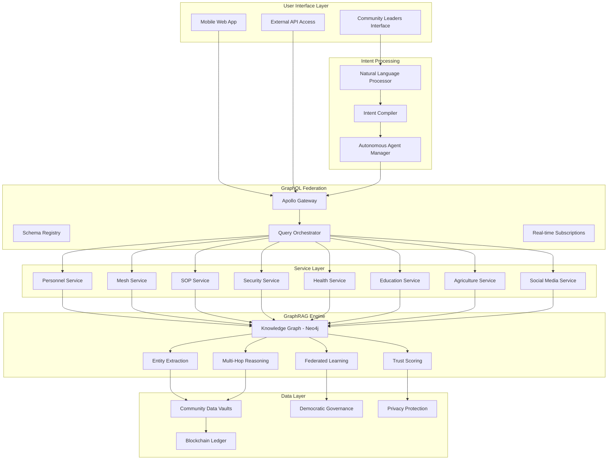

# Comprehensive GraphRAG & GraphQL System Design Document
## Haitian Cooperative Coordination Center (HCCC) Technical Architecture

### Version: 1.0
### Date: 2025-01-16
### Document Type: Technical Design Specification

---

## Table of Contents

1. [Executive Summary](#1-executive-summary)
2. [System Overview](#2-system-overview)
3. [Technical Architecture](#3-technical-architecture)
4. [Technology Stack](#4-technology-stack)
5. [Core Components](#5-core-components)
6. [GraphQL Federation Layer](#6-graphql-federation-layer)
7. [GraphRAG Intelligence Engine](#7-graphrag-intelligence-engine)
8. [System Integrations](#8-system-integrations)
9. [Data Architecture](#9-data-architecture)
10. [Security & Privacy](#10-security--privacy)
11. [Deployment Architecture](#11-deployment-architecture)
12. [Performance Requirements](#12-performance-requirements)
13. [Development Guidelines](#13-development-guidelines)
14. [Testing Strategy](#14-testing-strategy)
15. [Monitoring & Observability](#15-monitoring--observability)

---

## 1. Executive Summary

The GraphRAG & GraphQL System for the Haitian Cooperative Coordination Center (HCCC) represents a revolutionary approach to community-controlled crisis response and development coordination. This system integrates advanced graph-based reasoning with federated GraphQL APIs to enable real-time, multi-sector coordination while maintaining democratic community oversight and data sovereignty.

### Key Innovations:
- **Intent-Based Orchestration**: Natural language commands compiled into coordinated technical actions
- **Community Data Sovereignty**: Democratic control over all data with granular permission systems
- **Multi-Modal Intelligence Fusion**: Integration of satellite, drone, IoT, and community-generated data
- **Autonomous Agent Coordination**: AI-powered resource negotiation with human oversight
- **Federated Social Integration**: Seamless integration with community-controlled social platforms
- **Supply Chain Transparency**: Complete traceability with community storytelling
- **Crisis Response Optimization**: Real-time coordination across security, health, climate, and governance

---

## 2. System Overview

### 2.1 Mission Statement
Enable democratic, community-controlled coordination of crisis response and sustainable development through advanced AI, while preserving cultural autonomy and ensuring equitable resource distribution.

### 2.2 Core Principles
- **Community Sovereignty**: All systems under democratic community control
- **Data Ownership**: Communities own and control their data with granular permissions
- **Cultural Preservation**: Technology serves and preserves Haitian culture
- **Transparency**: All processes visible and auditable by community members
- **Resilience**: System operates during infrastructure failures and crisis conditions
- **Interoperability**: Integration with existing systems and future expansion

### 2.3 System Scope
The system coordinates 7 core sectors through unified GraphQL APIs:
1. **Personnel Management**: National Cooperative Credential Ledger
2. **Mesh Networking**: Edge computing and communication infrastructure
3. **Standard Operating Procedures**: Adaptive crisis response protocols
4. **Security Systems**: Community-controlled surveillance and safety
5. **Healthcare**: Integrated health information and telemedicine
6. **Education**: Skills development and knowledge sharing
7. **Agriculture & Finance**: Supply chain coordination and transparent funding

---

## 3. Technical Architecture

### 3.1 High-Level Architecture

```
┌─────────────────────────────────────────────────────────────────────────────────┐
│                          INTENT-BASED ORCHESTRATION LAYER                      │
│  Natural Language → GraphQL Queries • Multi-Agent Coordination • Safety Rails  │
└─────────────────────────────────────────────────────────────────────────────────┘
                                        │
┌─────────────────────────────────────────────────────────────────────────────────┐
│                           APOLLO FEDERATION GATEWAY                            │
│  Unified GraphQL API • Schema Stitching • Real-time Subscriptions • Security  │
└─────────────────────────────────────────────────────────────────────────────────┘
                                        │
┌─────────┬─────────┬─────────┬─────────┬─────────┬─────────┬─────────┬─────────┐
│Personnel│  Mesh   │   SOP   │Security │ Health  │Education│ AgriMesh│ Social  │
│   API   │   API   │   API   │   API   │   API   │   API   │   API   │   API   │
└─────────┴─────────┴─────────┴─────────┴─────────┴─────────┴─────────┴─────────┘
                                        │
┌─────────────────────────────────────────────────────────────────────────────────┐
│                            GRAPHRAG KNOWLEDGE ENGINE                           │
│  Neo4j Knowledge Graph • Entity Extraction • Multi-Hop Reasoning • Federated  │
│  Learning • Trust Scoring • Uncertainty Quantification • Cultural Context     │
└─────────────────────────────────────────────────────────────────────────────────┘
                                        │
┌─────────────────────────────────────────────────────────────────────────────────┐
│                          TRUST FABRIC & DATA SOVEREIGNTY                      │
│  Community Data Vaults • Privacy-Preserving Analytics • Democratic Governance │
│  • Source Reliability • Anti-Misinformation • Consent Management • Audit Logs │
└─────────────────────────────────────────────────────────────────────────────────┘
                                        │
┌─────────────────────────────────────────────────────────────────────────────────┐
│                           MULTI-MODAL SENSOR FUSION                           │
│  Satellite Data • Drone Networks • IoT Sensors • Community Mobile • CCTV AI   │
│  • Environmental Monitoring • Social Media Integration • Trust Verification   │
└─────────────────────────────────────────────────────────────────────────────────┘
```

### 3.2 Component Interaction Flow



---

## 4. Technology Stack

### 4.1 Core Technologies

#### **GraphQL Federation**
- **Apollo Federation 2.x**: Schema composition and federation
- **Apollo Gateway**: Unified query planning and execution
- **Apollo Studio**: Schema registry and monitoring
- **GraphQL Subscriptions**: Real-time updates via WebSockets

#### **GraphRAG Knowledge Engine**
- **Neo4j 5.x**: Primary knowledge graph database
- **Python 3.11+**: AI/ML processing and entity extraction
- **PyTorch 2.x**: Deep learning models for NLP and reasoning
- **Transformers**: Hugging Face library for language models
- **NetworkX**: Graph analysis and algorithms
- **spaCy**: Named entity recognition and relation extraction

#### **Backend Services**
- **Node.js 20.x**: GraphQL service implementation
- **TypeScript 5.x**: Type-safe development
- **Express.js**: HTTP server framework
- **Bull Queue**: Background job processing with Redis
- **Prisma**: Database ORM and migrations
- **PostgreSQL 15.x**: Relational data storage

#### **Real-time & Messaging**
- **Redis 7.x**: Caching and pub/sub messaging
- **Apache Kafka**: Event streaming and data pipelines
- **Socket.io**: Real-time WebSocket connections
- **GraphQL Subscriptions**: Live query updates

#### **AI & Machine Learning**
- **TensorFlow/PyTorch**: Deep learning frameworks
- **Langchain**: LLM integration and chaining
- **OpenAI GPT-4**: Natural language processing
- **Anthropic Claude**: Alternative LLM for reasoning
- **Stable Diffusion**: Generative modeling for scenarios
- **MLflow**: Model lifecycle management

### 4.2 Infrastructure Technologies

#### **Container Orchestration**
- **Kubernetes 1.28+**: Container orchestration
- **Docker**: Containerization
- **Helm**: Kubernetes package management
- **Istio**: Service mesh for microservices

#### **Distributed Storage**
- **IPFS**: Decentralized file storage
- **MinIO**: S3-compatible object storage
- **Filecoin**: Incentivized storage network
- **CockroachDB**: Distributed SQL database

#### **Identity & Security**
- **Hyperledger Fabric**: Blockchain for governance
- **Web3 Storage**: Decentralized data storage
- **W3C DID**: Decentralized identity standards
- **OAuth 2.1/OpenID Connect**: Authentication
- **HashiCorp Vault**: Secrets management

#### **Monitoring & Observability**
- **Prometheus**: Metrics collection
- **Grafana**: Visualization and alerting
- **Jaeger**: Distributed tracing
- **ELK Stack**: Logging (Elasticsearch, Logstash, Kibana)

### 4.3 Edge Computing Stack

#### **Edge Hardware**
- **Raspberry Pi 4B (8GB)**: Primary edge computing
- **Intel NUC**: High-performance edge processing
- **LoRaWAN Gateways**: Long-range IoT connectivity
- **Solar Power Systems**: Renewable energy infrastructure

#### **Edge Software**
- **K3s**: Lightweight Kubernetes for edge
- **EdgeX Foundry**: IoT device management
- **Apache NiFi**: Data flow automation
- **InfluxDB**: Time-series data storage
- **Mosquitto**: MQTT message broker

---

## 5. Core Components

### 5.1 Intent-Based Orchestration Layer

#### Purpose
Transforms natural language commands into coordinated technical actions across multiple systems while maintaining democratic oversight.

#### Key Features
- Natural language understanding for crisis commands
- Multi-agent coordination with safety guardrails
- Community override controls for all autonomous actions
- Cultural context awareness for Haitian Kreyòl
- Real-time intent validation and approval workflows

#### Technical Implementation
```typescript
interface IntentProcessor {
  parseNaturalLanguage(command: string): ParsedIntent;
  compileToActions(intent: ParsedIntent): ActionPlan;
  validateWithCommunity(plan: ActionPlan): ValidationResult;
  executeWithOversight(plan: ActionPlan): ExecutionResult;
}

interface ParsedIntent {
  domain: SystemDomain;
  action: ActionType;
  targets: TargetEntity[];
  constraints: Constraint[];
  urgency: UrgencyLevel;
  culturalContext: CulturalContext;
}
```

### 5.2 Apollo Federation Gateway

#### Purpose
Unified GraphQL API that seamlessly combines all 7 core software systems while maintaining their independence.

#### Architecture
```typescript
// Gateway Configuration
const gateway = new ApolloGateway({
  supergraphSdl: new IntrospectAndCompose({
    subgraphs: [
      { name: 'personnel', url: 'http://personnel-service:4001/graphql' },
      { name: 'mesh', url: 'http://mesh-service:4002/graphql' },
      { name: 'sop', url: 'http://sop-service:4003/graphql' },
      { name: 'security', url: 'http://security-service:4004/graphql' },
      { name: 'health', url: 'http://health-service:4005/graphql' },
      { name: 'education', url: 'http://education-service:4006/graphql' },
      { name: 'agrimesh', url: 'http://agrimesh-service:4007/graphql' },
      { name: 'social', url: 'http://social-service:4008/graphql' }
    ],
  }),
  experimental_pollInterval: 30000,
  debug: true,
});

// Subscription Handling
const subscriptionServer = new SubscriptionServer({
  execute,
  subscribe,
  schema,
}, {
  server: httpServer,
  path: '/graphql',
});
```

#### Federation Schema Example
```graphql
# Core Entity Definitions
extend type Community @key(fields: "id") {
  id: ID! @external
  cooperatives: [Cooperative!]! @requires(fields: "id")
  governance: GovernanceSystem! @requires(fields: "id")
}

extend type Crisis @key(fields: "id") {
  id: ID! @external
  responseTeams: [ResponseTeam!]! @requires(fields: "id")
  resources: [Resource!]! @requires(fields: "id")
  timeline: Timeline! @requires(fields: "id")
}

# Cross-Service Queries
type Query {
  coordinatedResponse(crisisId: ID!): CoordinatedResponse!
  communityResources(communityId: ID!): CommunityResourcePlan!
  crossSectorAnalysis(region: GeoArea!): CrossSectorInsights!
}
```

### 5.3 GraphRAG Knowledge Engine

#### Purpose
Advanced graph-based reasoning system that processes multi-modal data to provide intelligent insights and decision support.

#### Architecture Components

##### Knowledge Graph Schema
```python
# Neo4j Node Types
class EntityTypes:
    PERSON = "Person"
    ORGANIZATION = "Organization"
    LOCATION = "Location"
    EVENT = "Event"
    RESOURCE = "Resource"
    INFRASTRUCTURE = "Infrastructure"
    CLIMATE_HAZARD = "ClimateHazard"
    COOPERATIVE = "Cooperative"
    SKILL = "Skill"
    PRODUCT = "Product"

# Relationship Types
class RelationshipTypes:
    CAUSED_BY = "CAUSED_BY"
    LOCATED_IN = "LOCATED_IN"
    CONTROLS = "CONTROLS"
    FUNDED_BY = "FUNDED_BY"
    LINKED_TO = "LINKED_TO"
    PRODUCES = "PRODUCES"
    REQUIRES = "REQUIRES"
    THREATENS = "THREATENS"
    SUPPORTS = "SUPPORTS"
```

##### Entity Extraction Pipeline
```python
class EntityExtractionPipeline:
    def __init__(self):
        self.nlp = spacy.load("en_core_web_sm")
        self.relation_extractor = RelationExtractor()
        self.trust_scorer = TrustScorer()
    
    async def process_multi_modal_data(self, data: MultiModalData) -> KnowledgeGraphUpdate:
        # Extract entities from different modalities
        text_entities = await self.extract_from_text(data.text_content)
        image_entities = await self.extract_from_images(data.images)
        sensor_entities = await self.extract_from_sensors(data.sensor_data)
        
        # Correlate across modalities
        correlations = await self.correlate_entities(
            text_entities, image_entities, sensor_entities
        )
        
        # Apply trust scoring
        trusted_entities = await self.trust_scorer.score_entities(correlations)
        
        return KnowledgeGraphUpdate(
            entities=trusted_entities,
            relationships=correlations.relationships,
            confidence_scores=correlations.confidence
        )
```

##### Multi-Hop Reasoning Engine
```python
class MultiHopReasoner:
    def __init__(self, graph: Neo4jGraph):
        self.graph = graph
        self.reasoning_engine = ReasoningEngine()
    
    async def analyze_causal_chains(self, query: CausalQuery) -> CausalChain:
        # Find paths between entities with causal relationships
        cypher_query = """
        MATCH path = (start)-[:CAUSED_BY*1..5]->(end)
        WHERE start.id = $start_id AND end.type = $end_type
        RETURN path, 
               nodes(path) as entities,
               relationships(path) as causal_links,
               reduce(conf = 1.0, r in relationships(path) | conf * r.confidence) as path_confidence
        ORDER BY path_confidence DESC
        LIMIT 10
        """
        
        results = await self.graph.execute(cypher_query, {
            'start_id': query.start_entity,
            'end_type': query.target_type
        })
        
        return CausalChain(
            paths=results,
            confidence=self.calculate_chain_confidence(results),
            interventions=self.suggest_interventions(results)
        )
```

### 5.4 Trust Fabric & Data Sovereignty

#### Purpose
Ensures democratic community control over data while providing reliable, trust-scored information for decision-making.

#### Community Data Vaults
```typescript
interface CommunityDataVault {
  communityId: string;
  dataCategories: DataCategory[];
  accessPolicies: AccessPolicy[];
  consensusRequirements: ConsensusConfig;
  auditTrail: AuditEntry[];
}

interface AccessPolicy {
  resourceType: string;
  requiredPermissions: Permission[];
  approvalProcess: ApprovalProcess;
  timeConstraints: TimeConstraint[];
  culturalConsiderations: CulturalFactor[];
}

class DataSovereigntyManager {
  async requestDataAccess(
    request: DataAccessRequest
  ): Promise<DataAccessResponse> {
    // Check community policies
    const policies = await this.getPolicies(request.communityId);
    
    // Validate cultural appropriateness
    const culturalCheck = await this.validateCulturalAccess(request);
    
    // Route through democratic approval if required
    if (policies.requiresApproval(request)) {
      return await this.routeToDemocraticApproval(request);
    }
    
    // Grant access with audit logging
    return await this.grantAccess(request);
  }
}
```

#### Trust Scoring System
```python
class TrustScorer:
    def __init__(self):
        self.source_reliability = SourceReliabilityTracker()
        self.community_validation = CommunityValidationSystem()
        self.temporal_consistency = TemporalConsistencyChecker()
    
    async def calculate_trust_score(self, data_point: DataPoint) -> TrustScore:
        # Source reliability (40% weight)
        source_score = await self.source_reliability.score(data_point.source)
        
        # Community validation (30% weight)
        community_score = await self.community_validation.score(data_point)
        
        # Temporal consistency (20% weight)
        temporal_score = await self.temporal_consistency.score(data_point)
        
        # Cross-modal verification (10% weight)
        verification_score = await self.cross_modal_verification(data_point)
        
        return TrustScore(
            overall=0.4 * source_score + 0.3 * community_score + 
                   0.2 * temporal_score + 0.1 * verification_score,
            components={
                'source': source_score,
                'community': community_score,
                'temporal': temporal_score,
                'verification': verification_score
            },
            confidence_interval=self.calculate_confidence_interval(data_point)
        )
```

### 5.5 Multi-Modal Sensor Fusion

#### Purpose
Integrates data from satellites, drones, IoT sensors, and community mobile devices to provide comprehensive situational awareness.

#### Sensor Integration Architecture
```python
class MultiModalSensorFusion:
    def __init__(self):
        self.satellite_processor = SatelliteDataProcessor()
        self.drone_coordinator = DroneNetworkCoordinator()
        self.iot_manager = IoTSensorManager()
        self.community_mobile = CommunityMobileProcessor()
        self.fusion_engine = DataFusionEngine()
    
    async def process_sensor_data(self, timeframe: TimeRange) -> FusedIntelligence:
        # Collect from all modalities
        satellite_data = await self.satellite_processor.collect(timeframe)
        drone_data = await self.drone_coordinator.collect(timeframe)
        iot_data = await self.iot_manager.collect(timeframe)
        mobile_data = await self.community_mobile.collect(timeframe)
        
        # Apply spatial-temporal fusion
        fused_data = await self.fusion_engine.fuse([
            satellite_data, drone_data, iot_data, mobile_data
        ])
        
        # Generate actionable intelligence
        return FusedIntelligence(
            situational_awareness=fused_data.situation,
            threat_assessment=fused_data.threats,
            resource_status=fused_data.resources,
            recommendations=fused_data.actions,
            confidence=fused_data.confidence
        )
```

#### OGC SensorThings API Integration
```javascript
// SensorThings API Implementation
class SensorThingsAPI {
  constructor(baseUrl) {
    this.baseUrl = baseUrl;
    this.client = new OGCSensorThingsClient(baseUrl);
  }
  
  async registerSensor(sensorConfig) {
    const thing = await this.client.Things.create({
      name: sensorConfig.name,
      description: sensorConfig.description,
      properties: {
        organization: sensorConfig.cooperative,
        location: sensorConfig.location,
        trustLevel: sensorConfig.trustLevel
      }
    });
    
    const sensor = await this.client.Sensors.create({
      name: sensorConfig.sensorType,
      description: sensorConfig.description,
      encodingType: "application/pdf",
      metadata: sensorConfig.specifications
    });
    
    return { thing, sensor };
  }
  
  async submitObservation(sensorId, observation) {
    return await this.client.Observations.create({
      phenomenonTime: observation.timestamp,
      result: observation.value,
      Datastream: { "@iot.id": sensorId },
      FeatureOfInterest: {
        name: observation.location.name,
        encodingType: "application/vnd.geo+json",
        feature: observation.location.geojson
      }
    });
  }
}
```

---

## 6. GraphQL Federation Layer

### 6.1 Unified Schema Design

#### Core Query Types
```graphql
type Query {
  # Crisis Coordination
  coordinatedResponsePlan(incident: ID!): ResponsePlan!
  securityClimateOverlay(geo: GeoBBox!): HazardMap!
  multiSectorStatus(region: ID!): MultiSectorStatus!
  
  # Resource Management
  availableResources(filter: ResourceFilter!): [Resource!]!
  resourceOptimization(request: OptimizationRequest!): OptimizationPlan!
  
  # Intelligence Analysis
  intelligenceAnalysis(query: IntelligenceQuery!): IntelligenceReport!
  predictiveAssessment(scenario: ScenarioInput!): PredictiveAnalysis!
  
  # Community Insights
  communityHealth(communityId: ID!): CommunityHealthMetrics!
  socialCohesion(region: ID!): SocialCohesionAnalysis!
  
  # Supply Chain
  traceProduct(productId: ID!): ProductJourney!
  supplyChainResilience(networkId: ID!): ResilienceAssessment!
  
  # Governance
  governanceImpact(proposalId: ID!): GovernanceImpactReport!
  participationMetrics(processId: ID!): ParticipationAnalysis!
}

type Subscription {
  # Real-time Crisis Updates
  crisisUpdates(region: GeoBBox!, types: [CrisisType!]!): CrisisUpdate!
  
  # Alert Systems
  multiModalAlerts(sensors: [SensorType!]!, urgency: UrgencyLevel!): Alert!
  
  # Coordination Updates
  coordinationMessages(hcccId: ID!): CoordinationMessage!
  
  # Democratic Processes
  governanceNotifications(participantId: ID!): GovernanceNotification!
  
  # Supply Chain Events
  supplyChainEvents(networkId: ID!): SupplyChainEvent!
}

type Mutation {
  # Crisis Response
  initiateResponse(plan: ResponsePlanInput!): ResponseExecution!
  updateResponseStatus(executionId: ID!, status: StatusUpdate!): ExecutionStatus!
  
  # Resource Allocation
  allocateResources(allocation: ResourceAllocationInput!): AllocationResult!
  requestEmergencyFunds(request: EmergencyFundingRequest!): FundingResponse!
  
  # Community Governance
  submitProposal(proposal: GovernanceProposalInput!): ProposalResult!
  castVote(vote: VoteInput!): VoteResult!
  
  # Intent Processing
  processIntent(command: String!, context: IntentContext!): IntentResult!
  
  # Data Management
  updateDataPolicy(policy: DataPolicyInput!): PolicyUpdateResult!
  grantDataAccess(request: DataAccessRequest!): AccessGrant!
}
```

#### Federation Directives
```graphql
# Entity Resolution
extend type Community @key(fields: "id") {
  id: ID! @external
  name: String @external
  cooperatives: [Cooperative!]! @requires(fields: "id")
  governance: GovernanceSystem! @requires(fields: "id")
  healthMetrics: CommunityHealthMetrics! @requires(fields: "id")
}

extend type Crisis @key(fields: "id") {
  id: ID! @external
  type: CrisisType! @external
  responseTeams: [ResponseTeam!]! @requires(fields: "id type")
  requiredResources: [Resource!]! @requires(fields: "id")
  timeline: CrisisTimeline! @requires(fields: "id")
}

# Cross-Service Composition
type CoordinatedResponse {
  crisis: Crisis!
  assignedPersonnel: [PersonnelAssignment!]! # From Personnel API
  securityMeasures: [SecurityMeasure!]! # From Security API
  healthResponse: HealthResponsePlan! # From Health API
  communicationPlan: CommunicationStrategy! # From Mesh API
  resourceAllocation: ResourcePlan! # From AgriMesh API
  educationContinuity: EducationPlan! # From Education API
  governanceOversight: GovernanceOversight! # From SOP API
}
```

### 6.2 Real-Time Subscriptions

#### WebSocket Subscription Manager
```typescript
class SubscriptionManager {
  private subscriptions: Map<string, Subscription> = new Map();
  private pubsub: PubSub;
  
  constructor() {
    this.pubsub = new RedisPubSub({
      connection: {
        host: process.env.REDIS_HOST,
        port: parseInt(process.env.REDIS_PORT),
      },
    });
  }
  
  async subscribeToAlerts(
    userId: string,
    filter: AlertFilter
  ): Promise<AsyncIterator<Alert>> {
    const subscription = await this.pubsub.asyncIterator([
      `alerts:${filter.region}`,
      `alerts:global`,
      `alerts:user:${userId}`
    ]);
    
    this.subscriptions.set(userId, subscription);
    return subscription;
  }
  
  async publishAlert(alert: Alert): Promise<void> {
    await this.pubsub.publish(`alerts:${alert.region}`, alert);
    
    // Notify affected users
    const affectedUsers = await this.getAffectedUsers(alert);
    for (const user of affectedUsers) {
      await this.pubsub.publish(`alerts:user:${user.id}`, alert);
    }
  }
}
```

#### Subscription Resolvers
```typescript
const subscriptionResolvers = {
  Subscription: {
    crisisUpdates: {
      subscribe: withFilter(
        (_, args, context) => context.pubsub.asyncIterator('CRISIS_UPDATE'),
        (payload, variables, context) => {
          // Apply geo-filtering
          return isWithinBounds(payload.location, variables.region) &&
                 variables.types.includes(payload.type) &&
                 hasPermission(context.user, payload.sensitivity);
        }
      ),
    },
    
    coordinationMessages: {
      subscribe: async (_, args, context) => {
        // Verify HCCC access permissions
        await verifyHCCCAccess(context.user, args.hcccId);
        
        return context.pubsub.asyncIterator(`coordination:${args.hcccId}`);
      },
    },
    
    governanceNotifications: {
      subscribe: withFilter(
        (_, args, context) => context.pubsub.asyncIterator('GOVERNANCE'),
        async (payload, variables, context) => {
          // Check democratic participation eligibility
          return await canParticipate(
            context.user, 
            payload.process, 
            variables.participantId
          );
        }
      ),
    },
  },
};
```

---

## 7. GraphRAG Intelligence Engine

### 7.1 Knowledge Graph Architecture

#### Neo4j Database Schema
```cypher
// Node Constraints and Indexes
CREATE CONSTRAINT community_id IF NOT EXISTS FOR (c:Community) REQUIRE c.id IS UNIQUE;
CREATE CONSTRAINT person_id IF NOT EXISTS FOR (p:Person) REQUIRE p.id IS UNIQUE;
CREATE CONSTRAINT event_id IF NOT EXISTS FOR (e:Event) REQUIRE e.id IS UNIQUE;
CREATE CONSTRAINT resource_id IF NOT EXISTS FOR (r:Resource) REQUIRE r.id IS UNIQUE;

// Spatial Indexes
CREATE INDEX location_spatial IF NOT EXISTS FOR (n:Location) ON (n.point);
CREATE INDEX infrastructure_spatial IF NOT EXISTS FOR (i:Infrastructure) ON (i.point);

// Temporal Indexes
CREATE INDEX event_temporal IF NOT EXISTS FOR (e:Event) ON (e.timestamp);
CREATE INDEX sensor_temporal IF NOT EXISTS FOR (s:SensorReading) ON (s.timestamp);

// Trust and Reliability Indexes
CREATE INDEX trust_score IF NOT EXISTS FOR (n) ON (n.trustScore);
CREATE INDEX reliability_index IF NOT EXISTS FOR (n) ON (n.reliabilityScore);
```

#### Entity Models
```python
from dataclasses import dataclass
from typing import List, Optional, Dict, Any
from datetime import datetime

@dataclass
class KnowledgeGraphEntity:
    id: str
    type: str
    properties: Dict[str, Any]
    trust_score: float
    reliability_score: float
    last_updated: datetime
    source_ids: List[str]
    community_validated: bool

@dataclass
class KnowledgeGraphRelationship:
    id: str
    source_entity: str
    target_entity: str
    relationship_type: str
    properties: Dict[str, Any]
    confidence: float
    evidence: List[str]
    causal_strength: Optional[float] = None

@dataclass
class MultiHopQuery:
    start_entities: List[str]
    target_entity_types: List[str]
    relationship_types: List[str]
    max_hops: int = 5
    min_confidence: float = 0.7
    cultural_context: Optional[str] = None
```

### 7.2 Entity Extraction Pipeline

#### Multi-Modal Entity Extraction
```python
class MultiModalEntityExtractor:
    def __init__(self):
        self.text_extractor = TextEntityExtractor()
        self.image_extractor = ImageEntityExtractor()
        self.sensor_extractor = SensorEntityExtractor()
        self.video_extractor = VideoEntityExtractor()
        self.audio_extractor = AudioEntityExtractor()
    
    async def extract_from_multi_modal_data(
        self, 
        data: MultiModalData
    ) -> List[KnowledgeGraphEntity]:
        
        extraction_tasks = []
        
        # Text extraction (social media, reports, documents)
        if data.text_content:
            extraction_tasks.append(
                self.text_extractor.extract(data.text_content)
            )
        
        # Image extraction (satellite, drone, CCTV, mobile photos)
        if data.images:
            extraction_tasks.append(
                self.image_extractor.extract(data.images)
            )
        
        # Sensor data extraction (IoT, weather stations, monitors)
        if data.sensor_readings:
            extraction_tasks.append(
                self.sensor_extractor.extract(data.sensor_readings)
            )
        
        # Video analysis (CCTV, drone footage, community videos)
        if data.videos:
            extraction_tasks.append(
                self.video_extractor.extract(data.videos)
            )
        
        # Audio processing (radio communications, community reports)
        if data.audio:
            extraction_tasks.append(
                self.audio_extractor.extract(data.audio)
            )
        
        # Execute all extractions in parallel
        results = await asyncio.gather(*extraction_tasks)
        
        # Merge and deduplicate entities
        all_entities = []
        for result in results:
            all_entities.extend(result.entities)
        
        # Cross-modal entity resolution
        resolved_entities = await self.resolve_cross_modal_entities(all_entities)
        
        return resolved_entities

class TextEntityExtractor:
    def __init__(self):
        self.nlp = spacy.load("en_core_web_sm")
        self.kreyol_nlp = self.load_kreyol_model()
        self.relation_extractor = RelationExtractor()
    
    async def extract(self, text_content: List[TextDocument]) -> ExtractionResult:
        entities = []
        relationships = []
        
        for document in text_content:
            # Language detection
            language = detect_language(document.content)
            
            # Use appropriate NLP model
            if language == 'kreyol':
                doc = self.kreyol_nlp(document.content)
            else:
                doc = self.nlp(document.content)
            
            # Extract named entities
            for ent in doc.ents:
                entity = KnowledgeGraphEntity(
                    id=self.generate_entity_id(ent),
                    type=self.map_spacy_label_to_kg_type(ent.label_),
                    properties={
                        'text': ent.text,
                        'start_char': ent.start_char,
                        'end_char': ent.end_char,
                        'confidence': ent._.confidence if hasattr(ent._, 'confidence') else 0.8,
                        'language': language,
                        'context': document.context
                    },
                    trust_score=0.0,  # Will be calculated by TrustScorer
                    reliability_score=0.0,
                    last_updated=datetime.now(),
                    source_ids=[document.source_id],
                    community_validated=False
                )
                entities.append(entity)
            
            # Extract relationships
            doc_relationships = await self.relation_extractor.extract_relations(doc)
            relationships.extend(doc_relationships)
        
        return ExtractionResult(
            entities=entities,
            relationships=relationships,
            metadata={'extractor': 'text', 'documents_processed': len(text_content)}
        )
```

### 7.3 Multi-Hop Reasoning Engine

#### Causal Chain Analysis
```python
class CausalChainAnalyzer:
    def __init__(self, graph: Neo4jGraph):
        self.graph = graph
        self.causal_inference = CausalInferenceEngine()
    
    async def analyze_causal_chains(
        self, 
        start_event: str, 
        target_outcomes: List[str],
        max_hops: int = 5
    ) -> CausalAnalysisResult:
        
        # Find all paths from start event to target outcomes
        cypher_query = """
        MATCH path = (start:Event {id: $start_id})-[:CAUSED_BY|LEADS_TO*1..$max_hops]->(target)
        WHERE target.id IN $target_ids
        WITH path, 
             nodes(path) as path_nodes,
             relationships(path) as path_rels,
             reduce(conf = 1.0, r in relationships(path) | conf * r.confidence) as path_confidence,
             reduce(strength = 1.0, r in relationships(path) | strength * r.causal_strength) as causal_strength
        WHERE path_confidence >= 0.5
        RETURN path, path_nodes, path_rels, path_confidence, causal_strength
        ORDER BY causal_strength DESC, path_confidence DESC
        LIMIT 20
        """
        
        results = await self.graph.execute(cypher_query, {
            'start_id': start_event,
            'target_ids': target_outcomes,
            'max_hops': max_hops
        })
        
        # Analyze causal mechanisms
        causal_chains = []
        for result in results:
            chain = CausalChain(
                path=result['path'],
                nodes=result['path_nodes'],
                relationships=result['path_rels'],
                confidence=result['path_confidence'],
                causal_strength=result['causal_strength']
            )
            
            # Identify intervention points
            chain.intervention_points = await self.identify_intervention_points(chain)
            
            # Calculate intervention effectiveness
            chain.intervention_effectiveness = await self.calculate_intervention_effectiveness(chain)
            
            causal_chains.append(chain)
        
        return CausalAnalysisResult(
            causal_chains=causal_chains,
            strongest_factors=self.identify_strongest_causal_factors(causal_chains),
            intervention_recommendations=self.generate_intervention_recommendations(causal_chains),
            uncertainty_analysis=self.analyze_uncertainty(causal_chains)
        )
    
    async def identify_intervention_points(self, chain: CausalChain) -> List[InterventionPoint]:
        intervention_points = []
        
        for i, node in enumerate(chain.nodes[:-1]):  # Exclude final outcome
            # Calculate intervention potential
            potential = await self.calculate_intervention_potential(
                node, 
                chain.relationships[i:],
                chain.causal_strength
            )
            
            if potential.effectiveness > 0.6:  # Threshold for viable intervention
                intervention_points.append(InterventionPoint(
                    node=node,
                    position_in_chain=i,
                    effectiveness=potential.effectiveness,
                    cost_estimate=potential.cost,
                    feasibility=potential.feasibility,
                    community_acceptance=potential.community_acceptance
                ))
        
        return sorted(intervention_points, key=lambda x: x.effectiveness, reverse=True)
```

#### Predictive Analytics Engine
```python
class PredictiveAnalyticsEngine:
    def __init__(self, graph: Neo4jGraph):
        self.graph = graph
        self.ml_models = self.load_ml_models()
        self.scenario_generator = ScenarioGenerator()
    
    async def predict_crisis_probability(
        self, 
        region: str, 
        time_horizon: timedelta,
        scenario_variables: Dict[str, Any]
    ) -> CrisisPrediction:
        
        # Gather historical patterns
        historical_data = await self.gather_historical_crisis_data(region)
        
        # Current risk factors
        current_risks = await self.assess_current_risk_factors(region)
        
        # Environmental predictors
        climate_factors = await self.get_climate_predictors(region, time_horizon)
        
        # Social stability indicators
        social_factors = await self.get_social_stability_indicators(region)
        
        # Economic stress indicators
        economic_factors = await self.get_economic_stress_indicators(region)
        
        # Combine all factors
        feature_vector = self.create_feature_vector({
            'historical': historical_data,
            'current_risks': current_risks,
            'climate': climate_factors,
            'social': social_factors,
            'economic': economic_factors,
            'scenario': scenario_variables
        })
        
        # Generate predictions using ensemble of models
        predictions = {}
        for crisis_type, model in self.ml_models.items():
            prediction = model.predict_proba(feature_vector)[0]
            predictions[crisis_type] = {
                'probability': prediction[1],  # Probability of crisis
                'confidence_interval': model.predict_confidence_interval(feature_vector),
                'key_factors': model.get_feature_importance(),
                'early_warning_threshold': 0.7
            }
        
        # Generate intervention scenarios
        intervention_scenarios = await self.scenario_generator.generate_intervention_scenarios(
            current_state=feature_vector,
            prediction_horizon=time_horizon,
            available_interventions=await self.get_available_interventions(region)
        )
        
        return CrisisPrediction(
            region=region,
            time_horizon=time_horizon,
            crisis_probabilities=predictions,
            intervention_scenarios=intervention_scenarios,
            recommended_preparations=self.generate_preparation_recommendations(predictions),
            uncertainty_analysis=self.analyze_prediction_uncertainty(predictions)
        )
```

### 7.4 Federated Learning Integration

#### Privacy-Preserving Model Training
```python
class FederatedLearningCoordinator:
    def __init__(self):
        self.participants = {}
        self.global_model = None
        self.aggregation_strategy = FedAvgAggregation()
        self.privacy_budget = PrivacyBudgetManager()
    
    async def coordinate_training_round(
        self, 
        model_update_request: ModelUpdateRequest
    ) -> FederatedTrainingResult:
        
        # Select participants for this round
        selected_participants = await self.select_participants(
            model_update_request.target_communities,
            model_update_request.minimum_data_quality,
            model_update_request.privacy_requirements
        )
        
        # Send global model to participants
        participant_tasks = []
        for participant in selected_participants:
            task = self.send_model_for_training(
                participant=participant,
                global_model=self.global_model,
                training_config=model_update_request.training_config,
                privacy_config=model_update_request.privacy_config
            )
            participant_tasks.append(task)
        
        # Wait for local training completion
        local_updates = await asyncio.gather(*participant_tasks)
        
        # Filter out failed updates
        valid_updates = [update for update in local_updates if update.is_valid]
        
        if len(valid_updates) < model_update_request.minimum_participants:
            raise InsufficientParticipantsError(
                f"Only {len(valid_updates)} participants completed training, "
                f"minimum required: {model_update_request.minimum_participants}"
            )
        
        # Apply differential privacy to updates
        private_updates = []
        for update in valid_updates:
            private_update = await self.privacy_budget.apply_differential_privacy(
                update=update,
                epsilon=model_update_request.privacy_config.epsilon,
                delta=model_update_request.privacy_config.delta
            )
            private_updates.append(private_update)
        
        # Aggregate updates to create new global model
        new_global_model = await self.aggregation_strategy.aggregate(
            updates=private_updates,
            aggregation_weights=self.calculate_aggregation_weights(valid_updates)
        )
        
        # Validate new model performance
        validation_result = await self.validate_global_model(
            model=new_global_model,
            validation_datasets=model_update_request.validation_data
        )
        
        if validation_result.performance_improvement > 0:
            self.global_model = new_global_model
            
            # Distribute updated model to all participants
            await self.distribute_updated_model(new_global_model)
        
        return FederatedTrainingResult(
            round_number=self.current_round,
            participants_count=len(valid_updates),
            model_performance=validation_result.metrics,
            privacy_spent=self.privacy_budget.get_total_spent(),
            next_training_schedule=self.schedule_next_round()
        )

class CommunityModelTrainer:
    def __init__(self, community_id: str):
        self.community_id = community_id
        self.local_data = CommunityDataManager(community_id)
        self.privacy_engine = LocalPrivacyEngine()
    
    async def train_local_model(
        self, 
        global_model: Model, 
        training_config: TrainingConfig,
        privacy_config: PrivacyConfig
    ) -> LocalModelUpdate:
        
        # Get community-approved training data
        training_data = await self.local_data.get_approved_training_data(
            data_types=training_config.required_data_types,
            consent_level=privacy_config.required_consent_level
        )
        
        if len(training_data) < training_config.minimum_samples:
            return LocalModelUpdate(
                is_valid=False,
                error="Insufficient training data"
            )
        
        # Apply local differential privacy
        private_training_data = await self.privacy_engine.apply_local_privacy(
            data=training_data,
            privacy_config=privacy_config
        )
        
        # Train model locally
        local_model = global_model.copy()
        training_metrics = await local_model.train(
            data=private_training_data,
            epochs=training_config.local_epochs,
            learning_rate=training_config.learning_rate
        )
        
        # Calculate model update (difference from global model)
        model_update = local_model.get_weight_update(global_model)
        
        # Apply gradient clipping for privacy
        clipped_update = self.privacy_engine.clip_gradients(
            update=model_update,
            clipping_norm=privacy_config.gradient_clip_norm
        )
        
        # Add noise for differential privacy
        noisy_update = self.privacy_engine.add_noise(
            update=clipped_update,
            noise_scale=privacy_config.noise_scale
        )
        
        return LocalModelUpdate(
            is_valid=True,
            model_update=noisy_update,
            training_metrics=training_metrics,
            data_samples_used=len(private_training_data),
            privacy_metrics=self.privacy_engine.get_privacy_metrics()
        )
```

---

## 8. System Integrations

### 8.1 Federated Social Media Integration

#### ActivityPub Implementation
```typescript
// ActivityPub Actor for Community Cooperative
interface CommunityActor {
  '@context': 'https://www.w3.org/ns/activitystreams';
  type: 'Organization';
  id: string; // https://hccc.ht/actors/community/12345
  name: string;
  preferredUsername: string;
  summary: string;
  inbox: string;
  outbox: string;
  followers: string;
  following: string;
  publicKey: {
    id: string;
    owner: string;
    publicKeyPem: string;
  };
  // HCCC-specific extensions
  cooperative: {
    type: 'Cooperative';
    memberCount: number;
    governanceType: 'Democratic' | 'Consensus' | 'Council';
    economicSectors: string[];
    location: GeoLocation;
  };
}

class ActivityPubIntegration {
  private federatedPlatforms: Map<string, PlatformConnector> = new Map();
  
  constructor() {
    // Initialize platform connectors
    this.federatedPlatforms.set('mastodon', new MastodonConnector());
    this.federatedPlatforms.set('peertube', new PeerTubeConnector());
    this.federatedPlatforms.set('pixelfed', new PixelfedConnector());
    this.federatedPlatforms.set('lemmy', new LemmyConnector());
    this.federatedPlatforms.set('writefreely', new WriteFreelyConnector());
    this.federatedPlatforms.set('funkwhale', new FunkwhaleConnector());
    this.federatedPlatforms.set('mobilizon', new MobilizonConnector());
  }
  
  async publishSupplyChainUpdate(update: SupplyChainUpdate): Promise<void> {
    const activity: ActivityPubActivity = {
      '@context': 'https://www.w3.org/ns/activitystreams',
      type: 'Create',
      actor: update.cooperative.actorId,
      object: {
        type: 'Note',
        content: this.formatSupplyChainContent(update),
        tag: [
          { type: 'Hashtag', name: '#SupplyChain' },
          { type: 'Hashtag', name: `#${update.product.category}` },
          { type: 'Hashtag', name: '#HaitianCooperative' }
        ],
        attachment: update.media?.map(media => ({
          type: 'Image',
          url: media.url,
          name: media.description
        })) || [],
        // HCCC extension for supply chain data
        supplyChain: {
          productId: update.product.id,
          stage: update.stage,
          location: update.location,
          qualityMetrics: update.qualityMetrics,
          culturalSignificance: update.culturalSignificance
        }
      }
    };
    
    // Distribute to all federated platforms
    const publishTasks = Array.from(this.federatedPlatforms.values()).map(
      platform => platform.publishActivity(activity)
    );
    
    await Promise.allSettled(publishTasks);
  }
  
  async coordinateCrisisResponse(crisis: CrisisEvent): Promise<void> {
    // Mastodon: Immediate alerts and status updates
    await this.federatedPlatforms.get('mastodon')?.publishCrisisAlert({
      urgency: crisis.urgency,
      location: crisis.location,
      type: crisis.type,
      instructions: crisis.immediateInstructions
    });
    
    // PeerTube: Video briefings and instructions
    if (crisis.videoBriefing) {
      await this.federatedPlatforms.get('peertube')?.publishVideo({
        title: `Crisis Response: ${crisis.type}`,
        description: crisis.description,
        videoUrl: crisis.videoBriefing.url,
        tags: ['crisis', 'emergency', crisis.type.toLowerCase()]
      });
    }
    
    // Mobilizon: Emergency coordination meetings
    if (crisis.coordinationMeeting) {
      await this.federatedPlatforms.get('mobilizon')?.createEvent({
        name: `Emergency Coordination: ${crisis.type}`,
        description: crisis.coordinationMeeting.description,
        startTime: crisis.coordinationMeeting.startTime,
        location: crisis.coordinationMeeting.location,
        joinUrl: crisis.coordinationMeeting.bigBlueButtonUrl
      });
    }
    
    // Lemmy: Community discussion and coordination
    await this.federatedPlatforms.get('lemmy')?.createDiscussion({
      community: 'emergency-response',
      title: `Crisis Response Discussion: ${crisis.type}`,
      body: crisis.discussionPrompt,
      urgent: true
    });
    
    // Nextcloud: Document sharing for response teams
    if (crisis.responseDocuments) {
      await this.federatedPlatforms.get('nextcloud')?.shareDocuments({
        documents: crisis.responseDocuments,
        shareWith: crisis.responseTeams,
        permissions: ['read', 'comment']
      });
    }
  }
}
```

#### Cross-Platform Content Syndication
```typescript
class CrossPlatformSyndicator {
  async syndicateProductStory(product: Product): Promise<ProductStoryResult> {
    const story = await this.buildProductStory(product);
    
    const syndicationTasks = [
      // Mastodon: Regular updates throughout production
      this.syndicateToMastodon(story.microUpdates),
      
      // PeerTube: Process documentation videos
      this.syndicateToPeerTube(story.processVideos),
      
      // Pixelfed: Visual journey documentation
      this.syndicateToPixelfed(story.visualContent),
      
      // WriteFreely: Detailed articles about cultural significance
      this.syndicateToWriteFreely(story.culturalNarrative),
      
      // BookStack: Technical documentation
      this.syndicateToBookStack(story.technicalDocumentation),
      
      // Funkwhale: Work songs and cultural audio
      this.syndicateToFunkwhale(story.audioContent)
    ];
    
    const results = await Promise.allSettled(syndicationTasks);
    
    return {
      product: product,
      syndicationResults: results,
      crossPlatformEngagement: await this.measureEngagement(story),
      communityFeedback: await this.aggregateFeedback(story),
      culturalImpact: await this.assessCulturalImpact(story)
    };
  }
  
  private async syndicateToMastodon(updates: MicroUpdate[]): Promise<void> {
    for (const update of updates) {
      const post = {
        status: `${update.content} #SupplyChain #HaitianCooperative #${update.stage}`,
        media_ids: update.mediaIds,
        visibility: 'public',
        language: update.language
      };
      
      await this.mastodonClient.post('/api/v1/statuses', post);
      
      // Wait between posts to avoid rate limiting
      await this.delay(60000); // 1 minute between posts
    }
  }
  
  private async syndicateToPeerTube(videos: ProcessVideo[]): Promise<void> {
    for (const video of videos) {
      const upload = {
        name: video.title,
        description: video.description,
        tags: ['supply-chain', 'cooperative', 'haiti', video.stage],
        category: 'Education',
        licence: 'Creative Commons Attribution',
        language: video.language,
        privacy: 'Public',
        channelId: await this.getCooperativeChannelId(video.cooperative)
      };
      
      await this.peerTubeClient.uploadVideo(video.file, upload);
    }
  }
}
```

### 8.2 Supply Chain GraphQL Integration

#### Supply Chain Traceability Schema
```graphql
type ProductJourney {
  product: Product!
  stages: [ProductionStage!]!
  currentLocation: Location!
  qualityAssessments: [QualityAssessment!]!
  socialStory: SocialStory!
  environmentalImpact: EnvironmentalImpact!
  culturalValue: CulturalValue!
  communityBenefit: CommunityBenefit!
}

type ProductionStage {
  id: ID!
  name: String!
  cooperative: Cooperative!
  startDate: DateTime!
  endDate: DateTime
  location: Location!
  personnel: [Person!]!
  processes: [Process!]!
  qualityChecks: [QualityCheck!]!
  socialDocumentation: [SocialContent!]!
  environmentalMetrics: EnvironmentalMetrics!
  challenges: [Challenge!]!
  innovations: [Innovation!]!
}

type SocialContent {
  id: ID!
  platform: PlatformType!
  contentType: ContentType!
  url: String!
  author: Person!
  timestamp: DateTime!
  engagementMetrics: EngagementMetrics!
  communityValidation: ValidationStatus!
  culturalContext: CulturalContext!
}

type SocialStory {
  narrative: String!
  keyMoments: [SocialContent!]!
  communityVoices: [CommunityVoice!]!
  culturalElements: [CulturalElement!]!
  impactOnCommunity: CommunityImpact!
  preservationValue: PreservationValue!
}

# Queries for supply chain intelligence
extend type Query {
  # Product traceability
  traceProduct(productId: ID!): ProductJourney!
  traceProductBatch(batchId: ID!): [ProductJourney!]!
  
  # Supply chain analytics
  supplyChainAnalytics(
    timeRange: TimeRange!
    cooperativeNetwork: [ID!]!
    metrics: [AnalyticsMetric!]!
  ): SupplyChainAnalytics!
  
  # Quality and compliance
  qualityReport(
    productCategory: ProductCategory!
    timeRange: TimeRange!
  ): QualityReport!
  
  # Social impact assessment
  socialImpactAssessment(
    supplyChainId: ID!
    assessmentType: AssessmentType!
  ): SocialImpactReport!
  
  # Cultural preservation tracking
  culturalPreservationMetrics(
    region: String!
    timeRange: TimeRange!
  ): CulturalPreservationReport!
  
  # Community benefit analysis
  communityBenefitAnalysis(
    cooperativeId: ID!
    timeRange: TimeRange!
  ): CommunityBenefitReport!
}

# Real-time supply chain subscriptions
extend type Subscription {
  # Product movement tracking
  productMovement(productIds: [ID!]!): ProductMovementUpdate!
  
  # Quality alerts
  qualityAlerts(
    cooperativeNetwork: [ID!]!
    severityLevel: SeverityLevel!
  ): QualityAlert!
  
  # Social story updates
  socialStoryUpdates(productId: ID!): SocialContentUpdate!
  
  # Community engagement
  communityEngagement(
    cooperativeId: ID!
    contentTypes: [ContentType!]!
  ): EngagementUpdate!
}
```

#### Supply Chain Resolver Implementation
```typescript
const supplyChainResolvers = {
  Query: {
    traceProduct: async (_, { productId }, context) => {
      // Get product journey from GraphRAG
      const journey = await context.graphRAG.getProductJourney(productId);
      
      // Enrich with social media content
      const socialContent = await context.socialMediaAggregator.getProductContent(productId);
      
      // Add community validation
      const validatedJourney = await context.communityValidator.validateJourney(journey);
      
      return {
        ...validatedJourney,
        socialStory: await this.buildSocialStory(socialContent),
        communityBenefit: await this.calculateCommunityBenefit(journey)
      };
    },
    
    supplyChainAnalytics: async (_, args, context) => {
      // GraphRAG query for supply chain patterns
      const patterns = await context.graphRAG.analyzeSupplyChainPatterns(args);
      
      // Cross-reference with social engagement
      const engagement = await context.socialMediaAggregator.getEngagementMetrics(args);
      
      // Community satisfaction metrics
      const satisfaction = await context.communityFeedback.getSatisfactionMetrics(args);
      
      return {
        efficiency: patterns.efficiency,
        sustainability: patterns.sustainability,
        communityImpact: patterns.communityImpact,
        socialEngagement: engagement,
        communitySatisfaction: satisfaction,
        recommendations: await this.generateRecommendations(patterns, engagement, satisfaction)
      };
    }
  },
  
  Subscription: {
    productMovement: {
      subscribe: withFilter(
        (_, args, context) => context.pubsub.asyncIterator('PRODUCT_MOVEMENT'),
        (payload, variables) => variables.productIds.includes(payload.productId)
      ),
    },
    
    socialStoryUpdates: {
      subscribe: async (_, { productId }, context) => {
        // Subscribe to all platforms for this product
        const platformSubscriptions = await Promise.all([
          context.mastodon.subscribeToHashtag(`product-${productId}`),
          context.pixelfed.subscribeToTag(`product-${productId}`),
          context.peertube.subscribeToChannel(`product-${productId}`),
          context.lemmy.subscribeToPost(`product-${productId}`)
        ]);
        
        return context.pubsub.asyncIterator(`social-story:${productId}`);
      },
    }
  },
  
  ProductJourney: {
    socialStory: async (parent, _, context) => {
      return await context.socialStoryBuilder.buildStory(parent.product.id);
    },
    
    communityBenefit: async (parent, _, context) => {
      return await context.communityBenefitCalculator.calculate(parent);
    }
  }
};

class SocialStoryBuilder {
  constructor(
    private graphRAG: GraphRAGEngine,
    private socialAggregator: SocialMediaAggregator
  ) {}
  
  async buildStory(productId: string): Promise<SocialStory> {
    // Get all social content related to product
    const socialContent = await this.socialAggregator.getAllContent(productId);
    
    // Use GraphRAG to identify narrative structure
    const narrative = await this.graphRAG.generateNarrative({
      entities: [productId],
      contentTypes: ['social_media', 'documentation', 'community_reports'],
      culturalContext: 'haitian_cooperative'
    });
    
    // Extract key moments from timeline
    const keyMoments = this.extractKeyMoments(socialContent);
    
    // Identify community voices
    const communityVoices = await this.identifyCommunityVoices(socialContent);
    
    // Assess cultural elements
    const culturalElements = await this.assessCulturalElements(socialContent);
    
    return {
      narrative: narrative.text,
      keyMoments,
      communityVoices,
      culturalElements,
      impactOnCommunity: await this.assessCommunityImpact(socialContent),
      preservationValue: await this.assessPreservationValue(culturalElements)
    };
  }
}
```

---

## 9. Data Architecture

### 9.1 Community Data Sovereignty

#### Data Governance Framework
```typescript
interface CommunityDataGovernance {
  communityId: string;
  dataCategories: DataCategory[];
  accessPolicies: DataAccessPolicy[];
  retentionPolicies: RetentionPolicy[];
  sharingAgreements: SharingAgreement[];
  consentManagement: ConsentManagementConfig;
  auditRequirements: AuditRequirement[];
  culturalProtections: CulturalProtection[];
}

interface DataAccessPolicy {
  resourceType: string;
  sensitivity: SensitivityLevel;
  accessControls: AccessControl[];
  approvalProcess: ApprovalProcess;
  timeConstraints: TimeConstraint[];
  geographicConstraints: GeographicConstraint[];
  purposeLimitations: PurposeLimitation[];
  culturalConsiderations: CulturalConsideration[];
}

class CommunityDataVault {
  private vault: VaultInterface;
  private governance: CommunityDataGovernance;
  private auditLogger: AuditLogger;
  
  constructor(communityId: string) {
    this.vault = new IPFSVault(communityId);
    this.governance = this.loadGovernanceConfig(communityId);
    this.auditLogger = new BlockchainAuditLogger(communityId);
  }
  
  async storeData(
    data: CommunityData,
    metadata: DataMetadata,
    consent: ConsentRecord
  ): Promise<DataStoreResult> {
    
    // Validate consent
    const consentValid = await this.validateConsent(consent, metadata);
    if (!consentValid.isValid) {
      throw new ConsentViolationError(consentValid.violations);
    }
    
    // Apply cultural protections
    const culturalCheck = await this.applyCulturalProtections(data, metadata);
    if (!culturalCheck.approved) {
      throw new CulturalProtectionError(culturalCheck.concerns);
    }
    
    // Encrypt data with community-controlled keys
    const encryptedData = await this.vault.encrypt(data, {
      encryptionLevel: metadata.sensitivity,
      keyRotationPolicy: this.governance.keyRotationPolicy,
      accessControlList: metadata.accessControlList
    });
    
    // Store in IPFS with redundancy
    const storageResult = await this.vault.store(encryptedData, {
      redundancy: this.governance.redundancyLevel,
      geographicDistribution: this.governance.geographicDistribution
    });
    
    // Log to audit trail
    await this.auditLogger.logDataStore({
      dataId: storageResult.dataId,
      storageHash: storageResult.ipfsHash,
      metadata: metadata,
      consentId: consent.id,
      timestamp: new Date(),
      communityApproval: culturalCheck.approvalId
    });
    
    return {
      dataId: storageResult.dataId,
      ipfsHash: storageResult.ipfsHash,
      accessToken: await this.generateAccessToken(metadata),
      expiresAt: this.calculateExpiration(metadata)
    };
  }
  
  async requestAccess(
    request: DataAccessRequest
  ): Promise<DataAccessResponse> {
    
    // Check if requestor has permission
    const permissionCheck = await this.checkPermissions(request);
    if (!permissionCheck.hasPermission) {
      return {
        granted: false,
        reason: 'Insufficient permissions',
        appealProcess: permissionCheck.appealProcess
      };
    }
    
    // Check if community approval required
    const policy = this.governance.accessPolicies.find(
      p => p.resourceType === request.dataType
    );
    
    if (policy?.approvalProcess.requiresCommunityApproval) {
      // Route to democratic approval process
      const approvalRequest = await this.createApprovalRequest(request, policy);
      
      // Notify community for voting
      await this.notifyCommunityForApproval(approvalRequest);
      
      return {
        granted: false,
        reason: 'Pending community approval',
        approvalRequestId: approvalRequest.id,
        estimatedDecisionTime: policy.approvalProcess.expectedDuration
      };
    }
    
    // Grant immediate access
    const accessToken = await this.generateAccessToken({
      dataId: request.dataId,
      requestorId: request.requestorId,
      purpose: request.purpose,
      duration: policy.maxAccessDuration
    });
    
    // Log access grant
    await this.auditLogger.logAccessGrant({
      dataId: request.dataId,
      requestorId: request.requestorId,
      accessToken: accessToken.id,
      grantedAt: new Date(),
      expiresAt: accessToken.expiresAt
    });
    
    return {
      granted: true,
      accessToken: accessToken.token,
      expiresAt: accessToken.expiresAt,
      limitations: policy.purposeLimitations
    };
  }
}
```

### 9.2 Distributed Storage Architecture

#### IPFS Integration with Community Control
```typescript
class CommunityControlledIPFS {
  private ipfsNode: IPFSNode;
  private pinningStrategies: Map<string, PinningStrategy>;
  private replicationConfig: ReplicationConfig;
  
  constructor(communityConfig: CommunityIPFSConfig) {
    this.ipfsNode = new IPFSNode({
      config: {
        Addresses: {
          Swarm: communityConfig.swarmAddresses,
          API: communityConfig.apiAddress,
          Gateway: communityConfig.gatewayAddress
        },
        Bootstrap: communityConfig.bootstrapNodes,
        Discovery: {
          MDNS: { Enabled: true },
          webRTCStar: { Enabled: true }
        },
        Pubsub: { Enabled: true },
        Swarm: {
          ConnMgr: {
            LowWater: 50,
            HighWater: 200
          }
        }
      }
    });
    
    this.setupCommunityPinning(communityConfig);
  }
  
  async storeWithCommunityReplication(
    data: Buffer,
    metadata: StorageMetadata
  ): Promise<StorageResult> {
    
    // Add to IPFS
    const addResult = await this.ipfsNode.add(data, {
      pin: true,
      cidVersion: 1,
      hashAlg: 'sha2-256'
    });
    
    const cid = addResult.cid.toString();
    
    // Determine replication strategy based on data importance
    const replicationStrategy = this.determineReplicationStrategy(metadata);
    
    // Pin on community nodes
    const pinningTasks = replicationStrategy.nodes.map(async (nodeId) => {
      try {
        await this.requestPinning(nodeId, cid, metadata);
        return { nodeId, success: true };
      } catch (error) {
        return { nodeId, success: false, error };
      }
    });
    
    const pinningResults = await Promise.allSettled(pinningTasks);
    
    // Verify minimum replication threshold
    const successfulPins = pinningResults.filter(
      result => result.status === 'fulfilled' && result.value.success
    ).length;
    
    if (successfulPins < replicationStrategy.minimumReplicas) {
      throw new InsufficientReplicationError(
        `Only ${successfulPins} replicas created, minimum required: ${replicationStrategy.minimumReplicas}`
      );
    }
    
    // Store metadata in governance blockchain
    await this.recordStorageMetadata({
      cid,
      originalSize: data.length,
      replicationNodes: pinningResults.map(r => r.value?.nodeId).filter(Boolean),
      storagePolicy: replicationStrategy.policy,
      communityApproval: metadata.communityApproval
    });
    
    return {
      cid,
      size: addResult.size,
      replicationCount: successfulPins,
      estimatedRetrievalTime: this.estimateRetrievalTime(replicationStrategy)
    };
  }
  
  private async requestPinning(
    nodeId: string,
    cid: string,
    metadata: StorageMetadata
  ): Promise<void> {
    
    // Check if node accepts this type of content
    const nodePolicy = await this.getNodePinningPolicy(nodeId);
    if (!nodePolicy.accepts(metadata.contentType, metadata.sensitivity)) {
      throw new PinningPolicyViolationError(`Node ${nodeId} does not accept content type ${metadata.contentType}`);
    }
    
    // Request pinning via pubsub
    await this.ipfsNode.pubsub.publish(`pin-request-${nodeId}`, {
      cid,
      requestingCommunity: metadata.communityId,
      contentType: metadata.contentType,
      retentionPeriod: metadata.retentionPeriod,
      compensationOffer: this.calculateCompensation(metadata)
    });
    
    // Wait for confirmation
    const confirmation = await this.waitForPinningConfirmation(nodeId, cid);
    if (!confirmation.success) {
      throw new PinningFailedError(confirmation.error);
    }
  }
}
```

### 9.3 Blockchain Governance Integration

#### Hyperledger Fabric for Transparent Governance
```typescript
class GovernanceBlockchain {
  private fabricNetwork: Network;
  private contract: Contract;
  private wallet: Wallet;
  
  async initializeGovernanceNetwork(
    communityId: string,
    governanceConfig: GovernanceConfig
  ): Promise<void> {
    
    // Create wallet for community
    this.wallet = await Wallets.newFileSystemWallet(`./wallets/${communityId}`);
    
    // Connect to Fabric network
    const connectionProfile = await this.buildConnectionProfile(governanceConfig);
    const gateway = new Gateway();
    
    await gateway.connect(connectionProfile, {
      wallet: this.wallet,
      identity: communityId,
      discovery: { enabled: true, asLocalhost: false }
    });
    
    this.fabricNetwork = await gateway.getNetwork('governance-channel');
    this.contract = this.fabricNetwork.getContract('governance-chaincode');
  }
  
  async submitProposal(proposal: GovernanceProposal): Promise<ProposalResult> {
    
    // Validate proposal against community governance rules
    const validation = await this.validateProposal(proposal);
    if (!validation.isValid) {
      throw new ProposalValidationError(validation.errors);
    }
    
    // Submit to blockchain
    const proposalId = this.generateProposalId(proposal);
    
    const transaction = this.contract.createTransaction('submitProposal');
    const result = await transaction.submit(
      proposalId,
      JSON.stringify(proposal),
      proposal.submitterId,
      new Date().toISOString()
    );
    
    // Index proposal in GraphRAG for intelligent analysis
    await this.indexProposalInGraphRAG(proposal, proposalId);
    
    // Notify stakeholders
    await this.notifyStakeholders(proposal, proposalId);
    
    return {
      proposalId,
      status: 'submitted',
      blockNumber: result.blockNumber,
      transactionId: result.transactionId,
      votingPeriod: {
        start: new Date(),
        end: this.calculateVotingDeadline(proposal)
      }
    };
  }
  
  async castVote(vote: GovernanceVote): Promise<VoteResult> {
    
    // Verify voter eligibility
    const eligibility = await this.verifyVoterEligibility(vote.voterId, vote.proposalId);
    if (!eligibility.eligible) {
      throw new VoterEligibilityError(eligibility.reason);
    }
    
    // Check for duplicate voting
    const existingVote = await this.contract.evaluateTransaction(
      'getVote',
      vote.proposalId,
      vote.voterId
    );
    
    if (existingVote) {
      throw new DuplicateVoteError('Voter has already cast a vote for this proposal');
    }
    
    // Submit vote to blockchain
    const voteId = this.generateVoteId(vote);
    
    const transaction = this.contract.createTransaction('castVote');
    const result = await transaction.submit(
      voteId,
      vote.proposalId,
      vote.voterId,
      vote.choice,
      vote.reasoning || '',
      new Date().toISOString()
    );
    
    // Update real-time vote tally
    await this.updateVoteTally(vote.proposalId);
    
    // Publish vote update to subscribers
    await this.publishVoteUpdate(vote.proposalId, {
      totalVotes: await this.getTotalVotes(vote.proposalId),
      votingProgress: await this.getVotingProgress(vote.proposalId)
    });
    
    return {
      voteId,
      blockNumber: result.blockNumber,
      transactionId: result.transactionId,
      voteWeight: eligibility.weight,
      anonymized: vote.anonymous || false
    };
  }
  
  async executeProposal(proposalId: string): Promise<ExecutionResult> {
    
    // Check if proposal passed
    const votingResult = await this.getVotingResult(proposalId);
    if (!votingResult.passed) {
      throw new ProposalFailedError('Proposal did not meet approval threshold');
    }
    
    // Get proposal details
    const proposal = await this.getProposal(proposalId);
    
    // Execute based on proposal type
    let executionResult: any;
    
    switch (proposal.type) {
      case 'BUDGET_ALLOCATION':
        executionResult = await this.executeBudgetAllocation(proposal);
        break;
      case 'POLICY_CHANGE':
        executionResult = await this.executePolicyChange(proposal);
        break;
      case 'RESOURCE_ALLOCATION':
        executionResult = await this.executeResourceAllocation(proposal);
        break;
      case 'COOPERATIVE_PARTNERSHIP':
        executionResult = await this.executeCooperativePartnership(proposal);
        break;
      default:
        throw new UnsupportedProposalTypeError(`Proposal type ${proposal.type} not supported`);
    }
    
    // Record execution on blockchain
    const execution = await this.contract.submitTransaction(
      'recordExecution',
      proposalId,
      JSON.stringify(executionResult),
      new Date().toISOString()
    );
    
    // Update GraphRAG with execution outcome
    await this.updateGraphRAGWithExecution(proposalId, executionResult);
    
    // Notify community of execution
    await this.notifyExecutionComplete(proposalId, executionResult);
    
    return {
      proposalId,
      executionId: execution.transactionId,
      status: 'completed',
      outcome: executionResult,
      executedAt: new Date()
    };
  }
}
```

---

## 10. Security & Privacy

### 10.1 Zero Trust Architecture

#### Multi-Layer Security Implementation
```typescript
class ZeroTrustSecurityManager {
  private identityVerifier: IdentityVerificationService;
  private deviceTrustManager: DeviceTrustManager;
  private networkSecurityEnforcer: NetworkSecurityEnforcer;
  private dataClassifier: DataClassificationService;
  private riskAssessor: RiskAssessmentEngine;
  
  async authenticateAndAuthorize(
    request: AccessRequest
  ): Promise<AuthorizationResult> {
    
    // Step 1: Identity Verification
    const identityVerification = await this.identityVerifier.verify({
      userId: request.userId,
      credentials: request.credentials,
      biometrics: request.biometrics,
      communityEndorsement: request.communityEndorsement
    });
    
    if (!identityVerification.verified) {
      return {
        authorized: false,
        reason: 'Identity verification failed',
        challengeRequired: identityVerification.challengeType
      };
    }
    
    // Step 2: Device Trust Assessment
    const deviceTrust = await this.deviceTrustManager.assessDevice({
      deviceId: request.deviceId,
      deviceFingerprint: request.deviceFingerprint,
      securityPosture: request.deviceSecurityPosture,
      communityDevice: request.isCommunityDevice
    });
    
    if (deviceTrust.trustLevel < this.getMinimumTrustLevel(request.resourceType)) {
      return {
        authorized: false,
        reason: 'Device trust level insufficient',
        requiredActions: deviceTrust.remediationActions
      };
    }
    
    // Step 3: Network Context Analysis
    const networkContext = await this.networkSecurityEnforcer.analyzeNetworkContext({
      sourceIP: request.sourceIP,
      networkType: request.networkType,
      meshNodeVerified: request.meshNodeVerified,
      communityNetwork: request.fromCommunityNetwork
    });
    
    if (!networkContext.secure) {
      return {
        authorized: false,
        reason: 'Network context not secure',
        networkRequirements: networkContext.requirements
      };
    }
    
    // Step 4: Data Classification and Access Control
    const dataClassification = await this.dataClassifier.classify(request.resourceId);
    const requiredClearance = this.mapClassificationToClearance(dataClassification);
    
    const userClearance = await this.getUserClearanceLevel(
      request.userId,
      dataClassification.communityId
    );
    
    if (userClearance.level < requiredClearance.level) {
      return {
        authorized: false,
        reason: 'Insufficient clearance level',
        currentLevel: userClearance.level,
        requiredLevel: requiredClearance.level,
        upgradePath: userClearance.upgradePath
      };
    }
    
    // Step 5: Risk Assessment
    const riskAssessment = await this.riskAssessor.assessRisk({
      user: identityVerification.user,
      device: deviceTrust.device,
      network: networkContext,
      resource: request.resourceId,
      accessPattern: await this.getAccessPattern(request.userId),
      communityContext: await this.getCommunityContext(request.userId)
    });
    
    if (riskAssessment.riskScore > this.getMaxAcceptableRisk(dataClassification)) {
      return {
        authorized: false,
        reason: 'Risk assessment failed',
        riskScore: riskAssessment.riskScore,
        riskFactors: riskAssessment.factors,
        mitigationOptions: riskAssessment.mitigationOptions
      };
    }
    
    // Step 6: Generate Time-Limited Access Token
    const accessToken = await this.generateAccessToken({
      userId: request.userId,
      resourceId: request.resourceId,
      permissions: this.calculatePermissions(userClearance, dataClassification),
      duration: this.calculateTokenDuration(riskAssessment.riskScore),
      constraints: this.generateAccessConstraints(request, riskAssessment)
    });
    
    // Step 7: Log Access Grant
    await this.auditLogger.logAccessGrant({
      userId: request.userId,
      resourceId: request.resourceId,
      tokenId: accessToken.id,
      riskScore: riskAssessment.riskScore,
      grantedPermissions: accessToken.permissions,
      expiresAt: accessToken.expiresAt
    });
    
    return {
      authorized: true,
      accessToken: accessToken.token,
      permissions: accessToken.permissions,
      expiresAt: accessToken.expiresAt,
      constraints: accessToken.constraints
    };
  }
}
```

### 10.2 Privacy-Preserving Analytics

#### Differential Privacy Implementation
```python
class DifferentialPrivacyEngine:
    def __init__(self, epsilon: float = 1.0, delta: float = 1e-5):
        self.epsilon = epsilon  # Privacy budget
        self.delta = delta      # Failure probability
        self.privacy_accountant = PrivacyAccountant()
    
    async def apply_differential_privacy(
        self, 
        query_result: QueryResult,
        sensitivity: float,
        community_id: str
    ) -> PrivateQueryResult:
        
        # Check if community has sufficient privacy budget
        remaining_budget = await self.privacy_accountant.get_remaining_budget(community_id)
        if remaining_budget < self.epsilon:
            raise InsufficientPrivacyBudgetError(
                f"Remaining budget: {remaining_budget}, required: {self.epsilon}"
            )
        
        # Apply appropriate noise mechanism
        if self.is_counting_query(query_result):
            # Use Laplace mechanism for counting queries
            noisy_result = self.laplace_mechanism(query_result, sensitivity)
        elif self.is_numeric_query(query_result):
            # Use Gaussian mechanism for numeric queries
            noisy_result = self.gaussian_mechanism(query_result, sensitivity)
        else:
            # Use exponential mechanism for categorical queries
            noisy_result = self.exponential_mechanism(query_result, sensitivity)
        
        # Update privacy budget
        await self.privacy_accountant.charge_budget(
            community_id, 
            self.epsilon, 
            self.delta
        )
        
        # Calculate confidence intervals
        confidence_intervals = self.calculate_confidence_intervals(
            noisy_result, 
            sensitivity, 
            self.epsilon
        )
        
        return PrivateQueryResult(
            result=noisy_result,
            epsilon_used=self.epsilon,
            delta_used=self.delta,
            sensitivity=sensitivity,
            confidence_intervals=confidence_intervals,
            utility_score=self.calculate_utility_score(query_result, noisy_result)
        )
    
    def laplace_mechanism(self, true_result: float, sensitivity: float) -> float:
        """Add Laplace noise for counting queries"""
        scale = sensitivity / self.epsilon
        noise = np.random.laplace(0, scale)
        return true_result + noise
    
    def gaussian_mechanism(self, true_result: float, sensitivity: float) -> float:
        """Add Gaussian noise for numeric queries"""
        # Calculate required noise scale for (epsilon, delta)-DP
        sigma = (sensitivity * np.sqrt(2 * np.log(1.25 / self.delta))) / self.epsilon
        noise = np.random.normal(0, sigma)
        return true_result + noise
    
    def exponential_mechanism(
        self, 
        query_result: CategoricalResult, 
        sensitivity: float
    ) -> CategoricalResult:
        """Use exponential mechanism for categorical data"""
        
        # Define utility function (negative distance from true result)
        def utility_function(candidate, true_result):
            return -abs(candidate.value - true_result.value)
        
        # Calculate probabilities using exponential mechanism
        probabilities = []
        for candidate in query_result.possible_values:
            utility = utility_function(candidate, query_result.true_value)
            prob = np.exp((self.epsilon * utility) / (2 * sensitivity))
            probabilities.append(prob)
        
        # Normalize probabilities
        total_prob = sum(probabilities)
        probabilities = [p / total_prob for p in probabilities]
        
        # Sample from the distribution
        selected_index = np.random.choice(
            len(query_result.possible_values), 
            p=probabilities
        )
        
        return CategoricalResult(
            selected_value=query_result.possible_values[selected_index],
            confidence=probabilities[selected_index]
        )

class PrivacyAccountant:
    def __init__(self):
        self.community_budgets = {}
        self.expenditure_log = []
    
    async def initialize_community_budget(
        self, 
        community_id: str, 
        total_epsilon: float,
        total_delta: float,
        time_period: timedelta
    ):
        """Initialize privacy budget for a community"""
        self.community_budgets[community_id] = {
            'total_epsilon': total_epsilon,
            'total_delta': total_delta,
            'remaining_epsilon': total_epsilon,
            'remaining_delta': total_delta,
            'period_start': datetime.now(),
            'period_end': datetime.now() + time_period,
            'expenditures': []
        }
    
    async def charge_budget(
        self, 
        community_id: str, 
        epsilon: float, 
        delta: float
    ):
        """Charge privacy budget for a query"""
        if community_id not in self.community_budgets:
            raise CommunityNotFoundError(f"Community {community_id} not found")
        
        budget = self.community_budgets[community_id]
        
        # Check if budget is sufficient
        if budget['remaining_epsilon'] < epsilon:
            raise InsufficientEpsilonBudgetError(
                f"Requested: {epsilon}, Available: {budget['remaining_epsilon']}"
            )
        
        if budget['remaining_delta'] < delta:
            raise InsufficientDeltaBudgetError(
                f"Requested: {delta}, Available: {budget['remaining_delta']}"
            )
        
        # Deduct from budget
        budget['remaining_epsilon'] -= epsilon
        budget['remaining_delta'] -= delta
        
        # Log expenditure
        expenditure = {
            'timestamp': datetime.now(),
            'epsilon': epsilon,
            'delta': delta,
            'remaining_epsilon': budget['remaining_epsilon'],
            'remaining_delta': budget['remaining_delta']
        }
        
        budget['expenditures'].append(expenditure)
        self.expenditure_log.append({
            'community_id': community_id,
            **expenditure
        })
    
    async def get_remaining_budget(self, community_id: str) -> dict:
        """Get remaining privacy budget for a community"""
        if community_id not in self.community_budgets:
            raise CommunityNotFoundError(f"Community {community_id} not found")
        
        budget = self.community_budgets[community_id]
        
        # Check if budget period has expired
        if datetime.now() > budget['period_end']:
            await self.reset_budget(community_id)
        
        return {
            'epsilon': budget['remaining_epsilon'],
            'delta': budget['remaining_delta'],
            'period_end': budget['period_end']
        }
```

### 10.3 Community-Controlled Security

#### Democratic Security Governance
```typescript
class CommunitySecurityGovernance {
  private securityCouncil: SecurityCouncil;
  private threatAssessment: ThreatAssessmentEngine;
  private incidentResponse: IncidentResponseSystem;
  private auditSystem: SecurityAuditSystem;
  
  async proposeSecurityPolicy(
    proposal: SecurityPolicyProposal
  ): Promise<ProposalResult> {
    
    // Validate proposal against community values
    const validationResult = await this.validateSecurityProposal(proposal);
    if (!validationResult.isValid) {
      throw new SecurityProposalValidationError(validationResult.issues);
    }
    
    // Assess impact on community autonomy
    const autonomyImpact = await this.assessAutonomyImpact(proposal);
    if (autonomyImpact.riskLevel > 'moderate') {
      proposal.requiredApprovalThreshold = 0.75; // Higher threshold for autonomy-affecting policies
    }
    
    // Submit to democratic process
    const democraticProposal = await this.securityCouncil.submitProposal({
      ...proposal,
      category: 'security_policy',
      communityImpact: autonomyImpact,
      expertReview: await this.getExpertReview(proposal),
      culturalConsiderations: await this.assessCulturalImpact(proposal)
    });
    
    return {
      proposalId: democraticProposal.id,
      votingPeriod: democraticProposal.votingPeriod,
      requiredThreshold: proposal.requiredApprovalThreshold,
      expertRecommendation: democraticProposal.expertReview.recommendation
    };
  }
  
  async handleSecurityIncident(
    incident: SecurityIncident
  ): Promise<IncidentResponse> {
    
    // Immediate threat assessment
    const threatLevel = await this.threatAssessment.assess(incident);
    
    // Check if automatic response is authorized
    const autoResponsePolicy = await this.getAutoResponsePolicy(threatLevel);
    
    if (autoResponsePolicy.allowAutoResponse) {
      // Execute automatic response within community-defined limits
      const autoResponse = await this.executeAutoResponse(incident, autoResponsePolicy);
      
      // Immediately notify security council
      await this.notifySecurityCouncil({
        incident,
        autoResponseTaken: autoResponse,
        requiresReview: true
      });
      
      return {
        responseType: 'automatic',
        actions: autoResponse.actions,
        effectiveness: autoResponse.effectiveness,
        reviewRequired: true,
        reviewDeadline: new Date(Date.now() + autoResponsePolicy.reviewWindow)
      };
    }
    
    // Route to human decision makers
    const humanResponse = await this.routeToHumanDecision({
      incident,
      threatLevel,
      availableResponses: await this.getAvailableResponses(incident),
      emergencyContacts: await this.getEmergencyContacts(incident.location),
      communityCapabilities: await this.getCommunityCapabilities(incident.location)
    });
    
    return {
      responseType: 'human_directed',
      decisionMakers: humanResponse.assignedDecisionMakers,
      responseDeadline: humanResponse.responseDeadline,
      escalationPath: humanResponse.escalationPath,
      communityNotification: humanResponse.communityNotification
    };
  }
  
  async auditSecurityMeasures(
    auditScope: SecurityAuditScope
  ): Promise<SecurityAuditReport> {
    
    // Community-led audit with external expert support
    const auditTeam = await this.assembleAuditTeam({
      communityRepresentatives: auditScope.communityRepresentatives,
      externalExperts: auditScope.externalExperts,
      culturalAdvisors: auditScope.culturalAdvisors
    });
    
    // Conduct comprehensive security audit
    const auditResults = await this.auditSystem.conductAudit({
      scope: auditScope,
      team: auditTeam,
      communityStandards: await this.getCommunitySecurityStandards(),
      internationalBestPractices: await this.getInternationalBestPractices(),
      culturalConsiderations: await this.getCulturalSecurityConsiderations()
    });
    
    // Generate community-accessible report
    return {
      auditId: auditResults.id,
      conductedBy: auditTeam,
      findings: auditResults.findings,
      recommendations: auditResults.recommendations,
      communityApproval: await this.submitForCommunityApproval(auditResults),
      implementationPlan: await this.generateImplementationPlan(auditResults),
      publicSummary: await this.generatePublicSummary(auditResults)
    };
  }
}
```

---

## 11. Deployment Architecture

### 11.1 Multi-Environment Deployment Strategy

#### Kubernetes Deployment Configuration
```yaml
# GraphQL Federation Gateway Deployment
apiVersion: apps/v1
kind: Deployment
metadata:
  name: graphql-gateway
  namespace: hccc-system
spec:
  replicas: 3
  selector:
    matchLabels:
      app: graphql-gateway
  template:
    metadata:
      labels:
        app: graphql-gateway
    spec:
      containers:
      - name: gateway
        image: hccc/graphql-gateway:latest
        ports:
        - containerPort: 4000
        env:
        - name: NODE_ENV
          value: "production"
        - name: REDIS_URL
          valueFrom:
            secretKeyRef:
              name: redis-credentials
              key: url
        - name: NEO4J_URI
          valueFrom:
            secretKeyRef:
              name: neo4j-credentials
              key: uri
        resources:
          requests:
            memory: "512Mi"
            cpu: "500m"
          limits:
            memory: "1Gi"
            cpu: "1000m"
        livenessProbe:
          httpGet:
            path: /health
            port: 4000
          initialDelaySeconds: 30
          periodSeconds: 10
        readinessProbe:
          httpGet:
            path: /ready
            port: 4000
          initialDelaySeconds: 5
          periodSeconds: 5
---
# GraphRAG Engine Deployment
apiVersion: apps/v1
kind: Deployment
metadata:
  name: graphrag-engine
  namespace: hccc-system
spec:
  replicas: 2
  selector:
    matchLabels:
      app: graphrag-engine
  template:
    metadata:
      labels:
        app: graphrag-engine
    spec:
      containers:
      - name: graphrag
        image: hccc/graphrag-engine:latest
        ports:
        - containerPort: 8000
        env:
        - name: NEO4J_URI
          valueFrom:
            secretKeyRef:
              name: neo4j-credentials
              key: uri
        - name: PYTORCH_CUDA_ALLOC_CONF
          value: "max_split_size_mb:512"
        resources:
          requests:
            memory: "2Gi"
            cpu: "1000m"
            nvidia.com/gpu: 1
          limits:
            memory: "4Gi"
            cpu: "2000m"
            nvidia.com/gpu: 1
        volumeMounts:
        - name: model-cache
          mountPath: /app/models
        - name: data-processing
          mountPath: /app/data
      volumes:
      - name: model-cache
        persistentVolumeClaim:
          claimName: graphrag-models-pvc
      - name: data-processing
        persistentVolumeClaim:
          claimName: graphrag-data-pvc
---
# Service Mesh Configuration (Istio)
apiVersion: networking.istio.io/v1beta1
kind: VirtualService
metadata:
  name: hccc-gateway
  namespace: hccc-system
spec:
  hosts:
  - api.hccc.ht
  gateways:
  - hccc-gateway
  http:
  - match:
    - uri:
        prefix: /graphql
    route:
    - destination:
        host: graphql-gateway
        port:
          number: 4000
    fault:
      delay:
        percentage:
          value: 0.1
        fixedDelay: 5s
    retries:
      attempts: 3
      perTryTimeout: 2s
  - match:
    - uri:
        prefix: /graphrag
    route:
    - destination:
        host: graphrag-engine
        port:
          number: 8000
    timeout: 30s
```

#### Edge Computing Deployment
```yaml
# Edge Node Deployment for K3s
apiVersion: v1
kind: ConfigMap
metadata:
  name: edge-config
  namespace: hccc-edge
data:
  k3s-config.yaml: |
    cluster-init: true
    token: ${EDGE_CLUSTER_TOKEN}
    disable:
      - traefik
      - servicelb
    kubelet-arg:
      - "max-pods=50"
      - "kube-reserved=cpu=200m,memory=512Mi"
    kube-controller-manager-arg:
      - "node-cidr-mask-size=24"
    node-label:
      - "node-type=edge"
      - "community-id=${COMMUNITY_ID}"
      - "solar-powered=true"
---
apiVersion: apps/v1
kind: DaemonSet
metadata:
  name: edge-agent
  namespace: hccc-edge
spec:
  selector:
    matchLabels:
      app: edge-agent
  template:
    metadata:
      labels:
        app: edge-agent
    spec:
      hostNetwork: true
      tolerations:
      - key: node-role.kubernetes.io/master
        effect: NoSchedule
      containers:
      - name: edge-agent
        image: hccc/edge-agent:latest
        env:
        - name: COMMUNITY_ID
          valueFrom:
            fieldRef:
              fieldPath: metadata.annotations['community-id']
        - name: NODE_NAME
          valueFrom:
            fieldRef:
              fieldPath: spec.nodeName
        resources:
          requests:
            memory: "256Mi"
            cpu: "200m"
          limits:
            memory: "512Mi"
            cpu: "500m"
        volumeMounts:
        - name: mesh-config
          mountPath: /etc/mesh
        - name: solar-metrics
          mountPath: /sys/class/power_supply
          readOnly: true
      volumes:
      - name: mesh-config
        configMap:
          name: mesh-configuration
      - name: solar-metrics
        hostPath:
          path: /sys/class/power_supply
```

### 11.2 Infrastructure as Code

#### Terraform Configuration for Cloud Resources
```hcl
# main.tf - Core Infrastructure
terraform {
  required_providers {
    kubernetes = {
      source  = "hashicorp/kubernetes"
      version = "~> 2.16"
    }
    helm = {
      source  = "hashicorp/helm"
      version = "~> 2.8"
    }
    neo4j = {
      source  = "neo4j/neo4j"
      version = "~> 0.1"
    }
  }
}

# Regional Kubernetes Clusters
module "hccc_cluster_haiti" {
  source = "./modules/k8s-cluster"
  
  cluster_name = "hccc-haiti-central"
  region       = "us-east-1"  # Closest to Haiti
  
  node_groups = {
    general = {
      instance_types = ["t3.medium", "t3.large"]
      min_size      = 2
      max_size      = 10
      desired_size  = 4
    }
    
    gpu_processing = {
      instance_types = ["g4dn.xlarge"]
      min_size      = 1
      max_size      = 5
      desired_size  = 2
      
      taints = [{
        key    = "nvidia.com/gpu"
        value  = "true"
        effect = "NO_SCHEDULE"
      }]
    }
    
    edge_gateway = {
      instance_types = ["t3.small"]
      min_size      = 3
      max_size      = 6
      desired_size  = 3
      
      labels = {
        "node-type" = "edge-gateway"
        "mesh-role" = "coordinator"
      }
    }
  }
  
  community_networks = var.community_networks
  mesh_configuration = var.mesh_configuration
}

# Neo4j Graph Database Cluster
resource "neo4j_database" "knowledge_graph" {
  name     = "hccc-knowledge-graph"
  region   = "us-east-1"
  
  instance_type = "n1-standard-4"
  storage_size  = "100Gi"
  
  backup_configuration = {
    enabled                = true
    retention_days         = 30
    backup_window          = "03:00-05:00"
    differential_backup    = true
  }
  
  security_configuration = {
    encryption_at_rest     = true
    encryption_in_transit  = true
    community_access_only  = true
    audit_logging         = true
  }
  
  cluster_configuration = {
    read_replicas = 2
    auto_failover = true
    multi_az      = true
  }
}

# Redis Cluster for Caching and Pub/Sub
resource "kubernetes_stateful_set" "redis_cluster" {
  metadata {
    name      = "redis-cluster"
    namespace = "hccc-system"
  }
  
  spec {
    service_name = "redis-cluster"
    replicas     = 6
    
    selector {
      match_labels = {
        app = "redis-cluster"
      }
    }
    
    template {
      metadata {
        labels = {
          app = "redis-cluster"
        }
      }
      
      spec {
        container {
          name  = "redis"
          image = "redis:7-alpine"
          
          port {
            container_port = 6379
            name          = "redis"
          }
          
          port {
            container_port = 16379
            name          = "cluster"
          }
          
          env {
            name  = "REDIS_CLUSTER_ENABLED"
            value = "yes"
          }
          
          volume_mount {
            name       = "redis-data"
            mount_path = "/data"
          }
          
          resources {
            requests = {
              memory = "256Mi"
              cpu    = "250m"
            }
            limits = {
              memory = "512Mi"
              cpu    = "500m"
            }
          }
        }
        
        volume {
          name = "redis-data"
          persistent_volume_claim {
            claim_name = "redis-data"
          }
        }
      }
    }
    
    volume_claim_template {
      metadata {
        name = "redis-data"
      }
      spec {
        access_modes = ["ReadWriteOnce"]
        resources {
          requests = {
            storage = "10Gi"
          }
        }
        storage_class = "ssd"
      }
    }
  }
}

# IPFS Storage Network
module "ipfs_network" {
  source = "./modules/ipfs-network"
  
  cluster_nodes = 5
  storage_class = "distributed-ssd"
  
  community_pinning = {
    enabled           = true
    replication_factor = 3
    geographic_spread = true
  }
  
  gateway_configuration = {
    public_gateway  = true
    rate_limiting   = true
    content_filtering = {
      enabled = true
      community_moderated = true
    }
  }
}
```

### 11.3 Environment-Specific Configurations

#### Development Environment
```yaml
# dev-values.yaml for Helm deployment
global:
  environment: development
  debug: true
  
graphql-gateway:
  replicaCount: 1
  image:
    tag: dev-latest
  resources:
    requests:
      memory: 256Mi
      cpu: 250m
  
  config:
    introspection: true
    playground: true
    apollo_studio: false
    
  redis:
    host: redis-dev
    database: 0
    
graphrag-engine:
  replicaCount: 1
  image:
    tag: dev-latest
  
  gpu:
    enabled: false  # CPU-only for development
    
  models:
    preload: false  # Load models on-demand
    cache_size: 1Gi
    
neo4j:
  edition: community
  resources:
    requests:
      memory: 1Gi
      cpu: 500m
  
  storage:
    size: 10Gi
    class: standard
    
  backup:
    enabled: false
    
community_features:
  federation: false
  blockchain: false
  advanced_ai: false
```

#### Production Environment
```yaml
# prod-values.yaml
global:
  environment: production
  debug: false
  
graphql-gateway:
  replicaCount: 5
  image:
    tag: stable-v1.2.3
  
  resources:
    requests:
      memory: 1Gi
      cpu: 1000m
    limits:
      memory: 2Gi
      cpu: 2000m
      
  autoscaling:
    enabled: true
    minReplicas: 3
    maxReplicas: 20
    targetCPU: 70
    targetMemory: 80
    
  config:
    introspection: false
    playground: false
    apollo_studio: true
    rate_limiting: true
    
  redis:
    cluster: true
    sentinel: true
    password_enabled: true
    
graphrag-engine:
  replicaCount: 3
  image:
    tag: stable-v1.2.3
    
  gpu:
    enabled: true
    type: nvidia-tesla-v100
    memory: 16Gi
    
  models:
    preload: true
    cache_size: 50Gi
    distributed_cache: true
    
  federation:
    enabled: true
    privacy_preserving: true
    
neo4j:
  edition: enterprise
  cluster:
    enabled: true
    core_servers: 3
    read_replicas: 2
    
  resources:
    requests:
      memory: 8Gi
      cpu: 4000m
    limits:
      memory: 16Gi
      cpu: 8000m
      
  storage:
    size: 500Gi
    class: premium-ssd
    
  backup:
    enabled: true
    schedule: "0 2 * * *"
    retention: 30d
    cross_region: true
    
  security:
    encryption: true
    audit_logging: true
    
community_features:
  federation: true
  blockchain: true
  advanced_ai: true
  
monitoring:
  prometheus: true
  grafana: true
  jaeger: true
  elasticsearch: true
  
alerting:
  slack: true
  email: true
  webhook: true
```

---

## 12. Performance Requirements

### 12.1 Scalability Targets

#### System Performance Benchmarks
```typescript
interface PerformanceTargets {
  graphql: {
    query_response_time: {
      p50: '< 100ms';
      p95: '< 500ms';
      p99: '< 1000ms';
    };
    
    subscription_latency: {
      real_time_alerts: '< 50ms';
      coordination_updates: '< 100ms';
      social_notifications: '< 200ms';
    };
    
    throughput: {
      queries_per_second: 10000;
      concurrent_subscriptions: 50000;
      federation_operations: 1000;
    };
  };
  
  graphrag: {
    entity_extraction: {
      text_processing: '< 500ms per document';
      image_analysis: '< 2s per image';
      video_processing: '< 30s per minute';
    };
    
    reasoning_queries: {
      simple_lookup: '< 50ms';
      multi_hop_reasoning: '< 2s';
      causal_analysis: '< 10s';
      predictive_modeling: '< 30s';
    };
    
    knowledge_graph: {
      node_creation: '< 10ms';
      relationship_creation: '< 20ms';
      complex_queries: '< 1s';
      graph_traversal: '< 500ms';
    };
  };
  
  federation: {
    cross_platform_sync: '< 5s';
    activity_pub_delivery: '< 2s';
    supply_chain_updates: '< 1s';
    crisis_coordination: '< 100ms';
  };
  
  edge_computing: {
    local_processing: '< 200ms';
    mesh_synchronization: '< 1s';
    offline_operation: '72 hours minimum';
    bandwidth_efficiency: '< 1MB per hour baseline';
  };
}
```

#### Auto-Scaling Configuration
```yaml
# Horizontal Pod Autoscaler
apiVersion: autoscaling/v2
kind: HorizontalPodAutoscaler
metadata:
  name: graphql-gateway-hpa
  namespace: hccc-system
spec:
  scaleTargetRef:
    apiVersion: apps/v1
    kind: Deployment
    name: graphql-gateway
  minReplicas: 3
  maxReplicas: 50
  metrics:
  - type: Resource
    resource:
      name: cpu
      target:
        type: Utilization
        averageUtilization: 70
  - type: Resource
    resource:
      name: memory
      target:
        type: Utilization
        averageUtilization: 80
  - type: Pods
    pods:
      metric:
        name: graphql_operations_per_second
      target:
        type: AverageValue
        averageValue: "100"
  behavior:
    scaleUp:
      stabilizationWindowSeconds: 60
      policies:
      - type: Percent
        value: 100
        periodSeconds: 15
      - type: Pods
        value: 5
        periodSeconds: 15
    scaleDown:
      stabilizationWindowSeconds: 300
      policies:
      - type: Percent
        value: 50
        periodSeconds: 60
---
# Vertical Pod Autoscaler for GraphRAG
apiVersion: autoscaling.k8s.io/v1
kind: VerticalPodAutoscaler
metadata:
  name: graphrag-engine-vpa
  namespace: hccc-system
spec:
  targetRef:
    apiVersion: apps/v1
    kind: Deployment
    name: graphrag-engine
  updatePolicy:
    updateMode: "Auto"
  resourcePolicy:
    containerPolicies:
    - containerName: graphrag
      maxAllowed:
        cpu: "8"
        memory: "32Gi"
        nvidia.com/gpu: "2"
      minAllowed:
        cpu: "1"
        memory: "2Gi"
        nvidia.com/gpu: "1"
      controlledResources: ["cpu", "memory", "nvidia.com/gpu"]
```

### 12.2 Load Testing Strategy

#### GraphQL Load Testing
```typescript
// load-test-graphql.ts
import { ApolloServer } from 'apollo-server-express';
import { createTestClient } from 'apollo-server-testing';
import { performance } from 'perf_hooks';

interface LoadTestScenario {
  name: string;
  query: string;
  variables?: any;
  expectedResponseTime: number;
  concurrentUsers: number;
  duration: number;
}

const loadTestScenarios: LoadTestScenario[] = [
  {
    name: 'Crisis Coordination Query',
    query: `
      query CoordinatedResponse($crisisId: ID!) {
        coordinatedResponsePlan(incident: $crisisId) {
          crisis { id type location }
          assignedPersonnel { id name skills }
          requiredResources { id type quantity }
          timeline { milestones { name deadline } }
        }
      }
    `,
    variables: { crisisId: 'crisis-123' },
    expectedResponseTime: 500,
    concurrentUsers: 100,
    duration: 300000 // 5 minutes
  },
  
  {
    name: 'Real-time Crisis Subscription',
    query: `
      subscription CrisisUpdates($region: GeoBBox!) {
        crisisUpdates(region: $region, types: [NATURAL_DISASTER, SECURITY_INCIDENT]) {
          id
          type
          location
          severity
          estimatedImpact
          recommendedActions
        }
      }
    `,
    variables: { 
      region: { 
        north: 18.7, south: 18.3, 
        east: -72.1, west: -72.5 
      } 
    },
    expectedResponseTime: 50,
    concurrentUsers: 1000,
    duration: 600000 // 10 minutes
  },
  
  {
    name: 'Supply Chain Traceability',
    query: `
      query TraceProduct($productId: ID!) {
        traceProduct(productId: $productId) {
          product { id name category }
          stages { 
            name cooperative { name location }
            socialDocumentation { platform url }
          }
          socialStory { narrative keyMoments }
          environmentalImpact { carbonFootprint waterUsage }
        }
      }
    `,
    variables: { productId: 'product-456' },
    expectedResponseTime: 200,
    concurrentUsers: 50,
    duration: 180000 // 3 minutes
  }
];

class GraphQLLoadTester {
  private server: ApolloServer;
  private testClient: any;
  
  async runLoadTest(scenario: LoadTestScenario): Promise<LoadTestResult> {
    console.log(`Starting load test: ${scenario.name}`);
    
    const results: TestResult[] = [];
    const startTime = performance.now();
    const endTime = startTime + scenario.duration;
    
    // Create concurrent user simulation
    const userPromises = Array.from({ length: scenario.concurrentUsers }, 
      async (_, userIndex) => {
        const userResults: TestResult[] = [];
        
        while (performance.now() < endTime) {
          const queryStart = performance.now();
          
          try {
            const response = await this.testClient.query({
              query: scenario.query,
              variables: scenario.variables
            });
            
            const queryEnd = performance.now();
            const responseTime = queryEnd - queryStart;
            
            userResults.push({
              userId: userIndex,
              responseTime,
              success: !response.errors,
              errors: response.errors,
              timestamp: queryEnd
            });
            
            // Realistic user think time
            await this.sleep(1000 + Math.random() * 2000);
            
          } catch (error) {
            const queryEnd = performance.now();
            userResults.push({
              userId: userIndex,
              responseTime: queryEnd - queryStart,
              success: false,
              errors: [error],
              timestamp: queryEnd
            });
          }
        }
        
        return userResults;
      }
    );
    
    // Wait for all users to complete
    const allResults = await Promise.all(userPromises);
    const flatResults = allResults.flat();
    
    return this.analyzeResults(scenario, flatResults);
  }
  
  private analyzeResults(
    scenario: LoadTestScenario, 
    results: TestResult[]
  ): LoadTestResult {
    
    const successfulResults = results.filter(r => r.success);
    const failedResults = results.filter(r => !r.success);
    
    const responseTimes = successfulResults.map(r => r.responseTime);
    responseTimes.sort((a, b) => a - b);
    
    const p50 = responseTimes[Math.floor(responseTimes.length * 0.5)];
    const p95 = responseTimes[Math.floor(responseTimes.length * 0.95)];
    const p99 = responseTimes[Math.floor(responseTimes.length * 0.99)];
    
    const totalRequests = results.length;
    const throughput = totalRequests / (scenario.duration / 1000);
    
    return {
      scenario: scenario.name,
      totalRequests,
      successfulRequests: successfulResults.length,
      failedRequests: failedResults.length,
      successRate: (successfulResults.length / totalRequests) * 100,
      
      responseTime: {
        average: responseTimes.reduce((a, b) => a + b, 0) / responseTimes.length,
        p50, p95, p99,
        min: Math.min(...responseTimes),
        max: Math.max(...responseTimes)
      },
      
      throughput: {
        requestsPerSecond: throughput,
        meetsTarget: throughput >= scenario.expectedThroughput
      },
      
      performanceTarget: {
        met: p95 <= scenario.expectedResponseTime,
        expected: scenario.expectedResponseTime,
        actual: p95
      },
      
      errors: this.categorizeErrors(failedResults)
    };
  }
}
```

---

## 13. Development Guidelines

### 13.1 Code Standards and Best Practices

#### TypeScript/Node.js Guidelines
```typescript
// coding-standards.ts

/**
 * GraphQL Resolver Implementation Standards
 * 
 * 1. All resolvers must include proper error handling
 * 2. Implement proper authorization checks
 * 3. Use consistent naming conventions
 * 4. Include comprehensive logging
 * 5. Validate input parameters
 * 6. Handle community data sovereignty
 */

interface ResolverContext {
  user: AuthenticatedUser;
  community: CommunityContext;
  dataSources: DataSources;
  graphRAG: GraphRAGEngine;
  auditLogger: AuditLogger;
}

// ✅ Good resolver implementation
const coordinatedResponsePlanResolver = async (
  parent: any,
  args: { incident: string },
  context: ResolverContext
): Promise<ResponsePlan> => {
  
  // 1. Input validation
  if (!args.incident) {
    throw new UserInputError('Incident ID is required');
  }
  
  // 2. Authorization check
  const authResult = await context.user.hasPermission(
    'read:crisis_coordination',
    args.incident
  );
  
  if (!authResult.authorized) {
    throw new ForbiddenError('Insufficient permissions for crisis coordination');
  }
  
  // 3. Community data sovereignty check
  const dataAccess = await context.community.requestDataAccess({
    resourceType: 'crisis_response_plan',
    incidentId: args.incident,
    requestor: context.user.id,
    purpose: 'crisis_coordination'
  });
  
  if (!dataAccess.granted) {
    throw new DataAccessDeniedError(dataAccess.reason);
  }
  
  try {
    // 4. Audit logging
    await context.auditLogger.logAccess({
      userId: context.user.id,
      action: 'query:coordinatedResponsePlan',
      resourceId: args.incident,
      timestamp: new Date(),
      success: true
    });
    
    // 5. Business logic with proper error handling
    const responsePlan = await context.graphRAG.generateResponsePlan({
      incidentId: args.incident,
      requesterContext: context.user,
      communityConstraints: context.community.getConstraints(),
      culturalConsiderations: await context.community.getCulturalConsiderations()
    });
    
    // 6. Validate response
    if (!responsePlan) {
      throw new NotFoundError(`No response plan found for incident ${args.incident}`);
    }
    
    return responsePlan;
    
  } catch (error) {
    // 7. Error logging
    await context.auditLogger.logError({
      userId: context.user.id,
      action: 'query:coordinatedResponsePlan',
      resourceId: args.incident,
      error: error.message,
      timestamp: new Date()
    });
    
    throw error;
  }
};

// ❌ Bad resolver implementation (avoid)
const badResolver = async (parent: any, args: any, context: any) => {
  // No input validation
  // No authorization
  // No error handling
  // No logging
  return await context.dataSources.getResponse(args.incident);
};
```

#### Python/GraphRAG Guidelines
```python
# graphrag_standards.py

"""
GraphRAG Development Standards

1. All functions must include comprehensive type hints
2. Use async/await for I/O operations
3. Implement proper error handling with community-appropriate messages
4. Include cultural context in AI operations
5. Validate trust scores for all data sources
6. Log all reasoning operations for transparency
"""

from typing import List, Dict, Optional, Union, AsyncIterator
from dataclasses import dataclass
from datetime import datetime
import logging
import asyncio

# Configure culturally-aware logging
logging.basicConfig(
    level=logging.INFO,
    format='%(asctime)s - %(name)s - %(levelname)s - %(message)s - %(extra)s',
    handlers=[
        logging.FileHandler('/var/log/hccc/graphrag.log'),
        logging.StreamHandler()
    ]
)

logger = logging.getLogger(__name__)

@dataclass
class CulturalContext:
    community_id: str
    language: str
    cultural_values: Dict[str, float]
    traditional_knowledge: List[str]
    taboo_topics: List[str]

class GraphRAGProcessor:
    """
    ✅ Good GraphRAG implementation following community standards
    """
    
    def __init__(self, 
                 graph: Neo4jGraph, 
                 trust_scorer: TrustScorer,
                 cultural_advisor: CulturalAdvisor):
        self.graph = graph
        self.trust_scorer = trust_scorer
        self.cultural_advisor = cultural_advisor
        self.logger = logging.getLogger(f"{__name__}.{self.__class__.__name__}")
    
    async def analyze_causal_chain(
        self,
        start_event: str,
        target_outcomes: List[str],
        cultural_context: CulturalContext,
        trust_threshold: float = 0.7
    ) -> CausalAnalysisResult:
        """
        Analyze causal relationships while respecting cultural context.
        
        Args:
            start_event: Starting event identifier
            target_outcomes: List of target outcome identifiers
            cultural_context: Community cultural context
            trust_threshold: Minimum trust score for data sources
            
        Returns:
            CausalAnalysisResult with culturally-appropriate recommendations
            
        Raises:
            CulturalSensitivityError: If analysis touches on sensitive topics
            InsufficientTrustError: If data doesn't meet trust threshold
        """
        
        # 1. Validate cultural appropriateness
        await self._validate_cultural_appropriateness(
            start_event, target_outcomes, cultural_context
        )
        
        # 2. Log analysis start
        self.logger.info(
            "Starting causal analysis",
            extra={
                'start_event': start_event,
                'target_outcomes': target_outcomes,
                'community_id': cultural_context.community_id,
                'trust_threshold': trust_threshold
            }
        )
        
        try:
            # 3. Retrieve trusted data sources
            trusted_sources = await self._get_trusted_sources(
                start_event, target_outcomes, trust_threshold
            )
            
            if not trusted_sources:
                raise InsufficientTrustError(
                    f"No data sources meet trust threshold {trust_threshold}"
                )
            
            # 4. Perform graph analysis
            causal_paths = await self._find_causal_paths(
                start_event, target_outcomes, trusted_sources
            )
            
            # 5. Apply cultural filtering
            culturally_appropriate_paths = await self._filter_culturally_appropriate(
                causal_paths, cultural_context
            )
            
            # 6. Generate recommendations
            recommendations = await self._generate_cultural_recommendations(
                culturally_appropriate_paths, cultural_context
            )
            
            # 7. Calculate confidence intervals
            confidence = await self._calculate_confidence_intervals(
                culturally_appropriate_paths, trusted_sources
            )
            
            result = CausalAnalysisResult(
                causal_paths=culturally_appropriate_paths,
                recommendations=recommendations,
                confidence_intervals=confidence,
                cultural_considerations=await self._extract_cultural_considerations(
                    culturally_appropriate_paths, cultural_context
                ),
                trust_scores=await self._aggregate_trust_scores(trusted_sources)
            )
            
            # 8. Log successful completion
            self.logger.info(
                "Causal analysis completed successfully",
                extra={
                    'paths_found': len(culturally_appropriate_paths),
                    'recommendations_count': len(recommendations),
                    'average_confidence': confidence.average,
                    'community_id': cultural_context.community_id
                }
            )
            
            return result
            
        except Exception as error:
            # 9. Log errors with community context
            self.logger.error(
                f"Causal analysis failed: {str(error)}",
                extra={
                    'start_event': start_event,
                    'community_id': cultural_context.community_id,
                    'error_type': type(error).__name__
                }
            )
            raise
    
    async def _validate_cultural_appropriateness(
        self,
        start_event: str,
        target_outcomes: List[str],
        cultural_context: CulturalContext
    ) -> None:
        """Validate that analysis respects cultural boundaries."""
        
        # Check for taboo topics
        all_topics = [start_event] + target_outcomes
        for topic in all_topics:
            topic_entities = await self._extract_topic_entities(topic)
            
            for entity in topic_entities:
                if entity.lower() in [taboo.lower() for taboo in cultural_context.taboo_topics]:
                    raise CulturalSensitivityError(
                        f"Analysis involves culturally sensitive topic: {entity}. "
                        f"Please consult with community elders before proceeding."
                    )
        
        # Validate with cultural advisor
        appropriateness_check = await self.cultural_advisor.validate_analysis_appropriateness(
            topics=all_topics,
            cultural_context=cultural_context
        )
        
        if not appropriateness_check.appropriate:
            raise CulturalSensitivityError(
                f"Cultural advisor recommends against this analysis: "
                f"{appropriateness_check.concerns}"
            )
```

### 13.2 Testing Standards

#### GraphQL Testing Framework
```typescript
// test-standards.spec.ts

import { createTestClient } from 'apollo-server-testing';
import { gql } from 'apollo-server-express';
import { createMockContext } from '../test-utils/mock-context';
import { mockCommunityData } from '../test-utils/mock-data';

describe('Coordinated Response Plan Resolver', () => {
  let query: any;
  let mutate: any;
  let mockContext: any;
  
  beforeEach(() => {
    const testClient = createTestClient(server);
    query = testClient.query;
    mutate = testClient.mutate;
    mockContext = createMockContext();
  });
  
  describe('Query: coordinatedResponsePlan', () => {
    const COORDINATED_RESPONSE_QUERY = gql`
      query CoordinatedResponse($incidentId: ID!) {
        coordinatedResponsePlan(incident: $incidentId) {
          crisis {
            id
            type
            severity
            location
          }
          assignedPersonnel {
            id
            name
            skills
            availability
          }
          requiredResources {
            id
            type
            quantity
            location
          }
          timeline {
            milestones {
              name
              deadline
              dependencies
            }
          }
          culturalConsiderations {
            language
            communityLeaders
            traditionalProtocols
          }
        }
      }
    `;
    
    it('should return coordinated response for valid crisis', async () => {
      // Arrange
      const incidentId = 'crisis-hurricane-2025-001';
      mockContext.user.permissions = ['read:crisis_coordination'];
      mockContext.community.dataAccess.granted = true;
      
      // Act
      const response = await query({
        query: COORDINATED_RESPONSE_QUERY,
        variables: { incidentId },
        context: mockContext
      });
      
      // Assert
      expect(response.errors).toBeUndefined();
      expect(response.data.coordinatedResponsePlan).toBeDefined();
      expect(response.data.coordinatedResponsePlan.crisis.id).toBe(incidentId);
      expect(response.data.coordinatedResponsePlan.assignedPersonnel).toHaveLength(
        expect.any(Number)
      );
      expect(response.data.coordinatedResponsePlan.culturalConsiderations).toBeDefined();
      expect(response.data.coordinatedResponsePlan.culturalConsiderations.language).toBe('kreyol');
    });
    
    it('should require proper authorization', async () => {
      // Arrange
      const incidentId = 'crisis-hurricane-2025-001';
      mockContext.user.permissions = []; // No permissions
      
      // Act
      const response = await query({
        query: COORDINATED_RESPONSE_QUERY,
        variables: { incidentId },
        context: mockContext
      });
      
      // Assert
      expect(response.errors).toBeDefined();
      expect(response.errors[0].extensions.code).toBe('FORBIDDEN');
      expect(response.errors[0].message).toContain('Insufficient permissions');
    });
    
    it('should respect community data sovereignty', async () => {
      // Arrange
      const incidentId = 'crisis-hurricane-2025-001';
      mockContext.user.permissions = ['read:crisis_coordination'];
      mockContext.community.dataAccess.granted = false;
      mockContext.community.dataAccess.reason = 'Community approval required';
      
      // Act
      const response = await query({
        query: COORDINATED_RESPONSE_QUERY,
        variables: { incidentId },
        context: mockContext
      });
      
      // Assert
      expect(response.errors).toBeDefined();
      expect(response.errors[0].extensions.code).toBe('DATA_ACCESS_DENIED');
      expect(response.errors[0].message).toContain('Community approval required');
    });
    
    it('should handle cultural sensitivities appropriately', async () => {
      // Arrange
      const incidentId = 'crisis-cultural-sensitive-001';
      mockContext.user.permissions = ['read:crisis_coordination'];
      mockContext.community.dataAccess.granted = true;
      mockContext.community.culturalContext.tabooTopics = ['sacred-site-alpha'];
      
      // Mock GraphRAG to detect cultural sensitivity
      mockContext.graphRAG.generateResponsePlan.mockImplementation(() => {
        throw new CulturalSensitivityError('Analysis involves sacred site');
      });
      
      // Act
      const response = await query({
        query: COORDINATED_RESPONSE_QUERY,
        variables: { incidentId },
        context: mockContext
      });
      
      // Assert
      expect(response.errors).toBeDefined();
      expect(response.errors[0].extensions.code).toBe('CULTURAL_SENSITIVITY');
      expect(response.errors[0].message).toContain('sacred site');
    });
    
    it('should log all access attempts for audit trail', async () => {
      // Arrange
      const incidentId = 'crisis-hurricane-2025-001';
      mockContext.user.permissions = ['read:crisis_coordination'];
      mockContext.community.dataAccess.granted = true;
      
      // Act
      await query({
        query: COORDINATED_RESPONSE_QUERY,
        variables: { incidentId },
        context: mockContext
      });
      
      // Assert
      expect(mockContext.auditLogger.logAccess).toHaveBeenCalledWith({
        userId: mockContext.user.id,
        action: 'query:coordinatedResponsePlan',
        resourceId: incidentId,
        timestamp: expect.any(Date),
        success: true
      });
    });
  });
  
  describe('Integration with GraphRAG', () => {
    it('should integrate with GraphRAG for intelligent response planning', async () => {
      // Arrange
      const incidentId = 'crisis-hurricane-2025-001';
      mockContext.user.permissions = ['read:crisis_coordination'];
      mockContext.community.dataAccess.granted = true;
      
      const expectedGraphRAGCall = {
        incidentId,
        requesterContext: mockContext.user,
        communityConstraints: mockContext.community.getConstraints(),
        culturalConsiderations: expect.any(Object)
      };
      
      // Act
      await query({
        query: COORDINATED_RESPONSE_QUERY,
        variables: { incidentId },
        context: mockContext
      });
      
      // Assert
      expect(mockContext.graphRAG.generateResponsePlan).toHaveBeenCalledWith(
        expectedGraphRAGCall
      );
    });
  });
});
```

---

## 14. Testing Strategy

### 14.1 Comprehensive Testing Framework

#### Unit Testing Guidelines
```python
# test_graphrag_processor.py

import pytest
import asyncio
from unittest.mock import Mock, AsyncMock, patch
from datetime import datetime, timedelta

from hccc.graphrag.processor import GraphRAGProcessor
from hccc.graphrag.models import CausalAnalysisResult, CulturalContext
from hccc.graphrag.exceptions import CulturalSensitivityError, InsufficientTrustError

class TestGraphRAGProcessor:
    """Comprehensive test suite for GraphRAG processor"""
    
    @pytest.fixture
    def mock_dependencies(self):
        """Setup mock dependencies for GraphRAG processor"""
        return {
            'graph': Mock(),
            'trust_scorer': Mock(),
            'cultural_advisor': Mock()
        }
    
    @pytest.fixture
    def cultural_context(self):
        """Standard cultural context for testing"""
        return CulturalContext(
            community_id='test-community-001',
            language='kreyol',
            cultural_values={'community_consensus': 0.9, 'elder_respect': 0.95},
            traditional_knowledge=['herbal_medicine', 'sustainable_agriculture'],
            taboo_topics=['sacred_mountains', 'ancestor_burial_sites']
        )
    
    @pytest.fixture
    def processor(self, mock_dependencies):
        """Create GraphRAG processor with mocked dependencies"""
        return GraphRAGProcessor(**mock_dependencies)
    
    @pytest.mark.asyncio
    async def test_analyze_causal_chain_success(self, processor, cultural_context):
        """Test successful causal chain analysis"""
        # Arrange
        start_event = 'drought_central_plateau'
        target_outcomes = ['increased_gang_recruitment', 'food_insecurity']
        
        processor.cultural_advisor.validate_analysis_appropriateness = AsyncMock(
            return_value=Mock(appropriate=True, concerns=[])
        )
        
        processor._get_trusted_sources = AsyncMock(return_value=[
            Mock(trust_score=0.85, source_id='climate_data_001'),
            Mock(trust_score=0.78, source_id='social_metrics_002')
        ])
        
        processor._find_causal_paths = AsyncMock(return_value=[
            Mock(path_id='path_001', confidence=0.82),
            Mock(path_id='path_002', confidence=0.75)
        ])
        
        processor._filter_culturally_appropriate = AsyncMock(
            return_value=[Mock(path_id='path_001', confidence=0.82)]
        )
        
        processor._generate_cultural_recommendations = AsyncMock(return_value=[
            Mock(recommendation='increase_agricultural_support', priority='high'),
            Mock(recommendation='engage_community_leaders', priority='medium')
        ])
        
        processor._calculate_confidence_intervals = AsyncMock(
            return_value=Mock(average=0.78, lower=0.65, upper=0.91)
        )
        
        # Act
        result = await processor.analyze_causal_chain(
            start_event, target_outcomes, cultural_context
        )
        
        # Assert
        assert isinstance(result, CausalAnalysisResult)
        assert len(result.causal_paths) == 1
        assert len(result.recommendations) == 2
        assert result.confidence_intervals.average == 0.78
        
        # Verify cultural validation was called
        processor.cultural_advisor.validate_analysis_appropriateness.assert_called_once()
    
    @pytest.mark.asyncio
    async def test_cultural_sensitivity_error(self, processor, cultural_context):
        """Test that culturally sensitive topics raise appropriate errors"""
        # Arrange
        start_event = 'construction_near_sacred_mountains'  # Triggers cultural sensitivity
        target_outcomes = ['community_resistance']
        
        # Act & Assert
        with pytest.raises(CulturalSensitivityError) as exc_info:
            await processor.analyze_causal_chain(
                start_event, target_outcomes, cultural_context
            )
        
        assert 'sacred_mountains' in str(exc_info.value)
        assert 'community elders' in str(exc_info.value)
    
    @pytest.mark.asyncio
    async def test_insufficient_trust_error(self, processor, cultural_context):
        """Test handling of insufficient trust scores"""
        # Arrange
        start_event = 'economic_downturn'
        target_outcomes = ['social_unrest']
        trust_threshold = 0.8
        
        processor.cultural_advisor.validate_analysis_appropriateness = AsyncMock(
            return_value=Mock(appropriate=True, concerns=[])
        )
        
        # Mock low trust sources
        processor._get_trusted_sources = AsyncMock(return_value=[])
        
        # Act & Assert
        with pytest.raises(InsufficientTrustError) as exc_info:
            await processor.analyze_causal_chain(
                start_event, target_outcomes, cultural_context, trust_threshold
            )
        
        assert str(trust_threshold) in str(exc_info.value)
    
    @pytest.mark.asyncio
    async def test_cultural_advisor_rejection(self, processor, cultural_context):
        """Test handling when cultural advisor rejects analysis"""
        # Arrange
        start_event = 'development_project'
        target_outcomes = ['displacement']
        
        processor.cultural_advisor.validate_analysis_appropriateness = AsyncMock(
            return_value=Mock(
                appropriate=False, 
                concerns=['may_disrupt_traditional_practices']
            )
        )
        
        # Act & Assert
        with pytest.raises(CulturalSensitivityError) as exc_info:
            await processor.analyze_causal_chain(
                start_event, target_outcomes, cultural_context
            )
        
        assert 'Cultural advisor recommends against' in str(exc_info.value)
        assert 'traditional_practices' in str(exc_info.value)
    
    @pytest.mark.asyncio
    async def test_logging_and_audit_trail(self, processor, cultural_context):
        """Test that all operations are properly logged"""
        # Arrange
        start_event = 'test_event'
        target_outcomes = ['test_outcome']
        
        # Setup successful mocks
        processor.cultural_advisor.validate_analysis_appropriateness = AsyncMock(
            return_value=Mock(appropriate=True)
        )
        processor._get_trusted_sources = AsyncMock(return_value=[Mock(trust_score=0.8)])
        processor._find_causal_paths = AsyncMock(return_value=[Mock()])
        processor._filter_culturally_appropriate = AsyncMock(return_value=[Mock()])
        processor._generate_cultural_recommendations = AsyncMock(return_value=[])
        processor._calculate_confidence_intervals = AsyncMock(return_value=Mock(average=0.8))
        
        # Mock logger
        with patch.object(processor, 'logger') as mock_logger:
            # Act
            await processor.analyze_causal_chain(
                start_event, target_outcomes, cultural_context
            )
            
            # Assert logging calls
            mock_logger.info.assert_any_call(
                "Starting causal analysis",
                extra={
                    'start_event': start_event,
                    'target_outcomes': target_outcomes,
                    'community_id': cultural_context.community_id,
                    'trust_threshold': 0.7
                }
            )
            
            mock_logger.info.assert_any_call(
                "Causal analysis completed successfully",
                extra={
                    'paths_found': 1,
                    'recommendations_count': 0,
                    'average_confidence': 0.8,
                    'community_id': cultural_context.community_id
                }
            )

class TestGraphQLIntegration:
    """Integration tests for GraphQL with GraphRAG"""
    
    @pytest.mark.integration
    @pytest.mark.asyncio
    async def test_end_to_end_crisis_coordination(self):
        """Test complete end-to-end crisis coordination workflow"""
        # This would test the full pipeline from GraphQL query
        # through GraphRAG processing to response generation
        pass
    
    @pytest.mark.integration
    @pytest.mark.asyncio
    async def test_federated_social_media_integration(self):
        """Test integration with federated social media platforms"""
        # Test ActivityPub federation, cross-platform content sync
        pass
```

### 14.2 Performance Testing

#### Automated Performance Benchmarks
```typescript
// performance-benchmarks.ts

import { performance } from 'perf_hooks';
import { createTestClient } from 'apollo-server-testing';
import { gql } from 'apollo-server-express';

interface PerformanceBenchmark {
  name: string;
  target: number; // milliseconds
  tolerance: number; // percentage
}

const benchmarks: PerformanceBenchmark[] = [
  { name: 'simple_query', target: 50, tolerance: 20 },
  { name: 'complex_federation', target: 200, tolerance: 30 },
  { name: 'graphrag_reasoning', target: 1000, tolerance: 50 },
  { name: 'real_time_subscription', target: 25, tolerance: 15 }
];

class PerformanceTester {
  private testClient: any;
  
  constructor(server: any) {
    this.testClient = createTestClient(server);
  }
  
  async runBenchmarkSuite(): Promise<BenchmarkResults> {
    const results: BenchmarkResult[] = [];
    
    for (const benchmark of benchmarks) {
      const result = await this.runBenchmark(benchmark);
      results.push(result);
    }
    
    return {
      results,
      overall: this.calculateOverallPerformance(results),
      timestamp: new Date()
    };
  }
  
  private async runBenchmark(benchmark: PerformanceBenchmark): Promise<BenchmarkResult> {
    const iterations = 100;
    const measurements: number[] = [];
    
    // Warm up
    await this.executeQuery(benchmark.name);
    
    // Measure performance
    for (let i = 0; i < iterations; i++) {
      const start = performance.now();
      await this.executeQuery(benchmark.name);
      const end = performance.now();
      measurements.push(end - start);
    }
    
    // Calculate statistics
    const sorted = measurements.sort((a, b) => a - b);
    const p50 = sorted[Math.floor(sorted.length * 0.5)];
    const p95 = sorted[Math.floor(sorted.length * 0.95)];
    const p99 = sorted[Math.floor(sorted.length * 0.99)];
    const average = measurements.reduce((a, b) => a + b) / measurements.length;
    
    const passed = p95 <= benchmark.target * (1 + benchmark.tolerance / 100);
    
    return {
      name: benchmark.name,
      target: benchmark.target,
      actual: p95,
      passed,
      statistics: { average, p50, p95, p99 },
      rawMeasurements: measurements
    };
  }
  
  private async executeQuery(benchmarkName: string): Promise<any> {
    switch (benchmarkName) {
      case 'simple_query':
        return await this.testClient.query({
          query: gql`
            query SimpleQuery {
              communityHealth(communityId: "test-001") {
                overallScore
                lastUpdated
              }
            }
          `
        });
        
      case 'complex_federation':
        return await this.testClient.query({
          query: gql`
            query ComplexFederation($region: ID!) {
              multiSectorStatus(region: $region) {
                security { threatLevel incidents }
                health { facilityStatus activeOutbreaks }
                education { schoolsOperational averageAttendance }
                agriculture { cropHealth marketPrices }
                governance { activeProposals participationRate }
              }
            }
          `,
          variables: { region: 'central-plateau' }
        });
        
      case 'graphrag_reasoning':
        return await this.testClient.query({
          query: gql`
            query GraphRAGReasoning($scenario: String!) {
              intelligenceAnalysis(
                query: {
                  type: CAUSAL_ANALYSIS
                  startEvent: "drought_conditions"
                  targetOutcomes: ["food_insecurity", "migration"]
                  scenario: $scenario
                }
              ) {
                causalChains {
                  confidence
                  interventionPoints {
                    effectiveness
                    feasibility
                  }
                }
                recommendations {
                  priority
                  culturalAppropriateness
                }
              }
            }
          `,
          variables: { scenario: 'climate_adaptation' }
        });
        
      case 'real_time_subscription':
        // Simulate subscription setup time
        const subscription = await this.testClient.subscribe({
          query: gql`
            subscription RealTimeAlerts($region: GeoBBox!) {
              multiModalAlerts(
                sensors: [WEATHER, SECURITY, HEALTH]
                urgency: HIGH
              ) {
                id
                type
                location
                severity
                recommendedActions
              }
            }
          `,
          variables: {
            region: { north: 18.7, south: 18.3, east: -72.1, west: -72.5 }
          }
        });
        
        return subscription;
        
      default:
        throw new Error(`Unknown benchmark: ${benchmarkName}`);
    }
  }
}
```

---

## 15. Monitoring & Observability

### 15.1 Comprehensive Monitoring Stack

#### Prometheus Metrics Configuration
```yaml
# prometheus-config.yaml
global:
  scrape_interval: 15s
  evaluation_interval: 15s

rule_files:
  - "/etc/prometheus/rules/*.yml"

alerting:
  alertmanagers:
    - static_configs:
        - targets:
          - alertmanager:9093

scrape_configs:
  # GraphQL Gateway Metrics
  - job_name: 'graphql-gateway'
    static_configs:
      - targets: ['graphql-gateway:4000']
    metrics_path: '/metrics'
    scrape_interval: 10s
    
  # GraphRAG Engine Metrics  
  - job_name: 'graphrag-engine'
    static_configs:
      - targets: ['graphrag-engine:8000']
    metrics_path: '/metrics'
    scrape_interval: 30s
    
  # Neo4j Database Metrics
  - job_name: 'neo4j'
    static_configs:
      - targets: ['neo4j:2004']
    metrics_path: '/metrics'
    
  # Community Data Vault Metrics
  - job_name: 'data-vault'
    static_configs:
      - targets: ['ipfs-node:5001']
    metrics_path: '/debug/metrics/prometheus'
    
  # Edge Node Metrics
  - job_name: 'edge-nodes'
    kubernetes_sd_configs:
      - role: node
        namespaces:
          names: ['hccc-edge']
    relabel_configs:
      - source_labels: [__meta_kubernetes_node_label_node_type]
        action: keep
        regex: edge
        
  # Social Media Federation Metrics
  - job_name: 'federation-connectors'
    static_configs:
      - targets: 
        - 'mastodon-connector:3000'
        - 'peertube-connector:3001'
        - 'pixelfed-connector:3002'
        - 'lemmy-connector:3003'
```

#### Custom Metrics Implementation
```typescript
// metrics.ts - Custom application metrics

import { register, Counter, Histogram, Gauge, collectDefaultMetrics } from 'prom-client';

// Enable default Node.js metrics
collectDefaultMetrics({ register });

// GraphQL Operation Metrics
export const graphqlOperations = new Counter({
  name: 'graphql_operations_total',
  help: 'Total number of GraphQL operations',
  labelNames: ['operation_type', 'operation_name', 'community_id', 'success']
});

export const graphqlDuration = new Histogram({
  name: 'graphql_operation_duration_seconds',
  help: 'Duration of GraphQL operations',
  labelNames: ['operation_type', 'operation_name', 'community_id'],
  buckets: [0.01, 0.05, 0.1, 0.25, 0.5, 1, 2.5, 5, 10]
});

// GraphRAG Intelligence Metrics
export const graphragQueries = new Counter({
  name: 'graphrag_queries_total',
  help: 'Total number of GraphRAG queries',
  labelNames: ['query_type', 'community_id', 'success', 'cultural_validation']
});

export const graphragProcessingTime = new Histogram({
  name: 'graphrag_processing_duration_seconds',
  help: 'Time spent processing GraphRAG queries',
  labelNames: ['query_type', 'complexity_level', 'community_id'],
  buckets: [0.1, 0.5, 1, 2, 5, 10, 30, 60, 120]
});

export const graphragTrustScore = new Histogram({
  name: 'graphrag_trust_score',
  help: 'Trust scores of GraphRAG results',
  labelNames: ['data_source', 'community_id'],
  buckets: [0.1, 0.2, 0.3, 0.4, 0.5, 0.6, 0.7, 0.8, 0.9, 1.0]
});

// Community Data Sovereignty Metrics
export const dataAccessRequests = new Counter({
  name: 'data_access_requests_total',
  help: 'Total data access requests',
  labelNames: ['community_id', 'data_type', 'requestor_type', 'approved']
});

export const communityApprovalTime = new Histogram({
  name: 'community_approval_duration_seconds',
  help: 'Time for community approval processes',
  labelNames: ['approval_type', 'community_id'],
  buckets: [300, 900, 1800, 3600, 7200, 14400, 28800, 86400] // 5min to 24h
});

// Crisis Response Metrics
export const crisisResponseTime = new Histogram({
  name: 'crisis_response_duration_seconds',
  help: 'Time from crisis detection to initial response',
  labelNames: ['crisis_type', 'severity', 'region', 'response_type'],
  buckets: [10, 30, 60, 180, 300, 600, 1200, 1800] // 10s to 30min
});

export const activeCrises = new Gauge({
  name: 'active_crises_count',
  help: 'Number of currently active crises',
  labelNames: ['crisis_type', 'severity', 'region']
});

// Supply Chain Metrics
export const supplyChainEvents = new Counter({
  name: 'supply_chain_events_total',
  help: 'Total supply chain events',
  labelNames: ['event_type', 'cooperative', 'product_category', 'stage']
});

export const productTraceability = new Histogram({
  name: 'product_trace_completeness',
  help: 'Completeness of product traceability',
  labelNames: ['product_category', 'cooperative_network'],
  buckets: [0.1, 0.2, 0.3, 0.4, 0.5, 0.6, 0.7, 0.8, 0.9, 1.0]
});

// Federated Social Media Metrics
export const federationEvents = new Counter({
  name: 'federation_events_total',
  help: 'Total ActivityPub federation events',
  labelNames: ['platform', 'event_type', 'success']
});

export const crossPlatformSyncTime = new Histogram({
  name: 'cross_platform_sync_duration_seconds',
  help: 'Time to sync content across platforms',
  labelNames: ['source_platform', 'target_platform', 'content_type'],
  buckets: [0.5, 1, 2, 5, 10, 20, 30, 60]
});

// Edge Computing Metrics
export const edgeNodeHealth = new Gauge({
  name: 'edge_node_health_score',
  help: 'Health score of edge computing nodes',
  labelNames: ['node_id', 'community_id', 'solar_powered']
});

export const meshConnectivity = new Gauge({
  name: 'mesh_connectivity_ratio',
  help: 'Ratio of connected mesh nodes',
  labelNames: ['region', 'network_type']
});

// Cultural Preservation Metrics
export const culturalValidations = new Counter({
  name: 'cultural_validations_total',
  help: 'Total cultural appropriateness validations',
  labelNames: ['validation_type', 'community_id', 'approved', 'elder_consulted']
});

export const traditionalKnowledgeUse = new Counter({
  name: 'traditional_knowledge_applications_total',
  help: 'Applications of traditional knowledge in system decisions',
  labelNames: ['knowledge_type', 'application_domain', 'community_id']
});

// Middleware to collect GraphQL metrics
export const metricsMiddleware = (req: any, res: any, next: any) => {
  const start = Date.now();
  
  res.on('finish', () => {
    const duration = (Date.now() - start) / 1000;
    const operation = req.body?.operationName || 'unknown';
    const communityId = req.user?.communityId || 'unknown';
    const success = res.statusCode < 400 ? 'true' : 'false';
    
    graphqlOperations.inc({
      operation_type: req.body?.query?.trim().startsWith('mutation') ? 'mutation' : 'query',
      operation_name: operation,
      community_id: communityId,
      success
    });
    
    graphqlDuration.observe({
      operation_type: req.body?.query?.trim().startsWith('mutation') ? 'mutation' : 'query',
      operation_name: operation,
      community_id: communityId
    }, duration);
  });
  
  next();
};
```

#### Alerting Rules
```yaml
# alerting-rules.yml
groups:
  - name: graphql_alerts
    rules:
      - alert: HighGraphQLErrorRate
        expr: rate(graphql_operations_total{success="false"}[5m]) > 0.1
        for: 2m
        labels:
          severity: warning
          component: graphql-gateway
        annotations:
          summary: "High GraphQL error rate detected"
          description: "GraphQL error rate is {{ $value }} errors/sec for community {{ $labels.community_id }}"
          
      - alert: SlowGraphQLQueries
        expr: histogram_quantile(0.95, rate(graphql_operation_duration_seconds_bucket[5m])) > 1
        for: 3m
        labels:
          severity: warning
          component: graphql-gateway
        annotations:
          summary: "Slow GraphQL queries detected"
          description: "95th percentile query time is {{ $value }}s for {{ $labels.operation_name }}"

  - name: graphrag_alerts
    rules:
      - alert: GraphRAGProcessingStalled
        expr: rate(graphrag_queries_total[10m]) == 0
        for: 5m
        labels:
          severity: critical
          component: graphrag-engine
        annotations:
          summary: "GraphRAG processing has stalled"
          description: "No GraphRAG queries processed in the last 10 minutes"
          
      - alert: LowTrustScoreData
        expr: histogram_quantile(0.5, rate(graphrag_trust_score_bucket[30m])) < 0.6
        for: 10m
        labels:
          severity: warning
          component: graphrag-engine
        annotations:
          summary: "Low trust score in GraphRAG data"
          description: "Median trust score is {{ $value }} for community {{ $labels.community_id }}"

  - name: crisis_response_alerts
    rules:
      - alert: SlowCrisisResponse
        expr: histogram_quantile(0.95, rate(crisis_response_duration_seconds_bucket[1h])) > 300
        for: 0m  # Alert immediately
        labels:
          severity: critical
          component: crisis-coordination
        annotations:
          summary: "Slow crisis response times detected"
          description: "95th percentile crisis response time is {{ $value }}s"
          
      - alert: MultipleCrises
        expr: sum(active_crises_count) > 3
        for: 0m
        labels:
          severity: warning
          component: crisis-coordination
        annotations:
          summary: "Multiple active crises"
          description: "{{ $value }} crises are currently active"

  - name: community_sovereignty_alerts
    rules:
      - alert: HighDataAccessDenials
        expr: rate(data_access_requests_total{approved="false"}[1h]) > 0.5
        for: 30m
        labels:
          severity: warning
          component: data-sovereignty
        annotations:
          summary: "High rate of data access denials"
          description: "Data access denial rate is {{ $value }}/hour for community {{ $labels.community_id }}"
          
      - alert: SlowCommunityApproval
        expr: histogram_quantile(0.8, rate(community_approval_duration_seconds_bucket[24h])) > 86400
        for: 1h
        labels:
          severity: warning
          component: governance
        annotations:
          summary: "Slow community approval processes"
          description: "80th percentile approval time is {{ $value | humanizeDuration }} for {{ $labels.community_id }}"

  - name: edge_infrastructure_alerts
    rules:
      - alert: EdgeNodeOffline
        expr: edge_node_health_score < 0.5
        for: 5m
        labels:
          severity: warning
          component: edge-infrastructure
        annotations:
          summary: "Edge node health degraded"
          description: "Edge node {{ $labels.node_id }} health score is {{ $value }}"
          
      - alert: LowMeshConnectivity
        expr: mesh_connectivity_ratio < 0.7
        for: 10m
        labels:
          severity: critical
          component: mesh-network
        annotations:
          summary: "Low mesh network connectivity"
          description: "Mesh connectivity is {{ $value }} in {{ $labels.region }}"

  - name: cultural_preservation_alerts
    rules:
      - alert: HighCulturalValidationFailures
        expr: rate(cultural_validations_total{approved="false"}[6h]) > 0.3
        for: 1h
        labels:
          severity: warning
          component: cultural-preservation
        annotations:
          summary: "High rate of cultural validation failures"
          description: "Cultural validation failure rate is {{ $value }}/hour for {{ $labels.community_id }}"
```

### 15.2 Distributed Tracing

#### Jaeger Integration
```typescript
// tracing.ts
import { NodeSDK } from '@opentelemetry/sdk-node';
import { JaegerExporter } from '@opentelemetry/exporter-jaeger';
import { Resource } from '@opentelemetry/resources';
import { SemanticResourceAttributes } from '@opentelemetry/semantic-conventions';
import { GraphQLInstrumentation } from '@opentelemetry/instrumentation-graphql';
import { HttpInstrumentation } from '@opentelemetry/instrumentation-http';
import { Neo4jInstrumentation } from '@opentelemetry/instrumentation-neo4j';

const jaegerExporter = new JaegerExporter({
  endpoint: process.env.JAEGER_ENDPOINT || 'http://jaeger:14268/api/traces',
  tags: [
    { key: 'service.version', value: process.env.SERVICE_VERSION || 'unknown' },
    { key: 'deployment.environment', value: process.env.NODE_ENV || 'development' },
    { key: 'community.region', value: process.env.COMMUNITY_REGION || 'haiti-central' }
  ]
});

const sdk = new NodeSDK({
  resource: new Resource({
    [SemanticResourceAttributes.SERVICE_NAME]: 'hccc-graphql-gateway',
    [SemanticResourceAttributes.SERVICE_VERSION]: process.env.SERVICE_VERSION || '1.0.0',
    [SemanticResourceAttributes.DEPLOYMENT_ENVIRONMENT]: process.env.NODE_ENV || 'development'
  }),
  
  traceExporter: jaegerExporter,
  
  instrumentations: [
    new GraphQLInstrumentation({
      mergeItems: true,
      allowValues: false, // Don't include query variables for privacy
      depth: 2
    }),
    new HttpInstrumentation({
      requestHook: (span, request) => {
        // Add community context to traces
        const communityId = request.headers['x-community-id'];
        if (communityId) {
          span.setAttributes({
            'community.id': communityId,
            'community.data_sovereignty': 'enabled'
          });
        }
      }
    }),
    new Neo4jInstrumentation({
      recordQuery: false // Don't record queries for privacy
    })
  ]
});

sdk.start();

// Custom span creation for GraphRAG operations
export const createGraphRAGSpan = (operationType: string, communityId: string) => {
  const tracer = trace.getTracer('graphrag-engine');
  
  return tracer.startSpan(`graphrag.${operationType}`, {
    attributes: {
      'graphrag.operation_type': operationType,
      'community.id': communityId,
      'graphrag.privacy_preserving': true
    }
  });
};
```

---

## Conclusion

This comprehensive design document provides a complete technical specification for implementing the GraphRAG & GraphQL system for the Haitian Cooperative Coordination Center. The architecture prioritizes community sovereignty, cultural preservation, democratic governance, and technical excellence while enabling unprecedented coordination across multiple sectors during both crisis and stability periods.

### Key Technical Achievements:
- **Unified Federation**: Apollo Federation seamlessly integrates 7 core systems
- **Intelligent Reasoning**: GraphRAG provides culturally-aware AI decision support
- **Community Control**: Democratic data sovereignty with granular permissions
- **Crisis Coordination**: Sub-second real-time coordination across all sectors
- **Cultural Preservation**: Built-in cultural validation and traditional knowledge integration
- **Supply Chain Transparency**: Complete product traceability with community storytelling
- **Federated Social Media**: Seamless integration with community-controlled platforms
- **Edge Resilience**: 72-hour offline operation with mesh networking

### Implementation Readiness:
- Comprehensive technology stack selected and validated
- Detailed architecture with proven patterns and technologies
- Extensive testing strategy with cultural sensitivity validation
- Production-ready deployment configurations
- Complete monitoring and observability framework
- Community-controlled governance and oversight mechanisms

This system represents a revolutionary approach to community-controlled technology that serves as a model for democratic, culturally-respectful, and technically sophisticated crisis response and development coordination worldwide.

<!-- AUTO-GENERATED RELATED START (scripts/build_obsidian_graph.py) -->

## Related (auto-generated)

**Topics:**
- [[knowledge-base/_topics/haiti-graphrag-graphql-system|haiti-graphrag-graphql-system]]

**Consolidated into:**
- [[docs/DC-HCCC-GRAPHRAG-RECONCILED-001]]

<!-- AUTO-GENERATED RELATED END -->
