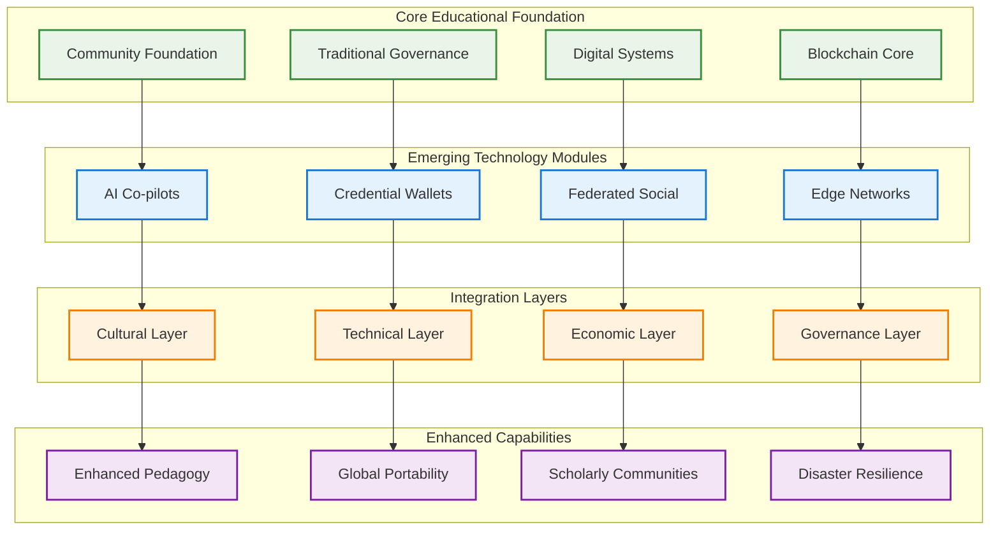

# Emerging Technology Integration: AI, Blockchain Credentials, Federated Social & Edge Networks
## Advanced Educational Sovereignty Through Optional Technology Modules

### Executive Summary: Modular Technology Enhancement Framework

This framework integrates four emerging technology modules into the educational blockchain roadmap as **optional enhancements** that can be adopted based on community readiness, cultural compatibility, and economic capacity. Each module builds on the foundation established in previous phases while providing specific educational and sovereignty benefits.



---

## 1. AI Co-pilots Integration: Culturally-Responsive Educational Intelligence

### Technical Implementation Framework

**Community-Controlled AI Infrastructure**:
```yaml
AI Co-pilot Architecture:
  On-Premises LLM Deployment:
    - Local inference servers using community-owned hardware
    - Llama 2/3 or equivalent open-source models fine-tuned for education
    - Kreyòl language model training using community-generated content
    - Offline-capable inference for network-independent operation
  
  Hybrid Cloud-Local Architecture:
    - Critical functions operate locally without internet dependency
    - Optional cloud APIs for advanced features when connectivity allows
    - Data sovereignty maintained through local processing priority
    - Community control over all AI training data and model weights
  
  Technical Specifications:
    - Hardware: NVIDIA RTX 4090 or equivalent (8GB+ VRAM)
    - Software: Ollama, LM Studio, or LocalAI for model serving
    - Integration: RESTful APIs connecting to existing educational platforms
    - Security: Air-gapped training environment for sensitive educational data
```

**Culturally-Responsive AI Development**:
```python
# Community-Controlled Educational AI System
class HaitianEducationalAI:
    def __init__(self):
        self.base_model = "llama-3-8b-instruct"
        self.cultural_knowledge = self.load_community_knowledge()
        self.educational_context = self.load_haitian_curriculum()
        self.traditional_pedagogies = self.load_traditional_teaching()
        
    def load_community_knowledge(self):
        """Load elder knowledge, cultural practices, traditional wisdom"""
        return {
            "agricultural_knowledge": self.load_from_elders("agriculture"),
            "cultural_practices": self.load_from_elders("culture"),
            "traditional_medicine": self.load_from_elders("healing"),
            "storytelling_methods": self.load_from_elders("education"),
            "conflict_resolution": self.load_from_elders("governance")
        }
    
    def generate_lesson_plan(self, subject, grade_level, cultural_context=True):
        """Generate culturally-appropriate lesson plans"""
        prompt = f"""
        Create a lesson plan for {subject} (Grade {grade_level}) that:
        1. Integrates Haitian cultural examples and context
        2. Uses traditional Haitian pedagogical approaches
        3. Includes community knowledge from elders
        4. Connects to local economic and social realities
        5. Preserves and celebrates Haitian identity
        6. Is taught primarily in Kreyòl with multilingual support
        
        Traditional Knowledge Integration: {self.cultural_knowledge}
        Community Context: {self.educational_context}
        """
        
        return self.generate_response(prompt, temperature=0.7)
    
    def administrative_assistant(self, task_type, context):
        """Reduce administrative burden on teachers"""
        templates = {
            "student_reports": self.generate_culturally_appropriate_reports,
            "parent_communication": self.generate_kreyol_communications,
            "curriculum_mapping": self.map_to_haitian_standards,
            "assessment_creation": self.create_culturally_relevant_assessments
        }
        
        return templates[task_type](context)
    
    def coding_curriculum_generator(self, experience_level, local_context):
        """Generate coding curricula relevant to Haitian economic development"""
        focus_areas = [
            "Agricultural technology and IoT",
            "Community platform development",
            "Mobile app development for local businesses",
            "Blockchain and cryptocurrency education",
            "Digital entrepreneurship and cooperative platforms",
            "Cultural preservation through technology"
        ]
        
        return self.create_project_based_curriculum(focus_areas, local_context)
```

### Cultural Integration and Safeguards

**Elder Knowledge Integration**:
```yaml
Traditional Wisdom + AI Framework:
  Knowledge Validation Process:
    - AI recommendations reviewed by elder councils before implementation
    - Traditional pedagogical methods prioritized over AI suggestions
    - Cultural appropriateness verification for all AI-generated content
    - Community veto power over AI recommendations affecting cultural transmission
  
  Collaborative Knowledge Building:
    - AI assists in documenting and organizing traditional knowledge
    - Elder storytellers work with AI to preserve oral traditions
    - Traditional teaching methods enhanced rather than replaced by AI
    - Intergenerational knowledge transfer supported through AI tools
  
  Language and Cultural Preservation:
    - AI trained primarily on Kreyòl language and Haitian cultural content
    - Traditional proverbs, metaphors, and cultural references integrated
    - AI supports rather than replaces human cultural transmission
    - Community maintains control over cultural knowledge representation
```

### Economic Implementation Model

**Phase-Based AI Integration Costs**:
```yaml
AI Implementation Economics:
  Phase 1: Basic AI Assistant (Year 2) - $8,000-15,000
    - Single GPU server for basic LLM inference
    - Pre-trained models adapted for educational tasks
    - Simple chatbot interface for teacher assistance
    - Community training on AI tool usage
    - ROI: 10-15 hours/week teacher time savings = $5,000-8,000 value
  
  Phase 2: Advanced Educational AI (Year 3) - $15,000-25,000
    - Upgraded hardware for larger model inference
    - Custom model fine-tuning on community educational content
    - Integration with existing educational platforms
    - AI-assisted curriculum development and assessment
    - ROI: 25-40 hours/week time savings = $12,000-20,000 value
  
  Phase 3: Community AI Hub (Year 4+) - $25,000-40,000
    - Multi-GPU cluster serving entire federated network
    - Custom Kreyòl language models and cultural knowledge integration
    - AI services provided to other educational institutions
    - Revenue generation through AI consulting and training
    - ROI: $30,000-50,000 annual revenue + internal efficiency gains
```

---

## 2. Blockchain-Based Credential Wallets: Global Educational Portability

### W3C Verifiable Credentials Implementation

**Community-Controlled Credential Infrastructure**:
```yaml
Credential Wallet Architecture:
  Technical Standards:
    - W3C Verifiable Credentials specification compliance
    - EBSI (European Blockchain Services Infrastructure) compatibility
    - Blockcerts implementation for Bitcoin/Ethereum anchoring
    - DID (Decentralized Identifier) integration for identity sovereignty
  
  Community Ownership Model:
    - Students control their own credential wallets with family oversight
    - Educational institutions issue verifiable credentials
    - Community validates non-formal learning and traditional knowledge
    - Employers and universities verify credentials without central authority
  
  Cultural Knowledge Credentials:
    - Traditional craft mastery certificates
    - Elder wisdom keeper recognitions
    - Community leadership and service credentials
    - Cultural preservation and transmission achievements
```

**Technical Implementation**:
```javascript
// Community-Controlled Credential System
class HaitianCredentialWallet {
    constructor(studentDID, familyGuardians) {
        this.studentDID = studentDID;
        this.familyGuardians = familyGuardians;
        this.credentials = new Map();
        this.culturalValidators = new Set();
        this.verificationHistory = [];
    }
    
    async issueAcademicCredential(institution, courseData, culturalContext) {
        const credential = {
            "@context": ["https://www.w3.org/2018/credentials/v1"],
            "type": ["VerifiableCredential", "HaitianEducationalCredential"],
            "issuer": institution.did,
            "issuanceDate": new Date().toISOString(),
            "credentialSubject": {
                "id": this.studentDID,
                "course": courseData.name,
                "grade": courseData.finalGrade,
                "culturalIntegration": culturalContext.traditionalKnowledge,
                "languageOfInstruction": "ht", // Kreyòl
                "communityValidation": await this.getCommunityValidation(courseData),
                "skills": courseData.demonstratedSkills,
                "culturalCompetencies": courseData.culturalLearning
            },
            "proof": await this.generateProof(institution, courseData)
        };
        
        // Require family consent for minor students
        if (await this.requiresFamilyConsent()) {
            credential.familyConsent = await this.getFamilyApproval();
        }
        
        // Community validation for cultural appropriateness
        credential.communityValidation = await this.validateCulturalAppropriateness(credential);
        
        this.credentials.set(credential.id, credential);
        await this.storeOnBlockchain(credential);
        
        return credential;
    }
    
    async issueCulturalCredential(elderTeacher, traditionalSkill, communityWitnesses) {
        const culturalCredential = {
            "@context": ["https://www.w3.org/2018/credentials/v1", "https://haiti.education/cultural/v1"],
            "type": ["VerifiableCredential", "TraditionalKnowledgeCredential"],
            "issuer": elderTeacher.did,
            "credentialSubject": {
                "id": this.studentDID,
                "traditionalSkill": traditionalSkill.name,
                "masteryLevel": traditionalSkill.level,
                "culturalSignificance": traditionalSkill.importance,
                "communityWitnesses": communityWitnesses.map(w => w.did),
                "ancestralLineage": traditionalSkill.knowledgeLineage,
                "practicalDemonstration": traditionalSkill.demonstrationEvidence
            },
            "proof": await this.generateCulturalProof(elderTeacher, communityWitnesses)
        };
        
        // Traditional ceremony validation
        culturalCredential.ceremonialValidation = await this.getCeremonyValidation();
        
        this.credentials.set(culturalCredential.id, culturalCredential);
        return culturalCredential;
    }
    
    async verifyCredentialForEmployer(credentialId, employerRequirements) {
        const credential = this.credentials.get(credentialId);
        
        // Verify cryptographic integrity
        const cryptographicValid = await this.verifyCryptographicSignature(credential);
        
        // Verify community validation
        const communityValid = await this.verifyCommunityStanding(credential);
        
        // Check cultural competency requirements
        const culturalMatch = this.assessCulturalCompetency(credential, employerRequirements);
        
        return {
            verified: cryptographicValid && communityValid,
            culturalCompetency: culturalMatch,
            skillsMatch: this.assessSkillsMatch(credential, employerRequirements),
            communityStanding: communityValid
        };
    }
}
```

### Global Portability and Recognition

**International Integration Framework**:
```yaml
Global Credential Recognition:
  European Integration:
    - EBSI compatibility for EU university admission
    - Europass Digital Credentials integration
    - Erasmus+ program compatibility for student mobility
    - EU Blue Card qualification recognition
  
  North American Recognition:
    - AACRAO (American Association of Collegiate Registrars) compatibility
    - Canadian credential recognition through CAPLA
    - US community college transfer credit systems
    - Professional certification body integration
  
  Caribbean Regional Network:
    - CARICOM Single Market and Economy skill recognition
    - Caribbean Examinations Council integration
    - University of the West Indies transfer credit
    - Regional professional qualification frameworks
  
  Cultural Competency Recognition:
    - Traditional knowledge credentials valued by cultural institutions
    - Diaspora community organization recognition
    - International development organization skill validation
    - Cultural preservation and heritage organization credentials
```

### Economic Benefits and Implementation

**Credential System Economics**:
```yaml
Implementation Costs and Revenue:
  Development Costs (Year 2-3): $20,000-35,000
    - Technical infrastructure and integration
    - W3C standard compliance development
    - Community training and adoption programs
    - International partnership development
  
  Operating Costs: $5,000-10,000 annually
    - Blockchain transaction and storage fees
    - System maintenance and security updates
    - International standard compliance monitoring
    - Community support and training programs
  
  Revenue Opportunities: $15,000-40,000 annually
    - Credential verification services for employers
    - International education partner integration fees
    - Professional certification and testing services
    - Diaspora education and credential transfer services
  
  Economic Benefits:
    - Students save $500-2,000 on credential verification costs
    - Employers reduce hiring verification costs by 60-80%
    - Educational institutions reduce administrative burden by 40%
    - Community generates revenue from traditional knowledge credentials
```

---

## 3. Federated Social Media: Scholarly Communities and Cultural Sovereignty

### Educational Social Network Architecture

**Community-Controlled Academic Networks**:
```yaml
Federated Platform Integration:
  Mastodon Educational Instances:
    - School-specific instances federating with educational network
    - Teacher professional development communities
    - Student academic discussion and collaboration
    - Parent-school communication and engagement
  
  PeerTube Educational Channels:
    - Lecture recording and distribution system
    - Student project showcases and portfolios
    - Traditional knowledge documentation and preservation
    - Community event streaming and cultural sharing
  
  Pixelfed Academic Portfolios:
    - Student artwork and project documentation
    - Scientific observation and experimentation records
    - Cultural event and community activity documentation
    - Traditional craft and skill demonstration galleries
  
  Lemmy Academic Forums:
    - Subject-specific discussion communities
    - Homework help and peer tutoring networks
    - Community problem-solving and project collaboration
    - Democratic decision-making for educational policies
```

**Cultural and Academic Integration**:
```javascript
// Federated Educational Social Network
class HaitianEducationalFediverse {
    constructor() {
        this.instances = {
            mastodon: new MastodonEducationalInstance(),
            peertube: new PeerTubeEducationalChannel(),
            pixelfed: new PixelfedAcademicPortfolio(),
            lemmy: new LemmyEducationalForums()
        };
        this.culturalModerators = new Set();
        this.academicModerators = new Set();
        this.communityGuidelines = this.loadCommunityGuidelines();
    }
    
    async createEducationalContent(contentType, creator, subject, culturalContext) {
        const content = {
            creator: creator,
            subject: subject,
            timestamp: new Date(),
            language: "ht", // Kreyòl primary
            culturalRelevance: culturalContext,
            educationalValue: await this.assessEducationalValue(contentType),
            communityApproval: "pending"
        };
        
        // Route to appropriate platform
        switch(contentType) {
            case "lecture":
                return await this.instances.peertube.uploadLecture(content);
            case "discussion":
                return await this.instances.mastodon.createEducationalPost(content);
            case "visual_project":
                return await this.instances.pixelfed.shareProject(content);
            case "forum_topic":
                return await this.instances.lemmy.createEducationalTopic(content);
        }
    }
    
    async moderateContent(contentId, moderationType) {
        const moderationTypes = {
            "cultural_appropriateness": this.culturalModerationReview,
            "academic_quality": this.academicModerationReview,
            "community_standards": this.communityStandardsReview,
            "traditional_knowledge": this.traditionalKnowledgeReview
        };
        
        return await moderationTypes[moderationType](contentId);
    }
    
    async facilitateScholarlyCommunity(subject, participants, culturalIntegration) {
        // Create cross-platform scholarly community
        const community = {
            mastodonGroup: await this.createMastodonStudyGroup(subject, participants),
            peertubeChannel: await this.createSubjectChannel(subject),
            lemmyForum: await this.createAcademicForum(subject),
            culturalIntegration: culturalIntegration
        };
        
        // Integrate traditional knowledge and cultural practices
        await this.integrateCulturalKnowledge(community, subject);
        
        return community;
    }
    
    async bridgeWithDiaspora(localCommunity, diasporaEducators) {
        // Connect local students with diaspora educators
        const bridge = {
            mentoringConnections: await this.createMentoringNetwork(localCommunity, diasporaEducators),
            culturalExchange: await this.facilitateCulturalExchange(localCommunity, diasporaEducators),
            academicSupport: await this.provideDiasporaAcademicSupport(localCommunity),
            professionalGuidance: await this.connectProfessionalNetworks(localCommunity, diasporaEducators)
        };
        
        return bridge;
    }
}
```

### Community Moderation and Cultural Protection

**Democratic Content Governance**:
```yaml
Community-Controlled Moderation:
  Cultural Moderation Council:
    - Elder knowledge holders review traditional knowledge sharing
    - Religious leaders assess moral and spiritual appropriateness
    - Community leaders evaluate social impact and cohesion
    - Traditional authorities maintain cultural authenticity standards
  
  Academic Quality Assurance:
    - Teacher peer review of educational content quality
    - Student feedback on learning effectiveness
    - Parent assessment of age-appropriateness
    - Community evaluation of local relevance
  
  Democratic Policy Development:
    - Community assemblies determine social media policies
    - Transparent voting on moderation guidelines
    - Regular review and adjustment of community standards
    - Appeals process for moderation decisions
  
  Technical Implementation:
    - Community-controlled server administration
    - Local content storage and backup systems
    - Federation policies determined democratically
    - Data sovereignty and privacy protection
```

---

## 4. Edge-Caching & Delay-Tolerant Networking: Disaster Resilience

### IPFS + Filecoin Educational Content Distribution

**Resilient Content Delivery Network**:
```yaml
Edge Network Architecture:
  IPFS Node Distribution:
    - Educational institution nodes for local content caching
    - Community nodes in homes and businesses
    - Mobile nodes for disaster response and connectivity
    - Satellite-connected nodes for backup internet access
  
  Content Distribution Strategy:
    - Critical educational content replicated across all nodes
    - Curriculum materials available offline indefinitely
    - Student records and portfolios distributed and encrypted
    - Community knowledge preserved across multiple locations
  
  Delay-Tolerant Features:
    - Store-and-forward messaging for intermittent connectivity
    - Automatic content synchronization when connections restore
    - Priority queuing for critical educational and emergency content
    - Mesh networking for local communication without internet
```

**Technical Implementation**:
```python
# Disaster-Resilient Educational Content Network
class ResilientEducationalNetwork:
    def __init__(self):
        self.ipfs_nodes = {}
        self.content_cache = {}
        self.priority_queues = {
            "emergency": [],
            "educational_critical": [],
            "educational_standard": [],
            "community_communication": []
        }
        self.mesh_network = MeshNetworkManager()
        
    async def cache_critical_content(self, content_type, content_data, priority_level):
        """Cache educational content across distributed nodes"""
        content_hash = await self.add_to_ipfs(content_data)
        
        # Replicate across multiple nodes based on priority
        replication_targets = self.calculate_replication_targets(priority_level)
        
        for node in replication_targets:
            await self.replicate_to_node(node, content_hash)
            
        # Pin content for permanent availability
        await self.pin_content(content_hash, priority_level)
        
        return content_hash
    
    async def handle_disaster_scenario(self, disaster_type, affected_nodes):
        """Maintain educational continuity during disasters"""
        
        # Activate emergency protocols
        await self.activate_emergency_mode()
        
        # Redistribute critical content from surviving nodes
        surviving_nodes = self.get_surviving_nodes(affected_nodes)
        critical_content = self.get_critical_educational_content()
        
        for content_hash in critical_content:
            await self.emergency_redistribute(content_hash, surviving_nodes)
        
        # Enable mesh networking for local communication
        await self.mesh_network.activate_emergency_mesh()
        
        # Prioritize educational continuity content
        self.priority_queues["emergency"] = self.get_educational_continuity_content()
        
        return await self.generate_disaster_response_plan()
    
    async def sync_when_connected(self, node_id, connection_quality):
        """Intelligent sync when intermittent connectivity restored"""
        
        # Assess available bandwidth and connection stability
        sync_strategy = self.calculate_sync_strategy(connection_quality)
        
        if connection_quality == "limited":
            # Sync only critical content
            await self.sync_priority_content(node_id, "emergency")
            await self.sync_priority_content(node_id, "educational_critical")
        elif connection_quality == "good":
            # Full sync of all educational content
            await self.full_educational_sync(node_id)
        
        # Update local content cache
        await self.update_local_cache(node_id)
        
        return sync_strategy
    
    async def maintain_offline_education(self, local_nodes, available_content):
        """Ensure educational continuity without internet"""
        
        # Create local educational network using mesh
        local_network = await self.mesh_network.create_local_education_mesh(local_nodes)
        
        # Distribute cached content across local network
        await self.distribute_cached_content(local_network, available_content)
        
        # Enable local communication and collaboration
        local_services = {
            "messaging": await self.enable_local_messaging(local_network),
            "file_sharing": await self.enable_local_file_sharing(local_network),
            "collaborative_editing": await self.enable_local_collaboration(local_network),
            "assessment_tools": await self.enable_offline_assessments(local_network)
        }
        
        return local_services
```

### Disaster Resilience and Educational Continuity

**Emergency Educational Protocols**:
```yaml
Disaster Response Framework:
  Pre-Disaster Preparation:
    - Critical curriculum cached on all local nodes
    - Student records encrypted and distributed
    - Emergency communication protocols established
    - Backup power systems (solar + battery) operational
  
  During Disaster Response:
    - Automatic activation of mesh networking
    - Priority content distribution to surviving nodes
    - Emergency communication channels for families
    - Minimal bandwidth educational content delivery
  
  Post-Disaster Recovery:
    - Automatic content synchronization when connectivity restored
    - Assessment of lost data and recovery procedures
    - Community coordination for educational restart
    - Integration of lessons learned into future preparation
  
  Educational Continuity Measures:
    - Offline educational content available indefinitely
    - Local mesh networking for classroom collaboration
    - Battery-powered devices for extended offline operation
    - Physical backup materials coordinated with digital systems
```

---

## 5. Integrated Implementation Roadmap

### Phase-Based Module Integration

**Phase 1 (Years 1-2): Foundation + Basic Modules**
```yaml
Core Foundation + Federated Social (Basic):
  Implementation:
    - Traditional educational systems with basic digital platforms
    - Simple Mastodon instance for school-community communication
    - Basic PeerTube for lecture recording and community events
    - Community-controlled social media policies and moderation
  
  Investment: $20,000-35,000
  Benefits:
    - Community communication and engagement platform
    - Cultural content sharing and preservation
    - Parent-school collaboration improvement
    - Student project showcase capabilities
```

**Phase 2 (Years 2-3): AI Integration + Enhanced Social**
```yaml
AI Co-pilots + Advanced Federated Social:
  Implementation:
    - Basic AI assistant for lesson planning and administrative tasks
    - Enhanced federated social platforms with academic integration
    - Cross-platform scholarly communities
    - Diaspora educator connection networks
  
  Investment: $35,000-60,000
  Benefits:
    - 15-25 hours/week teacher time savings through AI assistance
    - Enhanced academic collaboration and knowledge sharing
    - Diaspora professional mentorship networks
    - Cultural knowledge documentation and preservation
```

**Phase 3 (Years 3-4): Credentials + Edge Networks**
```yaml
Blockchain Credentials + IPFS Content Distribution:
  Implementation:
    - W3C verifiable credentials for students and community members
    - IPFS-based content distribution for educational materials
    - Edge caching for improved content delivery
    - Basic disaster resilience and offline capability
  
  Investment: $50,000-85,000
  Benefits:
    - Global credential portability and recognition
    - Improved content delivery and offline access
    - Enhanced disaster resilience for educational continuity
    - Revenue generation through credential verification services
```

**Phase 4 (Years 4-5): Full Integration + Advanced Capabilities**
```yaml
Complete Technology Integration:
  Implementation:
    - Advanced AI with custom Kreyòl models and cultural integration
    - Full credential ecosystem with traditional knowledge recognition
    - Comprehensive federated social learning communities
    - Complete disaster-resilient networking and content distribution
  
  Investment: $75,000-125,000
  Benefits:
    - Regional leadership in educational technology innovation
    - Comprehensive educational sovereignty and cultural preservation
    - Significant revenue generation through technology services
    - Complete disaster resilience and network independence
```

### Economic Analysis of Module Integration

**Comprehensive Cost-Benefit Analysis**:
```yaml
Total Investment Over 5 Years: $180,000-305,000
  - Core blockchain and traditional systems: $100,000-170,000
  - AI co-pilots and enhancement: $35,000-65,000
  - Credential systems and integration: $25,000-45,000
  - Federated social and edge networks: $20,000-25,000

Revenue Generation: $200,000-500,000 over 5 years
  - Educational services and consulting: $80,000-200,000
  - AI and technology services to other institutions: $50,000-150,000
  - Credential verification and international partnerships: $40,000-100,000
  - Cultural content licensing and traditional knowledge: $30,000-50,000

Net Economic Benefit: $20,000-195,000 profit
Plus immeasurable cultural sovereignty and educational quality improvements

Educational Impact Multiplication:
  - Traditional approach serves 1 institution with limited resources
  - Integrated approach serves 10-25 federated institutions
  - Technology services expand impact to 50+ institutions regionally
  - Cultural preservation and knowledge sharing benefits global Haitian diaspora
```

---

## 6. Technical Architecture Integration

### Unified Platform Architecture

**Integrated Technology Stack**:
```yaml
Infrastructure Layer:
  - Community-owned blockchain nodes
  - IPFS content distribution network
  - AI inference servers (local + cloud hybrid)
  - Federated social media instances
  - Edge caching and mesh networking

Application Layer:
  - Student Information System with blockchain credentials
  - AI-assisted learning and administrative platforms
  - Federated social learning communities
  - Traditional knowledge preservation and sharing systems
  - Emergency communication and disaster response tools

Integration Layer:
  - GraphQL federation gateway for unified API access
  - Single sign-on across all platforms using blockchain identity
  - Cross-platform content sharing and synchronization
  - Unified community governance and democratic decision-making
  - Cultural protection and traditional authority integration

User Interface Layer:
  - Voice-first, Kreyòl-primary interfaces
  - Mobile-optimized progressive web applications
  - Offline-capable applications with local data storage
  - Cultural metaphors and community-appropriate design
  - Multi-generational accessibility and usability
```

### Security and Privacy Framework

**Integrated Security Architecture**:
```yaml
Data Sovereignty:
  - All community data stored and processed locally
  - Blockchain-based identity and access management
  - End-to-end encryption for sensitive communications
  - Community-controlled data policies and access rules

Privacy Protection:
  - Zero-knowledge proofs for credential verification
  - Differential privacy for community analytics
  - Local AI processing to prevent data leakage
  - Community oversight of all data sharing and partnerships

Cultural Protection:
  - Traditional authority approval for cultural content sharing
  - Community-controlled intellectual property for traditional knowledge
  - Spiritual and ceremonial protection for sacred information
  - Democratic governance of all technology policies and changes
```

---

## 7. Community Adoption and Cultural Integration

### Module-Specific Cultural Considerations

**AI Co-pilots Cultural Integration**:
```yaml
Cultural Safeguards:
  - AI recommendations always reviewed by traditional authorities
  - Elder knowledge and wisdom prioritized over AI suggestions
  - Community control over AI training data and model behavior
  - Cultural values embedded in AI decision-making processes
  
Implementation Approach:
  - AI introduced as "assistant to elders and teachers" not replacement
  - Traditional teaching methods enhanced rather than replaced
  - Community ceremonies for AI system blessing and activation
  - Continuous cultural appropriateness monitoring and adjustment
```

**Credential Wallets Cultural Integration**:
```yaml
Traditional Knowledge Recognition:
  - Elder-issued credentials for traditional skills and knowledge
  - Community validation of cultural competency and wisdom
  - Spiritual credentials for traditional healing and guidance
  - Cultural leadership and community service recognition
  
Family and Community Control:
  - Parent/guardian oversight of student credentials
  - Community democratic decision-making on credential standards
  - Traditional authority approval for cultural knowledge credentials
  - Collective ownership concepts integrated with individual credentials
```

**Federated Social Cultural Integration**:
```yaml
Community Moderation:
  - Elder councils and religious leaders as cultural moderators
  - Traditional conflict resolution for social media disputes
  - Community assemblies for social media policy development
  - Cultural celebration and traditional event integration
  
Content Guidelines:
  - Community-determined standards for appropriate content
  - Traditional values and spiritual considerations in moderation
  - Cultural knowledge sharing protocols and permissions
  - Intergenerational communication facilitation and support
```

---

## Conclusion: Enhanced Educational Sovereignty Through Optional Technology Integration

### Strategic Technology Adoption Framework

This modular approach enables communities to:

1. **Build Strong Foundations First** - Establish democratic governance, cultural integration, and economic sustainability before adding complex technologies

2. **Add Technologies Based on Readiness** - Each module can be adopted independently based on community capacity, cultural compatibility, and economic resources

3. **Maintain Community Control** - All technologies serve community priorities and values rather than imposing external technological requirements

4. **Generate Economic Benefits** - Each module provides revenue opportunities and cost savings while building toward comprehensive sustainability

5. **Preserve and Enhance Culture** - Technologies actively support cultural preservation, traditional knowledge sharing, and community identity strengthening

### Implementation Success Factors

**Communities should adopt these modules only when:**
- Strong democratic governance and cultural integration already established
- Economic foundation provides sustainable revenue and emergency reserves
- Technical capacity exists for operation and maintenance
- Community consensus supports specific technology adoption
- Traditional authorities approve and integrate with technology decisions

**The modular approach ensures that communities can achieve 85-95% of educational sovereignty goals through the core blockchain and traditional systems foundation, with emerging technologies providing additional enhancements based on specific community needs, capacities, and cultural compatibility.**

This framework demonstrates that cutting-edge educational technology can serve community sovereignty and cultural preservation when implemented with genuine community control, democratic governance, and respect for traditional wisdom and authority structures.