# FediFlow Academic Ecosystem: Comprehensive Community Services & Use Cases

## 1. Core Community Services Architecture

### 1.1 Community Creation & Management Engine

#### Automated Community Provisioning
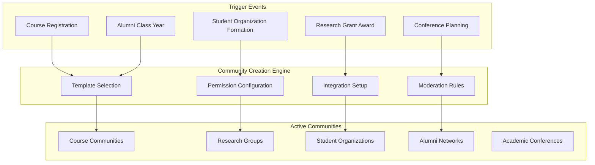

**Community Types & Specifications:**

**Academic Course Communities**
- **Automatic Creation**: Triggered by course registration in SIS
- **Membership**: Auto-enrolled students, faculty, TAs
- **Lifecycle**: Follows academic calendar (creation, active period, archive)
- **Features**: Assignment discussions, study groups, resource sharing
- **Integration**: Canvas/Blackboard LMS, gradebook sync, attendance tracking
- **Privacy**: FERPA-compliant student record protection
- **Moderation**: Professor oversight, TA moderation, academic integrity monitoring

**Research Collaboration Communities**
- **Creation Triggers**: Grant applications, research project initiation, publication collaboration
- **Membership**: Principal investigators, co-investigators, graduate students, lab members
- **Features**: Data sharing, methodology discussions, publication collaboration
- **Integration**: Research management systems, grant tracking, publication databases
- **Security**: IRB compliance, intellectual property protection, secure data sharing
- **Cross-Institutional**: Federation with partner universities and research institutions

**Student Organization Communities**
- **Creation Process**: Student petition, advisor approval, constitution submission
- **Governance**: Officer roles, election systems, budget tracking
- **Features**: Event planning, member recruitment, communication channels
- **Integration**: Campus event management, budget systems, student affairs
- **Oversight**: Advisor monitoring, institutional policy compliance

### 1.2 Advanced Community Intelligence

#### AI-Powered Community Health Monitoring
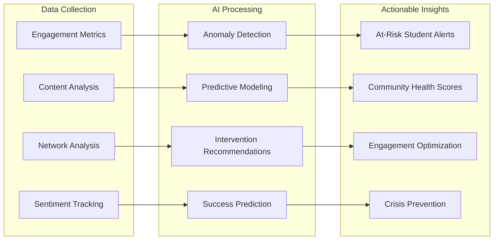

**Community Health Metrics:**
- **Engagement Velocity**: Post frequency, response times, interaction depth
- **Network Density**: Connection patterns, influence mapping, collaboration frequency
- **Content Quality**: Academic relevance, resource sharing, knowledge creation
- **Member Satisfaction**: Sentiment analysis, feedback scores, retention rates
- **Goal Achievement**: Learning outcomes, research progress, event success

---

## 2. Comprehensive Academic Use Cases

### 2.1 Student Lifecycle Management

#### Prospective Student Journey

**Virtual Campus Discovery Community**
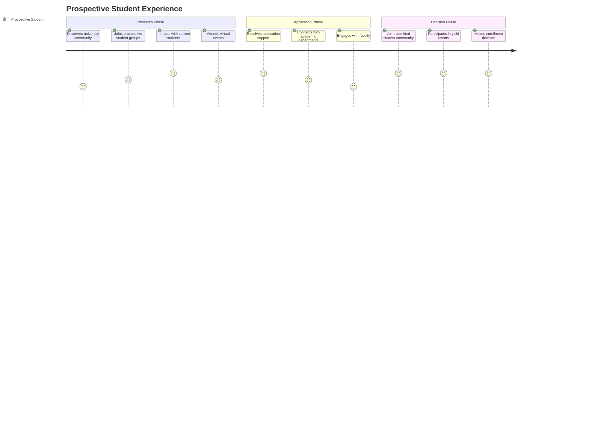

**Use Case: International Student Recruitment**
- **Community Setup**: Country-specific recruitment communities with cultural liaisons
- **Services Provided**:
  - Multilingual support communities (Spanish, Mandarin, Arabic, Hindi, French)
  - Cultural integration workshops and discussions
  - Visa and immigration guidance communities
  - Pre-arrival academic preparation groups
  - Local student ambassador connections
- **Integration**: Immigration services, international student office, academic advising
- **Success Metrics**: Application conversion rates, enrollment confirmations, student satisfaction

**Use Case: Graduate Program Recruitment**
- **Community Setup**: Department-specific graduate communities with faculty research showcasing
- **Services Provided**:
  - Research interest matching with faculty
  - Graduate student mentor connections
  - Funding opportunity discussions
  - Application process guidance
  - Virtual lab tours and research presentations
- **Integration**: Graduate school systems, research databases, funding trackers
- **Success Metrics**: Application quality, program fit, research productivity

#### Current Student Engagement & Success

**Academic Support Ecosystem**
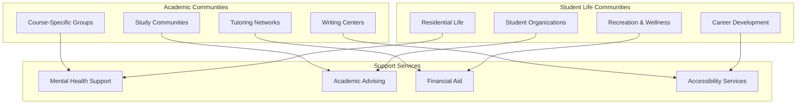

**Use Case: First-Year Experience Communities**
- **Community Setup**: Cohort-based first-year communities with peer mentors
- **Services Provided**:
  - Orientation and transition support
  - Academic skill development workshops
  - Social integration activities
  - Campus resource navigation
  - Peer mentor matching and support
  - Parent and family engagement
- **Integration**: Academic advising, residence life, student affairs
- **Success Metrics**: Retention rates, GPA improvement, satisfaction scores, social integration

**Use Case: STEM Student Success Initiative**
- **Community Setup**: Discipline-specific STEM communities with academic support
- **Services Provided**:
  - Study group formation and coordination
  - Peer tutoring networks
  - Research opportunity discovery
  - Industry mentor connections
  - Graduate school preparation
  - Diversity and inclusion programming
- **Integration**: STEM departments, career services, research offices
- **Success Metrics**: Course completion rates, research participation, career placement

**Use Case: At-Risk Student Intervention**
- **Community Setup**: Confidential support communities with counseling integration
- **Services Provided**:
  - Early warning system alerts
  - Peer support group facilitation
  - Academic intervention coordination
  - Mental health resource connections
  - Financial aid counseling
  - Success coaching and mentoring
- **Integration**: Student information systems, counseling services, academic advising
- **Success Metrics**: Intervention success rates, student retention, academic improvement

#### Student Organization & Leadership Development

**Comprehensive Organization Management**
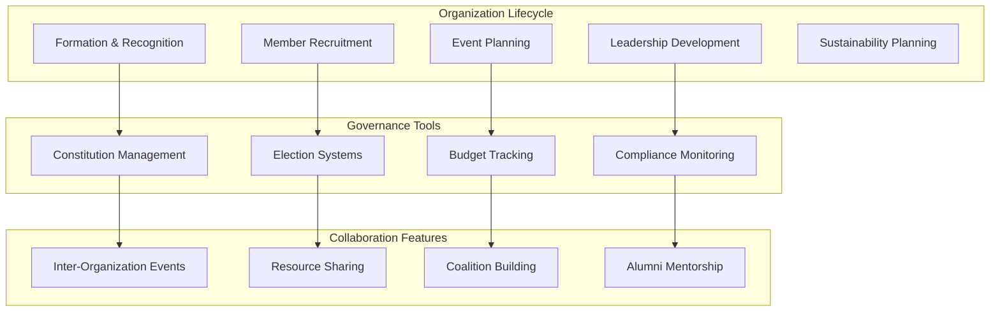

**Use Case: Student Government Digital Democracy**
- **Community Setup**: Campus-wide student government community with democratic tools
- **Services Provided**:
  - Digital voting and election management
  - Policy discussion and debate forums
  - Budget transparency and input collection
  - Campus issue reporting and resolution
  - Student feedback aggregation and analysis
  - Administrative communication and updates
- **Integration**: University administration, budget systems, policy databases
- **Success Metrics**: Voter participation, policy engagement, issue resolution rates

**Use Case: Greek Life Community Management**
- **Community Setup**: Chapter-specific communities with inter-Greek collaboration
- **Services Provided**:
  - Recruitment and rush management
  - Event coordination and promotion
  - Risk management and safety protocols
  - Alumni engagement and mentorship
  - Academic achievement tracking
  - Community service coordination
- **Integration**: Greek life office, risk management, alumni relations
- **Success Metrics**: Membership retention, academic performance, safety compliance

### 2.2 Faculty Research & Collaboration

#### Cross-Institutional Research Networks

**Research Collaboration Ecosystem**
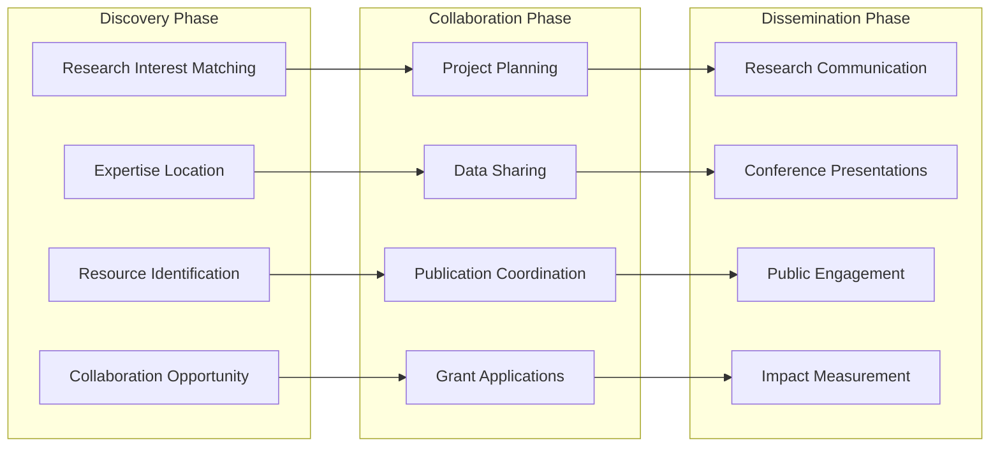

**Use Case: Interdisciplinary Research Communities**
- **Community Setup**: Theme-based research communities crossing traditional disciplines
- **Services Provided**:
  - Researcher discovery and matching
  - Methodology sharing and consultation
  - Equipment and resource sharing
  - Joint funding opportunity identification
  - Collaborative publication support
  - Conference and symposium coordination
- **Integration**: Research databases, funding systems, publication platforms
- **Success Metrics**: Collaboration frequency, grant success rates, publication impact

**Use Case: Global Research Partnership Networks**
- **Community Setup**: International research communities with federated university connections
- **Services Provided**:
  - Cross-border collaboration facilitation
  - Cultural and regulatory guidance
  - Translation and communication support
  - Time zone coordination tools
  - Virtual research exchange programs
  - International conference coordination
- **Integration**: International offices, research administration, legal compliance
- **Success Metrics**: International partnerships, global research impact, student exchanges

#### Research Impact & Communication

**Research Dissemination Platform**
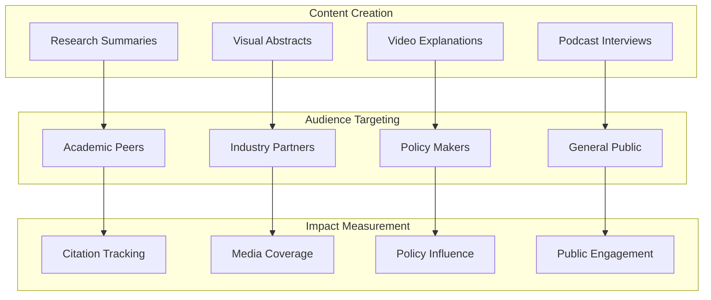

**Use Case: Public Scholarship Initiative**
- **Community Setup**: Public-facing research communication communities
- **Services Provided**:
  - Plain language research translation
  - Media training and support
  - Public lecture coordination
  - Community engagement events
  - Policy briefing development
  - Social impact storytelling
- **Integration**: Media relations, community outreach, policy offices
- **Success Metrics**: Media mentions, public engagement, policy citations

### 2.3 Alumni Engagement & Advancement

#### Lifetime Alumni Community Platform

**Alumni Lifecycle Management**
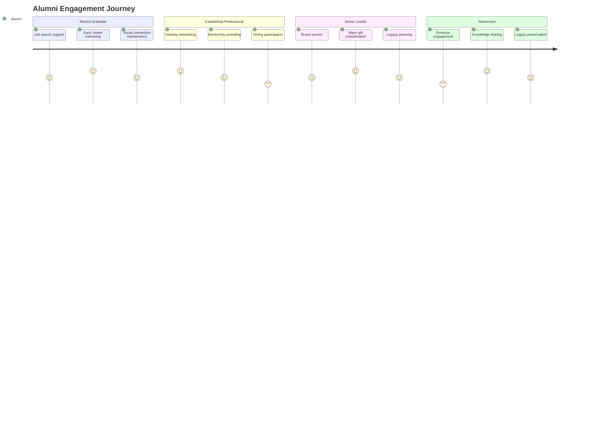

**Use Case: Alumni Career Network Platform**
- **Community Setup**: Industry and geographic alumni communities with professional focus
- **Services Provided**:
  - Job posting and recruitment support
  - Mentorship matching and coordination
  - Industry insight sharing
  - Professional development workshops
  - Business networking events
  - Career transition support
- **Integration**: Career services, HR systems, professional databases
- **Success Metrics**: Job placement rates, mentorship satisfaction, network growth

**Use Case: Alumni Giving & Stewardship**
- **Community Setup**: Donor communities organized by giving level and interest areas
- **Services Provided**:
  - Impact storytelling and updates
  - Giving opportunity presentation
  - Stewardship and recognition
  - Major gift cultivation
  - Planned giving education
  - Legacy society engagement
- **Integration**: Advancement systems, financial platforms, recognition programs
- **Success Metrics**: Giving participation, donation amounts, donor retention

### 2.4 Academic Conference & Event Management

#### Comprehensive Conference Platform

**Conference Lifecycle Management**
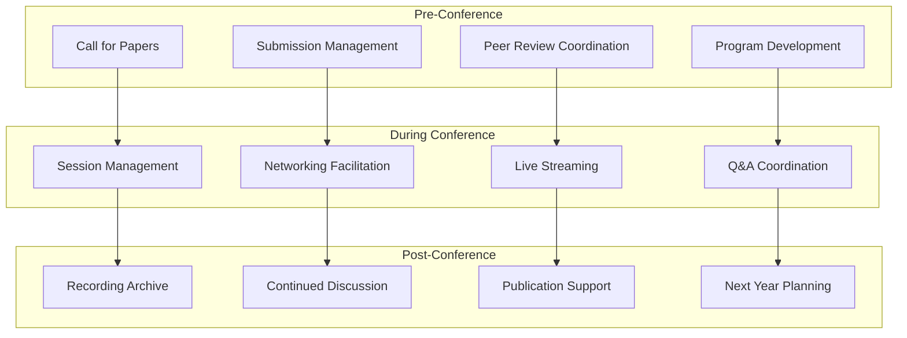

**Use Case: Hybrid Academic Conference Management**
- **Community Setup**: Conference-specific communities with hybrid participation
- **Services Provided**:
  - Virtual and in-person session coordination
  - Interactive poster session management
  - Networking event facilitation
  - Real-time translation services
  - Accessibility accommodation
  - Continuing education credit tracking
- **Integration**: Conference management systems, video platforms, translation services
- **Success Metrics**: Attendance rates, engagement levels, satisfaction scores

---

## 3. Advanced Service Offerings

### 3.1 AI-Powered Academic Services

#### Intelligent Content & Learning Support

**Academic AI Assistant Suite**
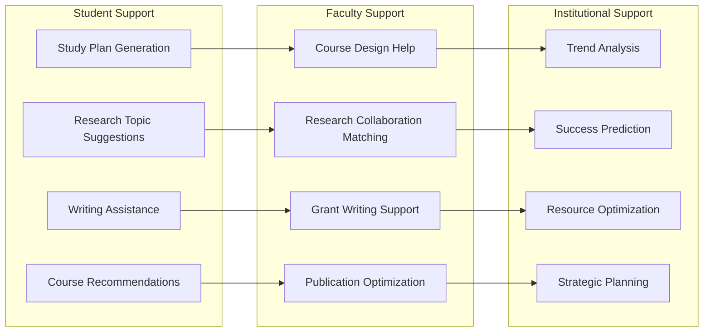

**Service: Predictive Academic Analytics**
- **Capabilities**:
  - Student success prediction and intervention recommendations
  - Faculty research impact forecasting
  - Alumni giving potential assessment
  - Enrollment trend analysis and optimization
  - Course demand prediction and scheduling
  - Resource allocation optimization
- **Implementation**: Machine learning models trained on institutional data
- **Privacy**: FERPA-compliant data processing with anonymization
- **ROI**: $500K-2M annual value from improved outcomes

**Service: Automated Academic Content Generation**
- **Capabilities**:
  - Course material summarization and adaptation
  - Research abstract generation and optimization
  - Social media content creation for academic purposes
  - Newsletter and communication drafting
  - Translation services for international collaboration
  - Accessibility content adaptation
- **Implementation**: GPT-4o integration with academic fine-tuning
- **Quality Control**: Faculty review and approval workflows
- **ROI**: $200K-800K annual value from efficiency gains

### 3.2 Research Excellence Services

#### Comprehensive Research Support Platform

**Research Lifecycle Management**
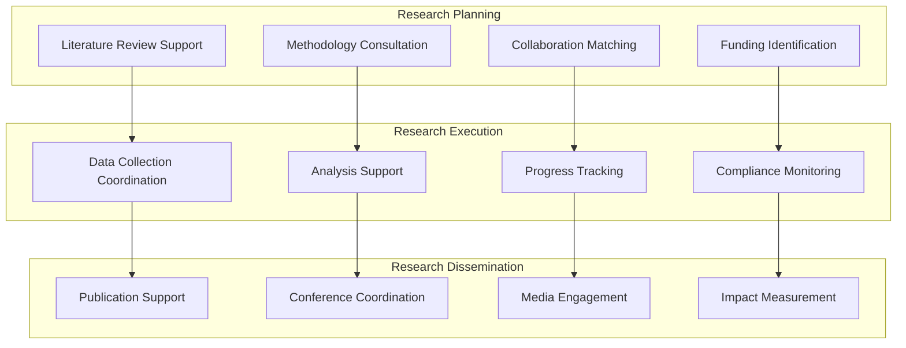

**Service: Research Impact Amplification**
- **Capabilities**:
  - Strategic research communication planning
  - Media relations and press release coordination
  - Public engagement event planning
  - Policy maker outreach and briefings
  - Industry partnership facilitation
  - Citation and impact tracking
- **Implementation**: Professional communication teams with academic expertise
- **Success Metrics**: Media coverage, citation rates, policy influence
- **ROI**: $1M-5M annual value from increased research impact

**Service: Grant Application Support Ecosystem**
- **Capabilities**:
  - Funding opportunity identification and matching
  - Collaborative grant application coordination
  - Proposal writing support and review
  - Budget development and compliance
  - Submission tracking and management
  - Post-award administration support
- **Implementation**: Grant writing experts with institutional knowledge
- **Success Metrics**: Application quality, success rates, funding amounts
- **ROI**: $2M-20M annual value from increased grant success

### 3.3 Student Success Services

#### Comprehensive Student Support Ecosystem

**Holistic Student Success Platform**
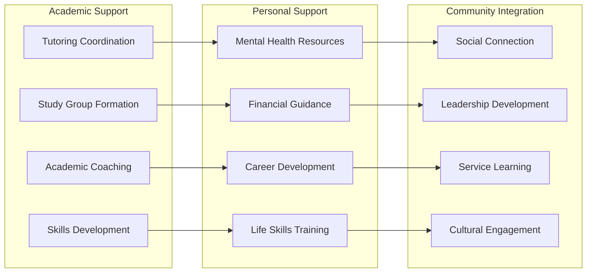

**Service: Comprehensive Student Retention Program**
- **Capabilities**:
  - Early warning system implementation
  - Intervention strategy development
  - Peer support network creation
  - Academic skill development programming
  - Social integration facilitation
  - Success coaching and mentoring
- **Implementation**: Data-driven intervention with human support
- **Success Metrics**: Retention rates, academic performance, satisfaction
- **ROI**: $1M-10M annual value from improved retention

**Service: Career Development & Alumni Network Integration**
- **Capabilities**:
  - Career exploration and planning support
  - Internship and job placement coordination
  - Professional skill development workshops
  - Alumni mentor matching and management
  - Industry connection facilitation
  - Graduate school preparation support
- **Implementation**: Career services integration with alumni networks
- **Success Metrics**: Job placement rates, salary outcomes, alumni engagement
- **ROI**: $500K-5M annual value from improved career outcomes

### 3.4 Alumni Advancement Services

#### Sophisticated Alumni Engagement Platform

**Alumni Lifecycle Value Creation**
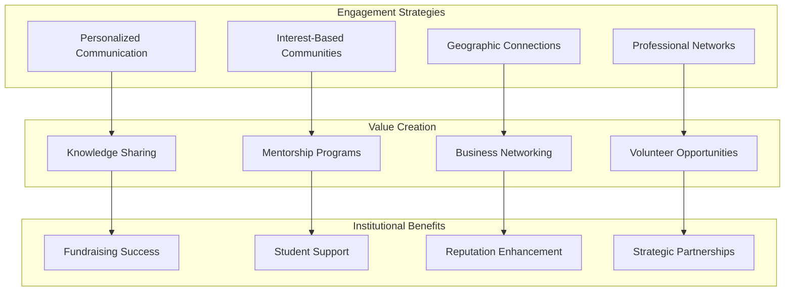

**Service: Advanced Alumni Giving Strategy**
- **Capabilities**:
  - Donor prospect identification and research
  - Personalized cultivation strategies
  - Impact storytelling and stewardship
  - Major gift campaign coordination
  - Planned giving program development
  - Recognition and appreciation events
- **Implementation**: Professional fundraising teams with alumni insights
- **Success Metrics**: Giving participation, donation amounts, donor satisfaction
- **ROI**: $5M-50M annual value from increased giving

**Service: Alumni Business Network Development**
- **Capabilities**:
  - Alumni business directory creation and maintenance
  - Business networking event coordination
  - Partnership opportunity identification
  - Economic impact measurement and reporting
  - Corporate engagement and sponsorship
  - Procurement and vendor connection facilitation
- **Implementation**: Business development professionals with alumni relations
- **Success Metrics**: Business connections, economic impact, corporate partnerships
- **ROI**: $2M-20M annual value from business network development

---

## 4. Implementation Strategy & Service Delivery

### 4.1 Phased Implementation Approach

#### Academic Service Implementation Timeline
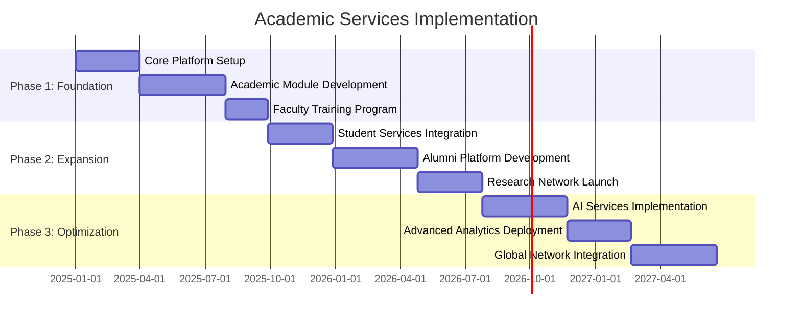

### 4.2 Success Metrics & ROI Framework

#### Comprehensive Academic ROI Model
```mermaid
graph TD
    subgraph "Student Success ROI"
        SS_ROI1[3-7% Retention Improvement]
        SS_ROI2[$500K-2M Early Warning Value]
        SS_ROI3[15% Academic Performance Gain]
        SS_ROI4[$300K-1.2M Career Services Value]
    end
    
    subgraph "Research Impact ROI"
        RI_ROI1[300% Research Visibility Increase]
        RI_ROI2[50% Collaboration Growth]
        RI_ROI3[25% Grant Success Improvement]
        RI_ROI4[$2M-20M Funding Increase]
    end
    
    subgraph "Alumni Engagement ROI"
        AE_ROI1[200% Engagement Increase]
        AE_ROI2[30% Giving Growth]
        AE_ROI3[$5M-50M Fundraising Impact]
        AE_ROI4[300% Volunteer Participation]
    end
    
    subgraph "Total Institutional ROI"
        T_ROI[500-1000% 5-Year ROI]
    end
    
    SS_ROI1 --> T_ROI
    SS_ROI2 --> T_ROI
    RI_ROI1 --> T_ROI
    RI_ROI2 --> T_ROI
    AE_ROI1 --> T_ROI
    AE_ROI2 --> T_ROI
```

**Year 1 Academic Value Realization**:
- Student recruitment cost reduction: $200K-800K
- Faculty research collaboration: $500K-2M value
- Alumni engagement improvement: $1M-5M impact
- Operational efficiency gains: $300K-1.2M savings

**Years 2-5 Cumulative Value**:
- Research funding increases: $10M-100M
- Endowment growth acceleration: $25M-250M
- Competitive positioning value: Immeasurable strategic advantage
- Brand value enhancement: Long-term institutional reputation

### 4.3 Quality Assurance & Continuous Improvement

#### Academic Excellence Monitoring
- **Student Success Tracking**: Real-time analytics on academic performance correlation
- **Faculty Satisfaction Measurement**: Regular surveys and engagement assessment
- **Alumni Relationship Quality**: Long-term engagement and giving trend analysis
- **Research Impact Assessment**: Citation tracking and collaboration success measurement
- **Institutional Reputation Monitoring**: Media coverage and ranking impact analysis

This comprehensive academic ecosystem transforms universities into digitally-native institutions where every stakeholder participates in an authentic, data-driven community that delivers measurable improvements in education, research, and institutional advancement while maintaining complete control over their digital presence and community engagement.

<!-- AUTO-GENERATED RELATED START (scripts/build_obsidian_graph.py) -->

## Related (auto-generated)

**Topics:**
- [[knowledge-base/_topics/digital-community-participation-platforms|digital-community-participation-platforms]]

**Consolidated into:**
- [[docs/DC-DIGITAL-COMMUNITY-PARTICIPATION-PLATFORMS-RECONCILED-001]]

<!-- AUTO-GENERATED RELATED END -->
